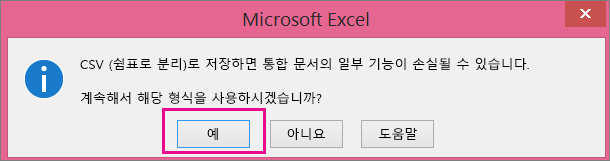

# <a name="add-several-users-at-the-same-time-to-office-365---admin-help"></a><span data-ttu-id="85572-105">동시에 여러 사용자를 Office 365에 추가 - 관리자 도움말</span><span class="sxs-lookup"><span data-stu-id="85572-105">Add several users at the same time to Office 365 - Admin Help</span></span>

<span data-ttu-id="85572-p102">팀의 각 구성원이 전자 메일 및 Office와 같은 Office 365 서비스에 로그인 및 액세스하려면 사용자 계정이 있어야 합니다. 사용자가 많은 경우 Excel 스프레드시트 또는 CSV 형식으로 저장된 다른 파일에서 모든 계정을 한 번에 추가할 수 있습니다. [CSV 형식이란?](add-several-users-at-the-same-time.md#__toc316652088)</span><span class="sxs-lookup"><span data-stu-id="85572-p102">Each person on your team needs a user account before they can sign in and access Office 365 services, such as email and Office. If you have a lot of people, you can add their accounts all at once from an Excel spreadsheet or other file saved in CSV format. [Not sure what CSV format is?](add-several-users-at-the-same-time.md#__toc316652088)</span></span>
  
> [!NOTE] 
> <span data-ttu-id="85572-109">새로운 Microsoft 365 관리 센터를 사용하지 않는 경우 홈페이지 상단에 있는 **새 관리 센터 시도** 토글을 선택하여 켤 수 있습니다.</span><span class="sxs-lookup"><span data-stu-id="85572-109">If you're not using the new Microsoft 365 admin center, you can turn it on by selecting the **Try the new admin center** toggle located at the top of the Home page.</span></span>

## <a name="add-multiple-users-to-office-365-in-the-microsoft-365-admin-center"></a><span data-ttu-id="85572-110">Microsoft 365 관리 센터에서 여러 사용자를 Office 365에 추가</span><span class="sxs-lookup"><span data-stu-id="85572-110">Add multiple users to Office 365 in the Microsoft 365 admin center</span></span>

1. <span data-ttu-id="85572-111">회사 또는 학교 계정을 사용하여 Office 365에 로그인합니다.</span><span class="sxs-lookup"><span data-stu-id="85572-111">Sign in to Office 365 with your work or school account.</span></span> 
    
2. <span data-ttu-id="85572-112">관리 센터에서 **사용자** \> **활성 사용자**를 선택합니다.</span><span class="sxs-lookup"><span data-stu-id="85572-112">In the admin center, choose **Users** \> **Active users**.</span></span>

3. <span data-ttu-id="85572-113">**여러 사용자 추가**를 선택 합니다.</span><span class="sxs-lookup"><span data-stu-id="85572-113">Select **Add multiple users**.</span></span>

4. <span data-ttu-id="85572-114">
            **여러 사용자 가져오기\*\* 패널에서 예제 데이터가 입력되어 있는 예제 CSV 파일과 입력되어 있지 않은 예제 CSV 파일 중 선택하여 다운로드할 수 있습니다.</span><span class="sxs-lookup"><span data-stu-id="85572-114">On the **Import multiple users** panel, you can optionally download a sample CSV file with or without sample data filled in.</span></span> 
    
    <span data-ttu-id="85572-115">스프레드시트는 **정확히 동일한 열 머리글** 을 예제(사용자 이름, 성 등...)로 포함해야 합니다. 서식 파일을 사용하는 경우에는 메모장과 같은 텍스트 편집 도구에서 열어서 행 1에 있는 모든 데이터는 그대로 두고 행 2와 그 아래 행에만 데이터를 입력해 보세요.</span><span class="sxs-lookup"><span data-stu-id="85572-115">Your spreadsheet needs to include the **exact same column headings** as the sample one (User Name, First Name, etc...). If you use the template, open it in a text editing tool, like Notepad, and consider leaving all the data in row 1 alone, and only entering data in rows 2 and below.</span></span> 
    
    <span data-ttu-id="85572-116">스프레드시트는 사용자 이름(예: hyunki@contoso.com)과 각 사용자에 대한 표시 이름(예: 유현기)에 대한 값도 포함해야 합니다.</span><span class="sxs-lookup"><span data-stu-id="85572-116">Your spreadsheet also needs to include values for the user name (like bob@contoso.com) and a display name (like Bob Kelly) for each user.</span></span> 
    
  ```
  User Name,First Name,Last Name,Display Name,Job Title,Department,Office Number,Office Phone,Mobile Phone,Fax,Address,City,State or Province,ZIP or Postal Code,Country or Region
  chris@contoso.com,Chris,Green,Chris Green,IT Manager,Information Technology,123451,123-555-1211,123-555-6641,123-555-9821,1 Microsoft way,Redmond,Wa,98052,United States
  ben@contoso.com,Ben,Andrews,Ben Andrews,IT Manager,Information Technology,123452,123-555-1212,123-555-6642,123-555-9822,1 Microsoft way,Redmond,Wa,98052,United States
  david@contoso.com,David,Longmuir,David Longmuir,IT Manager,Information Technology,123453,123-555-1213,123-555-6643,123-555-9823,1 Microsoft way,Redmond,Wa,98052,United States
  cynthia@contoso.com,Cynthia,Carey,Cynthia Carey,IT Manager,Information Technology,123454,123-555-1214,123-555-6644,123-555-9824,1 Microsoft way,Redmond,Wa,98052,United States
  melissa@contoso.com,Melissa,MacBeth,Melissa MacBeth,IT Manager,Information Technology,123455,123-555-1215,123-555-6645,123-555-9825,1 Microsoft way,Redmond,Wa,98052,United States
  
  ```

5. <span data-ttu-id="85572-117">상자에 파일 경로를 입력하거나 **찾아보기**를 선택하여 CSV 파일의 위치를 찾은 다음 **확인**을 선택합니다.</span><span class="sxs-lookup"><span data-stu-id="85572-117">Enter a file path into the box, or choose **Browse** to browse to the CSV file location, then choose **Verify**.</span></span>
  
    <span data-ttu-id="85572-p103">파일에 문제가 있는 경우에는 문제가 창에 표시됩니다. 로그 파일을 다운로드할 수도 있습니다.</span><span class="sxs-lookup"><span data-stu-id="85572-p103">If there are problems with the file, the problem is displayed in the panel. You can also download a log file.</span></span>
    
5. <span data-ttu-id="85572-120">
            \*\*Set user options\*\*(사용자 옵션 설정) 대화 상자에서는 로그인 상태를 설정하고 모든 사용자에게 할당할 제품 라이선스를 선택할 수 있습니다.</span><span class="sxs-lookup"><span data-stu-id="85572-120">On the **Set user options** dialog you can set the sign-in status and choose the product license that will be assigned to all users.</span></span> 
    
6. <span data-ttu-id="85572-121">
            \*\*View your result\*\*(결과 보기) 대화 상자에서는 결과를 자신이나 다른 사용자(암호는 일반 텍스트가 됨)에 보내도록 선택할 수 있으며, 만들어진 사용자의 수와 새 사용자에게 할당하기 위해 추가 라이선스를 구입해야 하는지를 알 수도 있습니다.</span><span class="sxs-lookup"><span data-stu-id="85572-121">On the **View your result** dialog you can choose to send the results to either yourself or other users (passwords will be in plain text) and you can see how many users were created, and if you need to purchase more licenses to assign to some of the new users.</span></span> 
    
## <a name="watch-the-video"></a><span data-ttu-id="85572-122">비디오 보기</span><span class="sxs-lookup"><span data-stu-id="85572-122">Watch the video</span></span>
<span data-ttu-id="85572-123"><a name="bk_preview"> </a></span><span class="sxs-lookup"><span data-stu-id="85572-123"></span></span>

 <span data-ttu-id="85572-124">많은 사용자를 추가하는 방법을 보여 주는 짧은 비디오를 보세요.</span><span class="sxs-lookup"><span data-stu-id="85572-124">Watch a short video that shows you how to bulk add users.</span></span> 
  
> [!VIDEO https://www.microsoft.com/videoplayer/embed/f4e7f161-8ae6-4264-a429-9297b539a8de?autoplay=false]
  
## <a name="next-steps"></a><span data-ttu-id="85572-125">다음 단계</span><span class="sxs-lookup"><span data-stu-id="85572-125">Next steps</span></span>
<span data-ttu-id="85572-126"><a name="bk_preview"> </a></span><span class="sxs-lookup"><span data-stu-id="85572-126"></span></span>

- <span data-ttu-id="85572-127">이제 이 사용자에게 계정이 있으므로 [PC 또는 Mac에 Office 365 또는 Office 2016를 다운로드하여 설치하거나 다시 설치](https://support.office.com/article/4414eaaf-0478-48be-9c42-23adc4716658)해야 합니다.</span><span class="sxs-lookup"><span data-stu-id="85572-127">Now that these people have accounts, they need to [Download and install or reinstall Office 365 or Office 2016 on a PC or Mac](https://support.office.com/article/4414eaaf-0478-48be-9c42-23adc4716658).</span></span> <span data-ttu-id="85572-128">팀의 각 사용자는 최대 5대의 PC 또는 Mac에 Office 365를 설치할 수 있습니다.</span><span class="sxs-lookup"><span data-stu-id="85572-128">Each person on your team can install Office 365 on up to 5 PCs or Macs.</span></span> 
    
- <span data-ttu-id="85572-129">각 사용자는 iPhones, iPads 및 Android 휴대폰 및 태블릿과 같은 최대 5대의 태블릿과 5대의 휴대폰에서 [모바일 장치의 Office 앱 및 전자 메일을 설정](https://support.office.com/article/7dabb6cb-0046-40b6-81fe-767e0b1f014f)할 수도 있습니다.</span><span class="sxs-lookup"><span data-stu-id="85572-129">Each person can also [Set up Office apps and email on a mobile device](https://support.office.com/article/7dabb6cb-0046-40b6-81fe-767e0b1f014f) on up to 5 tablets and 5 phones, such as iPhones, iPads, and Android phones and tablets.</span></span> <span data-ttu-id="85572-130">이 방법으로 어디서나 Office 파일을 편집할 수 있습니다.</span><span class="sxs-lookup"><span data-stu-id="85572-130">This way they can edit Office files from anywhere.</span></span> 
    
    <span data-ttu-id="85572-131">포괄적인 설치 단계를 보려면 [Office 365 비즈니스 에디션 설정](https://support.office.com/article/6a3a29a0-e616-4713-99d1-15eda62d04fa)을 참조하세요.</span><span class="sxs-lookup"><span data-stu-id="85572-131">See [Set up Office 365 for business](https://support.office.com/article/6a3a29a0-e616-4713-99d1-15eda62d04fa) for an end-to-end list of the setup steps.</span></span> 
    
## <a name="more-information-about-how-to-add-users-to-office-365"></a><span data-ttu-id="85572-132">Office 365에 사용자를 추가하는 방법에 대한 자세한 정보</span><span class="sxs-lookup"><span data-stu-id="85572-132">More information about how to add users to Office 365</span></span>
<span data-ttu-id="85572-133"><a name="bk_preview"> </a></span><span class="sxs-lookup"><span data-stu-id="85572-133"></span></span>

### <a name="not-sure-what-csv-format-is"></a><span data-ttu-id="85572-134">CSV 형식이란?</span><span class="sxs-lookup"><span data-stu-id="85572-134">Not sure what CSV format is?</span></span>
<span data-ttu-id="85572-135"><a name="__toc316652088"> </a></span><span class="sxs-lookup"><span data-stu-id="85572-135"></span></span>

<span data-ttu-id="85572-p106">CSV 파일은 쉼표로 구분된 값을 사용한 파일입니다. 모든 텍스트 편집기나 Excel과 같은 스프레드시트 프로그램에서 이와 같은 파일을 만들거나 편집할 수 있습니다.</span><span class="sxs-lookup"><span data-stu-id="85572-p106">A CSV file is a file with comma separated values. You can create or edit a file like this with any text editor or spreadsheet program, such as Excel.</span></span>
  
<span data-ttu-id="85572-p107">시작점으로 [이 예제 스프레드시트](https://www.microsoft.com/download/details.aspx?id=45485)를 다운로드할 수 있습니다. Office 365에는 첫 행에 열 머리글이 필요하므로 이를 다른 것으로 바꾸지 마세요.</span><span class="sxs-lookup"><span data-stu-id="85572-p107">You can download [this sample spreadsheet](https://www.microsoft.com/download/details.aspx?id=45485) as a starting point. Remember that Office 365 requires column headings in the first row so don't replace them with something else.</span></span> 
  
<span data-ttu-id="85572-140">파일을 새 이름으로 저장하고 CSV 형식을 지정합니다.</span><span class="sxs-lookup"><span data-stu-id="85572-140">Save the file with a new name, and specify CSV format.</span></span>
  

  
<span data-ttu-id="85572-p108">파일을 저장할 때 파일을 CSV 형식으로 저장하면 통합 문서의 일부 기능이 손실된다는 메시지가 표시될 수 있지만 괜찮습니다. **예**를 클릭하여 계속합니다.</span><span class="sxs-lookup"><span data-stu-id="85572-p108">When you save the file, you'll probably get a prompt that some features in your workbook will be lost if you save the file in CSV format. This is okay. Click **Yes** to continue.</span></span> 
  

  
### <a name="tips-for-formatting-your-spreadsheet"></a><span data-ttu-id="85572-146">스프레드시트 서식 지정 팁</span><span class="sxs-lookup"><span data-stu-id="85572-146">Tips for formatting your spreadsheet</span></span>
<span data-ttu-id="85572-147"><a name="__toc314595848"> </a></span><span class="sxs-lookup"><span data-stu-id="85572-147"></span></span>

- <span data-ttu-id="85572-p109">**예제 스프레드시트와 같은 열 머리글이 필요한가요?** 예. 예제 스프레드시트에는 첫 행에 열 머리글이 포함되어 있습니다. 해당 머리글은 필수 항목입니다. Office 365에 추가할 각 사용자에 대해 머리글 아래에 행을 만듭니다. 열 머리글을 추가, 변경 또는 삭제할 경우 Office 365에서 파일의 정보를 토대로 사용자를 만들지 못할 수도 있습니다.</span><span class="sxs-lookup"><span data-stu-id="85572-p109">**Do I need the same column headings as in the sample spreadsheet?** Yes. The sample spreadsheet contains column headings in the first row. These headings are required. For each user you want to add to Office 365, create a row under the heading. If you add, change, or delete any of the column headings, Office 365 might not be able to create users from the information in the file.</span></span> 
    
- <span data-ttu-id="85572-p110">**각 사용자에 대해 필요한 정보가 일부만 있는 경우** 사용자 이름 및 표시 이름은 필수 항목입니다. 이 정보 없이는 새 사용자를 추가할 수 없습니다. 팩스 등 기타 정보가 없는 경우 공백과 쉼표를 사용해 필드를 빈 상태로 둘 수 있습니다.</span><span class="sxs-lookup"><span data-stu-id="85572-p110">**What if I don't have all the information required for each user?** The user name and display name are required, and you cannot add a new user without this information. If you don't have some of the other information, such as the fax, you can use a space plus a comma to indicate that the field should remain blank.</span></span> 
    
- <span data-ttu-id="85572-p111">\*\* How small or large can the spreadsheet be? \*\* The spreadsheet must have at least two rows. One is for the column headings (the user data column label) and one for the user. You cannot have more than 251 rows. If you need to import more than 250 users, you can create more than one spreadsheet.</span><span class="sxs-lookup"><span data-stu-id="85572-p111">\*\* How small or large can the spreadsheet be? \*\* The spreadsheet must have at least two rows. One is for the column headings (the user data column label) and one for the user. You cannot have more than 251 rows. If you need to import more than 250 users, you can create more than one spreadsheet.</span></span> 
    
- <span data-ttu-id="85572-p112">\*\* What languages can I use? \*\* When you create your spreadsheet, you can enter user data column labels in any language or characters, but you must not change the order of the labels, as shown in the sample. You can then make entries into the fields, using any language or characters, and save your file in a Unicode or UTF-8 format.</span><span class="sxs-lookup"><span data-stu-id="85572-p112">\*\* What languages can I use? \*\* When you create your spreadsheet, you can enter user data column labels in any language or characters, but you must not change the order of the labels, as shown in the sample. You can then make entries into the fields, using any language or characters, and save your file in a Unicode or UTF-8 format.</span></span> 
    
- <span data-ttu-id="85572-p113">**다른 국가나 지역의 사용자를 추가하는 경우** 각 지역에 대해 별도의 스프레드시트를 만듭니다. 각 스프레드시트의 사용자 일괄 추가 마법사를 단계적으로 따르면 작업 중인 파일에 포함된 모든 사용자를 한 곳에서 볼 수 있습니다.</span><span class="sxs-lookup"><span data-stu-id="85572-p113">**What if I'm adding users from different countries or regions?** Create a separate spreadsheet for each area. You'll need to step through the Bulk add users wizard which each spreadsheet, giving a single location of all users included in the file that you're working with.</span></span> 
    
- <span data-ttu-id="85572-p114">**사용할 수 있는 문자 수 제한** 다음 표에서는 예제 스프레드시트의 사용자 데이터 열 레이블 및 최대 문자 길이를 각각 보여 줍니다.</span><span class="sxs-lookup"><span data-stu-id="85572-p114">**Is there a limit to the number of characters I can use?** The following table shows the user data column labels and the maximum character length for each in the sample spreadsheet.</span></span> 
    
|<span data-ttu-id="85572-170">**사용자 데이터 열 레이블**</span><span class="sxs-lookup"><span data-stu-id="85572-170">**User data column label**</span></span>|<span data-ttu-id="85572-171">**최대 문자 길이**</span><span class="sxs-lookup"><span data-stu-id="85572-171">**Maximum character length**</span></span>|
|:-----|:-----|
|<span data-ttu-id="85572-172">사용자 이름 (필수)</span><span class="sxs-lookup"><span data-stu-id="85572-172">User Name (Required)</span></span>  <br/> |<span data-ttu-id="85572-p115">기호(@)를 포함하여 이름@도메인.\<확장자\> 형식으로 된 79자. 사용자의 별칭은 30자, 도메인 이름은 48자를 초과할 수 없습니다.</span><span class="sxs-lookup"><span data-stu-id="85572-p115">79 including the at sign (@), in the format name@domain.\<extension\>. The user's alias cannot exceed 30 characters, and the domain name cannot exceed 48 characters.</span></span>  <br/> |
|<span data-ttu-id="85572-175">이름</span><span class="sxs-lookup"><span data-stu-id="85572-175">First Name</span></span>  <br/> |<span data-ttu-id="85572-176">64</span><span class="sxs-lookup"><span data-stu-id="85572-176">64</span></span>  <br/> |
|<span data-ttu-id="85572-177">성</span><span class="sxs-lookup"><span data-stu-id="85572-177">Last Name</span></span>  <br/> |<span data-ttu-id="85572-178">64</span><span class="sxs-lookup"><span data-stu-id="85572-178">64</span></span>  <br/> |
|<span data-ttu-id="85572-179">표시 이름 (필수)</span><span class="sxs-lookup"><span data-stu-id="85572-179">Display Name (required)</span></span>  <br/> |<span data-ttu-id="85572-180">256</span><span class="sxs-lookup"><span data-stu-id="85572-180">256</span></span>  <br/> |
|<span data-ttu-id="85572-181">직함</span><span class="sxs-lookup"><span data-stu-id="85572-181">Job Title</span></span>  <br/> |<span data-ttu-id="85572-182">64</span><span class="sxs-lookup"><span data-stu-id="85572-182">64</span></span>  <br/> |
|<span data-ttu-id="85572-183">부서</span><span class="sxs-lookup"><span data-stu-id="85572-183">Department</span></span>  <br/> |<span data-ttu-id="85572-184">64</span><span class="sxs-lookup"><span data-stu-id="85572-184">64</span></span>  <br/> |
|<span data-ttu-id="85572-185">사무실 번호</span><span class="sxs-lookup"><span data-stu-id="85572-185">Office Number</span></span>  <br/> |<span data-ttu-id="85572-186">128</span><span class="sxs-lookup"><span data-stu-id="85572-186">128</span></span>  <br/> |
|<span data-ttu-id="85572-187">사무실 전화</span><span class="sxs-lookup"><span data-stu-id="85572-187">Office Phone</span></span>  <br/> |<span data-ttu-id="85572-188">64</span><span class="sxs-lookup"><span data-stu-id="85572-188">64</span></span>  <br/> |
|<span data-ttu-id="85572-189">휴대폰</span><span class="sxs-lookup"><span data-stu-id="85572-189">Mobile Phone</span></span>  <br/> |<span data-ttu-id="85572-190">64</span><span class="sxs-lookup"><span data-stu-id="85572-190">64</span></span>  <br/> |
|<span data-ttu-id="85572-191">팩스</span><span class="sxs-lookup"><span data-stu-id="85572-191">Fax</span></span>  <br/> |<span data-ttu-id="85572-192">64</span><span class="sxs-lookup"><span data-stu-id="85572-192">64</span></span>  <br/> |
|<span data-ttu-id="85572-193">주소</span><span class="sxs-lookup"><span data-stu-id="85572-193">Address</span></span>  <br/> |<span data-ttu-id="85572-194">1023</span><span class="sxs-lookup"><span data-stu-id="85572-194">1023</span></span>  <br/> |
|<span data-ttu-id="85572-195">구/군/시</span><span class="sxs-lookup"><span data-stu-id="85572-195">City</span></span>  <br/> |<span data-ttu-id="85572-196">128</span><span class="sxs-lookup"><span data-stu-id="85572-196">128</span></span>  <br/> |
|<span data-ttu-id="85572-197">시/도</span><span class="sxs-lookup"><span data-stu-id="85572-197">State or Province</span></span>  <br/> |<span data-ttu-id="85572-198">128</span><span class="sxs-lookup"><span data-stu-id="85572-198">128</span></span>  <br/> |
|<span data-ttu-id="85572-199">우편 번호</span><span class="sxs-lookup"><span data-stu-id="85572-199">ZIP or Postal Code</span></span>  <br/> |<span data-ttu-id="85572-200">40</span><span class="sxs-lookup"><span data-stu-id="85572-200">40</span></span>  <br/> |
|<span data-ttu-id="85572-201">국가 또는 지역</span><span class="sxs-lookup"><span data-stu-id="85572-201">Country or Region</span></span>  <br/> |<span data-ttu-id="85572-202">128</span><span class="sxs-lookup"><span data-stu-id="85572-202">128</span></span>  <br/> |
   
### <a name="still-having-problems-when-adding-users-to-office-365"></a><span data-ttu-id="85572-203">Office 365에 사용자를 추가할 때 여전히 문제가 발생하나요?</span><span class="sxs-lookup"><span data-stu-id="85572-203">Still having problems when adding users to Office 365?</span></span>

- <span data-ttu-id="85572-p116">**스프레드시트 형식이 올바른지 다시 한 번 확인합니다.** 열 머리글이 예제 파일의 머리글과 일치하는지 확인합니다. 문자 길이 규칙을 준수했고 각 필드를 쉼표로 구분했는지 확인합니다.</span><span class="sxs-lookup"><span data-stu-id="85572-p116">**Double-check that the spreadsheet is formatted correctly.** Check the column headings to make sure they match the headings in the sample file. Make sure you're following the rules for character lengths and that each field is separated by a comma.</span></span> 
    
- <span data-ttu-id="85572-207">**Office 365의 새 사용자가 바로 표시 되지 않으면 몇 분 정도 기다립니다.**</span><span class="sxs-lookup"><span data-stu-id="85572-207">**If you don't see the new users in Office 365 right away, wait a few minutes.**</span></span> <span data-ttu-id="85572-208">Office 365의 모든 서비스에서 변경 내용을 적용 하는 데 약간의 시간이 걸릴 수 있습니다.</span><span class="sxs-lookup"><span data-stu-id="85572-208">It can take a little while for changes to go across all the services in Office 365.</span></span> 
    
