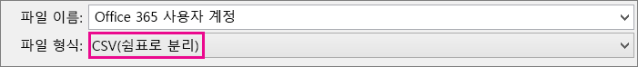
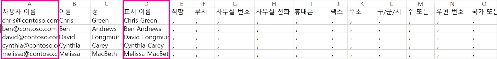

# <a name="add-several-users-at-the-same-time-to-office-365---admin-help"></a>동시에 여러 사용자를 Office 365에 추가 - 관리자 도움말

팀의 각 구성원이 전자 메일 및 Office와 같은 Office 365 서비스에 로그인 및 액세스하려면 사용자 계정이 있어야 합니다. 사용자가 많은 경우 Excel 스프레드시트 또는 CSV 형식으로 저장된 다른 파일에서 모든 계정을 한 번에 추가할 수 있습니다. [CSV 형식이란?](add-several-users-at-the-same-time.md#__toc316652088)
  
## <a name="add-multiple-users-to-office-365-in-the-microsoft-365-admin-center"></a>Microsoft 365 관리 센터에서 여러 사용자를 Office 365에 추가

1. 회사 또는 학교 계정을 사용하여 Office 365에 로그인합니다. 
    
2. 관리 센터에서 **사용자** \> **활성 사용자**를 선택합니다.
    
    
  
    
3. 
            **여러 사용자 가져오기** 패널에서 예제 데이터가 입력되어 있는 예제 CSV 파일과 입력되어 있지 않은 예제 CSV 파일 중 선택하여 다운로드할 수 있습니다. 
    
    
  
    스프레드시트는 **정확히 동일한 열 머리글** 을 예제(사용자 이름, 성 등...)로 포함해야 합니다. 서식 파일을 사용하는 경우에는 메모장과 같은 텍스트 편집 도구에서 열어서 행 1에 있는 모든 데이터는 그대로 두고 행 2와 그 아래 행에만 데이터를 입력해 보세요. 
    
    스프레드시트는 사용자 이름(예: hyunki@contoso.com)과 각 사용자에 대한 표시 이름(예: 유현기)에 대한 값도 포함해야 합니다. 
    
  ```
  User Name,First Name,Last Name,Display Name,Job Title,Department,Office Number,Office Phone,Mobile Phone,Fax,Address,City,State or Province,ZIP or Postal Code,Country or Region
  chris@contoso.com,Chris,Green,Chris Green,IT Manager,Information Technology,123451,123-555-1211,123-555-6641,123-555-9821,1 Microsoft way,Redmond,Wa,98052,United States
  ben@contoso.com,Ben,Andrews,Ben Andrews,IT Manager,Information Technology,123452,123-555-1212,123-555-6642,123-555-9822,1 Microsoft way,Redmond,Wa,98052,United States
  david@contoso.com,David,Longmuir,David Longmuir,IT Manager,Information Technology,123453,123-555-1213,123-555-6643,123-555-9823,1 Microsoft way,Redmond,Wa,98052,United States
  cynthia@contoso.com,Cynthia,Carey,Cynthia Carey,IT Manager,Information Technology,123454,123-555-1214,123-555-6644,123-555-9824,1 Microsoft way,Redmond,Wa,98052,United States
  melissa@contoso.com,Melissa,MacBeth,Melissa MacBeth,IT Manager,Information Technology,123455,123-555-1215,123-555-6645,123-555-9825,1 Microsoft way,Redmond,Wa,98052,United States
  
  ```

4. 상자에 파일 경로를 입력하거나 **찾아보기**를 선택하여 CSV 파일의 위치를 찾은 다음 **확인**을 선택합니다.
    
    
  
    파일에 문제가 있는 경우에는 문제가 창에 표시됩니다. 로그 파일을 다운로드할 수도 있습니다.
    
5. 
            **Set user options**(사용자 옵션 설정) 대화 상자에서는 로그인 상태를 설정하고 모든 사용자에게 할당할 제품 라이선스를 선택할 수 있습니다. 
    
6. 
            **View your result**(결과 보기) 대화 상자에서는 결과를 자신이나 다른 사용자(암호는 일반 텍스트가 됨)에 보내도록 선택할 수 있으며, 만들어진 사용자의 수와 새 사용자에게 할당하기 위해 추가 라이선스를 구입해야 하는지를 알 수도 있습니다. 
    
## <a name="watch-the-video"></a>비디오 보기
<a name="bk_preview"> </a>

 많은 사용자를 추가하는 방법을 보여 주는 짧은 비디오를 보세요. 
  
> [!VIDEO https://www.microsoft.com/videoplayer/embed/f4e7f161-8ae6-4264-a429-9297b539a8de?autoplay=false]
  
## <a name="next-steps"></a>다음 단계
<a name="bk_preview"> </a>

- 이제 이 사용자에게 계정이 있으므로 [PC 또는 Mac에 Office 365 또는 Office 2016를 다운로드하여 설치하거나 다시 설치](https://support.office.com/article/4414eaaf-0478-48be-9c42-23adc4716658)해야 합니다. 팀의 각 사용자는 최대 5대의 PC 또는 Mac에 Office 365를 설치할 수 있습니다. 
    
- 각 사용자는 iPhones, iPads 및 Android 휴대폰 및 태블릿과 같은 최대 5대의 태블릿과 5대의 휴대폰에서 [모바일 장치의 Office 앱 및 전자 메일을 설정](https://support.office.com/article/7dabb6cb-0046-40b6-81fe-767e0b1f014f)할 수도 있습니다. 이 방법으로 어디서나 Office 파일을 편집할 수 있습니다. 
    
    포괄적인 설치 단계를 보려면 [Office 365 비즈니스 에디션 설정](https://support.office.com/article/6a3a29a0-e616-4713-99d1-15eda62d04fa)을 참조하세요. 
    
## <a name="more-information-about-how-to-add-users-to-office-365"></a>Office 365에 사용자를 추가하는 방법에 대한 자세한 정보
<a name="bk_preview"> </a>

### <a name="not-sure-what-csv-format-is"></a>CSV 형식이란?
<a name="__toc316652088"> </a>

CSV 파일은 쉼표로 구분된 값을 사용한 파일입니다. 모든 텍스트 편집기나 Excel과 같은 스프레드시트 프로그램에서 이와 같은 파일을 만들거나 편집할 수 있습니다.
  
시작점으로 [이 예제 스프레드시트](https://www.microsoft.com/download/details.aspx?id=45485)를 다운로드할 수 있습니다. Office 365에는 첫 행에 열 머리글이 필요하므로 이를 다른 것으로 바꾸지 마세요. 
  
파일을 새 이름으로 저장하고 CSV 형식을 지정합니다.
  

  
파일을 저장할 때 파일을 CSV 형식으로 저장하면 통합 문서의 일부 기능이 손실된다는 메시지가 표시될 수 있지만 괜찮습니다. **예**를 클릭하여 계속합니다. 
  

  
### <a name="tips-for-formatting-your-spreadsheet"></a>스프레드시트 서식 지정 팁
<a name="__toc314595848"> </a>

- **예제 스프레드시트와 같은 열 머리글이 필요한가요?** 예. 예제 스프레드시트에는 첫 행에 열 머리글이 포함되어 있습니다. 해당 머리글은 필수 항목입니다. Office 365에 추가할 각 사용자에 대해 머리글 아래에 행을 만듭니다. 열 머리글을 추가, 변경 또는 삭제할 경우 Office 365에서 파일의 정보를 토대로 사용자를 만들지 못할 수도 있습니다. 
    
- **각 사용자에 대해 필요한 정보가 일부만 있는 경우** 사용자 이름 및 표시 이름은 필수 항목입니다. 이 정보 없이는 새 사용자를 추가할 수 없습니다. 팩스 등 기타 정보가 없는 경우 공백과 쉼표를 사용해 필드를 빈 상태로 둘 수 있습니다. 
    
- ** How small or large can the spreadsheet be? ** The spreadsheet must have at least two rows. One is for the column headings (the user data column label) and one for the user. You cannot have more than 251 rows. If you need to import more than 250 users, you can create more than one spreadsheet. 
    
- ** What languages can I use? ** When you create your spreadsheet, you can enter user data column labels in any language or characters, but you must not change the order of the labels, as shown in the sample. You can then make entries into the fields, using any language or characters, and save your file in a Unicode or UTF-8 format. 
    
- **다른 국가나 지역의 사용자를 추가하는 경우** 각 지역에 대해 별도의 스프레드시트를 만듭니다. 각 스프레드시트의 사용자 일괄 추가 마법사를 단계적으로 따르면 작업 중인 파일에 포함된 모든 사용자를 한 곳에서 볼 수 있습니다. 
    
- **사용할 수 있는 문자 수 제한** 다음 표에서는 예제 스프레드시트의 사용자 데이터 열 레이블 및 최대 문자 길이를 각각 보여 줍니다. 
    
|**사용자 데이터 열 레이블**|**최대 문자 길이**|
|:-----|:-----|
|사용자 이름 (필수)  <br/> |기호(@)를 포함하여 이름@도메인.\<확장자\> 형식으로 된 79자. 사용자의 별칭은 30자, 도메인 이름은 48자를 초과할 수 없습니다.  <br/> |
|이름  <br/> |64  <br/> |
|성  <br/> |64  <br/> |
|표시 이름 (필수)  <br/> |256  <br/> |
|직함  <br/> |64  <br/> |
|부서  <br/> |64  <br/> |
|사무실 번호  <br/> |128  <br/> |
|사무실 전화  <br/> |64  <br/> |
|휴대폰  <br/> |64  <br/> |
|팩스  <br/> |64  <br/> |
|주소  <br/> |1023  <br/> |
|구/군/시  <br/> |128  <br/> |
|시/도  <br/> |128  <br/> |
|우편 번호  <br/> |40  <br/> |
|국가 또는 지역  <br/> |128  <br/> |
   
### <a name="still-having-problems-when-adding-users-to-office-365"></a>Office 365에 사용자를 추가할 때 여전히 문제가 발생하나요?

- **스프레드시트 형식이 올바른지 다시 한 번 확인합니다.** 열 머리글이 예제 파일의 머리글과 일치하는지 확인합니다. 문자 길이 규칙을 준수했고 각 필드를 쉼표로 구분했는지 확인합니다. 
    
- ** If you don't see the new users in Office 365 right away, wait a few minutes. ** It can take a little while for changes to go across all the services in Office 365. 
    
## <a name="add-multiple-users-to-office-365-in-the-old-admin-center"></a>기존 관리 센터에서 여러 사용자를 Office 365에 추가합니다.

1. [이 예제 스프레드시트](https://www.microsoft.com/download/details.aspx?id=45485)를 다운로드하고 Excel에서 엽니다. 
    
    스프레드시트는 **정확히 동일한 열 머리글** 을 예제(사용자 이름, 성 등...)로 포함해야 합니다. 서식 파일을 사용하는 경우에는 행 1에 있는 모든 데이터는 그대로 두고 행 2와 그 아래 행에만 데이터를 입력해 보세요. 
    
    스프레드시트는 사용자 이름(예: hyunki@contoso.com)과 각 사용자에 대한 표시 이름(예: 유현기)에 대한 값도 포함해야 합니다. 다른 필드는 공백으로 두려면 다음 그림과 같이 필드에 공백과 쉼표를 입력합니다. 
    
    
  
    다른 국가에서 작업하는 사용자가 있는 경우 국가별로 사용자에 대한 스프레드시트를 하나씩 만들어야 합니다. 예를 들어 스프레드시트 하나에는 미국에서 작업하는 사람을 모두 나열하고 또 다른 스프레드시트에는 일본에서 작업하는 사람을 모두 나열합니다. 이렇게 하는 이유는 Office 365 서비스의 가용성이 지역별로 다르기 때문입니다. 
    
    **팁:** Office 365에 여러 사용자를 추가하기 전에 예제 스프레드시트로 연습할 수 있습니다. 예를 들어 사용자 5명 또는 10명의 데이터를 사용하여 예제 스프레드시트를 편집하고 파일을 새 이름으로 저장합니다. 이 절차에 설명된 단계를 실행하여 결과를 확인한 다음 새 계정을 삭제하고 처음부터 다시 시작합니다. 이 방법으로 자신의 상황에 맞게 모든 데이터를 가져오는 연습을 할 수 있습니다. [스프레드시트 서식 지정 팁](add-several-users-at-the-same-time.md#__toc314595848)도 참조하세요.
    
2. 회사 또는 학교 계정을 사용하여 Office 365에 로그인합니다. 
    
3. 관리 센터로 이동합니다.
    
4. For people to use Office 365 services, they need to be assigned a license. Before continuing, you might want to check that you have enough licenses for everyone listed in your spreadsheet. Choose **Billing** \> **Subscriptions** to see if you have enough. If you need to buy more licenses, choose ** Change license quantity **. Or, you can run the wizard and assign the licenses you have, then buy more licenses later and rerun the wizard. 
    
5. **사용자** \> **활성 사용자**를 선택하여 사용자 일괄 추가 마법사로 이동합니다. 다음 그림에서처럼 을 선택합니다. 
    
    
  
    사용자 일괄 추가 마법사가 나타나고 사용자 그룹을 Office 365에 추가하는 단계를 안내합니다. 
    
6. '1단계 - CSV 파일 선택'에서 다음 그림에 나오는 것처럼 고유 스프레드시트를 지정합니다.
    
    
  
7. '2단계 - 확인'에서 마법사는 스프레드시트에 있는 콘텐츠의 서식이 올바른지 여부를 알려 줍니다.
    
    
  
8. '3단계 - 설정'에서는 스프레드시트에 나열된 사용자들이 Office 365를 사용할 수 있도록 **허용**을 선택합니다. 또한 이러한 사용자가 Office 365를 사용할 국가를 선택합니다. 조직의 일부 사용자가 다른 국가에서 Office 365를 사용하는 경우 이름을 사용하여 별도의 스프레드시트를 만들고 사용자 일괄 추가 마법사를 다시 실행하여 파일을 추가합니다. 
    
    
  
9. 라이선스 할당 페이지에서 사용 가능한 라이선스 수를 확인할 수 있습니다. 
    
    
  
    **추가 라이선스 구입**을 선택할 수 있지만 사용자 일괄 추가 마법사를 종료하고 Microsoft 365 관리 센터의 **청구**로 이동합니다. 추가 라이선스를 구입한 후에는 주문이 처리될 때까지 몇 분 정도 기다렸다가 사용자 일괄 추가 마법사를 처음부터 다시 시작해야 합니다. 
    
    추가 라이선스를 구입하지 않으면 스프레드시트에 나열된 모든 사용자에게 대해 계정이 만들어지지 않습니다. 
    
    이 예제에서는 추가 라이선스를 구입하지 않고 사용자 일괄 추가 마법사를 계속하면 어떻게 되는지 살펴보겠습니다.
    
10. '5단계 - 결과 보내기'에서는 스프레드시트에 있는 사용자에 대한  *모든*  Office 365 사용자 이름과 임시 암호가 나열된 전자 메일을 수신하도록 할 사용자의 전자 메일 주소를 입력합니다. 
    
    
  
    '5단계 - 결과 보내기'에서 지정한 모든 전자 메일 주소로 다음 전자 메일이 전송됩니다. 이 전자 메일에는 만들어진 계정이 표시되어 있습니다. 라이선스가 충분하지 않아 일부 사용자에 대해서는 계정이 만들어지지 않았습니다. 
    
    
  
    나중에 추가 라이선스를 구입하고 동일한 스프레드시트를 사용하여 사용자 일괄 추가 마법사를 다시 실행할 수 있습니다. 마법사가 이미 계정을 가지고 있는 사용자를 건너뜁니다. 결과 보고서에 해당 정보의 사용자가 이미 계정을 가지고 있음을 나타내는 "사용자 이름이 중복되었습니다." 메시지가 표시됩니다.
    
11. 사용자 일괄 추가 마법사의 마지막 페이지에는 다음 그림에 나온 것처럼 사용자 이름과 임시 암호가 나열됩니다.
    
    
  
12. Office 365에 사용자를 추가한 후에는 해당 사용자에게 Office 365 계정 정보를 알려야 합니다. 새 암호를 전달하는 데 일반 프로세스를 사용합니다.
    

