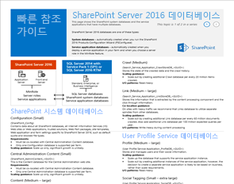
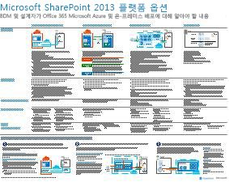
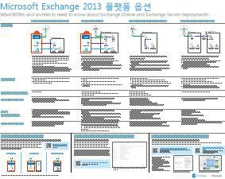
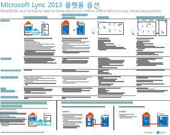
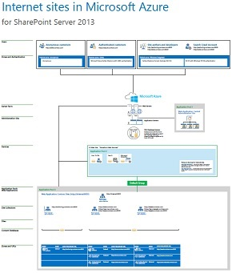

# Exchange, SharePoint, 비즈니스용 Skype 및 Lync에 대한 아키텍처 모델

 **요약:** 아키텍처 모델, 배포 및 비즈니스 및 Lync에 대 한 개발자를 위한 SharePoint, Exchange, Skype 플랫폼 옵션에 설명 하는 IT 포스터를 가져옵니다.
  
이러한 IT 포스터에서는 SharePoint, Exchange, 비즈니스용 Skype 및 Lync에 대한 아키텍처 모델 및 배포 옵션을 설명하고 Microsoft Azure에서 SharePoint를 배포하기 위한 디자인 정보를 제공합니다.
  
Office 365와 함께 사용자에 게 익숙한 클라우드 기반 서비스로 공동 작업 및 통신 서비스를 제공할 수 있습니다. 몇가지 예외를 제외 하 고, 사용자 경험 동일 하 게 유지 하는 온-프레미스 배포를 유지 관리 또는 Office 365를 사용 하는 여부. 이 통합된 사용자 환경은 하 여 각 작업 부하를 배치 하는 위치를 결정 하려면 덜 간단 하 게 및와 같은 질문을 발생 시킵니다.
  
- 개별 작업을 진행하기 위해 선택할 플랫폼 옵션을 어떻게 결정할 수 있을까요?
    
- 모든 서비스를 온-프레미스에 두는 것이 적절할까요?
    
- 하이브리드 배포는 어떤 경우에 적합한가요?
    
- 그림에 Microsoft Azure 맞추는 하는 방법
    
- Azure에서 Office Server 작업용으로 지원되는 구성은 어느 것인가요?
    
> [!TIP]
> 이 페이지에 있는 대부분의 포스터는 중국어, 영어, 프랑스어, 독일어, 이탈리아어, 일본어, 한국어, 포르투갈어, 러시아어 및 스페인어 등의 다중 언어로 제공됩니다. 이러한 언어 중 하나로 제공되는 포스터를 다운로드하려면 해당 포스터의 **추가 언어** 링크를 클릭합니다.
  
여러분의 의견을 알려주세요! [cloudadopt@microsoft.com](mailto:cloudadopt@microsoft.com)에 전자 메일을 보내주세요. 
  
이 페이지는 다음 포스터에 연결됩니다.
  
- **아키텍처 모델 포스터** 이상적인 플랫폼 및 SharePoint 2016 및 비즈니스 2015 용 Skype에 대 한 구성을 확인 하려면 다음이 리소스를 사용할 수 있습니다.
    
  - [Microsoft SharePoint 2016 아키텍처 모델](architectural-models-for-sharepoint-exchange-skype-for-business-and-lync.md#SP2016_ArchModel)
    
  - [OneDrive 및 Office 365의에서 SharePoint Online의 다중-지리적으로 분산 기능](architectural-models-for-sharepoint-exchange-skype-for-business-and-lync.md#MultiGeoO365ODB)
    
  - [SharePoint Server 2016 데이터베이스](architectural-models-for-sharepoint-exchange-skype-for-business-and-lync.md#SP2016_Databases)
    
  - [비즈니스 2015 아키텍처 모델에 대 한 Microsoft Skype](architectural-models-for-sharepoint-exchange-skype-for-business-and-lync.md#SfB2015_ArchModel)
    
- **플랫폼 옵션 포스터** 이상적인 플랫폼 및 SharePoint 2013, Exchange 2013 및 Lync 2013에 대 한 구성을 확인 하려면 다음이 리소스를 사용할 수 있습니다.
    
  - [SharePoint 2013 플랫폼 옵션](architectural-models-for-sharepoint-exchange-skype-for-business-and-lync.md#SP2013_Options)
    
  - [Exchange 2013 플랫폼 옵션](architectural-models-for-sharepoint-exchange-skype-for-business-and-lync.md#Exch2013_options)
    
  - [Lync 2013 플랫폼 옵션](architectural-models-for-sharepoint-exchange-skype-for-business-and-lync.md#Lync2013_Options)
    
- **Azure 솔루션 포스터에 SharePoint Server 2013** 디자인 및 Azure 인프라 서비스에는 SharePoint Server 2013 작업에 대 한 구성을 확인 하려면 이러한 IT 포스터를 사용할 수 있습니다.
    
  - [SharePoint Server 2013을 사용 하 여 Microsoft Azure의 인터넷 사이트](architectural-models-for-sharepoint-exchange-skype-for-business-and-lync.md#Azure_sharepoint2013)
    
  - [이 디자인 예제: SharePoint 2013에 대 한 Microsoft Azure의 인터넷 사이트](architectural-models-for-sharepoint-exchange-skype-for-business-and-lync.md#DesignSampleInternetSites)
    
  - [Microsoft Azure에 SharePoint 재해 복구](architectural-models-for-sharepoint-exchange-skype-for-business-and-lync.md#sharepoint_recovery_Azure)
    
## 아키텍처 모델 포스터

SharePoint 2016 및 비즈니스용 Skype 2015용으로 제작된 이러한 새 IT 포스터는 쉽게 인쇄하여 다양한 배포 방법을 비교할 수 있습니다. 각 포스터는 사용 가능한 모든 구성 또는 플랫폼 옵션 목록을 제공하며 각 옵션에 대해 다음 정보를 제공합니다.
  
- **개요 (영문)** 개념 다이어그램을 포함 하 여 플랫폼의 간단한 요약 합니다.
    
- **에 가장 적합 한** 특정 플랫폼에 적합 하는 일반적인 시나리오입니다.
    
- **라이선스 요구 사항** 배포에 필요한 라이선스 합니다.
    
- **아키텍처 작업** 해야하는 설계자 내용을 결정 합니다.
    
- **IT 전문가 용 작업이 나 책임** IT 직원에 대 한 계획 하는 일별 책임입니다.
    

### Microsoft SharePoint 2016 아키텍처 모델

|**항목**|**설명**|
|:-----|:-----|
|[          ](https://www.microsoft.com/download/details.aspx?id=52650)   [PDF](https://download.microsoft.com/download/4/F/A/4FA0F94B-EE2F-41DB-A047-D9864FEF41E9/SharePoint2016ArchitecturalModels.pdf)  \| [Visio](https://download.microsoft.com/download/4/F/A/4FA0F94B-EE2F-41DB-A047-D9864FEF41E9/SharePoint2016ArchitecturalModels.vsdx)  \| [기타 언어](https://www.microsoft.com/download/details.aspx?id=52650)   | 이 IT 포스터는 비즈니스 의사 결정권자 및 솔루션 설계자가 알고 있어야 하는 SharePoint Online, Microsoft Azure 및 SharePoint 온-프레미스 구성에 대해 설명합니다.    - **SharePoint Online (SaaS)** -서비스 (SaaS) 구독 모델로 사용 소프트웨어를 통해 SharePoint를 사용 합니다.   - **SharePoint 하이브리드** -SharePoint 사이트 및 앱 자신의 진도에 클라우드로 이동 합니다.   - **Azure (IaaS)의 SharePoint** -Microsoft Azure에 온-프레미스 환경을 확장 하 고 다음과 같은 SharePoint 2016 서버를 배포 합니다. (이 권장 높은 고가용성/재해 복구 및 개발/테스트 환경에 대 한.)  - **SharePoint 온-프레미스** -계획, 배포, 유지 관리 및 유지 관리 하는 데이터 센터에서 SharePoint 환경을 사용자 지정 합니다.   |
   

### OneDrive 및 Office 365의에서 SharePoint Online의 다중-지리적으로 분산 기능

|**항목**|**설명**|
|:-----|:-----|
|[          ](http://download.microsoft.com/download/0/5/9/0594634F-7893-4201-938A-C2FF2F21B655/Multi-Geo-ODB.pdf)   [PDF](http://download.microsoft.com/download/0/5/9/0594634F-7893-4201-938A-C2FF2F21B655/Multi-Geo-ODB.pdf)  \| [Visio](http://download.microsoft.com/download/0/5/9/0594634F-7893-4201-938A-C2FF2F21B655/Multi-Geo-ODB.vsdx)   | 이 포스터 (이 영문)은 OneDrive에서 다중-지리적으로 분산 기능 및 Office 365의 SharePoint Online의 한 페이지 개요입니다. 이 모델에는 다음이 포함 됩니다.   -이점   -배포에 대 한 단계   -예제 구성     OneDrive의 다중-지리적으로 분산 기능 및 Office 365의 SharePoint Online에 대 한 자세한 내용은 클릭 [여기](https://aka.ms/onedrivemultigeo)합니다.    |
   

### SharePoint Server 2016 데이터베이스

|**항목**|**설명**|
|:-----|:-----|
|[          ](https://www.microsoft.com/download/details.aspx?id=55041)   [PDF](https://download.microsoft.com/download/D/5/D/D5DC1121-8BC5-4953-834F-1B5BB03EB691/DBrefguideSPS2016_tabloid.pdf)  \| [Visio](https://download.microsoft.com/download/D/5/D/D5DC1121-8BC5-4953-834F-1B5BB03EB691/DBrefguideSPS2016_tabloid.vsdx)  \| [기타 언어](https://www.microsoft.com/download/details.aspx?id=55041)   | 이 IT 포스터는 SharePoint Server 2016 데이터베이스에 대한 빠른 참조 안내서입니다. 각 데이터베이스에는 다음과 같은 세부 정보가 포함되어 있습니다.   -크기   -배율 조정 지침   -I/O 패턴   -요구 사항     첫 페이지에는 SharePoint 시스템 데이터베이스 및 서비스 응용 프로그램 데이터베이스가 여러개 있는 포함 합니다. 두번째 페이지 단일 데이터베이스에 있는 서비스 응용 프로그램의 모든 표시 됩니다.    SharePoint Server 2016 데이터베이스에 대 한 자세한 내용은 [데이터베이스 형식 및 설명에서 SharePoint Server 2016를](https://technet.microsoft.com/en-us/library/cc678868%28v=office.16%29.aspx) 참조 하십시오.   |
   

### Microsoft 비즈니스용 Skype 2015 아키텍처 모델

|**항목**|**설명**|
|:-----|:-----|
|[          ](https://www.microsoft.com/download/details.aspx?id=55022)   [PDF](https://download.microsoft.com/download/7/7/4/7741262C-A60D-41F7-863B-99BF5964FBFE/Skype%20for%20Business%20Architectural%20Models.pdf)  \| [Visio](https://download.microsoft.com/download/7/7/4/7741262C-A60D-41F7-863B-99BF5964FBFE/Skype%20for%20Business%20Architectural%20Models.vsd)  \| [기타 언어](https://www.microsoft.com/download/details.aspx?id=55022)   |이 포스터는 Skype Online에 대 한 비즈니스, 온-프레미스, 하이브리드에 설명 하 고 클라우드 PBX, 및 Exchange 및 SharePoint 구성와의 통합 비즈니스 의사 결정자를 사용 하는 솔루션 설계자에 대해 알고 있어야 합니다.    이것은 인식 되는 비즈니스 온라인 용 Skype 및 온-프레미스 비즈니스를 위한 Skype 사용 될 수 있습니다 다른 기본 아키텍처 모델을 높여 IT Pro 대상 그룹에 대 한 것입니다.   조직의 요구 사항 및 미래의 계획 어떤 구성 가장 적합 한으로 시작 합니다. 고려 하 고 필요에 따라 다른 사용자를 사용 합니다. 예, 다음 Exchange 및 SharePoint 또는 Microsoft의 클라우드 PBX 제공을 활용 하는 솔루션의 통합을 고려 하는 것이 좋습니다.    |
   
## 플랫폼 옵션 포스터

이러한 SharePoint 2013, Exchange 2013 및 Lync 2013용 IT 포스터는 다양한 배포 방법을 대형 포스트 형식으로 한 눈에 쉽게 비교할 수 있도록 합니다. 각 포스터는 사용 가능한 모든 구성 또는 플랫폼 옵션 목록을 제공하며 각 옵션에 대해 다음 정보를 제공합니다.
  
- **개요 (영문)** 개념 다이어그램을 포함 하 여 플랫폼의 간단한 요약 합니다.
    
- **에 가장 적합 한** 특정 플랫폼에 적합 하는 일반적인 시나리오입니다.
    
- **라이선스 요구 사항** 배포에 필요한 라이선스 합니다.
    
- **아키텍처 작업** 해야하는 설계자 내용을 결정 합니다.
    
- **IT 전문가 용 작업이 나 책임** IT 직원에 대 한 계획 하는 일별 책임입니다.
    

## SharePoint 2013 플랫폼 옵션

****

|**항목**|**설명**|
|:-----|:-----|
|[          ](https://www.microsoft.com/download/details.aspx?id=40332)   [PDF](http://go.microsoft.com/fwlink/p/?LinkId=324594)  \| [Visio](https://go.microsoft.com/fwlink/p/?LinkId=324593)  \| [기타 언어](https://www.microsoft.com/download/details.aspx?id=40332)   |비즈니스 의사 결정권자 (Bdm)와 설계자를 위한이 모델에서는 개발자를 위한 SharePoint 2013, Office 365에서 Office 365, Azure, 및 온-프레미스 배포만 사용 하 여 온-프레미스 하이브리드 SharePoint 플랫폼 옵션에 설명 합니다. 각 아키텍처, 권장 사항, 라이선스 요구 사항 및 주소 목록이 설계자 및 각 플랫폼에 대 한 IT 전문가 용 작업의 개요를 제공 합니다. Azure에서 여러 SharePoint 솔루션을 강조 표시 됩니다.  이 포스터의 액세스할 수 있는 텍스트 버전을 [액세스할 수 있는 다이어그램-Microsoft SharePoint 2013 플랫폼 옵션을](accessible-diagrammicrosoft-sharepoint-2013-platform-options.md)참조 하십시오.    |
   

## Exchange 2013 플랫폼 옵션

****

|**항목**|**설명**|
|:-----|:-----|
|[          ](https://www.microsoft.com/download/details.aspx?id=42676)   [PDF](https://go.microsoft.com/fwlink/p/?LinkID=398740)  \| [Visio](https://go.microsoft.com/fwlink/p/?LinkID=398742)  \| [기타 언어](https://www.microsoft.com/download/details.aspx?id=42676)   |Bdm와 설계자를 위한이 모델에서는 Exchange 2013에 대 한 사용 가능한 플랫폼 옵션을 설명합니다. 고객은 Office 365, Exchange Server 온-프레미스 및 호스팅된 Exchange 하이브리드 Exchange와 Exchange Online에서 선택할 수 있습니다. 포스터의 각 아키텍처 옵션을 가장 이상적인 시나리오를 포함 하 여 각, 라이선스 요구 사항 및 IT 전문가 책임에 대 한 세부 정보를 포함 합니다.  이 포스터의 액세스할 수 있는 텍스트 버전을 [액세스할 수 있는 다이어그램-Microsoft Exchange 2013 플랫폼 옵션을](accessible-diagrammicrosoft-exchange-2013-platform-options.md)참조 하십시오.    |
   

## Lync 2013 플랫폼 옵션

****

|**항목**|**설명**|
|:-----|:-----|
|[          ](https://www.microsoft.com/download/details.aspx?id=41677)   [PDF](https://go.microsoft.com/fwlink/p/?LinkID=391837)  \| [Visio](https://go.microsoft.com/fwlink/p/?LinkID=391839)  \| [기타 언어](https://www.microsoft.com/download/details.aspx?id=41677)   |BDM 및 설계자의 경우 이 모델에서는 Lync 2013에 대한 사용 가능한 플랫폼 옵션을 설명합니다. 고객은 Office 365의 Lync Online, 하이브리드 Lync, 온-프레미스의 Lync Server 및 호스티드 Lync 중에서 선택할 수 있습니다. 이 IT 포스터에는 각 라이선스 요구 사항 및 IT 전문가 업무에 가장 적합한 시나리오를 포함하여 각 아키텍처 옵션에 대한 세부 정보를 포함합니다.      |
   

## Azure의 SharePoint 솔루션 포스터

이러한 IT 포스터 큰 포스터 (영문) 형식의 SharePoint Server 2013을 사용 하 여 Azure 기반 솔루션을 표시 합니다.
  

### SharePoint Server 2013을 사용하는 Microsoft Azure의 인터넷 사이트

****

|**항목**|**설명**|
|:-----|:-----|
|[          ](https://www.microsoft.com/download/details.aspx?id=41992)   [PDF](https://go.microsoft.com/fwlink/p/?LinkId=392552)  \| [Visio](https://go.microsoft.com/fwlink/p/?LinkId=392551)  \| [기타 언어](https://www.microsoft.com/download/details.aspx?id=41992)   |이 포스터에서는 주요 디자인 활동에 설명 하 고 Azure의 인터넷 사이트에 대 한 선택 하려는 아키텍처를 권장 합니다. 이 포스터의 액세스할 수 있는 텍스트 버전을 [액세스할 수 있는 다이어그램-SharePoint 2013에 대 한 Microsoft Azure의 인터넷 사이트를](accessible-diagraminternet-sites-in-microsoft-azure-for-sharepoint-2013.md)참조 하십시오.   자세한 내용은 다음 문서를 참조하세요.     - [SharePoint Server 2013을 사용 하 여 Microsoft Azure의 인터넷 사이트](internet-sites-in-microsoft-azure-using-sharepoint-server-2013.md)   - [SharePoint 2013에 대 한 Microsoft Azure 아키텍처](microsoft-azure-architectures-for-sharepoint-2013.md)   |
   

### 디자인 샘플: SharePoint 2013용 Microsoft Azure의 인터넷 사이트

****

|**항목**|**설명**|
|:-----|:-----|
|[          ](https://www.microsoft.com/download/details.aspx?id=41991)   [PDF](https://go.microsoft.com/fwlink/p/?LinkId=392549)  \| [Visio](https://go.microsoft.com/fwlink/p/?LinkId=392548)  \| [기타 언어](https://www.microsoft.com/download/details.aspx?id=41991)   |SharePoint Server 2013을 사용 하 여 Azure에서 직접 아키텍처 인터넷 사이트에 대 한 시작 지점으로이 디자인 예제를 사용 합니다. 이 포스터의 액세스할 수 있는 텍스트 버전을 참조 하십시오. [액세스할 수 있는 다이어그램-디자인 예제: SharePoint 2013에 대 한 Microsoft Azure의 인터넷 사이트](accessible-diagramdesign-sample-internet-sites-in-microsoft-azure-for-sharepoint.md)합니다.   자세한 내용은 다음 문서를 참조하세요.     - [SharePoint Server 2013을 사용 하 여 Microsoft Azure의 인터넷 사이트](internet-sites-in-microsoft-azure-using-sharepoint-server-2013.md)   - [SharePoint 2013에 대 한 Microsoft Azure 아키텍처](microsoft-azure-architectures-for-sharepoint-2013.md)   |
   

### Microsoft Azure로의 SharePoint 재해 복구

****

|**항목**|**설명**|
|:-----|:-----|
|[          ](https://www.microsoft.com/download/details.aspx?id=41993)   [PDF](https://go.microsoft.com/fwlink/p/?LinkId=392555)  \| [Visio](https://go.microsoft.com/fwlink/p/?LinkId=392554)  \| [기타 언어](https://www.microsoft.com/download/details.aspx?id=41993)   |이 IT 포스터에서는 Azure의 재해 복구 환경에 대 한 아키텍처 원리를 보여줍니다. 이 포스터의 액세스할 수 있는 텍스트 버전을 [액세스할 수 있는 다이어그램-Microsoft Azure에 SharePoint 재해 복구를](accessible-diagramsharepoint-disaster-recovery-to-microsoft-azure.md)참조 하십시오.   자세한 내용은 다음 문서를 참조하세요.     - [Microsoft Azure의 SharePoint Server 2013 재해 복구](sharepoint-server-2013-disaster-recovery-in-microsoft-azure.md)   - [SharePoint 2013에 대 한 Microsoft Azure 아키텍처](microsoft-azure-architectures-for-sharepoint-2013.md)   |
   

## 참고 항목

[클라우드 채택 및 하이브리드 솔루션](cloud-adoption-and-hybrid-solutions.md)
  
[Microsoft 클라우드 IT 아키텍처 리소스](microsoft-cloud-it-architecture-resources.md)
  
[클라우드 도입 TLG(테스트 랩 가이드)](cloud-adoption-test-lab-guides-tlgs.md)
  
[하이브리드 솔루션](hybrid-solutions.md)

