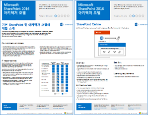
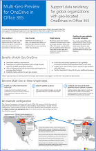
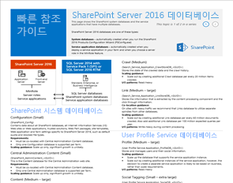
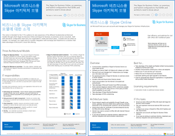
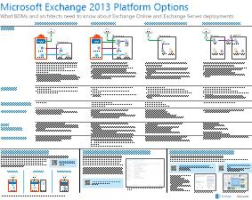
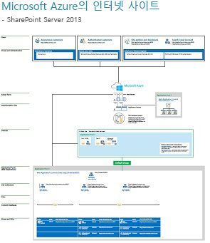

# Exchange, SharePoint, 비즈니스용 Skype 및 Lync에 대한 아키텍처 모델

 **요약:** SharePoint, Exchange, 비즈니스용 Skype 및 Lync에 대한 아키텍처 모델, 배포 및 플랫폼 옵션을 설명하는 IT 포스트를 확인하세요.
  
이러한 IT 포스터에서는 SharePoint, Exchange, 비즈니스용 Skype 및 Lync에 대한 아키텍처 모델 및 배포 옵션을 설명하고 Microsoft Azure에서 SharePoint를 배포하기 위한 디자인 정보를 제공합니다.
  
Office 365를 사용하면 사용자에게 친숙한 공동 작업 및 통신 서비스를 클라우드 기반 서비스로 제공할 수 있습니다. 몇 가지 예외를 제외하고, 사용자 환경은 온-프레미스 배포를 유지 관리하든, Office 365를 사용하든 동일하게 유지됩니다. 이와 같이 사용자 환경이 통합되면 각 작업이 진행될 위치를 결정하기 쉽지 않으며 다음과 같은 의문이 제기될 수 있습니다.
  
- 개별 작업을 진행하기 위해 선택할 플랫폼 옵션을 어떻게 결정할 수 있을까요?
    
- 모든 서비스를 온-프레미스에 두는 것이 적절할까요?
    
- 하이브리드 배포는 어떤 경우에 적합한가요?
    
- Microsoft Azure는 어떻게 그림과 잘 들어맞습니까?
    
- Azure에서 Office Server 작업용으로 지원되는 구성은 어느 것인가요?
    
> [!TIP]
> 이 페이지에 있는 대부분의 포스터는 중국어, 영어, 프랑스어, 독일어, 이탈리아어, 일본어, 한국어, 포르투갈어, 러시아어 및 스페인어 등의 다중 언어로 제공됩니다. 이러한 언어 중 하나로 제공되는 포스터를 다운로드하려면 해당 포스터의 **추가 언어** 링크를 클릭합니다.
  
여러분의 의견을 알려주세요! [cloudadopt@microsoft.com](mailto:cloudadopt@microsoft.com)에 전자 메일을 보내주세요. 
  
이 페이지는 다음 포스터에 연결됩니다.
  
- **아키텍처 모델 포스터** 이러한 리소스를 사용하여 SharePoint 2016 및 비즈니스용 Skype 2015에 이상적인 플랫폼과 구성을 확인할 수 있습니다.
    
  - [Microsoft SharePoint 2016 아키텍처 모델](architectural-models-for-sharepoint-exchange-skype-for-business-and-lync.md#SP2016_ArchModel)
    
  - [OneDrive 및 Office 365의 SharePoint Online에 제공되는 다중 위치 기능](architectural-models-for-sharepoint-exchange-skype-for-business-and-lync.md#MultiGeoO365ODB)
    
  - [SharePoint Server 2016 데이터베이스](architectural-models-for-sharepoint-exchange-skype-for-business-and-lync.md#SP2016_Databases)
    
  - [Microsoft 비즈니스용 Skype 2015 아키텍처 모델](architectural-models-for-sharepoint-exchange-skype-for-business-and-lync.md#SfB2015_ArchModel)
    
- **플랫폼 옵션 포스터** 이러한 리소스를 사용하여 SharePoint 2013, Exchange 2013 및 Lync 2013에 이상적인 플랫폼과 구성을 확인할 수 있습니다.
    
  - [SharePoint 2013 플랫폼 옵션](architectural-models-for-sharepoint-exchange-skype-for-business-and-lync.md#SP2013_Options)
    
  - [Exchange 2013 플랫폼 옵션](architectural-models-for-sharepoint-exchange-skype-for-business-and-lync.md#Exch2013_options)
    
  - [Lync 2013 플랫폼 옵션](architectural-models-for-sharepoint-exchange-skype-for-business-and-lync.md#Lync2013_Options)
    
- **Azure의 SharePoint Server 2013 솔루션 포스터** 이러한 IT 포스터를 사용하여 Azure 인프라 서비스에서 SharePoint Server 2013 작업에 적합한 디자인 및 구성을 확인할 수 있습니다.
    
  - [SharePoint Server 2013을 사용하는 Microsoft Azure의 인터넷 사이트](architectural-models-for-sharepoint-exchange-skype-for-business-and-lync.md#Azure_sharepoint2013)
    
  - [디자인 샘플: SharePoint 2013용 Microsoft Azure의 인터넷 사이트](architectural-models-for-sharepoint-exchange-skype-for-business-and-lync.md#DesignSampleInternetSites)
    
  - [Microsoft Azure로의 SharePoint 재해 복구](architectural-models-for-sharepoint-exchange-skype-for-business-and-lync.md#sharepoint_recovery_Azure)
    
## 아키텍처 모델 포스터

SharePoint 2016 및 비즈니스용 Skype 2015용으로 제작된 이러한 새 IT 포스터는 쉽게 인쇄하여 다양한 배포 방법을 비교할 수 있습니다. 각 포스터는 사용 가능한 모든 구성 또는 플랫폼 옵션 목록을 제공하며 각 옵션에 대해 다음 정보를 제공합니다.
  
- **개요** 개념도를 포함하여 간단한 플랫폼 요약을 제공합니다.
    
- **최적 시나리오** 특정 플랫폼에 가장 적합한 일반적인 시나리오에 대해 설명합니다.
    
- **라이선스 요구 사항** 배포에 필요한 라이센스
    
- **아키텍처 작업** 설계자로서 수행해야 하는 의사 결정
    
- **IT Pro 작업 또는 업무** IT 직원이 계획해야 하는 매일의 업무
    

### Microsoft SharePoint 2016 아키텍처 모델

|**항목**|**설명**|
|:-----|:-----|
|[          ](https://www.microsoft.com/download/details.aspx?id=52650)   [PDF](https://download.microsoft.com/download/4/F/A/4FA0F94B-EE2F-41DB-A047-D9864FEF41E9/SharePoint2016ArchitecturalModels.pdf)  \| [Visio](https://download.microsoft.com/download/4/F/A/4FA0F94B-EE2F-41DB-A047-D9864FEF41E9/SharePoint2016ArchitecturalModels.vsdx)  \| [추가 언어](https://www.microsoft.com/download/details.aspx?id=52650)   | 이 IT 포스터는 비즈니스 의사 결정권자 및 솔루션 설계자가 알고 있어야 하는 SharePoint Online, Microsoft Azure 및 SharePoint 온-프레미스 구성에 대해 설명합니다.    - **SharePoint Online(SaaS)** - SaaS(Software as a Service) 구독 모델을 통해 SharePoint를 사용합니다.   - **SharePoint 하이브리드** - SharePoint 사이트 및 앱을 본인의 상황에 맞춰서 클라우드로 이동합니다.   - **Azure의 SharePoint(IaaS)** - Microsoft Azure에 온-프레미스 환경을 확장하고 SharePoint 2016 Server를 배포합니다. (이 기능은 고가용성/재해 복구 및 개발/테스트 환경에 권장됩니다.)   - **SharePoint 온-프레미스** - 직접 유지 관리하는 데이터 센터에서 SharePoint 환경을 계획, 배포, 유지 관리, 사용자 지정합니다.   |
   

### OneDrive 및 Office 365의 SharePoint Online에 제공되는 다중 위치 기능

|**항목**|**설명**|
|:-----|:-----|
|[          ](https://github.com/MicrosoftDocs/OfficeDocs-Enterprise/raw/live/Enterprise/media/Multi-Geo-ODB.pdf)   [PDF](https://github.com/MicrosoftDocs/OfficeDocs-Enterprise/raw/live/Enterprise/media/Multi-Geo-ODB.pdf)  \| [Visio](https://github.com/MicrosoftDocs/OfficeDocs-Enterprise/raw/live/Enterprise/media/Multi-Geo-ODB.vsdx)   | 이 포스터는 Office 365의 OneDrive 및 SharePoint Online의 다중 위치 기능에 대한 단일 페이지 개요입니다. 이 모델에는 다음이 포함됩니다.   - 이점   - 배포 단계   - 예제 구성     OneDrive 및 Office 365의 SharePoint Online에 제공되는 다중 위치 기능에 대한 자세한 내용은 [여기](https://aka.ms/onedrivemultigeo)를 클릭하세요.    |
   

### SharePoint Server 2016 데이터베이스

|**항목**|**설명**|
|:-----|:-----|
|[          ](https://www.microsoft.com/download/details.aspx?id=55041)   [PDF](https://download.microsoft.com/download/D/5/D/D5DC1121-8BC5-4953-834F-1B5BB03EB691/DBrefguideSPS2016_tabloid.pdf)  \| [Visio](https://download.microsoft.com/download/D/5/D/D5DC1121-8BC5-4953-834F-1B5BB03EB691/DBrefguideSPS2016_tabloid.vsdx)  \| [추가 언어](https://www.microsoft.com/download/details.aspx?id=55041)   | 이 IT 포스터는 SharePoint Server 2016 데이터베이스에 대한 빠른 참조 안내서입니다. 각 데이터베이스에는 다음과 같은 세부 정보가 포함되어 있습니다.   - 크기   - 크기 조정 지침   - I/O 패턴   - 요구 사항     첫 번째 페이지에는 SharePoint 시스템 데이터베이스 및 여러 데이터베이스를 포함하는 서비스 응용 프로그램 데이터베이스가 포함되어 있습니다. 두 번째 페이지에는 단일 데이터베이스가 있는 모든 서비스 응용 프로그램이 표시됩니다.     SharePoint Server 2016 데이터베이스에 대한 자세한 내용은 [SharePoint Server 2016의 데이터베이스 형식 및 설명](https://technet.microsoft.com/ko-KR/library/cc678868%28v=office.16%29.aspx)을 참조하십시오.   |
   

### Microsoft 비즈니스용 Skype 2015 아키텍처 모델

|**항목**|**설명**|
|:-----|:-----|
|[          ](https://www.microsoft.com/download/details.aspx?id=55022)   [PDF](https://download.microsoft.com/download/7/7/4/7741262C-A60D-41F7-863B-99BF5964FBFE/Skype%20for%20Business%20Architectural%20Models.pdf)  \| [Visio](https://download.microsoft.com/download/7/7/4/7741262C-A60D-41F7-863B-99BF5964FBFE/Skype%20for%20Business%20Architectural%20Models.vsd)  \| [추가 언어](https://www.microsoft.com/download/details.aspx?id=55022)   |이 포스터는 비즈니스 의사 결정권자 및 솔루션 설계자가 알고 있어야 하는 비즈니스용 Skype Online, 온-프레미스, 하이브리드, 클라우드 PBX와 Exchange 구성 및 SharePoint 구성과의 통합에 대해 설명합니다.    IT 전문가들이 비즈니스용 Skype Online 및 온-프레미스의 비즈니스용 Skype를 사용할 수 있는 다양한 기본 아키텍처 모델을 보다 잘 인식할 수 있도록 하기 위해 제작되었습니다.   조직의 필요와 향후 계획에 가장 적합한 구성으로 시작합니다. 필요에 따라 다른 구성을 고려하고 사용합니다. 예를 들어, Exchange 및 SharePoint 또는 Microsoft 클라우드 PBX 서비스를 활용하는 솔루션과의 통합을 고려할 수 있습니다.    |
   
## 플랫폼 옵션 포스터

이러한 SharePoint 2013, Exchange 2013 및 Lync 2013용 IT 포스터는 다양한 배포 방법을 대형 포스트 형식으로 한 눈에 쉽게 비교할 수 있도록 합니다. 각 포스터는 사용 가능한 모든 구성 또는 플랫폼 옵션 목록을 제공하며 각 옵션에 대해 다음 정보를 제공합니다.
  
- **개요** 개념도를 포함하여 간단한 플랫폼 요약을 제공합니다.
    
- **최적 시나리오** 특정 플랫폼에 가장 적합한 일반적인 시나리오에 대해 설명합니다.
    
- **라이선스 요구 사항** 배포에 필요한 라이센스
    
- **아키텍처 작업** 설계자로서 수행해야 하는 의사 결정
    
- **IT Pro 작업 또는 업무** IT 직원이 계획해야 하는 매일의 업무
    

## SharePoint 2013 플랫폼 옵션

****

|**항목**|**설명**|
|:-----|:-----|
|[          ](https://www.microsoft.com/download/details.aspx?id=40332)   [PDF](http://go.microsoft.com/fwlink/p/?LinkId=324594)  \| [Visio](https://go.microsoft.com/fwlink/p/?LinkId=324593)  \| [추가 언어](https://www.microsoft.com/download/details.aspx?id=40332)   |이 모델에서는 비즈니스 의사 결정자(BDM) 및 설계자를 위해 SharePoint 2013의 플랫폼 옵션(Office 365의 SharePoint, Office 365를 사용하는 온-프레미스 하이브리드, Azure 및 온-프레미스 전용 배포)을 보여 줍니다. 여기에는 각 아키텍처, 권장 사항, 라이선스 요구 사항, 각 플랫폼의 설계자 및 IT 전문가의 작업 목록 등의 개요가 포함됩니다. Azure의 몇 가지 SharePoint 솔루션이 강조 표시되어 있습니다.   이 포스터의 액세스 가능한 텍스트 버전은 [액세스 가능한 다이어그램 - Microsoft SharePoint 2013 플랫폼 옵션](accessible-diagrammicrosoft-sharepoint-2013-platform-options.md)을 참조하세요.    |
   

## Exchange 2013 플랫폼 옵션

****

|**항목**|**설명**|
|:-----|:-----|
|[          ](https://www.microsoft.com/download/details.aspx?id=42676)   [PDF](https://go.microsoft.com/fwlink/p/?LinkID=398740)  \| [Visio](https://go.microsoft.com/fwlink/p/?LinkID=398742)  \| [추가 언어](https://www.microsoft.com/download/details.aspx?id=42676)   |이 모델에서는 BDM 및 설계자를 위해 Exchange 2013에 대한 사용 가능한 플랫폼 옵션을 설명합니다. 고객은 Office 365의 Exchange Online, 하이브리드 Exchange, 온-프레미스의 Exchange Server 및 호스티드 Exchange 중에서 선택할 수 있습니다. 이 포스터에는 각 라이선스 요구 사항 및 IT 전문가 업무에 가장 적합한 시나리오를 포함하여 각 아키텍처 옵션에 대한 세부 정보를 포함합니다.  이 포스터의 액세스 가능한 텍스트 버전은 [액세스 가능한 다이어그램 - Microsoft Exchange 2013 플랫폼 옵션](accessible-diagrammicrosoft-exchange-2013-platform-options.md)을 참조하세요.    |
   

## Lync 2013 플랫폼 옵션

****

|**항목**|**설명**|
|:-----|:-----|
|[          ](https://www.microsoft.com/download/details.aspx?id=41677)   [PDF](https://go.microsoft.com/fwlink/p/?LinkID=391837)  \| [Visio](https://go.microsoft.com/fwlink/p/?LinkID=391839)  \| [추가 언어](https://www.microsoft.com/download/details.aspx?id=41677)   |BDM 및 설계자의 경우 이 모델에서는 Lync 2013에 대한 사용 가능한 플랫폼 옵션을 설명합니다. 고객은 Office 365의 Lync Online, 하이브리드 Lync, 온-프레미스의 Lync Server 및 호스티드 Lync 중에서 선택할 수 있습니다. 이 IT 포스터에는 각 라이선스 요구 사항 및 IT 전문가 업무에 가장 적합한 시나리오를 포함하여 각 아키텍처 옵션에 대한 세부 정보를 포함합니다.    |
   

## Azure의 SharePoint 솔루션 포스터

이러한 IT 포스터는 SharePoint Server 2013을 사용하는 Azure 기반 솔루션을 보여 줍니다.
  

### SharePoint Server 2013을 사용하는 Microsoft Azure의 인터넷 사이트

****

|**항목**|**설명**|
|:-----|:-----|
|[          ](https://www.microsoft.com/download/details.aspx?id=41992)   [PDF](https://go.microsoft.com/fwlink/p/?LinkId=392552)  \| [Visio](https://go.microsoft.com/fwlink/p/?LinkId=392551)  \| [추가 언어](https://www.microsoft.com/download/details.aspx?id=41992)   |이 포스트에서는 Azure에 제공되는 인터넷 연결 사이트에 대한 핵심 디자인 작업과 권장되는 아키텍처 옵션에 대해 간단히 설명합니다. 이 포스터의 액세스 가능한 텍스트 버전을 보려면 [액세스 가능한 다이어그램 - SharePoint 2013용 Microsoft Azure의 인터넷 사이트](accessible-diagraminternet-sites-in-microsoft-azure-for-sharepoint-2013.md)를 참조하세요.   자세한 내용은 다음 문서를 참조하십시오.     - [SharePoint Server 2013을 사용하는 Microsoft Azure의 인터넷 사이트](internet-sites-in-microsoft-azure-using-sharepoint-server-2013.md)   - [SharePoint 2013용 Microsoft Azure 아키텍처](microsoft-azure-architectures-for-sharepoint-2013.md)   |
   

### 디자인 샘플: SharePoint 2013용 Microsoft Azure의 인터넷 사이트

****

|**항목**|**설명**|
|:-----|:-----|
|[          ](https://www.microsoft.com/download/details.aspx?id=41991)   [PDF](https://go.microsoft.com/fwlink/p/?LinkId=392549)  \| [Visio](https://go.microsoft.com/fwlink/p/?LinkId=392548)  \| [추가 언어](https://www.microsoft.com/download/details.aspx?id=41991)   |SharePoint Server 2013을 사용하여 Azure에서 아키텍처 인터넷 연결 사이트를 구성하는 시작 단계로 이 디자인 샘플을 활용하세요. 이 포스터의 액세스 가능한 텍스트 버전을 보려면 [액세스 가능한 다이어그램 - 디자인 샘플: SharePoint 2013용 Microsoft Azure의 인터넷 사이트](accessible-diagramdesign-sample-internet-sites-in-microsoft-azure-for-sharepoint.md)를 참조하세요.     자세한 내용은 다음 문서를 참조하십시오.     - [SharePoint Server 2013을 사용하는 Microsoft Azure의 인터넷 사이트](internet-sites-in-microsoft-azure-using-sharepoint-server-2013.md)   - [SharePoint 2013용 Microsoft Azure 아키텍처](microsoft-azure-architectures-for-sharepoint-2013.md)   |
   

### Microsoft Azure로의 SharePoint 재해 복구

****

|**항목**|**설명**|
|:-----|:-----|
|[          ](https://www.microsoft.com/download/details.aspx?id=41993)   [PDF](https://go.microsoft.com/fwlink/p/?LinkId=392555)  \| [Visio](https://go.microsoft.com/fwlink/p/?LinkId=392554)  \| [추가 언어](https://www.microsoft.com/download/details.aspx?id=41993)   |이 IT 포스터는 Azure의 재해 복구 환경에 대한 아키텍처 원리를 보여 줍니다. 이 포스터의 액세스 가능한 텍스트 버전을 보려면 [액세스 가능한 다이어그램 - Microsoft Azure로의 SharePoint 재해 복구](accessible-diagramsharepoint-disaster-recovery-to-microsoft-azure.md)를 참조하세요.     자세한 내용은 다음 문서를 참조하십시오.     - [Microsoft Azure에서 SharePoint Server 2013 재해 복구](sharepoint-server-2013-disaster-recovery-in-microsoft-azure.md)   - [SharePoint 2013용 Microsoft Azure 아키텍처](microsoft-azure-architectures-for-sharepoint-2013.md)   |
   

## 참고 항목

[클라우드 채택 및 하이브리드 솔루션](cloud-adoption-and-hybrid-solutions.md)
  
[Microsoft 클라우드 IT 아키텍처 리소스](microsoft-cloud-it-architecture-resources.md)
  
[클라우드 도입 TLG(테스트 랩 가이드)](cloud-adoption-test-lab-guides-tlgs.md)
  
[하이브리드 솔루션](hybrid-solutions.md)

