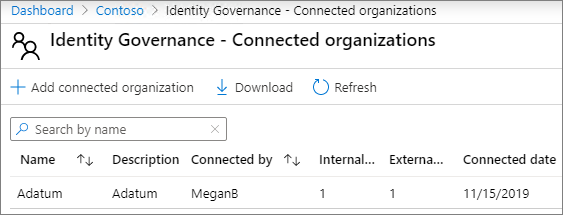
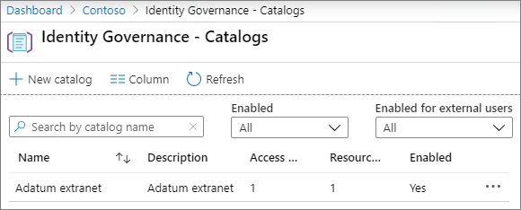
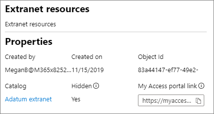

# 관리 되는 게스트를 사용 하 여 B2B 엑스트라넷 만들기

[Azure Active Directory 자격 관리](https://docs.microsoft.com/azure/active-directory/governance/entitlement-management-overview) 를 사용 하 여 B2B 엑스트라넷을 만들어 Azure active directory를 사용 하는 파트너 조직과 공동 작업을 수행할 수 있습니다. 이를 통해 사용자는 엑스트라넷 사이트 또는 팀에서 자체 등록을 허용 하 고 승인 워크플로를 통해 액세스를 받을 수 있습니다.

공동 작업을 위해 리소스를 공유 하는 방법을 사용 하는 경우 파트너 조직은 최종 게스트 사용자를 유지 관리 하 고 승인 하 고 IT 부서의 부담을 줄이고 공동 작업 계약을 통해 사용자를 관리할 수 있도록 하는 데 도움이 됩니다. 액세스용.

이 문서에서는 셀프 서비스 액세스 등록 모델을 통해 파트너 조직과 공유할 수 있는 리소스 패키지 (이 경우에는 사이트 또는 팀)를 만드는 단계를 안내 합니다. 

시작 하기 전에 파트너 조직과 공유 하려는 사이트 또는 팀을 만들고 게스트 공유에 대해 사용 하도록 설정 합니다. 자세한 내용은 [사이트에서 게스트와의 공동 작업](collaborate-in-a-site.md) 또는 [팀의 게스트 공동 작업](collaborate-as-a-team.md) 을 참조 하세요. 또한 게스트와 공동으로 작업할 때 거 버 넌 스 정책을 유지 관리 하는 데 사용할 수 있는 보안 및 규정 준수 기능에 대 한 정보를 확인 하는 보안 [게스트 공유 환경 만들기](create-a-secure-guest-sharing-environment.md) 를 검토 하는 것이 좋습니다.

## 파트너 조직 연결

파트너 조직에서 게스트를 초대 하려면 파트너의 도메인을 Azure Active Directory에 연결 된 조직으로 추가 해야 합니다.

연결 된 조직을 추가 하려면
1. [Azure Active Directory](https://aad.portal.azure.com)에서 **Id 거 버 넌 스**를 클릭 합니다.
2. **연결 된 조직을**클릭 합니다.
4. **연결 된 조직 추가**를 클릭 합니다.
5. 조직의 이름과 설명을 입력 하 고 **다음: 디렉터리 + 도메인**을 클릭 합니다.
6. **디렉터리 추가 + 도메인**을 클릭 합니다.
7. 연결 하려는 조직의 도메인을 입력 한 다음 **추가**를 클릭 합니다.
8. **연결**을 클릭 하 고 **다음: 스폰서**를 클릭 합니다.
9. 게스트 사용자에 대 한 액세스를 승인할 사용자가 조직 또는 조직의 사용자를 추가 합니다.
10. **다음: 검토 + 만들기를**클릭 합니다.
11. 선택한 설정을 검토 하 고 **만들기**를 클릭 합니다.

    

## 공유할 리소스 선택

파트너 조직과 공유할 리소스를 선택 하는 첫 번째 단계는이를 포함 하는 카탈로그를 만드는 것입니다.

카탈로그를 만들려면
1. [Azure Active Directory](https://aad.portal.azure.com)에서 **Id 거 버 넌 스**를 클릭 합니다.
2. **카탈로그**를 클릭 합니다.
3. **새 카탈로그**를 클릭 합니다.
4. 카탈로그에 대 한 이름 및 설명을 입력 하 고 **외부 사용자에 대해** **사용** 및 사용 하도록 설정 하는 것이 둘 다 **예**인지 확인 합니다.
5. **만들기**를 클릭합니다.

   

카탈로그를 만든 후 파트너 조직과 공유 하려는 SharePoint 사이트 또는 팀을 추가 합니다.

카탈로그에 리소스를 추가 하려면
1. Azure AD Id 거 버 넌 스에서 **카탈로그**를 클릭 한 다음 리소스를 추가 하려는 카탈로그를 클릭 합니다.
2. **자원을** 클릭 한 다음 **자원 추가**를 클릭 합니다.
3. 엑스트라넷에 포함할 팀 또는 SharePoint 사이트를 선택 하 고 **추가**를 클릭 합니다.

   

공유할 리소스를 정의한 후에는 파트너 사용자에 게 부여 되는 액세스 유형 및 액세스를 요청 하는 새 파트너 사용자에 대 한 승인 프로세스를 정의 하는 액세스 패키지를 만들어야 합니다.

Access 패키지를 만들려면
1. Azure AD Id 거 버 넌 스에서 **카탈로그**를 클릭 한 다음 액세스 패키지를 만들 카탈로그를 클릭 합니다.
2. **액세스 패키지**를 클릭 한 다음 **새 Access 패키지**를 클릭 합니다.
3. 액세스 패키지의 이름과 설명을 입력 하 고 **다음: 리소스 역할**을 클릭 합니다.
4. 엑스트라넷에 사용 하려는 카탈로그의 리소스를 선택 합니다.
5. 각 리소스에 대해 **역할** 열에서 엑스트라넷을 사용 하는 게스트 사용자에 게 부여할 사용자 역할을 선택 합니다.
6. **다음: 요청**을 클릭 합니다.
7. **액세스를 요청할 수 있는 사용자**에서 **디렉터리에 없는 사용자**를 선택 합니다.
8. **연결 된 특정 조직** 옵션이 선택 되어 있는지 확인 하 고 **디렉터리 추가**를 클릭 합니다.
9. 이전에 추가한 연결 된 조직을 선택 하 고 **선택을** 클릭 합니다.
10. **승인**에서 **승인 필요**에 대해 **예** 를 선택 합니다.
11. **첫 번째 승인자**아래에서 이전에 추가한 스폰서 중 하나를 선택 하거나 특정 사용자를 선택 합니다.
12. **대체 추가** 를 클릭 하 고 대체 승인자를 선택 합니다.
13. **사용**에서 **예**를 선택 합니다.
14. **다음: 수명 주기**를 클릭 합니다.
15. 사용 하려는 만료 및 액세스 검토 설정을 선택 하 고 **다음: 검토 + 만들기**를 클릭 합니다.
16. 설정을 검토 하 고 **만들기**를 클릭 합니다.

    

대규모 조직과 파트너를 연결 하는 경우 액세스 패키지를 숨길 수 있습니다. 패키지가 숨겨진 경우에는 파트너 조직의 사용자가 *내 액세스* 포털에서 패키지를 볼 수 없습니다. 대신 패키지에 등록 하기 위해 직접 링크를 보내야 합니다. 액세스 패키지를 숨기면 적절 하지 않은 액세스 요청의 수가 줄어들고 파트너 조직의 포털에 사용 가능한 액세스 패키지를 구성 하는 데도 도움이 될 수 있습니다.

액세스 패키지를 숨김으로 설정 하려면
1. Azure AD Id 거 버 넌 스에서 **액세스 패키지**를 클릭 한 다음 액세스 패키지를 클릭 합니다.
2. **개요** 페이지에서 **편집**을 클릭 합니다.
3. **속성**에서 **숨기기**에 대해 **예** 를 선택 하 고 **저장**을 클릭 합니다.

   

## 파트너 사용자 초대

액세스 패키지를 숨김으로 설정한 경우에는 사이트 또는 팀에 대 한 액세스를 요청할 수 있도록 파트너 조직에 대 한 직접 링크를 보내야 합니다.

액세스 포털 링크를 찾으려면
1. Azure AD Id 거 버 넌 스에서 **액세스 패키지**를 클릭 한 다음 액세스 패키지를 클릭 합니다.
2. **개요** 페이지에서 **내 액세스 포털 링크**에 대 한 **클립보드에 복사 링크를** 클릭 합니다.

   

링크를 복사한 후 파트너 조직에서이를 사용자의 대화 상대와 공유 하 고 공동 작업 팀원에 게 전자 메일을 보낼 수 있습니다.

## 참고 항목

[보안 게스트 공유 환경 만들기](create-a-secure-guest-sharing-environment.md)

