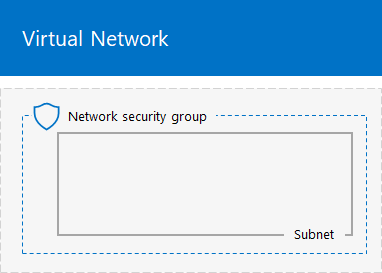

# <a name="base-configuration-devtest-environment"></a>기본 구성 개발/테스트 환경

 **요약:** Microsoft Azure에서 개발/테스트 환경으로 간소화된 인트라넷을 만듭니다.
  
이 문서에서는 Azure에서 다음과 같은 기본 구성 개발/테스트 환경을 만들기 위한 지침을 제공합니다.
  

  
**그림 1: 기본 구성 개발/테스트 환경**

그림 1의 기본 구성 개발/테스트 환경은 인터넷에 연결된 단순화된 전용 인트라넷을 시뮬레이트하는 TestLab이라는 클라우드 전용 Azure Virtual Network의 Corpnet 서브넷으로 구성됩니다. 여기에는 Windows Server 2016에서 실행되는 다음과 같은 3개의 Azure Virtual Machine이 포함되어 있습니다.
  
- DC1은 인트라넷 도메인 컨트롤러 및 DNS(Domain Name System) 서버로 구성됩니다.
    
- APP1은 일반 응용 프로그램 및 웹 서버로 구성됩니다.
    
- CLIENT1은 인트라넷 클라이언트의 역할을 합니다.
    
이 구성에서 DC1, APP1, CLIENT1 및 추가 Corpnet 서브넷 컴퓨터에 다음이 수행될 수 있습니다. 
  
- 업데이트를 설치하고, 실시간으로 인터넷 리소스에 액세스하고, Microsoft Office 365 및 기타 Azure 서비스와 같은 공용 클라우드 기술에 참여하기 위해 인터넷에 연결됩니다.
    
- 인터넷 또는 조직 네트워크에 연결된 컴퓨터에서 원격 데스크톱 연결을 사용하여 원격으로 관리됩니다.
    
다음과 같은 결과 테스트 환경을 사용할 수 있습니다.
  
- 응용 프로그램 개발 및 테스트용으로
    
- 추가 가상 머신, Azure 서비스 또는 기타 Microsoft 클라우드 서비스[예: Office 365 및 EMS(Enterprise Mobility + Security)]가 포함된 직접 디자인한 확장된 테스트 환경의 초기 구성으로
    
이 환경은 다음 두 가지 방법으로 만들 수 있습니다.

1. Azure Resource Manager 템플릿
2. Azure Powershell

## <a name="method-1-build-your-simulated-intranet-with-an-azure-resource-manager-template"></a>방법 1: Azure Resource Manager 템플릿으로 시뮬레이트된 인트라넷 만들기

이 방법에서는 ARM(Azure Resource Manager) 템플릿을 사용하여 시뮬레이트된 인트라넷을 만듭니다. ARM 템플릿에는 Azure 네트워킹 인프라 및 가상 머신을 만들고 구성하기 위한 모든 지침이 포함됩니다.

템플릿을 배포하기 전에 [템플릿 추가 정보 페이지](https://github.com/maxskunkworks/TLG/tree/master/tlg-base-config_3-vm)를 읽고 다음 정보를 준비합니다.

- Azure 구독 이름. **사용자 지정 배포** 페이지의 **구독** 필드에 이 레이블을 입력해야 합니다.
- Azure 리소스 그룹 이름. **사용자 지정 배포** 페이지의 **리소스 그룹** 필드에 이 레이블을 입력해야 합니다.
- 가상 머신의 공용 IP 주소 URL에 대한 DNS 레이블 접두사입니다. **사용자 지정 배포** 페이지의 **DNS 레이블 접두사** 필드에 이 레이블을 입력해야 합니다.

지침을 읽은 후 [템플릿 추가 정보 페이지](https://github.com/maxskunkworks/TLG/tree/master/tlg-base-config_3-vm)에서 **Azure로 배포**를 클릭하여 시작합니다.

>[!Note]
>ARM 템플릿에서 만든 시뮬레이트된 인트라넷은 유료 Azure 구독이 있어야 합니다.
>

템플릿이 완료된 후 구성입니다.


## <a name="method-2-build-your-simulated-intranet-with-azure-powershell"></a>방법 2: Azure PowerShell로 시뮬레이트된 인트라넷 만들기

이 방법에서는 Windows PowerShell 및 Azure PowerShell 모듈을 사용하여 네트워킹 인프라, 가상 머신 및 해당 구성을 만듭니다.

PowerShell을 통해 한 번에 하나의 명령 블록씩 Azure 인프라의 요소를 만들려는 경우 이 방법을 사용합니다. Azure에서 다른 가상 머신을 직접 배포하기 위해 PowerShell 명령 블록을 사용자 지정할 수 있습니다.

Azure PowerShell에서 기본 구성 테스트 환경을 설정하는 과정은 다음 4단계로 진행됩니다.
  
1. 가상 네트워크를 만듭니다.
    
2. DC1을 구성합니다.
    
3. APP1을 구성합니다.
    
4. CLIENT1을 구성합니다.
    
Azure 구독이 아직 없으면 [Azure 평가](https://azure.microsoft.com/pricing/free-trial/)에서 평가판에 등록할 수 있습니다. MSDN 또는 Visual Studio 구독이 있는 경우 [Visual Studio 구독자를 위한 월별 Azure 크레딧](https://azure.microsoft.com/pricing/member-offers/msdn-benefits-details/)을 참조하세요.
  
> [!NOTE]
> Azure의 가상 머신은 실행될 때 비용이 계속 발생합니다. 이 비용은 평가판, MSDN 구독 또는 유료 구독과 별도로 청구됩니다. Azure Virtual Machine을 실행하는 비용에 대한 자세한 내용은 [가상 머신 가격 책정 정보](https://azure.microsoft.com/pricing/details/virtual-machines/) 및 [Azure 가격 계산기](https://azure.microsoft.com/pricing/calculator/)를 참조하세요. 비용을 줄이려면 [Azure에서 테스트 환경 가상 머신 비용 최소화](base-configuration-dev-test-environment.md#mincost)를 참조하세요. 
  

  
> [!TIP]
> [여기](http://aka.ms/catlgstack)를 클릭하여 One Microsoft 클라우드 테스트 랩 가이드 스택의 모든 문서에 대한 가상 맵을 확인할 수 있습니다.
  
### <a name="step-1-create-the-virtual-network"></a>1단계: 가상 네트워크 만들기

이 단계에서는 Azure의 테스트 랩 가상 네트워크를 사용합니다.

먼저 Azure PowerShell 프롬프트를 시작합니다.
  
> [!NOTE]
> 다음 명령 집합은 최신 버전의 Azure PowerShell을 사용합니다. [Azure PowerShell cmdlet으로 시작](https://docs.microsoft.com/ko-KR/powershell/azureps-cmdlets-docs/)을 참조하세요. 
  
다음 명령을 사용하여 Azure 계정에 로그인합니다.
  
```
Connect-AzAccount
```

<!--
> [!TIP]
> Click [here](https://gallery.technet.microsoft.com/PowerShell-commands-for-ba957d3d) to get a text file that has all the PowerShell commands in this article.
-->

다음 명령을 사용하여 구독 이름을 가져옵니다.
  
```
Get-AzSubscription | Sort Name | Select Name
```

Azure 구독을 설정합니다. < 및 > 문자를 포함하여 따옴표 안에 있는 모든 것을 올바른 이름으로 바꿉니다.
  
```
$subscr="<subscription name>"
Select-AzSubscription -SubscriptionName $subscrName -Current
```

다음으로 기본 구성 테스트 랩에 대한 새 리소스 그룹을 만듭니다. 고유한 리소스 그룹 이름을 확인하려면 이 명령을 사용하여 기존 리소스 그룹을 나열합니다.
  
```
Get-AzResourceGroup | Sort ResourceGroupName | Select ResourceGroupName
```

이러한 명령을 사용하여 새 리소스 그룹을 만듭니다. < 및 > 문자를 포함하여 따옴표 안에 있는 모든 내용을 올바른 이름으로 바꿉니다.
  
```
$rgName="<resource group name>"
$locName="<location name, such as West US>"
New-AzResourceGroup -Name $rgName -Location $locName
```

다음으로, 기본 구성의 Corpnet 서브넷을 호스트할 TestLab 가상 네트워크를 만들고 네트워크 보안 그룹으로 보호합니다.
  
```
$rgName="<name of your new resource group>"
$locName=(Get-AzResourceGroup -Name $rgName).Location
$corpnetSubnet=New-AzVirtualNetworkSubnetConfig -Name Corpnet -AddressPrefix 10.0.0.0/24
New-AzVirtualNetwork -Name TestLab -ResourceGroupName $rgName -Location $locName -AddressPrefix 10.0.0.0/8 -Subnet $corpnetSubnet -DNSServer 10.0.0.4
$rule1=New-AzNetworkSecurityRuleConfig -Name "RDPTraffic" -Description "Allow RDP to all VMs on the subnet" -Access Allow -Protocol Tcp -Direction Inbound -Priority 100 -SourceAddressPrefix Internet -SourcePortRange * -DestinationAddressPrefix * -DestinationPortRange 3389
New-AzNetworkSecurityGroup -Name Corpnet -ResourceGroupName $rgName -Location $locName -SecurityRules $rule1
$vnet=Get-AzVirtualNetwork -ResourceGroupName $rgName -Name TestLab
$nsg=Get-AzNetworkSecurityGroup -Name Corpnet -ResourceGroupName $rgName
Set-AzVirtualNetworkSubnetConfig -VirtualNetwork $vnet -Name Corpnet -AddressPrefix "10.0.0.0/24" -NetworkSecurityGroup $nsg
```

다음은 현재 구성입니다.
  

  
### <a name="step-2-configure-dc1"></a>2단계: DC1 구성

이 단계에서는 DC1 가상 머신을 만들고 Windows Server AD(Active Directory) 도메인 corp.contoso.com 및 TestLab 가상 네트워크의 가상 머신에 대한 DNS 서버의 도메인 컨트롤러로 구성합니다.

> [!NOTE]
> 다음 명령 블록을 실행하기 전에 선택한 Azure 지역(위치)이 기본적으로 Standard_A1으로 설정된 Azure Virtual Machine 크기를 지원하는지 확인합니다. [여기](https://azure.microsoft.com/global-infrastructure/services/?products=virtual-machines)를 클릭하여 Azure Virtual Machine 크기 및 위치에 대한 최신 정보를 확인합니다.
  
DC1에 대한 Azure Virtual Machine을 만들려면 리소스 그룹의 이름을 입력하고 로컬 컴퓨터의 Azure PowerShell 명령 프롬프트에서 다음 명령을 실행합니다.
  
```
$rgName="<resource group name>"
$locName=(Get-AzResourceGroup -Name $rgName).Location
$vnet=Get-AzVirtualNetwork -Name TestLab -ResourceGroupName $rgName
$pip=New-AzPublicIpAddress -Name DC1-PIP -ResourceGroupName $rgName -Location $locName -AllocationMethod Dynamic
$nic=New-AzNetworkInterface -Name DC1-NIC -ResourceGroupName $rgName -Location $locName -SubnetId $vnet.Subnets[0].Id -PublicIpAddressId $pip.Id -PrivateIpAddress 10.0.0.4
$vm=New-AzVMConfig -VMName DC1 -VMSize Standard_A1
$cred=Get-Credential -Message "Type the name and password of the local administrator account for DC1."
$vm=Set-AzVMOperatingSystem -VM $vm -Windows -ComputerName DC1 -Credential $cred -ProvisionVMAgent -EnableAutoUpdate
$vm=Set-AzVMSourceImage -VM $vm -PublisherName MicrosoftWindowsServer -Offer WindowsServer -Skus 2016-Datacenter -Version "latest"
$vm=Add-AzVMNetworkInterface -VM $vm -Id $nic.Id
$vm=Set-AzVMOSDisk -VM $vm -Name "DC1-OS" -DiskSizeInGB 128 -CreateOption FromImage -StorageAccountType "Standard_LRS"
$diskConfig=New-AzDiskConfig -AccountType "Standard_LRS" -Location $locName -CreateOption Empty -DiskSizeGB 20
$dataDisk1=New-AzDisk -DiskName "DC1-DataDisk1" -Disk $diskConfig -ResourceGroupName $rgName
$vm=Add-AzVMDataDisk -VM $vm -Name "DC1-DataDisk1" -CreateOption Attach -ManagedDiskId $dataDisk1.Id -Lun 1
New-AzVM -ResourceGroupName $rgName -Location $locName -VM $vm
```

DC1의 로컬 관리자 계정에 대한 사용자 이름과 암호를 입력하라는 메시지가 표시됩니다. 강력한 암호를 사용하고 이름 및 암호를 안전한 위치에 보관합니다.
  
다음으로, DC1 가상 머신에 연결합니다.
  
1. [Azure Portal](https://portal.azure.com)에서 **리소스 그룹 >** [새 리소스 그룹의 이름] **> DC1 > 연결**을 클릭합니다.
    
2. 열려 있는 창에서 **RDP 파일 다운로드**를 클릭합니다. 다운로드된 DC1.rdp 파일을 열고 **연결**을 클릭합니다.
    
3. DC1 로컬 관리자 계정 이름을 지정합니다.
    
  - Windows 7:
    
    **Windows 보안** 대화 상자에서 **다른 계정 사용**을 클릭합니다. **사용자 이름**에서 **DC1\\**[로컬 관리자 계정 이름]을 입력합니다.
    
  - Windows 8.1 또는 Windows 10:
    
    **Windows 보안** 대화 상자에서 **기타 선택 사항**을 클릭하고 **다른 계정 사용**을 클릭합니다. **사용자 이름**에서 **DC1\\**[로컬 관리자 계정 이름]을 입력합니다.
    
4. **암호**에서 로컬 관리자 계정의 암호를 입력하고 **확인**을 클릭합니다.
    
5. 메시지가 표시되면 **예**를 클릭합니다.
    
다음으로 DC1의 관리자 수준 Windows PowerShell 명령 프롬프트에서 다음 명령을 사용하여 추가 데이터 디스크를 드라이브 문자 F:의 새로운 볼륨으로 추가합니다.
  
```
Get-Disk | Where PartitionStyle -eq "RAW" | Initialize-Disk -PartitionStyle MBR -PassThru | New-Partition -AssignDriveLetter -UseMaximumSize | Format-Volume -FileSystem NTFS -NewFileSystemLabel "WSAD Data"
```

그런 다음 DC1을 corp.contoso.com 도메인에 대한 도메인 컨트롤러 및 DNS 서버로 구성합니다. 관리자 수준 Windows PowerShell 명령 프롬프트에서 다음 명령을 실행합니다.
  
```
Install-WindowsFeature AD-Domain-Services -IncludeManagementTools
Install-ADDSForest -DomainName corp.contoso.com -DatabasePath "F:\NTDS" -SysvolPath "F:\SYSVOL" -LogPath "F:\Logs"
```
안전 모드 관리자 암호를 지정해야 합니다. 이 암호를 안전한 장소에 저장합니다.
  
이러한 명령은 완료하는 데 몇 분 정도 걸릴 수 있습니다.
  
DC1이 다시 시작되면 도메인 자격 증명을 사용하여 DC1 가상 머신에 다시 연결합니다.
  
1. [Azure Portal](https://portal.azure.com)에서 **리소스 그룹 >** [리소스 그룹 이름] **> DC1 > 연결**을 클릭합니다.
    
2. 다운로드된 DC1.rdp 파일을 실행하고 **연결**을 클릭합니다.
    
3. **Windows 보안**에서 **다른 계정 사용**을 클릭합니다. **사용자 이름**에서 **CORP\\**[로컬 관리자 계정 이름]을 입력합니다.
    
4. **암호**에서 로컬 관리자 계정의 암호를 입력하고 **확인**을 클릭합니다.
    
5. 메시지가 표시되면 **예**를 클릭합니다.
    
다음으로, CORP 도메인 구성원 컴퓨터에 로그인할 때 사용할 사용자 계정을 Active Directory에서 만듭니다. 관리자 수준 Windows PowerShell 명령 프롬프트에서 다음 명령을 실행합니다.
  
```
New-ADUser -SamAccountName User1 -AccountPassword (read-host "Set user password" -assecurestring) -name "User1" -enabled $true -PasswordNeverExpires $true -ChangePasswordAtLogon $false
```

이 명령은 User1 계정 암호를 묻는 메시지를 표시합니다. 이 계정은 모든 CORP 도메인 구성원 컴퓨터에 대한 원격 데스크톱 연결에 사용되므로 강력한 암호를 선택합니다. User1 계정 암호를 기록한 후 안전한 위치에 보관합니다.
  
다음으로, 새 User1 계정을 엔터프라이즈 관리자로 구성합니다. 관리자 수준 Windows PowerShell 명령 프롬프트에서 다음 명령을 실행합니다.
  
```
Add-ADPrincipalGroupMembership -Identity "CN=User1,CN=Users,DC=corp,DC=contoso,DC=com" -MemberOf "CN=Enterprise Admins,CN=Users,DC=corp,DC=contoso,DC=com","CN=Domain Admins,CN=Users,DC=corp,DC=contoso,DC=com","CN=Schema Admins,CN=Users,DC=corp,DC=contoso,DC=com"
```

DC1과의 원격 데스크톱 세션을 닫은 후 CORP\\User1 계정을 사용하여 다시 연결합니다.
  
다음으로, Ping 도구에 대한 트래픽을 허용하려면 관리자 수준의 Windows PowerShell 명령 프롬프트에서 다음 명령을 실행합니다.
  
```
Set-NetFirewallRule -DisplayName "File and Printer Sharing (Echo Request - ICMPv4-In)" -enabled True
```

다음은 현재 구성입니다.
  

  
### <a name="step-3-configure-app1"></a>3단계: APP1 구성

이 단계에서는 처음에 웹 및 파일 공유 서비스를 제공하는 APP1을 만들고 구성합니다.

> [!NOTE]
> 다음 명령 블록을 실행하기 전에 선택한 Azure 지역(위치)이 기본적으로 Standard_A1으로 설정된 Azure Virtual Machine 크기를 지원하는지 확인합니다. [여기](https://azure.microsoft.com/global-infrastructure/services/?products=virtual-machines)를 클릭하여 Azure Virtual Machine 크기 및 위치에 대한 최신 정보를 확인합니다.
  
APP1에 대한 Azure Virtual Machine을 만들려면 리소스 그룹의 이름을 입력하고 로컬 컴퓨터의 Azure PowerShell 명령 프롬프트에서 다음 명령을 실행합니다.
  
```
$rgName="<resource group name>"
$locName=(Get-AzResourceGroup -Name $rgName).Location
$vnet=Get-AzVirtualNetwork -Name TestLab -ResourceGroupName $rgName
$pip=New-AzPublicIpAddress -Name APP1-PIP -ResourceGroupName $rgName -Location $locName -AllocationMethod Dynamic
$nic=New-AzNetworkInterface -Name APP1-NIC -ResourceGroupName $rgName -Location $locName -SubnetId $vnet.Subnets[0].Id -PublicIpAddressId $pip.Id
$vm=New-AzVMConfig -VMName APP1 -VMSize Standard_A1
$cred=Get-Credential -Message "Type the name and password of the local administrator account for APP1."
$vm=Set-AzVMOperatingSystem -VM $vm -Windows -ComputerName APP1 -Credential $cred -ProvisionVMAgent -EnableAutoUpdate
$vm=Set-AzVMSourceImage -VM $vm -PublisherName MicrosoftWindowsServer -Offer WindowsServer -Skus 2016-Datacenter -Version "latest"
$vm=Add-AzVMNetworkInterface -VM $vm -Id $nic.Id
$vm=Set-AzVMOSDisk -VM $vm -Name "APP1-OS" -DiskSizeInGB 128 -CreateOption FromImage -StorageAccountType "Standard_LRS"
New-AzVM -ResourceGroupName $rgName -Location $locName -VM $vm
```

다음으로, APP1 로컬 관리자 계정 이름과 암호를 사용하여 APP1 가상 머신에 연결하고 Windows PowerShell 명령 프롬프트를 엽니다.
  
APP1과 DC1 사이의 이름 확인 및 네트워크 통신을 확인하려면 **ping dc1.corp.contoso.com** 명령을 실행하고 4개의 응답이 있는지 확인합니다.
  
다음으로, Windows PowerShell 프롬프트에 다음 명령을 사용하여 APP1 가상 머신을 CORP 도메인에 가입합니다.
  
```
Add-Computer -DomainName corp.contoso.com
Restart-Computer
```

**Add-Computer** 명령을 실행한 후 CORP\\User1 도메인 계정 자격 증명을 제공해야 합니다.
  
APP1을 다시 시작한 후에 CORP\\User1 계정을 사용하여 연결한 후 관리자 수준 Windows PowerShell 명령 프롬프트를 엽니다.
  
다음으로, APP1의 Windows PowerShell 명령 프롬프트에서 다음 명령을 사용하여 APP1을 웹 서버로 만듭니다.
  
```
Install-WindowsFeature Web-WebServer -IncludeManagementTools
```

그런 후 다음 PowerShell 명령을 사용하여 APP1의 폴더 내에 공유 폴더 및 텍스트 파일을 만듭니다.
  
```
New-Item -path c:\files -type directory
Write-Output "This is a shared file." | out-file c:\files\example.txt
New-SmbShare -name files -path c:\files -changeaccess CORP\User1
```

다음은 현재 구성입니다.
  

  
### <a name="step-4-configure-client1"></a>4단계: CLIENT1 구성

이 단계에서는 Contoso 인트라넷에서 전형적인 랩톱, 태블릿 또는 데스크톱 컴퓨터의 역할을 하는 CLIENT1을 만들고 구성합니다.

> [!NOTE]  
> 다음 명령 집합은 Windows Server 2016 Datacenter를 실행하는 CLIENT1을 만듭니다. 이 작업은 모든 유형의 Azure 구독에서 수행할 수 있습니다. Visual Studio 기반 Azure 구독이 있는 경우 [Azure Portal](https://portal.azure.com)을 사용하여 Windows 10이 실행되는 CLIENT1을 만들 수 있습니다. 
  

> [!NOTE]
> 다음 명령 블록을 실행하기 전에 선택한 Azure 지역(위치)이 기본적으로 Standard_A1으로 설정된 Azure Virtual Machine 크기를 지원하는지 확인합니다. [여기](https://azure.microsoft.com/global-infrastructure/services/?products=virtual-machines)를 클릭하여 Azure Virtual Machine 크기 및 위치에 대한 최신 정보를 확인합니다.
  
먼저 리소스 그룹의 이름을 입력하고 로컬 컴퓨터의 Azure PowerShell 명령 프롬프트에 다음 명령을 실행하여 CLIENT1에 대한 Azure Virtual Machine을 만듭니다.
  
```
$rgName="<resource group name>"
$locName=(Get-AzResourceGroup -Name $rgName).Location
$vnet=Get-AzVirtualNetwork -Name TestLab -ResourceGroupName $rgName
$pip=New-AzPublicIpAddress -Name CLIENT1-PIP -ResourceGroupName $rgName -Location $locName -AllocationMethod Dynamic
$nic=New-AzNetworkInterface -Name CLIENT1-NIC -ResourceGroupName $rgName -Location $locName -SubnetId $vnet.Subnets[0].Id -PublicIpAddressId $pip.Id
$vm=New-AzVMConfig -VMName CLIENT1 -VMSize Standard_A1
$cred=Get-Credential -Message "Type the name and password of the local administrator account for CLIENT1."
$vm=Set-AzVMOperatingSystem -VM $vm -Windows -ComputerName CLIENT1 -Credential $cred -ProvisionVMAgent -EnableAutoUpdate
$vm=Set-AzVMSourceImage -VM $vm -PublisherName MicrosoftWindowsServer -Offer WindowsServer -Skus 2016-Datacenter -Version "latest"
$vm=Add-AzVMNetworkInterface -VM $vm -Id $nic.Id
$vm=Set-AzVMOSDisk -VM $vm -Name "CLIENT1-OS" -DiskSizeInGB 128 -CreateOption FromImage -StorageAccountType "Standard_LRS"
New-AzVM -ResourceGroupName $rgName -Location $locName -VM $vm
```

다음으로, CLIENT1 로컬 관리자 계정 이름과 암호를 사용하여 CLIENT1 가상 머신에 연결하고 관리자 수준 Windows PowerShell 명령 프롬프트를 엽니다.
  
CLIENT1과 DC1 사이의 이름 확인 및 네트워크 통신을 확인하려면 Windows PowerShell 명령 프롬프트에서 **ping dc1.corp.contoso.com** 명령을 실행하고 4개의 응답이 있는지 확인합니다.
  
다음으로, Windows PowerShell 프롬프트에 다음 명령을 사용하여 CLIENT1 가상 머신을 CORP 도메인에 가입합니다.
  
```
Add-Computer -DomainName corp.contoso.com
Restart-Computer
```

**Add-Computer** 명령을 실행한 후 CORP\\User1 도메인 계정 자격 증명을 제공해야 합니다.
  
CLIENT1을 다시 시작한 후에 CORP\\User1 계정 이름 및 암호를 사용하여 연결한 후 관리자 수준 Windows PowerShell 명령 프롬프트를 엽니다.
  
그런 다음, CLIENT1에서 APP1의 웹 및 파일 공유 리소스에 액세스할 수 있는지 확인합니다.
  
1. 서버 관리자의 트리 창에서 **로컬 서버**를 클릭합니다.
    
2. **CLIENT1에 대한 속성**에서 **IE 보안 강화 구성** 옆의 **켜기**를 클릭합니다.
    
3. **Internet Explorer 보안 강화 구성**에서 **관리자** 및 **사용자**에 대해 **끄기**를 클릭한 후 ** 확인**을 클릭합니다.
    
4. 시작 화면에서 **Internet Explorer**를 클릭하고 **확인**을 클릭합니다.
    
5. 주소 표시줄에 **http:\//app1.corp.contoso.com/** 을 입력하고 Enter 키를 누릅니다. APP1에 대한 기본 인터넷 정보 서비스 웹 페이지가 표시됩니다.
    
6. 바탕 화면 작업 표시줄에서 파일 탐색기 아이콘을 클릭합니다.
    
7. 주소 표시줄에 **\\\\app1\\Files일**를 입력하고 Enter 키를 누릅니다. Files 공유 폴더의 내용이 포함된 폴더 창이 표시됩니다.
    
8. **Files** 공유 폴더 창에서 **Example.txt** 파일을 두 번 클릭합니다. Example.txt 파일의 내용을 표시됩니다.
    
9. **example.txt - 메모장**과 **Files** 공유 폴더 창을 닫습니다.
    
다음은 최종 구성입니다.
  

  
Azure의 기본 구성은 이제 응용 프로그램 개발 및 테스트나 추가 테스트 환경 구축에 사용할 수 있습니다. 
  
> [!TIP]
> [여기](http://aka.ms/catlgstack)를 클릭하여 One Microsoft 클라우드 테스트 랩 가이드 스택의 모든 기사에 대한 가상 맵을 확인할 수 있습니다.
  
<a name="mincost"> </a>
## <a name="minimizing-the-costs-of-test-environment-virtual-machines-in-azure"></a>Azure의 테스트 환경 가상 머신 비용 최소화

테스트 환경 가상 머신의 실행 비용을 최소화하려면 다음 중 하나를 수행할 수 있습니다.
  
- 테스트 환경을 만들고 가능한 한 빠르게 필요한 테스트 및 데모를 수행합니다. 완료되면 테스트 환경에 대한 리소스 그룹을 삭제합니다.
    
- 테스트 환경 가상 머신을 할당 취소 상태로 종료합니다.
    
Azure PowerShell을 사용하여 가상 머신을 종료하려면 리소스 그룹 이름을 채우고 다음 명령을 실행합니다.
  
```
$rgName="<your resource group name>"
Stop-AzVM -ResourceGroupName $rgName -Name "CLIENT1" -Force
Stop-AzVM -ResourceGroupName $rgName -Name "APP1" -Force
Stop-AzVM -ResourceGroupName $rgName -Name "DC1" -Force
```

중지됨(할당 해제됨) 상태에서 모든 가상 머신을 시작할 때 가상 머신이 적절히 작동되도록 하려면 다음 순서로 시작해야 합니다.
  
1. DC1
2. APP1
3. CLIENT1
    
Azure PowerShell을 사용하여 가상 머신을 순서대로 시작하려면 리소스 그룹 이름을 채우고 다음 명령을 실행합니다.
  
```
$rgName="<your resource group name>"
Start-AzVM -ResourceGroupName $rgName -Name "DC1"
Start-AzVM -ResourceGroupName $rgName -Name "APP1"
Start-AzVM -ResourceGroupName $rgName -Name "CLIENT1"
```

## <a name="see-also"></a>참고 항목

- [Office 365 개발/테스트 환경](office-365-dev-test-environment.md)
- [Office 365 개발/테스트 환경용 DirSync](dirsync-for-your-office-365-dev-test-environment.md)
- [Office 365 개발/테스트 환경용 Cloud App Security](cloud-app-security-for-your-office-365-dev-test-environment.md)
- [Office 365 개발/테스트 환경용 Advanced Threat Protection](advanced-threat-protection-for-your-office-365-dev-test-environment.md)
- [클라우드 도입 및 하이브리드 솔루션](cloud-adoption-and-hybrid-solutions.md)
