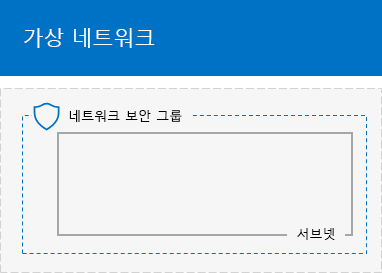
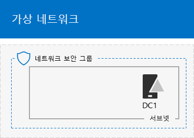
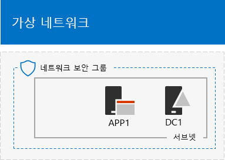

# <a name="base-configuration-devtest-environment"></a><span data-ttu-id="f8a9e-103">기본 구성 개발/테스트 환경</span><span class="sxs-lookup"><span data-stu-id="f8a9e-103">Base Configuration dev/test environment</span></span>

 <span data-ttu-id="f8a9e-104">**요약:** Microsoft Azure의 개발/테스트 환경으로 단순화 된 인트라넷을 만듭니다.</span><span class="sxs-lookup"><span data-stu-id="f8a9e-104">**Summary:** Create a simplified intranet as a dev/test environment in Microsoft Azure.</span></span>
  
<span data-ttu-id="f8a9e-105">이 문서에서는 Azure에는 다음과 같은 기본 구성 개발/테스트 환경을 만드는 단계별 지침을를 제공 합니다.</span><span class="sxs-lookup"><span data-stu-id="f8a9e-105">This article provides you with step-by-step instructions to create the following Base Configuration dev/test environment in Azure:</span></span>
  
<span data-ttu-id="f8a9e-106">**그림 1: 기본 구성 개발/테스트 환경**</span><span class="sxs-lookup"><span data-stu-id="f8a9e-106">**Figure 1: The Base Configuration dev/test environment**</span></span>


  
<span data-ttu-id="f8a9e-p101">그림 1의 기본 구성 개발/테스트 환경에서 클라우드 전용 Azure 가상 네트워크를 인터넷에 연결 하는 간소화 된, 개인 인트라넷을 시뮬레이션 하는 테스트 실습 라는 회사 서브넷으로 이루어져 있습니다. 세 Azure 가상 컴퓨터를 포함 합니다.</span><span class="sxs-lookup"><span data-stu-id="f8a9e-p101">The Base Configuration dev/test environment in Figure 1 consists of the Corpnet subnet in a cloud-only Azure virtual network named TestLab that simulates a simplified, private intranet connected to the Internet. It contains three Azure virtual machines:</span></span>
  
- <span data-ttu-id="f8a9e-110">D c 1에는 인트라넷 도메인 컨트롤러와 도메인 이름 시스템 (DNS) 서버 구성</span><span class="sxs-lookup"><span data-stu-id="f8a9e-110">DC1 is configured as an intranet domain controller and Domain Name System (DNS) server</span></span>
    
- <span data-ttu-id="f8a9e-111">A p p 1 일반 응용 프로그램 및 웹 서버 구성</span><span class="sxs-lookup"><span data-stu-id="f8a9e-111">APP1 is configured as a general application and web server</span></span>
    
- <span data-ttu-id="f8a9e-112">인트라넷 클라이언트로 CLIENT1 역</span><span class="sxs-lookup"><span data-stu-id="f8a9e-112">CLIENT1 acts as an intranet client</span></span>
    
<span data-ttu-id="f8a9e-113">이 구성에서 d c 1, a p p 1, CLIENT1, 및 추가 회사 서브넷 컴퓨터 수를 허용:</span><span class="sxs-lookup"><span data-stu-id="f8a9e-113">This configuration allows DC1, APP1, CLIENT1, and additional Corpnet subnet computers to be:</span></span> 
  
- <span data-ttu-id="f8a9e-114">업데이트를 설치 하려면 인터넷에 연결을 사용 실시간으로 인터넷 리소스에 액세스 하 고 Microsoft Office 365 및 기타 Azure 서비스와 같은 공용 클라우드 기술에 참여 합니다.</span><span class="sxs-lookup"><span data-stu-id="f8a9e-114">Connected to the Internet to install updates, access Internet resources in real time, and participate in public cloud technologies such as Microsoft Office 365 and other Azure services.</span></span>
    
- <span data-ttu-id="f8a9e-115">인터넷 이나 조직 네트워크에 연결 된 컴퓨터에서 원격 데스크톱 연결을 사용 하 여 원격으로 관리 합니다.</span><span class="sxs-lookup"><span data-stu-id="f8a9e-115">Remotely managed using Remote Desktop connections from your computer that is connected to the Internet or your organization network.</span></span>
    
<span data-ttu-id="f8a9e-116">결과 테스트 환경에 사용할 수 있습니다.</span><span class="sxs-lookup"><span data-stu-id="f8a9e-116">You can use the resulting test environment:</span></span>
  
- <span data-ttu-id="f8a9e-117">응용 프로그램 개발 및 테스트 합니다.</span><span class="sxs-lookup"><span data-stu-id="f8a9e-117">For application development and testing.</span></span>
    
- <span data-ttu-id="f8a9e-118">으로 가상 컴퓨터를 추가, Azure 서비스 또는 Office 365 및 엔터프라이즈 보안 + 이동성 (EMS)와 같은 다른 Microsoft 클라우드 서비스를 포함 하는 디자인의 확장된 테스트 환경의 초기 구성 합니다.</span><span class="sxs-lookup"><span data-stu-id="f8a9e-118">As the initial configuration of an extended test environment of your own design that includes additional virtual machines, Azure services, or other Microsoft cloud offerings such as Office 365 and Enterprise Security + Mobility (EMS).</span></span>
    
<span data-ttu-id="f8a9e-119">Azure의 기본 구성 테스트 환경을 설정 하는 4 단계로 가지가 있습니다.</span><span class="sxs-lookup"><span data-stu-id="f8a9e-119">There are four phases to setting up the Base Configuration test environment in Azure:</span></span>
  
1. <span data-ttu-id="f8a9e-120">가상 네트워크를 만듭니다.</span><span class="sxs-lookup"><span data-stu-id="f8a9e-120">Create the virtual network.</span></span>
    
2. <span data-ttu-id="f8a9e-121">D c 1을 구성 합니다.</span><span class="sxs-lookup"><span data-stu-id="f8a9e-121">Configure DC1.</span></span>
    
3. <span data-ttu-id="f8a9e-122">A p p 1을 구성 합니다.</span><span class="sxs-lookup"><span data-stu-id="f8a9e-122">Configure APP1.</span></span>
    
4. <span data-ttu-id="f8a9e-123">CLIENT1을 구성 합니다.</span><span class="sxs-lookup"><span data-stu-id="f8a9e-123">Configure CLIENT1.</span></span>
    
<span data-ttu-id="f8a9e-p102">Azure에 구독 아직 없는 경우 무료 평가판을 신청 [시도 Azure](https://azure.microsoft.com/pricing/free-trial/)에서 서명할 수 있습니다. MSDN 또는 Visual Studio 구독이 있는 경우 [Visual Studio 구독자에 대 한 월별 Azure 신용](https://azure.microsoft.com/pricing/member-offers/msdn-benefits-details/)를 참조 하십시오.</span><span class="sxs-lookup"><span data-stu-id="f8a9e-p102">If you do not already have an Azure subscription, you can sign up for a free trial at [Try Azure](https://azure.microsoft.com/pricing/free-trial/). If you have an MSDN or Visual Studio subscription, see [Monthly Azure credit for Visual Studio subscribers](https://azure.microsoft.com/pricing/member-offers/msdn-benefits-details/).</span></span>
  
> [!NOTE]
> <span data-ttu-id="f8a9e-p103">Azure에 가상 컴퓨터를 실행 하는 경우는 진행 중인 통화 비용을 발생 시킵니다. 이 비용 무료 평가판, MSDN 구독에 대 한 청구 또는 구독 된 급여입니다. Azure 가상 컴퓨터를 실행 하는 비용에 대 한 자세한 내용은 [가상 컴퓨터 가격 정보](https://azure.microsoft.com/pricing/details/virtual-machines/) 및 [Azure 가격 계산기 (영문)을](https://azure.microsoft.com/pricing/calculator/)참조 하십시오. 비용을 유지 하려면 [Azure의 테스트 환경 가상 컴퓨터의 비용을 최소화 하기](base-configuration-dev-test-environment.md#mincost)를 참조 합니다.</span><span class="sxs-lookup"><span data-stu-id="f8a9e-p103">Virtual machines in Azure incur an ongoing monetary cost when they are running. This cost is billed against your free trial, MSDN subscription, or paid subscription. For more information about the costs of running Azure virtual machines, see [Virtual Machines Pricing Details](https://azure.microsoft.com/pricing/details/virtual-machines/) and [Azure Pricing Calculator](https://azure.microsoft.com/pricing/calculator/). To keep costs down, see [Minimizing the costs of test environment virtual machines in Azure](base-configuration-dev-test-environment.md#mincost).</span></span> 
  

  
> [!TIP]
> <span data-ttu-id="f8a9e-131">클릭 [여기](http://aka.ms/catlgstack) 에 한 맵이 하나의 Microsoft 클라우드 테스트 랩 가이드 스택의 모든 문서를 시각적으로 표시 합니다.</span><span class="sxs-lookup"><span data-stu-id="f8a9e-131">Click [here](http://aka.ms/catlgstack) for a visual map to all the articles in the One Microsoft Cloud Test Lab Guide stack.</span></span>
  
## <a name="phase-1-create-the-virtual-network"></a><span data-ttu-id="f8a9e-132">1 단계: 가상 네트워크 만들기</span><span class="sxs-lookup"><span data-stu-id="f8a9e-132">Phase 1: Create the virtual network</span></span>

<span data-ttu-id="f8a9e-133">먼저, Azure PowerShell 프롬프트를 시작 합니다.</span><span class="sxs-lookup"><span data-stu-id="f8a9e-133">First, start an Azure PowerShell prompt.</span></span>
  
> [!NOTE]
> <span data-ttu-id="f8a9e-p104">Azure PowerShell의 최신 버전을 사용 하는 다음 명령 집합입니다. [Azure PowerShell cmdlet 시작](https://docs.microsoft.com/en-us/powershell/azureps-cmdlets-docs/)을 참조 하십시오.</span><span class="sxs-lookup"><span data-stu-id="f8a9e-p104">The following command sets use the latest version of Azure PowerShell. See [Get started with Azure PowerShell cmdlets](https://docs.microsoft.com/en-us/powershell/azureps-cmdlets-docs/).</span></span> 
  
<span data-ttu-id="f8a9e-136">다음 명령 사용 하 여 Azure 계정에 로그인 합니다.</span><span class="sxs-lookup"><span data-stu-id="f8a9e-136">Sign in to your Azure account with the following command.</span></span>
  
```
Login-AzureRMAccount
```

> [!TIP]
> <span data-ttu-id="f8a9e-137">클릭 [여기](https://gallery.technet.microsoft.com/PowerShell-commands-for-ba957d3d) 이 문서의 모든 PowerShell 명령을 포함 된 텍스트 파일을 가져오도록 합니다.</span><span class="sxs-lookup"><span data-stu-id="f8a9e-137">Click [here](https://gallery.technet.microsoft.com/PowerShell-commands-for-ba957d3d) to get a text file that contains all the PowerShell commands in this article.</span></span>
  
<span data-ttu-id="f8a9e-138">다음 명령을 사용하여 구독 이름을 가져옵니다.</span><span class="sxs-lookup"><span data-stu-id="f8a9e-138">Get your subscription name using the following command.</span></span>
  
```
Get-AzureRMSubscription | Sort Name | Select Name
```

<span data-ttu-id="f8a9e-p105">Azure 구독을 설정합니다. <and> 문자를 포함하여 따옴표 안에 있는 모든 것을 올바른 이름으로 바꿉니다.</span><span class="sxs-lookup"><span data-stu-id="f8a9e-p105">Set your Azure subscription. Replace everything within the quotes, including the < and > characters, with the correct name.</span></span>
  
```
$subscr="<subscription name>"
Get-AzureRmSubscription -SubscriptionName $subscr | Select-AzureRmSubscription
```

<span data-ttu-id="f8a9e-p106">다음으로, 기본 구성 테스트 랩 환경에 대 한 새 자원 그룹을 만듭니다. 고유한 리소스 그룹 이름을 확인 하려면 기존 리소스 그룹을 나열 하려면이 명령을 사용 합니다.</span><span class="sxs-lookup"><span data-stu-id="f8a9e-p106">Next, create a new resource group for your Base Configuration test lab. To determine a unique resource group name, use this command to list your existing resource groups.</span></span>
  
```
Get-AzureRMResourceGroup | Sort ResourceGroupName | Select ResourceGroupName
```

<span data-ttu-id="f8a9e-p107">이러한 명령을 사용 하면 새 자원 그룹을 만듭니다. 교체 따옴표를 포함 하 여 입력을 내에 있는 모든 항목은 < 및 > 올바른 이름 사용 하 여 문자입니다.</span><span class="sxs-lookup"><span data-stu-id="f8a9e-p107">Create your new resource group with these commands. Replace everything within the quotes, including the < and > characters, with the correct names.</span></span>
  
```
$rgName="<resource group name>"
$locName="<location name, such as West US>"
New-AzureRMResourceGroup -Name $rgName -Location $locName
```

<span data-ttu-id="f8a9e-145">다음을 기본 구성의 회사 서브넷 호스트 되며 네트워크 보안 그룹과 보호 하는 테스트 실습 가상 네트워크를 만듭니다.</span><span class="sxs-lookup"><span data-stu-id="f8a9e-145">Next, you create the TestLab virtual network that will host the Corpnet subnet of the base configuration and protect it with a network security group.</span></span>
  
```
$rgName="<name of your new resource group>"
$locName=(Get-AzureRmResourceGroup -Name $rgName).Location
$corpnetSubnet=New-AzureRMVirtualNetworkSubnetConfig -Name Corpnet -AddressPrefix 10.0.0.0/24
New-AzureRMVirtualNetwork -Name TestLab -ResourceGroupName $rgName -Location $locName -AddressPrefix 10.0.0.0/8 -Subnet $corpnetSubnet -DNSServer 10.0.0.4
$rule1=New-AzureRMNetworkSecurityRuleConfig -Name "RDPTraffic" -Description "Allow RDP to all VMs on the subnet" -Access Allow -Protocol Tcp -Direction Inbound -Priority 100 -SourceAddressPrefix Internet -SourcePortRange * -DestinationAddressPrefix * -DestinationPortRange 3389
New-AzureRMNetworkSecurityGroup -Name Corpnet -ResourceGroupName $rgName -Location $locName -SecurityRules $rule1
$vnet=Get-AzureRMVirtualNetwork -ResourceGroupName $rgName -Name TestLab
$nsg=Get-AzureRMNetworkSecurityGroup -Name Corpnet -ResourceGroupName $rgName
Set-AzureRMVirtualNetworkSubnetConfig -VirtualNetwork $vnet -Name Corpnet -AddressPrefix "10.0.0.0/24" -NetworkSecurityGroup $nsg
```

<span data-ttu-id="f8a9e-146">현재 구성입니다.</span><span class="sxs-lookup"><span data-stu-id="f8a9e-146">This is your current configuration.</span></span>
  

  
## <a name="phase-2-configure-dc1"></a><span data-ttu-id="f8a9e-148">D c 1을 구성 하는 2 단계:</span><span class="sxs-lookup"><span data-stu-id="f8a9e-148">Phase 2: Configure DC1</span></span>

<span data-ttu-id="f8a9e-149">이 단계는 d c 1에 가상 컴퓨터 만들기 하 고 corp.contoso.com Windows Server Active Directory (AD) 도메인에 대 한 도메인 컨트롤러 및 테스트 실습 가상 네트워크의 가상 컴퓨터에 대 한 DNS 서버를 구성 합니다.</span><span class="sxs-lookup"><span data-stu-id="f8a9e-149">In this phase, we create the DC1 virtual machine and configure it as a domain controller for the corp.contoso.com Windows Server Active Directory (AD) domain and a DNS server for the virtual machines of the TestLab virtual network.</span></span>
  
<span data-ttu-id="f8a9e-150">D c 1에 대 한를 Azure 가상 컴퓨터를 만들려면 자원 그룹의 이름을 입력 하 고 로컬 컴퓨터에서 Azure PowerShell 명령 프롬프트에서 다음이 명령을 실행 합니다.</span><span class="sxs-lookup"><span data-stu-id="f8a9e-150">To create an Azure virtual machine for DC1, fill in the name of your resource group and run these commands at the Azure PowerShell command prompt on your local computer.</span></span>
  
```
$rgName="<resource group name>"
$locName=(Get-AzureRmResourceGroup -Name $rgName).Location
$vnet=Get-AzureRMVirtualNetwork -Name TestLab -ResourceGroupName $rgName
$pip=New-AzureRMPublicIpAddress -Name DC1-PIP -ResourceGroupName $rgName -Location $locName -AllocationMethod Dynamic
$nic=New-AzureRMNetworkInterface -Name DC1-NIC -ResourceGroupName $rgName -Location $locName -SubnetId $vnet.Subnets[0].Id -PublicIpAddressId $pip.Id -PrivateIpAddress 10.0.0.4
$vm=New-AzureRMVMConfig -VMName DC1 -VMSize Standard_A1
$cred=Get-Credential -Message "Type the name and password of the local administrator account for DC1."
$vm=Set-AzureRMVMOperatingSystem -VM $vm -Windows -ComputerName DC1 -Credential $cred -ProvisionVMAgent -EnableAutoUpdate
$vm=Set-AzureRMVMSourceImage -VM $vm -PublisherName MicrosoftWindowsServer -Offer WindowsServer -Skus 2016-Datacenter -Version "latest"
$vm=Add-AzureRMVMNetworkInterface -VM $vm -Id $nic.Id
$vm=Set-AzureRmVMOSDisk -VM $vm -Name "DC1-OS" -DiskSizeInGB 128 -CreateOption FromImage -StorageAccountType "StandardLRS"
$diskConfig=New-AzureRmDiskConfig -AccountType "StandardLRS" -Location $locName -CreateOption Empty -DiskSizeGB 20
$dataDisk1=New-AzureRmDisk -DiskName "DC1-DataDisk1" -Disk $diskConfig -ResourceGroupName $rgName
$vm=Add-AzureRmVMDataDisk -VM $vm -Name "DC1-DataDisk1" -CreateOption Attach -ManagedDiskId $dataDisk1.Id -Lun 1
New-AzureRMVM -ResourceGroupName $rgName -Location $locName -VM $vm
```

<span data-ttu-id="f8a9e-p108">사용자 이름 및 d c 1에 로컬 관리자 계정에 대 한 암호를 묻는 메시지가 나타납니다. 강력한 암호를 사용 하 고 안전한 위치에 이름 및 암호를 기록 합니다.</span><span class="sxs-lookup"><span data-stu-id="f8a9e-p108">You will be prompted for a user name and password for the local administrator account on DC1. Use a strong password and record both the name and password in a secure location.</span></span>
  
<span data-ttu-id="f8a9e-153">다음으로, d c 1에 가상 컴퓨터에 연결 합니다.</span><span class="sxs-lookup"><span data-stu-id="f8a9e-153">Next, connect to the DC1 virtual machine.</span></span>
  
### <a name="connect-to-dc1-using-local-administrator-account-credentials"></a><span data-ttu-id="f8a9e-154">D c 1에 연결할 로컬 관리자 계정 자격 증명을 사용 하 여</span><span class="sxs-lookup"><span data-stu-id="f8a9e-154">Connect to DC1 using local administrator account credentials</span></span>

1. <span data-ttu-id="f8a9e-155">[Azure 포털](https://portal.azure.com)클릭 **리소스 그룹 >** [새 자원 그룹의 이름] **> d c 1 > 연결**합니다.</span><span class="sxs-lookup"><span data-stu-id="f8a9e-155">In the [Azure portal](https://portal.azure.com), click **Resource Groups >** [the name of your new resource group] **> DC1 > Connect**.</span></span>
    
2. <span data-ttu-id="f8a9e-156">를 다운로드 하는 DC1.rdp 파일을 열고 **연결**을 클릭 합니다.</span><span class="sxs-lookup"><span data-stu-id="f8a9e-156">Open the DC1.rdp file that is downloaded, and then click **Connect**.</span></span>
    
3. <span data-ttu-id="f8a9e-157">D c 1에 로컬 관리자 계정 이름을 지정 합니다.</span><span class="sxs-lookup"><span data-stu-id="f8a9e-157">Specify the DC1 local administrator account name:</span></span>
    
  - <span data-ttu-id="f8a9e-158">Windows 7:</span><span class="sxs-lookup"><span data-stu-id="f8a9e-158">For Windows 7:</span></span>
    
    <span data-ttu-id="f8a9e-p109">**Windows 보안** 대화 상자에서 **다른 계정 사용**을 클릭 합니다. **사용자 이름**입력 **d c 1\\**[로컬 관리자 계정 이름].</span><span class="sxs-lookup"><span data-stu-id="f8a9e-p109">In the **Windows Security** dialog box, click **Use another account**. In **User name**, type **DC1\\**[Local administrator account name].</span></span>
    
  - <span data-ttu-id="f8a9e-161">Windows 8 또는 Windows 10:</span><span class="sxs-lookup"><span data-stu-id="f8a9e-161">For Windows 8 or Windows 10:</span></span>
    
    <span data-ttu-id="f8a9e-p110">**Windows 보안** 대화 상자에서 **추가 선택 항목**클릭 한 다음 **다른 계정을 사용**을 클릭 합니다. **사용자 이름**입력 **d c 1\\**[로컬 관리자 계정 이름].</span><span class="sxs-lookup"><span data-stu-id="f8a9e-p110">In the **Windows Security** dialog box, click **More choices**, and then click **Use a different account**. In **User name**, type **DC1\\**[Local administrator account name].</span></span>
    
4. <span data-ttu-id="f8a9e-164">**암호**로컬 관리자 계정의 암호를 입력 하 고 **확인**을 클릭 합니다.</span><span class="sxs-lookup"><span data-stu-id="f8a9e-164">In **Password**, type the password of the local administrator account, and then click **OK**.</span></span>
    
5. <span data-ttu-id="f8a9e-165">대화 상자가 나타나면 **예**를 클릭 합니다.</span><span class="sxs-lookup"><span data-stu-id="f8a9e-165">When prompted, click **Yes**.</span></span>
    
<span data-ttu-id="f8a9e-166">그 다음 문자로 드라이브 f: d c 1에 게 관리자 수준 Windows PowerShell 명령 프롬프트에서이 명령 사용 하 여 새 볼륨으로 추가 데이터 디스크를 추가 합니다.</span><span class="sxs-lookup"><span data-stu-id="f8a9e-166">Next, add an extra data disk as a new volume with the drive letter F: with this command at an administrator-level Windows PowerShell command prompt on DC1.</span></span>
  
```
Get-Disk | Where PartitionStyle -eq "RAW" | Initialize-Disk -PartitionStyle MBR -PassThru | New-Partition -AssignDriveLetter -UseMaximumSize | Format-Volume -FileSystem NTFS -NewFileSystemLabel "WSAD Data"
```

<span data-ttu-id="f8a9e-p111">다음으로 도메인 컨트롤러와 corp.contoso.com 도메인에 대 한 DNS 서버 d c 1을 구성 합니다. 관리자 수준 Windows PowerShell 명령 프롬프트에 다음이 명령을 실행 합니다.</span><span class="sxs-lookup"><span data-stu-id="f8a9e-p111">Next, configure DC1 as a domain controller and DNS server for the corp.contoso.com domain. Run these commands at an administrator-level Windows PowerShell command prompt.</span></span>
  
```
Install-WindowsFeature AD-Domain-Services -IncludeManagementTools
Install-ADDSForest -DomainName corp.contoso.com -DatabasePath "F:\NTDS" -SysvolPath "F:\SYSVOL" -LogPath "F:\Logs"
```

<span data-ttu-id="f8a9e-p112">안전 모드 관리자 암호를 지정 해야 합니다. 이 암호를 안전한 위치에 저장 합니다.</span><span class="sxs-lookup"><span data-stu-id="f8a9e-p112">You will need to specify a safe mode administrator password. Store this password in a secure location.</span></span>
  
<span data-ttu-id="f8a9e-171">이러한 명령은 완료하는 데 몇 분 정도 걸릴 수 있습니다.</span><span class="sxs-lookup"><span data-stu-id="f8a9e-171">Note that these commands can take a few minutes to complete.</span></span>
  
<span data-ttu-id="f8a9e-172">D c 1에는 다음 작업을 다시 시작 되 면 d c 1에 가상 컴퓨터를 다시 연결 합니다.</span><span class="sxs-lookup"><span data-stu-id="f8a9e-172">After DC1 restarts, reconnect to the DC1 virtual machine.</span></span>
  
### <a name="connect-to-dc1-using-domain-credentials"></a><span data-ttu-id="f8a9e-173">D c 1에 연결할 도메인 자격 증명을 사용 하 여</span><span class="sxs-lookup"><span data-stu-id="f8a9e-173">Connect to DC1 using domain credentials</span></span>

1. <span data-ttu-id="f8a9e-174">[Azure 포털](https://portal.azure.com)클릭 **리소스 그룹 >** [자원 그룹 이름] **> d c 1 > 연결**합니다.</span><span class="sxs-lookup"><span data-stu-id="f8a9e-174">In the [Azure portal](https://portal.azure.com), click **Resource Groups >** [your resource group name] **> DC1 > Connect**.</span></span>
    
2. <span data-ttu-id="f8a9e-175">를 다운로드 하는 DC1.rdp 파일을 실행 하 고 **연결**을 클릭 합니다.</span><span class="sxs-lookup"><span data-stu-id="f8a9e-175">Run the DC1.rdp file that is downloaded, and then click **Connect**.</span></span>
    
3. <span data-ttu-id="f8a9e-p113">**Windows 보안** **다른 계정 사용**을 클릭 합니다. **사용자 이름**입력 **CORP\\**[로컬 관리자 계정 이름].</span><span class="sxs-lookup"><span data-stu-id="f8a9e-p113">In **Windows Security**, click **Use another account**. In **User name**, type **CORP\\**[Local administrator account name].</span></span>
    
4. <span data-ttu-id="f8a9e-178">**암호**로컬 관리자 계정의 암호를 입력 하 고 **확인**을 클릭 합니다.</span><span class="sxs-lookup"><span data-stu-id="f8a9e-178">In **Password**, type the password of the local administrator account, and then click **OK**.</span></span>
    
5. <span data-ttu-id="f8a9e-179">대화 상자가 나타나면 **예**를 클릭 합니다.</span><span class="sxs-lookup"><span data-stu-id="f8a9e-179">When prompted, click **Yes**.</span></span>
    
<span data-ttu-id="f8a9e-p114">다음으로 CORP 도메인 구성원 컴퓨터에 로그인 할 때 사용 되는 Active Directory에서 사용자 계정을 만듭니다. 관리자 수준 Windows PowerShell 명령 프롬프트에서이 명령을 실행 합니다.</span><span class="sxs-lookup"><span data-stu-id="f8a9e-p114">Next, create a user account in Active Directory that will be used when logging in to CORP domain member computers. Run this command at an administrator-level Windows PowerShell command prompt.</span></span>
  
```
New-ADUser -SamAccountName User1 -AccountPassword (read-host "Set user password" -assecurestring) -name "User1" -enabled $true -PasswordNeverExpires $true -ChangePasswordAtLogon $false
```

<span data-ttu-id="f8a9e-p115">이 명령은 User1 계정 암호를 입력 하 게 묻는 메모 합니다. 이 계정을 사용할 모든 CORP 도메인 구성원 컴퓨터에 대 한 원격 데스크톱 연결을 하기 때문에 강력한 암호를 선택 합니다. User1 계정 암호를 기록 하 고 안전한 위치에 저장 합니다.</span><span class="sxs-lookup"><span data-stu-id="f8a9e-p115">Note that this command prompts you to supply the User1 account password. Because this account will be used for remote desktop connections for all CORP domain member computers, choose a strong password. Record the User1 account password and store it in a secured location.</span></span>
  
<span data-ttu-id="f8a9e-p116">다음으로 새 User1 계정으로 엔터프라이즈 관리자가 구성 합니다. 관리자 수준 Windows PowerShell 명령 프롬프트에서이 명령을 실행 합니다.</span><span class="sxs-lookup"><span data-stu-id="f8a9e-p116">Next, configure the new User1 account as an Enterprise Administrator. Run this command at the administrator-level Windows PowerShell command prompt.</span></span>
  
```
Add-ADPrincipalGroupMembership -Identity "CN=User1,CN=Users,DC=corp,DC=contoso,DC=com" -MemberOf "CN=Enterprise Admins,CN=Users,DC=corp,DC=contoso,DC=com","CN=Domain Admins,CN=Users,DC=corp,DC=contoso,DC=com","CN=Schema Admins,CN=Users,DC=corp,DC=contoso,DC=com"
```

<span data-ttu-id="f8a9e-187">D c 1에 있는 원격 데스크톱 세션을 닫은 다음는 회사를 사용 하 여 다시 연결\\User1 계정을 합니다.</span><span class="sxs-lookup"><span data-stu-id="f8a9e-187">Close the Remote Desktop session with DC1 and then reconnect using the CORP\\User1 account.</span></span>
  
<span data-ttu-id="f8a9e-188">다음으로, Ping 도구에 대 한 트래픽을 허용, 된 관리자 수준 Windows PowerShell 명령 프롬프트에서이 명령을 실행 합니다.</span><span class="sxs-lookup"><span data-stu-id="f8a9e-188">Next, to allow traffic for the Ping tool, run this command at an administrator-level Windows PowerShell command prompt.</span></span>
  
```
Set-NetFirewallRule -DisplayName "File and Printer Sharing (Echo Request - ICMPv4-In)" -enabled True
```

<span data-ttu-id="f8a9e-189">현재 구성입니다.</span><span class="sxs-lookup"><span data-stu-id="f8a9e-189">This is your current configuration.</span></span>
  

  
## <a name="phase-3-configure-app1"></a><span data-ttu-id="f8a9e-191">A p p 1을 구성 하는 3 단계:</span><span class="sxs-lookup"><span data-stu-id="f8a9e-191">Phase 3: Configure APP1</span></span>

<span data-ttu-id="f8a9e-192">A p p 1에서는 웹 서버 및 파일 공유 서비스를 제공 합니다.</span><span class="sxs-lookup"><span data-stu-id="f8a9e-192">APP1 provides web and file sharing services.</span></span>
  
<span data-ttu-id="f8a9e-193">A p p 1에 대 한 Azure 가상 컴퓨터를 만들려면 자원 그룹의 이름을 입력 하 고 로컬 컴퓨터에서 Azure PowerShell 명령 프롬프트에서 다음이 명령을 실행 합니다.</span><span class="sxs-lookup"><span data-stu-id="f8a9e-193">To create an Azure Virtual Machine for APP1, fill in the name of your resource group and run these commands at the Azure PowerShell command prompt on your local computer.</span></span>
  
```
$rgName="<resource group name>"
$locName=(Get-AzureRmResourceGroup -Name $rgName).Location
$vnet=Get-AzureRMVirtualNetwork -Name TestLab -ResourceGroupName $rgName
$pip=New-AzureRMPublicIpAddress -Name APP1-PIP -ResourceGroupName $rgName -Location $locName -AllocationMethod Dynamic
$nic=New-AzureRMNetworkInterface -Name APP1-NIC -ResourceGroupName $rgName -Location $locName -SubnetId $vnet.Subnets[0].Id -PublicIpAddressId $pip.Id
$vm=New-AzureRMVMConfig -VMName APP1 -VMSize Standard_A1
$cred=Get-Credential -Message "Type the name and password of the local administrator account for APP1."
$vm=Set-AzureRMVMOperatingSystem -VM $vm -Windows -ComputerName APP1 -Credential $cred -ProvisionVMAgent -EnableAutoUpdate
$vm=Set-AzureRMVMSourceImage -VM $vm -PublisherName MicrosoftWindowsServer -Offer WindowsServer -Skus 2016-Datacenter -Version "latest"
$vm=Add-AzureRMVMNetworkInterface -VM $vm -Id $nic.Id
$vm=Set-AzureRmVMOSDisk -VM $vm -Name "APP1-OS" -DiskSizeInGB 128 -CreateOption FromImage -StorageAccountType "StandardLRS"
New-AzureRMVM -ResourceGroupName $rgName -Location $locName -VM $vm
```

<span data-ttu-id="f8a9e-194">다음으로 a p p 1 로컬 관리자 계정 이름과 암호를 사용 하 여 a p p 1 가상 컴퓨터에 연결 하 고 Windows PowerShell 명령 프롬프트를 엽니다.</span><span class="sxs-lookup"><span data-stu-id="f8a9e-194">Next, connect to the APP1 virtual machine using the APP1 local administrator account name and password, and then open a Windows PowerShell command prompt.</span></span>
  
<span data-ttu-id="f8a9e-195">A p p 1과 d c 1에 이름 확인 및 네트워크 통신을 확인 하려면 **ping dc1.corp.contoso.com** 명령을 실행 하 고 응답을 4 번 남아 있지 않은지 확인 합니다.</span><span class="sxs-lookup"><span data-stu-id="f8a9e-195">To check name resolution and network communication between APP1 and DC1, run the **ping dc1.corp.contoso.com** command and verify that there are four replies.</span></span>
  
<span data-ttu-id="f8a9e-196">다음으로, Windows PowerShell 프롬프트에 다음이 명령 사용 하 여 회사 도메인에 a p p 1 가상 컴퓨터에 참가 합니다.</span><span class="sxs-lookup"><span data-stu-id="f8a9e-196">Next, join the APP1 virtual machine to the CORP domain with these commands at the Windows PowerShell prompt.</span></span>
  
```
Add-Computer -DomainName corp.contoso.com
Restart-Computer
```

<span data-ttu-id="f8a9e-197">메모는 회사를 제공 해야\\User1 도메인 계정 자격 증명 **추가 컴퓨터** 명령을 실행 합니다.</span><span class="sxs-lookup"><span data-stu-id="f8a9e-197">Note that you must supply the CORP\\User1 domain account credentials after running the **Add-Computer** command.</span></span>
  
<span data-ttu-id="f8a9e-198">A p p 1을 다시 시작한 후에 회사를 사용 하 여 연결\\User1 계정 하 고 다음 열기를 관리자 수준 Windows PowerShell 명령 프롬프트입니다.</span><span class="sxs-lookup"><span data-stu-id="f8a9e-198">After APP1 restarts, connect to it using the CORP\\User1 account, and then open an administrator-level Windows PowerShell command prompt.</span></span>
  
<span data-ttu-id="f8a9e-199">다음으로 확인 a p p 1이이 명령 사용 하 여 웹 서버 a p p 1에서 Windows PowerShell 명령 프롬프트에서.</span><span class="sxs-lookup"><span data-stu-id="f8a9e-199">Next, make APP1 a web server with this command at the Windows PowerShell command prompt on APP1.</span></span>
  
```
Install-WindowsFeature Web-WebServer -IncludeManagementTools
```

<span data-ttu-id="f8a9e-200">다음으로 만들 공유 폴더 및 폴더 내에 있는 텍스트 파일을 a p p 1 이러한 PowerShell 명령을 사용 합니다.</span><span class="sxs-lookup"><span data-stu-id="f8a9e-200">Next, create a shared folder and a text file within the folder on APP1 with these PowerShell commands.</span></span>
  
```
New-Item -path c:\files -type directory
Write-Output "This is a shared file." | out-file c:\files\example.txt
New-SmbShare -name files -path c:\files -changeaccess CORP\User1
```

<span data-ttu-id="f8a9e-201">현재 구성입니다.</span><span class="sxs-lookup"><span data-stu-id="f8a9e-201">This is your current configuration.</span></span>
  

  
## <a name="phase-4-configure-client1"></a><span data-ttu-id="f8a9e-203">4 단계: CLIENT1 구성</span><span class="sxs-lookup"><span data-stu-id="f8a9e-203">Phase 4: Configure CLIENT1</span></span>

<span data-ttu-id="f8a9e-204">일반적으로 랩톱, 태블릿, 또는 Contoso 인트라넷에서 데스크톱 컴퓨터 CLIENT1 작동합니다.</span><span class="sxs-lookup"><span data-stu-id="f8a9e-204">CLIENT1 acts as a typical laptop, tablet, or desktop computer on the Contoso intranet.</span></span>
  
<span data-ttu-id="f8a9e-205">CLIENT1에 대 한 Azure 가상 컴퓨터를 만들려면 자원 그룹의 이름을 입력 하 고 로컬 컴퓨터에서 Azure PowerShell 명령 프롬프트에서 다음이 명령을 실행 합니다.</span><span class="sxs-lookup"><span data-stu-id="f8a9e-205">To create an Azure Virtual Machine for CLIENT1, fill in the name of your resource group and run these commands at the Azure PowerShell command prompt on your local computer.</span></span>
  
```
$rgName="<resource group name>"
$locName=(Get-AzureRmResourceGroup -Name $rgName).Location
$vnet=Get-AzureRMVirtualNetwork -Name TestLab -ResourceGroupName $rgName
$pip=New-AzureRMPublicIpAddress -Name CLIENT1-PIP -ResourceGroupName $rgName -Location $locName -AllocationMethod Dynamic
$nic=New-AzureRMNetworkInterface -Name CLIENT1-NIC -ResourceGroupName $rgName -Location $locName -SubnetId $vnet.Subnets[0].Id -PublicIpAddressId $pip.Id
$vm=New-AzureRMVMConfig -VMName CLIENT1 -VMSize Standard_A1
$cred=Get-Credential -Message "Type the name and password of the local administrator account for CLIENT1."
$vm=Set-AzureRMVMOperatingSystem -VM $vm -Windows -ComputerName CLIENT1 -Credential $cred -ProvisionVMAgent -EnableAutoUpdate
$vm=Set-AzureRMVMSourceImage -VM $vm -PublisherName MicrosoftWindowsDesktop -Offer Windows-10 -Skus RS3-Pro -Version "latest"
$vm=Add-AzureRMVMNetworkInterface -VM $vm -Id $nic.Id
$vm=Set-AzureRmVMOSDisk -VM $vm -Name "CLIENT1-OS" -DiskSizeInGB 128 -CreateOption FromImage -StorageAccountType "StandardLRS"
New-AzureRMVM -ResourceGroupName $rgName -Location $locName -VM $vm
```

<span data-ttu-id="f8a9e-206">다음으로 CLIENT1 로컬 관리자 계정 이름과 암호를 사용 하 여 CLIENT1 가상 컴퓨터에 연결 하 고 관리자 수준 Windows PowerShell 명령 프롬프트를 엽니다.</span><span class="sxs-lookup"><span data-stu-id="f8a9e-206">Next, connect to the CLIENT1 virtual machine using the CLIENT1 local administrator account name and password, and then open an administrator-level Windows PowerShell command prompt.</span></span>
  
<span data-ttu-id="f8a9e-207">CLIENT1 및 d c 1 간의 이름 확인 및 네트워크 통신을 확인 하려면 Windows PowerShell 명령 프롬프트에서 **ping dc1.corp.contoso.com** 명령을 실행 하 고 응답을 4 번 남아 있지 않은지 확인 합니다.</span><span class="sxs-lookup"><span data-stu-id="f8a9e-207">To check name resolution and network communication between CLIENT1 and DC1, run the **ping dc1.corp.contoso.com** command at a Windows PowerShell command prompt and verify that there are four replies.</span></span>
  
<span data-ttu-id="f8a9e-208">다음으로, Windows PowerShell 프롬프트에 다음이 명령 사용 하 여 회사 도메인에 CLIENT1 가상 컴퓨터에 참가 합니다.</span><span class="sxs-lookup"><span data-stu-id="f8a9e-208">Next, join the CLIENT1 virtual machine to the CORP domain with these commands at the Windows PowerShell prompt.</span></span>
  
```
Add-Computer -DomainName corp.contoso.com
Restart-Computer
```

<span data-ttu-id="f8a9e-209">참고 하면 회사를 제공 해야\\User1 도메인 계정 자격 증명 **추가 컴퓨터** 명령을 실행 합니다.</span><span class="sxs-lookup"><span data-stu-id="f8a9e-209">Note that you must supply your CORP\\User1 domain account credentials after running the **Add-Computer** command.</span></span>
  
<span data-ttu-id="f8a9e-210">CLIENT1를 다시 시작한 후에 회사를 사용 하 여 연결\\User1 계정 이름 및 암호를 한 다음 관리자 수준 Windows PowerShell 명령 프롬프트를 엽니다.</span><span class="sxs-lookup"><span data-stu-id="f8a9e-210">After CLIENT1 restarts, connect to it using the CORP\\User1 account name and password, and then open an administrator-level Windows PowerShell command prompt.</span></span>
  
<span data-ttu-id="f8a9e-211">그런 다음 CLIENT1에서 a p p 1에서 웹 서버 및 파일 공유 리소스에 액세스할 수 있는지 확인 합니다.</span><span class="sxs-lookup"><span data-stu-id="f8a9e-211">Next, verify that you can access web and file share resources on APP1 from CLIENT1.</span></span>
  
### <a name="verify-client-access-to-app1"></a><span data-ttu-id="f8a9e-212">A p p 1에 대 한 클라이언트 액세스를 확인 합니다.</span><span class="sxs-lookup"><span data-stu-id="f8a9e-212">Verify CLIENT access to APP1</span></span>

1. <span data-ttu-id="f8a9e-213">서버 관리자에서 트리 창에서 **로컬 서버**를 클릭 합니다.</span><span class="sxs-lookup"><span data-stu-id="f8a9e-213">In Server Manager, in the tree pane, click **Local Server**.</span></span>
    
2. <span data-ttu-id="f8a9e-214">**CLIENT1에 대 한 속성** **에서** **IE의 보안 강화 구성을**옆에 있는 클릭 합니다.</span><span class="sxs-lookup"><span data-stu-id="f8a9e-214">In **Properties for CLIENT1**, click **On** next to **IE Enhanced Security Configuration**.</span></span>
    
3. <span data-ttu-id="f8a9e-215">**Internet Explorer 보안 강화 구성** **관리자** 및 **사용자**대 한 **해제** 를 클릭 한 다음 **확인**을 클릭 합니다.</span><span class="sxs-lookup"><span data-stu-id="f8a9e-215">In **Internet Explorer Enhanced Security Configuration**, click **Off** for **Administrators** and **Users**, and then click **OK**.</span></span>
    
4. <span data-ttu-id="f8a9e-216">시작 화면에서 **Internet Explorer**클릭 한 다음 **확인**을 클릭 합니다.</span><span class="sxs-lookup"><span data-stu-id="f8a9e-216">From the Start screen, click **Internet Explorer**, and then click **OK**.</span></span>
    
5. <span data-ttu-id="f8a9e-p117">주소 표시줄에 입력 **http://app1.corp.contoso.com/**를 누른 다음 ENTER 키를 누릅니다. A p p 1에 대 한 기본 인터넷 정보 서비스 웹 페이지를 참조 해야 합니다.</span><span class="sxs-lookup"><span data-stu-id="f8a9e-p117">In the Address bar, type **http://app1.corp.contoso.com/**, and then press ENTER. You should see the default Internet Information Services web page for APP1.</span></span>
    
6. <span data-ttu-id="f8a9e-219">바탕 화면 작업 표시줄에서 파일 탐색기 아이콘을 클릭 합니다.</span><span class="sxs-lookup"><span data-stu-id="f8a9e-219">From the desktop taskbar, click the File Explorer icon.</span></span>
    
7. <span data-ttu-id="f8a9e-p118">주소 표시줄에 입력 ** \\ \\a p p 1\\파일**를 누른 다음 ENTER 키를 누릅니다. 파일 공유 폴더의 내용이 들어 있는 폴더 창이 표시 됩니다.</span><span class="sxs-lookup"><span data-stu-id="f8a9e-p118">In the address bar, type **\\\\app1\\Files**, and then press ENTER. You should see a folder window with the contents of the Files shared folder.</span></span>
    
8. <span data-ttu-id="f8a9e-p119">**파일** 공유 폴더 창에서 **Example.txt** 파일을 두번클릭 합니다. Example.txt 파일의 내용을 표시 됩니다.</span><span class="sxs-lookup"><span data-stu-id="f8a9e-p119">In the **Files** shared folder window, double-click the **Example.txt** file. You should see the contents of the Example.txt file.</span></span>
    
9. <span data-ttu-id="f8a9e-224">**Example.txt-메모장** 및 **파일** 공유 폴더 창을 닫습니다.</span><span class="sxs-lookup"><span data-stu-id="f8a9e-224">Close the **example.txt - Notepad** and the **Files** shared folder windows.</span></span>
    
<span data-ttu-id="f8a9e-225">마지막 구성입니다.</span><span class="sxs-lookup"><span data-stu-id="f8a9e-225">This is your final configuration.</span></span>
  

  
<span data-ttu-id="f8a9e-227">Azure의 기본 구성을 추가 테스트 환경 만들기 (영문) 또는 응용 프로그램 개발 및 테스트에 대 한 준비가 되었습니다.</span><span class="sxs-lookup"><span data-stu-id="f8a9e-227">Your Base Configuration in Azure is now ready for application development and testing or for building additional test environments.</span></span> 
  
> [!TIP]
> <span data-ttu-id="f8a9e-228">[여기](http://aka.ms/catlgstack)를 클릭하여 One Microsoft 클라우드 테스트 랩 가이드 스택의 모든 기사에 대한 가상 맵을 확인할 수 있습니다.</span><span class="sxs-lookup"><span data-stu-id="f8a9e-228">Click [here](http://aka.ms/catlgstack) for a visual map to all of the articles in the One Microsoft Cloud Test Lab Guide stack.</span></span>
  
<span data-ttu-id="f8a9e-229"><a name="mincost"> </a></span><span class="sxs-lookup"><span data-stu-id="f8a9e-229"></span></span>
## <a name="minimizing-the-costs-of-test-environment-virtual-machines-in-azure"></a><span data-ttu-id="f8a9e-230">Azure의 테스트 환경 가상 컴퓨터의 비용을 최소화</span><span class="sxs-lookup"><span data-stu-id="f8a9e-230">Minimizing the costs of test environment virtual machines in Azure</span></span>

<span data-ttu-id="f8a9e-231">테스트 환경 가상 컴퓨터를 실행 하는 비용을 최소화 하려면 다음 중 하나를 수행할 수 있습니다.</span><span class="sxs-lookup"><span data-stu-id="f8a9e-231">To minimize the cost of running the test environment virtual machines, you can do one of the following:</span></span>
  
- <span data-ttu-id="f8a9e-p120">테스트 환경 만들기 및 필요한 테스트 및 데모를 최대한 신속 하 게 수행 합니다. 완료 되 면 테스트 환경에 대 한 리소스 그룹을 삭제 합니다.</span><span class="sxs-lookup"><span data-stu-id="f8a9e-p120">Create the test environment and perform your needed testing and demonstration as quickly as possible. When complete, delete the resource group for the test environment.</span></span>
    
- <span data-ttu-id="f8a9e-234">테스트 환경 가상 컴퓨터를 할당 취소 된 상태로 종료 됩니다.</span><span class="sxs-lookup"><span data-stu-id="f8a9e-234">Shut down your test environment virtual machines into a deallocated state.</span></span>
    
<span data-ttu-id="f8a9e-235">Azure PowerShell을 사용한 가상 컴퓨터를 종료 하려면 자원 그룹 이름을 입력 하 고이 명령을 실행 합니다.</span><span class="sxs-lookup"><span data-stu-id="f8a9e-235">To shut down the virtual machines with Azure PowerShell, fill in the resource group name and run these commands.</span></span>
  
```
$rgName="<your resource group name>"
Stop-AzureRMVM -ResourceGroupName $rgName -Name "CLIENT1" -Force
Stop-AzureRMVM -ResourceGroupName $rgName -Name "APP1" -Force
Stop-AzureRMVM -ResourceGroupName $rgName -Name "DC1" -Force
```

<span data-ttu-id="f8a9e-236">가상 컴퓨터가 제대로 때 시작 하 여 모든 상태가 중지 됨 (Deallocated)에서 작동 하려면, 다음 순서 대로 시작 해야 있습니다.</span><span class="sxs-lookup"><span data-stu-id="f8a9e-236">To ensure that your virtual machines work properly when starting all of them from the Stopped (Deallocated) state, you should start them in the following order:</span></span>
  
1. <span data-ttu-id="f8a9e-237">DC1</span><span class="sxs-lookup"><span data-stu-id="f8a9e-237">DC1</span></span>
2. <span data-ttu-id="f8a9e-238">A P P 1</span><span class="sxs-lookup"><span data-stu-id="f8a9e-238">APP1</span></span>
3. <span data-ttu-id="f8a9e-239">CLIENT1</span><span class="sxs-lookup"><span data-stu-id="f8a9e-239">CLIENT1</span></span>
    
<span data-ttu-id="f8a9e-240">Azure PowerShell을 사용한 순서를 가상 컴퓨터를 시작 하려면 자원 그룹 이름을 입력 하 고이 명령을 실행 합니다.</span><span class="sxs-lookup"><span data-stu-id="f8a9e-240">To start the virtual machines in order with Azure PowerShell, fill in the resource group name and run these commands.</span></span>
  
```
$rgName="<your resource group name>"
Start-AzureRMVM -ResourceGroupName $rgName -Name "DC1"
Start-AzureRMVM -ResourceGroupName $rgName -Name "APP1"
Start-AzureRMVM -ResourceGroupName $rgName -Name "CLIENT1"
```

## <a name="see-also"></a><span data-ttu-id="f8a9e-241">참고 항목</span><span class="sxs-lookup"><span data-stu-id="f8a9e-241">See Also</span></span>

- [<span data-ttu-id="f8a9e-242">Office 365 개발/테스트 환경</span><span class="sxs-lookup"><span data-stu-id="f8a9e-242">Office 365 dev/test environment</span></span>](office-365-dev-test-environment.md)
- [<span data-ttu-id="f8a9e-243">Office 365 개발/테스트 환경용 DirSync</span><span class="sxs-lookup"><span data-stu-id="f8a9e-243">DirSync for your Office 365 dev/test environment</span></span>](dirsync-for-your-office-365-dev-test-environment.md)
- [<span data-ttu-id="f8a9e-244">Office 365 개발/테스트 환경에 대 한 클라우드 응용 프로그램 보안</span><span class="sxs-lookup"><span data-stu-id="f8a9e-244">Cloud App Security for your Office 365 dev/test environment</span></span>](cloud-app-security-for-your-office-365-dev-test-environment.md)
- [<span data-ttu-id="f8a9e-245">Office 365 개발/테스트 환경에 대 한 위협 보호 고급</span><span class="sxs-lookup"><span data-stu-id="f8a9e-245">Advanced Threat Protection for your Office 365 dev/test environment</span></span>](advanced-threat-protection-for-your-office-365-dev-test-environment.md)
- [<span data-ttu-id="f8a9e-246">클라우드 채택 및 하이브리드 솔루션</span><span class="sxs-lookup"><span data-stu-id="f8a9e-246">Cloud adoption and hybrid solutions</span></span>](cloud-adoption-and-hybrid-solutions.md)
