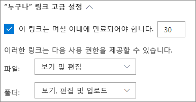
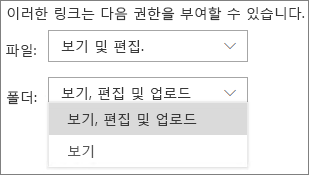
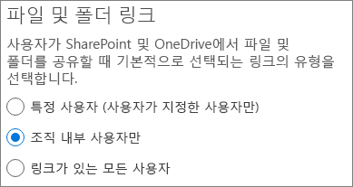
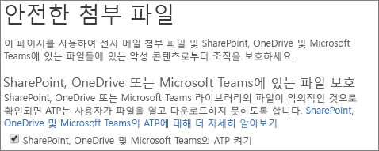
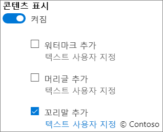

# 인증되지 않은 사용자와 파일 및 폴더를 공유하는 모범 사례Best practices for sharing files and folders with unauthenticated users

인증되지 않은 공유(*모든 사용자* 링크)는 다양한 상황에서 편리하며 유용합니다.Unauthenticated sharing (*Anyone* links) can be convenient and is useful in various scenarios. *모든 사용자* 링크는 가장 간편하게 공유하는 방법입니다. 사용자가 인증 없이 링크를 열 수 있으며 다른 사용자에게 무료로 전달할 수 있습니다.*Anyone* links are the easiest way to share: people can open the link without authentication and are free to pass it on to others.

일반적으로 조직의 모든 콘텐츠가 인증되지 않은 공유에 적합하지는 않습니다.Usually, not all content in an organization is appropriate for unauthenticated sharing. 이 문서에서는 사용자가 파일 및 폴더의 인증되지 않은 공유를 할 수 있지만, 조직의 콘텐츠를 보호하는 데 도움이 되는 보호 기능도 포함된 환경을 만들 수 있는 옵션을 다룹니다.This article covers the options available to help you create an environment where your users can use unauthenticated sharing of files and folders, but where there are safeguards in place to help protect your organization's content.

> [!NOTE]
> 인증되지 않은 공유가 작동하려면 조직 및 사용자가 사용할 개별 사이트 또는 팀에 대해 이 기능을 사용하도록 설정해야 합니다.For unauthenticated sharing to work, you must enable it for your organization and for the individual site or team that you'll be using. 활성화하려는 시나리오를 보려면 [조직 외부 사용자와 공동 작업](collaborating-with-people-outside-your-organization.md)을 참조하세요.See [Collaborating with people outside your organization](collaborating-with-people-outside-your-organization.md) for the scenario that you want to enable.

## 모든 사용자 링크의 만료 날짜를 설정합니다.Set an expiration date for Anyone links

파일은 오랜 기간 동안 사이트, 그룹 및 팀에 저장되는 경우가 많습니다.Files are often stored in sites, groups, and teams for long periods of time. 경우에 따라, 파일을 수년 동안 보존해야 하는 데이터 보존 정책이 있을 수 있습니다.Occasionally there are data retention policies that require files to be retained for years. 해당 파일을 인증되지 않은 사용자와 공유하는 경우, 나중에 파일에 대한 예기치 않은 액세스 및 변경 내용이 발생할 수 있습니다.If such files are shared with unauthenticated people, this could lead to unexpected access and changes to files in the future. 이와 같은 가능성을 줄이기 위해 *모든 사용자* 링크의 만료 시간을 구성할 수 있습니다.To mitigate this possibility, you can configure an expiration time for *Anyone* links.

*모든 사용자* 링크가 만료되면 계정을 더 이상 콘텐츠에 액세스하는 데 사용할 수 없습니다.Once an *Anyone* link expires, it can no longer be used to access content.

모든 사용자 링크의 만료 날짜를 설정하려면 다음 작업을 수행합니다.To set an expiration date for Anyone links
1. SharePoint Online 관리 센터을 엽니다.Open the SharePoint Online admin center.
2. 왼쪽 탐색 창에서 **공유**를 클릭합니다.In the left navigation, click **Sharing**.
3. **"모든 사용자" 링크의 고급 설정**에서 **이러한 링크는 다음 기간 내에 만료되어야 합니다** 확인란을 선택합니다.Under **Advanced settings for "Anyone" links**, select the **These links must expire within this many days** check box. 
   
4. 상자에 일 수를 입력한 다음 **저장**을 클릭합니다.Type a number of days in the box, and then click **Save**.

*모든 사용자* 링크가 만료되면 파일이나 폴더를 새 *모든 사용자* 링크와 다시 공유할 수 있습니다.Note that once an *Anyone* link expires, the file or folder can be re-shared with a new *Anyone* link.

## 링크 사용 권한 설정Set link permissions

파일의 *모든 사용자* 링크를 사용하여 파일을 편집할 수 있으며, 폴더의 *모든 사용자* 링크를 통해 파일을 확인하고 편집하며 새 파일을 해당 폴더에 업로드할 수 있습니다.By default, *Anyone* links for a file allow people to edit the file, and *Anyone* links for a folder allow people to edit and view files, and upload new files to the folder. 파일 및 폴더에 대한 사용 권한을 보기 전용으로 변경할 수 있습니다.You can change these permissions for files and for folders independently to view-only.

인증되지 않은 공유를 허용하지만, 인증되지 않은 사용자가 조직의 콘텐츠를 수정하는 것이 우려되는 경우, 파일 및 폴더 사용 권한을 **보기**로 설정하는 것이 좋습니다.If you want to allow unauthenticated sharing, but are concerned about unauthenticated people modifying your organization's content, consider setting the file and folder permissions to **View**.

모든 사용자 링크에 대한 사용 권한을 설정하려면To set permissions for Anyone links
1. SharePoint Online 관리 센터을 엽니다.Open the SharePoint Online admin center.
2. 왼쪽 탐색 창에서 **공유**를 클릭합니다.In the left navigation, click **Sharing**.
3. **"모든 사용자" 링크의 고급 설정**에서 사용할 파일 및 폴더 사용 권한을 선택합니다.Under **Advanced settings for "Anyone" links**, select the file and folder permissions that you want to use. 
   

*모든 사용자* 링크가 **보기**로 설정된 경우, 게스트와 파일 및 폴더를 계속 공유하고 *특정 사용자* 링크를 사용하여 편집 권한을 부여할 수 있습니다.With *Anyone* links set to **View**, users can still share files and folders with guests and give them edit permissions by using *Specific people* links. 이러한 링크를 사용하려면 조직 외부의 사용자가 게스트로 인증해야 하며, 이 링크와 공유되는 파일 및 폴더에서 게스트 활동을 추적하고 감사할 수 있습니다.These links require people outside your organization to authenticate as guests, and you can track and audit guest activity on files and folders shared with these links.

## 기본 링크 유형이 조직에 있는 사용자에 대해서만 작동하도록 설정합니다.Set default link type to only work for people in your organization

*모든 사용자* 공유가 사용자 조직에 사용할 수 있도록 설정된 경우, 기본 공유 링크는 일반적으로 **모든 사용자**로 설정됩니다.When *Anyone* sharing is enabled for your organization, the default sharing link is normally set to **Anyone**. 이 기능이 사용자에게는 편리하지만, 원하지 않는 인증되지 않는 공유의 위험이 높아질 수 있습니다.While this can be convenient for users, it can increase the risk of unintentional unauthenticated sharing. 사용자가 중요한 문서를 공유하는 동안 링크 유형을 변경하는 것을 잊어버린 경우, 사용자가 인증이 필요 없는 공유 링크를 실수로 만들 수 있습니다.If a user forgets to change the link type while sharing a sensitive document, they might accidentally create a sharing link that doesn't require authentication.

기본 링크 설정을 조직 내부 사용자만 사용할 수 있는 링크로 변경하여 이 위험을 완화할 수 있습니다.You can mitigate this risk by changing the default link setting to a link that only works for people inside your organization. 인증되지 않은 사용자와 공유하려는 사용자는 해당 옵션을 구체적으로 선택해야 합니다.Users who want to share with unauthenticated people would then have to specifically select that option.

기본 파일 및 폴더 공유 링크를 설정하려면 다음 작업을 수행합니다.To set the default file and folder sharing link
1. 왼쪽 탐색 창의 SharePoint 관리 센터에서 **공유**를 클릭합니다.In the SharePoint admin center, in the left navigation, click **Sharing**.
2. **파일 및 폴더 링크**에서 **조직 내 사용자만**을 선택합니다.Under **File and folder links**, select **Only people in your organization**. 
   
3. **저장**을 클릭합니다.Click **Save**

## 악성 파일로부터 보호Protect against malicious files

익명 사용자가 파일을 업로드할 수 있도록 허용하는 경우 악성 파일이 업로드되는 위험이 증가하게 됩니다.When you allow anonymous users to upload files, you're at an increased risk of someone uploading a malicious file. Microsoft 365에서는 고급 위협 방지에서 *안전한 첨부 파일* 기능을 사용하여 업로드된 파일을 자동으로 검사하여 안전하지 않은 파일을 격리할 수 있습니다.In Microsoft 365, you can use the *safe attachments* feature in Advanced Threat Protection to automatically scan uploaded files and quarantine files that are found to be unsafe.

안전한 첨부 파일을 설정하려면To turn on safe attachments
1. [Microsoft 365 보안](https://security.microsoft.com) 관리 센터를 엽니다.Open the [Microsoft 365 security](https://security.microsoft.com) admin center.
2. 왼쪽 탐색 창에서 **정책**을 클릭합니다.In the left navigation, click **Policies**.
3. **위협 방지**에서 **ATP 안전한 첨부 파일(Office 365)** 을 클릭합니다.Under **Threat protection**, click **ATP safe attachments (Office 365)**.
4. **SharePoint, OneDrive 및 Microsoft Teams에 대해 ATP 켜기** 확인란을 선택하고 **저장**을 클릭합니다. Select the **Turn on ATP for SharePoint, OneDrive, and Microsoft Teams** check box, and then click **Save**. 
   

## 파일에 저작권 정보 추가Add copyright information to your files

Microsoft 365 규정 준수 관리 센터에서 민감도 레이블을 사용하는 경우, 조직의 Office 문서에 워터마크나 머리글 또는 바닥글을 자동으로 추가하도록 레이블을 구성할 수 있습니다.If you use sensitivity labels in the Microsoft 365 Compliance admin center, you can configure your labels to add a watermark or a header or footer automatically to your organization's Office documents. 따라서 공유된 파일에 저작권 또는 기타 소유권 정보가 포함되도록 할 수 있습니다.In this way, you can make sure that shared files contain copyright or other ownership information.

레이블이 지정된 파일에 바닥글을 추가하려면To add a footer to a labeled file
1. [Microsoft 365 규정 준수 관리 센터](https://compliance.microsoft.com)를 엽니다.Open the [Microsoft 365 compliance admin center](https://compliance.microsoft.com).
2. 왼쪽 탐색 창의 **분류**에서 **민감도 레이블**을 클릭합니다.In the left navigation, under **Classification**, click **Sensitivity labels**.
3. 바닥글을 추가하려는 레이블을 클릭한 다음 **레이블 편집**을 클릭합니다.Click the label that you want to have add a footer, and then click **Edit label**.
4. **콘텐츠 표시** 탭을 클릭한 다음, 콘텐츠 표시를 **설정**합니다. Click the **Content marking** tab, and then turn **On** content marking.
5. 추가하려는 텍스트 유형의 확인란을 선택한 다음, **텍스트 사용자 지정**을 클릭합니다.Select the check box for the type of text you want to add, and then click **Customize text**.
6. 문서에 추가하려는 텍스트를 입력하고 원하는 텍스트 옵션을 선택한 다음, **저장**을 클릭합니다.Type the text that you want added to your documents, select the text options that you want, and then click **Save**. 
   
7. **저장**을 클릭한 다음 **닫기**를 클릭합니다.Click **Save**, and then click **Close**.

레이블에 콘텐츠 표시를 사용하는 경우, 사용자가 해당 레이블을 적용하면 사용자가 지정한 텍스트가 Office 문서에 추가됩니다.With content marking enabled for the label, the text you specified will be added to Office documents when a user applies that label.

## 참고 항목See Also

[민감도 레이블 개요Overview of sensitivity labels](https://docs.microsoft.com/Office365/SecurityCompliance/sensitivity-labels)

[게스트와 공유할 때 파일에 실수로 발생하는 노출을 제한Limit accidental exposure to files when sharing with guests](sharing-limit-accidental-exposure.md)

[보안 게스트 공유 환경 만들기Create a secure guest sharing environment](create-a-secure-guest-sharing-environment.md)