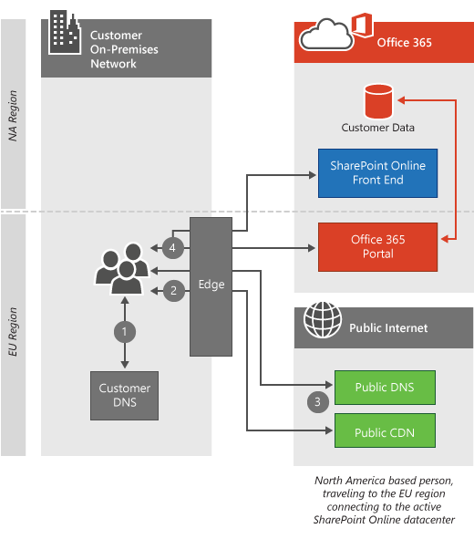

# 클라이언트 연결

 **요약:** 클라이언트 컴퓨터 및 Office 365 테 넌 트 데이터 센터의 위치에 따라 클라이언트 컴퓨터가 Office 365 테 넌 트에 연결 되는 방식을 설명 합니다.
  
Office 365는 지진 또는 정전 같은 한 지역에 주요 문제가 있는 경우에도 서비스를 유지 하 고 실행 하는 데 도움이 되는 Microsoft 데이터 센터에 있습니다. Office 365 테 넌 트에 연결 하면 클라이언트 연결에 테 넌 트가 호스트 되는 해당 데이터 센터가 전송 됩니다. 테 넌 트를 호스팅할 수 있는 위치를 결정 하는 규칙은 Microsoft와의 계약에 따라 정의 됩니다. 클라이언트의 데이터를 가져오는 방법을 결정 하는 규칙은 사용 중인 서비스의 아키텍처에 따라 달라 집니다.
  
예를 들어 Office 365 포털에 로그온 하는 경우 일반적으로 클라이언트에 가장 가까운 데이터 센터에 연결 되 고 다음에 사용 하는 서비스에 따라 방향이 지정 됩니다. 전자 메일을 시작 하면 가장 가까운 데이터 센터에서 UI를 표시 하는 초기 연결이 가능 하지만, 사용자가 읽은 전자 메일의 내용을 표시 하기 위해 테 넌 트에 있는 가장 가까운 데이터 센터와 데이터 센터 사이에 보조 연결이 열릴 수도 있습니다. Microsoft는 전세계 상위 10 개 네트워크 중 하나를 운영 하 여 데이터 센터 간 연결이 매우 빠릅니다.
  
이 문서를 읽은 후에는 데이터 센터 당 [Office 365 url 및 IP 주소 범위](https://support.office.com/article/8548a211-3fe7-47cb-abb1-355ea5aa88a2) 를 제공 하지 않는 이유를 이해 하 고, 단순히 상호 연결 되어 있으며 서로 의존 하 여 해당 항목을 적절 하 게 만들 수 있습니다.
  
Office 365 용 Azure Express 경로를 사용 하는 경우 대부분의 경우 여기에 설명 된 공용 연결 대신 Office 365에 대 한 개인 연결을 통해 연결 합니다. 클라이언트 연결 방법에 대 한 원칙은 여전히 정확 합니다. [Office 365의 Azure express](azure-expressroute.md)경로에 대해 자세히 알아보세요.
  
비즈니스용 Skype 네트워크 요청에 대 한 자세한 내용은 [비즈니스용 Skype Online의 미디어 품질 및 네트워크 연결 성능](https://support.office.com/article/Media-Quality-and-Network-Connectivity-Performance-in-Skype-for-Business-Online-5fe3e01b-34cf-44e0-b897-b0b2a83f0917)문서를 참조 하세요.

||
|:-----|
| 이 문서는 [Office 365의 네트워크 계획 및 성능 조정](https://aka.ms/tune)의 일부입니다.|

> [!NOTE]
> Microsoft는 데이터 센터에서 안전 하 고 개인적으로 it를 관리 하는 데 도움이 됩니다. 개인 정보를 관리 하기 위해 수행 하는 단계에 대 한 자세한 내용은 [보안 센터](https://go.microsoft.com/fwlink/?LinkID=397383)에 포함 되어 있습니다.
  
## 가장 가까운 데이터 센터에 연결

가장 일반적인 연결 유형이 며 Office 365 포털 및 Exchange Online 둘 다에서 사용 됩니다. 이러한 상황에서 클라이언트가 Office 365에 연결을 시도 하면 해당 컴퓨터의 DNS 쿼리에서 컴퓨터가 들어오는 세계 지역을 확인 하 고, Office 365에서 가장 가까운 데이터 센터로 요청을 리디렉션합니다.
  
포털에 대 한 연결이 가장 가까운 데이터 센터에서 중지 되 고 클라이언트 컴퓨터에 해당 위치의 클라이언트 테 넌 트에 대 한 정보가 제공 됩니다.
  
Exchange Online에는 추가 단계가 더 진행 됩니다. 클라이언트 컴퓨터가 가장 가까운 데이터 센터에 연결 되 면 아래의 *작업 방법 섹션* 에 나와 있는 것 처럼 해당 데이터 센터의 Exchange 서버가 테 넌 트를 실제로 사용 하는 데이터 센터에 연결 합니다. 가장 가까운 데이터 센터의 Exchange Online 서버는 클라이언트 컴퓨터의 요청을 사서함 서버로 프록시 합니다. 이렇게 하면 전자 메일 및 일정 항목을 Microsoft 네트워크로 검색 하는 데 많은 문제가 발생 하 여 클라이언트 컴퓨터의 환경이 향상 됩니다.
  
## 표준 클라우드 제품에 대 한이 작업은 어떤 방식으로 작동 하나요?

이 연결 프로세스는 Office 365와 같은 높은 트래픽, 높은 가치 웹 응용 프로그램의 표준입니다. 이 섹션에서는 프로세스의 단계를 대략적으로 설명 하 고 보여 줍니다. 클라이언트 컴퓨터가 테 넌 트와 같은 지역에 있지 않으면 클라이언트에서 연결 하는 서비스에 따라 연결이 크게 달라 집니다.
  
 이 다이어그램은 북미의 테 넌 트와 함께 표준 Office 365 제공을 사용 하는 고객을 보여 줍니다. 이 시나리오에서는 요청을 만드는 사용자가 유럽으로 이동 되었으며 해당 위치에서 Office 365을 사용 하 고 있습니다.
  
1. 클라이언트 컴퓨터에서 로컬 DNS 서버에 Office 365와 연결 된 IP 주소를 묻습니다.

2. 클라이언트 컴퓨터의 로컬 DNS 서버가 Microsoft DNS 서버에 Office 365와 연결 된 IP 주소를 요청 합니다.

3. Microsoft의 DNS 서버에서 클라이언트의 DNS 서버 위치를 기반으로 지역 서버 이름을 반환 하며, 클라이언트 컴퓨터에서 1 단계와 2 단계가 반복 하 여 지역 사무소 365 데이터 센터의 IP 주소를 가져옵니다.

4. 클라이언트 컴퓨터에서 지역별 데이터 센터 IP 주소에 연결 합니다.

5. Exchange Online 서버는 고객의 테 넌 트가 있는 활성 데이터 센터에 대 한 연결을 설정 합니다.

  
## Sovereign 클라우드에 클라우드 제품에서이 작업을 수행 하는 방법은 무엇 인가요?

이 연결은 21 Vianet 되며에서 운영 하는 Office 365와 같은 sovereign 클라우드에 클라우드 서비스와 약간 다릅니다. 테 넌 트를 Office 365의 sovereign 클라우드에 인스턴스에서 사용 하는 경우에는 포털 연결을 허용 하는 가장 가까운 Office 365 서버가 테 넌 트가 상주 하는 sovereign 클라우드에 지역 내의 서버입니다. 마찬가지로, sovereign 클라우드에 클라우드 또는 표준 제품에서 SharePoint Online에 액세스 하는 고객은 테 넌 트가 있는 프런트 엔드 서버로 향합니다. 아래에서 활성 데이터 센터에 연결을 참조 하세요.
  
1. 클라이언트 컴퓨터에서 로컬 DNS 서버에 Office 365와 연결 된 IP 주소를 묻습니다.

2. 클라이언트 컴퓨터의 로컬 DNS 서버가 Microsoft DNS 서버에 Office 365와 연결 된 IP 주소를 요청 합니다.

3. Microsoft의 DNS 서버에서 클라이언트의 DNS 서버 위치를 기반으로 지역 서버 이름을 반환 하며, 클라이언트 컴퓨터에서 1 단계와 2 단계가 반복 하 여 지역 사무소 365 데이터 센터의 IP 주소를 가져옵니다.

4. 클라이언트 컴퓨터에서 지역별 데이터 센터 IP 주소에 연결 합니다.

5. Exchange Online 서버는 고객의 테 넌 트가 있는 활성 데이터 센터에 대 한 연결을 설정 합니다.

  
## 활성 데이터 센터에 연결

활성 데이터 센터에 연결 하는 기능은 더 무거운 데이터 전송 작업을 위해 디자인 되었으며, 현재 SharePoint Online에서 사용 되 고 있습니다. 이러한 상황에서 클라이언트가 Office 365에 연결 하려고 하면 해당 브라우저가 SharePoint Online 테 넌 트에 대 한 활성 데이터 센터로 리디렉션됩니다.
  
## 작동 방식

클라이언트 컴퓨터가 다른 지역에서 SharePoint Online에 연결 하는 경우에는 연결이 활성 SharePoint Online 데이터 센터로 리디렉션됩니다. 이 시나리오에서 고객은 표준 제공을 사용 하 여 포털 연결이 나머지 로컬에 있고 SharePoint Online 연결이 활성 데이터 센터로 이동 하 게 됩니다.
  
1. 클라이언트 컴퓨터에서 로컬 DNS 서버에 Office 365와 연결 된 IP 주소를 묻습니다.

2. 클라이언트 컴퓨터의 로컬 DNS 서버가 Microsoft DNS 서버에 Office 365와 연결 된 IP 주소를 요청 합니다.

3. Microsoft의 DNS 서버가 클라이언트의 Office 365 테 넌 트의 위치를 기반으로 활성 SharePoint Online 데이터 센터의 서버 이름을 반환 하며, 클라이언트 컴퓨터에서 1 단계와 2 단계로 반복 하 여 활성 Office 365 데이터 센터의 IP 주소를 가져옵니다.

4. 클라이언트 컴퓨터에서 활성 데이터 센터의 IP 주소에 연결 합니다.

  
## Vpn (가상 사설망)을 통해 연결

이 연결 유형은 클라이언트 컴퓨터에서 VPN (가상 사설망)을 사용 하는 경우에만 적용 됩니다. 365 실제로는 VPN이 사용 되지만 vpn은 일반적으로 클라이언트 컴퓨터가 Office 365에 연결을 설정 하는 방법을 제어 하는 데 사용 되며, 일반적으로는 환경에 성능이 저하 되기 때문에, 이러한 동작은 중요 합니다.
  
## 작동 방식

클라이언트 컴퓨터에서 다른 지역의 회사 사무실에 대 한 VPN 연결을 설정 하면 클라이언트 컴퓨터의 위치에 있는 DNS 서버 대신 해당 사무실의 DNS 서버가 사용 됩니다. 대부분의 경우 VPN을 통한이 추가 연결이 Office 365 환경을 저하 시킵니다. Office 365 서비스는 최종 사용자에 게 가능한 한 근접으로 고객 연결 서비스에 최적화 되어 있습니다. 대부분의 서비스에서는 Office 365 서비스에 대 한 네트워크 요청이 클라이언트 컴퓨터에 근접 한 경우 Microsoft 네트워크에서 Azure에 지 네트워크, 콘텐츠 배달 네트워크 및 안정적인 네트워크 용량을 활용 하 여 최상의 사용자 환경을 제공 합니다. 가능한 경우
  
1. 클라이언트 컴퓨터에서 VPN DNS 서버에 Office 365와 연결 된 IP 주소를 묻습니다.

2. 클라이언트 컴퓨터의 VPN DNS 서버는 Microsoft DNS 서버에 Office 365와 연결 된 IP 주소를 요청 합니다.

3. Microsoft의 DNS 서버에서 VPN DNS 서버 위치를 기반으로 지역 서버 이름을 반환 하며, 클라이언트 컴퓨터에서 1 단계와 2 단계가 반복 되어 지역 사무소 365 데이터 센터의 IP 주소 정보를 가져옵니다.

4. 클라이언트 컴퓨터에서 VPN 연결을 설정한 본사와 가장 가까운 데이터 센터 IP 주소에 연결 합니다.

  
다음의 간단한 링크를 사용할 수 있습니다. [https://aka.ms/o365clientconnectivity](https://aka.ms/o365clientconnectivity)
  
## 참고 항목

[Office 365 끝점 관리](https://support.office.com/article/99cab9d4-ef59-4207-9f2b-3728eb46bf9a)
  
[Office 365 네트워크 연결 평가](assessing-network-connectivity.md)
