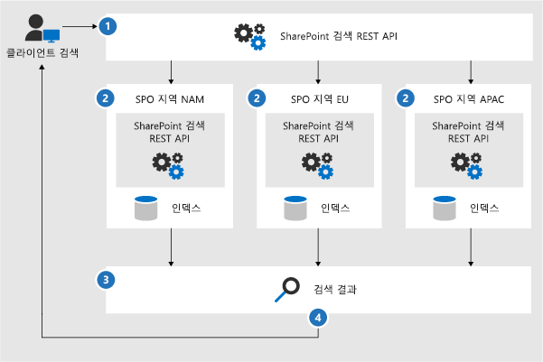
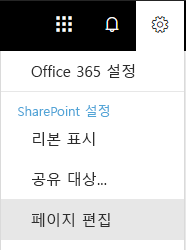

# Office 365 Multi-Geo 검색 구성

다중 지역 환경에서 각 지리적 위치에는 자체 검색 인덱스와 검색 센터가 있습니다. 사용자가 검색을 하면 쿼리가 모드 인덱스로 팬아웃되고 반환된 결과는 병합됩니다.

예를 들어, 한 지리적 위치에 있는 사용자가 다른 지리적 위치에 저장된 콘텐츠를 검색하거나, 다른 지리적 위치로 제한된 SharePoint 사이트에서 콘텐츠를 검색할 수 있습니다. 사용자가 이 콘텐츠에 액세스할 수 있으면 검색 결과가 표시됩니다.

## Multi-Geo 환경에서는 어떤 검색 클라이언트가 사용되나요?

이러한 클라이언트는 모든 지리적 위치의 결과를 반환할 수 있습니다.

-   비즈니스용 OneDrive

-   Delve

-   SharePoint 홈페이지

-   검색 센터

-   SharePoint 검색 API를 사용하는 사용자 지정 검색 응용 프로그램

### 비즈니스용 OneDrive

Multi-Geo 환경이 설정되는 즉시, OneDrive에서 검색하는 사용자는 모든 지리적 위치에서 결과를 얻습니다.

### Delve

Multi-Geo 환경이 설정되는 즉시, Delve에서 검색하는 사용자는 모든 지리적 위치에서 결과를 얻습니다.

Delve 피드 및 프로필 카드는 중앙 위치에 저장된 파일의 미리보기만 표시합니다. 위성 위치에 저장된 파일의 경우 파일 유형 아이콘이 대신 표시됩니다.

### SharePoint 홈페이지

Multi-Geo 환경이 설정되는 즉시, 사용자는 SharePoint 홈페이지에서 다중 지리적 위치의 뉴스, 최근 사이트 및 팔로우된 사이트를 볼 수 있습니다. SharePoint 홈페이지의 검색 상자를 사용하는 경우 다중 지리적 위치에서 병합된 결과를 얻을 수 있습니다.

### 검색 센터

Multi-Geo 환경이 설정된 후에 각 검색 센터는 자체 지리적 위치의 결과만 계속 표시합니다. 관리자는 모든 지리적 위치에서 결과를 가져오려면 [각 검색 센터의 설정을 변경](#_Set_up_a_1)해야 합니다. 그런 후에 검색 센터에서 검색을 하는 사용자는 모든 지리적 위치에서 결과를 가져옵니다.

### 사용자 지정 검색 응용 프로그램

일반적인 경우처럼, 사용자 지정 검색 응용 프로그램은 기존 SharePoint 검색 REST API를 사용하여 검색 인덱스와 상호 작용합니다. 모든 또는 일부 지리적 위치에서 결과를 얻으려면 응용 프로그램은 [API를 호출하고 요청에 새 Multi-Geo 쿼리 매개 변수를 포함](#_Get_custom_search)해야 합니다. 이렇게 하면 모든 지리적 위치로의 쿼리 팬아웃이 트리거됩니다.

## Multi-Geo 환경에서 검색의 차이점은 무엇인가요?

이미 익숙할 수 있는 일부 검색 기능이 Multi-Geo 환경에서는 다르게 작동합니다.

<table>
<thead>
<tr class="header">
<th align="left"><strong>기능</strong></th>
<th align="left"><strong>작동 방법</strong></th>
<th align="left"><strong>해결 방법</strong></th>
</tr>
</thead>
<tbody>
<tr class="odd">
<td align="left">승격된 결과</td>
<td align="left">전체 수준의 테넌트, 사이트 모음 또는 사이트에 대해 승격된 결과가 포함 된 쿼리 규칙을 만들 수 있습니다. Multi-Geo 환경에서 테넌트 수준의 승격된 결과를 정의하여 모든 지역의 검색 센터로 결과를 승격하십시오. 사이트 모음 또는 사이트의 위치에 있는 검색 센터에서만 결과를 승격하려면 사이트 모음 또는 사이트 수준에서 승격된 결과를 정의하십시오. 이 결과는 다른 지리적 위치에서 승격되지 않습니다.</td>
<td align="left">지리적 위치별로 승격된 다른 결과가 필요하지 않을 경우(예: 여행에 대해 다른 규칙 지정) 테넌트 수준에서 승격된 결과를 정의하는 것이 좋습니다.</td>
</tr>
<tr class="even">
<td align="left">검색 구체화</td>
<td align="left">검색은 테넌트의 모든 지리적 위치에서 구체화 결과를 반환한 후 집계합니다. 이러한 집계에는 가능한 최선의 노력이 수반되며, 구체화 개수가 100% 정확하지 않을 수도 있습니다. 대부분의 검색 기반 시나리오에서는 이 정도의 정확도로 충분합니다. </td>
<td align="left">구체화 완성도에 의존하는 검색 기반 응용 프로그램의 경우 개별적으로 각 지리적 위치를 쿼리합니다.</td>
</tr>
<tr class="odd">
<td align="left"></td>
<td align="left">Multi-Geo 검색은 수치 구체화에 대한 동적 버킷팅을 지원하지 않습니다.</td>
<td align="left">숫자 구체화에 대해 <a href="https://docs.microsoft.com/en-us/sharepoint/dev/general-development/query-refinement-in-sharepoint">"Discretize" 매개 변수</a>를 사용합니다.</td>
</tr>
<tr class="even">
<td align="left">문서 ID</td>
<td align="left">문서 ID에 의존하는 검색 기반 응용 프로그램을 개발하는 경우 Multi-Geo 환경의 문서 ID가 지리적 위치 간에 고유하지 않으며 지리적 위치별로 고유합니다.</td>
<td align="left">위치 정보를 식별 할 수 있는 열을 추가했습니다. 고유성을 얻으려면 이 열을 사용하십시오. 이 열은 "GeoLocationSource"라고 합니다.</td>
</tr>
<tr class="odd">
<td align="left">결과의 수</td>
<td align="left">검색 결과 페이지에는 지리적 위치의 결합된 결과가 표시되지만 500개가 넘는 결과는 여러 페이지로 표시할 수 없습니다.</td>
<td align="left"></td>
</tr>
<tr class="even">
<td align="left">Hybrid search</td>
<td align="left"><a href="https://docs.microsoft.com/sharepoint/hybrid/learn-about-cloud-hybrid-search-for-sharepoint">클라우드 하이브리드 검색</a>이 있는 하이브리드 SharePoint 환경에서는 온-프레미스 콘텐츠가 중앙 위치의 Office 365 인덱스에 추가됩니다.</td>
<td align="left"></td>
</tr>
</tbody>
</table>

## Multi-Geo 환경에서 지원되지 않는 검색은 어떤 것인가요?

기존에 친숙하던 일부 검색 기능이 Multi-Geo 환경에서 지원되지 않을 수 있습니다.

<table>
<thead>
<tr class="header">
<th align="left"><strong>검색 기능</strong></th>
<th align="left"><strong>참고</strong></th>
</tr>
</thead>
<tbody>
<tr class="odd">
<td align="left">앱 전용 인증</td>
<td align="left">앱 전용 인증(서비스의 권한 있는 액세스)은 Multi-Geo 검색에서 지원되지 않습니다.</td>
</tr>
<tr class="even">
<td align="left">게스트 사용자</td>
<td align="left">게스트 사용자는 검색하는 지리적 위치에서만 결과를 가져옵니다.</td>
</tr>
</tbody>
</table>

## Multi-Geo 환경에서 검색은 어떤 방식으로 작동하나요?

모든 검색 클라이언트는 기존 SharePoint 검색 REST API를 사용하여 검색 인덱스와 상호 작용합니다.

1. 검색 클라이언트는 쿼리 속성 EnableMultiGeoSearch가 true인 검색 REST 끝점을 호출합니다.
2. 쿼리는 테넌트의 모든 지리적 위치로 전송됩니다.
3. 각 지리적 위치의 검색 결과가 병합되고 순위가 지정됩니다.
4. 클라이언트는 통합된 검색 결과를 얻습니다.

Microsoft는 모든 지리적 위치에서 결과를 얻을 때까지 검색 결과를 병합하지 않습니다. 즉, Multi-Geo 정보 검색은 지리적 위치가 하나뿐인 환경에서의 검색보다 대기 시간이 길어집니다.

## 검색 센터에서 모든 지리적 위치의 결과를 표시하도록 지정

각 검색 센터에는 여러 범주가 있으며 각 범주를 개별적으로 설정해야 합니다.

1.  검색 결과 페이지 및 검색 결과 웹 파트를 편집할 수 있는 권한이 있는 계정으로 다음 단계를 수행해야 합니다.

2.  검색 결과 페이지로 이동합니다(검색 결과 페이지의 [목록](https://support.office.com/article/174d36e0-2f85-461a-ad9a-8b3f434a4213) 참조).

3.  설정할 범주를 선택하고 오른쪽 위 모서리에 있는 **설정** 톱니바퀴 아이콘을 클릭한 후 **페이지 편집**을 클릭합니다. 검색 결과 페이지가 편집 모드에서 열립니다.

     
1.  검색 결과 웹 파트에서 웹 파트 오른쪽 위 모서리로 포인터를 이동하고 화살표를 클릭한 후 메뉴에서 **웹 파트 편집**을 클릭합니다. 검색 결과 웹 파트 도구 창은 페이지 오른쪽 위에 있는 리본 아래에 열립니다. 

1.  웹 파트 도구 창의 **설정** 섹션에 있는 **결과 제어 설정**에서 **Multi-Geo 결과 표시**를 선택하여 검색 결과 웹 파트에 모든 지리적 위치의 결과를 표시하도록 합니다.

2.  **확인**을 클릭하여 변경 내용을 저장하고 웹 파트 도구 창을 닫습니다.

3.  주 메뉴의 페이지 탭에서 **체크 인**을 클릭하여 검색 결과 웹 파트에 대한 변경 내용을 확인합니다.

4.  페이지 위쪽의 메모에 제공된 링크를 사용하여 변경 내용을 게시합니다.

## 사용자 지정 검색 응용 프로그램에서 전체 또는 일부 지리적 위치의 결과를 표시하도록 지정

사용자 지정 검색 응용 프로그램은 SharePoint 검색 REST API에 대한 요청을 통해 쿼리 매개 변수를 지정하여 전체 또는 일부 지리적 위치에서 결과를 가져옵니다. 쿼리 매개 변수에 따라, 쿼리는 모든 지리적 위치 또는 일부 지리적 위치로 팬아웃됩니다. 예를 들어, 관련 정보를 찾기 위해 지리적 위치의 하위 집합만 쿼리하면 될 경우 팬아웃을 이러한 위치로만 제어할 수 있습니다. 요청이 성공하면 SharePoint 검색 REST API가 응답 데이터를 반환됩니다.

**요구 사항**

각 지역 위치의 경우 조직의 모든 사용자가 루트 웹 사이트(예: contoso**APAC**.sharepoint.com/ 및 contoso**EU**.sharepoint.com/) **읽기** 권한 수준을 받아야 합니다. [권한에 대해 자세히 알아보세요](https://support.office.com/ko-KR/article/understanding-permission-levels-in-sharepoint-87ecbb0e-6550-491a-8826-c075e4859848).

### 쿼리 매개 변수

EnableMultiGeoSearch - 이 쿼리는 Multi-Geo 테넌트의 다른 지리적 위치의 인덱스로 쿼리를 팬아웃할지 여부를 지정하는 부울 값입니다. **true**로 설정하면 쿼리가 적용됩니다. **false**로 설정하면 쿼리가 팬 아웃되지 않습니다. 기본값은 **false**입니다. 이 매개 변수를 포함하지 않으면 쿼리가 다른 지리적 위치로 이동되지 않습니다. Multi-Geo가 아닌 환경에서 매개 변수를 사용하면 매개 변수가 무시됩니다.

ClientType - 이것은 문자열입니다. 각 검색 응용 프로그램에 대해 고유한 클라이언트 이름을 입력하십시오. 이 매개 변수를 포함하지 않으면 쿼리가 다른 지리적 위치로 이동되지 않습니다.

MultiGeoSearchConfiguration -**EnableMultiGeoSearch **가 **true**일 때 쿼리를 내보내는 Multi-Geo 테넌트의 지리적 위치에 대한 선택적 목록입니다. 이 매개 변수를 포함하지 않거나 공백으로 두면 모든 지리적 위치로 쿼리가 이동됩니다. 각 지리적 위치에 대해 JSON 형식으로 다음 항목을 입력하십시오.

<table>
<thead>
<tr class="header">
<th align="left">항목</th>
<th align="left">설명</th>
</tr>
</thead>
<tbody>
<tr class="odd">
<td align="left">DataLocation</td>
<td align="left">지리적 위치(예: NAM)</td>
</tr>
<tr class="even">
<td align="left">EndPoint</td>
<td align="left">연결할 끝점(예: https://contoso.sharepoint.com)</td>
</tr>
<tr class="odd">
<td align="left">SourceId</td>
<td align="left">결과 원본의 GUID(예: B81EAB55-3140-4312-B0F4-9459D1B4FFEE)</td>
</tr>
</tbody>
</table>

DataLocation 또는 EndPoint를 생략하거나 DataLocation이 중복되면 요청이 실패합니다. [Microsoft Graph를 사용하여 테넌트의 지리적 위치 끝점에 대한 정보를 얻을 수 있습니다](https://docs.microsoft.com/ko-KR/sharepoint/dev/solution-guidance/multigeo-discovery).

### 응답 데이터

MultiGeoSearchStatus – SharePoint 검색 API가 요청에 대한 응답으로 반환하는 속성입니다. 속성의 값은 문자열이며 SharePoint 검색 API가 반환하는 결과에 대해 다음과 같은 정보를 제공합니다.

<table>
<thead>
<tr class="header">
<th align="left">값</th>
<th align="left">설명</th>
</tr>
</thead>
<tbody>
<tr class="odd">
<td align="left">Full</td>
<td align="left"><strong>모든</strong> 지리적 위치의 전체 결과입니다.</td>
</tr>
<tr class="even">
<td align="left">Partial</td>
<td align="left">하나 이상의 지리적 위치에서 가져온 부분적인 결과입니다. 일시적인 오류로 인해 결과가 불완전합니다.</td>
</tr>

</tbody>
</table>

### REST 서비스를 사용하는 쿼리

GET 요청을 사용하여 URL에 쿼리 매개 변수를 지정합니다. POST 요청을 사용하여 본문에 JSON(JavaScript 개체 표기법) 형식으로 쿼리 매개 변수를 전달합니다.

#### 요청 헤더

<table>
<thead>
<tr class="header">
<th align="left">이름</th>
<th align="left">값</th>
</tr>
</thead>
<tbody>
<tr class="odd">
<td align="left">Content-Type</td>
<td align="left">application/json;odata=verbose</td>
</tr>
</tbody>
</table>

#### **모든** 지리적 위치로 팬아웃되는 샘플 GET 요청

https:// \<tenant\>/\_api/search/query?querytext='sharepoint'&Properties='EnableMultiGeoSearch:true'&ClientType='my\_client\_id'

#### **일부** 지리적 위치로 팬아웃할 샘플 GET 요청

https:// \<tenant\>/\_api/search/query?querytext='site'&ClientType='my_client_id'&Properties='EnableMultiGeoSearch:true, MultiGeoSearchConfiguration:[{DataLocation\\:"NAM"\\Endpoint\\:"https\\://contosoNAM.sharepoint.com"\\,SourceId\\:"B81EAB55-3140-4312-B0F4-9459D1B4FFEE"}\\,{DataLocation\\:"CAN"\\,Endpoint\\:"https\\://contosoCAN.sharepoint-df.com"}]'

> [!NOTE]
> MultiGeoSearchConfiguration 속성의 지리적 위치 목록에 있는 쉼표와 콜론 앞에는 **백슬래시** 문자가 있습니다. 이는 GET 요청이 콜론을 사용하여 속성과 쉼표를 구분하여 속성 인수를 구분하기 때문입니다. 이스케이프 문자로 백슬래시가 없으면 MultiGeoSearchConfiguration 속성이 잘못 해석됩니다.

#### **모든** 지리적 위치로 팬아웃되는 샘플 POST 요청

    {
        "request": {
            "__metadata": {
            "type": "Microsoft.Office.Server.Search.REST.SearchRequest"
        },
        "Querytext": "sharepoint",
        "Properties": {
            "results": [
                {
                    "Name": "EnableMultiGeoSearch",
                    "Value": {
                        "QueryPropertyValueTypeIndex": 3,
                        "BoolVal": true
                    }
                }
            ]
        },
        "ClientType": "my_client_id"
        }
    }

#### **일부** 지리적 위치로 팬아웃되는 샘플 POST 요청

    {
        "request": {
            "Querytext": "SharePoint",
            "ClientType": "my_client_id",
            "Properties": {
                "results": [
                    {
                        "Name": "EnableMultiGeoSearch",
                        "Value": {
                            "QueryPropertyValueTypeIndex": 3,
                            "BoolVal": true
                        }
                    },
                    {
                        "Name": "MultiGeoSearchConfiguration",
                        "Value": {
                        "StrVal": "[{\"DataLocation\":\"NAM\",\"Endpoint\":\"https://contoso.sharepoint.com\",\"SourceId\":\"B81EAB55-3140-4312-B0F4-9459D1B4FFEE\"},{\"DataLocation\":\"CAN\",\"Endpoint\":\"https://contosoCAN.sharepoint.com\"}]",
                            "QueryPropertyValueTypeIndex": 1
                        }
                    }
                ]
            }
        }
    }

### CSOM을 사용하는 쿼리

다음은 **모든** 지리적 위치로 팬아웃되는 샘플 CSOM 쿼리입니다.

    var keywordQuery = new KeywordQuery(ctx);
    keywordQuery.QueryText = query.SearchQueryText;
    keywordQuery.ClientType = <enter a string here>;
    keywordQuery["EnableMultiGeoSearch"] = true;

