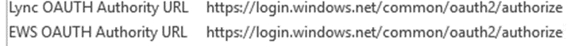

# 하이브리드 최신 인증을 사용하도록 비즈니스용 Skype 온-프레미스를 구성하는 방법

현대 인증을 사용 하면 보다 안전한 사용자 인증 및 권한 부여 제공, 비즈니스 서버 온-프레미스 및 Exchange server 온-프레미스,으로 비즈니스 하이브리드에 대 한 분할 도메인 Skype 용 Skype에 사용할 수 있는 id 관리의 방법이 있습니다.
  
 **중요 한** 현대 인증 (MA) 및 이유 하려고 할 때 회사 또는 조직에서 사용 하는 방법에 대 한 상세 하 시겠습니까? [이 문서](hybrid-modern-auth-overview.md) 에 대 한 개요를 확인 합니다. 여기서 설명 하는 MA와 비즈니스 토폴로지가 지원 됩니다에 대 한 어떤 Skype 알아두어야 할 하는 경우! 
  
 **시작 하기에 앞서**, I 호출합니다. 
  
- 현대 인증 \> MA
    
- 하이브리드 현대 인증 \> HMA
    
- 온-프레미스 exchange \> EXCH
    
- Exchange Online \> EXO
    
- 비즈니스 온-프레미스 용 Skype \> SFB
    
- 및 온라인 비즈니스에 대 한 Skype \> SFBO
    
또한, *이 문서에 그래픽에 회색 **없는** 에 포함 되어 MA 관련 구성에 표시 된 요소를 의미 하는 ' 흐리게 표시 ' 또는 '흐리게 표시' 하는 개체입니다. * 
  
## 요약 읽기

이 요약 실행 하는 동안 손실 그렇지 않은 경우 얻을 수 이며 프로세스에서의 현재 위치에 대 한 추적을 유지 하려면 전체 검사 목록에 대 한 좋은 단계에는 프로세스를 결정 합니다.
  
1. 먼저 모든 필수 구성 요소를 충족 하는지 확인 하십시오.
    
1. 많은 **필수 구성 요소** 이후 비즈니스 및 [p r e 필수 검사 목록에 대 한 개요 (영문) 문서를 참조](hybrid-modern-auth-overview.md)Exchange에 대 한 두 Skype에 대 한 일반적인 됩니다. 이 수행 *하기 전에* 이 문서의 단계 중 하나를 시작 합니다. 
    
2. 파일 또는 OneNote에서 수행 해야 HMA 관련 정보를 수집 합니다.
    
3. Turn ON 현대에 대 한 인증 EXO (아직 설정 되지 않은) 하는 경우.
    
4. Turn ON 현대에 대 한 인증 SFBO (아직 설정 되지 않은) 하는 경우.
    
5. Exchange 온-프레미스에 대 한 하이브리드 현대 인증을 설정 합니다.
    
6. 비즈니스 온-프레미스 용 Skype에 대 한 하이브리드 현대 인증을 설정 합니다.
    
다음이 단계를 켭니다 MA SFB, SFBO, EXCH, 및 EXO-즉, SFB 및 SFBO (EXCH/EXO에 대 한 종속성 포함)의 HMA 구성에 참여할 수 있는 모든 제품 note 합니다. 즉, 사용자가 홈으로 / 사서함 하이브리드 (EXO + SFBO, EXO + SFB, EXCH + SFBO, 또는 EXCH + SFB)의 모든 부분에서 만든, 하는 경우 완성 된 제품에는 다음과 같습니다.
  

  
MA를 설정 하는 4 개의 서로 다른 곳을 볼 수 있듯이! 최상의 사용자 환경에 대 한 이러한 위치의 모든 4에 MA에서 설정 하는 것이 좋습니다. 이러한 모든 위치에서 MA을 켤 수 없는, 환경에 대해 필요한 수 있는 위치에만 MA 켤 수 있도록 하는 단계를 조정 합니다.
  
지원 되는 토폴로지 [MA와 비즈니스를 위한 Skype에 대 한 지원 가능성 항목](https://technet.microsoft.com/en-us/library/mt803262.aspx) 을 참조 하십시오. 
  
 **중요 한** 시작 하기 전에 모든 필수 구성 요소를 충족 했을 때 있는지 다시 확인 합니다. 해당 정보를 찾을 수 [여기](hybrid-modern-auth-overview.md)합니다.
  
## 필요한 모든 HMA 관련 정보를 수집 합니다.

현대 인증을 사용 하 여 [필수 구성 요소](hybrid-modern-auth-overview.md) 를 충족 하는 이중 확인 한 후 (참고 참조 위)를 진행 하는 단계에서 HMA를 구성 해야 정보를 저장할 파일을 만들어야 합니다. 이 문서에 사용 된 예: 
  
- **SIP/SMTP 도메인**
    
  - 예: contoso.com (Office 365와 페더레이션 되어있는지)
    
- **테 넌 트 ID**
    
  - (Contoso.onmicrosoft.com 형식의 로그인) 할 때 Office 365 테 넌 트를 나타내는 GUID입니다.
    
- **SFB 2015 c u 5 웹 서비스 Url**
    
배포 된 모든 SfB 2015 풀에 대 한 내부 및 외부 웹 서비스 URL을 할 수 있습니다. 이러한를 얻으려면 비즈니스 관리 셸의 Skype에서 다음을 실행 합니다.
  
Get-csservice WebServer | Select-object PoolFqdn, InternalFqdn, 외부 | FL
  
- 예: 내부:https://lyncwebint01.contoso.com
    
- 예: 외부:https://lyncwebext01.contoso.com
    
Standard Edition 서버를 사용 하는 경우에 내부 URL 비게 됩니다. 이 경우 풀 fqdn을 사용 하 여 내부 URL에 대 한.
  
## EXO에 대 한 최신 인증 설정

이 문서의 지침에 따라: [Exchange Online: 현대 인증에 대 한 테 넌 트를 설정 하는 방법.](https://social.technet.microsoft.com/wiki/contents/articles/32711.exchange-online-how-to-enable-your-tenant-for-modern-authentication.aspx)
  
## SFBO에 대 한 최신 인증 설정

이 문서의 지침에 따라: [비즈니스 온라인 용 Skype: 현대 인증에 대 한 테 넌 트를 사용 하도록 설정](https://social.technet.microsoft.com/wiki/contents/articles/34339.skype-for-business-online-enable-your-tenant-for-modern-authentication.aspx)합니다.
  
## Exchange 온-프레미스에 대 한 하이브리드 현대 인증 설정

이 문서의 지침에 따라: [Exchange Server 온-프레미스 하이브리드 현대 인증을 사용 하도록 구성 하는 방법](configure-exchange-server-for-hybrid-modern-authentication.md)입니다.
  
## 비즈니스 온-프레미스 용 Skype에 대 한 하이브리드 현대 인증을 설정

### 온-프레미스 Azure AD에 Spn으로 서비스 Url을 웹 추가

이제 SFBO에서 서비스 계정으로 (수집 된 이전) Url을 추가 하려면 명령을 실행 해야 합니다.
  
 **참고 사항** 서비스 사용자 이름 (Spn) 웹 서비스를 식별 하 고 서비스 권한이 부여 된 사용자를 대신 하 여에 작업을 수행할 수 있도록 (예: 계정 이름 또는 그룹) 보안 주체를 연결 합니다. 서버를 인증 하는 클라이언트에 포함된 된 Spn 정보 사용을 확인 합니다. 
  
1. 먼저, [이러한 지침](https://docs.microsoft.com/en-us/powershell/azure/active-directory/install-adv2?view=azureadps-2.0)과 함께 AAD에 연결 합니다.
    
2. 이 명령을 실행, 온-프레미스, SFB 웹 서비스 Url의 목록을 가져옵니다.
    
  - Get-MsolServicePrincipal-AppPrincipalId 00000004-0000-0ff1-ce00-000000000000 | -ExpandProperty ServicePrincipalNames를 선택 합니다.
    
    AppPrincipalId '00000004'로 시작 하 고 지 합니다. 이 비즈니스 Online 용 Skype에 해당합니다.
    
    됩니다 SE 및 WS URL를 포함 하지만 대개 00000004-0000-0ff1-ce00-000000000000로 시작 하는 Spn을 구성 하는이 명령의 출력을 메모해 두십시오 (및 나중에 비교에 대 한 스크린샷)를 수행 / 합니다.
    
3. 내부 **또는** 외부 온-프레미스에서 SFB Url 누락 된 경우 (예를들어 https://lyncwebint01.contoso.com 및 https://lyncwebext01.contoso.com) 이 목록에 해당 특정 레코드를 추가 해야 합니다. 
    
    아래 *예제에서는 Url* 추가 명령에 실제 Url 바꿉니다 해야! 
    
  - $x get MsolServicePrincipal =-AppPrincipalId 00000004-0000-0ff1-ce00-000000000000
    
  - $x.ServicePrincipalnames.Add (" *https://lyncwebint01.contoso.com/* ") 
    
  - $x.ServicePrincipalnames.Add (" *https://lyncwebext01.contoso.com/* ") 
    
  - 집합 MSOLServicePrincipal-AppPrincipalId 00000004-0000-0ff1-ce00-000000000000-ServicePrincipalNames $x.ServicePrincipalNames
    
4. 마찬가지로 2 단계에서 Get MsolServicePrincipal 명령을 실행 하 고 출력을 통해을 찾고 추가 된 새 레코드를 확인 합니다. 목록 비교 / Spn (수도 있습니다 스크린샷 새 목록에 레코드에 대 한)의 새 목록에 앞에서 스크린샷. 성공한, 두 새 Url 목록에 표시 됩니다. 이 예제에서 이동, Spn 목록이 이제 포함 됩니다 특정 Url https://lyncweb01.contoso.com 및 https://autodiscover.contoso.com합니다.
    
### EvoSTS 인증 서버 개체 만들기

비즈니스 관리 셸의 Skype 다음 명령을 실행 합니다.
  
- New-csoauthserver-Identity evoSTS-MetadataURL https://login.windows.net/common/FederationMetadata/2007-06/FederationMetadata.xml -AcceptSecurityIdentifierInformation $true-유형 AzureAD
    
### 하이브리드 현대 인증을 사용 하도록 설정

실제로 MA를 설정 하는 단계입니다. 클라이언트 인증 흐름을 변경 하지 않고 시간 보다 먼저 모든 이전 단계를 실행할 수 있습니다. 인증 흐름을 변경 하려면 준비가 되 면 비즈니스 관리 셸의 Skype에서이 명령을 실행 합니다. 
  
- Set-csoauthconfiguration-ClientAuthorizationOAuthServerIdentity evoSTS
    
## 확인

HMA를 사용 하도록 설정 되 면 클라이언트의 다음 로그인 하는 새 인증 흐름을 사용 합니다. 참고 방금 HMA를 켜서는 다시 인증 하는 모든 클라이언트에 대 한 트리거하지 않습니다. 클라이언트를 다시 인증에 따라 인증 토큰 및/또는 인증서의 수명 동안 갖게 됩니다.
  
활성화 한 후 HMA 제대로 작동 하는지 테스트, 테스트 SFB Windows 클라이언트에서 로그 아웃 하 고 '내 자격 증명 삭제'를 클릭 해야 합니다. 다시 로그인 합니다. 클라이언트 이제 현대 인증 흐름 사용 하 고 사용자의 로그인을 '회사 또는 학교'에 대 한 **Office 365** 프롬프트를 지금 포함 됩니다 계정, 배치 하기 바로 전에 클라이언트는 서버에 연결 하 고 로그인을 표시 합니다. 
  
도 확인 해야 ' 구성 정보 ' Skype에 대 한 비즈니스 클라이언트에 대 한 ' OAuth 기관 '에 대 한. 이 작업을 수행 하 여 클라이언트 컴퓨터에서 비즈니스 아이콘은 Skype 마우스 오른쪽 단추로 Windows 알림 표시줄에 동시에 CTRL 키를 유지 합니다. 표시 되는 메뉴에서 구성 정보를 클릭 합니다. 바탕 화면에 표시 되는 'Skype 비즈니스 구성 정보에 대 한' 창에서 다음 사항을 확인 합니다.
  

  
또한 Outlook 클라이언트 (도: Windows 알림 트레이)에 대 한 아이콘 마우스 오른쪽 단추로 클릭 하는 동시에 CTRL 키를 누른 하 고 ' 연결 상태 '를 클릭 해야 합니다. Authn 유형의 대해 클라이언트의 SMTP 주소를 찾습니다 ' Bearer\*'를 사용 하 여 OAuth bearer 토큰을 나타냅니다.
  
## 관련된 문서

[현대 인증 개요에 다시 연결](hybrid-modern-auth-overview.md) 합니다. 
  
비즈니스 클라이언트에 대 한 프로그램 Skype에 대 한 최신 인증 (ADAL)를 사용 하는 방법을 알고 해야 합니까? 단계 되어 있는데 [여기](https://technet.microsoft.com/en-us/library/mt710548.aspx)합니다.
  
Exchange 서버에 대해 표시 되는 대로 다음이 단계를 읽고 하 시겠습니까, 온-프레미스, SFB 없이 실행 하 시겠습니까? 이러한 단계는 여기에 있습니다.
  

