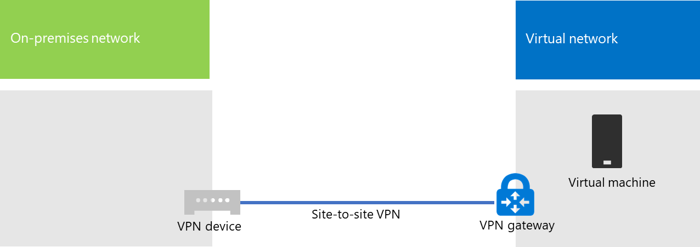

# <a name="connect-an-on-premises-network-to-a-microsoft-azure-virtual-network"></a><span data-ttu-id="84dee-103">온-프레미스 네트워크를 Microsoft Azure Virtual Network에 연결</span><span class="sxs-lookup"><span data-stu-id="84dee-103">Connect an on-premises network to a Microsoft Azure virtual network</span></span>

<span data-ttu-id="84dee-p101">프레미스 간 Azure Virtual Network가 온-프레미스 네트워크에 연결되어 Azure 인프라 서비스에서 호스트되는 서브넷 및 가상 시스템을 포함하도록 네트워크를 확장합니다. 이 연결을 통해 온-프레미스 네트워크의 컴퓨터는 Azure의 가상 시스템에 직접 액세스할 수 있으며 그 반대의 경우도 가능합니다.</span><span class="sxs-lookup"><span data-stu-id="84dee-p101">A cross-premises Azure virtual network is connected to your on-premises network, extending your network to include subnets and virtual machines hosted in Azure infrastructure services. This connection lets computers on your on-premises network to directly access virtual machines in Azure and vice versa.</span></span> 

<span data-ttu-id="84dee-p102">예를 들어 Azure VIrtual Machine에서 실행 중인 디렉터리 동기화 서버는 온-프레미스 도메인 컨트롤러에서 계정 변경 내용을 쿼리하고 해당 변경 내용을 Office 365 구독과 동기화해야 합니다. 이 문서에서는 사이트 간 VPN(가상 사설망) 연결을 사용하여 Azure Virtual Machine을 호스트할 준비가 된 크로스-프레미스 Azure Virtual Network를 설정하는 방법을 보여줍니다.</span><span class="sxs-lookup"><span data-stu-id="84dee-p102">For example, a directory synchronization server running on an Azure virtual machine needs to query your on-premises domain controllers for changes to accounts and synchronize those changes with your Office 365 subscription. This article shows you how to set up a cross-premises Azure virtual network using a site-to-site virtual private network (VPN) connection that is ready to host Azure virtual machines.</span></span>

## <a name="overview"></a><span data-ttu-id="84dee-108">개요</span><span class="sxs-lookup"><span data-stu-id="84dee-108">Overview</span></span>

<span data-ttu-id="84dee-p103">Azure의 가상 시스템은 온-프레미스 환경에서 격리할 필요가 없습니다. Azure Virtual Machine을 온-프레미스 네트워크 리소스에 연결하려면 프레미스 간 Azure Virtual Network를 구성해야 합니다. 다음 다이어그램은 Azure의 가상 컴퓨터가 있는 프레미스 간 Azure Virtual Network를 배포하는 데 필요한 구성 요소를 표시합니다.</span><span class="sxs-lookup"><span data-stu-id="84dee-p103">Your virtual machines in Azure don't have to be isolated from your on-premises environment. To connect Azure virtual machines to your on-premises network resources, you must configure a cross-premises Azure virtual network. The following diagram shows the required components to deploy a cross-premises Azure virtual network with a virtual machine in Azure.</span></span>
  

 
<span data-ttu-id="84dee-p104">다이어그램에는 사이트 간 VPN 연결로 연결된 두 개 네트워크가 있으며, 하나는 온-프레미스 네트워크이고 하나는 Azure Virtual Network입니다. 사이트 간 VPN 연결은 다음을 나타냅니다.</span><span class="sxs-lookup"><span data-stu-id="84dee-p104">In the diagram, there are two networks connected by a site-to-site VPN connection: the on-premises network and the Azure virtual network. The site-to-site VPN connection is:</span></span>

- <span data-ttu-id="84dee-115">주소 지정이 가능하고 공용 인터넷에 있는 두 끝점 사이에서 형성됩니다.</span><span class="sxs-lookup"><span data-stu-id="84dee-115">Between two endpoints that are addressable and located on the public Internet.</span></span>
- <span data-ttu-id="84dee-116">온-프레미스 네트워크의 VPN 장치와 Azure Virtual Network의 Azure VPN 게이트웨이에서 종료됩니다.</span><span class="sxs-lookup"><span data-stu-id="84dee-116">Terminated by a VPN device on the on-premises network and an Azure VPN gateway on the Azure virtual network.</span></span>

<span data-ttu-id="84dee-p105">Azure Virtual Network는 가상 머신을 호스트합니다. Azure Virtual Network의 가상 컴퓨터에서 시작된 네트워크 트래픽은 VPN 게이트웨이로 전달되며, VPN 게이트웨이는 사이트 간 VPN 연결을 통해 온-프레미스 네트워크의 VPN 장치로 트래픽을 전달합니다. 그런 다음 온-프레미스 네트워크의 라우팅 인프라가 대상으로 트래픽을 전달합니다.</span><span class="sxs-lookup"><span data-stu-id="84dee-p105">The Azure virtual network hosts virtual machines. Network traffic originating from virtual machines on the Azure virtual network gets forwarded to the VPN gateway, which then forwards the traffic across the site-to-site VPN connection to the VPN device on the on-premises network. The routing infrastructure of the on-premises network then forwards the traffic to its destination.</span></span>

>[!Note]
><span data-ttu-id="84dee-p106">조직 및 Microsoft 네트워크 간의 직접 연결에 해당하는 [ExpressRoute](https://azure.microsoft.com/services/expressroute/)를 사용할 수도 있습니다. ExpressRoute를 통한 트래픽은 공용 인터넷을 통해 전달되지 않습니다. 이 문서는 ExpressRoute의 사용에 대해 설명하지 않습니다.</span><span class="sxs-lookup"><span data-stu-id="84dee-p106">You can also use [ExpressRoute](https://azure.microsoft.com/services/expressroute/), which is a direct connection between your organization and Microsoft's network. Traffic over ExpressRoute does not travel over the public Internet. This article does not describe the use of ExpressRoute.</span></span>
>
  
<span data-ttu-id="84dee-123">Azure Virtual Network와 온-프레미스 네트워크 간에 VPN 연결을 설정하려면 다음 단계를 따르세요.</span><span class="sxs-lookup"><span data-stu-id="84dee-123">To set up the VPN connection between your Azure virtual network and your on-premises network, follow these steps:</span></span> 
  
1. <span data-ttu-id="84dee-124">**온-프레미스:** 온-프레미스 VPN 장치를 가리키는 Azure Virtual Network의 주소 공간에 대한 온-프레미스 네트워크 경로를 정의하고 만듭니다.</span><span class="sxs-lookup"><span data-stu-id="84dee-124">**On-premises:** Define and create an on-premises network route for the address space of the Azure virtual network that points to your on-premises VPN device.</span></span>
    
2. <span data-ttu-id="84dee-125">**Microsoft Azure:** 사이트 간 VPN 연결을 사용하여 Azure Virtual Network를 만듭니다.</span><span class="sxs-lookup"><span data-stu-id="84dee-125">**Microsoft Azure:** Create an Azure virtual network with a site-to-site VPN connection.</span></span> 
    
3. <span data-ttu-id="84dee-126">**온-프레미스:** 온-프레미스 하드웨어 또는 소프트웨어 VPN 장치를 구성하여 IPsec(인터넷 프로토콜 보안)을 사용하는 VPN 연결을 종료합니다.</span><span class="sxs-lookup"><span data-stu-id="84dee-126">**On premises:** Configure your on-premises hardware or software VPN device to terminate the VPN connection, which uses Internet Protocol security (IPsec).</span></span>
    
<span data-ttu-id="84dee-127">사이트 간 VPN 연결을 설정한 후 Azure Virtual Machine을 가상 네트워크의 서브넷에 추가합니다.</span><span class="sxs-lookup"><span data-stu-id="84dee-127">After you establish the site-to-site VPN connection, you add Azure virtual machines to the subnets of the virtual network.</span></span>
  
## <a name="plan-your-azure-virtual-network"></a><span data-ttu-id="84dee-128">Azure Virtual Network 계획</span><span class="sxs-lookup"><span data-stu-id="84dee-128">Plan your Azure virtual network</span></span>
<a name="PlanningVirtual"></a>

### <a name="prerequisites"></a><span data-ttu-id="84dee-129">필수 구성 요소</span><span class="sxs-lookup"><span data-stu-id="84dee-129">Prerequisites</span></span>
<a name="Prerequisites"></a>

- <span data-ttu-id="84dee-p107">Azure 구독. Azure 구독에 대한 자세한 내용은 [구매 방법 Azure 페이지](https://azure.microsoft.com/pricing/purchase-options/)로 이동하여 확인하세요.</span><span class="sxs-lookup"><span data-stu-id="84dee-p107">An Azure subscription. For information about Azure subscriptions, go to the [How To Buy Azure page](https://azure.microsoft.com/pricing/purchase-options/).</span></span>
    
- <span data-ttu-id="84dee-132">가상 네트워크 및 서브넷에 할당할 수 있는 개인 IPv4 주소 공간. 이 주소 공간에는 현재와 미래에 필요한 가상 컴퓨터 수를 수용할만한 충분한 공간이 있어야 합니다.</span><span class="sxs-lookup"><span data-stu-id="84dee-132">An available private IPv4 address space to assign to the virtual network and its subnets, with sufficient room for growth to accommodate the number of virtual machines needed now and in the future.</span></span>
    
- <span data-ttu-id="84dee-p108">온-프레미스 네트워크에서 사용할 수 있는 VPN 장치. 이 장치로 IPsec의 요구 사항을 지원하는 사이트 간 VPN 연결을 종료할 수 있습니다. 자세한 내용은 [사이트 간 가상 네트워크 연결용 VPN 장치 정보](https://go.microsoft.com/fwlink/p/?LinkId=393093)를 참조하세요.</span><span class="sxs-lookup"><span data-stu-id="84dee-p108">An available VPN device in your on-premises network to terminate the site-to-site VPN connection that supports the requirements for IPsec. For more information, see [About VPN devices for site-to-site virtual network connections](https://go.microsoft.com/fwlink/p/?LinkId=393093).</span></span>
    
- <span data-ttu-id="84dee-135">라우팅 인프라에 대한 변경 내용. Azure Virtual Network의 주소 공간으로 라우팅된 트래픽이 사이트 간 VPN 연결을 호스트하는 VPN 장치로 전달되도록 라우팅 인프라를 변경해야 합니다.</span><span class="sxs-lookup"><span data-stu-id="84dee-135">Changes to your routing infrastructure so that traffic routed to the address space of the Azure virtual network gets forwarded to the VPN device that hosts the site-to-site VPN connection.</span></span>
    
- <span data-ttu-id="84dee-136">온-프레미스 네트워크와 Azure Virtual Network에 연결된 컴퓨터에 인터넷으로의 액세스를 제공하는 웹 프록시.</span><span class="sxs-lookup"><span data-stu-id="84dee-136">A web proxy that gives computers that are connected to the on-premises network and the Azure virtual network access to the Internet.</span></span>
    
### <a name="solution-architecture-design-assumptions"></a><span data-ttu-id="84dee-137">솔루션 아키텍처 디자인 가정</span><span class="sxs-lookup"><span data-stu-id="84dee-137">Solution architecture design assumptions</span></span>

<span data-ttu-id="84dee-138">다음 목록에는 이 솔루션 아키텍처에 대한 디자인 선택이 나타납니다.</span><span class="sxs-lookup"><span data-stu-id="84dee-138">The following list represents the design choices that have been made for this solution architecture.</span></span> 
  
- <span data-ttu-id="84dee-p109">이 솔루션은 사이트 간 VPN 연결을 사용하는 단일 Azure Virtual Network를 사용합니다. Azure Virtual Network는 여러 가상 컴퓨터를 포함할 수 있는 단일 서브넷을 호스트합니다.</span><span class="sxs-lookup"><span data-stu-id="84dee-p109">This solution uses a single Azure virtual network with a site-to-site VPN connection. The Azure virtual network hosts a single subnet that can contain multiple virtual machines.</span></span> 
    
- <span data-ttu-id="84dee-p110">Windows Server 2016 또는 Windows Server 2012에서 RRAS(라우팅 및 원격 액세스 서비스)를 사용하여 온-프레미스 네트워크와 Azure Virtual Network 간의 IPsec 사이트 간 VPN 연결을 설정할 수 있습니다. Cisco 또는 Juniper Networks VPN 장치와 같은 다른 옵션을 사용할 수도 있습니다.</span><span class="sxs-lookup"><span data-stu-id="84dee-p110">You can use the Routing and Remote Access Service (RRAS) in Windows Server 2016 or Windows Server 2012 to establish an IPsec site-to-site VPN connection between the on-premises network and the Azure virtual network. You can also use other options, such as Cisco or Juniper Networks VPN devices.</span></span>
    
- <span data-ttu-id="84dee-p111">온-프레미스 네트워크에는 Active Directory Domain Services(AD DS), DNS(Domain Name System) 및 프록시 서버와 같은 네트워크 서비스가 아직 있을 수 있습니다. 사용자의 요구 사항에 따라 Azure Virtual Network에서 이러한 네트워크 리소스를 배치하는 것이 좋을 수도 있습니다.</span><span class="sxs-lookup"><span data-stu-id="84dee-p111">The on-premises network might still have network services like Active Directory Domain Services (AD DS), Domain Name System (DNS), and proxy servers. Depending on your requirements, it might be beneficial to place some of these network resources in the Azure virtual network.</span></span>
    
<span data-ttu-id="84dee-p112">하나 이상의 서브넷이 있는 기존 Azure Virtual Network의 경우 사용자의 요구 사항에 따라 필요한 가상 컴퓨터를 호스트할 추가 서브넷을 위한 남은 주소가 있는지 확인합니다. 추가 서브넷을 위한 남은 주소 공간이 없으면 자체 사이트 간 VPN 연결이 있는 추가 가상 네트워크를 만듭니다.</span><span class="sxs-lookup"><span data-stu-id="84dee-p112">For an existing Azure virtual network with one or more subnets, determine whether there is remaining address space for an additional subnet to host your needed virtual machines, based on your requirements. If you don't have remaining address space for an additional subnet, create an additional virtual network that has its own site-to-site VPN connection.</span></span>
  
### <a name="plan-the-routing-infrastructure-changes-for-the-azure-virtual-network"></a><span data-ttu-id="84dee-147">Azure Virtual Network에 대한 라우팅 인프라 변경 계획</span><span class="sxs-lookup"><span data-stu-id="84dee-147">Plan the routing infrastructure changes for the Azure virtual network</span></span>

<span data-ttu-id="84dee-148">Azure Virtual Network의 주소 공간을 대상으로 하는 트래픽을 사이트 간 VPN 연결을 호스트하는 온 - 프레미스 VPN 장치로 전달하도록 온-프레미스 라우팅 인프라를 구성해야 합니다.</span><span class="sxs-lookup"><span data-stu-id="84dee-148">You must configure your on-premises routing infrastructure to forward traffic destined for the address space of the Azure virtual network to the on-premises VPN device that is hosting the site-to-site VPN connection.</span></span>
  
<span data-ttu-id="84dee-149">라우팅 인프라를 업데이트하는 정확한 방법은 라우팅 정보를 관리하는 방법에 따라 달라지며 그 방법은 다음과 같습니다.</span><span class="sxs-lookup"><span data-stu-id="84dee-149">The exact method of updating your routing infrastructure depends on how you manage routing information, which can be:</span></span>
  
- <span data-ttu-id="84dee-150">수동 구성에 따른 라우팅 테이블 업데이트.</span><span class="sxs-lookup"><span data-stu-id="84dee-150">Routing table updates based on manual configuration.</span></span>
    
- <span data-ttu-id="84dee-151">RIP(Routing Information Protocol) 또는 OSPF(최단 경로 우선 프로토콜)와 같은 라우팅 프로토콜을 기준으로 라우팅 테이블 업데이트.</span><span class="sxs-lookup"><span data-stu-id="84dee-151">Routing table updates based on routing protocols, such as Routing Information Protocol (RIP) or Open Shortest Path First (OSPF).</span></span>
    
<span data-ttu-id="84dee-152">라우팅 전문가와 상담하여 Azure Virtual Network를 대상으로 하는 트래픽이 온-프레미스 VPN 장치로 전달되는지 확인하세요.</span><span class="sxs-lookup"><span data-stu-id="84dee-152">Consult with your routing specialist to make sure that traffic destined for the Azure virtual network is forwarded to the on-premises VPN device.</span></span>
  
### <a name="plan-for-firewall-rules-for-traffic-to-and-from-the-on-premises-vpn-device"></a><span data-ttu-id="84dee-153">온-프레미스 VPN 장치의 트래픽용 방화벽 규칙 계획</span><span class="sxs-lookup"><span data-stu-id="84dee-153">Plan for firewall rules for traffic to and from the on-premises VPN device</span></span>

<span data-ttu-id="84dee-154">주변 네트워크와 인터넷 사이에 방화벽이 있는 주변 네트워크에 VPN 장치가 있는 경우 사이트 간 VPN 연결을 허용하도록 다음 규칙에 맞게 방화벽을 구성해야 할 수도 있습니다.</span><span class="sxs-lookup"><span data-stu-id="84dee-154">If your VPN device is on a perimeter network that has a firewall between the perimeter network and the Internet, you might have to configure the firewall for the following rules to allow the site-to-site VPN connection.</span></span>
  
- <span data-ttu-id="84dee-155">VPN 장치로 보내는 트래픽(인터넷에서 수신):</span><span class="sxs-lookup"><span data-stu-id="84dee-155">Traffic to the VPN device (incoming from the Internet):</span></span>
    
  - <span data-ttu-id="84dee-156">VPN 장치 및 IP 프로토콜 50의 대상 IP 주소</span><span class="sxs-lookup"><span data-stu-id="84dee-156">Destination IP address of the VPN device and IP protocol 50</span></span>
    
  - <span data-ttu-id="84dee-157">VPN 장치 및 UDP 대상 포트 500의 대상 IP 주소</span><span class="sxs-lookup"><span data-stu-id="84dee-157">Destination IP address of the VPN device and UDP destination port 500</span></span>
    
  - <span data-ttu-id="84dee-158">VPN 장치 및 UDP 대상 포트 4500의 대상 IP 주소</span><span class="sxs-lookup"><span data-stu-id="84dee-158">Destination IP address of the VPN device and UDP destination port 4500</span></span>
    
- <span data-ttu-id="84dee-159">VPN 장치에서 받는 트래픽(인터넷으로 발신)</span><span class="sxs-lookup"><span data-stu-id="84dee-159">Traffic from the VPN device (outgoing to the Internet):</span></span>
    
  - <span data-ttu-id="84dee-160">VPN 장치 및 IP 프로토콜 50의 원본 IP 주소</span><span class="sxs-lookup"><span data-stu-id="84dee-160">Source IP address of the VPN device and IP protocol 50</span></span>
    
  - <span data-ttu-id="84dee-161">VPN 장치 및 UDP 원본 포트 500의 원본 IP 주소</span><span class="sxs-lookup"><span data-stu-id="84dee-161">Source IP address of the VPN device and UDP source port 500</span></span>
    
  - <span data-ttu-id="84dee-162">VPN 장치 및 UDP 원본 포트 4500의 원본 IP 주소</span><span class="sxs-lookup"><span data-stu-id="84dee-162">Source IP address of the VPN device and UDP source port 4500</span></span>
    
### <a name="plan-for-the-private-ip-address-space-of-the-azure-virtual-network"></a><span data-ttu-id="84dee-163">Azure Virtual Network의 개인 IP 주소 공간 계획</span><span class="sxs-lookup"><span data-stu-id="84dee-163">Plan for the private IP address space of the Azure virtual network</span></span>

<span data-ttu-id="84dee-164">Azure Virtual Network의 개인 IP 주소 공간은 가상 네트워크를 호스트하기 위해 Azure에서 사용하는 주소와 Azure Virtual Machine에 충분한 주소가 있는 서브넷을 하나 이상 수용할 수 있어야 합니다.</span><span class="sxs-lookup"><span data-stu-id="84dee-164">The private IP address space of the Azure virtual network must be able to accommodate addresses used by Azure to host the virtual network and with at least one subnet that has enough addresses for your Azure virtual machines.</span></span>
  
<span data-ttu-id="84dee-165">서브넷에 필요한 주소 개수를 확인하려면 지금 필요한 가상 컴퓨터의 수를 계산하고 이후 증가량을 추정한 후 다음 테이블을 사용해서 서브넷의 크기를 확인합니다.</span><span class="sxs-lookup"><span data-stu-id="84dee-165">To determine the number of addresses needed for the subnet, count the number of virtual machines that you need now, estimate for future growth, and then use the following table to determine the size of the subnet.</span></span>
  
|<span data-ttu-id="84dee-166">**필요한 가상 컴퓨터의 수**</span><span class="sxs-lookup"><span data-stu-id="84dee-166">**Number of virtual machines needed**</span></span>|<span data-ttu-id="84dee-167">**필요한 호스트 비트 수**</span><span class="sxs-lookup"><span data-stu-id="84dee-167">**Number of host bits needed**</span></span>|<span data-ttu-id="84dee-168">**서브넷 크기**</span><span class="sxs-lookup"><span data-stu-id="84dee-168">**Size of the subnet**</span></span>|
|:-----|:-----|:-----|
|<span data-ttu-id="84dee-169">1-3</span><span class="sxs-lookup"><span data-stu-id="84dee-169">1-3</span></span>  <br/> |<span data-ttu-id="84dee-170">3</span><span class="sxs-lookup"><span data-stu-id="84dee-170">3</span></span>  <br/> |<span data-ttu-id="84dee-171">/29</span><span class="sxs-lookup"><span data-stu-id="84dee-171">/29</span></span>  <br/> |
|<span data-ttu-id="84dee-172">4-11</span><span class="sxs-lookup"><span data-stu-id="84dee-172">4-11</span></span>  <br/> |<span data-ttu-id="84dee-173">4</span><span class="sxs-lookup"><span data-stu-id="84dee-173">4</span></span>  <br/> |<span data-ttu-id="84dee-174">/28</span><span class="sxs-lookup"><span data-stu-id="84dee-174">/28</span></span>  <br/> |
|<span data-ttu-id="84dee-175">12-27</span><span class="sxs-lookup"><span data-stu-id="84dee-175">12-27</span></span>  <br/> |<span data-ttu-id="84dee-176">5</span><span class="sxs-lookup"><span data-stu-id="84dee-176">5</span></span>  <br/> |<span data-ttu-id="84dee-177">/27</span><span class="sxs-lookup"><span data-stu-id="84dee-177">/27</span></span>  <br/> |
|<span data-ttu-id="84dee-178">28-59</span><span class="sxs-lookup"><span data-stu-id="84dee-178">28-59</span></span>  <br/> |<span data-ttu-id="84dee-179">6</span><span class="sxs-lookup"><span data-stu-id="84dee-179">6</span></span>  <br/> |<span data-ttu-id="84dee-180">/26</span><span class="sxs-lookup"><span data-stu-id="84dee-180">/26</span></span>  <br/> |
|<span data-ttu-id="84dee-181">60-123</span><span class="sxs-lookup"><span data-stu-id="84dee-181">60-123</span></span>  <br/> |<span data-ttu-id="84dee-182">7</span><span class="sxs-lookup"><span data-stu-id="84dee-182">7</span></span>  <br/> |<span data-ttu-id="84dee-183">/25</span><span class="sxs-lookup"><span data-stu-id="84dee-183">/25</span></span>  <br/> |
   
### <a name="planning-worksheet-for-configuring-your-azure-virtual-network"></a><span data-ttu-id="84dee-184">Azure Virtual Network 구성용 계획 워크시트</span><span class="sxs-lookup"><span data-stu-id="84dee-184">Planning worksheet for configuring your Azure virtual network</span></span>
<span data-ttu-id="84dee-185"><a name="worksheet"> </a></span><span class="sxs-lookup"><span data-stu-id="84dee-185"><a name="worksheet"> </a></span></span>

<span data-ttu-id="84dee-186">Azure 가상 네트워크를 만들어서 가상 컴퓨터를 호스트하기 전에 다음 테이블에서 필요한 설정을 확인해야 합니다.</span><span class="sxs-lookup"><span data-stu-id="84dee-186">Before you create an Azure virtual network to host virtual machines, you must determine the settings needed in the following tables.</span></span>
  
<span data-ttu-id="84dee-187">가상 네트워크 설정에 대해서는 테이블 V를 채웁니다.</span><span class="sxs-lookup"><span data-stu-id="84dee-187">For the settings of the virtual network, fill in Table V.</span></span>
  
 <span data-ttu-id="84dee-188">**테이블 V: 프레미스 간 가상 네트워크 구성**</span><span class="sxs-lookup"><span data-stu-id="84dee-188">**Table V: Cross-premises virtual network configuration**</span></span>
  
|<span data-ttu-id="84dee-189">**항목**</span><span class="sxs-lookup"><span data-stu-id="84dee-189">**Item**</span></span>|<span data-ttu-id="84dee-190">**Configuration 요소**</span><span class="sxs-lookup"><span data-stu-id="84dee-190">**Configuration element**</span></span>|<span data-ttu-id="84dee-191">**설명**</span><span class="sxs-lookup"><span data-stu-id="84dee-191">**Description**</span></span>|<span data-ttu-id="84dee-192">**값**</span><span class="sxs-lookup"><span data-stu-id="84dee-192">**Value**</span></span>|
|:-----|:-----|:-----|:-----|
|<span data-ttu-id="84dee-193">1.</span><span class="sxs-lookup"><span data-stu-id="84dee-193">1.</span></span>  <br/> |<span data-ttu-id="84dee-194">가상 네트워크 이름</span><span class="sxs-lookup"><span data-stu-id="84dee-194">Virtual network name</span></span>  <br/> |<span data-ttu-id="84dee-195">Azure Virtual Network(예: DirSyncNet)에 할당할 이름입니다.</span><span class="sxs-lookup"><span data-stu-id="84dee-195">A name to assign to the Azure virtual network (example DirSyncNet).</span></span>  <br/> | |
|<span data-ttu-id="84dee-197">2.</span><span class="sxs-lookup"><span data-stu-id="84dee-197">2.</span></span>  <br/> |<span data-ttu-id="84dee-198">가상 네트워크 위치</span><span class="sxs-lookup"><span data-stu-id="84dee-198">Virtual network location</span></span>  <br/> |<span data-ttu-id="84dee-199">가상 네트워크가 포함될 Azure 데이터 센터입니다(예: 미국 서부).</span><span class="sxs-lookup"><span data-stu-id="84dee-199">The Azure datacenter that will contain the virtual network (such as West US).</span></span>  <br/> |  <br/> |
|<span data-ttu-id="84dee-201">3.</span><span class="sxs-lookup"><span data-stu-id="84dee-201">3.</span></span>  <br/> |<span data-ttu-id="84dee-202">VPN 장치 IP 주소</span><span class="sxs-lookup"><span data-stu-id="84dee-202">VPN device IP address</span></span>  <br/> |<span data-ttu-id="84dee-p113">인터넷에서 VPN 장치 인터페이스의 공용 IPv4 주소입니다. IT 부서에서 이 주소를 확인합니다.</span><span class="sxs-lookup"><span data-stu-id="84dee-p113">The public IPv4 address of your VPN device's interface on the Internet. Work with your IT department to determine this address.</span></span>  <br/> |  <br/> |
|<span data-ttu-id="84dee-206">4.</span><span class="sxs-lookup"><span data-stu-id="84dee-206">4.</span></span>  <br/> |<span data-ttu-id="84dee-207">가상 네트워크 주소 공간</span><span class="sxs-lookup"><span data-stu-id="84dee-207">Virtual network address space</span></span>  <br/> |<span data-ttu-id="84dee-p114">단일 개인 주소 접두사로 정의된 가상 네트워크의 주소 공간입니다. IT 부서에서 이 주소 공간을 확인합니다. 주소 공간은 CIDR(Classless Interdomain Routing) 형식이어야 하며 네트워크 접두사 형식이라고도 합니다. 예를 들어 10.24.64.0/20입니다.</span><span class="sxs-lookup"><span data-stu-id="84dee-p114">The address space (defined in a single private address prefix) for the virtual network. Work with your IT department to determine this address space. The address space should be in Classless Interdomain Routing (CIDR) format, also known as network prefix format. An example is 10.24.64.0/20.</span></span>  <br/> | <br/> |
|<span data-ttu-id="84dee-213">5.</span><span class="sxs-lookup"><span data-stu-id="84dee-213">5.</span></span>  <br/> |<span data-ttu-id="84dee-214">IPsec 공유 키</span><span class="sxs-lookup"><span data-stu-id="84dee-214">IPsec shared key</span></span>  <br/> |<span data-ttu-id="84dee-p115">사이트 간 VPN 연결의 양측을 인증하는 데 사용되는 32자의 무작위 영숫자 문자열입니다. IT 또는 보안 부서에서 이 키 값을 확인한 다음 안전한 위치에 저장합니다. 또한, [IPsec 미리 공유한 키의 무작위 문자열 만들기](https://social.technet.microsoft.com/wiki/contents/articles/32330.create-a-random-string-for-an-ipsec-preshared-key.aspx)를 참조하세요.</span><span class="sxs-lookup"><span data-stu-id="84dee-p115">A 32-character random, alphanumeric string that will be used to authenticate both sides of the site-to-site VPN connection. Work with your IT or security department to determine this key value and then store it in a secure location. Alternately, see [Create a random string for an IPsec preshared key](https://social.technet.microsoft.com/wiki/contents/articles/32330.create-a-random-string-for-an-ipsec-preshared-key.aspx).  </span></span><br/> | <br/> |
   
<span data-ttu-id="84dee-219">이 솔루션의 서브넷에 대해서는 테이블 S를 채웁니다.</span><span class="sxs-lookup"><span data-stu-id="84dee-219">Fill in Table S for the subnets of this solution.</span></span>
  
- <span data-ttu-id="84dee-p116">첫 서브넷의 경우 Azure 게이트웨이 서브넷의 28비트 주소 공간(/28 접두사 길이)을 결정합니다. 이 주소 공간을 확인하는 방법의 정보는 [Azure Virtual Network용 게이트웨이 서브넷 주소 공간 계산](https://blogs.technet.microsoft.com/solutions_advisory_board/2016/12/01/calculating-the-gateway-subnet-address-space-for-azure-virtual-networks/)을 참조하세요.</span><span class="sxs-lookup"><span data-stu-id="84dee-p116">For the first subnet, determine a 28-bit address space (with a /28 prefix length) for the Azure gateway subnet. See [Calculating the gateway subnet address space for Azure virtual networks](https://blogs.technet.microsoft.com/solutions_advisory_board/2016/12/01/calculating-the-gateway-subnet-address-space-for-azure-virtual-networks/) for information about how to determine this address space.</span></span>
    
- <span data-ttu-id="84dee-222">두 번째 서브넷의 경우 식별 이름, 가상 네트워크 주소 공간을 기준으로 하는 단일 IP 주소 공간 및 설명이 포함된 용도를 지정합니다.</span><span class="sxs-lookup"><span data-stu-id="84dee-222">For the second subnet, specify a friendly name, a single IP address space based on the virtual network address space, and a descriptive purpose.</span></span>
    
<span data-ttu-id="84dee-p117">IT 부서에서 가상 네트워크 주소 공간의 이러한 주소 공간을 확인합니다. 두 주소 공간 모두 CIDR 형식이어야 합니다.</span><span class="sxs-lookup"><span data-stu-id="84dee-p117">Work with your IT department to determine these address spaces from the virtual network address space. Both address spaces should be in CIDR format.</span></span>
  
 <span data-ttu-id="84dee-225">**테이블 S: 가상 네트워크의 서브넷**</span><span class="sxs-lookup"><span data-stu-id="84dee-225">**Table S: Subnets in the virtual network**</span></span>
  
|<span data-ttu-id="84dee-226">**항목**</span><span class="sxs-lookup"><span data-stu-id="84dee-226">**Item**</span></span>|<span data-ttu-id="84dee-227">**서브넷 이름**</span><span class="sxs-lookup"><span data-stu-id="84dee-227">**Subnet name**</span></span>|<span data-ttu-id="84dee-228">**서브넷 주소 공간**</span><span class="sxs-lookup"><span data-stu-id="84dee-228">**Subnet address space**</span></span>|<span data-ttu-id="84dee-229">**용도**</span><span class="sxs-lookup"><span data-stu-id="84dee-229">**Purpose**</span></span>|
|:-----|:-----|:-----|:-----|
|<span data-ttu-id="84dee-230">1.</span><span class="sxs-lookup"><span data-stu-id="84dee-230">1.</span></span>  <br/> |<span data-ttu-id="84dee-231">GatewaySubnet</span><span class="sxs-lookup"><span data-stu-id="84dee-231">GatewaySubnet</span></span>  <br/> |  <br/> |<span data-ttu-id="84dee-233">Azure 게이트웨이에서 사용하는 서브넷입니다.</span><span class="sxs-lookup"><span data-stu-id="84dee-233">The subnet used by the Azure gateway.</span></span>  <br/> |
|<span data-ttu-id="84dee-234">2.</span><span class="sxs-lookup"><span data-stu-id="84dee-234">2.</span></span>  <br/> |  <br/> |  <br/> |  <br/> |
   
<span data-ttu-id="84dee-p118">가상 네트워크의 가상 컴퓨터에서 사용할 온-프레미스 DNS 서버에 대해서는 테이블 D에 채웁니다. 각 DNS 서버에 식별 이름과 단일 IP 주소를 부여합니다. 식별 이름은 DNS 서버의 컴퓨터 이름 또는 호스트 이름과 일치하지 않아도 됩니다. 두 개의 빈 항목이 나열되어 있지만 추가할 수 있습니다. IT 부서에서 이 목록을 확인합니다.</span><span class="sxs-lookup"><span data-stu-id="84dee-p118">For the on-premises DNS servers that you want the virtual machines in the virtual network to use, fill in Table D. Give each DNS server a friendly name and a single IP address. This friendly name does not need to match the host name or computer name of the DNS server. Note that two blank entries are listed, but you can add more. Work with your IT department to determine this list.</span></span>
  
 <span data-ttu-id="84dee-242">**테이블 D: 온-프레미스 DNS 서버**</span><span class="sxs-lookup"><span data-stu-id="84dee-242">**Table D: On-premises DNS servers**</span></span>
  
|<span data-ttu-id="84dee-243">**항목**</span><span class="sxs-lookup"><span data-stu-id="84dee-243">**Item**</span></span>|<span data-ttu-id="84dee-244">**DNS 서버 식별 이름**</span><span class="sxs-lookup"><span data-stu-id="84dee-244">**DNS server friendly name**</span></span>|<span data-ttu-id="84dee-245">**DNS 서버 IP 주소**</span><span class="sxs-lookup"><span data-stu-id="84dee-245">**DNS server IP address**</span></span>|
|:-----|:-----|:-----|
|<span data-ttu-id="84dee-246">1.</span><span class="sxs-lookup"><span data-stu-id="84dee-246">1.</span></span>  <br/> |  <br/> |  <br/> |
|<span data-ttu-id="84dee-249">2.</span><span class="sxs-lookup"><span data-stu-id="84dee-249">2.</span></span>  <br/> |  <br/> |  <br/> |
   
<span data-ttu-id="84dee-p119">사이트 간 VPN 연결을 통해 Azure Virtual Network에서 조직 네트워크로 패킷을 라우팅하려면 로컬 네트워크로 가상 네트워크를 구성해야 합니다. 이 로컬 네트워크에는 가상 네트워크의 가상 머신에 도달해야 하는 온-프레미스 네트워크의 모든 위치에 대한 주소 공간 목록(CIDR 형식)이 포함되어 있습니다. 온-프레미스 네트워크 또는 하위 집합의 모든 위치일 수 있습니다. 로컬 네트워크를 정의하는 주소 공간 목록은 고유해야 하며 이 가상 네트워크 또는 다른 프레미스 간 가상 네트워크에 사용되는 주소 공간과 중복되지 않아야 합니다.</span><span class="sxs-lookup"><span data-stu-id="84dee-p119">To route packets from the Azure virtual network to your organization network across the site-to-site VPN connection, you must configure the virtual network with a local network. This local network has a list of the address spaces (in CIDR format) for all of the locations on your organization's on-premises network that the virtual machines in the virtual network must reach. This can be all of the locations on the on-premises network or a subset. The list of address spaces that define your local network must be unique and must not overlap with the address spaces used for this virtual network or your other cross-premises virtual networks.</span></span>
  
<span data-ttu-id="84dee-p120">로컬 네트워크 주소 공간의 집합에 대해서는 테이블 L을 채웁니다. 세 개의 빈 항목이 나열되지만 일반적으로 더 많이 필요합니다. IT 부서에서 이 목록을 확인합니다.</span><span class="sxs-lookup"><span data-stu-id="84dee-p120">For the set of local network address spaces, fill in Table L. Note that three blank entries are listed but you will typically need more. Work with your IT department to determine this list.</span></span>
  
 <span data-ttu-id="84dee-258">**테이블 L: 로컬 네트워크의 주소 접두사**</span><span class="sxs-lookup"><span data-stu-id="84dee-258">**Table L: Address prefixes for the local network**</span></span>
  
|<span data-ttu-id="84dee-259">**항목**</span><span class="sxs-lookup"><span data-stu-id="84dee-259">**Item**</span></span>|<span data-ttu-id="84dee-260">**로컬 네트워크 주소 공간**</span><span class="sxs-lookup"><span data-stu-id="84dee-260">**Local network address space**</span></span>|
|:-----|:-----|
|<span data-ttu-id="84dee-261">1.</span><span class="sxs-lookup"><span data-stu-id="84dee-261">1.</span></span>  <br/> |  <br/> |
|<span data-ttu-id="84dee-263">2.</span><span class="sxs-lookup"><span data-stu-id="84dee-263">2.</span></span>  <br/> |  <br/> |
|<span data-ttu-id="84dee-265">3.</span><span class="sxs-lookup"><span data-stu-id="84dee-265">3.</span></span>  <br/> |  <br/> |
   
## <a name="deployment-roadmap"></a><span data-ttu-id="84dee-267">배포 로드맵</span><span class="sxs-lookup"><span data-stu-id="84dee-267">Deployment roadmap</span></span>
<span data-ttu-id="84dee-268"><a name="DeploymentRoadmap"> </a></span><span class="sxs-lookup"><span data-stu-id="84dee-268"></span></span>

<span data-ttu-id="84dee-269">다음 3단계를 통해 프레미스 간 가상 네트워크를 만들고 Azure에 가상 컴퓨터를 추가합니다.</span><span class="sxs-lookup"><span data-stu-id="84dee-269">Creating the cross-premises virtual network and adding virtual machines in Azure consists of three phases:</span></span>
  
- <span data-ttu-id="84dee-270">1단계: 온-프레미스 네트워크 준비</span><span class="sxs-lookup"><span data-stu-id="84dee-270">Phase 1: Prepare your on-premises network.</span></span>
    
- <span data-ttu-id="84dee-271">2단계: Azure에 프레미스 간 가상 네트워크를 만들기</span><span class="sxs-lookup"><span data-stu-id="84dee-271">Phase 2: Create the cross-premises virtual network in Azure.</span></span>
    
- <span data-ttu-id="84dee-272">3단계(선택 사항): 가상 컴퓨터 추가</span><span class="sxs-lookup"><span data-stu-id="84dee-272">Phase 3 (Optional): Add virtual machines.</span></span>
    
### <a name="phase-1-prepare-your-on-premises-network"></a><span data-ttu-id="84dee-273">1단계: 온-프레미스 네트워크 준비</span><span class="sxs-lookup"><span data-stu-id="84dee-273">Phase 1: Prepare your on-premises network</span></span>
<a name="Phase1"></a>

<span data-ttu-id="84dee-p121">가상 네트워크의 주소 공간을 대상으로 하는 트래픽을 온-프레미스 네트워크의 가장자리에 있는 라우터로 지정하고 궁극적으로 이를 배달하는 경로로 온 - 프레미스 네트워크를 구성해야 합니다. 네트워크 관리자와 상의하여 온-프레미스 네트워크의 라우팅 인프라에 경로를 추가하는 방법을 확인합니다.</span><span class="sxs-lookup"><span data-stu-id="84dee-p121">You must configure your on-premises network with a route that points to and ultimately delivers traffic destined for the address space of the virtual network to the router on the edge of the on-premises network. Consult with your network administrator to determine how to add the route to the routing infrastructure of your on-premises network.</span></span>
  
<span data-ttu-id="84dee-276">구성 결과는 다음과 같습니다.</span><span class="sxs-lookup"><span data-stu-id="84dee-276">Here is your resulting configuration.</span></span>
  

  
### <a name="phase-2-create-the-cross-premises-virtual-network-in-azure"></a><span data-ttu-id="84dee-278">2단계: Azure에 프레미스 간 가상 네트워크 만들기</span><span class="sxs-lookup"><span data-stu-id="84dee-278">Phase 2: Create the cross-premises virtual network in Azure</span></span>
<a name="Phase2"></a>

<span data-ttu-id="84dee-p122">먼저 Azure PowerShell 프롬프트를 엽니다. Azure PowerShell을 설치하지 않은 경우 [Azure PowerShell 시작하기](https://docs.microsoft.com/powershell/azure/get-started-azureps)를 참조하세요.</span><span class="sxs-lookup"><span data-stu-id="84dee-p122">First, open an Azure PowerShell prompt. If you have not installed Azure PowerShell, see [Get started with Azure PowerShell](https://docs.microsoft.com/powershell/azure/get-started-azureps).</span></span>

 
<span data-ttu-id="84dee-281">그런 다음 이 명령을 사용하여 Azure 계정에 로그인합니다.</span><span class="sxs-lookup"><span data-stu-id="84dee-281">Next, login to your Azure account with this command.</span></span>
  
```powershell
Connect-AzAccount
```

<span data-ttu-id="84dee-282">다음 명령을 사용하여 구독 이름을 가져옵니다.</span><span class="sxs-lookup"><span data-stu-id="84dee-282">Get your subscription name using the following command.</span></span>
  
```powershell
Get-AzSubscription | Sort SubscriptionName | Select SubscriptionName
```

<span data-ttu-id="84dee-p123">이러한 명령을 사용하여 Azure 구독을 설정합니다. <and> 문자를 포함하여 따옴표 안에 있는 모든 것을 올바른 구독 이름으로 바꿉니다.</span><span class="sxs-lookup"><span data-stu-id="84dee-p123">Set your Azure subscription with these commands. Replace everything within the quotes, including the < and > characters, with the correct subscription name.</span></span>
  
```powershell
$subscrName="<subscription name>"
Select-AzSubscription -SubscriptionName $subscrName
```

<span data-ttu-id="84dee-p124">다음으로 가상 네트워크에 새 리소스 그룹을 만듭니다. 고유한 리소스 그룹 이름을 확인하려면 이 명령을 사용하여 기존 리소스 그룹을 나열합니다.</span><span class="sxs-lookup"><span data-stu-id="84dee-p124">Next, create a new resource group for your virtual network. To determine a unique resource group name, use this command to list your existing resource groups.</span></span>
  
```powershell
Get-AzResourceGroup | Sort ResourceGroupName | Select ResourceGroupName
```

<span data-ttu-id="84dee-287">이러한 명령을 사용하여 새 리소스 그룹을 만듭니다.</span><span class="sxs-lookup"><span data-stu-id="84dee-287">Create your new resource group with these commands.</span></span>
  
```powershell
$rgName="<resource group name>"
$locName="<Table V - Item 2 - Value column>"
New-AzResourceGroup -Name $rgName -Location $locName
```

<span data-ttu-id="84dee-288">그런 다음, Azure Virtual Network를 만듭니다.</span><span class="sxs-lookup"><span data-stu-id="84dee-288">Next, you create the Azure virtual network.</span></span>
  
```powershell
# Fill in the variables from previous values and from Tables V, S, and D
$rgName="<name of your new resource group>"
$locName="<Azure location of your new resource group>"
$vnetName="<Table V - Item 1 - Value column>"
$vnetAddrPrefix="<Table V - Item 4 - Value column>"
$gwSubnetPrefix="<Table S - Item 1 - Subnet address space column>"
$SubnetName="<Table S - Item 2 - Subnet name column>"
$SubnetPrefix="<Table S - Item 2 - Subnet address space column>"
$dnsServers=@( "<Table D - Item 1 - DNS server IP address column>", "<Table D - Item 2 - DNS server IP address column>" )
$locShortName=(Get-AzResourceGroup -Name $rgName).Location

# Create the Azure virtual network and a network security group that allows incoming remote desktop connections to the subnet that is hosting virtual machines
$gatewaySubnet=New-AzVirtualNetworkSubnetConfig -Name "GatewaySubnet" -AddressPrefix $gwSubnetPrefix
$vmSubnet=New-AzVirtualNetworkSubnetConfig -Name $SubnetName -AddressPrefix $SubnetPrefix
New-AzVirtualNetwork -Name $vnetName -ResourceGroupName $rgName -Location $locName -AddressPrefix $vnetAddrPrefix -Subnet $gatewaySubnet,$vmSubnet -DNSServer $dnsServers
$rule1=New-AzNetworkSecurityRuleConfig -Name "RDPTraffic" -Description "Allow RDP to all VMs on the subnet" -Access Allow -Protocol Tcp -Direction Inbound -Priority 100 -SourceAddressPrefix Internet -SourcePortRange * -DestinationAddressPrefix * -DestinationPortRange 3389
New-AzNetworkSecurityGroup -Name $SubnetName -ResourceGroupName $rgName -Location $locShortName -SecurityRules $rule1
$vnet=Get-AzVirtualNetwork -ResourceGroupName $rgName -Name $vnetName
$nsg=Get-AzNetworkSecurityGroup -Name $SubnetName -ResourceGroupName $rgName
Set-AzVirtualNetworkSubnetConfig -VirtualNetwork $vnet -Name $SubnetName -AddressPrefix $SubnetPrefix -NetworkSecurityGroup $nsg
$vnet | Set-AzVirtualNetwork
```

<span data-ttu-id="84dee-289">구성 결과는 다음과 같습니다.</span><span class="sxs-lookup"><span data-stu-id="84dee-289">Here is your resulting configuration.</span></span>
  

  
<span data-ttu-id="84dee-291">다음으로 이러한 명령을 사용하여 사이트 간 VPN 연결의 게이트웨이를 만듭니다.</span><span class="sxs-lookup"><span data-stu-id="84dee-291">Next, use these commands to create the gateways for the site-to-site VPN connection.</span></span>
  
```powershell
# Fill in the variables from previous values and from Tables V and L
$vnetName="<Table V - Item 1 - Value column>"
$localGatewayIP="<Table V - Item 3 - Value column>"
$localNetworkPrefix=@( <comma-separated, double-quote enclosed list of the local network address prefixes from Table L, example: "10.1.0.0/24", "10.2.0.0/24"> )
$vnetConnectionKey="<Table V - Item 5 - Value column>"
$vnet=Get-AzVirtualNetwork -Name $vnetName -ResourceGroupName $rgName
# Attach a virtual network gateway to a public IP address and the gateway subnet
$publicGatewayVipName="PublicIPAddress"
$vnetGatewayIpConfigName="PublicIPConfig"
New-AzPublicIpAddress -Name $vnetGatewayIpConfigName -ResourceGroupName $rgName -Location $locName -AllocationMethod Dynamic
$publicGatewayVip=Get-AzPublicIpAddress -Name $vnetGatewayIpConfigName -ResourceGroupName $rgName
$vnetGatewayIpConfig=New-AzVirtualNetworkGatewayIpConfig -Name $vnetGatewayIpConfigName -PublicIpAddressId $publicGatewayVip.Id -SubnetId $vnet.Subnets[0].Id
# Create the Azure gateway
$vnetGatewayName="AzureGateway"
$vnetGateway=New-AzVirtualNetworkGateway -Name $vnetGatewayName -ResourceGroupName $rgName -Location $locName -GatewayType Vpn -VpnType RouteBased -IpConfigurations $vnetGatewayIpConfig
# Create the gateway for the local network
$localGatewayName="LocalNetGateway"
$localGateway=New-AzLocalNetworkGateway -Name $localGatewayName -ResourceGroupName $rgName -Location $locName -GatewayIpAddress $localGatewayIP -AddressPrefix $localNetworkPrefix
# Create the Azure virtual network VPN connection
$vnetConnectionName="S2SConnection"
$vnetConnection=New-AzVirtualNetworkGatewayConnection -Name $vnetConnectionName -ResourceGroupName $rgName -Location $locName -ConnectionType IPsec -SharedKey $vnetConnectionKey -VirtualNetworkGateway1 $vnetGateway -LocalNetworkGateway2 $localGateway
```

<span data-ttu-id="84dee-292">구성 결과는 다음과 같습니다.</span><span class="sxs-lookup"><span data-stu-id="84dee-292">Here is your resulting configuration.</span></span>
  

  
<span data-ttu-id="84dee-p125">계속해서 Azure VPN 게이트웨이에 연결할 온-프레미스 VPN 장치를 구성합니다. 자세한 내용은 [사이트 간 Azure Virtual Network 연결용 VPN 장치 정보](https://docs.microsoft.com/azure/vpn-gateway/vpn-gateway-about-vpn-devices)를 참조하세요.</span><span class="sxs-lookup"><span data-stu-id="84dee-p125">Next, configure your on-premises VPN device to connect to the Azure VPN gateway. For more information, see [About VPN Devices for site-to-site Azure Virtual Network connections](https://docs.microsoft.com/azure/vpn-gateway/vpn-gateway-about-vpn-devices).</span></span>
  
<span data-ttu-id="84dee-296">VPN 장치를 구성하려면 다음 항목이 필요합니다.</span><span class="sxs-lookup"><span data-stu-id="84dee-296">To configure your VPN device, you will need the following:</span></span>
  
- <span data-ttu-id="84dee-297">가상 네트워크의 Azure VPN 게이트웨이의 공용 IPv4 주소.</span><span class="sxs-lookup"><span data-stu-id="84dee-297">The public IPv4 address of the Azure VPN gateway for your virtual network.</span></span> <span data-ttu-id="84dee-298">**Get-AzPublicIpAddress -Name $vnetGatewayIpConfigName -ResourceGroupName $rgName** 명령을 사용하여 주소를 표시합니다.</span><span class="sxs-lookup"><span data-stu-id="84dee-298">Use the **Get-AzPublicIpAddress -Name $vnetGatewayIpConfigName -ResourceGroupName $rgName** command to display this address.</span></span>
    
- <span data-ttu-id="84dee-299">사이트 간 VPN 연결용 IPsec 미리 공유한 키(테이블 V - 항목 5 - 값 열).</span><span class="sxs-lookup"><span data-stu-id="84dee-299">The IPsec pre-shared key for the site-to-site VPN connection (Table V- Item 5 - Value column).</span></span>
    
<span data-ttu-id="84dee-300">구성 결과는 다음과 같습니다.</span><span class="sxs-lookup"><span data-stu-id="84dee-300">Here is your resulting configuration.</span></span>
  

  
### <a name="phase-3-optional-add-virtual-machines"></a><span data-ttu-id="84dee-302">3단계(선택 사항): 가상 머신 추가</span><span class="sxs-lookup"><span data-stu-id="84dee-302">Phase 3 (Optional): Add virtual machines</span></span>

<span data-ttu-id="84dee-p127">Azure에서 필요한 가상 머신을 만듭니다. 자세한 내용은 [Azure Portal에서 Windows Virtual Machine 만들기](https://go.microsoft.com/fwlink/p/?LinkId=393098)를 참조하세요.</span><span class="sxs-lookup"><span data-stu-id="84dee-p127">Create the virtual machines you need in Azure. For more information, see [Create a Windows virtual machine with the Azure portal](https://go.microsoft.com/fwlink/p/?LinkId=393098).</span></span>
  
<span data-ttu-id="84dee-305">다음 설정을 사용합니다.</span><span class="sxs-lookup"><span data-stu-id="84dee-305">Use the following settings:</span></span>
  
- <span data-ttu-id="84dee-p128">**기본** 탭에서 동일한 구독과 리소스 그룹을 가상 머신으로 선택합니다. 나중에 가상 머신에 로그인할 때 필요한 항목입니다. **인스턴스 세부 정보** 섹션에서 적합한 가상 머신 크기를 선택합니다. 관리자 계정 사용자 이름과 암호를 안전한 위치에 기록합니다.</span><span class="sxs-lookup"><span data-stu-id="84dee-p128">On the **Basics** tab, select the same subscription and resource group as your virtual network. You will need these later to sign in to the virtual machine. In the **Instance details** section, choose the appropriate virtual machine size. Record the administrator account user name and password in a secure location.</span></span> 
    
- <span data-ttu-id="84dee-p129">**네트워킹** 탭에서 가상 머신의 이름과 가상 머신을 호스트하는 서브넷(GatewaySubnet 제외)을 선택합니다. 다른 설정은 기본값을 그대로 사용합니다.</span><span class="sxs-lookup"><span data-stu-id="84dee-p129">On the **Networking** tab, select the name of your virtual network and the subnet for hosting virtual machines (not the GatewaySubnet). Leave all other settings at their default values.</span></span>
    
<span data-ttu-id="84dee-p130">내부 DNS를 확인하여 가상 컴퓨터가 올바르게 DNS를 사용하고 있는지 확인합니다. 주소(A) 레코드가 새 가상 컴퓨터에 추가되어야 합니다. 인터넷에 액세스하려면 Azure Virtual Machine이 온-프레미스 네트워크의 프록시 서버에 구성되어야 합니다. 네트워크 관리자에게 이 서버에서 수행할 수 있는 추가 구성 단계를 문의합니다.</span><span class="sxs-lookup"><span data-stu-id="84dee-p130">Verify that your virtual machine is using DNS correctly by checking your internal DNS to ensure that Address (A) records were added for you new virtual machine. To access the Internet, your Azure virtual machines must be configured to use your on-premises network's proxy server. Contact your network administrator for additional configuration steps to perform on the server.</span></span>
  
<span data-ttu-id="84dee-315">구성 결과는 다음과 같습니다.</span><span class="sxs-lookup"><span data-stu-id="84dee-315">Here is your resulting configuration.</span></span>
  

  
## <a name="next-step"></a><span data-ttu-id="84dee-317">다음 단계</span><span class="sxs-lookup"><span data-stu-id="84dee-317">Next step</span></span>
  
[<span data-ttu-id="84dee-318">Microsoft Azure에서 Office 365 디렉터리 동기화 배포</span><span class="sxs-lookup"><span data-stu-id="84dee-318">Deploy Office 365 Directory Synchronization in Microsoft Azure</span></span>](deploy-office-365-directory-synchronization-dirsync-in-microsoft-azure.md)
