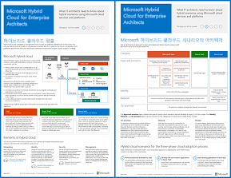

# Microsoft 클라우드의 Contoso

 **요약:** 가상의 전형적인 글로벌 조직이 Microsoft 클라우드 서비스로 클라우드 포함 IT 인프라를 채택하는 방법
  
이 문서는 파리에 본사를 두고 있는 글로벌 제조 대기업인 Contoso Corporation이 클라우드 포함 IT 인프라를 수용하고, 네트워킹, ID 및 보안에 대한 주요 디자인 결정을 해결한 방법과 비즈니스 문제를 해결하기 위해 엔터프라이즈 클라우드 시나리오를 구현하는 방법을 설명하는 문서 모음으로 연결됩니다. 또한 비즈니스 문제를 해결하기 위해 엔터프라이즈 클라우드 시나리오를 이 정보는 11페이지로 이루어진 포스터로 표시한 후 타블로이드 형식으로 인쇄할 수도 있습니다(ledger 11 x 17 또는 A3).
  

  
[PDF](https://go.microsoft.com/fwlink/p/?linkid=842085)  | [Visio](https://go.microsoft.com/fwlink/p/?linkid=842086)  | [기타 언어](https://www.microsoft.com/download/details.aspx?id=54427)
  
다음 섹션을 참조하세요.
  
- [하이브리드 클라우드 개요 (영문)](hybrid-cloud-overview.md)
    
    Contoso Corporation은 다국적 기업이자 10만 개가 넘는 제품의 제조, 판매 및 지원 업무를 처리하는 복합 기업입니다. 
    
- [Contoso의 IT 인프라 및 필요한](contoso-it-infrastructure-and-needs.md)
    
    Contoso는 중앙 집중식 온-프레미스 IT 인프라에서 클라우드 기반 개인 생산성 작업, 응용 프로그램 및 하이브리드 시나리오를 통합 수행할 수 있는 클라우드 포함 인프라로의 전환을 진행하고 있습니다.
    
- [Contoso Corporation에 대 한 네트워킹](networking-for-the-contoso-corporation.md)
    
    클라우드 기반 서비스에 대한 최적의 성능을 위해 Contoso의 네트워크 엔지니어가 인터넷 에지 및 인터넷에서 트래픽을 최적화했습니다.
    
- [Contoso Corporation 프로그램 id](identity-for-the-contoso-corporation.md)
    
    클라우드 솔루션에서 Contoso의 ID가 해당 온-프레미스 ID 공급자를 활용하고 기존의 신뢰할 수 있는 타사 ID 공급자와 함께 페더레이션 인증을 포함합니다.
    
- [구독, 라이선스 및 Contoso Corporation에 대 한 사용자 계정](subscriptions-licenses-and-user-accounts-for-the-contoso-corporation.md)
    
    Contoso가 Microsoft 클라우드 서비스에 액세스하기 위해 조직/구독/라이선스/사용자 계정 계층 구조를 사용합니다.
    
- [Contoso Corporation에 대 한 보안](security-for-the-contoso-corporation.md)
    
    IT 인프라를 클라우드 포함 인프라로 전환할 때 Contoso가 온-프레미스 보안 요구 사항이 Microsoft 클라우드 서비스에서 지원 및 구현되었는지를 확인했습니다.
    
- [Contoso Corporation에 대 한 엔터프라이즈 시나리오](enterprise-scenarios-for-the-contoso-corporation.md)
    
    Contoso에서 Microsoft 클라우드 서비스를 사용하여 비즈니스 요구 사항을 해결하는 방법을 확인
    
> [!NOTE]
> 이러한 문서는 Microsoft 클라우드 포스터 Contoso의 **2017년 9월** 릴리스를 반영합니다.
  
## 참고 항목

[Microsoft 클라우드 IT 아키텍처 리소스](microsoft-cloud-it-architecture-resources.md)

[Microsoft의 엔터프라이즈 클라우드 로드맵: IT 의사 결정권자를 위한 리소스]((https://sway.com/FJ2xsyWtkJc2taRD))

