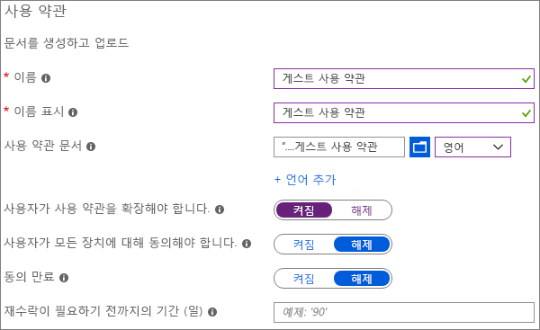
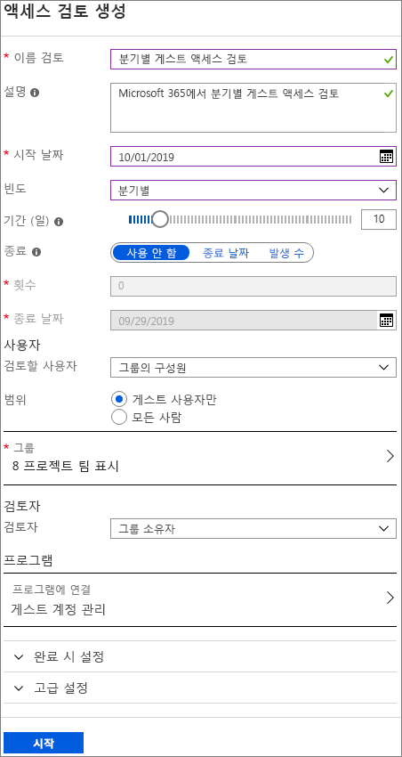
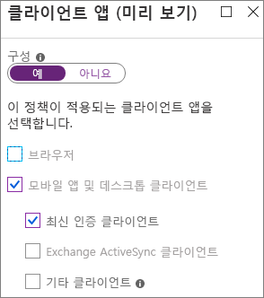
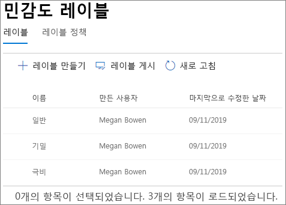
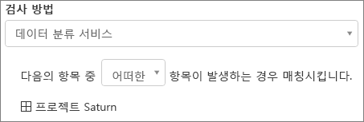
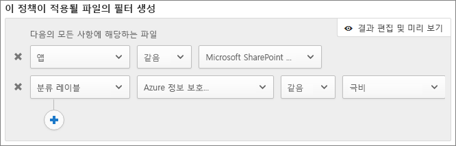

# 보안 게스트 공유 환경 만들기

이 문서에서는 Microsoft 365에서 보안 게스트 공유 환경을 만들기 위한 다양 한 옵션을 살펴보겠습니다. 이는 사용 가능한 옵션에 대한 아이디어를 제공하는 예제 시나리오입니다. 조직의 보안 및 규정 준수 요구 사항을 충족하기 위해 다음과 같이 다양한 조합의 절차를 사용할 수 있습니다. 이 문서의 마지막에는 테스트 사례를 통해 이러한 옵션 중 일부를 어떻게 적용했는지 살펴봅니다.

이 시나리오에서는 다음과 같은 사항을 다룹니다.

- 게스트에 대한 다단계 인증 설정
- 게스트에 대한 사용 약관 설정
- 게스트가 계속해서 팀 및 사이트에 대해 권한이 필요한지 주기적으로 확인하기 위한 분기별 게스트 액세스 검토 설정
- 관리되지 않은 장치에 대해서는 게스트가 웹에만 액세스하도록 제한
- 게스트가 매일 인증할 수 있도록 세션 시간 제한 정책 구성
- 콘텐츠를 분류하기 위한 민감도 레이블을 만들고 게시
- 극비 프로젝트에 대한 중요한 정보 유형 만들기
- 중요한 정보 유형이 포함된 문서에 *극비* 레이블을 자동으로 할당
- *극비*로 레이블 지정된 파일에서 게스트 액세스를 자동으로 제거

이 문서에서 다루는 일부 옵션은 게스트가 Azure Active Directory의 계정이 있어야 액세스할 수 있습니다. 파일과 폴더를 공유할 때 게스트가 디렉터리에 포함되도록 하려면 [Azure AD B2B와 SharePoint 및 OneDrive의 통합(미리 보기)](https://docs.microsoft.com/sharepoint/sharepoint-azureb2b-integration-preview)을 사용하세요.

이 문서에서는 게스트 공유 설정을 활성화하는 방법에 대해서는 다루지 않습니다. 다른 시나리오의 게스트 공유 활성화에 대해 자세히 알아보려면 [조직 외부 사용자와 공동 작업](https://docs.microsoft.com/Office365/Enterprise/collaborating-with-people-outside-your-organization)을 참조하세요.

## 게스트에 대한 다단계 인증 설정

다단계 인증은 계정이 손상될 가능성을 대폭 줄여 줍니다. 게스트 사용자는 관리 정책이나 모범 사례를 준수하지 않는 개인 이메일 계정을 사용할 가능성이 높기 때문에 게스트에 대해 다단계 인증을 요구하는 것은 특히 중요합니다. 게스트 사용자의 사용자 이름 및 비밀번호가 도난될 경우 2단계 인증을 요구하면 알 수 없는 당사자가 내 사이트 및 파일에 액세스할 가능성이 대폭 줄어듭니다.

이 예제에서는 Azure Active Directory에서 조건부 액세서 정책을 사용하여 게스트에 대한 다단계 인증을 설정합니다.

게스트에 대한 다단계 인증을 설정하려면
1. Microsoft Azure에서 *조건부 액세스*를 검색합니다.
2. **조건부 액세스 - 정책** 블레이드에서 **새 정책**을 클릭합니다.
3. **이름** 필드에서 *게스트 MFA*를 입력합니다.
4. **할당** 아래에서 **사용자 및 그룹**을 클릭합니다.
5. **사용자 및 그룹** 블레이드에서 **사용자 및 그룹 선택**을 선택하고 **모든 게스트 및 외부 사용자** 확인란을 선택한 후 **완료**를 클릭합니다.
4. **액세스 제어** 아래에서 **허용**을 선택합니다.
5. **허용** 블레이드에서 **다단계 인증 필요** 확인란을 선택한 후, **선택**을 클릭합니다.
6. **새로 만들기** 블레이드의 **정책 사용**에서 **설정**을 클릭한 후 **만들기**를 클릭합니다.

이제 게스트는 공유 콘텐츠, 사이트 또는 팀에 액세스하기 전에 다단계 인증에 등록해야 합니다.

### 추가 정보

[클라우드 기반 Azure 다단계 인증 배포 계획](https://docs.microsoft.com/azure/active-directory/authentication/howto-mfa-getstarted)

## 게스트에 대한 사용 약관 설정

게스트 사용자는 조직의 비공개 계약 또는 다른 법률 계약에 서명을 하지 않는 경우가 많습니다. 게스트에게 공유된 파일에 액세스하기 전에 사용 약관이 동의하도록 요구할 수 있습니다. 처음 공유 파일 또는 사이트에 액세스하려고 시도할 때 사용 약관이 표시될 수 있습니다.

사용 약관을 만들려면 먼저 Word 또는 다른 작성 프로그램에서 문서를 만든 후에 .pdf 파일로 저장해야 합니다. 그런 다음 이 파일을 Azure AD에 업로드할 수 있습니다.

Azure AD 사용 약관을 만들려면
1. Azure에 전역 관리자, 보안 관리자 또는 조건부 액세스 관리자로 로그인합니다.
2. [사용 약관](https://aka.ms/catou)으로 이동합니다.
3. **새 사용 약관**을 클릭합니다. 
   
4. **이름** 및 **디스플레이 이름** 상자에 *게스트 사용 약관*을 입력합니다.
6. **사용 약관 문서**의 경우 작성한 pdf 파일을 찾아 선택합니다.
7. 사용 약관 문서의 언어를 선택합니다.
8. **사용자가 사용 약관을 확장해야 함**을 **켜기**로 설정합니다.
9. **조건부 액세스**의 **조건부 액세스 정책 템플릿으로 적용** 목록에서 **나중에 조건부 액세스 정책 만들기**를 선택합니다.
10. **만들기**를 클릭합니다.

사용 약관을 만들었으면 다음 단계는 게스트 사용자에게 사용 약관을 표시하는 조건부 액세스 정책을 만드는 것입니다.

조건부 액세스 정책을 만들려면
1. Microsoft Azure에서 *조건부 액세스*를 검색합니다.
2. **조건부 액세스 - 정책** 블레이드에서 **새 정책**을 클릭합니다.
3. **이름** 상자에서 *게스트 사용자 사용 약관 정책*을 입력합니다.
4. **할당** 아래에서 **사용자 및 그룹**을 클릭합니다.
5. **사용자 및 그룹** 블레이드에서 **사용자 및 그룹 선택**을 선택하고 **모든 게스트 및 외부 사용자** 확인란을 선택한 후 **완료**를 클릭합니다.
6. **할당**에서 **클라우드 앱 또는 작업**을 클릭합니다.
7. **포함** 탭에서 **앱 선택**을 선택한 후 **선택**을 클릭합니다.
8. **선택** 블레이드에서 **Microsoft Teams**, **Office 365 SharePoint Online**, 및 **Outlook Groups**를 선택한 후 **선택**을 클릭합니다.
9. **클라우드 앱 및 작업** 블레이드에서 **완료**를 클릭합니다.
10. **액세스 제어** 아래에서 **허용**을 선택합니다.
11. **허용** 블레이드에서 **게스트 사용 약관**을 선택한 후 **선택**을 클릭합니다.
12. **새로 만들기** 블레이드의 **정책 사용**에서 **설정**을 클릭한 후 **만들기**를 클릭합니다.

이제 게스트 사용자가 처음으로 콘텐츠나 조직의 팀 또는 사이트에 액세스하려고 하면 사용 약관을 수락해야 합니다.

### 추가 정보
[Azure Active Directory 사용 약관](https://docs.microsoft.com/azure/active-directory/conditional-access/terms-of-use)

## 게스트 액세스 검토 설정

Azure AD의 액세스 검토로 다양한 팀과 그룹에 대한 주기적 사용자 액세스 검토를 자동화할 수 있습니다. 특히 게스트에 대해 액세스 검토를 요청하여 게스트 사용자가 필요 이상으로 오랫동안 조직의 중요한 정보에 대한 액세스 권한을 유지하지 않도록 할 수 있습니다.

액세스 검토는 프로그램으로 구성할 수 있습니다. 프로그램은 보고 및 감사 목적으로 액세스 검토를 구성하는 데 사용할 수 있는 유사한 액세스 검토 그룹입니다.

이 예제에서는 게스트 액세스 검토를 위한 프로그램을 만들어 봅니다.

프로그램을 만들려면
1. Azure Portal에 로그인하고 [ID 거버넌스 페이지](https://portal.azure.com/#blade/Microsoft_AAD_ERM/DashboardBlade)를 엽니다.
2. 왼쪽 메뉴에서 **프로그램**을 클릭합니다.
3. **새 프로그램**을 클릭합니다.
4. **이름** 상자에 *게스트 액세스 검토 프로그램*을 입력합니다.
5. **설명** 상자에 *게스트 액세스 검토를 위한 프로그램*을 입력합니다.
6. **만들기**를 클릭합니다.

프로그램이 만들어지면 게스트 액세스 검토를 만들고 프로그램에 연결할 수 있습니다.

게스트 사용자 액세스 검토를 설정하려면
1. [ID 거버넌스 페이지](https://portal.azure.com/#blade/Microsoft_AAD_ERM/DashboardBlade)의 왼쪽 메뉴에서 **액세스 검토**를 클릭합니다.
2. **새 액세스 검토**를 클릭합니다. 
   
3. **이름** 상자에 *분기별 게스트 액세스 검토*를 입력합니다.
4. **빈도**는 **분기별**을 선택합니다.
5. **종료**는 **안 함**을 선택합니다.
6. **범위**는 **게스트 사용자만**을 선택합니다.
7. **그룹**을 클릭하고 액세스 검토에 포함하려는 그룹을 선택한 후 **선택**을 클릭합니다.
8. **프로그램** 아래에서 **프로그램에 연결**을 클릭합니다.
9. **프로그램 선택** 블레이드에서 **게스트 액세스 검토 프로그램**을 선택합니다.
10. **시작**을 클릭합니다.

각 지정 그룹에 대해 별도의 액세스 검토를 만듭니다. 각 그룹의 그룹 소유자는 해당 그룹에 대한 게스트 액세스를 승인 또는 거부하기 위한 이메일을 분기별로 받게 됩니다.

게스트가 팀이나 그룹에, 또는 개별 파일 및 폴더에 대한 액세스 권한을 받을 수 있음에 주의하는 것이 중요합니다. 파일 및 폴더에 대한 액세스 권한을 주면 게스트가 특정 그룹에 추가되지 않을 수 있습니다. 팀이나 그룹에 속하지 않은 게스트 사용자에 대한 액세스 검토를 수행하려는 경우 모든 게스트가 포함되도록 Azure AD에서 동적 그룹을 만든 후에 해당 그룹에 대한 액세스 검토를 만들면 됩니다.

### 추가 정보
[Azure AD 액세스 검토를 사용하여 게스트 액세스 관리](https://docs.microsoft.com/azure/active-directory/governance/manage-guest-access-with-access-reviews)

[Azure AD 액세스 검토에서 그룹 또는 애플리케이션에 대한 액세스 검토 만들기](https://docs.microsoft.com/azure/active-directory/governance/create-access-review)

## 게스트 사용자가 웹에만 액세스할 수 있게 설정

게스트 사용자가 웹 브라우저만 사용하여 팀, 사이트 및 파일에 액세스하게 하면 공격 영역을 줄이고 관리가 용이해지게 할 수 있습니다. 이는 Azure AD 조건부 액세스 정책으로 수행됩니다.

게스트가 웹에만 액세스하도록 제한하려면
1. Microsoft Azure에서 *조건부 액세스*를 검색합니다.
2. **조건부 액세스 - 정책** 블레이드에서 **새 정책**을 클릭합니다.
3. **이름** 상자에 *게스트 사용자 사용 약관 정책*을 입력합니다.
4. **할당** 아래에서 **사용자 및 그룹**을 클릭합니다.
5. **사용자 및 그룹** 블레이드에서 **사용자 및 그룹 선택**을 선택하고 **모든 게스트 및 외부 사용자** 확인란을 선택한 후 **완료**를 클릭합니다.
6. **할당**에서 **클라우드 앱 또는 작업**을 클릭합니다.
7. **포함** 탭에서 **앱 선택**을 선택한 후 **선택**을 클릭합니다.
8. **선택** 블레이드에서 **Microsoft Teams**, **Office 365 SharePoint Online**, 및 **Outlook Groups**를 선택한 후 **선택**을 클릭합니다.
9. **클라우드 앱 및 작업** 블레이드에서 **완료**를 클릭합니다.
10. **할당** 아래에서 **조건**을 클릭합니다.
11. **조건** 블레이드에서 **클라이언트 앱**을 클릭합니다.
12. **클라이언트 앱** 블레이드에서 **구성**의 경우 **예**를 클릭하고 **모바일 앱 및 데스크톱 클라이언트**와 **최신 인증 클라이언트** 설정을 선택합니다. 
    
13. **완료**를 클릭한 후 **조건** 블레이드에서 다시 **완료**를 클릭합니다.
14. **액세스 제어** 아래에서 **허용**을 선택합니다.
15. **허용** 블레이드에서 **디바이스를 준수 상태로 표시해야 함** 및 **하이브리드 Azure AD 조인 디바이스 필요**를 선택합니다.
16. **다중 컨트롤의 경우** 아래에서 **선택한 컨트롤 중 하나 필요**를 선택한 후 **선택**을 클릭합니다.
17. **새로 만들기** 블레이드의 **정책 사용**에서 **설정**을 클릭한 후 **만들기**를 클릭합니다.

## 게스트 사용자에 대한 세션 시간 제한 구성

게스트가 정기적으로 인증하도록 요구하면 게스트 사용자의 장치가 보안이 유지되지 않을 경우 조직의 콘텐츠에 알 수 없는 사용자가 액세스할 가능성이 줄어들 수 있습니다. Azure AD에서 게스트 사용자에 대해 세션 시간 제한 조건부 액세스 정책을 구성할 수 있습니다.

게스트 세션 시간 제한 정책을 구성하려면
1. Microsoft Azure에서 *조건부 액세스*를 검색합니다.
2. **조건부 액세스 - 정책** 블레이드에서 **새 정책**을 클릭합니다.
3. **이름** 상자에 *게스트 세션 시간 제한*을 입력합니다.
4. **할당** 아래에서 **사용자 및 그룹**을 클릭합니다.
5. **사용자 및 그룹** 블레이드에서 **사용자 및 그룹 선택**을 선택하고 **모든 게스트 및 외부 사용자** 확인란을 선택한 후 **완료**를 클릭합니다.
6. **할당**에서 **클라우드 앱 또는 작업**을 클릭합니다.
7. **포함** 탭에서 **앱 선택**을 선택한 후 **선택**을 클릭합니다.
8. **선택** 블레이드에서 **Microsoft Teams**, **Office 365 SharePoint Online**, 및 **Outlook Groups**를 선택한 후 **선택**을 클릭합니다.
9. **클라우드 앱 및 작업** 블레이드에서 **완료**를 클릭합니다.
10. **액세스 제어** 아래에서 **세션**을 클릭합니다.
11. **세션** 블레이드에서 **로그인 빈도**를 선택합니다.
12. 시간에서 **1**과 **일**을 선택한 후 **선택**을 클릭합니다.
13. **새로 만들기** 블레이드의 **정책 사용**에서 **설정**을 클릭한 후 **만들기**를 클릭합니다.

## 민감도 레이블 만들기

민감도 레이블은 조직의 정보를 분류하고 보호하는 데 다양한 방식으로 사용할 수 있습니다. 이 예제에서는 공유 파일 및 폴더에 대한 게스트 액세스를 관리하는 데 레이블이 어떻게 사용될 수 있는지 살펴봅니다.

먼저 Microsoft 365 규정 준수 센터에서 다음의 3가지 민감도 레이블을 만듭니다.

- 일반
- 기밀
- 극비

다음 절차를 통해 *일반* 및 *기밀* 레이블을 만듭니다.

분류 레이블(일반 및 기밀)을 만들려면
1. [Microsoft 365 규정 준수 센터](https://compliance.microsoft.com)의 왼쪽 탐색에서 **분류**를 확장한 후 **민감도 레이블**을 클릭합니다.
2. **레이블 만들기**를 클릭합니다.
3. **레이블 이름**에 *일반* 또는 *기밀*을 입력합니다.
4. **도구 설명**에 *직원, 게스트 및 파트너와 공유할 수 있는 일반 정보* 또는 *기밀 정보. 직원과 인증된 게스트와만 공유*라고 입력한 후 **다음**을 클릭합니다.
5. 암호화를 **끄기**로 두고 **다음**을 클릭합니다.
6. 콘텐츠 표시를 **끄기**로 두고 **다음**을 클릭합니다.
7. 엔드포인트 데이터 손실 방지를 **끄기**로 두고 **다음**을 클릭합니다.
8. 자동 레이블 지정을 **끄기**로 두고 **다음**을 클릭합니다.
9. **만들기**를 클릭합니다.

*극비* 레이블의 경우 레이블과 함께 문서의 자동 워터마킹을 더하게 됩니다.

분류 레이블(극비)을 만들려면
1. **레이블 만들기**를 클릭합니다.
2. **레이블 이름**에 *극비*를 입력합니다.
3. **도구 설명**에 *극비 정보. 게스트와 공유하지 않음*을 입력한 후 **다음**을 클릭합니다.
4. 암호화를 **끄기**로 두고 **다음**을 클릭합니다.
5. 콘텐츠 표시를 **켜기**로 설정하고 **헤더 추가** 확인란을 선택한 후 **텍스트 사용자 지정**을 클릭합니다.
6. 헤더 텍스트에 *극비*를 입력하고 **저장**을 클릭합니다.
7. **콘텐츠 표시** 페이지에서 콘텐츠 표시를 **켜기**로 설정합니다.
8. **워터마크 추가** 확인란을 선택한 후 **텍스트 사용자 지정**을 클릭합니다.
9. **워터마크 텍스트**에 *극비*를 입력합니다.
10. **글꼴 크기**에 *24*를 입력한 후 **저장**을 클릭합니다.
11. **콘텐츠 표시** 페이지에서 **다음**을 클릭합니다.
12. 엔드포인트 데이터 손실 방지를 **끄기**로 두고 **다음**을 클릭합니다.
13. 자동 레이블 지정을 **끄기**로 두고 **다음**을 클릭합니다.
14. **만들기**를 클릭합니다.

레이블을 만들었으면 다음 단계는 게시하는 것입니다. 

레이블을 게시하려면
1. **민감도 레이블** 페이지에서 **레이블 게시**를 클릭합니다.
2. **게시할 레이블 선택**을 클릭합니다.
3. **추가**를 클릭하고 만든 레이블을 선택한 후 **추가**를 클릭합니다.
4. **완료**를 클릭합니다.
5. **다음**을 클릭합니다.
6. 사용자와 그룹이 **모두**로 설정되도록 두고 **다음**을 클릭합니다.
7. **문서 및 이메일에 기본적으로 이 레이블 적용** 목록에서 **일반**을 선택한 후 **다음**을 클릭합니다.
8. **정책 설정** 페이지에서 이름에 *문서 민감도*를 입력한 후 **다음**을 클릭합니다.
9. **게시**를 클릭합니다.

레이블이 게시되면 Office 데스크톱 앱의 사용자에게 제공됩니다. 사용자가 **극비** 레이블을 적용하면 워터마크가 자동으로 문서에 추가됩니다.

### 추가 정보
[민감도 레이블 개요](https://docs.microsoft.com/Office365/SecurityCompliance/sensitivity-labels)

## 극비 프로젝트에 대한 중요한 정보 유형 만들기

중요한 정보 유형은 규정 준수 요구 사항을 적용하기 위해 정책 워크플로에 사용할 수 있는 미리 정의된 문자열입니다. Microsoft 365 규정 준수 센터는 운전면허증 번호, 신용카드 번호, 은행 계좌 번호 등을 포함한 100개 넘는 중요한 정보 유형을 제공합니다.

조직에 특정화된 콘텐츠를 관리하기 위해 사용자 지정 중요한 정보 유형을 만들 수도 있습니다. 이 예제에서는 극비 프로젝트에 대한 사용자 지정 중요한 정보 유형을 만들어봅니다. 그런 다음 이 중요한 정보 유형을 사용하여 분류 레이블에 자동으로 적용할 수 있습니다.

사용자 지정 중요한 정보 유형을 만들려면
1. [Microsoft 365 규정 준수 센터](https://compliance.microsoft.com)의 왼쪽 탐색에서 **분류**를 확장한 후 **중요한 정보 유형**을 클릭합니다.
2. **만들기**를 클릭합니다.
3. **이름**과 **설명**에 **프로젝트 Saturn**을 입력한 후 **다음**을 클릭합니다.
4. **요소 추가**를 클릭합니다.
5. **다음이 포함된 콘텐츠 검색** 목록에서 **키워드**를 선택한 후 키워드 상자에 *프로젝트 Saturn*을 입력합니다.
6. **다음**을 클릭한 후 **마침**을 클릭합니다.
7. 중요한 정보 유형을 테스할지 묻는 메시지가 표시되면 **아니요**를 클릭합니다.

### 추가 정보
[사용자 지정 중요한 정보 유형](https://docs.microsoft.com/Office365/SecurityCompliance/custom-sensitive-info-types)

## 중요한 정보 유형을 기반으로 레이블을 할당할 정책 만들기

중요한 정보 유형을 만들었으면 Microsoft Cloud App Security에서 *프로젝트 Saturn* 문자열이 포함된 문서에 *극비* 레이블을 자동으로 적용할 파일 정책을 만들 수 있습니다.

> [!NOTE]
> Cloud App Security에서 민감도 레이블을 사용할 수 있게 하는 복제 프로세스가 있습니다. 현재는 정책에 사용할 수 있는 레이블이 보이지 않을 수 있습니다.

중요한 정보 유형 기반 파일 정책을 만들려면
1. [Microsoft Cloud App Security](https://portal.cloudappsecurity.com)를 엽니다.
2. 왼쪽 탐색에서 **컨트롤**을 확장한 후 **정책**을 클릭합니다.
3. **정책 만들기**를 클릭한 후 **파일 정책**을 선택합니다.
4. **파일 이름**에 *프로젝트 Saturn 레이블 지정*을 입력합니다.
5. **이 정책이 적용될 파일의 필터 생성** 아래에서 X를 두 번 클릭하여 기본 필터를 삭제합니다.
7. **필터 선택** 목록에서 **앱**을 선택한 후 **앱 선택...** 목록에서 **Microsoft SharePoint Online**을 선택합니다.
8. **검사 방법** 아래에서 **데이터 분류 서비스**를 선택합니다.
9. **검사 유형 선택** 목록에서 **중요한 정보 유형**을 선택합니다.
10. *프로젝트 Saturn* 민감도 레이블을 검색하고 선택한 후 **완료**를 클릭합니다. 
   
11. **거버넌스** 아래에서 **Microsoft SharePoint Online**을 확장합니다.
12. **분류 레이블 적용** 확인란을 선택하고 **극비** 레이블을 선택합니다.
13. **만들기**를 클릭합니다.

정책이 준비되었으면 사용자가 "프로젝트 Saturn"을 문서에 입력할 경우 Cloud App Security에서 파일을 스캔할 때 *극비* 레이블을 자동으로 적용합니다.

### 추가 정보
[파일 정책](https://docs.microsoft.com/cloud-app-security/data-protection-policies)

## 극비 파일에 대한 게스트 액세스 권한을 제거할 정책 만들기

이 문서의 이 예제에서 *극비* 레이블이 지정된 파일은 게스트와 공유하면 안 됩니다. Cloud App Security에서 해당 레이블이 지정된 파일의 게스트 액세스 권한을 자동으로 제거하는 파일 정책을 만들 수 있습니다.

이 방법으로 사용자가 이러한 파일을 공유 또는 재공유하는 것을 방지할 수는 없음에 유의하세요. 게스트 공유를 허용하는 사이트에 저장된 파일에 대한 관리 정책을 사용자가 따르도록 하는 데 계속 의존할 수 있습니다. 하지만 게스트와 공유한 이후 추가된, 기밀 정보가 있는 파일의 게스트 액세스를 제거하는 데는 유용한 도구일 수 있씁니다.

레이블 기반 파일 정책을 만들려면
1. [Microsoft Cloud App Security](https://portal.cloudappsecurity.com)를 엽니다.
2. 왼쪽 탐색에서 **컨트롤**을 확장한 후 **정책**을 클릭합니다.
3. **정책 만들기**를 클릭한 후 **파일 정책**을 선택합니다.
4. **정책 이름**에 *프로젝트 Saturn - 게스트 액세스 제거*를 입력합니다.
5. **이 정책이 적용될 파일의 필터 생성** 아래에서 X를 두 번 클릭하여 기본 필터를 삭제합니다.
6. **필터 선택** 목록에서 **앱**을 선택한 후 **앱 선택...** 목록에서 **Microsoft SharePoint Online**을 선택합니다.
7. **필터 추가**를 클릭합니다.
8. **필터 선택** 목록에서 **분류 레이블**을 선택한 후 **필터 선택...** 목록에서 **Azure Information Protection**을 선택합니다.
9. **분류 레이블 선택** 목록에서 **극비**를 선택합니다. 
   
10. **거버넌스** 아래에서 **Microsoft SharePoint Online**을 확장합니다.
11. **정책 일치 다이제스트를 파일 소유자에게 전송** 및 **외부 사용자 제거** 확인란을 선택합니다.
12. 사용자 지정 알림 메시지에는 *이 파일은 극비 항목입니다. 회사 정책상 게스트와 공유하는 것이 금지됩니다.* 를 입력합니다.
13. **만들기**를 클릭합니다.

이 정책은 *특정 사용자* 링크를 사용하여 공유된 파일에 대한 액세스를 제거한다는 것에 주의하는 것이 중요합니다. 인증되지 않은 (*모든 사용자*) 링크에서 액세스를 제거하지는 않습니다. 게스트가 전체 사이트나 팀의 구성원일 경우에도 액세스가 제거되지 않습니다. 게스트 구성원이 포함된 사이트 또는 팀의 극비 문서를 마련할 계획이면 [팀 내 비공개 채널](https://support.office.com/article/60ef929a-4d68-418b-bf4f-5784db184ec9)을 사용하고 비공개 채널의 조직 구성원에게만 허용하는 방법을 고려하세요.

## 솔루션 테스트

이 문서에서 설명한 솔루션을 테스트하려면 Word 문서를 만들고 문서 라이브러리에 저장합니다. 게스트 사용자와 파일을 공유합니다. 게스트가 문서에 액세스하려고 하면 다단계 인증에 등록한 후 사용 약관을 수락해야 한다는 요구를 받습니다.

게스트가 문서에 대한 액세스 권한을 갖게 되면 문서에 *프로젝트 Saturn*을 입력하고 저장합니다. Cloud App Security가 문서를 스캔하면 *극비* 레이블이 적용되고 게스트 사용자가 더 이상 해당 문서에 대해 액세스 권한을 갖지 못하게 됩니다.

이 문서에 설명된 도구를 다양하게 조합하여 사용함으로써 조직에 생산적이면서도 안전한 게스트 공유 환경을 구축할 수 있습니다.

## 추가 옵션

Microsoft 365 및 Azure Active Directory에는 게스트 공유 환경을 보호하는 데 도움이 되는 몇 가지 추가 옵션이 있습니다.

- 사용자가 공유할 수 있는 사람을 제한하기 위해 허용 또는 거부된 공유 도메인 목록을 만들 수 있습니다. 자세한 내용은 [도메인별 SharePoint 및 OneDrive 콘텐츠 공유 제한](https://docs.microsoft.com/sharepoint/restricted-domains-sharing) 및 [특정 조직의 B2B 사용자에게 초대 허용 또는 차단](https://docs.microsoft.com/azure/active-directory/b2b/allow-deny-list)을 참조하십시오.
- 사용자가 연결할 수 있는 다른 Azure Active Directory 테넌트를 제한할 수 있습니다. 자세한 내용은 [테넌트 제한을 사용하여 SaaS 클라우드 응용 프로그램에 대한 액세스 관리](https://docs.microsoft.com/azure/active-directory/manage-apps/tenant-restrictions)를 참조하세요.
- 파트너가 게스트 계정을 관리할 수 있는 관리형 환경을 만들 수 있습니다. 자세한 내용은 [관리 대상 게스트와 B2B 엑스트라넷 작성](https://docs.microsoft.com/Office365/Enterprise/b2b-extranet)을 참조하십시오.

## 참고 항목

[게스트와 공유할 때 파일에 실수로 발생하는 노출을 제한](sharing-limit-accidental-exposure.md)

[인증되지 않은 사용자와 파일 및 폴더를 공유하는 모범 사례](best-practices-anonymous-sharing.md)

[관리 대상 게스트와 B2B 엑스트라넷 작성](b2b-extranet.md)
