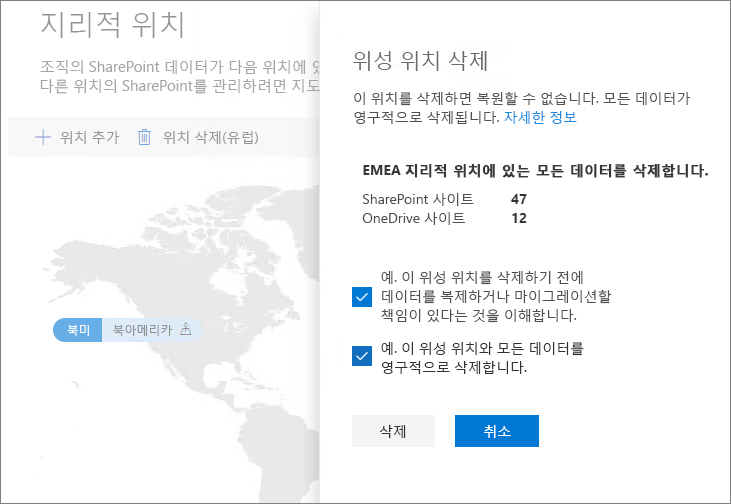

# Microsoft 365 Multi-Geo에서 위성 위치 삭제

위성 위치가 더 이상 필요하지 않으면 SharePoint 관리 센터를 사용하여 테넌트에서 삭제할 수 있습니다.

> [!WARNING]
> 위성 위치의 모든 사용자 데이터가 영구적으로 삭제됩니다. 여기에는 OneDrive for Business의 모든 콘텐츠, SharePoint 사이트 및 Microsoft 365 그룹 사서함을 포함한 Exchange 사서함이 포함됩니다. 위성 위치를 삭제하기 전에 데이터를 다른 위성 위치 또는 중앙 위치로 마이그레이션 해야 합니다. 이 작업은 취소할 수 없습니다.

전역 관리자만 위성 위치를 삭제할 수 있습니다.

위성 위치를 삭제하려면

1. SharePoint 관리 센터를 엽니다.

2. **지리적 위치** 탭으로 이동합니다.

3. 지도에서 삭제하려는 지리적 위치를 클릭합니다.

4. **위치 삭제**를 클릭합니다.

5. 확인 확인란을 선택하여 삭제를 확인합니다.

6. **삭제**를 클릭합니다.
