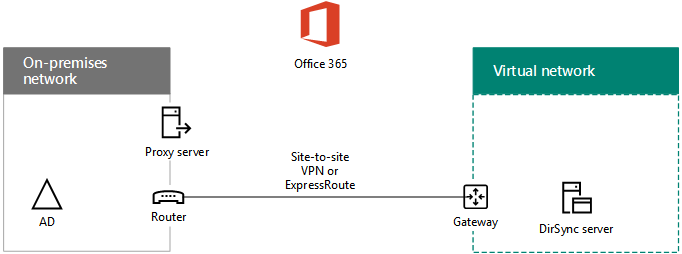
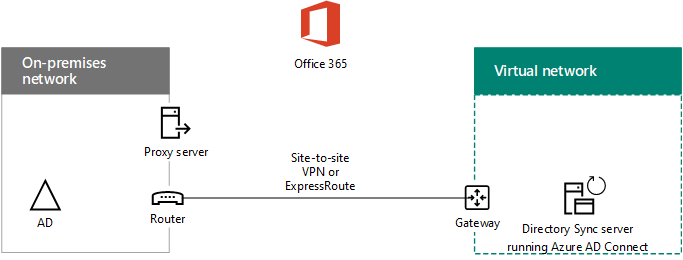

# Microsoft Azure에서 Office 365 디렉터리 동기화 (DirSync)를 배포 합니다.Deploy Office 365 Directory Synchronization (DirSync) in Microsoft Azure

 **요약:** 온-프레미스 디렉터리 및 Office 365 구독 Azure AD 테 넌 트 사이 계정을 동기화 하는 Azure에 가상 컴퓨터에서 Azure AD 연결 (DirSync)를 배포 합니다.**Summary:** Deploy Azure AD Connect (DirSync) on a virtual machine in Azure to synchronize accounts between your on-premises directory and the Azure AD tenant of your Office 365 subscription.
  
Azure Active Directory (AD) 연결 (이전의 디렉터리 동기화 도구, 디렉터리 동기화 도구 또는 DirSync.exe 도구) 도메인에 가입 된 서버에 설치 하는 서버 기반 응용 프로그램은 온-프레미스 Windows 서버를 동기화 Office 365 구독 Azure Active Directory 테 넌 트에 active Directory 사용자입니다. 온-프레미스 서버의 Azure AD 연결을 설치할 수는 있지만 설치할 수 있습니다 또한 Azure에 가상 컴퓨터에 다음과 같은 이유로 합니다.Azure Active Directory (AD) Connect (formerly known as the Directory Synchronization tool, Directory Sync tool, or the DirSync.exe tool) is a server-based application that you install on a domain-joined server to synchronize your on-premises Windows Server Active Directory users to the Azure Active Directory tenant of your Office 365 subscription. You can install Azure AD Connect on a on-premises server, but you can also install it on a virtual machine in Azure for the following reasons:
  
- 구축 및 클라우드 기반 서버를 속도 구성 하 여 서비스를 사용할 수 있도록 사용자에 게 빨리 수 있습니다.You can provision and configure cloud-based servers faster, making the services available to your users sooner.
    
- Azure 적은 노력으로 더 나은 사이트의 가용성을 제공 합니다.Azure offers better site availability with less effort.
    
- 조직에서 온-프레미스 서버 수를 줄일 수 있습니다.You can reduce the number of on-premises servers in your organization.
    
> [!IMPORTANT]
> 이 솔루션을 사용 하려면 온-프레미스 네트워크 및 Azure 가상 네트워크 간의 연결을 해야 합니다. 자세한 내용은 [Microsoft Azure 가상 네트워크에 연결 하는 온-프레미스 네트워크 연결](connect-an-on-premises-network-to-a-microsoft-azure-virtual-network.md)을 참조 하십시오.This solution requires connectivity between your on-premises network and your Azure Virtual Network. For more information, see [Connect an on-premises network to a Microsoft Azure virtual network](connect-an-on-premises-network-to-a-microsoft-azure-virtual-network.md). 
  
> [!IMPORTANT]
> 이 문서에서는 단일 포리스트에 단일 도메인의 동기화에 설명 합니다. Azure AD 연결 Office 365와 Active Directory 포리스트에 있는 모든 Windows Server AD 도메인을 동기화합니다. Office 365와 동기화 할 Active Directory 포리스트를 여러 경우 [Single Sign-on 시나리오를 사용 하는 다중 포리스트 디렉터리 동기화](https://go.microsoft.com/fwlink/p/?LinkId=393091)를 참조 하십시오.This article describes synchronization of a single domain in a single forest. Azure AD Connect synchronizes all Windows Server AD domains in your Active Directory forest with Office 365. If you have multiple Active Directory forests to synchronize with Office 365, see [Multi-forest Directory Sync with Single Sign-On Scenario](https://go.microsoft.com/fwlink/p/?LinkId=393091). 
  
> [!NOTE]
> Office 365의 디렉터리 서비스에 대 한 Azure Active Directory (Azure AD)를 사용합니다. Office 365 구독은 Azure AD 테 넌 트를 포함합니다. 이 테 넌이 트 Azure의 다른 SaaS 응용 프로그램 및 응용 프로그램을 비롯 한 다른 클라우드 작업 부하와 조직의 id의 관리를 위한도 사용할 수 있습니다.Office 365 uses Azure Active Directory (Azure AD) for its directory service. Your Office 365 subscription includes an Azure AD tenant. This tenant can also be used for management of your organization's identities with other cloud workloads, including other SaaS applications and apps in Azure. 
  
## Azure의 디렉터리 동기화를 Office 365 배포 개요Overview of deploying Office 365 directory synchronization in Azure

다음 다이어그램에서는 anOffice 365 구독에는 온-프레미스 Windows Server AD 포리스트를 동기화 하는 Azure (디렉터리 동기화 서버)의 가상 컴퓨터에서 실행 중인 Azure AD 연결을 보여줍니다.The following diagram shows Azure AD Connect running on a virtual machine in Azure (the DirSync server) that synchronizes an on-premises Windows Server AD forest to anOffice 365 subscription.
  

  
이 다이어그램에서는 사이트 마다 VPN 또는 ExpressRoute 연결 하 여 연결 된 두 네트워크 있습니다. 여기에서 Windows Server AD 도메인 컨트롤러 이동한 하는 가상 컴퓨터에 해당 하는 디렉터리 동기화 서버와 함께 Azure 가상 네트워크를 온-프레미스 네트워크가 [Azure AD 연결](https://www.microsoft.com/download/details.aspx?id=47594)을 실행 합니다. 디렉터리 동기화 서버에서 시작 되는 두가지 주요 트래픽 흐름 가지가 있습니다.In the diagram, there are two networks connected by a site-to-site VPN or ExpressRoute connection. There is an on-premises network where Windows Server AD domain controllers are located, and there is an Azure virtual network with a DirSync server, which is a virtual machine running [Azure AD Connect](https://www.microsoft.com/download/details.aspx?id=47594). There are two main traffic flows originating from the DirSync server:
  
-  Azure AD 연결 계정 및 암호를 변경 내용에 대 한 온-프레미스 네트워크에서 도메인 컨트롤러를 쿼리합니다.Azure AD Connect queries a domain controller on the on-premises network for changes to accounts and passwords.
    
-  Azure AD 연결 계정 및 암호를 Office 365 구독 Azure AD 인스턴스는 변경 내용을 보냅니다. 온-프레미스 네트워크는 확장 된 부분에는 디렉터리 동기화 서버 이기 때문에 이러한 변경 내용은 온-프레미스 네트워크 프록시 서버를 통해 전송 됩니다.Azure AD Connect sends the changes to accounts and passwords to the Azure AD instance of your Office 365 subscription. Because the DirSync server is in an extended portion of your on-premises network, these changes are sent through the on-premises network's proxy server.
    
> [!NOTE]
> 이 솔루션에서는 단일 Active Directory 포리스트에 단일 Active Directory 도메인의 동기화에 설명 합니다. Azure AD 연결 Office 365와 Active Directory 포리스트에 있는 모든 Active Directory 도메인을 동기화합니다. Office 365와 동기화 할 Active Directory 포리스트를 여러 경우 [Single Sign-on 시나리오를 사용 하는 다중 포리스트 디렉터리 동기화](https://go.microsoft.com/fwlink/p/?LinkId=393091)를 참조 하십시오.This solution describes synchronization of a single Active Directory domain, in a single Active Directory forest. Azure AD Connect synchronizes all Active Directory domains in your Active Directory forest with Office 365. If you have multiple Active Directory forests to synchronize with Office 365, see [Multi-forest Directory Sync with Single Sign-On Scenario](https://go.microsoft.com/fwlink/p/?LinkId=393091). 
  
두 경우 모두 Azure 가상 컴퓨터에서 실행 중인 Azure AD 연결 하 여를 유발한 트래픽은 다음에 VPN 게이트웨이 장치에 사이트 마다 VPN 또는 ExpressRoute 연결을 통해 트래픽을 전달 하는 Azure에 가상 네트워크에 게이트웨이를 전달합니다 온-프레미스 네트워크입니다. 온-프레미스 네트워크의 라우팅 인프라에는 다음 도메인 컨트롤러 또는 프록시 서버와 같은 목적지로 트래픽을 전달합니다.In both cases, the traffic originated by Azure AD Connect running on the Azure virtual machine is forwarded to a gateway on the virtual network in Azure, which then forwards the traffic across the site-to-site VPN or ExpressRoute connection to the VPN gateway device on the on-premises network. The routing infrastructure of the on-premises network then forwards the traffic to its destination, such as a domain controller or a proxy server.
  
이 솔루션을 배포 하는 데는 두 주요 단계가 있습니다.There are two major steps when you deploy this solution:
  
1. Azure 가상 네트워크를 만들고 온-프레미스 네트워크에 대 한 사이트 간 VPN 연결을 설정 합니다. 자세한 내용은 [Microsoft Azure 가상 네트워크에 연결 하는 온-프레미스 네트워크 연결](connect-an-on-premises-network-to-a-microsoft-azure-virtual-network.md)을 참조 하십시오.Create an Azure virtual network and establish a site-to-site VPN connection to your on-premises network. For more information, see [Connect an on-premises network to a Microsoft Azure virtual network](connect-an-on-premises-network-to-a-microsoft-azure-virtual-network.md).
    
2. [Azure AD 연결](https://www.microsoft.com/download/details.aspx?id=47594) , Azure의 도메인에 가입 된 가상 컴퓨터에 설치 하 고 Office 365를 온-프레미스 Windows Server AD를 동기화 합니다. 이는 다음이 포함 됩니다.Install [Azure AD Connect](https://www.microsoft.com/download/details.aspx?id=47594) on a domain-joined virtual machine in Azure, and then synchronize the on-premises Windows Server AD to Office 365. This involves:
    
    Azure 가상 컴퓨터를 사용 하 여 Azure AD 연결을 실행 하는를 만듭니다.Creating an Azure Virtual Machine to run Azure AD Connect.
    
    설치 하 고 [Azure AD 연결](https://www.microsoft.com/download/details.aspx?id=47594)을 구성 합니다.Installing and configuring [Azure AD Connect](https://www.microsoft.com/download/details.aspx?id=47594).
    
    Azure AD 연결을 구성 하려면 Azure AD 관리자 계정 및 Windows Server AD 엔터프라이즈 관리자 계정 자격 증명 (사용자 이름 및 암호) 필요 합니다. Azure AD 연결을 즉시 하 고 Office 365를 온-프레미스 Windows Server AD 포리스트를 동기화 하 고 지속적으로 실행 합니다.Configuring Azure AD Connect requires the credentials (user name and password) of an Azure AD administrator account and a Windows Server AD enterprise administrator account. Azure AD Connect runs immediately and on an ongoing basis to synchronize the on-premises Windows Server AD forest to Office 365.
    
프로덕션 환경에서이 솔루션을 배포 하기 전에 실험 또는 데모에 대 한 개념 증명으로이 구성을 설정 하려면 지침 [Office 365 개발/테스트 환경에 대 한 디렉터리 동기화](dirsync-for-your-office-365-dev-test-environment.md) 에 사용 합니다.Before you deploy this solution in production, use the instructions in [DirSync for your Office 365 dev/test environment](dirsync-for-your-office-365-dev-test-environment.md) to set this configuration up as a proof of concept, for demonstrations, or for experimentation.
  
> [!IMPORTANT]
> Azure AD 연결 구성에는 다음이 완료 되 면 저장 하지는 않습니다 Windows Server AD 엔터프라이즈 관리자 계정 자격 증명입니다.When Azure AD Connect configuration completes, it does not save the Windows Server AD enterprise administrator account credentials. 
  
> [!NOTE]
> 이 솔루션에서는 Office 365를 단일 Windows Server AD 포리스트 동기화 (영문)에 대해 설명 합니다. 이 문서에서 설명 하는 토폴로지는이 솔루션을 구현 하는 방법은 하나 뿐를 나타냅니다. 조직의 토폴로지 고유한 네트워크 요구 사항 및 보안 고려 사항에 따라 다를 수 있습니다.This solution describes synchronizing a single Windows Server AD forest to Office 365. The topology discussed in this article represents only one way to implement this solution. Your organization's topology might differ based on your unique network requirements and security considerations. 
  
## Azure의 Office 365에 대 한 디렉터리 동기화 서버를 호스트 하는 것에 대 한 계획Plan for hosting a DirSync server for Office 365 in Azure

### 필수 구성 요소Prerequisites

시작 하기 전에이 솔루션에 대 한 다음과 같은 필수 구성 요소를 검토 합니다.Before you begin, review the following prerequisites for this solution:
  
- [Azure 가상 네트워크를 계획](connect-an-on-premises-network-to-a-microsoft-azure-virtual-network.md#PlanningVirtual)의 계획 관련된 콘텐츠를 검토 합니다.Review the related planning content in [Plan your Azure virtual network](connect-an-on-premises-network-to-a-microsoft-azure-virtual-network.md#PlanningVirtual).
    
- Azure 가상 네트워크를 구성 하기 위한 모든 [필수 구성 요소](connect-an-on-premises-network-to-a-microsoft-azure-virtual-network.md#Prerequisites) 를 충족 하는지 확인 합니다.Ensure that you meet all [prerequisites](connect-an-on-premises-network-to-a-microsoft-azure-virtual-network.md#Prerequisites) for configuring the Azure virtual network.
    
- Active Directory 통합 기능을 포함 하는 Office 365 구독을 포함 합니다. Office 365 구독에 대 한 정보를 [Office 365 구독 페이지](https://go.microsoft.com/fwlink/p/?LinkId=394278)으로 이동 합니다.Have an Office 365 subscription that includes the Active Directory integration feature. For information about Office 365 subscriptions, go to the [Office 365 subscription page](https://go.microsoft.com/fwlink/p/?LinkId=394278).
    
- Office 365와 온-프레미스 Windows Server AD 포리스트에 동기화에 Azure AD 연결을 실행 하는 하나의 Azure 가상 컴퓨터를 프로 비전 합니다.Provision one Azure Virtual Machine that runs Azure AD Connect to synchronize your on-premises Windows Server AD forest with Office 365.
    
    Windows Server AD 엔터프라이즈 관리자 계정 및 Azure Active Directory 관리자 계정에 대 한 자격 증명 (이름 및 암호)이 있어야 합니다.You must have the credentials (names and passwords) for a Windows Server AD enterprise administrator account and an Azure Active Directory Administrator account.
    
### 솔루션 아키텍처 디자인 가정Solution architecture design assumptions

다음 목록에서는이 솔루션에 대 한 디자인 선택 사항에 설명 합니다.The following list describes the design choices made for this solution.
  
- 이 솔루션 단일 Azure 가상 네트워크를 사용 하 여 사이트 간 VPN 연결을 사용 합니다. Azure 가상 네트워크 서버가 포함 된 단일 서브넷, Azure AD 연결을 실행 하는 디렉터리 동기화 서버를 호스트 합니다.This solution uses a single Azure virtual network with a site-to-site VPN connection. The Azure virtual network hosts a single subnet that contains one server, the DirSync server that is running Azure AD Connect. 
    
- 온-프레미스 네트워크에서 도메인 컨트롤러와 DNS 서버 존재 합니다.On the on-premises network, a domain controller and DNS servers exist.
    
- Azure AD 연결 single sign-on 하는 대신 암호 동기화를 수행합니다. Active Directory Federation Services (AD FS) 인프라를 배포 필요가 없습니다. 암호 동기화 및 single sign-on 및 옵션에 대 한 자세한 내용은 [사용 하 여 디렉터리 통합 시나리오는 결정](https://go.microsoft.com/fwlink/p/?LinkId=393094)을 참조 합니다.Azure AD Connect performs password synchronization instead of single sign-on. You do not have to deploy an Active Directory Federation Services (AD FS) infrastructure. To learn more about password synchronization and single sign-on options, see [Determine which directory integration scenario to use](https://go.microsoft.com/fwlink/p/?LinkId=393094).
    
환경에서이 솔루션을 배포할 때 고려할 수 있는 추가 디자인 선택 사항이 있습니다. 이러한 기능은 다음과 같습니다.There are additional design choices that you might consider when you deploy this solution in your environment. These include the following:
  
- 기존 Azure 가상 네트워크에 있는 DNS 서버 기존, 온-프레미스 네트워크에 있는 DNS 서버 대신 이름 확인을 위해 사용 하 여 디렉터리 동기화 서버를 할지 여부를 확인 합니다.If there are existing DNS servers in an existing Azure virtual network, determine whether you want your DirSync server to use them for name resolution instead of DNS servers on the on-premises network.
    
- 기존 Azure 가상 네트워크의 도메인 컨트롤러가 경우 Active Directory 사이트를 구성 하는지 여부를 결정 하 고 서비스 하면 더 나은 옵션 될 수 있습니다. 디렉터리 동기화 서버 계정 및 암호 대신 온-프레미스 네트워크에서 도메인 컨트롤러의 변경 내용에 대 한 Azure 가상 네트워크의 도메인 컨트롤러를 쿼리할 수 있습니다.If there are domain controllers in an existing Azure virtual network, determine whether configuring Active Directory Sites and Services may be a better option for you. The DirSync server can query the domain controllers in the Azure virtual network for changes in accounts and passwords instead of domain controllers on the on-premises network.
    
## 배포 로드맵Deployment roadmap

Azure AD 연결 Azure에 가상 컴퓨터에 배포 하는 작업은 세 단계로 구성 됩니다.Deploying Azure AD Connect on a virtual machine in Azure consists of three phases:
  
- 1 단계: 만들기 및 Azure 가상 네트워크를 구성 합니다.Phase 1: Create and configure the Azure virtual network
    
- 2 단계: 만들기 및 Azure 가상 컴퓨터를 구성 합니다.Phase 2: Create and configure the Azure virtual machine
    
- 3 단계: 설치 하 고 Azure AD 연결 구성Phase 3: Install and configure Azure AD Connect
    
배포 후에 위치 및 Office 365에서 새 사용자 계정에 대 한 라이선스를 할당 해야 합니다.After deployment, you must also assign locations and licenses for the new user accounts in Office 365.
  
> [!TIP]
> 이 솔루션, Microsoft PowerPoint 및 Visio 형식, 다이어그램 및 Azure PowerShell을 생성 하는 Microsoft Excel 구성 통합 문서를 개발할 수 Azure PowerShell 블록의 모든 [디렉터리 동기화 서버 Azure 배포 키트에](https://gallery.technet.microsoft.com/DirSync-Server-in-Azure-32cb2ded) 포함 사용자 설정에 대해 사용자 지정 명령 차단 됩니다.The [DirSync Server in Azure Deployment Kit](https://gallery.technet.microsoft.com/DirSync-Server-in-Azure-32cb2ded) contains all of the Azure PowerShell blocks to build out this solution, the diagrams in Microsoft PowerPoint and Visio format, and a Microsoft Excel configuration workbook that generates Azure PowerShell command blocks customized for your settings.
  
### 1 단계: 만들기 및 Azure 가상 네트워크를 구성 합니다.Phase 1: Create and configure the Azure virtual network

만들고 Azure 가상 네트워크를 구성 하려면 완료 [1 단계: 온-프레미스 네트워크 준비](connect-an-on-premises-network-to-a-microsoft-azure-virtual-network.md#Phase1) 및 [2 단계: Azure에서 크로스-프레미스 가상 네트워크 만들기](connect-an-on-premises-network-to-a-microsoft-azure-virtual-network.md#Phase2) [로드맵 배포에서에 온-프레미스 네트워크에 연결을 Microsoft Azure 가상 네트워크](connect-an-on-premises-network-to-a-microsoft-azure-virtual-network.md)합니다.To create and configure the Azure virtual network, complete [Phase 1: Prepare your on-premises network](connect-an-on-premises-network-to-a-microsoft-azure-virtual-network.md#Phase1) and [Phase 2: Create the cross-premises virtual network in Azure](connect-an-on-premises-network-to-a-microsoft-azure-virtual-network.md#Phase2) in the deployment roadmap of [Connect an on-premises network to a Microsoft Azure virtual network](connect-an-on-premises-network-to-a-microsoft-azure-virtual-network.md).
  
결과 구성입니다.This is your resulting configuration.
  

  
이 그림에서는 사이트 마다 VPN 또는 ExpressRoute 연결을 통해 Azure 가상 네트워크에 연결 하는 온-프레미스 네트워크를 보여줍니다.This figure shows an on-premises network connected to an Azure virtual network through a site-to-site VPN or ExpressRoute connection.
  
### 2 단계: 만들기 및 Azure 가상 컴퓨터를 구성 합니다.Phase 2: Create and configure the Azure virtual machine

[Azure 포털의 첫번째 Windows 가상 컴퓨터 만들기](https://go.microsoft.com/fwlink/p/?LinkId=393098)지침을 사용 하 여 Azure에 가상 컴퓨터를 만듭니다. 다음 설정이 사용 됩니다.Create the virtual machine in Azure using the instructions [Create your first Windows virtual machine in the Azure portal](https://go.microsoft.com/fwlink/p/?LinkId=393098). Use the following settings:
  
- **기본 (영문)** 창에서 가상 네트워크와 같은 구독, 위치 및 자원 그룹을 선택 합니다. 안전한 위치에 사용자 이름 및 암호를 기록 합니다. 가상 컴퓨터에 연결 하는 나중에이 주소가 필요 합니다.On the **Basics** pane, select the same subscription, location, and resource group as your virtual network. Record the user name and password in a secure location. You will need these later to connect to the virtual machine.
    
- **크기를 선택** 창에서 **A2 표준** 크기를 선택 합니다.On the **Choose a size** pane, choose the **A2 Standard** size.
    
- **설정** 창에서 **저장소** 섹션에서 **표준** 저장소 유형을 선택 합니다. **네트워크** 섹션에서 디렉터리 동기화 서버 (하지 GatewaySubnet)를 호스트 하는 것에 대 한 가상 네트워크 및 서브넷의 이름을 선택 합니다. 다른 모든 설정을 기본값으로 그대로 둡니다.On the **Settings** pane, in the **Storage** section, select the **Standard** storage type. In the **Network** section, select the name of your virtual network and the subnet for hosting the DirSync server (not the GatewaySubnet). Leave all other settings at their default values.
    
디렉터리 동기화 서버를 사용 하는지 확인 DNS 올바르게 내부 DNS를 확인 하 여 해당 IP 주소를 가진 가상 컴퓨터에 대 한 주소 (A) 레코드를이 추가 되었는지 있는지 확인 합니다.Verify that your DirSync server is using DNS correctly by checking your internal DNS to make sure that an Address (A) record was added for the virtual machine with its IP address. 
  
원격 데스크톱 연결을 사용 하 여 디렉터리 동기화 서버에 연결할 [에 가상 컴퓨터 및 로그인에 연결](https://docs.microsoft.com/azure/virtual-machines/virtual-machines-windows-hero-tutorial?toc=%2fazure%2fvirtual-machines%2fwindows%2ftoc.json#connect-to-the-virtual-machine-and-sign-on) 의 지침을 사용 합니다. 로그인 한 후 가상 컴퓨터를 온-프레미스 Windows Server AD 도메인에 가입 합니다.Use the instructions in [Connect to the virtual machine and sign on](https://docs.microsoft.com/azure/virtual-machines/virtual-machines-windows-hero-tutorial?toc=%2fazure%2fvirtual-machines%2fwindows%2ftoc.json#connect-to-the-virtual-machine-and-sign-on) to connect to the DirSync server with a Remote Desktop Connection. After signing in, join the virtual machine to the on-premises Windows Server AD domain.
  
인터넷 리소스에 대 한 액세스 권한을 얻으려고 Azure AD 연결에 대 한 온-프레미스 네트워크 프록시 서버를 사용 하 여 디렉터리 동기화 서버를 구성 해야 합니다. 수행 하려면 추가 구성 단계에 대 한 네트워크 관리자에 게 문의 해야 합니다.For Azure AD Connect to gain access to Internet resources, you must configure the DirSync server to use the on-premises network's proxy server. You should contact your network administrator for any additional configuration steps to perform.
  
결과 구성입니다.This is your resulting configuration.
  

  
이 그림 디렉터리 동기화 서버 가상 컴퓨터에서 크로스-프레미스 Azure 가상 네트워크입니다.This figure shows the DirSync server virtual machine in the cross-premises Azure virtual network.
  
### 3 단계: 설치 하 고 Azure AD 연결 구성Phase 3: Install and configure Azure AD Connect

다음 절차를 완료 합니다.Complete the following procedure:
  
1. 로컬 관리자 권한이 있는 Windows Server AD 도메인 계정을 사용 하 여 원격 데스크톱 연결을 사용 하 여 디렉터리 동기화 서버에 연결 합니다. [가상 컴퓨터 및 로그인 시에 연결](https://docs.microsoft.com/azure/virtual-machines/virtual-machines-windows-hero-tutorial?toc=%2fazure%2fvirtual-machines%2fwindows%2ftoc.json#connect-to-the-virtual-machine-and-sign-on)을 참조 합니다.Connect to the DirSync server using a Remote Desktop Connection with a Windows Server AD domain account that has local administrator privileges. See [Connect to the virtual machine and sign on](https://docs.microsoft.com/azure/virtual-machines/virtual-machines-windows-hero-tutorial?toc=%2fazure%2fvirtual-machines%2fwindows%2ftoc.json#connect-to-the-virtual-machine-and-sign-on).
    
2. 디렉터리 동기화 서버에서 [Office 365에서 디렉터리 동기화 설정](https://support.office.com/article/Set-up-directory-synchronization-in-Office-365-1b3b5318-6977-42ed-b5c7-96fa74b08846) 문서 열고 암호 동기화를 사용 하 여 디렉터리 동기화에 대 한 지침을 따릅니다.From the DirSync server, open the [Set up directory synchronization in Office 365](https://support.office.com/article/Set-up-directory-synchronization-in-Office-365-1b3b5318-6977-42ed-b5c7-96fa74b08846) article and follow the directions for directory synchronization with password synchronization.
    
> [!CAUTION]
> 로컬 사용자 조직 구성 단위 (OU) **AAD_xxxxxxxxxxxx** 계정을 만듭니다. 이동 하지 않거나이 계정을 제거 또는 동기화에 실패 합니다.Setup creates the **AAD_xxxxxxxxxxxx** account in the Local Users organizational unit (OU). Do not move or remove this account or synchronization will fail.
  
결과 구성입니다.This is your resulting configuration.
  

  
이 그림 Azure AD 연결 사용 하 여 디렉터리 동기화 서버에서 크로스-프레미스 Azure 가상 네트워크입니다.This figure shows the DirSync server with Azure AD Connect in the cross-premises Azure virtual network.
  
### Office 365에서 사용자에 게 위치 및 라이선스 할당Assign locations and licenses to users in Office 365

온-프레미스 Windows Server AD에서 하지만 위치 및 라이선스를 사용 하 여 구성 해야 해당 서비스 계정을 사용 하 고 Office 365에 로그인 하는 사용자에서를 Office 365 구독의 계정을 추가 하는 azure AD 연결입니다. 다음이 단계를 사용 하 여 위치를 추가 하 고 적절 한 사용자 계정에 대 한 라이선스를 활성화 하려면:Azure AD Connect adds accounts to your Office 365 subscription from the on-premises Windows Server AD, but in order for users to sign in to Office 365 and use its services, the accounts must configured with a location and licenses. Use these steps to add the location and activate licenses for the appropriate user accounts:
  
1. [Office 365 포털 페이지](https://portal.office.com)로그인 한 다음 **관리**를 클릭 합니다.Sign in to the [Office 365 portal page](https://portal.office.com), and then click **Admin**.
    
2. 왼쪽 탐색 영역에서 클릭 **사용자 > 활성 사용자**합니다.In the left navigation, click **Users > Active users**.
    
3. 사용자 계정 목록에서 활성화할 사용자 옆에 있는 확인란을 선택 합니다.In the list of user accounts, select the check box next to the user you want to activate.
    
4. 사용자에 대 한 페이지에서 **제품 라이선스**에 대 한 **편집** 을 클릭 합니다.On the page for the user, click **Edit** for **Product licenses**.
    
5. **제품 라이센스** 페이지 **위치**대 한 사용자의 위치를 선택한 다음 사용자에 대 한 적절 한 라이센스를 사용 합니다.On the **Product licences** page, select a location for the user for **Location**, and then enable the appropriate licences for the user.
    
6. 완료 되 면 **저장**을 클릭 한 다음 **닫기** 를 두 번 클릭 합니다.When complete, click **Save**, and then click **Close** twice.
    
7. 추가 사용자를 위한 3 단계로 이동 합니다.Go back to step 3 for additional users.
    
## 참고 항목See Also

[클라우드 채택 및 하이브리드 솔루션Cloud adoption and hybrid solutions](cloud-adoption-and-hybrid-solutions.md)
  
[Microsoft Azure 가상 네트워크에 연결 하는 온-프레미스 네트워크에 연결Connect an on-premises network to a Microsoft Azure virtual network](connect-an-on-premises-network-to-a-microsoft-azure-virtual-network.md)

[다운로드 Azure AD 연결Download Azure AD Connect](https://www.microsoft.com/download/details.aspx?id=47594)
  
[Office 365에서 디렉터리 동기화 설정Set up directory synchronization in Office 365](https://support.office.com/article/Set-up-directory-synchronization-in-Office-365-1b3b5318-6977-42ed-b5c7-96fa74b08846)
  
[디렉터리 동기화 서버에서 Azure 배포 키트 (영문)DirSync Server in Azure Deployment Kit](https://gallery.technet.microsoft.com/DirSync-Server-in-Azure-32cb2ded)

