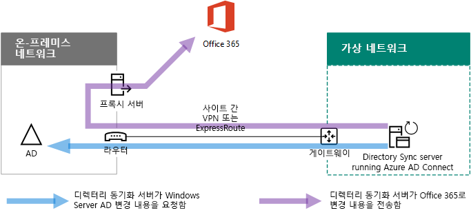
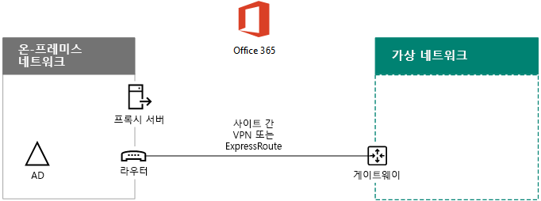

# Microsoft Azure에서 Office 365 디렉터리 동기화 배포

 **요약:** Azure 인프라 서비스의 가상 머신에 Azure AD Connect를 배포하여 온-프레미스 디렉터리 및 Office 365 구독의 Azure 테넌트 간에 계정을 동기화합니다.
  
Azure AD(Active Directory) Connect(이전 명칭은 디렉터리 동기화 도구 또는 DirSync.exe 도구)는 도메인에 가입한 서버에 설치하는 응용 프로그램으로, 온-프레미스 Active Directory Domain Services(AD DS) 사용자를 Office 365 구독의 Azure AD 테넌트에 동기화합니다. Office 365는 디렉터리 서비스를 위해 Azure AD(Active Directory)를 사용합니다. Office 365 구독은 Azure AD 테넌트를 포함합니다. 이 테넌트는 Azure의 기타 SaaS 응용 프로그램 및 앱을 포함한 기타 클라우드 워크로드로 조직의 ID를 관리하기 위해 사용될 수도 있습니다.

온-프레미스 서버에 Azure AD Connect를 설치할 수 있으며, 다음과 같은 이유로 Azure의 가상 머신에 설치할 수도 있습니다.
  
- 클라우드 기반 서비스를 더 빠르게 프로비저닝하고 구성하여 사용자가 서비스를 더 빠르게 사용하도록 할 수 있습니다.
- Azure에서는 더 적은 노력으로 더 나은 사이트 가용성을 제공합니다.
- 조직의 온-프레미스 서버 수를 줄일 수 있습니다.

이 솔루션을 사용하려면 온-프레미스 네트워크와 Azure Virtual Network가 연결되어 있어야 합니다. 자세한 내용은 [온-프레미스 네트워크를 Microsoft Azure Virtual Network에 연결](connect-an-on-premises-network-to-a-microsoft-azure-virtual-network.md)을 참조하세요. 
  
> [!NOTE]
> 이 문서는 단일 포리스트의 단일 도메인 동기화에 대해 설명합니다. Azure AD Connect는 Active Directory 포리스트의 모든 AD DS 도메인을 Office 365와 동기화합니다. Office 365와 동기화할 Active Directory 포리스트가 여러 개 있으면 [Single Sign-On과 다중 포리스트 디렉터리 동기화 시나리오](https://go.microsoft.com/fwlink/p/?LinkId=393091)를 참조하세요. 
  
## Azure에서 Office 365 디렉터리 동기화 배포 개요

다음 다이어그램에서는 온-프레미스 AD DS 포리스트를 Office 365 구독과 동기화하는 Azure의 가상 머신(디렉터리 동기화 서버)에서 실행되는 Azure AD Connect를 보여 줍니다.
  

  
다이어그램에는 사이트 간 VPN 또는 ExpressRoute 연결로 연결되는 2개의 네트워크가 있습니다. AD DS 도메인 컨트롤러가 있는 온-프레미스 네트워크가 있고, [Azure AD Connect](https://www.microsoft.com/download/details.aspx?id=47594)가 실행되는 가상 머신에 해당하는 디렉터리 동기화 서버를 포함하는 Azure Virtual Network가 있습니다. 디렉터리 동기화 서버에서 시작하는 다음과 같은 두 가지 주요 트래픽 흐름이 있습니다.
  
-  Azure AD Connect는 온-프레미스 네트워크의 도메인 컨트롤러에서 계정 및 암호 변경 내용을 쿼리합니다.
-  Azure AD Connect는 계정 및 암호 변경 내용을 Office 365 구독의 Azure AD 인스턴스로 보냅니다. 디렉터리 동기화 서버가 온-프레미스 네트워크의 확장된 영역에 있기 때문에 이러한 변경 내용은 온-프레미스 네트워크의 프록시 서버를 통해 전송됩니다.
    
> [!NOTE]
> 이 솔루션은 단일 포리스트의 단일 Active Directory 포리스트에서 단일 Active Directory 도메인의 동기화에 대해 설명합니다. Azure AD Connect는 Active Directory 포리스트의 모든 Active Directory 도메인을 Office 365와 동기화합니다. Office 365와 동기화할 Active Directory 포리스트가 여러 개 있으면 [Single Sign-On과 다중 포리스트 디렉터리 동기화 시나리오](https://go.microsoft.com/fwlink/p/?LinkId=393091)를 참조하세요. 
  
이 솔루션을 배포할 때는 다음과 같은 두 가지 주요 단계가 진행됩니다.
  
1. Azure Virtual Network를 만들고 온-프레미스 네트워크에 대한 사이트 간 VPN 연결을 설정합니다. 자세한 내용은 [온-프레미스 네트워크를 Microsoft Azure Virtual Network에 연결](connect-an-on-premises-network-to-a-microsoft-azure-virtual-network.md)을 참조하세요.
    
2. [Azure AD Connect](https://www.microsoft.com/download/details.aspx?id=47594)를 Azure의 도메인 가입 가상 머신에 설치한 후 온-프레미스 AD DS를 Office 365와 동기화합니다. 이 과정에서 다음 작업이 수행됩니다.
    
    Azure AD Connect를 실행할 Azure Virtual Machine 만들기
    
    [Azure AD Connect](https://www.microsoft.com/download/details.aspx?id=47594) 설치 및 구성
    
    Azure AD Connect를 구성하려면 Azure AD 관리자 계정 및 AD DS 엔터프라이즈 관리자 계정의 자격 증명(사용자 이름 및 암호)이 필요합니다. Azure AD Connect 즉시 실행되며 계속해서 온-프레미스 AD DS 포리스트를 Office 365와 동기화합니다.
    
이 솔루션을 프로덕션 환경에 배포하기 전에 [Office 365 개발/테스트 환경에 대한 디렉터리 동기화](dirsync-for-your-office-365-dev-test-environment.md)의 지침을 사용하여 이 구성을 개념 증명, 데모 또는 실험용으로 설정할 수 있습니다.
  
> [!IMPORTANT]
> Azure AD Connect 구성이 완료될 때 AD DS 엔터프라이즈 관리자 계정 자격 증명이 저장되지는 않습니다. 
  
> [!NOTE]
> 이 솔루션에서는 단일 AD DS 포리스트를 Office 365와 동기화하는 방법을 설명합니다. 이 문서에 나오는 토폴로지는 이 솔루션을 구현하는 방법 중 하나에 불과합니다. 조직의 토폴로지는 고유한 네트워크 요구 사항 및 보안 고려 사항에 따라 다를 수 있습니다. 
  
## Azure의 Office 365에 대한 디렉터리 동기화 서버 호스트 계획

### 필수 구성 요소

시작하기 전에 이 솔루션에 대한 다음 필수 구성 요소를 검토하세요.
  
- [Azure Virtual Network 계획](connect-an-on-premises-network-to-a-microsoft-azure-virtual-network.md#plan-your-azure-virtual-network)에서 관련 계획 콘텐츠를 검토하세요.
    
- Azure Virtual Network 구성을 위한 모든 [필수 구성 요소](connect-an-on-premises-network-to-a-microsoft-azure-virtual-network.md#prerequisites)가 충족되는지 확인합니다.
    
- Active Directory 통합 기능을 포함하는 Office 365 구독이 있어야 합니다. Office 365 구독에 대한 내용은 [Office 365 구독 페이지](https://products.office.com/compare-all-microsoft-office-products?tab=2)를 참조하세요.
    
- Azure AD Connect를 실행하여 온-프레미스 AD DS 포리스트를 Office 365와 동기화하는 하나의 Azure Virtual Machine을 프로비저닝합니다.
    
    AD DS 엔터프라이즈 관리자 계정 및 Azure AD 관리자 계정의 자격 증명(이름 및 암호)이 있어야 합니다.
    
### 솔루션 아키텍처 디자인 가정

다음 목록은 이 솔루션을 위한 디자인 선택 옵션에 대해 설명합니다.
  
- 이 솔루션은 사이트 간 VPN 연결을 사용하는 단일 Azure Virtual Network를 사용합니다. Azure Virtual Network는 Azure AD Connect를 실행하는 디렉터리 동기화 서버에 해당하는 하나의 서버가 포함된 단일 서브넷을 호스트합니다. 
    
- 온-프레미스 네트워크에 도메인 컨트롤러 및 DNS 서버가 존재합니다.
    
- Azure AD Connect는 Single Sign-On 대신 암호 해시 동기화를 수행합니다. AD FS(Active Directory Federation Services) 인프라를 배포할 필요는 없습니다. 암호 해시 동기화 및 Single Sign-On 옵션에 대한 자세한 내용은 [Azure Active Directory 하이브리드 ID 솔루션에 적합한 인증 방법 선택](http://aka.ms/auth-options)을 참조하세요.
    
작업 환경에서 이 솔루션을 배포할 때 다음을 비롯한 추가 디자인 선택 옵션을 고려할 수 있습니다.
  
- 기존 Azure Virtual Network에 기존 DNS 서버가 있는 경우 디렉터리 동기화 서버에서 이름 확인을 위해 온-프레미스 네트워크의 DNS 서버 대신, 기존 DNS 서버를 사용하도록 할지 여부를 결정합니다.
    
- 기존 Azure Virtual Network에 도메인 컨트롤러가 있는 경우 Active Directory 사이트 및 서비스를 구성하는 것이 더 나은 옵션인지 결정합니다. 디렉터리 동기화 서버는 온-프레미스 네트워크의 도메인 컨트롤러 대신, Azure Virtual Network의 도메인 컨트롤러에서 계정 및 암호 변경 내용을 쿼리할 수 있습니다.
    
## 배포 로드맵

Azure의 가상 머신에 Azure AD Connect를 배포하는 과정은 다음 세 단계로 구성됩니다.
  
- 1단계: Azure Virtual Network 만들기 및 구성
    
- 2단계: Azure Virtual Machine 만들기 및 구성
    
- 3단계: Azure AD Connect 설치 및 구성
    
배포 후 Office 365에서 새 사용자 계정에 위치 및 라이선스를 할당해야 합니다.

<!--  
> [!TIP]
> The [Directory Synchronization Server in Azure Deployment Kit](https://gallery.technet.microsoft.com/DirSync-Server-in-Azure-32cb2ded) has all of the Azure PowerShell blocks to build out this solution, the diagrams in Microsoft PowerPoint and Visio format, and a Microsoft Excel configuration workbook that generates Azure PowerShell command blocks customized for your settings.
-->
  
### 1단계: Azure Virtual Network 만들기 및 구성

Azure Virtual Network를 만들고 구성하려면 [ 온-프레미스 네트워크를 Microsoft Azure Virtual Network에 연결](connect-an-on-premises-network-to-a-microsoft-azure-virtual-network.md)의 배포 로드맵에서 [1단계: 온-프레미스 네트워크 준비](connect-an-on-premises-network-to-a-microsoft-azure-virtual-network.md#phase-1-prepare-your-on-premises-network) 및 [2단계: Azure에 프레미스 간 가상 네트워크 만들기](connect-an-on-premises-network-to-a-microsoft-azure-virtual-network.md#phase-2-create-the-cross-premises-virtual-network-in-azure)를 완료합니다.
  
구성 결과는 다음과 같습니다.
  

  
이 그림에서는 사이트 간 VPN 또는 ExpressRoute 연결을 통해 Azure Virtual Network에 연결된 온-프레미스를 보여줍니다.
  
### 2단계: Azure Virtual Machine 만들기 및 구성

[Azure Portal에서 첫 번째 Windows Virtual Machine 만들기](https://go.microsoft.com/fwlink/p/?LinkId=393098)의 지침에 따라 Azure에 가상 머신을 만듭니다.
  
- **기초** 창에서 사용자 가상 네트워크와 동일한 구독, 위치 및 리소스 그룹을 선택합니다. 사용자 이름과 암호를 안전한 위치에 기록합니다. 나중에 가상 컴퓨터에 연결하려면 이러한 정보가 필요합니다.
    
- **크기 선택** 창에서 **A2 표준** 크기를 선택합니다.
    
- **설정** 창의 **저장소** 섹션에서 **표준** 저장소 유형을 선택합니다. **네트워크** 섹션에서 디렉터리 동기화 서버를 호스트하기 위한 가상 네트워크 및 서브넷 이름을 선택합니다(GatewaySubnet 제외). 다른 설정은 기본값을 그대로 사용합니다.
    
내부 DNS를 확인하여 주소 (A) 레코드가 해당 IP 주소의 가상 머신에 대해 추가되었는지 검토함으로써 디렉터리 동기화 서버가 DNS를 올바르게 사용하고 있는지 확인합니다. 
  
[가상 머신에 연결 및 로그온](https://docs.microsoft.com/azure/virtual-machines/virtual-machines-windows-hero-tutorial?toc=%2fazure%2fvirtual-machines%2fwindows%2ftoc.json#connect-to-the-virtual-machine-and-sign-on)의 지침을 사용하여 원격 데스크톱 연결을 통해 디렉터리 동기화 서버에 연결합니다. 로그인한 후에 가상 머신을 온-프레미스 AD DS 도메인에 가입합니다.
  
Azure AD Connect가 인터넷 리소스에 액세스할 수 있게 하려면 온-프레미스 네트워크의 프록시 서버를 사용하도록 디렉터리 동기화 서버를 구성해야 합니다. 수행할 추가 구성 단계에 대해서는 네트워크 관리자에게 문의하세요.
  
구성 결과는 다음과 같습니다.
  

  
이 그림은 크로스-프레미스 Azure Virtual Network의 디렉터리 동기화 서버 가상 머신을 보여줍니다.
  
### 3단계: Azure AD Connect 설치 및 구성

다음 절차를 완료합니다.
  
1. 로컬 관리자 권한이 있는 AD DS 도메인 계정으로 원격 데스크톱 연결을 통해 디렉터리 동기화 서버에 연결합니다. [가상 머신에 연결 및 로그온](https://docs.microsoft.com/azure/virtual-machines/virtual-machines-windows-hero-tutorial?toc=%2fazure%2fvirtual-machines%2fwindows%2ftoc.json#connect-to-the-virtual-machine-and-sign-on)을 참조하세요.
    
2. 디렉터리 동기화 서버에서 [Office 365의 디렉터리 동기화 설정](set-up-directory-synchronization.md) 문서를 열고 암호 해시 동기화를 사용한 디렉터리 동기화에 대한 지침을 따릅니다.
    
> [!CAUTION]
> 설치 프로그램은 로컬 사용자 OU(조직 구성 단위)에 **AAD_xxxxxxxxxxxx** 계정을 만듭니다. 이 계정을 이동하거나 제거하면 안 됩니다. 이 경우 동기화가 실패합니다.
  
구성 결과는 다음과 같습니다.
  

  
이 그림은 크로스-프레미스 Azure Virtual Network에서 Azure AD Connect를 사용하는 디렉터리 동기화 서버를 보여줍니다.
  
### Office 365에서 사용자에게 위치 및 라이선스 할당

Azure AD Connect는 온-프레미스 AD DS에서 Office 365 구독에 계정을 추가하지만, 사용자가 Office 365에 로그인하고 해당 서비스를 사용하려면 계정의 위치 및 라이선스를 구성해야 합니다. 다음 단계에 따라 해당 사용자 계정에 대한 위치를 추가하고 라이선스를 활성화하세요.
  
1. [Office 365 포털 페이지](https://www.office.com)에 로그인한 다음 **관리자**를 클릭합니다.
    
2. 왼쪽 탐색에서 **사용자 > 활성화된 사용자**를 클릭합니다.
    
3. 사용자 계정 목록에서 정품 인증하려는 사용자 옆에 있는 확인란을 선택합니다.
    
4. 사용자 페이지에서 **제품 라이선스**에 대해 **편집**을 클릭합니다.
    
5. **제품 라이선스** 페이지에서 **위치**로 사용자의 위치를 선택한 다음, 사용자를 위한 적절한 라이선스를 사용하도록 설정합니다.
    
6. 완료되면 **저장**을 클릭한 다음 **닫기**를 두 번 클릭합니다.
    
7. 추가 사용자가 있으면 3단계로 돌아갑니다.
    
## 참고 항목

[클라우드 채택 및 하이브리드 솔루션](cloud-adoption-and-hybrid-solutions.md)
  
[온-프레미스 네트워크를 Microsoft Azure Virtual Network에 연결](connect-an-on-premises-network-to-a-microsoft-azure-virtual-network.md)

[Azure AD Connect 다운로드](https://www.microsoft.com/download/details.aspx?id=47594)
  
[Office 365의 디렉터리 동기화 설정](set-up-directory-synchronization.md)
  
<!--
[Directory Synchronization server in Azure Deployment Kit](https://gallery.technet.microsoft.com/DirSync-Server-in-Azure-32cb2ded)
-->

