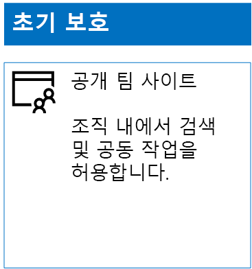
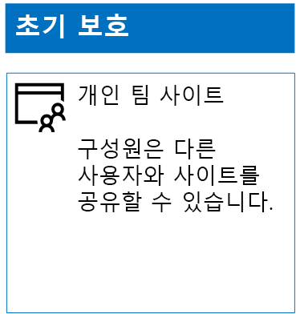
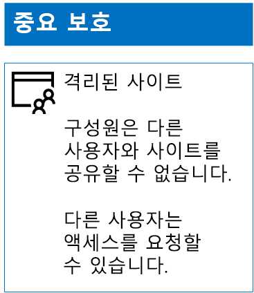
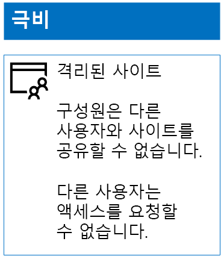

# 보호의 세 계층에 대 한 SharePoint Online 사이트 배포

 **요약:** 페이지를 만들고 다양 한 수준의 정보 보호에 대 한 SharePoint Online 팀 사이트를 구성 합니다.
  
이 문서의 단계를 사용하여 초기, 중요 및 극비 SharePoint Online 팀 사이트를 디자인하고 배포합니다. 이러한 3계층 보호에 대한 자세한 내용은 [SharePoint Online 사이트 및 파일 보호](secure-sharepoint-online-sites-and-files.md)를 참조하세요.
  
## 초기 SharePoint Online 팀 사이트

초기 보호에는 공용 및 개인 팀 사이트가 모두 포함됩니다. 공용 팀 사이트는 조직의 모든 사용자가 검색하고 액세스할 수 있습니다. 개인 사이트는 팀 사이트와 연결된 Office 365 그룹의 구성원만 검색하고 액세스할 수 있습니다. 이러한 유형의 팀 사이트 모두에서는 구성원이 다른 사용자와 사이트를 공유할 수 있습니다.
  
### Public

공용 액세스 및 권한이 있는 초기 SharePoint Online 팀 사이트를 만들려면 다음을 수행합니다.
  
1. SharePoint Online 팀 사이트 (SharePoint Online 관리자)를 관리 하는데 사용 되는 계정 사용 하 여 Office 365 포털에 로그인 합니다. 도움말을 보려면 [Office 365에 로그인 할 위치](https://support.office.com/Article/Where-to-sign-in-to-Office-365-e9eb7d51-5430-4929-91ab-6157c5a050b4)를 참조 하십시오.
    
2. 타일 목록에서 **SharePoint**를 클릭합니다.
    
3. 브라우저의 새 **SharePoint** 탭에서 **+ 사이트 만들기**를 클릭합니다.
    
4. **사이트 만들기** 페이지에서 **팀 사이트**를 클릭합니다.
    
5. **사이트 이름**에서 공용 팀 사이트의 이름을 입력합니다. 
    
6. **팀 사이트 설명**에서 사이트의 목적에 대한 설명을 입력합니다.
    
7. **개인 설정** **공용-이 사이트에 액세스할 수는 조직의 모든 사용자**를 선택 하 고 ****을 클릭 합니다.
    
8. **Who do you want to add?(누구를 추가하시겠습니까?)** 창에서 **마침**을 클릭합니다.
    
구성 결과는 다음과 같습니다.
  

  
### 개인

개인 액세스 및 권한이 있는 초기 SharePoint Online 팀 사이트를 만들려면 다음을 수행합니다.
  
1. SharePoint Online 팀 사이트 (SharePoint Online 관리자)를 관리 하는데 사용 되는 계정 사용 하 여 Office 365 포털에 로그인 합니다. 도움말을 보려면 [Office 365에 로그인 할 위치](https://support.office.com/Article/Where-to-sign-in-to-Office-365-e9eb7d51-5430-4929-91ab-6157c5a050b4)를 참조 하십시오.
    
2. 타일 목록에서 **SharePoint**를 클릭합니다.
    
3. 브라우저의 새 **SharePoint** 탭에서 **+ 사이트 만들기**를 클릭합니다.
    
4. **사이트 만들기** 페이지에서 **팀 사이트**를 클릭합니다.
    
5. **사이트 이름**에서 개인 팀 사이트의 이름을 입력합니다. 
    
6. **팀 사이트 설명** 에 사이트의 용도에 대 한 설명을 입력 합니다.
    
7. **개인정보 보호 설정**선택 **개인-이 사이트에 액세스할 수 있는 구성원만**, **다음**을 클릭 하 고 있습니다.
    
8. **누구를 추가하시겠습니까?** 창의 **구성원 추가**에서 이 개인 팀 사이트에 액세스할 수 있는 사용자 계정의 이름을 입력합니다.
    
9. 작업이 완료 되 면 **마침** 을 클릭 하는 사이트에 추가 된 구성원 초기 집합 추가 (영문)
    
구성 결과는 다음과 같습니다.
  

  
## 중요 SharePoint Online 팀 사이트

중요 SharePoint Online 팀 사이트는 격리된 팀 사이트이며, 팀 사이트와 연결된 Office 365 그룹의 구성원 자격 대신 SharePoint 그룹의 구성원 자격을 통해 권한이 제어됩니다.
  
격리 된 팀 사이트를 만들려면 두 가지 주요 단계가 있습니다.
  
### 1단계: 고립된 사이트 디자인

격리된 팀 사이트를 디자인하려면 다음을 결정해야 합니다.
  
- SharePoint 그룹 및 권한 수준
    
- SharePoint 그룹의 구성원 포함 될 액세스 그룹의 집합입니다.
    
     액세스 그룹의 권장 집합이 사이트 구성원에 대 한 하나, 사이트 뷰어에 대 한 표시 하 고 사이트 관리자를 위한 하나 있습니다.
    
- 액세스 그룹 내에서 중첩된 그룹을 사용할지 여부
    
예를 들어 권장되는 그룹 구조와 권한 수준은 다음과 같습니다.
  
|**SharePoint 그룹**|**권한 수준**|**액세스 그룹(예제)**|
|:-----|:-----|:-----|
|[사이트 이름] 구성원    |편집    |[사이트 이름] 구성원    |
|[사이트 이름] 방문자    |읽기    |[사이트 이름] 뷰어    |
|[사이트 이름] 소유자    |모든 권한    |[사이트 이름] 관리자    |
   
SharePoint 그룹 및 권한 수준은 기본적으로 팀 사이트에 대해 만들어집니다. 액세스 그룹의 이름을 결정해야 합니다.
  
디자인 프로세스에 대한 자세한 내용은 [격리된 SharePoint Online 팀 사이트 디자인](design-an-isolated-sharepoint-online-team-site.md)을 참조하세요.
  
### 2단계: 격리된 사이트 배포

격리된 사이트를 배포하려면 먼저 다음을 수행해야 합니다.
  
- 각 액세스 그룹에 추가할 사용자 계정 및 그룹을 결정합니다.
    
- 액세스 그룹을 만들고 사용자 및 그룹 구성원을 추가합니다.
    
자세한 단계는 [격리된 SharePoint Online 팀 사이트 배포](deploy-an-isolated-sharepoint-online-team-site.md)의 **1단계**를 참조하세요.
  
그런 다음 이러한 단계를 SharePoint Online 팀 사이트를 만듭니다.
  
1. SharePoint Online 팀 사이트 (SharePoint Online 관리자)를 관리 하는데 사용 되는 계정 사용 하 여 Office 365 포털에 로그인 합니다. 도움말을 보려면 [Office 365에 로그인 할 위치](https://support.office.com/Article/Where-to-sign-in-to-Office-365-e9eb7d51-5430-4929-91ab-6157c5a050b4)를 참조 하십시오.
    
2. 타일 목록에서 **SharePoint**를 클릭합니다.
    
3. 브라우저의 새 **SharePoint** 탭에서 **+ 사이트 만들기를**클릭 합니다.
    
4. **사이트 만들기** 페이지에서 **팀 사이트**를 클릭합니다.
    
5. **사이트 이름**에서 개인 팀 사이트의 이름을 입력합니다.
    
6. **팀 사이트 설명**대 한 선택적 설명을 입력 합니다.
    
7. **개인정보 보호 설정**선택 **개인-이 사이트에 액세스할 수 있는 구성원만**, **다음**을 클릭 하 고 있습니다.
    
8. **Who do you want to add?(누구를 추가하시겠습니까?)** 창에서 **마침**을 클릭합니다.
    
그리고 나서 새 SharePoint Online 팀 사이트에서 다음 단계를 사용하여 권한을 구성합니다.
  
1. 결정은 이름 UPN (사용자 계정) IT 관리자 또는 다른 사람에 대 한 응답 및 사이트에 대 한 액세스에 대 한 요청을 해결 하는 일을 담당 됩니다 (belindan@contoso.com은 UPN의 예). 쓰기 여기에 해당 UPN: ___ 합니다.
    
2. 도구 모음에서 설정 아이콘을 클릭 한 다음 **사이트 사용 권한**을 클릭 합니다.
    
3. **사이트 권한** 창에서 **고급 권한 설정**을 클릭합니다.
    
4. 브라우저의 새 **권한** 탭에서 **액세스 요청 설정**을 클릭합니다.
    
5. **액세스 요청 설정** 대화 상자에서 다음을 수행합니다.
    
  - **구성원이 사이트와 개별 파일 및 폴더를 공유할 수 있도록 허용합니다.** 및 **구성원이 다른 사용자들을 사이트 구성원 그룹에 초대할 수 있도록 허용합니다.** 확인란의 선택을 취소합니다.
    
  - **모든 액세스 요청 보내기**의 1단계에서 IT 관리자의 UPN을 입력합니다.
    
  - **확인**을 클릭합니다.
    
6. 브라우저의 **권한** 탭에서 목록의 **[사이트 이름] 구성원**을 클릭합니다.
    
7. **사용자 및 그룹에서** **새로 만들기**를 클릭 합니다.
    
8. **공유** 대화 상자에서이 사이트에 대 한 사이트 구성원 액세스 그룹의 이름을 입력을 선택한 다음 **공유**를 클릭 합니다.
    
9. 브라우저에서 뒤로 단추를 클릭합니다.
    
10. 목록에서 **[사이트 이름] 소유자** 를 클릭 합니다.
    
11. **사용자 및 그룹에서** **새로 만들기**를 클릭 합니다.
    
12. **공유** 대화 상자에서이 사이트에 대 한 사이트 관리자가 액세스 그룹의 이름을 입력을 선택한 다음 **공유**를 클릭 합니다.
    
13. 브라우저에서 뒤로 단추를 클릭합니다.
    
14. 목록에서 **[사이트 이름] 방문자** 를 클릭 합니다.
    
15. **사용자 및 그룹에서** **새로 만들기**를 클릭 합니다.
    
16. **공유** 대화 상자에서이 사이트에 대 한 사이트 뷰어 액세스 그룹의 이름을 입력을 선택한 다음 **공유**를 클릭 합니다.
    
17. 브라우저의 **권한** 탭을 닫습니다.
    
이러한 사용 권한 설정의 결과:
  
- **[사이트 이름] 소유자** SharePoint 그룹에는 모든 구성원이 **모든 권한** 권한 수준을 갖는 사이트 관리자 액세스 그룹이 포함되어 있습니다.
    
- **[사이트 이름] 구성원** SharePoint 그룹에는 모든 구성원이 **편집** 권한 수준을 갖는 사이트 구성원 액세스 그룹이 포함되어 있습니다.
    
- **[사이트 이름] 방문자** SharePoint 그룹에는 모든 구성원이 **읽기** 권한 수준을 갖는 사이트 뷰어 액세스 그룹이 포함되어 있습니다.
    
- 구성원이 다른 구성원을 초대하는 기능은 사용할 수 없습니다.
    
- 구성원이 아닌 사용자가 액세스를 요청하는 기능은 사용할 수 있습니다.
    
구성 결과는 다음과 같습니다.
  

  
사이트 구성원은 이제 액세스 그룹 중 하나의 그룹 구성원 자격을 통해 사이트의 리소스에서 안전하게 공동 작업할 수 있습니다.
  
## 극비 SharePoint Online 팀 사이트

극비 SharePoint Online 팀 사이트는 격리된 팀 사이트이며, 팀 사이트와 연결된 Office 365 그룹의 구성원 자격 대신 SharePoint 그룹의 구성원 자격을 통해 권한이 제어됩니다.
  
매우 중요한 기밀에 속하는 정보와 공동 작업을 위해 격리된 팀 사이트를 만들려면 다음 두 가지 주요 단계가 있습니다.
  
### 1단계: 고립된 사이트 디자인

격리된 팀 사이트를 디자인하려면 다음을 결정해야 합니다.
  
- SharePoint 그룹 및 권한 수준
    
- SharePoint 그룹의 구성원 포함 될 액세스 그룹의 집합입니다.
    
     액세스 그룹의 권장 집합이 사이트 구성원에 대 한 하나, 사이트 뷰어에 대 한 표시 하 고 사이트 관리자를 위한 하나 있습니다.
    
- 액세스 그룹 내에서 중첩된 그룹을 사용할지 여부
    
예를 들어 권장되는 그룹 구조와 권한 수준은 다음과 같습니다.
  
|**SharePoint 그룹**|**권한 수준**|**액세스 그룹(예제)**|
|:-----|:-----|:-----|
|[사이트 이름] 구성원    |편집    |[사이트 이름] 구성원    |
|[사이트 이름] 방문자    |읽기    |[사이트 이름] 뷰어    |
|[사이트 이름] 소유자    |모든 권한    |[사이트 이름] 관리자    |
   
SharePoint 그룹 및 권한 수준은 기본적으로 팀 사이트에 대해 만들어집니다. 액세스 그룹의 이름을 결정해야 합니다.
  
디자인 프로세스에 대한 자세한 내용은 [격리된 SharePoint Online 팀 사이트 디자인](design-an-isolated-sharepoint-online-team-site.md)을 참조하세요.
  
### 2단계: 격리된 사이트 배포

격리된 사이트를 배포하려면 먼저 다음을 수행해야 합니다.
  
- 각 액세스 그룹의 사용자 및 그룹 구성원을 결정
    
- 액세스 그룹을 만들고 사용자 및 그룹 구성원 추가
    
- 액세스 그룹을 사용 하는 격리 된 팀 사이트 만들기
    
자세한 단계는 [격리된 SharePoint Online 팀 사이트 배포](deploy-an-isolated-sharepoint-online-team-site.md)를 참조하세요.
  
결과의 사용 권한 설정 됩니다.
  
- **[사이트 이름] 소유자** SharePoint 그룹에는 모든 구성원이 **모든 권한** 권한 수준을 갖는 사이트 관리자 액세스 그룹이 포함되어 있습니다.
    
- **[사이트 이름] 구성원** SharePoint 그룹에는 모든 구성원이 **편집** 권한 수준을 갖는 사이트 구성원 액세스 그룹이 포함되어 있습니다.
    
- **[사이트 이름] 방문자** SharePoint 그룹에는 모든 구성원이 **읽기** 권한 수준을 갖는 사이트 뷰어 액세스 그룹이 포함되어 있습니다.
    
- 구성원이 다른 구성원을 초대하는 기능은 사용할 수 없습니다.
    
- 구성원이 아닌 사용자가 액세스를 요청하는 기능은 사용할 수 없습니다.
    
결과적으로 구성은 다음과 같습니다.
  

  
사이트 구성원은 이제 액세스 그룹 중 하나의 그룹 구성원 자격을 통해 사이트의 리소스에서 안전하게 공동 작업할 수 있습니다.
  
## 다음 단계

[Office 365 레이블 및 DLP 사용 하 여 SharePoint Online 파일 보호](protect-sharepoint-online-files-with-office-365-labels-and-dlp.md)
    
## 참고 항목

[SharePoint Online 사이트 및 파일 보호](secure-sharepoint-online-sites-and-files.md)
  
[개발/테스트 환경의 SharePoint Online 사이트 보호](secure-sharepoint-online-sites-in-a-dev-test-environment.md)
  
[정치적 캠페인, 비영리 조직 및 기타 기밀 조직에 대한 Microsoft 보안 지침](microsoft-security-guidance-for-political-campaigns-nonprofits-and-other-agile-o.md)
  
[클라우드 채택 및 하이브리드 솔루션](cloud-adoption-and-hybrid-solutions.md)

