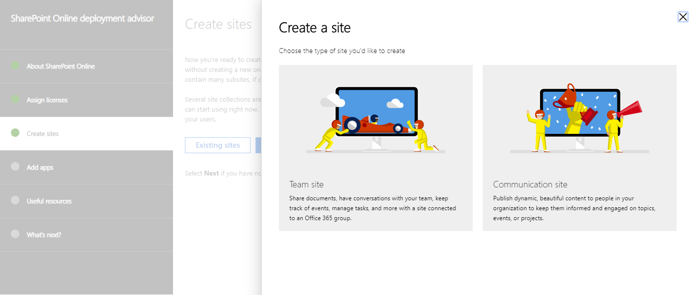
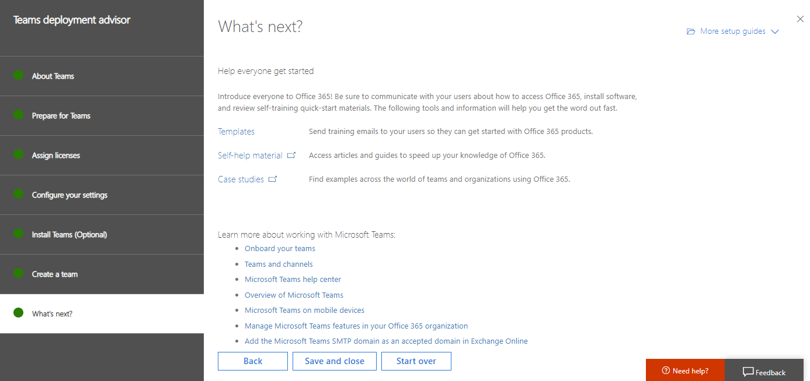

# Office 365 또는 Microsoft 365 서비스에 대 한 배포 관리자Deployment advisors for Office 365 or Microsoft 365 services

Office 365 또는 Microsoft 365에 대 한 배포 관리자는 조직에 대 한 Office 365 설정을 위한 자가 안내가 제공 됩니다.The deployment advisors for Office 365 or Microsoft 365 provide self-guided support for setting up Office 365 for your organization. 액세스 하려면 다음을 수행 합니다.To access them:

1. [Microsoft 365 관리 센터](https://admin.microsoft.com)에서 테 넌 트 관리자로 로그인 합니다.Sign in as a tenant administrator in the [Microsoft 365 admin center](https://admin.microsoft.com).
2. 아래 나열 된 배포 관리자 또는 가이드 중 하나를 선택 합니다.Select one of the deployment advisors or guides listed below.

테 넌 트 관리자로 로그인 하지 않으면 나중에 테 넌 트 관리자 권한이 필요한 메시지가 표시 됩니다.If you don't sign in as a tenant admin, you will eventually see a message that you need to have tenant administrator permissions.

각 관리자는 배포할 기능 및 옵션을 선택 하는 과정을 안내 하는 마법사입니다.Each advisor is a wizard that guides you through your choices for the features and options you want to deploy. 일부 경우에는 마법사를 사용 하 여 항목을 구성 하거나 설정을 활성화할 수 있습니다.In some cases, you can use the wizard to configure something or activate a setting. 예제는 다음과 같습니다.Here is an example.

관리자는 필요에 따라 사용자 지정할 수 있는 사항을 결정 하는 단계를 안내 합니다.The advisor steps you through decisions for customization to your needs. 이렇게 하면 구성을 변경 하는 데 필요한 지침, 스크립트 및 기타 리소스를 얻을 수 있습니다.Along the way, you'll get instructions, scripts, and other resources to make the configuration changes.

마지막으로 비디오 및 참조 문서에 대 한 링크를 볼 수 있습니다.At the end, you'll get links to videos and reference articles. 예제는 다음과 같습니다.Here is an example.

이러한 관리자를 언제 든 지 사용 하 여 Office 365 기능 및 옵션에 대해 자세히 알아볼 수 있습니다.You can use these advisors anytime to learn more about Office 365 features and options. 여기에는 계획 중 또는 서비스를 이미 설정한 후에 포함 됩니다.This includes during planning or after you've already set up the services.
  
## Microsoft 365: Windows 10 with Office 365Microsoft 365: Windows 10 with Office 365

Microsoft 365는 Office 365, Windows 10 및 EMS (Enterprise Mobility + Security)를 포함 하는 완전 한 지능형 솔루션입니다.Microsoft 365 is a complete, intelligent solution that includes Office 365, Windows 10, and Enterprise Mobility + Security (EMS). Microsoft 365는 모든 사용자가 창의적인 작업을 수행 하 고 안전 하 게 함께 작업할 수 있도록 합니다.Microsoft 365 empowers everyone to be creative and work together, securely. 

이 관리자를 사용 하 여 Windows 10 장치를 설정 하거나, Office 앱, Windows Analytics 및 Windows Defender Advanced Threat Protection (ATP)의 선택적 배포를 사용 하 여 사용자 컴퓨터를 Windows 10으로 업그레이드할 수 있습니다 (Microsoft 365 Enterprise E5 요금제에만 해당).Use this advisor to set up Windows 10 devices or upgrade users' computers to Windows 10, with optional deployment of Office apps, Windows Analytics, and Windows Defender Advanced Threat Protection (ATP) (Microsoft 365 Enterprise E5 plan only).

|||
|:-------|:-----|
| **실행****Run:** | [Microsoft 365 배포 관리자Microsoft 365 deployment advisor](https://aka.ms/microsoft365setupguide) |
|||

## Office 365 환경 준비Prepare your Office 365 environment 

도메인을 추가 하 고, 사용자를 만들고, 라이선스를 적절 한 순서로 할당 하도록 배포 목표를 확인 해야 합니다.You'll need to tell us your deployment goals to make sure you add domains, create users, and assign licenses in the proper order. 

|||
|:-------|:-----|
| **실행****Run:** | [환경 준비 가이드Prepare your environment guide](https://go.microsoft.com/fwlink/?linkid=2005213) |
| **조사식****Watch:** | [작업 환경 준비Prepare your environment](https://go.microsoft.com/fwlink/?linkid=2043822) |
||||

### Verify your domainVerify your domain

사용자의 도메인 이름 (웹 사이트 이름이 라고도 함)을 추가 하 여 Office 365를 사용자 지정 해야 합니다.You need to customize Office 365 by adding your own domain name (also known as your website name).

|||
|:-------|:-----|
| **실행****Run:** |  [Office 365 advisor에서 도메인 확인Verify your domain in Office 365 advisor](https://aka.ms/verifyyourdomaino365) |
|||

<!--
+++++++++++++++++++++++++++++++++++++++++++++++++++++++++++++++

OLD SECTION

The deployment advisors for Office 365 provide self-guided support for setting up Office 365 for your organization. To access them for your Office 365 or Microsoft 365 subscription:

1. Sign in as a tenant administrator in the [Microsoft 365 admin center](https://admin.microsoft.com).
2. Select one of the deployment advisors or guides listed in this article.

>[!Note]
>If you do not sign in as a tenant admin, you will eventually see a message that you need to have tenant administrator permissions.
>

Within each advisor, select the features and options you want to deploy. Here is an example.

The advisor builds a step-by-step setup plan that's customized to your needs. Along the way, you'll get a full set of instructions, scripts, and other resources to make the configuration changes.

At the end, you'll get links to videos and reference articles. Here is an example.

Some advisors have automation that will change some of your settings, while in other areas of the advisor you change your settings and data, using the advisor to guide you. 

You can use these advisors anytime to learn more about Office 365 features and options. This includes during planning or after you've already set up the services.
  
## Microsoft 365: Windows 10 with Office 365

Microsoft 365 is a complete, intelligent solution that includes Office 365, Windows 10, and Enterprise Mobility + Security (EMS). Microsoft 365 empowers everyone to be creative and work together, securely. 

Use this advisor to set up Windows 10 devices or upgrade users' computers to Windows 10, with optional deployment of Office apps, Windows Analytics, and Windows Defender Advanced Threat Protection (Microsoft 365 Enterprise E5 plan only).

|||
|:-------|:-----|
| **Run:** | Run the [Microsoft 365 deployment advisor](https://aka.ms/microsoft365setupguide) |
|||

## Prepare your Office 365 environment 

You'll need to tell us your deployment goals to make sure you add domains, create users, and assign licenses in the proper order. 

Watch the [Prepare your environment](https://go.microsoft.com/fwlink/?linkid=2043822) video for an overview.

|||
|:-------|:-----|
| **Run:** | Run the [Prepare your environment guide](https://go.microsoft.com/fwlink/?linkid=2005213) |
|||

+++++++++++++++++++++++++++++++++++++++++++++++++++++++++++++++
-->

## 전자 메일 마이그레이션 및 보호Email migration and protection

### Exchange 마이그레이션 관리자Exchange migration advisor

자동 도구 및 단계별 지침을 포함 하 여 현재 메일 시스템에서 Office 365의 Exchange Online으로 사서함을 이동 해야 합니다.You'll need to you move mailboxes from your current mail system to Exchange Online in Office 365 with automated tools and step-by-step guidance. 현재 메일 시스템, 마이그레이션할 사서함 수, 사용자 및 사용자 액세스 관리를 계획 하는 방법에 따라 조직에 가장 적합 한 마이그레이션 경로를 사용 하는 것이 좋습니다.We'll recommend the best migration path for your organization based on your current mail system, the number of mailboxes you want to migrate, and how you plan to manage users and user access.

|||
|:-------|:-----|
| **실행****Run:** | [Office 365 메일 마이그레이션 관리자Office 365 mail migration advisor](https://aka.ms/office365setup) |
| **조사식****Watch:** | [작업 환경 준비Prepare your environment](https://go.microsoft.com/fwlink/?linkid=2043822)   [IOS 용 Outlook 소개 및 설정Outlook for iOS introduction and setup](https://aka.ms/mpuwwm)   [Android 용 Outlook 소개 및 설정Outlook for Android introduction and setup](https://aka.ms/qrbfm3)   [Windows Phone 소개 및 설정에 대 한 OutlookOutlook for Windows Phone introduction and setup](https://aka.ms/kkw96x) |
|||
  
Gmail이 있는 경우 Gmail 연락처 및 Google 일정 항목을 Office 365로 마이그레이션해야 합니다.If you have Gmail, you'll need to migrate your Gmail contacts and Google Calendar items to Office 365. 사용자의 Gmail 사서함을 Office 365로 마이그레이션하는 경우 전자 메일 메시지가 마이그레이션되고 연락처 및 일정 항목은 마이그레이션되지 않습니다.When you migrate a user's Gmail mailbox to Office 365, email messages are migrated, but contacts and calendar items are not. 이 가이드에서는 Gmail 연락처 및 Google 일정 항목을 Office 365로 가져오는 단계를 제공 합니다.This guide provides the steps for importing Gmail contacts and Google Calendar items to Office 365.

|||
|:-------|:-----|
| **실행****Run:** |  [Gmail 연락처 및 일정 도우미Gmail contacts and calendar assistant](https://aka.ms/gmailcontactscalendar)   |
|||

## 파일 만들기, 저장 및 공유File creation, storage, and sharing

### Office 365 ProPlusOffice 365 ProPlus

Office 365 ProPlus에서는 사용자를 최신 버전의 Office에서 실행 하 고 업데이트 상태로 유지 합니다.Office 365 ProPlus gets your users up and running on the latest versions of Office and keeps them updated.

Office를 시작 하는 방법에 대 한 팁을 포함 하 여 PC 또는 회사의 Mac에 Office를 설치 하는 단계는이 가이드를 참조 하세요.See this guide for the steps to install Office on either a PC or a Mac for your company, including tips for getting everyone started with Office.

|||
|:-------|:-----|
| **실행****Run:** |  [Office 365 ProPlus 빠른 시작 가이드Office 365 ProPlus quick start guide](https://aka.ms/OPPquickstartguide)   |
|||

Office 365 ProPlus 배포 관리자는 사용자가 office 365 portal에서 직접 office 365 ProPlus를 설치 하거나 온-프레미스 위치에서 사용자에 게 Office 365 ProPlus를 배포 하는 데 도움이 되는 단계를 안내 합니다.The Office 365 ProPlus deployment advisor walks through the steps for helping users install Office 365 ProPlus directly from the Office 365 portal online or for deploying Office 365 ProPlus to your users from an on-premises location. System Center Configuration Manager, 그룹 정책 시작 스크립트, 운영 체제 디스크 이미지 또는 RDS (원격 데스크톱 서비스) 공유 활성화를 사용 하는 방법에 대 한 지침이 포함 되어 있습니다.Included are instructions for using System Center Configuration Manager, a Group Policy startup script, an operating system disk image, or Remote Desktop Services (RDS) shared activation.

|||
|:-------|:-----|
| **실행****Run:** | [Office 365 ProPlus 배포 관리자Office 365 ProPlus deployment advisor ](https://aka.ms/o365proplusdeploy) | 
| **조사식****Watch:** | [Office experience (구독 서비스)Office experience as a subscription service](https://aka.ms/qo45jf)   [Office 365 ProPlus 개요Overview of Office 365 ProPlus](https://aka.ms/r359zr) | 
|||

  

### 비즈니스용 OneDriveOneDrive for Business

비즈니스용 OneDrive에서 파일 저장, 공유 및 동기화를 빠르게 시작 하려면이 가이드를 사용 합니다.To get started quickly with OneDrive for Business for file storage, sharing, and syncing, use this guide.

|||
|:-------|:-----|
| **실행****Run:** | [Office 365 ProPlus 배포 관리자Office 365 ProPlus deployment advisor ](https://aka.ms/o365proplusdeploy) | 
| **조사식****Watch:** | [비즈니스용 OneDrive 통합 장점OneDrive for Business Integrated Advantage](https://aka.ms/f66hqa)   [OneDrive 시작: 다른 클라우드 저장소 공급자 로부터 온Welcome to OneDrive: Coming from another cloud storage provider](https://videoplayercdn.osi.office.net/embed/6b11f30b-725a-4145-8b72-45a41793a432) | 
|||

### SharePoint OnlineSharePoint Online
  
마이그레이션할 데이터 양이 많거나 온-프레미스 SharePoint 서버가 하이브리드 설치에서 계속 실행 되는 경우에는이 가이드를 참조 하 여 SharePoint Online에서 문서 저장 및 콘텐츠 관리를 설정 합니다.If you don't have a large amount of data to migrate or an on-premises SharePoint Server that you want to continue running in a hybrid setup, see this guide to set up SharePoint Online for document storage and content management.

|||
|:-------|:-----|
| **실행****Run:** |[SharePoint Online 빠른 시작SharePoint Online quick start](https://aka.ms/SPOquickstartguide) |
|||

  
조직에 가장 적합 한 배포 옵션을 선택 하 고 비즈니스 요구 사항에 맞게 SharePoint Online 기능을 구성 하는 단계를 진행 해야 합니다.You'll need to choose the deployment option that works best for your organization and go through the steps for configuring SharePoint Online features to meet your business needs. 클라우드 배포, 하이브리드 배포 또는 온-프레미스 마이그레이션에서 선택 합니다.Choose from cloud deployment, hybrid deployment, or on-premises-to-cloud migration. 그런 다음 파일 저장 및 공유, 외부 파일 공유, 사이트 모음, 전역 설정, 사용자 프로필 및 Office 365 팀 사이트와 같은 SharePoint Online 기능을 구성 하기 위한 단계를 수행 합니다.You'll then follow the steps for configuring SharePoint Online features, like file storage and sharing, external file sharing, site collections, global settings, and user profiles, and your Office 365 team site.

|||
|:-------|:-----|
| **실행****Run:** | [SharePoint Online 배포 관리자SharePoint Online deployment advisor](https://aka.ms/spoguidance) |
| **조사식****Watch:** | [SharePoint: 개요SharePoint: Overview](https://go.microsoft.com/fwlink/?linkid=2005315)   [SharePoint: 하이브리드SharePoint: Hybrid](https://go.microsoft.com/fwlink/?linkid=2005219)   [SharePoint: 문제 해결SharePoint: Troubleshooting](https://go.microsoft.com/fwlink/?linkid=2005220) |
|||

## 보안 및 IdSecurity and Identity

### Azure Active Directory Connect를 사용한 하이브리드 id (Azure AD Connect)Hybrid identity with Azure Active Directory Connect (Azure AD Connect)

Azure AD Connect advisor에서는 각 사용자를 수동으로 만들지 않고 Office 365에 사용자 계정 정보를 추가 하는 방법을 보여 줍니다.The Azure AD Connect advisor shows you how to add user account information to Office 365 without manually creating each user. 또한 사용자가 동일한 암호를 사용 하 여 전자 메일 및 도메인에 로그인 할 수 있도록 암호 해시 동기화 또는 통과 인증을 구성 하는 방법도 보여 줍니다.It also shows you how to configure password hash synchronization or pass-through authentication, so users can sign into their email and your domain using the same password. 

AD FS (Active Directory Federation Services)와 함께 페더레이션 로그인을 설정 하도록 선택 하는 경우이 가이드에서는 새 서버 또는 기존 Windows Server 2012 R2 팜에 AD FS를 배포 하기 위한 단계도 제공 합니다.If you choose to set up federated sign-in with Active Directory Federation Services (AD FS), this guide also gives you steps for deploying AD FS on a new server or in an existing Windows Server 2012 R2 farm. 

|||
|:-------|:-----|
| **실행****Run:** |  [Azure AD Connect advisorAzure AD Connect advisor](https://aka.ms/aadconnectpwsync) |
|||
  

>[!Note]
>Azure AD Connect는 DirSync 및 Azure AD Sync와 같은 이전 버전의 id 통합 도구를 대체 하며, 기본적으로 사용자 및 기타 데이터를 Office 365의 Azure AD에 추가 하는 데 사용 됩니다.Azure AD Connect replaces older versions of identity integration tools, such as DirSync and Azure AD Sync, and is primarily used for adding users and other data to Azure AD for Office 365.
>

### Azure ADAzure AD

그룹 기반 액세스 관리, 클라우드 응용 프로그램에 대 한 셀프 서비스 암호 재설정 및 온-프레미스 웹 응용 프로그램 게시용 Azure AD 응용 프로그램 프록시와 같은 기능을 설정 하려면이 설정 가이드를 사용 합니다.To set up features, like group-based access management, self-service password reset for cloud applications, and Azure AD Application Proxy for publishing on-premises web applications, use this set up guide.
  
|||
|:-------|:-----|
| **실행****Run:** |  [Azure AD 기본 설정 가이드Azure AD Basic setup guide](https://aka.ms/azureadbasic) |
|||

다단계 인증, SSO (single sign-on), 장치 등록, 셀프 서비스 암호 및 그룹 관리, 보안 모니터링과 같은 id 관리 기능을 제공 하는 Azure AD Premium의 다양 한 기능을 사용 하도록 설정 하려면이 가이드를 사용 합니다. .To enable the many features of Azure AD Premium, which provides identity management capabilities like multi-factor authentication, single sign-on (SSO), device registration, self-service password and group management, and security monitoring, use this guide.
  
|||
|:-------|:-----|
| **실행****Run:** |  [Azure AD Premium 설정 가이드Azure AD Premium setup guide](https://aka.ms/aadpguidance) |
|||

### Exchange Online ProtectionExchange Online Protection
Microsoft EOP (Exchange Online Protection)는 스팸 및 맬웨어로부터 조직을 보호 하 고 메시징 정책 위반 으로부터 조직을 보호 하는 기능을 포함 하는 클라우드 기반 전자 메일 필터링 서비스입니다.Microsoft Exchange Online Protection (EOP) is a cloud-based email filtering service that helps protect your organization against spam and malware and includes features to safeguard your organization from messaging policy violations.

|||
|:-------|:-----|
| **실행****Run:** |  [EOP (Exchange Online Protection) 설정 가이드Exchange Online Protection (EOP) setup guide](https://aka.ms/EOPguidance) |
|||
  
## 통신 및 온라인 회의Communication and online conferencing

### Office 365 그룹Office 365 Groups

Office 365 그룹은 전자 메일, 대화, 파일 및 이벤트에 대 한 공유 작업 영역으로, 그룹 구성원이 집합적으로 작업을 수행할 수 있습니다.Office 365 Groups are a shared workspace for email, conversations, files, and events where group members can collectively get stuff done. Office 365의 그룹을 사용 하면 공동 작업을 하려는 사용자 집합을 선택 하 고 해당 사용자가 공유할 리소스 모음을 쉽게 설정할 수 있습니다.Groups in Office 365 lets you choose a set of people that you wish to collaborate with and easily set up a collection of resources for those people to share. 그룹에 구성원을 추가 하면 사용자가 그룹에서 제공 하는 도구에 필요한 사용 권한을 자동으로 부여 하므로 이러한 모든 리소스에 사용 권한을 수동으로 할당 하는 것에 대해 걱정할 필요가 없습니다.You don't have to worry about manually assigning permissions to all those resources, because adding members to the group automatically gives them the permissions they need to the tools your group provides.

|||
|:-------|:-----|
| **실행****Run:** |[Office 365 그룹 설정 가이드Office 365 Groups setup guide](https://aka.ms/groupsguide) |
|||
  
### Microsoft TeamsMicrosoft Teams

Microsoft 팀은 채팅, 통화, 모임 및 개인 메시지에 대 한 팀 작업 영역을 제공 하는 Office 365의 채팅 기반 공동 작업 서비스입니다.Microsoft Teams is the chat-based collaboration service in Office 365 that provides team workspaces for chats, calls, meetings, and private messages. 팀의 배포 관리자는 Exchange Online, SharePoint Online, 비즈니스용 OneDrive 및 Office 365 그룹에서 최적의 팀 환경을 설정 및 구성 하는 데 도움이 됩니다.The deployment advisor for Teams helps you set up and configure the optimal Teams experience with Exchange Online, SharePoint Online, OneDrive for Business, and Office 365 Groups. 여기에는 타사 서비스에 대 한 테 넌 트 설정, 프로젝트, 통화 및 모임, 메시징, 앱에 대 한 빠른 액세스를 위한 탭, 정보 Bot 및 커넥터에 대 한 정보가 포함 되어 있습니다.It includes information about configuring tenant settings, Teams and Channels for your projects, Calls and Meetings, Messaging, Tabs for quick access to apps, informational Bots, and Connectors to third-party services.

|||
|:-------|:-----|
| **실행****Run:** | [팀 배포 관리자Teams deployment advisor](https://aka.ms/teamsguidance) |
| **조사식****Watch:** | [팀 시작Getting started with Teams](https://youtu.be/ENEQzM2u_vA)|
||||

### 비즈니스용 SkypeSkype for Business

IM (인스턴트 메시징), 현재 상태, 온라인 모임 및 화면 공유를 위해 비즈니스용 Skype를 빠르게 사용 하려면 고급 기능이 필요 하지 않은 경우이 기본 설치를 수행 하는 것이 좋습니다.To get going fast with Skype for Business for instant messaging (IM), presence, online meetings, and screen sharing, this basic setup is all you need if you don't need advanced features.

|||
|:-------|:-----|
| **실행****Run:** | [비즈니스용 Skype 빠른 시작 가이드Skype for Business quick start guide](https://aka.ms/SfBquickstartguide) |
|||
  
보다 자세한 지원 하기 위해 비즈니스용 Skype 배포 관리자는 비즈니스용 Skype Online을 시작 하 고 실행 하는 데 도움이 됩니다.For more in-depth assistance, the Skype for Business deployment advisor helps you get up and running with Skype for Business Online. 이 관리자는 IM (인스턴트 메시징), 온라인 모임, 비디오 회의, 공중 전화망 (PSTN) 회의, PBX (cloud 사설 브랜드 교환) 및 Skype 모임 브로드캐스트와 같은 비즈니스용 Skype 기능을 설정 하는 방법을 보여 줍니다.This advisor shows you how to set up Skype for Business features, like instant messaging (IM), online meetings, video conferencing, public switched telephone network (PSTN) conferencing, cloud private brand exchange (PBX), and Skype Meeting Broadcast. 이 단계에는 비즈니스용 Skype Online을 온-프레미스 비즈니스용 Skype 배포에 연결 하는 하이브리드 환경 설정이 포함 됩니다.Steps include setting up a hybrid environment, where you connect Skype for Business Online to your on-premises Skype for Business deployment.

|||
|:-------|:-----|
| **실행****Run:** |  [비즈니스용 Skype 배포 관리자Skype for Business deployment advisor](https://aka.ms/skypeguidance) |
| **조사식****Watch:** |  [비즈니스용 Skype 지원 빠른 시작Skype for Business Enablement quick start](https://aka.ms/cjfutd)   [Skype 시작 하기Getting started with Skype](https://aka.ms/ofg77x) |
|||

  
### YammerYammer

통합 하거나 마이그레이션할 기존 Yammer 네트워크가 없는 경우에는이 기본 설정 가이드에서 조직의 Yammer를 성공적으로 배포 해야 합니다.If you don't have existing Yammer networks to consolidate or migrate, this basic setup guide is all you need to successfully roll out Yammer in your organization.

|||
|:-------|:-----|
| **실행****Run:** |  [Yammer 빠른 시작 가이드Yammer quick start guide](https://aka.ms/yamquickstartguide) |
|||
  
Yammer Enterprise 설정 가이드를 사용 하면 Yammer Enterprise를 사용 하 여 조직을 구성 하 고 실행할 수 있습니다.The Yammer Enterprise setup guide helps you get your organization up and running with Yammer Enterprise. 여기에는 기존 Yammer 네트워크를 Office 365에 연결 하거나 새 Yammer 도메인을 설정 하는 방법에 대 한 지침이 포함 되어 있습니다.It includes guidance on connecting existing Yammer networks you might have to Office 365 or setting up a new Yammer domain. Yammer 네트워크가 여러 개 있는 경우 Yammer 네트워크를 단일 Yammer Enterprise 네트워크로 통합 하는 방법에 대해서도 설명 합니다.If you have multiple Yammer networks, it also describes how to consolidate Yammer networks into a single Yammer Enterprise network.

|||
|:-------|:-----|
| **실행****Run:** |  [Yammer Enterprise 설정 가이드Yammer Enterprise setup guide](https://aka.ms/yammerdeploy) |
|||
  
## StaffHubStaffHub

Microsoft StaffHub는 모든 장치에서 작동 하는 클라우드 기반 플랫폼입니다.Microsoft StaffHub is a cloud-based platform that works across all your devices. 이를 통해 firstline worker (컴퓨터를 사용 하지 않아도 되는 역할이 있는 직원)와 관리자가 이동 일정을 관리 하 고 팀과 의견을 교환 하 고 콘텐츠를 공유할 수 있습니다.It enables firstline workers (employees with roles that don't require a computer) and their managers to manage shift schedules, communicate with their teams, and share content.

|||
|:-------|:-----|
| **실행****Run:** |  [Microsoft StaffHub 설정 가이드Microsoft StaffHub setup guide](https://aka.ms/staffhubguide) |
|||

  
## 추가 비디오Additional videos

### Microsoft 365 관리 센터Microsoft 365 admin center

- [관리 센터 방향Admin center orientation](https://www.microsoft.com/en-us/videoplayer/embed/RWfMut)

- [관리 센터에서 사용자 만들기Create users in the Admin center](https://aka.ms/ac-createusers)

- [DNS 레코드 및 관리 센터DNS records and the Admin center](https://aka.ms/ac-dnsrecords)

- [관리 센터에서 도메인 확인Verify your domain in the Admin center](https://aka.ms/ac-verifydns)

### 장치 보안Device security

- [IntuneIntune](https://go.microsoft.com/fwlink/?linkid=2054124)

