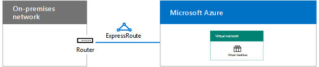
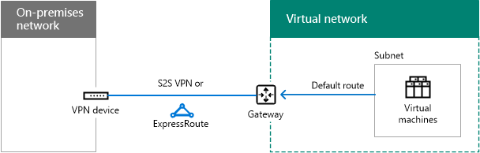

# Microsoft Azure IaaS에 대한 네트워킹 디자인Designing networking for Microsoft Azure IaaS

 **요약:** Microsoft Azure IaaS에서 작업을 위해 최적화 된 네트워킹을 디자인 하는 방법을 이해 합니다.**Summary:** Understand how to design optimized networking for workloads in Microsoft Azure IaaS.
  
네트워킹 최적화 azure IaaS에서 호스트 되는 작업에 대해 azure virtual network (vnet), 주소 공간, 라우팅, DNS 및 부하 분산을 이해 해야 합니다.Optimizing networking for IT workloads hosted in Azure IaaS requires an understanding of Azure virtual networks (VNets), address spaces, routing, DNS, and load balancing.
  
## VNet에 대 한 단계 계획Planning steps for any VNet

모든 유형의 VNet에 대해 다음 단계를 수행 합니다.Follow these steps for any type of VNet.
  
### 1 단계: 인트라넷에서 Microsoft 클라우드 서비스를 준비 합니다.Step 1: Prepare your intranet for Microsoft cloud services.

[microsoft 클라우드 연결의 공통 요소](common-elements-of-microsoft-cloud-connectivity.md)에 있는 **microsoft 클라우드 서비스용 네트워크 섹션을 준비 하는 단계** 를 진행 합니다.Go through the **Steps to prepare your network for Microsoft cloud services** section in [Common elements of Microsoft cloud connectivity](common-elements-of-microsoft-cloud-connectivity.md).
  
### 2 단계: 인터넷 대역폭을 최적화 합니다.Step 2: Optimize your Internet bandwidth.

[microsoft saas에 대 한 네트워킹 디자인](designing-networking-for-microsoft-saas.md)에서 **microsoft saas 서비스용 네트워크 준비** 섹션의 단계 2-4을 사용 하 여 인터넷 대역폭을 최적화 합니다.Optimize your Internet bandwidth using steps 2 - 4 of the **Steps to prepare your network for Microsoft SaaS services** section in [Designing networking for Microsoft SaaS](designing-networking-for-microsoft-saas.md).
  
### 3 단계: VNet 유형 (클라우드 전용 또는 크로스-프레미스)을 확인 합니다.Step 3: Determine the type of VNet (cloud-only or cross-premises).

클라우드 전용 VNet은 온-프레미스 네트워크에 연결 되지 않습니다.A cloud-only VNet has no connection to an on-premises network. 예제는 다음과 같습니다.Here is an example.
  
**그림 1: 클라우드 전용 VNet****Figure 1: A cloud-only VNet**

  
그림 1은 클라우드 전용 VNet에 있는 가상 컴퓨터 집합을 보여 줍니다.Figure 1 shows a set of virtual machines in a cloud-only VNet.
  
크로스-프레미스 VNet에는 Azure 게이트웨이를 통한 온-프레미스 네트워크에 대 한 S2S (사이트 간) VPN 또는 express 간 연결이 있습니다.A cross-premises VNet has a site-to-site (S2S) VPN or ExpressRoute connection to an on-premises network through an Azure gateway. 예제는 다음과 같습니다.Here is an example.
  
**그림 2: 크로스-프레미스 VNet****Figure 2: A cross-premises VNet**

  
그림 2에서는 온-프레미스 네트워크에 연결 된 크로스-프레미스 VNet의 가상 컴퓨터 집합을 보여 줍니다.Figure 2 shows a set of virtual machines in a cross-premises VNet, which is connected to an on-premises network.
  
이 문서에 있는 [크로스-프레미스 VNet에 대 한 추가 계획 단계](designing-networking-for-microsoft-azure-iaas.md#cross_prem) 를 참조 하세요.See the additional [Planning steps for a cross-premises VNet](designing-networking-for-microsoft-azure-iaas.md#cross_prem) section in this article.
  
### 4 단계: VNet의 주소 공간을 확인 합니다.Step 4: Determine the address space of the VNet.

표 1에는 다양 한 유형의 vnet에 대 한 주소 공간이 나와 있습니다.Table 1 shows the address spaces for the different types of VNets.
  
|**VNet 유형****Type of VNet**|**가상 네트워크 주소 공간****Virtual network address space**|
|:-----|:-----|
|클라우드 전용Cloud-only    |임의의 개인 주소 공간Arbitrary private address space    |
|상호 연결 된 클라우드 전용Interconnected cloud-only    |임의 전용 이지만 연결 된 다른 vnet와 겹치지 않음Arbitrary private, but not overlapping with other connected VNets    |
|크로스-프레미스Cross-premises    |비공개, 온-프레미스와 겹치지 않음Private, but not overlapping with on-premises    |
|상호 연결 된 크로스-프레미스Interconnected cross-premises    |비공개, 온-프레미스 및 기타 연결 된 vnet와 겹치지 않음Private, but not overlapping with on-premises and other connected VNets    |
   
 **표 1: vnet의 유형 및 해당 하는 주소 공간****Table 1: Types of VNets and their corresponding address space**
  
DHCP를 통해 서브넷의 주소 공간에서 가상 컴퓨터에 주소 구성이 할당 됩니다.Virtual machines are assigned an address configuration from the address space of the subnet by DHCP:
  
- 주소/서브넷 마스크Address/subnet mask
    
- 기본 게이트웨이Default gateway
    
- DNS 서버 IP 주소DNS server IP addresses
    
고정 IP 주소를 예약할 수도 있습니다.You can also reserve a static IP address.
  
또한 가상 컴퓨터에는 개별적으로 또는 포함 하는 클라우드 서비스에서 공용 IP 주소를 할당할 수 있습니다 (클래식 배포 시스템에만 해당).Virtual machines can also be assigned a public IP address, either individually or from the containing cloud service (for classic deployment machines only).
  
### 5 단계: VNet 내의 서브넷과 각에 할당 된 주소 공간을 확인 합니다.Step 5: Determine the subnets within the VNet and the address spaces assigned to each.

VNet에는 게이트웨이 서브넷과 가상 컴퓨터 호스팅 서브넷의 두 가지 서브넷 유형이 있습니다.There are two types of subnets in a VNet, a gateway subnet and a virtual machine-hosting subnet.
  
**그림 3: Azure의 두 가지 서브넷 유형****Figure 3: The two types of subnets in Azure**

  
그림 3은 Azure 게이트웨이가 있는 게이트웨이 서브넷과 가상 컴퓨터를 포함 하는 가상 컴퓨터 호스팅 서브넷 집합을 포함 하는 VNet을 보여 줍니다.Figure 3 shows a VNet containing a gateway subnet that has an Azure gateway and a set of virtual machine-hosting subnets containing virtual machines.
  
azure는 azure 게이트웨이 서브넷의 가상 컴퓨터 두 개를 호스트 하는 데 필요 합니다.The Azure gateway subnet is needed by Azure to host the two virtual machines of your Azure gateway. 최소 29 비트 접두사 길이를 사용 하 여 주소 공간을 지정 합니다 (예: 192.168.15.248/29).Specify an address space with at least a 29-bit prefix length (example: 192.168.15.248/29). 특히 express를 사용할 계획인 경우 27 비트 또는 더 작은 접두사 길이를 사용 하는 것이 좋습니다.A 27-bit or smaller prefix length is recommended, especially if you are planning to use ExpressRoute.
  
Azure 게이트웨이 서브넷의 주소 공간을 확인 하는 가장 좋은 방법은 다음과 같습니다.A best practice for determining the address space of the Azure gateway subnet is:
  
1. 게이트웨이 서브넷의 크기를 결정 합니다.Decide on the size of the gateway subnet.
    
2. VNet의 주소 공간에 있는 변수 비트에서 게이트웨이 서브넷에 사용 되는 비트를 0으로 설정 하 고 나머지 비트를 1로 설정 합니다.In the variable bits in the address space of the VNet, set the bits used for the gateway subnet to 0 and set the remaining bits to 1.
    
3. 접두사 길이가 게이트웨이 서브넷 크기로 설정 된 주소 공간으로 10 진수 및 express로 변환 합니다.Convert to decimal and express as an address space with the prefix length set to the size of the gateway subnet.
    
이 방법을 사용 하는 경우 게이트웨이 서브넷의 주소 공간은 항상 VNet 주소 공간의 가장 끝에 있습니다.With this method, the address space for the gateway subnet is always at the farthest end of the VNet address space.
  
다음은 게이트웨이 서브넷의 주소 접두사를 정의 하는 예입니다. VNet의 주소 공간은 10.119.0.0/16입니다.Here is an example of defining the address prefix for the gateway subnet: The address space of the VNet is 10.119.0.0/16. 조직에서는 처음에 사이트 간 VPN 연결을 사용 하지만 결국에는이를 기반으로 합니다.The organization will initially use a site-to-site VPN connection, but will eventually get ExpressRoute. 표 2는 네트워크 접두사 표기법 (CIDR이 라고도 함)에서 게이트웨이 서브넷 주소 접두사를 확인 한 단계 및 결과를 보여 줍니다.Table 2 shows the steps and results of determining the gateway subnet address prefix in network prefix notation (also known as CIDR).

게이트웨이 서브넷 주소 접두사를 결정 하는 단계와 예는 다음과 같습니다.Here are the steps and example of determining the gateway subnet address prefix:

1. 게이트웨이 서브넷의 크기를 결정 합니다.Decide on the size of the gateway subnet. 이 예에서는/28을 선택 했습니다.For our example, we chose /28.
2. VNet 주소 공간 (b)의 변수 부분에 있는 비트를 G (게이트웨이 서브넷 비트)에 대해 0으로, 그렇지 않으면 1 (V)로 설정 합니다.Set the bits in the variable portion of the VNet address space (b) to 0 for the gateway subnet bits (G), otherwise 1 (V). 이 예에서는 VNet에 대해 10.119.0.0/16 주소 공간을 사용 하 고 있습니다.For our example, we are using the 10.119.0.0/16 address space for the VNet.
 
 10.11910.119. bbbbbbbbbbbbbbbb . bbbbbbbbbbbbbbbb
 10.11910.119. vvvvvvvVVVVVVVV . VVVVGGGGVVVVGGGG
 10.11910.119. 1111111111111111 . 1111만11110000
  
3. 2 단계에서 10 진수 및 express로 결과를 주소 공간으로 변환 합니다.Convert the result from step 2 to decimal and express as an address space. 이 예에서는 10.119를 사용할 것입니다.For our example, 10.119. 1111111111111111 . 1111만은 10.119.255.240이 고 1 단계의 접두사 길이를 포함 하 여, 결과 게이트웨이 서브넷 주소 접두사는 10.119.255.240/28입니다.11110000 is 10.119.255.240, and with the prefix length from step 1, (28 in our example), the resulting gateway subnet address prefix is 10.119.255.240/28.
  
자세한 내용은 [Azure 게이트웨이 서브넷의 주소 공간 계산기](https://gallery.technet.microsoft.com/scriptcenter/Address-prefix-calculator-a94b6eed) 를 참조 하세요.See [Address space calculator for Azure gateway subnets](https://gallery.technet.microsoft.com/scriptcenter/Address-prefix-calculator-a94b6eed) for more information.
  
가상 컴퓨터 호스팅 서브넷은 응용 프로그램의 공통 역할 또는 계층, 즉 서브넷 격리와 같은 일반적인 온-프레미스 지침에 따라 수행할 수 있는 Azure 가상 컴퓨터를 배치 하는 위치입니다.Virtual machine-hosting subnets are where you place Azure virtual machines, which you can do according to typical on-premises guidelines, such as a common role or tier of an application or for subnet isolation.
  
Azure에서는 각 서브넷에서 처음 3 개의 주소를 사용 합니다.Azure uses the first 3 addresses on each subnet. 따라서 Azure 서브넷에서 가능한 주소 수는 2n -5 이며 여기에서 n은 호스트 비트의 수입니다.Therefore, the number of possible addresses on an Azure subnet is 2n - 5, where n is the number of host bits. 표 3에서는 필요한 가상 컴퓨터의 범위, 필요한 호스트 수 및 해당 서브넷 크기를 보여 줍니다.Table 3 shows the range of virtual machines required, the number of hosts bits needed, and the corresponding subnet size.
  
|**필요한 가상 컴퓨터****Virtual machines required**|**호스트 비트****Host bits**|**서브넷 크기****Subnet size**|
|:-----|:-----|:-----|
|1-31-3    |3(sp3)3    |/29/29    |
|4-114-11    |1-44    |/28/28    |
|12-2712-27    |2-55    |/27/27    |
|28-5928-59    |번6    |/26/26    |
|60-12360-123    |연중7    |/25/25    |
   
 **표 3: 가상 컴퓨터 요구 사항 및 해당 서브넷 크기****Table 3: Virtual machine requirements and their subnet sizes**
  
서브넷 또는 VNet에 있는 가상 컴퓨터의 최대 크기에 대 한 자세한 내용은 [네트워킹 제한을](https://docs.microsoft.com/azure/azure-subscription-service-limits#networking-limits)참조 하세요.For more information about the maximum amount of virtual machines on a subnet or VNet, see [Networking Limits](https://docs.microsoft.com/azure/azure-subscription-service-limits#networking-limits).
  
자세한 내용은 [Azure Virtual network 계획 및 디자인](https://azure.microsoft.com/documentation/articles/virtual-network-vnet-plan-design-arm/)을 참조 하세요.For more information, see [Plan and design Azure Virtual Networks](https://azure.microsoft.com/documentation/articles/virtual-network-vnet-plan-design-arm/).
  
### 6 단계: VNet의 vm에 할당할 dns 서버의 주소와 dns 서버 구성을 확인 합니다.Step 6: Determine the DNS server configuration and the addresses of the DNS servers to assign to VMs in the VNet.

Azure는 가상 컴퓨터에 DHCP를 통해 DNS 서버의 주소를 할당 합니다.Azure assigns virtual machines the addresses of DNS servers by DHCP. DNS 서버는 다음이 될 수 있습니다.DNS servers can be:
  
- Azure에서 제공: 로컬 이름 등록 및 로컬 및 인터넷 이름 확인을 제공 합니다.Supplied by Azure: Provides local name registration and local and Internet name resolution
    
- 제공: 로컬 또는 인트라넷 이름 등록 및 인트라넷 또는 인터넷 이름 확인을 제공 합니다.Provided by you: Provides local or intranet name registration and either intranet or Internet name resolution
    
표 4에서는 각 VNet 유형에 대 한 DNS 서버의 다양 한 구성을 보여 줍니다.Table 4 shows the different configurations of DNS servers for each type of VNet.
    
|**VNet 유형****Type of VNet**|**DNS 서버****DNS server**|
|:-----|:-----|
|클라우드 전용Cloud-only    |Azure-로컬 및 인터넷 이름 확인에 대해 제공 됩니다.Azure-supplied for local and Internet name resolution    로컬 및 인터넷 이름 확인을 위한 Azure 가상 컴퓨터 (DNS 전달)Azure virtual machine for local and Internet name resolution (DNS forwarding)    |
|크로스-프레미스Cross-premises    |로컬 및 인트라넷 이름 확인을 위해 온-프레미스On-premises for local and intranet name resolution    로컬 및 인트라넷 이름 확인에 대 한 Azure 가상 컴퓨터 (DNS 복제 및 전달)Azure virtual machine for local and intranet name resolution (DNS replication and forwarding)    |
   
 **표 4: 서로 다른 두 가지 유형의 vnet DNS 서버 옵션****Table 4: DNS server options for the two different types of VNets**
  
자세한 내용은 [vm 및 역할 인스턴스에 대 한 이름 확인](https://docs.microsoft.com/azure/virtual-network/virtual-networks-name-resolution-for-vms-and-role-instances)을 참조 하십시오.For more information, see [Name Resolution for VMs and Role Instances](https://docs.microsoft.com/azure/virtual-network/virtual-networks-name-resolution-for-vms-and-role-instances).
  
### 7 단계: 부하 분산 구성 (인터넷 연결 또는 내부)을 확인 합니다.Step 7: Determine the load balancing configuration (Internet-facing or internal).

경우에 따라 같은 역할을 가진 서버 집합에 들어오는 트래픽을 분산 하려고 합니다.In some cases, you want to distribute incoming traffic to a set of servers that have the same role. Azure IaaS에는 인터넷 연결 및 내부 트래픽 부하에 대해이 작업을 수행 하기 위한 기본 제공 기능이 있습니다.Azure IaaS has a built-in facility to do this for Internet-facing and internal traffic loads.
  
Azure 인터넷 연결 부하 분산은 원치 않는 들어오는 트래픽을 인터넷에서 부하 분산 된 집합의 구성원으로 임의로 분산 합니다.Azure Internet-facing load balancing randomly distributes unsolicited incoming traffic from the Internet to the members of a load-balanced set.
  
**그림 4: Azure의 외부 부하 분산 장치****Figure 4: An external load balancer in Azure**

  
그림 4에서는 인바운드 NAT 규칙 또는 끝점에 들어오는 트래픽을 부하 분산 집합에 있는 가상 컴퓨터 집합에 분산 하는 Azure의 외부 부하 분산 장치를 보여 줍니다.Figure 4 shows an external load balancer in Azure that distributes incoming traffic on an inbound NAT rule or endpoint to a set of virtual machines in a load-balanced set.
  
Azure 내부 부하 분산은 다른 Azure vm 또는 인트라넷 컴퓨터에서 들어오는 원치 않는 트래픽을 부하 분산 된 집합의 구성원으로 임의로 배포 합니다.Azure internal load balancing randomly distributes unsolicited incoming traffic from other Azure VMs or from intranet computers to the members of a load-balanced set. 
  
**그림 5: Azure의 내부 부하 분산 장치****Figure 5: An internal load balancer in Azure**

  
그림 5에서는 인바운드 NAT 규칙 또는 끝점에 들어오는 트래픽을 부하 분산 집합에 있는 가상 컴퓨터 집합에 분산 하는 Azure의 내부 부하 분산 장치를 보여 줍니다.Figure 5 shows an internal load balancer in Azure that distributes incoming traffic on an inbound NAT rule or endpoint to a set of virtual machines in a load-balanced set.
  
자세한 내용은 [Azure 부하 분산 장치](https://docs.microsoft.com/azure/load-balancer/load-balancer-overview)를 참조 하세요.For more information, see [Azure Load Balancer](https://docs.microsoft.com/azure/load-balancer/load-balancer-overview).
  
### 8 단계: 가상 어플라이언스 및 사용자 정의 경로 사용을 확인 합니다.Step 8: Determine the use of virtual appliances and user-defined routes.

VNet의 가상 기기로 트래픽을 전달 해야 하는 경우에는 하나 이상의 사용자 정의 경로를 서브넷에 추가 해야 할 수 있습니다.If you need to forward traffic to virtual appliances in your VNet, you may need to add one or more user-defined routes to a subnet.
  
**그림 6: Azure의 가상 어플라이언스 및 사용자 정의 경로****Figure 6: Virtual appliances and user-defined routes in Azure**

  
그림 6에서는 가상 어플라이언스를 가리키는 가상 컴퓨터 호스팅 서브넷에 할당 되는 크로스-프레미스 VNet 및 사용자 정의 경로를 보여 줍니다.Figure 6 shows a cross-premises VNet and a user-defined route assigned to a virtual machine-hosting subnet that points to a virtual appliance.
  
자세한 내용은 [사용자 정의 경로 및 IP 전달을](https://docs.microsoft.com/azure/virtual-network/virtual-networks-udr-overview)참조 하십시오.For more information, see [User Defined Routes and IP Forwarding](https://docs.microsoft.com/azure/virtual-network/virtual-networks-udr-overview).
  
### 9 단계: 인터넷의 컴퓨터가 가상 컴퓨터에 연결 하는 방법을 결정 합니다.Step 9: Determine how computers from the Internet will connect to virtual machines.

VNet의 가상 컴퓨터에 대 한 인터넷 액세스를 제공 하는 방법에는 여러 가지가 있으며, 프록시 서버나 기타에 지 장치를 통해 조직 네트워크에 대 한 액세스를 포함 합니다.There are multiple ways to provide Internet access to the virtual machines on a VNet, which includes access from your organization network through your proxy server or other edge device.
  
표 5에는 원치 않는 들어오는 트래픽을 필터링 하거나 검사 하는 방법이 나열 되어 있습니다.Table 5 lists the methods for filtering or inspecting unsolicited incoming traffic.
  
|**방법****Method**|**배포 모델****Deployment model**|
|:-----|:-----|
|1. 클라우드 서비스에 구성 된 끝점 및 acl1. Endpoints and ACLs configured on cloud services    |기존Classic    |
|2. 네트워크 보안 그룹2. Network security groups    |자원 관리자 및 클래식Resource Manager and classic    |
|3. 인바운드 NAT 규칙을 사용 하는 인터넷 연결 부하 분산 장치3. Internet-facing load balancer with inbound NAT rules    |자원 관리자Resource Manager    |
|4. Azure Marketplace의 네트워크 보안 어플라이언스 (표시 되지 않음)4. Network security appliances in the Azure Marketplace (not shown)    |자원 관리자 및 클래식Resource Manager and classic    |
   
 **표 5: 가상 컴퓨터 및 해당 Azure 배포 모델에 연결 하는 방법****Table 5: Methods of connecting to virtual machines and their corresponding Azure deployment models**
  
**그림 7: 인터넷을 통한 Azure 가상 컴퓨터에 연결****Figure 7: Connecting to Azure virtual machines over the Internet**

  
그림 7은 끝점, 네트워크 보안 그룹을 사용 하는 서브넷의 가상 컴퓨터 및 외부 부하 분산 장치 및 인바운드 NAT 규칙을 사용 하 여 서브넷의 가상 컴퓨터를 사용 하 여 클라우드 서비스의 가상 컴퓨터에 연결 하는 인터넷 연결 컴퓨터를 보여 줍니다.Figure 7 shows an Internet-connected computer connecting to a virtual machine in a cloud service using an endpoint, a virtual machine on a subnet using a network security group, and a virtual machine on a subnet using an external load balancer and inbound NAT rules.
  
추가 보안은 다음에 의해 제공 됩니다.Additional security is provided by:
  
- 원격 데스크톱 및 SSH 연결 (인증 및 암호화 됨)Remote Desktop and SSH connections, which are authenticated and encrypted.
    
- 원격 PowerShell 세션 (인증 및 암호화 됨)Remote PowerShell sessions, which are authenticated and encrypted.
    
- IPsec 전송 모드-종단 간 암호화에 사용할 수 있습니다.IPsec transport mode, which you can use for end-to-end encryption.
    
- 외부 및 내부 공격을 방지 하는 Azure DDOS protectionAzure DDOS protection, which helps prevent external and internal attacks
    
자세한 내용은 [Microsoft Cloud Security for Enterprise 설계자](https://aka.ms/cloudarchsecurity) 및 [Azure Network Security](https://azure.microsoft.com/blog/azure-network-security/)를 참조 하세요.For more information, see [Microsoft Cloud Security for Enterprise Architects](https://aka.ms/cloudarchsecurity) and [Azure Network Security](https://azure.microsoft.com/blog/azure-network-security/).
  
### 10 단계: 여러 vnet에 대해 vnet-vnet 연결 토폴로지를 확인 합니다.Step 10: For multiple VNets, determine the VNet-to-VNet connection topology.

조직의 사이트를 연결 하는 데 사용 되는 것과 비슷한 토폴로지를 사용 하 여 vnet를 서로 연결할 수 있습니다.VNets can be connected to each other using topologies similar to those used for connecting the sites of an organization.
  
데이지 체인 구성은 일련의 vnet 연결 합니다.A daisy chain configuration connects the VNets in a series.
  
**그림 8: vnet에 대 한 데이지 체인 구성****Figure 8: A daisy-chained configuration for VNets**

  
그림 8은 데이지 체인 구성을 사용 하 여 시리즈에 연결 된 5 개의 vnet를 보여줍니다.Figure 8 shows five VNets connected in series using a daisy-chained configuration.
  
스포크 및 허브 구성은 서로 연결 되어 있는 중앙 vnet 집합에 여러 vnet를 연결 합니다.A spoke and hub configuration connects multiple VNets to a set of central VNets, which are themselves connected to each other.
  
**그림 9: vnet에 대 한 스포크 및 허브 구성****Figure 9: A spoke and hub configuration for VNets**

  
그림 9에서는 여섯 개의 vnet, 두 vnet는 서로 연결 되는 허브, 그리고 다른 두 spoke vnet를 보여 줍니다.Figure 9 shows six VNets, two VNets are hubs that are connected to each other and also two other spoke VNets.
  
전체 메시 구성은 모든 VNet을 서로 연결 합니다.A full mesh configuration connects every VNet to each other.
  
**그림 10: vnet에 대 한 풀 메시 구성****Figure 10: A full mesh configuration for VNets**

  
그림 10은 총 6 개의 vnet-vnet 연결을 사용 하 여 서로 연결 된 네 가지 vnet를 보여줍니다.Figure 10 shows four VNets that are all connected to each other, using a total of six VNet-to-VNet connections.
  
## 크로스-프레미스 VNet에 대 한 계획 단계Planning steps for a cross-premises VNet

크로스-프레미스 VNet에 대해 다음 단계를 수행 합니다.Follow these steps for a cross-premises VNet.
  
> [!TIP]
> 시뮬레이션 된 크로스-프레미스 개발/테스트 환경을 만들려면 [Azure에서 시뮬레이트된 크로스-프레미스 가상 네트워크](simulated-cross-premises-virtual-network-in-azure.md)를 참조 하세요.To create a simulated cross-premises dev/test environment, see [Simulated cross-premises virtual network in Azure](simulated-cross-premises-virtual-network-in-azure.md). 
  
### 1 단계: VNet (S2S VPN 또는 express)에 대 한 크로스-프레미스 연결을 확인 합니다.Step 1: Determine the cross-premises connection to the VNet (S2S VPN or ExpressRoute).

표 6에는 다양 한 유형의 연결이 나와 있습니다.Table 6 lists the different types of connections.
  
|**연결 유형****Type of connection**|**용도****Purpose**|
|:-----|:-----|
|S2S (사이트 간) VPNSite-to-Site (S2S) VPN    |1-10 사이트 (다른 vnet 포함)를 단일 VNet에 연결 합니다.Connect 1-10 sites (including other VNets) to a single VNet.    |
|ExpressRouteExpressRoute    |IXP (인터넷 Exchange 공급자) 또는 NSP (네트워크 서비스 공급자)를 통해 Azure에 대 한 안전한 사설 링크입니다.A private, secure link to Azure via an Internet Exchange Provider (IXP) or a Network Service Provider (NSP).    |
|지점 간 (P2S) VPNPoint-to-Site (P2S) VPN    |단일 컴퓨터를 VNet에 연결 합니다.Connects a single computer to a VNet.    |
|vnet 피어 링 또는 vnet-vnet (V2V) VPNVNet peering or VNet-to-VNet (V2V) VPN    |vnet을 다른 VNet에 연결 합니다.Connects a VNet to another VNet.    |
   
 **표 6: 크로스-프레미스 vnet 연결 유형****Table 6: The types of connections for cross-premises VNets**
  
최대 연결 수에 대 한 자세한 내용은 [네트워킹 제한을](https://docs.microsoft.com/azure/azure-subscription-service-limits#networking-limits)참조 하세요.For more information on the maximum number of connections, see [Networking Limits](https://docs.microsoft.com/azure/azure-subscription-service-limits#networking-limits).
  
vpn 장치에 대 한 자세한 내용은 [사이트 간 가상 네트워크 연결에 대 한 vpn 장치](https://docs.microsoft.com/azure/vpn-gateway/vpn-gateway-about-vpn-devices)를 참조 하세요.For more information about VPN devices, see [VPN devices for site-to-site virtual network connections](https://docs.microsoft.com/azure/vpn-gateway/vpn-gateway-about-vpn-devices).
  
vnet 피어 링에 대 한 자세한 내용은 [vnet 피어 링](https://docs.microsoft.com/azure/virtual-network/virtual-network-peering-overview)를 참조 하세요.For more information about VNet peering, see [VNet peering](https://docs.microsoft.com/azure/virtual-network/virtual-network-peering-overview).
  
**그림 11: 크로스-프레미스 VNet에 연결 하는 네 가지 방법****Figure 11: The four ways to connect to a cross-premises VNet**

  
그림 11은 컴퓨터의 P2S 연결, 온-프레미스 네트워크의 S2S VPN 연결, 온-프레미스 네트워크 로부터의 간 연결, 다른 vnet에서의 vnet-vnet 연결과 같은 네 가지 유형의 연결이 포함 된 VNet을 보여 줍니다.Figure 11 shows a VNet with the four types of connections: a P2S connection from a computer, an S2S VPN connection from an on-premises network, an ExpressRoute connection from an on-premises network, and a VNet-to-VNet connection from another VNet. 
  
다음과 같은 방법으로 VNet의 vm에 연결할 수 있습니다.You can connect to VMs in a VNet in the following ways:
  
- 온-프레미스 네트워크 또는 인터넷에서 VNet vm 관리Administration of VNet VMs from your on-premises network or the Internet
    
- 온-프레미스 네트워크에서의 IT 워크 로드 액세스IT workload access from your on-premises network
    
- 추가 vnet를 통한 네트워크 확장Extension of your network through additional VNets
    
연결에 대 한 보안은 다음을 통해 제공 됩니다.Security for connections is provided by the following:
  
- P2S는 SSTP (Secure Socket Tunneling Protocol)를 사용 합니다.P2S uses the Secure Socket Tunneling Protocol (SSTP) 
    
- S2S 및 vnet과 vnet 간 VPN 연결에서는 AES256과 함께 IPsec 터널 모드를 사용 합니다.S2S and VNet-to-VNet VPN connections use IPsec tunnel mode with AES256
    
- express는 사설 WAN 연결ExpressRoute is a private WAN connection
    
자세한 내용은 [Microsoft Cloud Security for Enterprise 설계자](https://aka.ms/cloudarchsecurity) 및 [Azure Network Security](https://azure.microsoft.com/blog/azure-network-security/)를 참조 하세요.For more information, see [Microsoft Cloud Security for Enterprise Architects](https://aka.ms/cloudarchsecurity) and [Azure Network Security](https://azure.microsoft.com/blog/azure-network-security/).
  
### 2 단계: 온-프레미스 VPN 장치 또는 라우터를 확인 합니다.Step 2: Determine the on-premises VPN device or router.

온-프레미스 VPN 장치 또는 라우터는 다음과 같이 작동 합니다.Your on-premises VPN device or router acts as:
  
- IPsec 피어-Azure 게이트웨이에서 S2S VPN 연결을 종료 합니다.An IPsec peer, terminating the S2S VPN connection from the Azure gateway.
    
- 개인 피어 링 express 연결에 대 한 bpg 피어 및 종료 지점입니다.The BPG peer and termination point for the private peering ExpressRoute connection.
    
**그림 12: 온-프레미스 VPN 라우터 또는 장치****Figure 12: The on-premises VPN router or device**

  
그림 12에서는 온-프레미스 VPN 라우터 또는 장치에 연결 된 크로스-프레미스 VNet을 보여 줍니다.Figure 12 shows a cross-premises VNet connected to an on-premises VPN router or device.
  
자세한 내용은 [About VPN gateway](https://docs.microsoft.com/azure/vpn-gateway/vpn-gateway-about-vpngateways)를 참조 하십시오.For more information, see [About VPN gateway](https://docs.microsoft.com/azure/vpn-gateway/vpn-gateway-about-vpngateways).
  
### 3 단계: 인트라넷에 경로를 추가 하 여 VNet의 주소 공간에 연결할 수 있도록 합니다.Step 3: Add routes to your intranet to make the address space of the VNet reachable.

온-프레미스에서 vnet로의 라우팅은 다음으로 구성 됩니다.Routing to VNets from on-premises consists of the following:
  
1. VPN 장치를 가리키는 VNet 주소 공간에 대 한 경로입니다.A route for the VNet address space that points toward your VPN device.
    
2. vpn 장치에서 S2S VPN 또는 express 연결을 가리키는 VNet 주소 공간에 대 한 경로A route for the VNet address space on your VPN device that points across the S2S VPN or ExpressRoute connection
    
**그림 13: VNet에 연결할 수 있도록 하는 데 필요한 온-프레미스 경로****Figure 13: The on-premises routes needed to make a VNet reachable**

  
그림 13은 온-프레미스 라우터에서 필요한 라우팅 정보 및 VNet의 주소 공간을 나타내는 VPN 라우터 또는 장치를 보여 줍니다.Figure 13 shows the routing information needed by the on-premises routers and the VPN router or device that represents the address space of the VNet.
  
### 4 단계: express에서 공급자와의 새 연결을 계획 합니다.Step 4: For ExpressRoute, plan for the new connection with your provider.

온-프레미스 네트워크와 Microsoft 클라우드 사이에는 다음과 같은 세 가지 방법으로 개인 피어 링을 통한 간 연결을 만들 수 있습니다.You can create an ExpressRoute connection with private peering between your on-premises network and the Microsoft cloud in three different ways:
  
- 클라우드 exchange에 배치Co-located at a cloud exchange
    
- 지점 간 이더넷 연결Point-to-point Ethernet connections
    
- 임의 (IP VPN) 네트워크Any-to-any (IP VPN) networks
    
**그림 14: express를 사용 하 여 크로스-프레미스 VNet에 연결****Figure 14: Using ExpressRoute to connect to a cross-premises VNet**

  
그림 14에서는 온-프레미스 라우터에서 Microsoft Azure로의 크로스-프레미스 VNet 및 간 연결을 보여 줍니다.Figure 14 shows a cross-premises VNet and an ExpressRoute connection from an on-premises router to Microsoft Azure.
  
자세한 내용은 [Microsoft 클라우드 연결용 express](expressroute-for-microsoft-cloud-connectivity.md)를 참조 하세요.For more information, see [ExpressRoute for Microsoft cloud connectivity](expressroute-for-microsoft-cloud-connectivity.md).
  
### 5 단계: Azure 게이트웨이의 로컬 네트워크 주소 공간을 확인 합니다.Step 5: Determine the Local Network address space for the Azure gateway.

온-프레미스 또는 VNet에서 다른 vnet에 대 한 라우팅에서 azure는 게이트웨이에 할당 된 로컬 네트워크 주소 공간과 일치 하는 azure 게이트웨이 간에 트래픽을 전달 합니다.For the routing to on-premises or other VNets from a VNet, Azure forwards traffic across an Azure gateway that matches the Local Network address space assigned to the gateway.
  
**그림 15: 크로스-프레미스 VNet에 대 한 로컬 네트워크 주소 공간****Figure 15: The Local Network address space for a cross-premises VNet**

  
그림 15에서는 온-프레미스 네트워크에서 연결 가능한 주소 공간을 나타내는 Azure 게이트웨이의 크로스-프레미스 VNet과 로컬 네트워크 주소 공간을 보여 줍니다.Figure 15 shows a cross-premises VNet and the Local Network address space on the Azure gateway, which represents the reachable address space on the on-premises network. 
  
다음과 같은 방법으로 로컬 네트워크 주소 공간을 정의할 수 있습니다.You can define the Local Network address space in these ways:
  
- 옵션 1: 현재 필요 하거나 사용 중인 주소 공간의 접두사 목록 (새 서브넷을 추가할 때 업데이트가 필요할 수 있음)Option 1: The list of prefixes for the address space currently needed or in use (updates might be needed when you add new subnets).
    
- 옵션 2: 전체 온-프레미스 주소 공간 (새 주소 공간을 추가 하는 경우에만 필요 함)Option 2: Your entire on-premises address space (updates only needed when you add new address space).
    
Azure 게이트웨이가 요약 된 경로를 허용 하지 않으므로 옵션 2에 대 한 로컬 네트워크 주소 공간을 정의 하 여 VNet 주소 공간을 포함 하지 않도록 해야 합니다.Because the Azure gateway does not allow summarized routes, you must define the Local Network address space for option 2 so that it does not include the VNet address space.
  
**그림 16: VNet 주소 공간에 의해 생성 되는 주소 공간 구멍****Figure 16: The address space hole created by the VNet address space**

  
그림 16은 루트 공간과 VNet 주소 공간을 사용 하 여 주소 공간을 나타냅니다.Figure 16 shows a representation of an address space, with the root space and the VNet address space.
  
다음은 VNet에서 만든 주소 공간 "구멍" 주변의 로컬 네트워크 주소 공간에 대 한 접두사를 정의 하는 예입니다.Here is an example of defining the prefixes for the Local Network address space around the address space "hole" created by the VNet:
  
- 조직에서는 온-프레미스 네트워크에서 개인 주소 공간 일부 (10.0.0.0/8, 172.16.0.0/12 및 192.168.0.0/16)를 사용 합니다.An organization uses portions of the private address space (10.0.0.0/8, 172.16.0.0/12, and 192.168.0.0/16) across their on-premises network. 옵션 2와 10.100.100.0/24를 VNet 주소 공간으로 선택 합니다.They chose option 2 and 10.100.100.0/24 as their VNet address space.
    
표 7에는이 예의 로컬 네트워크 주소 공간을 정의 하는 단계 및 결과 접두사가 나와 있습니다.Table 7 shows the steps and resulting prefixes that define the Local Network address space for this example.
  
|**단계****Step**|**결과****Results**|
|:-----|:-----|
|1. VNet 주소 공간에 대 한 루트 공간이 아닌 접두사를 나열 합니다.1. List the prefixes that are not the root space for the VNet address space.    |172.16.0.0/12 및 192.168.0.0/16172.16.0.0/12 and 192.168.0.0/16    |
|2.8 진수 가변 접두사에 대 한 겹치지 않는 접두 번호를 VNet 주소 공간에 나열 합니다.2. List the non-overlapping prefixes for variable octets up to but not including the last used octet in the VNet address space.    |10.0.0.0/16, 10.1.0.0/16 10.99.0.0/16, 10.101.0.0/16 10.254.0.0/16, 10.255.0.0/16 (255 접두사, 10.100.0.0/16 건너뜀)10.0.0.0/16, 10.1.0.0/16…10.99.0.0/16, 10.101.0.0/16…10.254.0.0/16, 10.255.0.0/16 (255 prefixes, skipping 10.100.0.0/16)    |
|3. VNet 주소 공간의 마지막으로 사용한 옥텟에 겹치지 않는 접두사를 나열 합니다.3. List the non-overlapping prefixes within the last used octet of the VNet address space.    |10.100.0.0/24, 10.100.1.0/24 ... 10.100.99.0/24, 10.100.101.0/24 ... 10.100.254.0/24, 10.100.0.255.0/24 (255 접두사, 10.100.100.0/24 건너뛰기)10.100.0.0/24, 10.100.1.0/24…10.100.99.0/24, 10.100.101.0/24…10.100.254.0/24, 10.100.0.255.0/24 (255 prefixes, skipping 10.100.100.0/24)    |
   
 **표 7: 예 로컬 주소 네트워크 공간****Table 7: Example Local Address network space**
  
### 6 단계: Azure에 호스트 되는 dns 서버를 사용 하 여 dns 복제를 위한 온-프레미스 dns 서버를 구성 합니다.Step 6: Configure on-premises DNS servers for DNS replication with DNS servers hosted in Azure.

온-프레미스 컴퓨터가 azure 기반 서버 이름을 확인 하 고 azure 기반 서버가 온-프레미스 컴퓨터의 이름을 확인할 수 있도록 하려면 다음을 구성 합니다.To ensure that on-premises computers can resolve the names of Azure-based servers and Azure-based servers can resolve the names of on-premises computers, configure:
  
- 온-프레미스 dns 서버에 전달 하는 데 사용 되는 VNet의 DNS 서버The DNS servers in your VNet to forward to on-premises DNS servers
    
- 온-프레미스와 VNet에 있는 dns 서버 간의 적절 한 영역에 대 한 DNS 복제DNS replication of the appropriate zones between DNS servers on-premises and in the VNet
    
**그림 17: 크로스-프레미스 VNet의 dns 서버에 대 한 dns 복제 및 전달****Figure 17: DNS replication and forwarding for a DNS server in a cross-premises VNet**

  
그림 17에서는 온-프레미스 네트워크의 DNS 서버와 VNet의 서브넷에 있는 크로스-프레미스 VNet을 보여 줍니다.Figure 17 shows a cross-premises VNet with DNS servers in the on-premises network and on a subnet in the VNet. 두 dns 서버 간에 dns 복제 및 전달이 구성 되어 있습니다.DNS replication and forwarding has been configured between the two DNS servers.
  
### 7 단계: 강제 터널링 사용을 확인 합니다.Step 7: Determine the use of forced tunneling.

Azure 서브넷의 기본 시스템 경로는 인터넷을 가리킵니다.The default system route for Azure subnets points to the Internet. 가상 컴퓨터의 모든 트래픽이 크로스-프레미스 연결에서 이동 되도록 하려면 Azure 게이트웨이를 다음 홉 주소로 사용 하는 기본 경로를 사용 하 여 라우팅 테이블을 만듭니다.To ensure that all traffic from virtual machines travels across the cross-premises connection, create a routing table with the default route that uses the Azure gateway as its next-hop address. 그런 다음 경로 테이블을 서브넷과 연결 합니다.You then associate the route table with the subnet. 이를 강제 터널링 이라고 합니다.This is known as forced tunneling. 자세한 내용은 [강제 터널링 구성을](https://docs.microsoft.com/azure/vpn-gateway/vpn-gateway-forced-tunneling-rm)참조 하십시오.For more information, see [Configure forced tunneling](https://docs.microsoft.com/azure/vpn-gateway/vpn-gateway-forced-tunneling-rm).
  
**그림 18: 크로스-프레미스 VNet에 대 한 강제 터널링 및 사용자 정의 경로****Figure 18: User-defined routes and forced tunneling for a cross-premises VNet**

  
그림 18은 Azure 게이트웨이를 가리키는 서브넷에 대 한 사용자 정의 경로가 있는 크로스-프레미스 VNet을 보여 줍니다.Figure 18 shows a cross-premises VNet with a user-defined route for a subnet pointing to the Azure gateway.
  
## Azure의 SharePoint Server 2016 팜SharePoint Server 2016 farm in Azure

Azure IaaS에서 호스트 되는 인트라넷 IT 작업의 예로는 가용성이 높은 다중 계층 SharePoint Server 2016 팜이 있습니다.An example of an intranet IT workload hosted in Azure IaaS is a highly-available, multi-tier SharePoint Server 2016 farm.
  
**그림 19: Azure IaaS에서 사용 가능한 고가용성 인트라넷 SharePoint Server 2016 팜****Figure 19: A highly-available intranet SharePoint Server 2016 farm in Azure IaaS**

  
그림 19에서는 프런트 엔드 및 데이터 계층에 대 한 내부 부하 분산 장치를 사용 하는 크로스-프레미스 VNet에 배포 된 SharePoint Server 2016 팜의 9 개 서버를 보여 줍니다.Figure 19 shows the nine servers of a SharePoint Server 2016 farm deployed in a cross-premises VNet that uses internal load balancers for the front-end and data tiers. 단계별 디자인 및 배포 지침을 비롯 한 자세한 내용은 [Microsoft Azure의 SharePoint Server 2016](https://docs.microsoft.com/SharePoint/administration/sharepoint-server-2016-in-microsoft-azure)를 참조 하세요.For more information, including step-by-step design and deployment instructions, see [SharePoint Server 2016 in Microsoft Azure](https://docs.microsoft.com/SharePoint/administration/sharepoint-server-2016-in-microsoft-azure).
  
> [!TIP]
> 시뮬레이트된 크로스-프레미스 VNet에 단일 서버 SharePoint server 2016 팜을 만들려면 [Azure 개발/테스트 환경의 인트라넷 SharePoint server 2016](https://docs.microsoft.com/SharePoint/administration/intranet-sharepoint-server-2016-in-azure-dev-test-environment)를 참조 하세요.To create a single-server SharePoint Server 2016 farm in a simulated cross-premises VNet, see [Intranet SharePoint Server 2016 in Azure dev/test environment](https://docs.microsoft.com/SharePoint/administration/intranet-sharepoint-server-2016-in-azure-dev-test-environment). 
  
크로스-프레미스 azure 가상 네트워크의 가상 컴퓨터에 배포 된 IT 워크 로드에 대 한 추가 예제를 보려면 [Azure IaaS 용 하이브리드 클라우드 시나리오](https://docs.microsoft.com/office365/enterprise/hybrid-cloud-scenarios-for-azure-iaas)를 참조 하세요.For additional examples of IT workloads deployed on virtual machines in a cross-premises Azure virtual network, see [Hybrid cloud scenarios for Azure IaaS](https://docs.microsoft.com/office365/enterprise/hybrid-cloud-scenarios-for-azure-iaas).
  
## 참고 항목See also

[Microsoft Cloud Networking for Enterprise ArchitectsMicrosoft Cloud Networking for Enterprise Architects](microsoft-cloud-networking-for-enterprise-architects.md)
  
[Microsoft 클라우드 IT 아키텍처 리소스Microsoft Cloud IT architecture resources](microsoft-cloud-it-architecture-resources.md)

