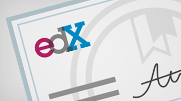

# 엔터프라이즈 조직 및 Office 365

직원에 대 한 IT 전문가와 대규모 조직,으로 특정 요구 사항 및 표준 환경을 유지 관리 하는 것이 해야 합니다. 계획 및 기업에 대 한 Office 365를 관리 하는데 필요한 정보는 다음과 같습니다.
  

> [!VIDEO https://www.microsoft.com/videoplayer/embed/d08b637c-66dc-4f0e-afc2-56da92e99589?autoplay=false]
  
## 주요 리소스

  
 **FastTrack에서 길잡이 도움 받기**
  
설치를 계획 하 고 FastTrack에서 Office 365에 도움을 받고 데이터를 마이그레이션할 합니다.
  
[FastTrack 가져오기](https://go.microsoft.com/fwlink/?linkid=238431)
  

  
 **보안 &amp; 규정 준수**
  
데이터를 보호 하 고 법률 또는 규정 표준을 준수 합니다.
  
[보안 개요 &amp; Office 365의 규정 준수 기능](https://support.office.com/article/dcb83b2c-ac66-4ced-925d-50eb9698a0b2)
  

  
 **클라우드 아키텍처를 이해**
  
엔터프라이즈 클라우드 하는 방법에 대 한 아키텍처 포스터를 살펴봅니다.
  
[포스터 가져오기](https://aka.ms/cloudarch)
  

  
 **일반적인 공격에 대 한 설명**
  
Microsoft 보호할 수 있는 방법을 조직에 알아봅니다.
  
[포스터 다운로드](https://aka.ms/commonattacks)
  
## IT 전문가 위한 교육

  
 **IT 전문가 교육**
  
LinkedIn 학습에 의해 제공자 무료 비디오 코스를 검색 합니다.
  
[고급 교육](https://support.office.com/article/68cc9b95-0bdc-491e-a81f-ee70b3ec63c5.aspx)
  

  
 **Microsoft 학습**
  
Office 365 교육 및 IT 전문가 위한 인증 합니다.
  
[인기 있는 교육](https://go.microsoft.com/fwlink/?linkid=826247)
  

  
 **가상 academy (영문)**
  
Microsoft 가상 Academy에서 전문가의 알아봅니다.
  
[코스를 통해 찾아보기](https://go.microsoft.com/fwlink/?linkid=826248)
  

  
 **스택에 푸시됩니다 대학**
  
온라인 자율된 학습을 Office 365 IT 전문가 위한 경험 했습니다.
  
[지금 등록](https://go.microsoft.com/fwlink/?linkid=852994)
  
## 주요 기사

[관리자 도움말-비즈니스 제품에 대 한 지원 문의](https://support.office.com/article/32a17ca7-6fa0-4870-8a8d-e25ba4ccfd4b)
  
[Windows용 새 OneDrive 동기화 클라이언트 배포](https://support.office.com/article/3f3a511c-30c6-404a-98bf-76f95c519668)
  
[Office 365에 여러 전자 메일 계정을 마이그레이션하는 방법](https://support.office.com/article/0a4913fe-60fb-498f-9155-a86516418842)
  
[Office 2010 서버와 클라이언트에서 업그레이드](upgrade-from-office-2010-servers-and-products.md)
  
[Office 365 서비스 배포 관리자](deployment-advisors-for-office-365.md)
  
 **최종 사용자를 위한 교육**
  
[Office 365 생산성 교육](https://support.office.com/article/af07cb6b-980d-4f33-8599-322582767408)
  
[비디오: Office 365 란?](https://support.office.com/article/847caf12-2589-452c-8aca-1c009797678b)
  
 **개발 리소스**
  
[Office 개발자 센터](https://go.microsoft.com/fwlink/?linkid=615418)
  

