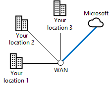

# Microsoft 클라우드 연결을 위한 ExpressRoute

 **요약:** Microsoft의 클라우드 서비스 및 플랫폼에 대 한 더 빠르고 안정적인 연결을 지원 하기 위한 방법에 대해 알아봅니다.
  
ExpressRoute는 Microsoft 클라우드에 대해 개인, 전용, 고처리량의 네트워크 연결을 제공합니다.
  
## Microsoft 클라우드로의 모든 express

다음은 express 연결을 사용 하지 않고 Microsoft 클라우드의 네트워킹 경로입니다.
  
**그림 1: express가 없는 네트워킹 경로**

  
그림 1에서는 온-프레미스 네트워크와 Microsoft 클라우드 간의 일반적인 경로를 보여 줍니다. 온-프레미스 네트워크에 지는 ISP에 대 한 WAN 링크를 통해 인터넷에 연결 됩니다. 그러면 트래픽은 인터넷을 통해 Microsoft 클라우드의 가장자리로 이동 합니다. microsoft 클라우드 내의 클라우드 제품에는 Office 365, microsoft Azure, microsoft Intune 및 Dynamics 365가 포함 됩니다. 조직의 사용자는 온-프레미스 네트워크 또는 인터넷에 위치할 수 있습니다.
  
express 기반 연결이 없으면 온-프레미스 네트워크에 지와 ISP 간의 연결을 제어할 수 있는 Microsoft 클라우드 (즉, 서비스 공급자와의 관계)에 대 한 트래픽 경로의 일부일 뿐입니다. 
  
ISP와 Microsoft 클라우드 edge 간의 경로는 악의적인 사용자의 중단, 트래픽 혼잡 및 모니터링을 통해 인터넷에서 가장 좋은 배달 시스템입니다.
  
로밍 또는 원격 사용자와 같은 인터넷의 사용자는 인터넷을 통해 Microsoft 클라우드로 트래픽을 전송 합니다.
  
다음은 express로 연결 되는 Microsoft 클라우드의 네트워킹 경로입니다.
  
**그림 2: express를 사용 하는 네트워킹 경로**

  
그림 2는 두 개의 네트워킹 경로를 보여 줍니다. Microsoft Intune으로의 트래픽은 일반적인 인터넷 트래픽과 같은 경로를 이동 합니다. Office 365, microsoft Azure 및 Dynamics 365에 대 한 트래픽은 온-프레미스 네트워크의 가장자리와 Microsoft 클라우드의 가장자리 사이의 전용 경로인 간 연결을 통해 이동 됩니다.
  
이제는이 연결을 통해 서비스 공급자와의 관계를 통해 edge에서 Microsoft 클라우드 edge까지 전체 트래픽 경로를 제어할 수 있습니다. 이 연결은 예측 가능한 성능을 제공 하 고 [99.95% 가동 SLA](https://azure.microsoft.com/support/legal/sla/expressroute/v1_3/)를 제공할 수 있습니다.
  
이제 서비스 공급자의 연결, Office 365, Azure 및 Dynamics 365 서비스에 따라 예측 가능한 처리량과 대기 시간을 계산할 수 있습니다. 지금은 Microsoft Intune에 대 한 간 연결이 지원 되지 않습니다.
  
express 경로 연결을 통해 전송 되는 트래픽은 더 이상 인터넷 중단, 트래픽 혼잡 및 모니터링에 영향을 받지 않습니다.
  
로밍 또는 원격 사용자와 같은 인터넷의 사용자는 여전히 인터넷을 통해 Microsoft 클라우드로 트래픽을 전송 합니다. 한 가지 예외는 Azure IaaS에 호스트 되는 인트라넷 라인 비즈니스 응용 프로그램에 대 한 트래픽으로, 원격 액세스 연결을 통해 온-프레미스 네트워크로의 연결을 통해 전송 됩니다.
  
또한이 연결을 사용 하는 경우에도 일부 트래픽은 인터넷을 통해 여전히 DNS 쿼리, 인증서 해지 목록 확인 및 CDN (콘텐츠 배달 네트워크) 요청과 같이 전송 됩니다.
  
자세한 내용은 다음 추가 리소스를 참조 하세요.
  
- [Office 365용 Express 경로](https://aka.ms/expressrouteoffice365)
    
- [Azure의 express 경로](https://azure.microsoft.com/services/expressroute/)
    
## Azure에 대 한 express의 장점

Azure 기반 클라우드 서비스에 대해 express를 사용 하는 경우의 몇 가지 이점은 다음과 같습니다.
  
- **예측 가능한 성능:** Microsoft 클라우드의 가장자리에 대 한 전용 경로를 사용 하는 경우에는 성능이 인터넷 공급자 중단 및 인터넷 트래픽의 스파이크에 영향을 받지 않습니다. Microsoft 클라우드에 대 한 처리량 및 대기 시간 SLA를 담당 하는 공급자를 확인 하 고 보유할 수 있습니다.
    
- **트래픽에 대 한 데이터 개인 정보:** 전용 express 경로 연결을 통해 전송 되는 트래픽은 악의적인 사용자가 인터넷을 모니터링 하거나 패킷 캡처 및 분석을 받지 않습니다. MPLS (멀티 프로토콜 레이블 전환) 기반 WAN 링크를 사용 하는 것 만큼 안전 합니다.
    
- **높은 처리량 연결:** exchange 공급자 및 네트워크 서비스 공급자가 제공 하는 express 간 연결에 대 한 폭넓은 지원을 통해 Microsoft 클라우드에 최대 10mb의 링크를 얻을 수 있습니다.
    
- **일부 구성의 경우 비용이 저렴 합니다.** 경제적인 연결 비용은 추가 비용이 긴 하지만, 경우에 따라 단일 express 연결을 통해 Microsoft 클라우드 서비스에 적절 한 처리량을 제공 하기 위해 조직의 여러 위치에서 인터넷 용량을 늘리는 것 보다 비용이 적게 들 수 있습니다.
    
모든 구성에서 한도로 연결을 설정 하는 것은 더 높은 성능을 보장 하지 않습니다. 지역 Microsoft 데이터 센터에서 몇 가지 홉만을 제외 하는 고대역폭 인터넷 연결 보다 대역폭이 낮은 비트 단위 연결을 사용 하는 경우에는 성능이 낮아질 수 있습니다.
  
office 365에서 express를 사용 하기 위한 최신 권장 사항은 [office 365 용 express](https://support.office.com/article/Azure-ExpressRoute-for-Office-365-6d2534a2-c19c-4a99-be5e-33a0cee5d3bd)를 참조 하십시오.
  
## express 경로 연결 모델

표 1에는 간 연결에 대 한 세 가지 기본 연결 모델이 나와 있습니다.
  
|**클라우드 exchange에 배치**|**지점 간 이더넷**|**임의 (IP VPN) 연결**|
|:-----|:-----|:-----|
||||
|데이터 센터가 클라우드 교환과 함께 기능에 배치 되어 있는 경우, 공동 위치 공급자의 이더넷 교환을 통해 Microsoft 클라우드와의 가상 교차 연결을 주문할 수 있습니다.    |데이터 센터가 온-프레미스에 있는 경우 지점간 이더넷 링크를 사용 하 여 Microsoft 클라우드에 연결할 수 있습니다.    |이미 IP VPN (MPLS) 공급자를 사용 하 여 조직의 사이트에 연결 하는 경우 Microsoft 클라우드로의 간 연결 기능은 사설 WAN의 다른 위치와 동일 하 게 작동 합니다.    |
   
 **표 1: express 경로 연결 모델**
  
## Microsoft 클라우드 서비스에 대 한 자세한 피어 링 관계

단일 express 연결에서는 Microsoft 클라우드의 서로 다른 부분에 대해 두 개의 서로 다른 BGP (Border Gateway Protocol) 피어 링 관계를 지원 합니다. bpg는 피어 링 관계를 사용 하 여 트러스트 및 exchange 라우팅 정보를 설정 합니다.
  
**그림 3: 단일 express 연결에서 두 개의 서로 다른 BGP 관계**

  
그림 3은 온-프레미스 네트워크를 통한 express 간 연결을 보여 줍니다. 이 연결에는 두 개의 논리적 피어 링 관계가 있습니다. microsoft 피어 링 관계는 Office 365, Dynamcs 365 및 Azure PaaS 서비스를 포함 하는 microsoft SaaS 서비스로 이동 합니다. 사설 피어 링 관계는 Azure IaaS 및 가상 컴퓨터를 호스트 하는 가상 네트워크 게이트웨이로 이동 합니다.
  
Microsoft 피어 링 BGP 관계: 
  
- 은 DMZ의 라우터에서 Office 365, Dynamics 365 및 Azure 서비스의 공용 주소로 변환 됩니다. 
    
- 양방향으로 시작 되는 통신을 지원 합니다.
    
개인 피어 링 BGP 관계:
  
- 는 조직 네트워크의 가장자리에 있는 라우터에서 Azure vnet에 할당 된 개인 IP 주소로 시작 됩니다.
    
- 양방향으로 시작 되는 통신을 지원 합니다.
    
- 은 조직 네트워크를 Microsoft 클라우드로 확장 한 것으로, 내부에서 주소 지정 및 라우팅을 완료 합니다.

>[!Note]
>이 문서의 이전 버전에서 설명한 공용 피어 링 BGP 관계는 더 이상 사용 되지 않습니다.
>
    
## express를 사용한 응용 프로그램 배포 및 트래픽 흐름의 예

대상 및 응용 프로그램 동작 간의 경로 홉에 따라, Microsoft 클라우드 내에서 트래픽이 여러 개 간의 연결에 따라 이동 하는 방식이 여기에 해당 합니다. 다음은 사이트 간 VPN 연결을 통해 온-프레미스 SharePoint 팜에 액세스 하는 Azure 가상 컴퓨터에서 실행 되는 응용 프로그램의 예입니다.
  
**그림 4: 온-프레미스 SharePoint 팜에 액세스 하는 Azure 가상 컴퓨터의 응용 프로그램**

  
그림 4에서는 온-프레미스 SharePoint 팜, 온-프레미스 네트워크와 azure iaas의 가상 네트워크 간의 사이트 간 VPN 연결, azure iaas 가상 컴퓨터로 실행 되는 응용 프로그램 서버 및 응용 프로그램 서버 간 트래픽 흐름을 보여 줍니다. SharePoint 팜
  
응용 프로그램은 온-프레미스 DNS를 사용 하 여 SharePoint 팜의 IP 주소를 찾고 모든 트래픽은 사이트 간 VPN 연결을 통해 이동 합니다.
  
이 조직은 온-프레미스 sharepoint 팜을 Office 365에서 SharePoint Online으로 마이그레이션 했으며,로 연결을 배포 했습니다.
  
**그림 5: 온-프레미스 sharepoint 팜을 sharepoint Online으로 이동**

  
그림 5에서는 Microsoft SaaS 및 Office 365에 대 한 피어 링 관계와 가상 네트워크의 응용 프로그램 서버가 포함 된 Azure IaaS 간의 연결을 추가 하는 방법을 보여 줍니다. SharePoint 온-프레미스 팜이 Office 365로 마이그레이션 되었습니다.
  
Microsoft 및 개인 피어 링 관계를 사용 하는 경우:
  
- Azure virtual network 게이트웨이에서 온-프레미스 위치는 간 연결을 통해 사용할 수 있습니다.
    
- Office 365 구독에서 프록시 서버와 같은에 지 장치의 공용 IP 주소를 express 간 연결에서 사용할 수 있습니다.
    
- 온-프레미스 네트워크에 지에서 Azure VNet의 개인 ip 주소와 Office 365의 공용 ip 주소는 모든 express 연결에서 사용할 수 있습니다.
    
응용 프로그램은 SharePoint Online의 url에 액세스 하는 경우, 대상 간 연결을 통해 트래픽을 해당에 지의 프록시 서버로 전달 합니다. 
  
프록시 서버가 SharePoint Online의 IP 주소를 찾으면이를 통해 통신을 위한 express 연결을 통해 트래픽을 다시 전달 합니다. 응답 트래픽은 역방향 경로를 따라 이동 합니다.
  
**그림 6: sharepoint 팜이 Office 365에서 sharepoint Online으로 마이그레이션 되었을 때의 트래픽 흐름**

  
그림 6에서는 Office 365에서 응용 프로그램 서버와 SharePoint Online 간의 트래픽이 응용 프로그램 서버에서 온-프레미스 네트워크에 지에 대 한 개인 피어 링 관계를 통과 한 후에 Microsoft 피어 링 관계의 가장자리에서 이동 하는 방식을 보여 줍니다. Office 365
  
이렇게 하면 경로 및 응용 프로그램 동작의 결과로 머리카락 고정이 됩니다.
  
## express 경로 및 Microsoft의 클라우드 네트워크

다른 두 버전의 express 경로 연결을 사용할 수 있습니다.
  
### ExpressRoute

조직 네트워크와 Microsoft 데이터 센터 간에 전송 되는 트래픽은 다음과 같은 조합으로 구성 됩니다.
  
- 위치입니다.
    
- microsoft 클라우드 피어 링 위치 (microsoft edge에 연결할 실제 위치)
    
- Microsoft 데이터 센터 위치입니다.
    
microsoft datacenter 및 클라우드 피어 링 위치는 모두 microsoft 클라우드 네트워크에 연결 됩니다.
  
microsoft 클라우드 피어 링 위치로가는 간 연결을 만들 때 microsoft 클라우드 네트워크와 동일한 대륙의 모든 microsoft 데이터 센터 위치에 연결 됩니다. 클라우드 피어 링 위치와 대상 microsoft 데이터 센터 간의 트래픽은 Microsoft 클라우드 네트워크를 통해 전달 됩니다.
  
이로 인해 임의 연결 모델에 대 한 로컬 Microsoft 데이터 센터에 최적이 배달 되지 않을 수 있습니다.
  
**그림 7: 단일 express 연결을 사용 하는 지리적으로 분산 된 조직의 예**

  
그림 7은 지역에서 미국의 북서쪽에 위치 1, 두 위치, 즉 북동쪽에 위치 2가 있는 조직을 보여 줍니다. 모든 WAN 공급자가 연결 합니다. 이 조직에는 또한 경기도의 Microsoft 피어 링 위치에 대 한 간 연결이 있습니다. 동부 해안 데이터 센터에 대 한 북동쪽 지역에 있는 위치 2의 트래픽은 조직의 모든 WAN에서 경기도로, microsoft 피어 링 위치로 이동 하 고, microsoft 클라우드 네트워크를 통해 국가 전체에서 동부 해안으로 복원 되어야 합니다. 센터가.
  
최적의 전달을 위해 지역 Microsoft 클라우드 피어 링 위치로의 여러 개인 설정 연결을 사용 합니다. 
  
**그림 8: 지역별 데이터 센터로의 최적 전달을 위한 여러 개의 express 연결 사용**

  
그림 8에서는 각 위치에 하나씩 두 개의 지역적으로 연결을 사용 하는 동일한 조직을 보여 주고 로컬 Microsoft 피어 링 위치를 모두 표시 합니다. 이 구성에서 동부 해안 datacenter로 향하는 북동쪽의 위치 2에 있는 트래픽은 동쪽 해안 피어 링 위치, Microsoft 클라우드 네트워크, 그리고 동쪽 해안 datacenter로 직접 이동 합니다.
  
여러 개의 express 연결에 다음이 제공 될 수 있습니다.
  
- 지역적으로 로컬 Microsoft 데이터 센터 위치에 대 한 성능 향상
    
- 로컬 express 연결을 사용할 수 없는 경우 Microsoft 클라우드로의 가용성이 향상 됩니다.
    
이는 동일한 대륙의 조직에 적합 합니다. 그러나 조직의 대륙 외부에 있는 Microsoft 데이터 센터에 대 한 트래픽은 인터넷을 통해 이동 됩니다.
  
Microsoft 클라우드 네트워크를 통한 intercontinental 트래픽의 경우에는 express 사용자 Premium 연결을 사용 해야 합니다.
  
### express 경로 Premium

대륙에 전역적으로 분산 된 조직의 경우,가을 프리미엄 Premium을 사용할 수 있습니다. 
  
가 중 Premium을 사용 하는 경우 대륙의 모든 microsoft 피어 링 위치에서 모든 microsoft 데이터 센터에 연결할 수 있습니다. 대륙 간의 트래픽은 Microsoft 클라우드 네트워크를 통해 전달 됩니다.
  
여러 개의 express Premium 연결을 사용 하는 경우 다음을 사용할 수 있습니다.
  
- continentally 로컬 Microsoft 데이터 센터에 대 한 향상 된 성능
    
- 로컬 express 연결을 사용할 수 없는 경우 전체 Microsoft 클라우드에 대 한 가용성 향상
    
비트 단위 Premium은 Office 365 기반 간 연결에 필요 합니다.
  
**그림 9: world wide Microsoft 클라우드 네트워크**

  
그림 9는 전 세계 대륙 및 지역에 걸친 네트워크를 포함 하는 전 세계 Microsoft 클라우드 네트워크의 논리적 다이어그램을 보여 줍니다 interconnections. 각 대륙의 Microsoft 클라우드 네트워크 부분을 사용 하 여 지역 허브 사무소에서 로컬 Microsoft 피어 링 위치로의 기본 설정 프리미엄 연결을 만듭니다.
  
지역별 사무소의 경우 다음에 해당 하는 office 365 트래픽을 대상으로 합니다.
  
- 대륙 Office 365 데이터 센터가 대륙 내의 Microsoft 클라우드 네트워크를 통해 이동 합니다.
    
- Office 365 다른 대륙의 데이터 센터가 intercontinental Microsoft 클라우드 네트워크를 통해 이동 합니다.
    
자세한 내용은 다음을 참조하세요.
  
- [Office 365 교육을 위한 Azure express 경로](https://channel9.msdn.com/series/aer/)
    
- [Office 365의 네트워크 계획 및 성능 조정](https://aka.ms/tune)
    
## express 경로 옵션

또한이 경우에는 다음 옵션을 사용자의 메일 \ 배포에 통합할 수 있습니다.
  
- **에 지의 보안:** 트래픽 검사 또는 침입/맬웨어 감지와 같은 거 든 지 연결을 통해 전송 및 수신 되는 트래픽에 고급 보안을 제공 하려면 DMZ 내의 트래픽 경로 또는 인트라넷 테두리에 해당 보안 장비를 배치 합니다.
    
- **vm에 대 한 인터넷 트래픽:** Azure vm에서 인터넷 위치를 통해 직접 트래픽을 시작 하지 못하도록 하려면 Microsoft에 기본 경로를 보급 합니다. 인터넷 트래픽은 모든 express 연결 및 온-프레미스 프록시 서버를 통해 라우팅됩니다. azure vm에서 azure PaaS services 또는 Office 365로의 트래픽은 모든 express 연결에서 다시 라우팅됩니다.
    
- **WAN 최적화 프로그램이:** 크로스-프레미스 Azure VNet (가상 네트워크)에 대해 사설 피어 링 연결의 양쪽에 WAN 최적화 프로그램이를 배포할 수 있습니다. azure VNet 내부에서 azure marketplace 및 사용자 정의 라우팅에서 WAN 최적화 네트워크 어플라이언스를 사용 하 여 기기를 통해 트래픽을 라우팅합니다.
    
- **서비스 품질:** 트래픽의 IPv4 헤더에 있는 dscp (구별 된 서비스 코드 포인트) 값을 사용 하 여 음성, 비디오/대화형 또는 최상의 배달에 대해 표시 합니다. 이는 Microsoft 피어 링 관계 및 비즈니스용 Skype Online 트래픽에 특히 중요 합니다.
    
자세한 내용은 다음 추가 리소스를 참조 하세요.
  
- [Office 365용 Express 경로](https://aka.ms/expressrouteoffice365)
    
- [Office 365 교육을 위한 Azure express 경로](https://channel9.msdn.com/series/aer/)
    
- [Azure의 express 경로](https://azure.microsoft.com/services/expressroute/)
    
## 다음 단계

[Microsoft SaaS에 대한 네트워킹 디자인](designing-networking-for-microsoft-saas.md)

## 참고 항목

[엔터프라이즈 설계자 용 Microsoft 클라우드 네트워킹](microsoft-cloud-networking-for-enterprise-architects.md)
  
[Microsoft 클라우드 IT 아키텍처 리소스](microsoft-cloud-it-architecture-resources.md)

