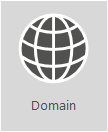

# <a name="external-domain-name-system-records-for-office-365"></a>Office 365에 대한 외부 Domain Name System 레코드

 **요약:** Office 365 배포를 계획할 때 사용할 DNS 레코드 목록을 참조합니다.
  
|||
|:-----|:-----|
||**Office 365 조직의 DNS 레코드 사용자 지정 목록을 보고 싶습니까?** Office 365에서 도메인에 대한 [Office 365 DNS 레코드를 만드는 데 필요한 정보를 찾을 수 있습니다](https://support.office.microsoft.com/en-us/article/Gather-the-information-you-need-to-create-Office-365-DNS-records-77f90d4a-dc7f-4f09-8972-c1b03ea85a67).<br/> **GoDaddy 또는 eNom과 같은 도메인의 DNS 호스트에서 이러한 레코드를 추가하는 데 필요한 단계별 도움말이 필요합니까?** [ 인기 있는 많은 DNS 호스트에 대한 단계별 지침 링크를 찾으세요 ](https://go.microsoft.com/fwlink/?LinkId=286745). <br/>  **자체 사용자 지정 배포를 위한 참조 목록을 사용하려고 하십니까?** 아래 목록은 사용자 지정 Office 365 배포에 대한 참조로 사용해야 합니다. 조직에 적용할 레코드를 선택하고 해당 값을 입력해야 합니다. <br/> [Office 365의 네트워크 계획 및 성능 조정](https://aka.ms/tune)**으로 돌아가기**.  <br/> |

SPF 및 MX 레코드를 파악하기 어려운 경우도 종종 있습니다. SPF 레코드 지침을 업데이트해서 이 문서 끝부분에 추가했습니다. 기억해야 할 중요한 사항은 _도메인에 대해 SPF 레코드가 하나만 있을 수 있다는 것_입니다. 그렇지만 여러 개의 MX 레코드가 있을 수도 있습니다. 이러한 경우 메일 배달 문제를 야기할 수 있습니다. 전자 메일을 단일 메일 시스템으로 보내는 단일 MX 레코드가 있으면 발생할 수 있는 많은 문제가 해결됩니다.
  
아래 섹션은 Office 365의 서비스별로 구성되어 있습니다. 도메인에 대한 Office 365 DNS 레코드의 사용자 지정 목록을 보려면 Office 365에 로그인하고 [Office 365 DNS 레코드를 만드는 데 필요한 정보를 수집합니다](https://support.office.com/article/77f90d4a-dc7f-4f09-8972-c1b03ea85a67).
  
## <a name="external-dns-records-required-for-office-365-core-services"></a>Office 365에 필요한 외부 DNS 레코드(핵심 서비스)
<a name="BKMK_ReqdCore"> </a>

모든 Office 365 고객은 외부 DNS에 2개의 레코드를 추가해야 합니다. 첫 번째 CNAME레코드는 Office 365에서 워크스테이션을 연결하여 적절한 ID 플랫폼의 인증을 받을 수 있도록 합니다. 필요한 두 번째 레코드는 도메인 이름을 소유함을 증명하기 위한 레코드입니다.
  
||||
|:-----|:-----|:-----|
|**DNS 레코드** <br/> |**용도** <br/> |**사용할 값** <br/> |
|**CNAME** <br/> **(제품군)** <br/> |Office 365에서 올바른 ID 플랫폼으로 인증을 연결하는 데 사용됩니다. [추가 정보](https://go.microsoft.com/fwlink/p/?LinkId=322005) <br/> **참고:** CNAME은 21Vianet에서 운영되는 Office 365에만 적용됩니다.   |**별칭:** msoid  <br/> **대상:** clientconfig.microsoftonline-p.net  <br/> |
|**TXT** <br/> **(도메인 확인)** <br/> |Office 365에서 사용자의 도메인을 확인하는 용도로만 사용됩니다. 그 밖의 항목에는 영향을 주지 않습니다.  <br/> |**호스트:** @(또는 일부 DNS 호스팅 공급자의 경우 도메인 이름)  <br/> **TXT 값:** Office 365에서 제공되는 _텍스트 문자열 _  <br/> Office 365 **도메인 설정** 마법사는 이 레코드를 만드는 데 사용하는 값을 제공합니다.  <br/> |


## <a name="external-dns-records-required-for-email-in-office-365-exchange-online"></a>Office 365 (Exchange Online)에서 전자 메일에 필요한 외부 DNS 레코드
<a name="BKMK_ReqdCore"> </a>

Office 365의 전자 메일에는 몇 개의 다른 레코드가 필요합니다. 모든 고객이 사용해야 하는 세 가지 기본 레코드는 자동 검색, MX 및 SPF 레코드입니다.
  
- **자동 검색 레코드**를 사용하면 클라이언트 컴퓨터는 Exchange를 자동으로 찾고 클라이언트를 적절히 구성할 수 있습니다.

- **MX 레코드**는 다른 메일 시스템에 도메인의 이메일을 보낼 위치를 알려줍니다. **참고:** 도메인의 MX 레코드를 업데이트하여 전자 메일을 Office 365로 변경하면 해당 도메인으로 전송된 모든 전자 메일이 Office 365로 배달되기 시작합니다.  
몇 개의 전자 메일 주소만 Office 365로 전환하시나요? [사용자 지정 도메인으로 된 전자 메일 주소로 Office 365 시험 사용](https://support.office.com/article/39cee536-6a03-40cf-b9c1-f301bb6001d7)할 수 있습니다.

- **SPF용 TXT 레코드**는 받는 사람의 전자 메일 시스템에서 전자 메일을 보내는 서버가 승인된 서버인지를 확인하는 데 사용됩니다. 이렇게 하면 전자 메일 스푸핑 및 피싱과 같은 문제를 방지할 수 있습니다. 레코드에 포함할 내용을 이해하는 데 도움이 되는 이 문서의 [SPF에 필요한 외부 DNS 레코드](external-domain-name-system-records.md#BKMK_SPFrecords)를 참조하세요.

Exchange 페더레이션을 사용하는 전자 메일 고객의 경우 표 아래쪽에 추가 CNAME 및 TXT 레코드도 필요합니다.
  
||||
|:-----|:-----|:-----|
|**DNS 레코드** <br/> |**용도** <br/> |**사용할 값** <br/> |
|**CNAME** <br/> **(Exchange Online)** <br/> |Outlook 클라이언트가 자동 검색 서비스를 사용하여 Exchange Online 서비스에 쉽게 연결하는 데 도움이 됩니다. 자동 검색은 올바른 Exchange Server 호스트를 자동으로 검색하고 사용자를 대신하여 Outlook을 구성합니다.  <br/> |**별칭:** autodiscover  <br/> **대상:** autodiscover.outlook.com  <br/> |
|**MX** <br/> **(Exchange Online)** <br/> |Office 365에서 도메인에 대한 받는 메일을 Exchange Online 서비스로 보냅니다.  <br/> **참고:** 전자 메일이 Exchange Online으로 이동되면 이전 시스템을 가리키는 MX 레코드를 제거해야 합니다.   |**도메인:** (예)contoso.com  <br/> **대상 전자 메일 서버:** \<MX 토큰\>.mail.protection.outlook.com  <br/> **기본 설정/우선 순위:** 다른 MX 레코드보다 더 낮음(예: 1 또는 '낮음')(이를 통해 메일이 Exchange Online으로 전달됨)  <br/>  다음 단계에 따라 MX 토큰을 찾습니다.  <br/>  1. Office 365에 로그인하고 Office 365 관리자 \> 도메인으로 이동합니다.  <br/>  2. 도메인에 대한 작업 열에서 **문제 해결**을 선택합니다.  <br/>  3. MX 레코드 섹션에서 **해결 방법**을 선택합니다.  <br/>  4. 이 페이지의 지시에 따라 MX 레코드를 업데이트합니다.  <br/> [MX 우선 순위란?](https://go.microsoft.com/fwlink/p/?LinkId=396471) <br/> |
|**SPF (TXT)** <br/> (Exchange Online)  <br/> |(MO_ExchangeOnline_2nd)  <br/> |[SPF에 필요한 외부 DNS 레코드](external-domain-name-system-records.md#BKMK_SPFrecords) <br/> |

|**TXT** <br/> **(Exchange 페더레이션)** <br/> |하이브리드 배포용 Exchange 페더레이션에 사용됩니다.  <br/> |**TXT 레코드 1:** 예를 들면 contoso.com 및 사용자 지정 생성된 관련 도메인 증명 해시 텍스트(예: Y96nu89138789315669824)와 같습니다.  <br/> **TXT 레코드 2:** 예를 들면 exchangedelegation.contoso.com 및 연관된 사용자 지정 생성 도메인 증명 해시(예: Y3259071352452626169)  <br/> | |**CNAME** <br/> **(Exchange 페더레이션)** <br/> 회사에서 Exchange 페더레이션을 사용하는 경우 Outlook 클라이언트가 자동 검색 서비스를 사용하여 Exchang Online 서비스에 쉽게 연결할 수 있도록 합니다. 자동 검색에서는 올바른 Exchange Server 호스트를 자동으로 찾고 사용자를 위해 Outlook을 구성합니다.  <br/> |**별칭:** (예) Autodiscover.service.contoso.com  <br/> **대상:** autodiscover.outlook.com  <br/> |

## <a name="external-dns-records-required-for-skype-for-business-online"></a>비즈니스용 Skype Online에 필요한 외부 DNS 레코드
<a name="BKMK_ReqdCore"> </a>

[Office 365 URL 및 IP 주소 범위](https://support.office.com/article/8548a211-3fe7-47cb-abb1-355ea5aa88a2#BKMK_LYO)를 사용하여 네트워크가 올바르게 구성되었는지 확인할 경우 수행해야 할 특정 단계가 있습니다.
  
||||
|:-----|:-----|:-----|
|**DNS 레코드** <br/> |**용도** <br/> |**사용할 값** <br/> |
|**SRV** <br/> **(비즈니스용 Skype Online)** <br/> |SIP 페더레이션을 사용하도록 설정하여 Office 365 도메인이 외부 클라이언트와 인스턴트 메시징(IM) 기능을 공유할 수 있습니다. [Office 365 URL 및 IP 주소 범위](https://support.office.com/article/8548a211-3fe7-47cb-abb1-355ea5aa88a2#BKMK_LYO)에 대해 자세히 알아보세요.<br/> |**Service(서비스):** _sipfederationtls  <br/> **프로토콜:** _TCP  <br/> **우선 순위:** 100  <br/> **가중치:** 1  <br/> **포트:** 5061  <br/> **대상:** sipfed.online.lync.com  <br/> **참고:** 방화벽 또는 프록시 서버에서 외부 DNS의 SRV 조회를 차단하는 경우에는 내부 DNS 레코드에 이 레코드를 추가해야 합니다.   |
|**SRV** <br/> **(비즈니스용 Skype Online)** <br/> |비즈니스용 Skype에서 Lync 클라이언트 간의 정보 흐름을 조정하는 데 사용됩니다.  <br/> |**Service(서비스):** sip  <br/> **Protocol(프로토콜):** TLS   <br/> **우선 순위:** 100  <br/> **가중치:** 1  <br/> **포트:** 443  <br/> **대상:** sipdir.online.lync.com  <br/> |

|**CNAME** <br/> **(비즈니스용 Skype Online)** <br/> |Lync 클라이언트에서 비즈니스용 Skype Online 서비스 찾기 및 로그인을 지원하는 데 사용됩니다.  <br/> |**별칭:** sip  <br/> **대상:** sipdir.online.lync.com  <br/> 자세한 내용은 [Office 365 URL 및 IP 주소 범위](https://support.office.com/article/8548a211-3fe7-47cb-abb1-355ea5aa88a2#BKMK_LYO)를 참조하세요.  <br/> | |**CNAME** <br/> **(비즈니스용 Skype Online)** <br/> |Lync 모바일 클라이언트에서 비즈니스용 Skype Online 서비스 찾기 및 로그인을 지원하는 데 사용됩니다.  <br/> |**별칭:** lyncdiscover  <br/> **대상:** webdir.online.lync.com  <br/> |

## <a name="external-dns-records-required-for-sharepoint-online"></a>SharePoint Online에 필요한 외부 DNS 레코드
<a name="BKMK_ReqdCore"> </a>

SharePoint Online을 사용하여 외부 사람에게 전자 메일을 보내는 경우 SharePoint Online에는 DNS 레코드만 필요합니다. 이 경우 메일을 전달할 수 있도록 [SPF에 필요한 외부 DNS 레코드](external-domain-name-system-records.md#BKMK_SPFrecords)를 설정했는지 확인해야 합니다.
  
## <a name="external-dns-records-required-for-office-365-single-sign-on"></a>Office 365 Single Sign-On에 필요한 외부 DNS 레코드
<a name="BKMK_ReqdCore"> </a>

||||
|:-----|:-----|:-----|
|**DNS 레코드** <br/> |**용도** <br/> |**사용할 값** <br/> |
|**호스트 (A)** <br/> |Single Sign-On(SSO)에 사용됩니다. 오프-프레미스 사용자 및 원하는 경우 온-프레미스 사용자가 AD FS(Active Directory Federation Services) 페더레이션 서버 프록시 또는 부하 분산된 VIP(가상 IP)에 연결하기 위한 끝점을 제공합니다.  <br/> |**대상:** (예)sts.contoso.com  <br/> |

## <a name="external-dns-records-required-for-spf"></a>SPF에 필요한 외부 DNS 레코드
<a name="BKMK_SPFrecords"> </a>

> [!IMPORTANT]
> SPF는 스푸핑을 방지하도록 설계되었지만 SPF가 방어할 수 없는 스푸핑 기술이 있습니다. 이를 방어하려면 SPF를 설정한 후에 Office 365에 대해 DKIM 및 DMARC도 구성해야 합니다. 이를 시작하려면 [DKIM을 사용하여 Office 365의 도메인에서 보낸 아웃바운드 전자 메일의 유효성을 검사하는 방법](https://technet.microsoft.com/en-us/library/mt695945%28v=exchg.150%29.aspx)을 참조하세요. 다음으로, [DMARC를 사용하여 Office 365에서 전자 메일 유효성 검사](https://technet.microsoft.com/en-us/library/mt734386%28v=exchg.150%29.aspx)를 참조하세요.
  
SPF 레코드는 다른 사용자가 사용자의 도메인을 사용하여 스팸 또는 기타 악성 전자 메일을 보내지 못하도록하는 TXT 레코드입니다. Sender Policy Framework(SPF) 레코드는 사용자의 도메인에서 전자 메일을 보낼 수 있는 서버를 식별하여 작동합니다.
  
도메인에 대해 하나의 SPF 레코드(즉, SPF를 정의하는 TXT 레코드) 만 보유할 수 있습니다. 단일 레코드에 일부 다른 항목이 포함될 수 있지만 총 DNS 조회는 10이 넘게 발생할 수 없습니다.(이는 서비스 거부 공격을 방지하는 데 도움이 됩니다) 사용자 환경에 적합한 SPF 레코드 값을 작성하거나 업데이트하는 데 도움이 되는 아래 표 및 다른 예제를 참조하하세요.
  
### <a name="structure-of-an-spf-record"></a>SPF 레코드 구조

모든 SPF 레코드는 세 부분으로 구성됩니다. SPF 레코드라는 선언, 전자 메일을 보내야 하는도메인 및 IP 주소, 시행 규칙입니다. 유효한 SPF 레코드에는 이 세 가지가 모두 필요합니다. Exchange Online 전자 메일만 사용하는 경우 Office 365에 대한 일반적인 SPF 레코드의 예는 다음과 같습니다.
  
``` dns
TXT Name @
Values: v=spf1 include:spf.protection.outlook.com -all
```

도메인으로부터 전자 메일을 수신하는 전자 메일 시스템에서 SFP 레코드를 조회한 다음 메시지를 보낸 전자 메일 서버가 Office 365 서버일 경우 메시지를 수락합니다. 예를 들어, 메시지를 보낸 서버가 기존 메일 시스템이거나 인터넷의 악성 시스템인 경우 SPF 검사가 실패하고 메시지가 배달되지 않을 수 있습니다. 스푸핑을 방지하고 피싱 메시지를 방지하려면 이 도움말을 확인하세요.
  
### <a name="choose-the-spf-record-structure-you-need"></a>필요한 SPF 레코드 구조 선택

Office 365용 Exchange Online 전자 메일을 사용하지 않는 시나리오의 경우(예: SharePoint Online에서 만든 전자 메일을 사용하는 경우 등)에는 다음 표를 사용하여 레코드 값에 포함할 내용을 결정합니다.
  
> [!NOTE]
> 예를 들어, 방화벽을 통해 전자 메일 트래픽을 관리하기 위한 에지 전자 메일 서버를 포함하는 복잡한 시나리오가있는 경우 더욱 자세한 SPF 레코드를 설정해야합니다. 방법 알아보기:[스푸핑을 방지하기 위해 Office 365에서 SPF 레코드를 설정합니다](https://go.microsoft.com/fwlink/?LinkId=787656). 또한, [스푸핑을 방지하기 위해 Office 365에서 Sender Policy Framework (SPF)를 사용하는 방법](https://go.microsoft.com/fwlink/?LinkId=787065)을 참조하여 Office 365에서 SPF가 작동하는 방식에 대해 자세히 알아볼 수 있습니다.
  
|||||
|:-----|:-----|:-----|:-----|
||다음를 사용하는 경우...  <br/> |용도  <br/> |추가할 포함 내용  <br/> |
|1  <br/> |모든 전자 메일 시스템(필수)  <br/> |이 값으로 시작하는 모든 SPF 레코드  <br/> |v=spf1  <br/> |
|2  <br/> |Exchange Online(일반적)  <br/> |Exchange Online만 사용  <br/> |포함:spf.protection.outlook.com  <br/> |
|3  <br/> |SharePoint Online 및 Exchange Online(일반적)  <br/> |Exchange Online 및 SharePoint Online 사용  <br/> |포함:sharepointonline.com  <br/> |
|4  <br/> |제3자 전자 메일 시스템(덜 일반적임)  <br/> ||포함:\<email system like mail.contoso.com\>  <br/> |
|5  <br/> |온-프레미스 메일 시스템(덜 일반적임)  <br/> |Exchange Online Protection 또는 Exchange Online 및 다른 메일 시스템을 사용하는 경우 사용  <br/> |ip4:\<0.0.0.0\>  <br/> ip6:\< : : \>  <br/> 포함:\<mail.contoso.com\>  <br/> 괄호 안의 값(\<\>)은 도메인의 전자 메일을 전송하는 다른 메일 시스템이어야 합니다.  <br/> |
|6  <br/> |모든 전자 메일 시스템(필수)  <br/> ||-모두  <br/> |

### <a name="example-adding-to-an-existing-spf-record"></a>예: 기존 SPF 레코드에 추가
<a name="bkmk_addtospf"> </a>

이미 SPF 레코드가있는 경우 Office 365의 값을 추가하거나 업데이트해야 합니다. 예를 들어 contoso.com에 대한 기존 SPF 레코드는 다음과 같다고 가정해 봅시다.
  
``` dns
TXT Name @
Values: v=spf1 ip4:60.200.100.30 include:spf.protection.outlook.com -all
```

예를 들어 이제 SharePoint Online에서 보낸 전자 메일을 포함 할 수 있도록 Office 365용 SPF 레코드를 업데이트하는 중입니다. 필요한 값이 포함된 단일 SPF 레코드를 가질 수 있도록 현재 레코드를 편집합니다. Office 365의 경우 SPF 레코드의 "sharepointonline.com"에는 Exchange Online(Outlook)과 SharePoint Online의 전자 메일이 포함되므로 원래 "spf.protection.outlook.com"값을 대체합니다.
  
정확함:
  
``` dns
TXT Name @
Values: v=spf1 ip4:60.200.100.30 include:sharepointonline.com -all
```

정확하지 않음:
  
``` dns
Record 1:
TXT Name @
Values: v=spf1 ip4:60.200.100.30 include:spf.protection.outlook.com -all
Record 2:
Values: v=spf1 include:sharepointonline.com -all
```

### <a name="more-examples-of-common-spf-values"></a>일반적인 SPF 값에 대한 더 많은 예
<a name="bkmk_addtospf"> </a>

전체 Office 365 제품군을 사용하고 있으며 MailChimp에서 본인 대신 마케팅 전자 메일을 전송하고 있는 경우 contoso.com의 SPF 레코드는 위 표의 1, 3, 4 및 6 행을 사용하여 다음과 같이 표시됩니다. 행 1과 6은 필수이며 "sharepointonline.com"에는 Exchange(Outlook)와 SharePoint 전자 메일이 모두 포함되어야 합니다.
  
``` dns
TXT Name @
Values: v=spf1 include:sharepointonline.com include:servers.mcsv.net -all
```

또는 Office 365와 온-프레미스 메일 시스템 모두에서 전자 메일을 보내도록 Exchange 하이브리드 구성을 사용하는 경우 contoso.com의 SPF 레코드는 다음과 같을 수 있습니다.
  
``` dns
TXT Name @
Values: v=spf1 include:sharepointonline.com include:mail.contoso.com -all
```

다음은 전자 메일에 대해 도메인을 Office 365에 추가할 때 기존 SPF 레코드를 조정하는 데 도움이 되는 몇 가지 일반적인 예입니다. 예를 들어, 방화벽을 통해 전자 메일 트래픽을 관리하기 위한 에지 전자 메일 서버를 포함하는 복잡한 시나리오가 있는 경우, 더욱 자세한 SPF 레코드를 설정해야 합니다. 방법 알아보기: [스푸핑을 방지하기 위해 Office 365에서 SPF 레코드를 설정합니다](https://go.microsoft.com/fwlink/?LinkId=787656).
  
다음의 간단한 링크를 사용할 수 있습니다. [https://aka.ms/o365edns](https://aka.ms/o365edns)
