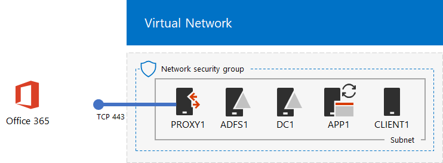
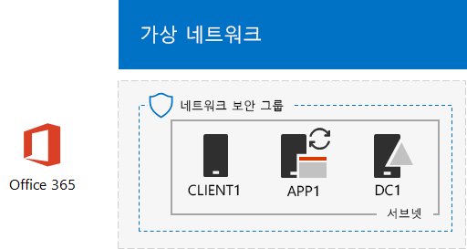

# <a name="federated-identity-for-your-office-365-devtest-environment"></a>Office 365 개발/테스트 환경용 페더레이션 ID

 **요약:** Office 365 개발/테스트 환경에 대한 페더레이션 인증을 구성합니다.
  
Office 365은 페더레이션 ID를 지원합니다. 즉, 자격 증명 자체의 유효성 검사를 수행하는 대신, Office 365는 Office 365가 신뢰하는 페더레이션 인증 서버에 사용자를 연결하는 것을 의미합니다. 사용자의 자격 증명이 올바른 경우 페더레이션 인증 서버는 보안 토큰을 발급하며, 그런 후에 클라이언트는 인증의 증거로 해당 보안 토큰을 Office 365로 전송합니다. 페더레이션 ID를 사용하면 Office 365 구독과 고급 인증 및 보안 시나리오의 부하 부담을 줄이고 강화할 수 있습니다.
  
이 문서에서는 Office 365 개발/테스트 환경에 대한 페더레이션 인증을 구성하여 다음과 같은 결과를 얻는 방법을 설명합니다.
  
**그림 1: Office 365 개발/테스트 환경에 대한 페더레이션 인증**


  
그림 1에 나오는 구성은 다음으로 이루어져 있습니다. 
  
- Office 365 E5 평가판 구독: 만들고 30일 후에 만료됩니다.
    
- 인터넷에 연결된 간소화된 조직 인트라넷: Azure Virtual Network의 하위 집합에 있는 5개의 가상 머신(DC1, APP1, CLIENT1, ADFS1 및 PROXY1)으로 구성되어 있습니다. Azure AD Connect가 APP1에서 실행되며 AD DS(Active Directory Domain Services) 도메인의 계정 목록을 Office 365와 동기화합니다. PROXY1은 들어오는 인증 요청을 수신합니다. ADFS1은 DC1을 사용하여 자격 증명이 유효한지 검사하고 보안 토큰을 발급합니다.
    
이 개발/테스트 환경의 5가지 주요 설정 단계는 다음과 같습니다.
  
1. DirSync를 사용하여 시뮬레이트된 엔터프라이즈 Office 365 개발/테스트 환경 만들기
    
2. AD FS 서버(ADFS1)를 만듭니다.
    
3. 웹 프록시 서버(PROXY1)를 만듭니다.
    
4. 자체 서명된 인증서를 만들고 ADFS1과 PROXY1을 구성합니다.
    
5. 페더레이션 ID에 대해 Office 365를 구성합니다.
    
프로덕션 환경의 Azure에서 Office 365용 페더레이션 인증을 배포하는 과정을 단계별로 진행하려면 [Azure에서 Office 365용 고가용성 페더레이션 인증 배포](deploy-high-availability-federated-authentication-for-office-365-in-azure.md)를 참조하세요.
  
> [!NOTE]
> Azure 평가판 구독으로는 이 개발/테스트 환경을 구성할 수 없습니다. 
  
> [!TIP]
> [여기](https://aka.ms/catlgstack)를 클릭하여 Office 365 테스트 랩 가이드 스택의 모든 문서에 대한 가상 맵을 확인할 수 있습니다.
  
## <a name="phase-1-create-the-simulated-enterprise-office-365-devtest-environment-with-dirsync"></a>1단계: DirSync를 사용하여 시뮬레이트된 엔터프라이즈 Office 365 개발/테스트 환경 만들기

[Office 365 개발/테스트 환경에 대한 디렉터리 동기화](dirsync-for-your-office-365-dev-test-environment.md)의 지침에 따라 APP1을 DirSync 서버로 사용하여 시뮬레이트된 엔터프라이즈 Office 365 개발/테스트 환경을 만들고, DC1에서 Office 365와 AD DS(Active Directory Domain Services) 계정 간에 ID를 동기화합니다.
  
다음으로, 현재 도메인 이름에 따라 새 공용 DNS 도메인 이름을 만든 후 Office 365 구독에 추가합니다. 이름 **testlab.**\<공용 도메인>을 사용하는 것이 좋습니다. 예를 들어, 공용 도메인 이름이 contoso.com이면 공용 도메인 이름 testlab.contoso.com을 추가합니다.
  
DNS 공급자에 올바른 DNS 레코드를 만들고 Office 365 평가판 구독에 도메인을 추가하는 방법에 대한 지침은 [Office 365에 사용자 및 도메인 추가](https://support.office.com/article/Add-users-and-domain-to-Office-365-6383f56d-3d09-4dcb-9b41-b5f5a5efd611)를 참조하세요. 
  
구성 결과는 다음과 같습니다.
  
**그림 2: Office 365 개발/테스트 환경에 대한 디렉터리 동기화**


  
그림 2에서는 Azure Virtual Network에 Office 365와 CLIENT1, APP1 및 DC1 가상 머신이 포함된 Office 365 개발/테스트 환경에 대한 디렉터리 동기화를 보여줍니다.
  
## <a name="phase-2-create-the-ad-fs-server"></a>2단계: AD FS 서버 만들기

AD FS 서버는 Office 365와 DC1에 호스트된 corp.contoso.com 도메인의 계정 간에 페더레이션 인증을 제공합니다.
  
ADFS1에 대한 Azure Virtual Machine을 만들려면 구독 및 리소스 그룹의 이름, 기본 구성에 대한 Azure 위치를 입력한 후 로컬 컴퓨터의 Azure PowerShell 명령 프롬프트에서 다음 명령을 실행합니다.
  
```
$subscrName="<your Azure subscription name>"
$rgName="<the resource group name of your Base Configuration>"
$vnetName="TlgBaseConfig-01-VNET"
# NOTE: If you built your simulated intranet with Azure PowerShell, comment the previous line with a "#" and remove the "#" from the next line.
#$vnetName="TestLab"
Connect-AzAccount
Select-AzSubscription -SubscriptionName $subscrName
$staticIP="10.0.0.100"
$locName=(Get-AzResourceGroup -Name $rgName).Location
$vnet=Get-AzVirtualNetwork -Name $vnetName -ResourceGroupName $rgName
$pip = New-AzPublicIpAddress -Name ADFS1-PIP -ResourceGroupName $rgName -Location $locName -AllocationMethod Dynamic
$nic = New-AzNetworkInterface -Name ADFS1-NIC -ResourceGroupName $rgName -Location $locName -SubnetId $vnet.Subnets[0].Id -PublicIpAddressId $pip.Id -PrivateIpAddress $staticIP
$vm=New-AzVMConfig -VMName ADFS1 -VMSize Standard_D2_v2
$cred=Get-Credential -Message "Type the name and password of the local administrator account for ADFS1."
$vm=Set-AzVMOperatingSystem -VM $vm -Windows -ComputerName ADFS1 -Credential $cred -ProvisionVMAgent -EnableAutoUpdate
$vm=Set-AzVMSourceImage -VM $vm -PublisherName MicrosoftWindowsServer -Offer WindowsServer -Skus 2016-Datacenter -Version "latest"
$vm=Add-AzVMNetworkInterface -VM $vm -Id $nic.Id
$vm=Set-AzVMOSDisk -VM $vm -Name "ADFS-OS" -DiskSizeInGB 128 -CreateOption FromImage -StorageAccountType "Standard_LRS"
New-AzVM -ResourceGroupName $rgName -Location $locName -VM $vm
```
<!--
> [!TIP]
> Click [here](https://gallery.technet.microsoft.com/PowerShell-commands-for-f79bc2c2?redir=0) for a text file that has all the PowerShell commands in this article.
-->
  
다음으로, [Azure Portal](https://portal.azure.com)에서 ADFS1 로컬 관리자 계정 이름과 암호를 사용하여 ADFS1 가상 머신에 연결하고 Windows PowerShell 명령 프롬프트를 엽니다.
  
ADFS1과 DC1 사이의 이름 확인 및 네트워크 통신을 확인하려면 **ping dc1.corp.contoso.com** 명령을 실행하고 4개의 응답이 있는지 확인합니다.
  
다음으로, ADFS1의 Windows PowerShell 프롬프트에 다음 명령을 사용하여 ADFS1 가상 머신을 CORP 도메인에 가입합니다.
  
```
$cred=Get-Credential -UserName "CORP\User1" -Message "Type the User1 account password."
Add-Computer -DomainName corp.contoso.com -Credential $cred
Restart-Computer
```

구성 결과는 다음과 같습니다.
  
**그림 3: AD FS 서버 추가**


  
그림 3은 Office 365 개발/테스트 환경에 대한 DirSync에 ADFS1 서버를 추가하는 방법을 보여줍니다.
  
## <a name="phase-3-create-the-web-proxy-server"></a>3단계: 웹 프록시 서버 만들기

PROXY1은 인증을 시도하는 사용자와 ADFS1 간의 인증 메시지 프록시를 제공합니다.
  
PROXY1에 대한 Azure Virtual Machine을 만들려면 리소스 그룹의 이름과 Azure 위치를 입력하고, 로컬 컴퓨터의 Azure PowerShell 명령 프롬프트에서 다음 명령을 실행합니다.
  
```
$rgName="<the resource group name of your Base Configuration>"
$vnetName="TlgBaseConfig-01-VNET"
# NOTE: If you built your simulated intranet with Azure PowerShell, comment the previous line with a "#" and remove the "#" from the next line.
#$vnetName="TestLab"
$staticIP="10.0.0.101"
$locName=(Get-AzResourceGroup -Name $rgName).Location
$vnet=Get-AzVirtualNetwork -Name $vnetName -ResourceGroupName $rgName
$pip = New-AzPublicIpAddress -Name PROXY1-PIP -ResourceGroupName $rgName -Location $locName -AllocationMethod Static
$nic = New-AzNetworkInterface -Name PROXY1-NIC -ResourceGroupName $rgName -Location $locName -SubnetId $vnet.Subnets[0].Id -PublicIpAddressId $pip.Id -PrivateIpAddress $staticIP
$vm=New-AzVMConfig -VMName PROXY1 -VMSize Standard_D2_v2
$cred=Get-Credential -Message "Type the name and password of the local administrator account for PROXY1."
$vm=Set-AzVMOperatingSystem -VM $vm -Windows -ComputerName PROXY1 -Credential $cred -ProvisionVMAgent -EnableAutoUpdate
$vm=Set-AzVMSourceImage -VM $vm -PublisherName MicrosoftWindowsServer -Offer WindowsServer -Skus 2016-Datacenter -Version "latest"
$vm=Add-AzVMNetworkInterface -VM $vm -Id $nic.Id
$vm=Set-AzVMOSDisk -VM $vm -Name "PROXY1-OS" -DiskSizeInGB 128 -CreateOption FromImage -StorageAccountType "Standard_LRS"
New-AzVM -ResourceGroupName $rgName -Location $locName -VM $vm
```

> [!NOTE]
> PROXY1은 이 머신을 가리키는 공용 DNS 레코드를 만들게 되고, PROXY1 가상 머신을 다시 시작할 때 변경되지 않아야 하므로 고정 공용 IP 주소가 할당됩니다. 
  
다음으로, CorpNet 서브넷에 대한 네트워크 보안 그룹에 인터넷에서 PROXY1의 개인 IP 주소 및 TCP 포트 443으로의 요청되지 않은 인바운드 트래픽을 허용하는 규칙을 추가합니다. 로컬 컴퓨터의 Azure PowerShell 명령 프롬프트에서 다음 명령을 실행합니다.
  
```
$rgName="<the resource group name of your Base Configuration>"
Get-AzNetworkSecurityGroup -Name CorpNet -ResourceGroupName $rgName | Add-AzNetworkSecurityRuleConfig -Name "HTTPS-to-PROXY1" -Description "Allow TCP 443 to PROXY1" -Access "Allow" -Protocol "Tcp" -Direction "Inbound" -Priority 101 -SourceAddressPrefix "Internet" -SourcePortRange "*" -DestinationAddressPrefix "10.0.0.101" -DestinationPortRange "443" | Set-AzNetworkSecurityGroup
```

다음으로, [Azure Portal](https://portal.azure.com)에서 PROXY1 로컬 관리자 계정 이름과 암호를 사용하여 PROXY1 가상 머신에 연결하고 PROXY1에서 Windows PowerShell 명령 프롬프트를 엽니다.
  
RPOXY1과 DC1 사이의 이름 확인 및 네트워크 통신을 확인하려면 **ping dc1.corp.contoso.com** 명령을 실행하고 4개의 응답이 있는지 확인합니다.
  
다음으로, PROXY1의 Windows PowerShell 프롬프트에 다음 명령을 사용하여 PROXY1 가상 머신을 CORP 도메인에 가입합니다.
  
```
$cred=Get-Credential -UserName "CORP\User1" -Message "Type the User1 account password."
Add-Computer -DomainName corp.contoso.com -Credential $cred
Restart-Computer
```

로컬 컴퓨터에서 다음 Azure PowerShell 명령을 사용하여 PROXY1의 공용 IP 주소를 표시합니다.
  
```
Write-Host (Get-AzPublicIpaddress -Name "PROXY1-PIP" -ResourceGroup $rgName).IPAddress
```

다음으로, 공용 DNS 공급자를 사용하고, **Write-Host** 명령에 의해 표시되는 IP 주소로 확인되는 **fs.testlab.**\<DNS 호스트 이름>에 대한 새 공용 DNS A 레코드를 만듭니다. **fs.testlab.**\<DNS 도메인 이름>을 이제부터 *페더레이션 서비스 FQDN*이라고 합니다.
  
다음으로, [Azure Portal](https://portal.azure.com)에서 CORP\\User1 자격 증명을 사용하여 DC1 가상 머신에 연결하고 관리자 수준 Windows PowerShell 명령 프롬프트에서 다음 명령을 실행합니다.
  
```
Add-DnsServerPrimaryZone -Name corp.contoso.com -ZoneFile corp.contoso.com.dns
Add-DnsServerResourceRecordA -Name "fs" -ZoneName corp.contoso.com -AllowUpdateAny -IPv4Address "10.0.0.100" -TimeToLive 01:00:00
```
이러한 명령은 Azure 가상 네트워크의 가상 머신이 ADFS1의 개인 IP 주소로 내부 페더레이션 FQDN을 귀착할 수 있도록 내부 DNS A 기록을 만듭니다.
  
구성 결과는 다음과 같습니다.
  
**그림 4: 웹 응용 프로그램 프록시 서버 추가**


  
그림 4에서는 PROXY1 서버를 추가하는 방법을 보여줍니다.
  
## <a name="phase-4-create-a-self-signed-certificate-and-configure-adfs1-and-proxy1"></a>4단계: 자체 서명된 인증서를 만들고 ADFS1 및 PROXY1을 구성

이 단계에서는 페더레이션 서비스 FQDN의 자체 서명된 디지털 인증서를 만들고 ADFS1 및 PROXY1을 AD FS 팜으로 구성합니다.
  
먼저, [Azure Portal](https://portal.azure.com)에서 CORP\\User1 자격 증명을 사용하여 DC1 가상 머신에 연결하고 관리자 수준 Windows PowerShell 명령 프롬프트를 엽니다.
  
다음으로, DC1의 Windows PowerShell 명령 프롬프트에서 다음 명령을 사용하여 AD FS 서비스 계정을 만듭니다.
  
```
New-ADUser -SamAccountName ADFS-Service -AccountPassword (read-host "Set user password" -assecurestring) -name "ADFS-Service" -enabled $true -PasswordNeverExpires $true -ChangePasswordAtLogon $false
```

이 명령은 계정 암호를 묻는 메시지를 표시합니다. 강력한 암호를 선택하고 안전한 위치에 기록해둡니다. 이 단계와 5단계에서 해당 암호가 필요합니다.
  
[Azure Portal](https://portal.azure.com)에서 CORP\\User1 자격 증명을 사용하여 ADFS1 가상 머신에 연결합니다. ADFS1에서 관리자 수준 Windows PowerShell 명령 프롬프트를 열고 페더레이션 서비스 FQDN을 입력한 후 다음 명령을 실행하여 자체 서명된 인증서를 만듭니다.
  
```
$fedServiceFQDN="<federation service FQDN>"
New-SelfSignedCertificate -DnsName $fedServiceFQDN -CertStoreLocation "cert:\LocalMachine\My"
New-Item -path c:\Certs -type directory
New-SmbShare -name Certs -path c:\Certs -changeaccess CORP\User1
```

다음 단계를 사용하여 새 자체 서명된 인증서를 파일로 저장합니다.
  
1. **시작**을 클릭하고 **mmc.exe**를 입력한 후 **Enter** 키를 누릅니다.
    
2. **파일 > 스냅인 추가/제거**를 클릭합니다.
    
3. **스냅인 추가 또는 제거**의 사용 가능한 스냅인 목록에서 **인증서**를 두 번 클릭하고 **컴퓨터 계정**을 클릭한 후 **다음**을 클릭합니다.
    
4. **컴퓨터 선택**에서 **마침**을 클릭한 후 **확인**을 클릭합니다.
    
5. 트리 창에서 **인증서(로컬 컴퓨터) > 개인 > 인증서**를 엽니다.
    
6. 페더레이션 서비스 FQDN을 갖는 인증서를 마우스 오른쪽 단추로 클릭하고 **모든 작업**을 클릭한 후 **내보내기**를 클릭합니다.
    
7. **시작** 페이지에서 **다음**을 클릭합니다.
    
8. **개인 키 내보내기** 페이지에서 **예**를 클릭하고 **다음**을 클릭합니다.
    
9. **파일 내보내기 형식** 페이지에서 **확장된 모든 속성 내보내기**를 클릭한 후 **다음**을 클릭합니다.
    
10. **보안** 페이지에서 **암호**를 클릭하고 **암호** 및 **암호 확인**에 암호를 입력합니다.
    
11. **내보낼 파일** 페이지에서 **찾아보기**를 클릭합니다.
    
12. **C:\\Certs** 폴더로 이동한 후 **파일 이름**에 **SSL**을 입력하고 **저장**을 클릭합니다.
    
13. **내보낼 파일** 페이지에서 **다음**을 클릭합니다.
    
14. **인증서 내보내기 마법사 완료** 페이지에서 **마침**을 클릭합니다. 메시지가 표시되면 **확인**을 클릭합니다.
    
다음으로, ADFS1의 Windows PowerShell 명령 프롬프트에서 다음 명령을 사용하여 AD FS 서비스를 설치합니다.
  
```
Install-WindowsFeature ADFS-Federation -IncludeManagementTools
```

설치가 완료될 때까지 기다립니다.
  
다음으로, 다음 단계에 따라 AD FS 서비스를 구성합니다.
  
1. **시작**을 클릭하고 **서버 관리자** 아이콘을 클릭합니다.
    
2. 서버 관리자의 트리 창에서 **AD FS**를 클릭합니다.
    
3. 맨 위에 있는 도구 모음에서 주황색 주의 기호를 클릭한 후 **이 서버에 페더레이션 서비스 구성**을 클릭합니다.
    
4. ADFS(Active Directory Federation Services) 구성 마법사의 **시작** 페이지에서 **다음**을 클릭합니다.
    
5. **AD DS에 연결** 페이지에서 **다음**을 클릭합니다.
    
6. **서비스 속성 지정** 페이지에서 다음을 수행합니다.
    
  - **SSL 인증서**에 대해 아래쪽 화살표를 클릭하고 페더레이션 서비스 FQDN의 이름을 갖는 인증서를 클릭합니다.
    
  - **페더레이션 서비스 표시 이름**에 가상의 조직 이름을 입력합니다.
    
  - **다음**을 클릭합니다.
    
7. **서비스 계정 지정** 페이지에서 **계정 이름**에 대해 **선택**을 클릭합니다.
    
8. **사용자 또는 서비스 계정 선택**에서 **ADFS-Service**를 입력하고 **이름 확인**을 클릭한 후 **확인**을 클릭합니다.
    
9. **계정 암호**에서 ADFS-Service 계정의 암호를 입력한 후 **다음**을 클릭합니다.
    
10. **구성 데이터베이스 지정** 페이지에서 **다음**을 클릭합니다.
    
11. **옵션 검토** 페이지에서 **다음**을 클릭합니다.
    
12. **필수 조건 확인** 페이지에서 **구성**을 클릭합니다.
    
13. **결과** 페이지에서 **닫기**를 클릭합니다.
    
14. **시작**을 클릭하고 전원 아이콘을 클릭한 후 **다시 시작**을 클릭하고 **계속**을 클릭합니다.
    
[Azure Portal](https://portal.azure.com)에서 CORP\\User1 계정 자격 증명을 사용하여 PROXY1에 연결합니다.
  
그런 후 다음 단계를 사용하여 자체 서명된 인증서를 설치하고 PROXY1을 구성합니다.
  
1. **시작**을 클릭하고 **mmc.exe**를 입력한 후 **Enter** 키를 누릅니다.
    
2. **파일 > 스냅인 추가/제거**를 클릭합니다.
    
3. **스냅인 추가 또는 제거**의 사용 가능한 스냅인 목록에서 **인증서**를 두 번 클릭하고 **컴퓨터 계정**을 클릭한 후 **다음**을 클릭합니다.
    
4. **컴퓨터 선택**에서 **마침**을 클릭한 후 **확인**을 클릭합니다.
    
5. 트리 창에서 **인증서(로컬 컴퓨터) > 개인 > 인증서**를 엽니다.
    
6. **개인**을 마우스 오른쪽 단추로 클릭하고 **모든 작업**을 클릭한 후 **가져오기**를 클릭합니다.
    
7. **시작** 페이지에서 **다음**을 클릭합니다.
    
8. **가져올 파일** 페이지에서 **\\\\adfs1\\certs\\ssl.pfx**를 클릭한 후 **다음**을 클릭합니다.
    
9. **개인 키 보호** 페이지의 **암호**에서 인증서 암호를 입력하고 **다음**을 클릭합니다.
    
10. **인증서 저장소** 페이지에서 **다음**을 클릭합니다.
    
11. **완료** 페이지에서 **마침**을 클릭합니다.
    
12. **인증서 저장소** 페이지에서 **다음**을 클릭합니다.
    
13. 메시지가 표시되면 **확인**을 클릭합니다.
    
14. 트리 창에서 **인증서**를 클릭합니다.
    
15. 인증서를 마우스 오른쪽 단추로 클릭하고 **복사**를 클릭합니다.
    
16. 트리 창에서 **신뢰할 수 있는 루트 인증 기관 > 인증서**를 엽니다.
    
17. 설치된 인증서 목록 아래로 마우스 포인터를 가져간 후 마우스 오른쪽 단추를 클릭하고 **붙여넣기**를 클릭합니다.
    
관리자 수준 PowerShell 명령 프롬프트를 열고 다음 명령을 실행합니다.
  
```
Install-WindowsFeature Web-Application-Proxy -IncludeManagementTools
```

설치가 완료될 때까지 기다립니다.
  
다음 단계를 사용하여 ADFS1을 해당 페더레이션 서버로 사용하도록 웹 응용 프로그램 프록시 서비스를 구성합니다.
  
1. **시작**을 클릭하고 **서버 관리자**를 클릭합니다.
    
2. 트리 창에서 **원격 액세스**를 클릭합니다.
    
3. 맨 위에 있는 도구 모음에서 주황색 주의 기호를 클릭한 후 **웹 응용 프로그램 프록시 마법사 열기**를 클릭합니다.
    
4. 웹 응용 프로그램 프록시 구성 마법사의 **시작** 페이지에서 **다음**을 클릭합니다.
    
5. **페더레이션 서버** 페이지에서 다음을 수행합니다.
    
  - **페더레이션 서비스 이름**에 페더레이션 서비스 FQDN을 입력합니다.
    
  - **사용자 이름**에 **CORP\\User1**을 입력합니다.
    
  - **암호**에 User1 계정의 암호를 입력합니다.
    
  - **다음**을 클릭합니다.
    
6. **AD FS 프록시 인증서** 페이지에서 아래쪽 화살표를 클릭하고, 사용자의 페더레이션 서비스 FQDN을 갖는 인증서를 클릭한 후 **다음**을 클릭합니다.
    
7. **확인**페이지에서 **구성**을 클릭합니다.
    
8. **결과** 페이지에서 **닫기**를 클릭합니다.
    
## <a name="phase-5-configure-office-365-for-federated-identity"></a>5단계: 페더레이션 ID에 대해 Office 365 구성

[Azure Portal](https://portal.azure.com)에서 CORP\\User1 계정 자격 증명을 사용하여 APP1 가상 머신에 연결합니다.
  
다음 단계를 사용하여 페더레이션 인증을 위해 Azure AD Connect 및 Office 365 구독을 구성합니다.
  
1. 데스크톱에서 **Azure AD Connect**를 두 번 클릭합니다.
    
2. **Azure AD Connect 시작** 페이지에서 **구성**을 클릭합니다.
    
3. **추가 작업** 페이지에서 **사용자 로그인 변경**을 클릭한 후 **다음**을 클릭합니다.
    
4. **Azure AD에 연결** 페이지에서 Office 365 전역 관리자 계정 이름과 암호를 입력한 후 **다음**을 클릭합니다.
    
5. **사용자 로그인** 페이지에서 **AD FS로 페더레이션**을 클릭하고 **다음**을 클릭합니다.
    
6. **AD FS 팜** 페이지에서 **기존 AD FS 팜 사용**을 클릭하고 **서버 이름**에 **ADFS1**을 입력한 후 **다음**을 클릭합니다.
    
7. 서버 자격 증명을 묻는 메시지가 표시되면 CORP\\User1 계정의 자격 증명을 입력하고 **확인**을 클릭합니다.
    
8. **도메인 관리자** 자격 증명 페이지의 **사용자 이름**에 **CORP\\User1**을 입력하고 **암호**에 계정 암호를 입력한 후 **다음**을 클릭합니다.
    
9. **AD FS 서비스 계정** 페이지에서 **도메인 사용자 이름**에 **CORP\\ADFS-Service**를 입력하고 **도메인 사용자 암호**에 계정 암호를 입력한 후 **다음**을 클릭합니다.
    
10. **Azure AD 도메인** 페이지의 **도메인**에서 이전에 1단계에서 만든 후 Office 365 구독에 추가했던 도메인의 이름을 선택하고 **다음**을 클릭합니다.
    
11. **구성 준비 완료** 페이지에서 **구성**을 클릭합니다.
    
12. **설치 완료** 페이지에서 **확인**을 클릭합니다.
    
    인트라넷 및 인터넷 구성을 모두 확인했음을 나타내는 메시지가 표시됩니다.
    
13. **설치 완료** 페이지에서 **끝내기**를 클릭합니다.
    
페더레이션 인증이 작동하는지 확인하려면 다음을 수행합니다.
  
1. 로컬 컴퓨터에서 브라우저의 새 개인 인스턴스를 열고 [https://admin.microsoft.com](https://admin.microsoft.com)으로 이동합니다.
    
2. 로그인 자격 증명으로 **user1@**\<1단계에서 만든 도메인>을 입력합니다. 
    
    예를 들어, 테스트 도메인이 **testlab.contoso.com**이면 user1@testlab.contoso.com을 입력합니다. Tab 키를 누르거나 Office 365에서 사용자를 자동으로 리디렉션 하도록 합니다.
    
    이제 **연결이 비공개가 아닙니다.** 페이지가 표시됩니다. 데스크톱 컴퓨터에서 유효한지 확인할 수 없는 자체 서명된 인증서를 ADFS1에 설치했으므로 이 메시지가 표시되는 것입니다. 페더레이션 인증의 프로덕션 배포에서 신뢰할 수 있는 인증 기관에서 발급한 인증서를 사용하면 사용자에게 이 페이지가 표시되지 않습니다.
    
3. **연결이 비공개가 아닙니다.** 페이지에서 **고급**을 클릭하고 **\<페더레이션 서비스 FQDN>으로 이동**을 클릭합니다. 
    
4. 가상의 조직 이름이 표시된 페이지에서 다음을 사용하여 로그인합니다.
    
  - 이름: **CORP\\User1**
    
  - User1 계정에 대한 암호
    
    **Microsoft Office 홈** 페이지가 표시됩니다.
    
이 절차에서는 Office 365 평가판 구독이 DC1에 호스트된 AD DS corp.contoso.com 도메인과 페더레이션되는 방법을 보여줍니다. 다음은 인증 프로세스의 기본 사항입니다.
  
1. 1단계에서 만든 페더레이션 도메인을 로그인 계정 이름 내에서 사용할 경우 Office 365는 페더레이션 서비스 FQDN 및 PROXY1으로 브라우저를 리디렉션합니다.
    
2. PROXY1은 가상의 회사 로그인 페이지를 로컬 컴퓨터로 보냅니다.
    
3. CORP\\User1 및 암호를 PROXY1으로 보내면 ADFS1로 전달됩니다.
    
4. ADFS1은 DC1을 사용하여 CORP\\User1의 유효성을 검사하고 로컬 컴퓨터로 보안 토큰을 보냅니다.
    
5. 로컬 컴퓨터가 Office 365로 보안 토큰을 전송합니다.
    
6. Office 365는 보안 토큰이 ADFS1에서 생성되었는지 확인하고 액세스를 허용합니다.
    
이제 Office 365 평가판 구독이 페더레이션 인증으로 구성됩니다. 고급 인증 시나리오에 대해 이 개발/테스트 환경을 사용할 수 있습니다.
  
## <a name="next-step"></a>다음 단계

Azure의 Office 365에 대해 프로덕션에서 사용할 수 있는 고가용성 페더레이션 인증을 배포할 준비가 되면 [Azure에서 Office 365용 고가용성 페더레이션 인증 배포](deploy-high-availability-federated-authentication-for-office-365-in-azure.md)를 참조하세요.
  
## <a name="see-also"></a>참고 항목

[클라우드 도입 TLG(테스트 랩 가이드)](cloud-adoption-test-lab-guides-tlgs.md)
  
[기본 구성 개발/테스트 환경](base-configuration-dev-test-environment.md)
  
[Office 365 개발/테스트 환경](office-365-dev-test-environment.md)
  
[클라우드 도입 및 하이브리드 솔루션](cloud-adoption-and-hybrid-solutions.md)
  
[Azure에서 Office 365용 고가용성 페더레이션 인증 배포](deploy-high-availability-federated-authentication-for-office-365-in-azure.md)


