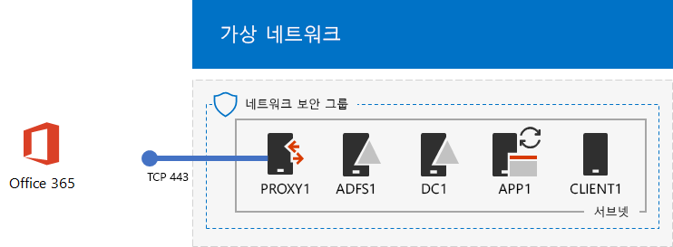
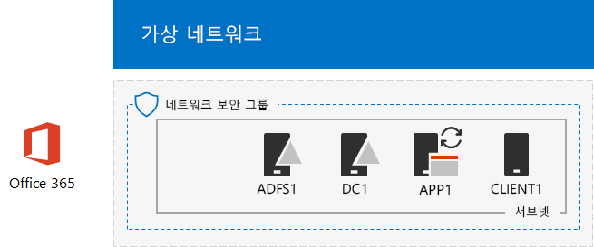

# <a name="federated-identity-for-your-office-365-devtest-environment"></a><span data-ttu-id="f0f56-103">Office 365 개발/테스트 환경에 대 한 페더레이션된 id</span><span class="sxs-lookup"><span data-stu-id="f0f56-103">Federated identity for your Office 365 dev/test environment</span></span>

 <span data-ttu-id="f0f56-104">**요약:** Office 365 개발/테스트 환경에 대 한 연결 된 인증을 구성 합니다.</span><span class="sxs-lookup"><span data-stu-id="f0f56-104">**Summary:** Configure federated authentication for your Office 365 dev/test environment.</span></span>
  
<span data-ttu-id="f0f56-p101">Office 365 페더레이션된 id를 지원합니다. 이 자격 증명의 유효성 검사를 자체 수행 하는 대신 Office 365 연결 하는 사용자를 참조 Office 365에서 트러스트 된 연결 된 인증 서버를 의미 합니다. 사용자의 자격 증명이 올바른지, 연결 된 인증 서버 클라이언트 다음에 전송 하는 Office 365 인증 증거로 보안 토큰을 발급 합니다. 페더레이션된 id는 오프 로드 및 Office 365 구독 및 고급 보안 및 인증 시나리오에 대 한 인증의 수직 확장 수 있습니다.</span><span class="sxs-lookup"><span data-stu-id="f0f56-p101">Office 365 supports federated identity. This means that instead of performing the validation of credentials itself, Office 365 refers the connecting user to a federated authentication server that Office 365 trusts. If the user's credentials are correct, the federated authentication server issues a security token that the client then sends to Office 365 as proof of authentication. Federated identity allows for the offloading and scaling up of authentication for an Office 365 subscription and advanced authentication and security scenarios.</span></span>
  
<span data-ttu-id="f0f56-109">이 문서에서는 구성 하는 방법을 Office 365 개발/테스트 환경에 대 한 연결 된 인증 다음 그 결과 설명 합니다.</span><span class="sxs-lookup"><span data-stu-id="f0f56-109">This article describes how you can configure federated authentication for the Office 365 dev/test environment, resulting in the following:</span></span>
  
<span data-ttu-id="f0f56-110">**그림 1: Office 365 개발/테스트 환경에 대 한 연결 된 인증**</span><span class="sxs-lookup"><span data-stu-id="f0f56-110">**Figure 1: The federated authentication for Office 365 dev/test environment**</span></span>


  
<span data-ttu-id="f0f56-112">그림 1에 표시 된 구성 이루어져 있습니다.</span><span class="sxs-lookup"><span data-stu-id="f0f56-112">The configuration shown in Figure 1 consists of:</span></span> 
  
- <span data-ttu-id="f0f56-113">Office 365 e 5 평가판 구독을 만들 때에서 30 일이 지나면 만료는 합니다.</span><span class="sxs-lookup"><span data-stu-id="f0f56-113">An Office 365 E5 Trial Subscription, which expires 30 days from when you create it.</span></span>
    
- <span data-ttu-id="f0f56-p102">간소화 된 조직 인트라넷 (d c 1, a p p 1, CLIENT1, ADFS1, 및 PROXY1) Azure 가상 네트워크의 서브넷에 다섯 개의 가상 컴퓨터의 구성 되는 인터넷에 연결 합니다. Azure AD 연결 Office 365에 Windows Server AD 도메인의 계정 목록을 동기화 하는 a p p 1을 실행 합니다. PROXY1 들어오는 인증 요청을 받습니다. ADFS1 d c 1에 자격 증명의 유효성을 검사 하 고 보안 토큰을 발급 합니다.</span><span class="sxs-lookup"><span data-stu-id="f0f56-p102">A simplified organization intranet connected to the Internet, consisting of five virtual machines on a subnet of an Azure virtual network (DC1, APP1, CLIENT1, ADFS1, and PROXY1). Azure AD Connect runs on APP1 to synchronize the list of accounts in the Windows Server AD domain to Office 365. PROXY1 receives the incoming authentication requests. ADFS1 validates credentials with DC1 and issues security tokens.</span></span>
    
<span data-ttu-id="f0f56-118">이 개발/테스트 환경 설정에 다섯 단계로 가지가 있습니다.</span><span class="sxs-lookup"><span data-stu-id="f0f56-118">There are five phases to setting up this dev/test environment:</span></span>
  
1. <span data-ttu-id="f0f56-119">DirSync를 사용한 시뮬레이션 된 엔터프라이즈 Office 365 개발/테스트 환경 만들기</span><span class="sxs-lookup"><span data-stu-id="f0f56-119">Create the simulated enterprise Office 365 dev/test environment with DirSync.</span></span>
    
2. <span data-ttu-id="f0f56-120">AD FS 서버 (ADFS1)를 만듭니다.</span><span class="sxs-lookup"><span data-stu-id="f0f56-120">Create the AD FS server (ADFS1).</span></span>
    
3. <span data-ttu-id="f0f56-121">웹 프록시 서버 (PROXY1)를 만듭니다.</span><span class="sxs-lookup"><span data-stu-id="f0f56-121">Create the web proxy server (PROXY1).</span></span>
    
4. <span data-ttu-id="f0f56-122">자체 서명 된 인증서를 만들고 ADFS1 및 PROXY1를 구성 합니다.</span><span class="sxs-lookup"><span data-stu-id="f0f56-122">Create a self-signed certificate and configure ADFS1 and PROXY1.</span></span>
    
5. <span data-ttu-id="f0f56-123">페더레이션된 id에 대 한 Office 365를 구성 합니다.</span><span class="sxs-lookup"><span data-stu-id="f0f56-123">Configure Office 365 for federated identity.</span></span>
    
<span data-ttu-id="f0f56-124">Azure의 Office 365에 대 한 연결 된 인증의 프로덕션 배포를 진행 하려면 [Azure의 Office 365에 대 한 배포 고가용성 페더레이션된 인증](deploy-high-availability-federated-authentication-for-office-365-in-azure.md)을 참조 합니다.</span><span class="sxs-lookup"><span data-stu-id="f0f56-124">To step through a production deployment of federated authentication for Office 365 in Azure, see [Deploy high availability federated authentication for Office 365 in Azure](deploy-high-availability-federated-authentication-for-office-365-in-azure.md).</span></span>
  
> [!NOTE]
> <span data-ttu-id="f0f56-125">이 개발/테스트 환경 Azure 평가판 구독을 구성할 수 없습니다.</span><span class="sxs-lookup"><span data-stu-id="f0f56-125">You cannot configure this dev/test environment with an Azure Trial subscription.</span></span> 
  
> [!TIP]
> <span data-ttu-id="f0f56-126">클릭 [여기](http://aka.ms/catlgstack) 에 한 맵이 하나의 Microsoft 클라우드 테스트 랩 가이드 스택의 모든 문서를 시각적으로 표시 합니다.</span><span class="sxs-lookup"><span data-stu-id="f0f56-126">Click [here](http://aka.ms/catlgstack) for a visual map to all the articles in the One Microsoft Cloud Test Lab Guide stack.</span></span>
  
## <a name="phase-1-create-the-simulated-enterprise-office-365-devtest-environment-with-dirsync"></a><span data-ttu-id="f0f56-127">1 단계: 디렉터리 동기화와 시뮬레이션 된 엔터프라이즈 Office 365 개발/테스트 환경 만들기</span><span class="sxs-lookup"><span data-stu-id="f0f56-127">Phase 1: Create the simulated enterprise Office 365 dev/test environment with DirSync</span></span>

<span data-ttu-id="f0f56-128">디렉터리 동기화 서버 및 Office 365와 Windows Server AD 간의 동기화 된 id로 a p p 1으로 시뮬레이션 된 엔터프라이즈 Office 365 개발/테스트 환경 만들기를 [Office 365 개발/테스트 환경에 대 한 디렉터리 동기화](dirsync-for-your-office-365-dev-test-environment.md) 의 지침에 따라 d c 1에 대 한 계정입니다.</span><span class="sxs-lookup"><span data-stu-id="f0f56-128">Follow the instructions in [DirSync for your Office 365 dev/test environment](dirsync-for-your-office-365-dev-test-environment.md) to create the simulated enterprise Office 365 dev/test environment with APP1 as the DirSync server and synchronized identity between Office 365 and the Windows Server AD accounts on DC1.</span></span>
  
<span data-ttu-id="f0f56-p103">다음으로 새 공용 DNS 도메인 이름을 기준으로 현재 도메인 이름을 만들고 Office 365 구독을 추가 합니다. 이름을 사용 하는 것이 좋습니다 **테스트 실습.** \<공용 도메인 >. 예, 공용 도메인 이름이 contoso.com 이면 공용 도메인 이름 testlab.contoso.com를 추가 합니다.</span><span class="sxs-lookup"><span data-stu-id="f0f56-p103">Next, create a new public DNS domain name based on your current domain name and add it to your Office 365 subscription. We recommend using the name **testlab.**\<your public domain>. For example, if your public domain name is contoso.com, add the public domain name testlab.contoso.com.</span></span>
  
<span data-ttu-id="f0f56-132">DNS 공급자에서 올바른 DNS 레코드를 만들고 Office 365 평가판 구독에 도메인을 추가 하는 방법에 대 한 지침을 [사용자 추가 및 Office 365에 도메인을](https://support.office.com/article/Add-users-and-domain-to-Office-365-6383f56d-3d09-4dcb-9b41-b5f5a5efd611)참조 하십시오.</span><span class="sxs-lookup"><span data-stu-id="f0f56-132">For instructions on how to create the correct DNS records in your DNS provider and add the domain to your Office 365 trial subscription, see [Add users and domain to Office 365](https://support.office.com/article/Add-users-and-domain-to-Office-365-6383f56d-3d09-4dcb-9b41-b5f5a5efd611).</span></span> 
  
<span data-ttu-id="f0f56-133">구성 결과는 다음과 같습니다.</span><span class="sxs-lookup"><span data-stu-id="f0f56-133">Here is your resulting configuration.</span></span>
  
<span data-ttu-id="f0f56-134">**Office 365 개발/테스트 환경에 대 한 그림 2: 디렉터리 동기화**</span><span class="sxs-lookup"><span data-stu-id="f0f56-134">**Figure 2: DirSync for Office 365 dev/test environment**</span></span>


  
<span data-ttu-id="f0f56-136">그림 2는 Azure 가상 네트워크의 Office 365 및 CLIENT1, a p p 1을 및 d c 1에 가상 컴퓨터를 포함 하는 Office 365 개발/테스트 환경에 대 한 디렉터리 동기화를 보여줍니다.</span><span class="sxs-lookup"><span data-stu-id="f0f56-136">Figure 2 shows the DirSync for Office 365 dev/test environment, which includes Office 365 and CLIENT1, APP1, and DC1 virtual machines in an Azure virtual network.</span></span>
  
## <a name="phase-2-create-the-ad-fs-server"></a><span data-ttu-id="f0f56-137">2 단계: AD FS 서버 만들기</span><span class="sxs-lookup"><span data-stu-id="f0f56-137">Phase 2: Create the AD FS server</span></span>

<span data-ttu-id="f0f56-138">AD FS 서버는 Office 365와 d c 1에서 호스팅되는 corp.contoso.com 도메인의 계정 간의 연결 된 인증을 제공 합니다.</span><span class="sxs-lookup"><span data-stu-id="f0f56-138">An AD FS server provides federated authentication between Office 365 and the accounts in the corp.contoso.com domain hosted on DC1.</span></span>
  
<span data-ttu-id="f0f56-139">ADFS1에 대 한 Azure 가상 컴퓨터를 만들려면 구독 및 자원 그룹 및 사용자 기본 구성에 대 한 Azure 위치의 이름을 입력 하 고 로컬 컴퓨터에서 이러한 명령을 Azure PowerShell 명령 프롬프트에서 다음 실행 합니다.</span><span class="sxs-lookup"><span data-stu-id="f0f56-139">To create an Azure virtual machine for ADFS1, fill in the name of your subscription and the resource group and Azure location for your Base Configuration, and then run these commands at the Azure PowerShell command prompt on your local computer.</span></span>
  
```
$subscr="<your Azure subscription name>"
$rgName="<the resource group name of your Base Configuration>"
Login-AzureRMAccount
Get-AzureRmSubscription -SubscriptionName $subscr | Select-AzureRmSubscription
$staticIP="10.0.0.100"
$locName=(Get-AzureRmResourceGroup -Name $rgName).Location
$vnet=Get-AzureRMVirtualNetwork -Name TestLab -ResourceGroupName $rgName
$pip = New-AzureRMPublicIpAddress -Name ADFS1-PIP -ResourceGroupName $rgName -Location $locName -AllocationMethod Dynamic
$nic = New-AzureRMNetworkInterface -Name ADFS1-NIC -ResourceGroupName $rgName -Location $locName -SubnetId $vnet.Subnets[0].Id -PublicIpAddressId $pip.Id -PrivateIpAddress $staticIP
$vm=New-AzureRMVMConfig -VMName ADFS1 -VMSize Standard_D2_v2
$cred=Get-Credential -Message "Type the name and password of the local administrator account for ADFS1."
$vm=Set-AzureRMVMOperatingSystem -VM $vm -Windows -ComputerName ADFS1 -Credential $cred -ProvisionVMAgent -EnableAutoUpdate
$vm=Set-AzureRMVMSourceImage -VM $vm -PublisherName MicrosoftWindowsServer -Offer WindowsServer -Skus 2016-Datacenter -Version "latest"
$vm=Add-AzureRMVMNetworkInterface -VM $vm -Id $nic.Id
$vm=Set-AzureRmVMOSDisk -VM $vm -Name "ADFS-OS" -DiskSizeInGB 128 -CreateOption FromImage -StorageAccountType "StandardLRS"
New-AzureRMVM -ResourceGroupName $rgName -Location $locName -VM $vm
```

> [!TIP]
> <span data-ttu-id="f0f56-140">클릭 [여기](https://gallery.technet.microsoft.com/PowerShell-commands-for-f79bc2c2?redir=0) 이 문서의 모든 PowerShell 명령을 포함 된 텍스트 파일을 가져오도록 합니다.</span><span class="sxs-lookup"><span data-stu-id="f0f56-140">Click [here](https://gallery.technet.microsoft.com/PowerShell-commands-for-f79bc2c2?redir=0) to get a text file that contains all the PowerShell commands in this article.</span></span>
  
<span data-ttu-id="f0f56-141">다음으로 ADFS1 로컬 관리자 계정 이름과 암호를 사용 하 여 ADFS1 가상 컴퓨터에 연결 하는 [Azure 포털](http://portal.azure.com) 을 사용 하 고 Windows PowerShell 명령 프롬프트를 엽니다.</span><span class="sxs-lookup"><span data-stu-id="f0f56-141">Next, use the [Azure portal](http://portal.azure.com) to connect to the ADFS1 virtual machine using the ADFS1 local administrator account name and password, and then open a Windows PowerShell command prompt.</span></span>
  
<span data-ttu-id="f0f56-142">ADFS1 및 d c 1 간의 이름 확인 및 네트워크 통신을 확인 하려면 **ping dc1.corp.contoso.com** 명령을 실행 하 고 응답을 4 번 남아 있지 않은지 확인 합니다.</span><span class="sxs-lookup"><span data-stu-id="f0f56-142">To check name resolution and network communication between ADFS1 and DC1, run the **ping dc1.corp.contoso.com** command and verify that there are four replies.</span></span>
  
<span data-ttu-id="f0f56-143">다음으로, ADFS1에서 Windows PowerShell 프롬프트에 다음이 명령 사용 하 여 회사 도메인에 ADFS1 가상 컴퓨터에 참가 합니다.</span><span class="sxs-lookup"><span data-stu-id="f0f56-143">Next, join the ADFS1 virtual machine to the CORP domain with these commands at the Windows PowerShell prompt on ADFS1.</span></span>
  
```
$cred=Get-Credential -UserName "CORP\\User1" -Message "Type the User1 account password."
Add-Computer -DomainName corp.contoso.com -Credential $cred
Restart-Computer
```

<span data-ttu-id="f0f56-144">구성 결과는 다음과 같습니다.</span><span class="sxs-lookup"><span data-stu-id="f0f56-144">Here is your resulting configuration.</span></span>
  
<span data-ttu-id="f0f56-145">**그림 3: AD FS 서버 추가 (영문)**</span><span class="sxs-lookup"><span data-stu-id="f0f56-145">**Figure 3: Adding the AD FS server**</span></span>


  
<span data-ttu-id="f0f56-147">그림 3은 Office 365 개발/테스트 환경에 대 한 디렉터리 동기화를 ADFS1 서버 추가 보여줍니다.</span><span class="sxs-lookup"><span data-stu-id="f0f56-147">Figure 3 shows the addition of the ADFS1 server to the DirSync for Office 365 dev/test environment.</span></span>
  
## <a name="phase-3-create-the-web-proxy-server"></a><span data-ttu-id="f0f56-148">3 단계: 웹 프록시 서버를 만들기</span><span class="sxs-lookup"><span data-stu-id="f0f56-148">Phase 3: Create the web proxy server</span></span>

<span data-ttu-id="f0f56-149">PROXY1은 사용자 인증을 시도 하 고 ADFS1 간에 인증 메시지의 프록시를 제공 합니다.</span><span class="sxs-lookup"><span data-stu-id="f0f56-149">PROXY1 provides proxying of authentication messages between users attempting to authenticate and ADFS1.</span></span>
  
<span data-ttu-id="f0f56-150">PROXY1에 대 한 Azure 가상 컴퓨터를 만들려면 자원 그룹 및 Azure 위치의 이름을 입력 하 고 로컬 컴퓨터에서 이러한 명령을 Azure PowerShell 명령 프롬프트에서 다음 실행 합니다.</span><span class="sxs-lookup"><span data-stu-id="f0f56-150">To create an Azure virtual machine for PROXY1, fill in the name of your resource group and Azure location, and then run these commands at the Azure PowerShell command prompt on your local computer.</span></span>
  
```
$rgName="<the resource group name of your Base Configuration>"
$staticIP="10.0.0.101"
$locName=(Get-AzureRmResourceGroup -Name $rgName).Location
$vnet=Get-AzureRMVirtualNetwork -Name TestLab -ResourceGroupName $rgName
$pip = New-AzureRMPublicIpAddress -Name PROXY1-PIP -ResourceGroupName $rgName -Location $locName -AllocationMethod Static
$nic = New-AzureRMNetworkInterface -Name PROXY1-NIC -ResourceGroupName $rgName -Location $locName -SubnetId $vnet.Subnets[0].Id -PublicIpAddressId $pip.Id -PrivateIpAddress $staticIP
$vm=New-AzureRMVMConfig -VMName PROXY1 -VMSize Standard_D2_v2
$cred=Get-Credential -Message "Type the name and password of the local administrator account for PROXY1."
$vm=Set-AzureRMVMOperatingSystem -VM $vm -Windows -ComputerName PROXY1 -Credential $cred -ProvisionVMAgent -EnableAutoUpdate
$vm=Set-AzureRMVMSourceImage -VM $vm -PublisherName MicrosoftWindowsServer -Offer WindowsServer -Skus 2016-Datacenter -Version "latest"
$vm=Add-AzureRMVMNetworkInterface -VM $vm -Id $nic.Id
$vm=Set-AzureRmVMOSDisk -VM $vm -Name "PROXY1-OS" -DiskSizeInGB 128 -CreateOption FromImage -StorageAccountType "StandardLRS"
New-AzureRMVM -ResourceGroupName $rgName -Location $locName -VM $vm
```

> [!NOTE]
> <span data-ttu-id="f0f56-151">PROXY1은 PROXY1 가상 컴퓨터를 다시 시작 하는 경우, 그리고 그 포인트 바꾸어야 하는 공용 DNS 레코드를 만들어야 하므로 고정 공용 IP 주소를 할당 됩니다.</span><span class="sxs-lookup"><span data-stu-id="f0f56-151">PROXY1 is assigned a static public IP address because you will create a public DNS record that points to it and it must not change when you restart the PROXY1 virtual machine.</span></span> 
  
<span data-ttu-id="f0f56-p104">다음으로, PROXY1의 개인 IP 주소 및 TCP 포트 443 인터넷에서 원하지 않는 인바운드 트래픽 허용 하는 회사 서브넷에 대 한 네트워크 보안 그룹에 규칙을 추가 합니다. Azure PowerShell 명령 프롬프트에서 로컬 컴퓨터에서 이러한 명령을 실행 합니다.</span><span class="sxs-lookup"><span data-stu-id="f0f56-p104">Next, add a rule to the network security group for the CorpNet subnet to allow unsolicited inbound traffic from the Internet to PROXY1's private IP address and TCP port 443. Run these commands at the Azure PowerShell command prompt on your local computer.</span></span>
  
```
$rgName="<the resource group name of your Base Configuration>"
Get-AzureRmNetworkSecurityGroup -Name CorpNet -ResourceGroupName $rgName | Add-AzureRmNetworkSecurityRuleConfig -Name "HTTPS-to-PROXY1" -Description "Allow TCP 443 to PROXY1" -Access "Allow" -Protocol "Tcp" -Direction "Inbound" -Priority 101 -SourceAddressPrefix "Internet" -SourcePortRange "*" -DestinationAddressPrefix "10.0.0.101" -DestinationPortRange "443" | Set-AzureRmNetworkSecurityGroup
```

<span data-ttu-id="f0f56-154">다음으로 [Azure 포털](http://portal.azure.com) 을 사용 하 여 PROXY1 로컬 관리자 계정 이름과 암호를 사용 하 여 PROXY1 가상 컴퓨터에 연결할 하 고 PROXY1에서 Windows PowerShell 명령 프롬프트를 엽니다.</span><span class="sxs-lookup"><span data-stu-id="f0f56-154">Next, use the [Azure portal](http://portal.azure.com) to connect to the PROXY1 virtual machine using the PROXY1 local administrator account name and password, and then open a Windows PowerShell command prompt on PROXY1.</span></span>
  
<span data-ttu-id="f0f56-155">PROXY1 및 d c 1 간의 이름 확인 및 네트워크 통신을 확인 하려면 **ping dc1.corp.contoso.com** 명령을 실행 하 고 응답을 4 번 남아 있지 않은지 확인 합니다.</span><span class="sxs-lookup"><span data-stu-id="f0f56-155">To check name resolution and network communication between PROXY1 and DC1, run the **ping dc1.corp.contoso.com** command and verify that there are four replies.</span></span>
  
<span data-ttu-id="f0f56-156">다음으로, PROXY1에서 Windows PowerShell 프롬프트에 다음이 명령 사용 하 여 회사 도메인에 PROXY1 가상 컴퓨터에 참가 합니다.</span><span class="sxs-lookup"><span data-stu-id="f0f56-156">Next, join the PROXY1 virtual machine to the CORP domain with these commands at the Windows PowerShell prompt on PROXY1.</span></span>
  
```
$cred=Get-Credential -UserName "CORP\\User1" -Message "Type the User1 account password."
Add-Computer -DomainName corp.contoso.com -Credential $cred
Restart-Computer
```

<span data-ttu-id="f0f56-157">로컬 컴퓨터에서 이러한 Azure PowerShell 명령으로 PROXY1의 공용 IP 주소를 표시 합니다.</span><span class="sxs-lookup"><span data-stu-id="f0f56-157">Display the public IP address of PROXY1 with these Azure PowerShell commands on your local computer:</span></span>
  
```
Write-Host (Get-AzureRMPublicIpaddress -Name "PROXY1-PIP" -ResourceGroup $rgName).IPAddress
```

<span data-ttu-id="f0f56-p105">다음으로, 공용 DNS 공급자를 사용 하 고에 대 한 새 공용 DNS A 레코드를 만들려면 **fs.testlab.** \<DNS 도메인 이름을 > **쓰기 호스트** 명령에 의해 표시 되는 IP 주소를 확인 하는 합니다. **fs.testlab.** \<DNS 도메인 이름 >이 *페더레이션 서비스 FQDN으로* 참조 합니다.</span><span class="sxs-lookup"><span data-stu-id="f0f56-p105">Next, work with your public DNS provider and create a new public DNS A record for **fs.testlab.**\<your DNS domain name> that resolves to the IP address displayed by the **Write-Host** command. The **fs.testlab.**\<your DNS domain name> is hereafter referred to as the  *federation service FQDN*  .</span></span>
  
<span data-ttu-id="f0f56-160">다음으로 [Azure 포털](http://portal.azure.com) 을 사용 하 여는 회사를 사용 하 여 d c 1에 가상 컴퓨터에 연결할\\저장 된 관리자 수준 Windows PowerShell 명령 프롬프트에서 명령을 User1 자격 증명 하 고 다음을 실행 합니다.</span><span class="sxs-lookup"><span data-stu-id="f0f56-160">Next, use the [Azure portal](http://portal.azure.com) to connect to the DC1 virtual machine using the CORP\\User1 credentials, and then run the following commands at an administrator-level Windows PowerShell command prompt:</span></span>
  
```
$testZone="<the FQDN of your testlab domain from phase 1, example: testlab.contoso.com>"
$testZoneFile= $testZone + ".dns"
Add-DnsServerPrimaryZone -Name $testZone -ZoneFile $testZoneFile
Add-DnsServerResourceRecordA -Name "fs" -ZoneName $testZone -AllowUpdateAny -IPv4Address "10.0.0.100" -TimeToLive 01:00:00
```

<span data-ttu-id="f0f56-161">이러한 명령은 페더레이션 서비스 Azure 가상 네트워크에서 가상 컴퓨터 ADFS1의 개인 IP 주소를 확인할 수 있는 FQDN에 대 한 DNS A 레코드를 만듭니다.</span><span class="sxs-lookup"><span data-stu-id="f0f56-161">These commands create a DNS A record for your federation service FQDN that virtual machines on the Azure virtual network can resolve to ADFS1's private IP address.</span></span>
  
<span data-ttu-id="f0f56-162">구성 결과는 다음과 같습니다.</span><span class="sxs-lookup"><span data-stu-id="f0f56-162">Here is your resulting configuration.</span></span>
  
<span data-ttu-id="f0f56-163">**그림 4: 웹 응용 프로그램 프록시 서버 추가 (영문)**</span><span class="sxs-lookup"><span data-stu-id="f0f56-163">**Figure 4: Adding the web application proxy server**</span></span>


  
<span data-ttu-id="f0f56-165">그림 4 PROXY1 서버 추가 보여줍니다.</span><span class="sxs-lookup"><span data-stu-id="f0f56-165">Figure 4 shows the addition of the PROXY1 server.</span></span>
  
## <a name="phase-4-create-a-self-signed-certificate-and-configure-adfs1-and-proxy1"></a><span data-ttu-id="f0f56-166">4 단계: 자체 서명 된 인증서를 만들고 ADFS1 및 PROXY1 구성</span><span class="sxs-lookup"><span data-stu-id="f0f56-166">Phase 4: Create a self-signed certificate and configure ADFS1 and PROXY1</span></span>

<span data-ttu-id="f0f56-167">이 단계에서 자체 서명 된 디지털 인증서를 페더레이션 서비스 FQDN에 대 한 만들고 AD FS 팜으로 ADFS1 및 PROXY1를 구성 합니다.</span><span class="sxs-lookup"><span data-stu-id="f0f56-167">In this phase, you create a self-signed digital certificate for your federation service FQDN and configure ADFS1 and PROXY1 as an AD FS farm.</span></span>
  
<span data-ttu-id="f0f56-168">먼저, [Azure 포털](http://portal.azure.com) 을 사용 하 여는 회사를 사용 하 여 d c 1에 가상 컴퓨터에 연결할\\User1 자격 증명 및 다음 열기를 관리자 수준 Windows PowerShell 명령 프롬프트입니다.</span><span class="sxs-lookup"><span data-stu-id="f0f56-168">First, use the [Azure portal](http://portal.azure.com) to connect to the DC1 virtual machine using the CORP\\User1 credentials, and then open an administrator-level Windows PowerShell command prompt.</span></span>
  
<span data-ttu-id="f0f56-169">D c 1에서 Windows PowerShell 명령 프롬프트에서이 명령을 사용 하 여 AD FS 서비스 계정을 다음으로 만듭니다.</span><span class="sxs-lookup"><span data-stu-id="f0f56-169">Next, create AD FS service account with this command at the Windows PowerShell command prompt on DC1:</span></span>
  
```
New-ADUser -SamAccountName ADFS-Service -AccountPassword (read-host "Set user password" -assecurestring) -name "ADFS-Service" -enabled $true -PasswordNeverExpires $true -ChangePasswordAtLogon $false
```

<span data-ttu-id="f0f56-p106">이 명령은 계정 암호를 입력 하 게 묻는 메모 합니다. 강력한 암호를 선택 하 고 안전한 위치에 기록 합니다. 이 단계와 5 단계에 대 한 할 수 있습니다.</span><span class="sxs-lookup"><span data-stu-id="f0f56-p106">Note that this command prompts you to supply the account password. Choose a strong password and record it in a secured location. You will need it for this phase and Phase 5.</span></span>
  
<span data-ttu-id="f0f56-p107">[Azure 포털](http://portal.azure.com) 을 사용 하 여는 회사를 사용 하 여 ADFS1 가상 컴퓨터에 연결할\\User1 자격 증명입니다. ADFS1에서 관리자 수준 Windows PowerShell 명령 프롬프트를 열고, 페더레이션 서비스 FQDN 입력 하 고 자체 서명 된 인증서를 만들려면 다음이 명령을 실행 합니다.</span><span class="sxs-lookup"><span data-stu-id="f0f56-p107">Use the [Azure portal](http://portal.azure.com) to connect to the ADFS1 virtual machine using the CORP\\User1 credentials. Open an administrator-level Windows PowerShell command prompt on ADFS1, fill in your federation service FQDN, and then run these commands to create a self-signed certificate:</span></span>
  
```
$fedServiceFQDN="<federation service FQDN>"
New-SelfSignedCertificate -DnsName $fedServiceFQDN -CertStoreLocation "cert:\\LocalMachine\\My"
New-Item -path c:\\Certs -type directory
New-SmbShare -name Certs -path c:\\Certs -changeaccess CORP\\User1
```

<span data-ttu-id="f0f56-175">다음으로 새 자체 서명 된 인증서를 파일로 저장 하려면 다음이 단계를 사용 합니다.</span><span class="sxs-lookup"><span data-stu-id="f0f56-175">Next, use these steps to save the new self-signed certificate as a file.</span></span>
  
1. <span data-ttu-id="f0f56-176">**시작**을 클릭 하 고 **mmc.exe**입력 한 다음 **Enter**키를 누릅니다.</span><span class="sxs-lookup"><span data-stu-id="f0f56-176">Click **Start**, type **mmc.exe**, and then press **Enter**.</span></span>
    
2. <span data-ttu-id="f0f56-177">클릭 **파일 > 스냅인 추가/제거**합니다.</span><span class="sxs-lookup"><span data-stu-id="f0f56-177">Click **File > Add/Remove Snap-in**.</span></span>
    
3. <span data-ttu-id="f0f56-178">**추가 또는 제거 스냅인에서**사용 가능한 스냅인 목록에서 **인증서** 를 두번클릭, **컴퓨터 계정**을 클릭 하 고 ****을 클릭 합니다.</span><span class="sxs-lookup"><span data-stu-id="f0f56-178">In **Add or Remove Snap-ins**, double-click **Certificates** in the list of available snap-ins, click **Computer account**, and then click **Next**.</span></span>
    
4. <span data-ttu-id="f0f56-179">**컴퓨터 선택** **완료 날짜**를 클릭 한 다음 **확인**을 클릭 합니다.</span><span class="sxs-lookup"><span data-stu-id="f0f56-179">In **Select Computer**, click **Finish**, and then click **OK**.</span></span>
    
5. <span data-ttu-id="f0f56-180">트리 창에서 엽니다 **인증서 (로컬 컴퓨터) > 개인 > 인증서**합니다.</span><span class="sxs-lookup"><span data-stu-id="f0f56-180">In the tree pane, open **Certificates (Local Computer) > Personal > Certificates**.</span></span>
    
6. <span data-ttu-id="f0f56-181">페더레이션 서비스 FQDN 사용 하 여 인증서를 마우스 오른쪽 단추로 클릭 하 고 **모든 작업**을 클릭 한 다음 **내보내기를**클릭 합니다.</span><span class="sxs-lookup"><span data-stu-id="f0f56-181">Right-click the certificate with your federation service FQDN, click **All tasks**, and then click **Export**.</span></span>
    
7. <span data-ttu-id="f0f56-182">**시작** 페이지에서 **다음**을 클릭 합니다.</span><span class="sxs-lookup"><span data-stu-id="f0f56-182">On the **Welcome** page, click **Next**.</span></span>
    
8. <span data-ttu-id="f0f56-183">**개인 키 내보내기** 페이지에서 **예**를 클릭 하 고 ****을 클릭 합니다.</span><span class="sxs-lookup"><span data-stu-id="f0f56-183">On the **Export Private Key** page, click **Yes**, and then click **Next**.</span></span>
    
9. <span data-ttu-id="f0f56-184">**파일 내보내기 형식** 페이지에서 **모든 확장 된 속성 내보내기**를 클릭 하 고 ****을 클릭 합니다.</span><span class="sxs-lookup"><span data-stu-id="f0f56-184">On the **Export File Format** page, click **Export all extended properties**, and then click **Next**.</span></span>
    
10. <span data-ttu-id="f0f56-185">**보안** 페이지에서 **암호** 및 **암호** 에 암호를 입력 하 고 **암호 확인.**</span><span class="sxs-lookup"><span data-stu-id="f0f56-185">On the **Security** page, click **Password** and type a password in **Password** and **Confirm password.**</span></span>
    
11. <span data-ttu-id="f0f56-186">**내보낼 파일** 페이지에서 **찾아보기**를 클릭 합니다.</span><span class="sxs-lookup"><span data-stu-id="f0f56-186">On the **File to Export** page, click **Browse**.</span></span>
    
12. <span data-ttu-id="f0f56-187">이동은 **c:\\인증서** **파일 이름** **SSL** 을 입력 하 고 다음을 클릭 하는 폴더를 **저장.**</span><span class="sxs-lookup"><span data-stu-id="f0f56-187">Browse to the **C:\\Certs** folder, type **SSL** in **File name**, and then click **Save.**</span></span>
    
13. <span data-ttu-id="f0f56-188">**내보낼 파일** 페이지에서 **다음**을 클릭 합니다.</span><span class="sxs-lookup"><span data-stu-id="f0f56-188">On the **File to Export** page, click **Next**.</span></span>
    
14. <span data-ttu-id="f0f56-p108">**인증서 내보내기 마법사 완료** 페이지에서 **마침**을 클릭 합니다. 대화 상자가 나타나면 **확인**을 클릭 합니다.</span><span class="sxs-lookup"><span data-stu-id="f0f56-p108">On the **Completing the Certificate Export Wizard** page, click **Finish**. When prompted, click **OK**.</span></span>
    
<span data-ttu-id="f0f56-191">다음으로, ADFS1에서 Windows PowerShell 명령 프롬프트에서이 명령을 사용 하 여 AD FS 서비스를 설치 합니다.</span><span class="sxs-lookup"><span data-stu-id="f0f56-191">Next, install the AD FS service with this command at the Windows PowerShell command prompt on ADFS1:</span></span>
  
```
Install-WindowsFeature ADFS-Federation -IncludeManagementTools
```

<span data-ttu-id="f0f56-192">설치를 완료 될 때까지 기다립니다.</span><span class="sxs-lookup"><span data-stu-id="f0f56-192">Wait for the installation to complete.</span></span>
  
<span data-ttu-id="f0f56-193">다음, 다음이 단계와 AD FS 서비스를 구성 합니다.</span><span class="sxs-lookup"><span data-stu-id="f0f56-193">Next, configure the AD FS service with these steps:</span></span>
  
1. <span data-ttu-id="f0f56-194">**시작**을 클릭 한 다음 **서버 관리자** 아이콘을 클릭 합니다.</span><span class="sxs-lookup"><span data-stu-id="f0f56-194">Click **Start**, and then click the **Server Manager** icon.</span></span>
    
2. <span data-ttu-id="f0f56-195">서버 관리자의 트리 창에서 **AD FS**를 클릭 합니다.</span><span class="sxs-lookup"><span data-stu-id="f0f56-195">In the tree pane of Server Manager, click **AD FS**.</span></span>
    
3. <span data-ttu-id="f0f56-196">맨 위쪽에 있는 도구 모음에서 주황색 주의 기호를 클릭 하 고 **이 서버에서 페더레이션 서비스 구성**을 클릭 합니다.</span><span class="sxs-lookup"><span data-stu-id="f0f56-196">In the tool bar at the top, click the orange caution symbol, and then click **Configure the federation service on this server**.</span></span>
    
4. <span data-ttu-id="f0f56-197">Active Directory Federation Services 구성 마법사의 **시작** 페이지에서 **다음**을 클릭 합니다.</span><span class="sxs-lookup"><span data-stu-id="f0f56-197">On the **Welcome** page of the Active Directory Federation Services Configuration Wizard, click **Next**.</span></span>
    
5. <span data-ttu-id="f0f56-198">**AD DS에 연결** 페이지에서 **다음**을 클릭 합니다.</span><span class="sxs-lookup"><span data-stu-id="f0f56-198">On the **Connect to AD DS** page, click **Next**.</span></span>
    
6. <span data-ttu-id="f0f56-199">**서비스 속성 지정** 페이지 수행 합니다.</span><span class="sxs-lookup"><span data-stu-id="f0f56-199">On the **Specify Service Properties** page:</span></span>
    
  - <span data-ttu-id="f0f56-200">**SSL 인증서**대 한 아래쪽 화살표를 클릭 하 고 FQDN 페더레이션 서비스의 이름 사용 하 여 인증서를 클릭 합니다.</span><span class="sxs-lookup"><span data-stu-id="f0f56-200">For **SSL Certificate**, click the down arrow, and then click the certificate with the name of your federation service FQDN.</span></span>
    
  - <span data-ttu-id="f0f56-201">**페더레이션 서비스 표시 이름**가상의 조직 이름을 입력 합니다.</span><span class="sxs-lookup"><span data-stu-id="f0f56-201">In **Federation Service Display Name**, type the name of your fictional organization.</span></span>
    
  - <span data-ttu-id="f0f56-202">**다음**을 클릭합니다.</span><span class="sxs-lookup"><span data-stu-id="f0f56-202">Click **Next**.</span></span>
    
7. <span data-ttu-id="f0f56-203">**서비스 계정 지정** 페이지에서 **계정 이름**에 대 한 **선택** 을 클릭 합니다.</span><span class="sxs-lookup"><span data-stu-id="f0f56-203">On the **Specify Service Account** page, click **Select** for **Account name**.</span></span>
    
8. <span data-ttu-id="f0f56-204">**사용자 선택 또는 서비스 계정에서** **ADFS 서비스**를 입력 하 고 **이름 확인**을 클릭 한 다음 **확인**을 클릭 합니다.</span><span class="sxs-lookup"><span data-stu-id="f0f56-204">In **Select User or Service Account**, type **ADFS-Service**, click **Check Names**, and then click **OK**.</span></span>
    
9. <span data-ttu-id="f0f56-205">**계정 암호**ADFS 서비스 계정에 대 한 암호를 입력 하 고 ****을 클릭 합니다.</span><span class="sxs-lookup"><span data-stu-id="f0f56-205">In **Account Password**, type the password for the ADFS-Service account, and then click **Next**.</span></span>
    
10. <span data-ttu-id="f0f56-206">**구성 데이터베이스 지정** 페이지에서 **다음**을 클릭 합니다.</span><span class="sxs-lookup"><span data-stu-id="f0f56-206">On the **Specify Configuration Database** page, click **Next**.</span></span>
    
11. <span data-ttu-id="f0f56-207">**검토 옵션** 페이지에서 **다음**을 클릭 합니다.</span><span class="sxs-lookup"><span data-stu-id="f0f56-207">On the **Review Options** page, click **Next**.</span></span>
    
12. <span data-ttu-id="f0f56-208">**필수 확인** 페이지에서 **구성**을 클릭 합니다.</span><span class="sxs-lookup"><span data-stu-id="f0f56-208">On the **Pre-requisite Checks** page, click **Configure**.</span></span>
    
13. <span data-ttu-id="f0f56-209">**결과** 페이지에서 **닫기를**클릭 합니다.</span><span class="sxs-lookup"><span data-stu-id="f0f56-209">On the **Results** page, click **Close**.</span></span>
    
14. <span data-ttu-id="f0f56-210">**시작**을 클릭 전원 아이콘을 클릭 **를 다시 시작**을 클릭 한 다음 **계속**을 클릭 합니다.</span><span class="sxs-lookup"><span data-stu-id="f0f56-210">Click **Start**, click the power icon, click **Restart**, and then click **Continue**.</span></span>
    
<span data-ttu-id="f0f56-211">[Azure 포털](http://portal.azure.com)PROXY1는 회사와 연결\\User1 계정 자격 증명입니다.</span><span class="sxs-lookup"><span data-stu-id="f0f56-211">From the [Azure portal](http://portal.azure.com), connect to PROXY1 with the CORP\\User1 account credentials.</span></span>
  
<span data-ttu-id="f0f56-212">다음으로, 다음이 단계를 사용 하 여 자체 서명 된 인증서를 설치 하 고 PROXY1를 구성 합니다.</span><span class="sxs-lookup"><span data-stu-id="f0f56-212">Next, use these steps to install the self-signed certificate and configure PROXY1.</span></span>
  
1. <span data-ttu-id="f0f56-213">**시작**을 클릭 하 고 **mmc.exe**입력 한 다음 **Enter**키를 누릅니다.</span><span class="sxs-lookup"><span data-stu-id="f0f56-213">Click **Start**, type **mmc.exe**, and then press **Enter**.</span></span>
    
2. <span data-ttu-id="f0f56-214">클릭 **파일 > 스냅인 추가/제거**합니다.</span><span class="sxs-lookup"><span data-stu-id="f0f56-214">Click **File > Add/Remove Snap-in**.</span></span>
    
3. <span data-ttu-id="f0f56-215">**추가 또는 제거 스냅인에서**사용 가능한 스냅인 목록에서 **인증서** 를 두번클릭, **컴퓨터 계정**을 클릭 하 고 ****을 클릭 합니다.</span><span class="sxs-lookup"><span data-stu-id="f0f56-215">In **Add or Remove Snap-ins**, double-click **Certificates** in the list of available snap-ins, click **Computer account**, and then click **Next**.</span></span>
    
4. <span data-ttu-id="f0f56-216">**컴퓨터 선택** **완료 날짜**를 클릭 한 다음 **확인**을 클릭 합니다.</span><span class="sxs-lookup"><span data-stu-id="f0f56-216">In **Select Computer**, click **Finish**, and then click **OK**.</span></span>
    
5. <span data-ttu-id="f0f56-217">트리 창에서 엽니다 **인증서 (로컬 컴퓨터) > 개인 > 인증서**합니다.</span><span class="sxs-lookup"><span data-stu-id="f0f56-217">In the tree pane, open **Certificates (Local Computer) > Personal > Certificates**.</span></span>
    
6. <span data-ttu-id="f0f56-218">**개인**을 마우스 오른쪽 단추로 클릭 하 고 **모든 작업**을 클릭 한 다음 **가져오기**를 클릭 합니다.</span><span class="sxs-lookup"><span data-stu-id="f0f56-218">Right-click **Personal**, click **All tasks**, and then click **Import**.</span></span>
    
7. <span data-ttu-id="f0f56-219">**시작** 페이지에서 **다음**을 클릭 합니다.</span><span class="sxs-lookup"><span data-stu-id="f0f56-219">On the **Welcome** page, click **Next**.</span></span>
    
8. <span data-ttu-id="f0f56-220">**가져올 파일** 페이지에서 입력 ** \\ \\adfs1\\인증서\\ssl.pfx**, **다음**을 클릭 합니다.</span><span class="sxs-lookup"><span data-stu-id="f0f56-220">On the **File to Import** page, type **\\\\adfs1\\certs\\ssl.pfx**, and then click **Next**.</span></span>
    
9. <span data-ttu-id="f0f56-221">**개인 키 보호** 페이지에서 **암호**인증서 암호를 입력 하 고 다음을 클릭 **다음.**</span><span class="sxs-lookup"><span data-stu-id="f0f56-221">On the **Private key protection** page, type the certificate password in **Password**, and then click **Next.**</span></span>
    
10. <span data-ttu-id="f0f56-222">**인증서 저장소** 페이지에서 다음을 클릭 **다음.**</span><span class="sxs-lookup"><span data-stu-id="f0f56-222">On the **Certificate store** page, click **Next.**</span></span>
    
11. <span data-ttu-id="f0f56-223">**완료** 페이지에서 **마침**을 클릭 합니다.</span><span class="sxs-lookup"><span data-stu-id="f0f56-223">On the **Completing** page, click **Finish**.</span></span>
    
12. <span data-ttu-id="f0f56-224">**인증서 저장소** 페이지에서 **다음**을 클릭 합니다.</span><span class="sxs-lookup"><span data-stu-id="f0f56-224">On the **Certificate Store** page, click **Next**.</span></span>
    
13. <span data-ttu-id="f0f56-225">대화 상자가 나타나면 **확인**을 클릭 합니다.</span><span class="sxs-lookup"><span data-stu-id="f0f56-225">When prompted, click **OK**.</span></span>
    
14. <span data-ttu-id="f0f56-226">트리 창에서 **인증서** 를 클릭 합니다.</span><span class="sxs-lookup"><span data-stu-id="f0f56-226">Click **Certificates** in the tree pane.</span></span>
    
15. <span data-ttu-id="f0f56-227">인증서를 마우스 오른쪽 단추로 클릭 한 다음 **복사**를 클릭 합니다.</span><span class="sxs-lookup"><span data-stu-id="f0f56-227">Right-click the certificate, and then click **Copy**.</span></span>
    
16. <span data-ttu-id="f0f56-228">트리 창에서 엽니다 **신뢰할 수 있는 루트 인증 기관 > 인증서**합니다.</span><span class="sxs-lookup"><span data-stu-id="f0f56-228">In the tree pane, open **Trusted Root Certification Authorities > Certificates**.</span></span>
    
17. <span data-ttu-id="f0f56-229">설치 된 인증서, 마우스 클릭의 목록 아래 마우스 포인터를 **붙여넣습니다**.</span><span class="sxs-lookup"><span data-stu-id="f0f56-229">Move your mouse pointer below the list of installed certificates, right-click, and then click **Paste**.</span></span>
    
<span data-ttu-id="f0f56-230">관리자 수준의 PowerShell 명령 프롬프트를 열고 다음 명령을 실행 합니다.</span><span class="sxs-lookup"><span data-stu-id="f0f56-230">Open an administrator-level PowerShell command prompt and run the following command:</span></span>
  
```
Install-WindowsFeature Web-Application-Proxy -IncludeManagementTools
```

<span data-ttu-id="f0f56-231">설치를 완료 될 때까지 기다립니다.</span><span class="sxs-lookup"><span data-stu-id="f0f56-231">Wait for the installation to complete.</span></span>
  
<span data-ttu-id="f0f56-232">다음이 단계를 사용 하 여 해당 페더레이션 서버로 ADFS1를 사용 하 여 웹 응용 프로그램 프록시 서비스를 구성 합니다.</span><span class="sxs-lookup"><span data-stu-id="f0f56-232">Use these steps to configure the web application proxy service to use ADFS1 as its federation server:</span></span>
  
1. <span data-ttu-id="f0f56-233">**시작**을 클릭 한 다음 **서버 관리자**를 클릭 합니다.</span><span class="sxs-lookup"><span data-stu-id="f0f56-233">Click **Start**, and then click **Server Manager**.</span></span>
    
2. <span data-ttu-id="f0f56-234">트리 창에서 **원격 액세스**를 클릭 합니다.</span><span class="sxs-lookup"><span data-stu-id="f0f56-234">In the tree pane, click **Remote Access**.</span></span>
    
3. <span data-ttu-id="f0f56-235">맨 위쪽에 있는 도구 모음에서 주황색 주의 기호를 클릭 한 다음 **웹 응용 프로그램 프록시 마법사 열기**를 클릭 합니다.</span><span class="sxs-lookup"><span data-stu-id="f0f56-235">In the tool bar at the top, click the orange caution symbol, and then click **Open the Web Application Proxy Wizard**.</span></span>
    
4. <span data-ttu-id="f0f56-236">웹 응용 프로그램 프록시 구성 마법사의 **시작** 페이지에서 **다음**을 클릭 합니다.</span><span class="sxs-lookup"><span data-stu-id="f0f56-236">On the **Welcome** page of the Web Application Proxy Configuration Wizard, click **Next**.</span></span>
    
5. <span data-ttu-id="f0f56-237">**페더레이션 서버** 페이지 수행 합니다.</span><span class="sxs-lookup"><span data-stu-id="f0f56-237">On the **Federation Server** page:</span></span>
    
  - <span data-ttu-id="f0f56-238">**페더레이션 서비스 이름**에 페더레이션 서비스 FQDN을 입력 합니다.</span><span class="sxs-lookup"><span data-stu-id="f0f56-238">Type your federation service FQDN in **Federation service name**.</span></span>
    
  - <span data-ttu-id="f0f56-239">형식은 **CORP\\User1** **사용자**이름에서입니다.</span><span class="sxs-lookup"><span data-stu-id="f0f56-239">Type **CORP\\User1** in **User name**.</span></span>
    
  - <span data-ttu-id="f0f56-240">**암호**에 User1 계정에 대 한 암호를 입력 합니다.</span><span class="sxs-lookup"><span data-stu-id="f0f56-240">Type the password for the User1 account in **Password**.</span></span>
    
  - <span data-ttu-id="f0f56-241">**다음**을 클릭합니다.</span><span class="sxs-lookup"><span data-stu-id="f0f56-241">Click **Next**.</span></span>
    
6. <span data-ttu-id="f0f56-242">**AD FS 프록시 인증서** 페이지에서 아래쪽 화살표를 클릭 하 고 페더레이션 서비스 FQDN 사용 하 여 인증서를 클릭 한 다음 **다음**을 클릭 합니다.</span><span class="sxs-lookup"><span data-stu-id="f0f56-242">On the **AD FS Proxy Certificate** page, click the down arrow, click the certificate with your federation service FQDN, and then click **Next**.</span></span>
    
7. <span data-ttu-id="f0f56-243">**확인** 페이지에서 **구성**을 클릭 합니다.</span><span class="sxs-lookup"><span data-stu-id="f0f56-243">On the **Confirmation** page, click **Configure**.</span></span>
    
8. <span data-ttu-id="f0f56-244">**결과** 페이지에서 **닫기를**클릭 합니다.</span><span class="sxs-lookup"><span data-stu-id="f0f56-244">On the **Results** page, click **Close**.</span></span>
    
## <a name="phase-5-configure-office-365-for-federated-identity"></a><span data-ttu-id="f0f56-245">단계 5: 페더레이션된 id에 대 한 Office 365 구성</span><span class="sxs-lookup"><span data-stu-id="f0f56-245">Phase 5: Configure Office 365 for federated identity</span></span>

<span data-ttu-id="f0f56-246">[Azure 포털](http://portal.azure.com) 을 사용 하 여는 회사와 a p p 1 가상 컴퓨터에 연결할\\User1 계정 자격 증명입니다.</span><span class="sxs-lookup"><span data-stu-id="f0f56-246">Use the [Azure portal](http://portal.azure.com) to connect to the APP1 virtual machine with the CORP\\User1 account credentials.</span></span>
  
<span data-ttu-id="f0f56-247">다음이 단계를 사용 하 여 Azure AD 연결 및 연결 된 인증에 대 한 Office 365 구독을 구성 합니다.</span><span class="sxs-lookup"><span data-stu-id="f0f56-247">Use these steps to configure Azure AD Connect and your Office 365 subscription for federated authentication:</span></span>
  
1. <span data-ttu-id="f0f56-248">바탕 화면에서 **Azure AD 연결**을 두번클릭 합니다.</span><span class="sxs-lookup"><span data-stu-id="f0f56-248">From the desktop, double-click **Azure AD Connect**.</span></span>
    
2. <span data-ttu-id="f0f56-249">**Azure AD 연결을 시작** 페이지에서 **구성**을 클릭 합니다.</span><span class="sxs-lookup"><span data-stu-id="f0f56-249">On the **Welcome to Azure AD Connect** page, click **Configure**.</span></span>
    
3. <span data-ttu-id="f0f56-250">**추가 작업** 페이지에서 **변경 사용자 로그인**을 클릭 하 고 ****을 클릭 합니다.</span><span class="sxs-lookup"><span data-stu-id="f0f56-250">On the **Additional tasks** page, click **Change user sign-in**, and then click **Next**.</span></span>
    
4. <span data-ttu-id="f0f56-251">**Azure AD에 연결** 페이지에서 Office 365 전역 관리자 계정 이름과 암호를 입력 하 고 ****을 클릭 합니다.</span><span class="sxs-lookup"><span data-stu-id="f0f56-251">On the **Connect to Azure AD** page, type your Office 365 global administrator account name and password, and then click **Next**.</span></span>
    
5. <span data-ttu-id="f0f56-252">**사용자 로그인** 페이지에서 **AD FS와의 페더레이션을 사용**을 클릭 하 고 ****을 클릭 합니다.</span><span class="sxs-lookup"><span data-stu-id="f0f56-252">On the **User sign-in** page, click **Federation with AD FS**, and then click **Next**.</span></span>
    
6. <span data-ttu-id="f0f56-253">**AD FS 팜** 페이지에서 **기존 AD FS 팜 사용**을 클릭 하, **ADFS1** **서버 이름**입력 하 고 ****을 클릭 합니다.</span><span class="sxs-lookup"><span data-stu-id="f0f56-253">On the **AD FS farm** page, click **Use an existing AD FS farm**, type **ADFS1** in **Server Name**, and then click **Next**.</span></span>
    
7. <span data-ttu-id="f0f56-254">서버 자격 증명에 대 한 대화 상자가 나타나면는 회사의 자격 증명을 입력\\User1 계정으로 한 다음 **확인**을 클릭 합니다.</span><span class="sxs-lookup"><span data-stu-id="f0f56-254">When prompted for server credentials, enter the credentials of the CORP\\User1 account, and then click **OK**.</span></span>
    
8. <span data-ttu-id="f0f56-255">**도메인 관리자** 자격 증명 페이지에서 입력 **CORP\\User1** **사용자 이름** 및 **암호**계정 암호에 **다음**을 클릭 하 고 있습니다.</span><span class="sxs-lookup"><span data-stu-id="f0f56-255">On the **Domain Administrator** credentials page, type **CORP\\User1** in **Username** and the account password in **Password**, and then click **Next**.</span></span>
    
9. <span data-ttu-id="f0f56-256">**AD FS 서비스 계정** 페이지에서 입력 **CORP\\ADFS 서비스** **도메인의 사용자 이름** 및 **도메인 사용자 암호**계정 암호에 **다음**을 클릭 하 고 있습니다.</span><span class="sxs-lookup"><span data-stu-id="f0f56-256">On the **AD FS service account** page, type **CORP\\ADFS-Service** in **Domain Username** and the account password in **Domain User Password**, and then click **Next**.</span></span>
    
10. <span data-ttu-id="f0f56-257">**도메인** **Azure AD 도메인** 페이지에서 이전에 만든 하 고 1 단계에서에서 Office 365 구독에 추가 하는 도메인의 이름을 선택 하 고 ****을 클릭 합니다.</span><span class="sxs-lookup"><span data-stu-id="f0f56-257">On the **Azure AD Domain** page, in **Domain**, select the name of the domain you previously created and added to your Office 365 subscription in Phase 1, and then click **Next**.</span></span>
    
11. <span data-ttu-id="f0f56-258">**구성 준비 완료** 페이지에서 **구성**을 클릭 합니다.</span><span class="sxs-lookup"><span data-stu-id="f0f56-258">On the **Ready to configure** page, click **Configure**.</span></span>
    
12. <span data-ttu-id="f0f56-259">**설치 완료** 페이지에서 **확인**을 클릭 합니다.</span><span class="sxs-lookup"><span data-stu-id="f0f56-259">On the **Installation complete** page, click **Verify**.</span></span>
    
    <span data-ttu-id="f0f56-260">인트라넷 및 인터넷 모두 있는지 여부를 나타내는 메시지를 참조 해야 구성 확인 되었습니다.</span><span class="sxs-lookup"><span data-stu-id="f0f56-260">You should see messages indicating that both the intranet and Internet configuration was verified.</span></span>
    
13. <span data-ttu-id="f0f56-261">**설치 완료** 페이지에서 **끝내기**를 클릭 합니다.</span><span class="sxs-lookup"><span data-stu-id="f0f56-261">On the **Installation complete** page, click **Exit**.</span></span>
    
<span data-ttu-id="f0f56-262">을 설명 하기 위해 해당 페더레이션된 인증 (영문)은 다음을 수행 합니다.</span><span class="sxs-lookup"><span data-stu-id="f0f56-262">To demonstrate that federated authentication is working, do the following:</span></span>
  
1. <span data-ttu-id="f0f56-263">로컬 컴퓨터에서 브라우저의 새 개인 인스턴스를 열고 [https://portal.office.com](https://portal.office.com)로 이동 합니다.</span><span class="sxs-lookup"><span data-stu-id="f0f56-263">Open a new private instance of your browser on your local computer and go to [https://portal.office.com](https://portal.office.com).</span></span>
    
2. <span data-ttu-id="f0f56-264">로그인 자격 증명을 입력 **@ user1**\<1 단계에서에서 만든 도메인 >.</span><span class="sxs-lookup"><span data-stu-id="f0f56-264">For the sign-in credentials, type **user1@**\<the domain created in Phase 1>.</span></span> 
    
    <span data-ttu-id="f0f56-265">예를 들어 **testlab.contoso.com**테스트 도메인을 사용 하는 경우 **user1@testlab.contoso.com**을 입력 합니다. Tab 키 또는 자동으로 리디렉션됩니다를 Office 365를 허용 합니다.</span><span class="sxs-lookup"><span data-stu-id="f0f56-265">For example, if your test domain is **testlab.contoso.com**, you would type **user1@testlab.contoso.com**. Press TAB or allow Office 365 to automatically redirect you.</span></span>
    
    <span data-ttu-id="f0f56-p109">이제 **연결이 개인** 페이지를 표시 됩니다. 데스크톱 컴퓨터의 유효성을 검사 수 없는 ADFS1에 자체 서명 된 인증서를 설치 하기 때문에이 오류가 표시 됩니다. 연결 된 인증의 프로덕션 배포에서는 신뢰할 수 있는 인증 기관에서 인증서를 사용 하 고 사용자에 게 이렇게이 페이지를 볼 수 없습니다.</span><span class="sxs-lookup"><span data-stu-id="f0f56-p109">You should now see a **Your connection is not private** page. You are seeing this because you installed a self-signed certificate on ADFS1 that your desktop computer cannot validate. In a production deployment of federated authentication, you would use a certificate from a trusted certification authority and your users would not see this page.</span></span>
    
3. <span data-ttu-id="f0f56-269">**연결이 개인** 페이지에서 **고급**클릭 하 고 다음을 클릭 **진행 \<페더레이션 서비스 FQDN >**합니다.</span><span class="sxs-lookup"><span data-stu-id="f0f56-269">On the **Your connection is not private** page, click **Advanced**, and then click **Proceed to \<your federation service FQDN>**.</span></span> 
    
4. <span data-ttu-id="f0f56-270">가상의 조직 이름 페이지에서 다음을 사용 하 여 로그인 합니다.</span><span class="sxs-lookup"><span data-stu-id="f0f56-270">On the page with the name of your fictional organization, sign in with the following:</span></span>
    
  - <span data-ttu-id="f0f56-271">**CORP\\User1** 이름에 대 한</span><span class="sxs-lookup"><span data-stu-id="f0f56-271">**CORP\\User1** for the name</span></span>
    
  - <span data-ttu-id="f0f56-272">User1 계정에 대 한 암호</span><span class="sxs-lookup"><span data-stu-id="f0f56-272">The password for the User1 account</span></span>
    
    <span data-ttu-id="f0f56-273">**Microsoft Office** 홈페이지를 참조 해야 합니다.</span><span class="sxs-lookup"><span data-stu-id="f0f56-273">You should see the **Microsoft Office Home** page.</span></span>
    
<span data-ttu-id="f0f56-p110">이 절차에서는 Office 365 평가판 구독 d c 1에 호스트 되는 Windows Server AD corp.contoso.com 도메인와 페더레이션 되어있는지를 보여줍니다. 다음은 인증 프로세스를 위한 기본 사항입니다.</span><span class="sxs-lookup"><span data-stu-id="f0f56-p110">This procedure demonstrates that your Office 365 trial subscription is federated with the Windows Server AD corp.contoso.com domain hosted on DC1. Here are the basics of the authentication process:</span></span>
  
1. <span data-ttu-id="f0f56-276">로그인 계정 이름을 내에서 1 단계에서에서 만든 페더레이션된 도메인을 사용 하는 경우 Office 365에 페더레이션 브라우저를 리디렉션합니다 FQDN 및 PROXY1 서비스입니다.</span><span class="sxs-lookup"><span data-stu-id="f0f56-276">When you use the federated domain that you created in Phase 1 within the sign-in account name, Office 365 redirects your browser to your federation service FQDN and PROXY1.</span></span>
    
2. <span data-ttu-id="f0f56-277">PROXY1 로컬 컴퓨터의 가상의 회사 로그인 페이지를 보냅니다.</span><span class="sxs-lookup"><span data-stu-id="f0f56-277">PROXY1 sends your local computer the fictional company sign-in page.</span></span>
    
3. <span data-ttu-id="f0f56-278">회사를 보낼 때\\User1 및 암호를 PROXY1 것으로 전달 ADFS1 합니다.</span><span class="sxs-lookup"><span data-stu-id="f0f56-278">When you send CORP\\User1 and the password to PROXY1, it forwards them to ADFS1.</span></span>
    
4. <span data-ttu-id="f0f56-279">회사의 유효성을 검사 ADFS1\\User1 및 d c 1 사용 하 여 암호 보안 토큰을 로컬 컴퓨터에 게 보냅니다.</span><span class="sxs-lookup"><span data-stu-id="f0f56-279">ADFS1 validates CORP\\User1 and the password with DC1 and sends your local computer a security token.</span></span>
    
5. <span data-ttu-id="f0f56-280">로컬 컴퓨터에서 Office 365에 보안 토큰을 보냅니다.</span><span class="sxs-lookup"><span data-stu-id="f0f56-280">Your local computer sends the security token to Office 365.</span></span>
    
6. <span data-ttu-id="f0f56-281">Office 365의 보안 토큰 ADFS1 하 여 만든 및 액세스할 수 있도록 유효성을 검사 합니다.</span><span class="sxs-lookup"><span data-stu-id="f0f56-281">Office 365 validates that the security token was created by ADFS1 and allows access.</span></span>
    
<span data-ttu-id="f0f56-p111">이제 Office 365 평가판 구독에 연결 된 인증으로 구성 됩니다. 고급 인증 시나리오에 대 한이 개발/테스트 환경에 사용할 수 있습니다.</span><span class="sxs-lookup"><span data-stu-id="f0f56-p111">Your Office 365 trial subscription is now configured with federated authentication. You can use this dev/test environment for advanced authentication scenarios.</span></span>
  
## <a name="next-step"></a><span data-ttu-id="f0f56-284">다음 단계</span><span class="sxs-lookup"><span data-stu-id="f0f56-284">Next Step</span></span>

<span data-ttu-id="f0f56-285">즉시 사용 가능성을 배포할 준비가 되 면 Azure에서 Office 365에 대 한 고가용성 연결 된 인증 [Azure의 Office 365에 대 한 배포 고가용성 연결 된 인증](deploy-high-availability-federated-authentication-for-office-365-in-azure.md)을 참조 합니다.</span><span class="sxs-lookup"><span data-stu-id="f0f56-285">When you are ready to deploy production-ready, high availability federated authentication for Office 365 in Azure, see [Deploy high availability federated authentication for Office 365 in Azure](deploy-high-availability-federated-authentication-for-office-365-in-azure.md).</span></span>
  
## <a name="see-also"></a><span data-ttu-id="f0f56-286">참고 항목</span><span class="sxs-lookup"><span data-stu-id="f0f56-286">See Also</span></span>

[<span data-ttu-id="f0f56-287">클라우드 도입 TLG(테스트 랩 가이드)</span><span class="sxs-lookup"><span data-stu-id="f0f56-287">Cloud adoption Test Lab Guides (TLGs)</span></span>](cloud-adoption-test-lab-guides-tlgs.md)
  
[<span data-ttu-id="f0f56-288">기본 구성 개발/테스트 환경</span><span class="sxs-lookup"><span data-stu-id="f0f56-288">Base Configuration dev/test environment</span></span>](base-configuration-dev-test-environment.md)
  
[<span data-ttu-id="f0f56-289">Office 365 개발/테스트 환경</span><span class="sxs-lookup"><span data-stu-id="f0f56-289">Office 365 dev/test environment</span></span>](office-365-dev-test-environment.md)
  
[<span data-ttu-id="f0f56-290">클라우드 채택 및 하이브리드 솔루션</span><span class="sxs-lookup"><span data-stu-id="f0f56-290">Cloud adoption and hybrid solutions</span></span>](cloud-adoption-and-hybrid-solutions.md)
  
[<span data-ttu-id="f0f56-291">Azure의 Office 365에 대 한 고가용성 연결 된 인증 배포</span><span class="sxs-lookup"><span data-stu-id="f0f56-291">Deploy high availability federated authentication for Office 365 in Azure</span></span>](deploy-high-availability-federated-authentication-for-office-365-in-azure.md)


