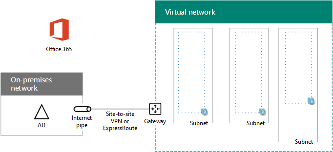

# <a name="high-availability-federated-authentication-phase-1-configure-azure"></a>고가용성 페더레이션 인증 1단계: Azure 구성

 **요약:** Microsoft Azure 인프라를 구성하여 Office 365 페더레이션 인증의 고가용성을 호스트합니다.
  
이 단계에서는 2, 3, 4 단계에서 가상 컴퓨터를 호스팅할 Azure의 리소스 그룹, VNet (가상 네트워크) 및 가용성 집합을 만듭니다. [고가용성 페더레이션 인증 2 단계: 도메인 컨트롤러 구성](high-availability-federated-authentication-phase-2-configure-domain-controllers.md)으로 이동 하기 전에이 단계를 완료 해야 합니다. 모든 단계에 대해 [Azure에서 Office 365에 대 한 고가용성 페더레이션 인증 배포](deploy-high-availability-federated-authentication-for-office-365-in-azure.md) 를 참조 하세요.
  
Azure는 다음과 같은 기본 구성 요소로 구축 해야 합니다.
  
- 리소스 그룹
    
- azure virtual machines를 호스팅하기 위한 서브넷이 있는 프레미스 간 azure VNet (가상 네트워크)
    
- 수행 중인 서브넷 격리용 네트워크 보안 그룹
    
- 가용성 집합
    
## <a name="configure-azure-components"></a>Azure 구성 요소 구성

Azure 구성 요소를 구성하기 전에 다음 테이블을 채워야 합니다. Azure 구성 프로시저를 지원하려면 이 섹션을 인쇄하여 필요한 정보를 적어두거나 이 섹션을 문서에 복사하여 입력하세요. VNet의 설정에 대 한 자세한 내용은 Table V를 입력 하십시오.
  
|**항목**|**구성 설정**|**설명**|**값**|
|:-----|:-----|:-----|:-----|
|1.  <br/> |VNet 이름  <br/> |VNet에 할당할 이름 (예:: fedauthnet)입니다.  <br/> |  <br/> |
|2.  <br/> |VNet 위치  <br/> |가상 네트워크를 포함 하는 지역별 Azure 데이터 센터입니다.  <br/> |  <br/> |
|3.  <br/> |VPN 장치 IP 주소  <br/> |인터넷에서 VPN 장치 인터페이스의 공용 IPv4 주소입니다.  <br/> |  <br/> |
|4.  <br/> |VNet 주소 공간  <br/> |가상 네트워크의 주소 공간입니다. IT 부서에서 이 주소 공간을 확인합니다.  <br/> |  <br/> |
|5.  <br/> |IPsec 공유 키  <br/> |사이트 간 VPN 연결의 양측을 인증하는 데 사용되는 32자의 무작위 영숫자 문자열입니다. IT 또는 보안 부서에서 이 키 값을 확인합니다. 또한, [IPsec 미리 공유한 키의 무작위 문자열 만들기](http://social.technet.microsoft.com/wiki/contents/articles/32330.create-a-random-string-for-an-ipsec-preshared-key.aspx)를 참조하세요.  <br/> |  <br/> |
   
 **테이블 V: 프레미스 간 가상 네트워크 구성**
  
다음으로 이 솔루션의 서브넷에 대해서는 테이블 S를 채웁니다. 모든 주소 공간은 CIDR(Classless Interdomain Routing) 형식이어야 하며 네트워크 접두사 형식이라고도 합니다. 예를 들어 10.24.64.0/20입니다.
  
처음 3 개 서브넷의 경우 가상 네트워크 주소 공간에 따라 이름과 단일 IP 주소 공간을 지정 합니다. 게이트웨이 서브넷의 경우 Azure 게이트웨이 서브넷의 27 비트 주소 공간 (/27 접두사 길이)을 다음과 같이 결정 합니다.
  
1. VNet의 주소 공간에 있는 변수 비트를 1(게이트웨이 서브넷에서 사용하는 비트까지)로 설정한 다음 나머지 비트를 0으로 설정합니다.
    
2. 결과 비트를 10진수로 변환하고 이를 접두사 길이가 게이트웨이 서브넷 크기로 설정된 주소 공간으로 표현합니다.
    
이러한 계산을 수행 하는 PowerShell 명령 블록 및 c # 또는 Python 콘솔 응용 프로그램의 경우 [Azure 게이트웨이 서브넷에 대 한 주소 공간 계산기](https://gallery.technet.microsoft.com/scriptcenter/Address-prefix-calculator-a94b6eed) 를 참조 하세요.
  
IT 부서에서 가상 네트워크 주소 공간의 이러한 주소 공간을 확인합니다.
  
|**항목**|**서브넷 이름**|**서브넷 주소 공간**|**용도**|
|:-----|:-----|:-----|:-----|
|1.  <br/> |  <br/> |  <br/> |AD DS (Active Directory 도메인 서비스) 도메인 컨트롤러 및 DirSync 서버 가상 컴퓨터 (vm)에서 사용 하는 서브넷입니다.  <br/> |
|2.  <br/> |  <br/> |  <br/> |AD FS vm에서 사용 하는 서브넷입니다.  <br/> |
|3.  <br/> |  <br/> |  <br/> |웹 응용 프로그램 프록시 vm에서 사용 하는 서브넷입니다.  <br/> |
|4.  <br/> |GatewaySubnet  <br/> |  <br/> |Azure 게이트웨이 vm에서 사용 하는 서브넷입니다.  <br/> |
   
 **테이블 S: 가상 네트워크의 서브넷**
  
다음으로 가상 컴퓨터와 부하 분산 장치 인스턴스에 할당된 고정 IP 주소에 대해서는 테이블 I를 채웁니다.
  
|**항목**|**용도**|**서브넷의 IP 주소**|**값**|
|:-----|:-----|:-----|:-----|
|1.  <br/> |첫 번째 도메인 컨트롤러의 고정 IP 주소  <br/> |테이블 S의 항목 1에 정의된 서브넷의 주소 공간에 사용할 수 있는 네 번째 IP 주소입니다.  <br/> |  <br/> |
|2.  <br/> |두 번째 도메인 컨트롤러의 고정 IP 주소  <br/> |테이블 S의 항목 1에 정의된 서브넷의 주소 공간에 사용할 수 있는 다섯 번째 IP 주소입니다.  <br/> |  <br/> |
|3.  <br/> |DirSync 서버의 고정 IP 주소  <br/> |테이블 S의 항목 1에 정의 된 서브넷의 주소 공간에 사용할 수 있는 여섯 번째 IP 주소입니다.  <br/> |  <br/> |
|4.  <br/> |AD FS 서버에 대 한 내부 부하 분산 장치의 고정 IP 주소  <br/> |테이블 S의 항목 2에 정의된 서브넷의 주소 공간에 사용할 수 있는 네 번째 IP 주소입니다.  <br/> |  <br/> |
|5.  <br/> |첫 번째 AD FS 서버의 고정 IP 주소  <br/> |테이블 S의 항목 2에 정의된 서브넷의 주소 공간에 사용할 수 있는 다섯 번째 IP 주소입니다.  <br/> |  <br/> |
|6.  <br/> |두 번째 AD FS 서버의 고정 IP 주소  <br/> |테이블 S의 항목 2에 정의된 서브넷의 주소 공간에 사용할 수 있는 여섯 번째 IP 주소입니다.  <br/> |  <br/> |
|7.  <br/> |첫 번째 웹 응용 프로그램 프록시 서버의 고정 IP 주소  <br/> |테이블 S의 항목 3에 정의된 서브넷의 주소 공간에 사용할 수 있는 네 번째 IP 주소입니다.  <br/> |  <br/> |
|8.  <br/> |두 번째 웹 응용 프로그램 프록시 서버의 고정 IP 주소  <br/> |테이블 S의 항목 3에 정의된 서브넷의 주소 공간에 사용할 수 있는 다섯 번째 IP 주소입니다.  <br/> |  <br/> |
   
 **테이블 I: 가상 네트워크의 고정 IP 주소**
  
가상 네트워크에서 도메인 컨트롤러를 처음 설정할 때 사용 하려는 온-프레미스 네트워크의 두 DNS (Domain Name System) 서버에 대해 표 D를 입력 합니다. IT 부서와 협력 하 여이 목록을 확인 합니다.
  
|**항목**|**DNS 서버 식별 이름**|**DNS 서버 IP 주소**|
|:-----|:-----|:-----|
|1.  <br/> |  <br/> |  <br/> |
|2.  <br/> |  <br/> |  <br/> |
   
 **테이블 D: 온-프레미스 DNS 서버**
  
사이트 간 VPN 연결을 통해 크로스-프레미스 네트워크에서 조직 네트워크로 패킷을 라우팅하려면 연결할 수 있는 모든 사용자에 대 한 주소 공간 (CIDR 표기법) 목록이 있는 로컬 네트워크를 사용 하 여 가상 네트워크를 구성 해야 합니다. 조직의 온-프레미스 네트워크에 있는 위치입니다. 로컬 네트워크를 정의하는 주소 공간 목록은 고유해야 하며 다른 가상 네트워크 또는 다른 로컬 네트워크에 사용되는 주소 공간과 중복되면 안 됩니다.
  
로컬 네트워크 주소 공간의 집합에 대해서는 테이블 L을 채웁니다. 세 개의 빈 항목이 나열되지만 일반적으로 더 많이 필요합니다. IT 부서에서 주소 공간의 목록을 확인합니다.
  
|**항목**|**로컬 네트워크 주소 공간**|
|:-----|:-----|
|1.  <br/> |  <br/> |
|2.  <br/> |  <br/> |
|3.  <br/> |  <br/> |
   
 **테이블 L: 로컬 네트워크의 주소 접두사**
  
이제 Office 365에 대 한 페더레이션 인증을 호스트 하기 위한 Azure 인프라를 구축 해 보겠습니다.
  
> [!NOTE]
> 다음 명령 집합은 최신 버전의 Azure PowerShell을 사용합니다. [Azure PowerShell cmdlet으로 시작](https://docs.microsoft.com/en-us/powershell/azureps-cmdlets-docs/)을 참조하세요. 
  
먼저 Azure PowerShell 프롬프트를 시작하고 계정에 로그인합니다.
  
```
Connect-AzAccount
```

<!--
> [!TIP]
> For a text file that has all of the PowerShell commands in this article and a Microsoft Excel configuration workbook that generates ready-to-run PowerShell command blocks based on your custom settings, see the [Federated Authentication for Office 365 in Azure Deployment Kit](https://gallery.technet.microsoft.com/Federated-Authentication-8a9f1664). 
-->
  
다음 명령을 사용하여 구독 이름을 가져옵니다.
  
```
Get-AzSubscription | Sort Name | Select Name
```

이전 버전의 Azure PowerShell의 경우 대신이 명령을 사용 합니다.
  
```
Get-AzSubscription | Sort Name | Select SubscriptionName
```

Azure 구독을 설정합니다. \< 문자와 > 문자를 포함 하 여 따옴표 안에 있는 모든 것을 올바른 이름으로 바꿉니다.
  
```
$subscrName="<subscription name>"
Select-AzSubscription -SubscriptionName $subscrName
```

다음으로 새 리소스 그룹을 만듭니다. 고유한 리소스 그룹 이름의 집합을 확인하려면 이 명령을 사용하여 기존 리소스 그룹을 나열합니다.
  
```
Get-AzResourceGroup | Sort ResourceGroupName | Select ResourceGroupName
```

고유한 리소스 그룹 이름의 집합에 대해서는 다음 테이블을 채웁니다.
  
|**항목**|**리소스 그룹 이름**|**용도**|
|:-----|:-----|:-----|
|1.  <br/> |  <br/> |도메인 컨트롤러  <br/> |
|2.  <br/> |  <br/> |AD FS 서버  <br/> |
|3.  <br/> |  <br/> |웹 응용 프로그램 프록시 서버  <br/> |
|4.  <br/> |  <br/> |인프라 구성 요소  <br/> |
   
 **테이블 R: 리소스 그룹**
  
이러한 명령을 사용하여 새 리소스 그룹을 만듭니다.
  
```
$locName="<an Azure location, such as West US>"
$rgName="<Table R - Item 1 - Name column>"
New-AzResourceGroup -Name $rgName -Location $locName
$rgName="<Table R - Item 2 - Name column>"
New-AzResourceGroup -Name $rgName -Location $locName
$rgName="<Table R - Item 3 - Name column>"
New-AzResourceGroup -Name $rgName -Location $locName
$rgName="<Table R - Item 4 - Name column>"
New-AzResourceGroup -Name $rgName -Location $locName
```

다음으로 Azure virtual network 및 해당 서브넷을 만듭니다.
  
```
$rgName="<Table R - Item 4 - Resource group name column>"
$locName="<your Azure location>"
$vnetName="<Table V - Item 1 - Value column>"
$vnetAddrPrefix="<Table V - Item 4 - Value column>"
$dnsServers=@( "<Table D - Item 1 - DNS server IP address column>", "<Table D - Item 2 - DNS server IP address column>" )
# Get the shortened version of the location
$locShortName=(Get-AzResourceGroup -Name $rgName).Location

# Create the subnets
$subnet1Name="<Table S - Item 1 - Subnet name column>"
$subnet1Prefix="<Table S - Item 1 - Subnet address space column>"
$subnet1=New-AzVirtualNetworkSubnetConfig -Name $subnet1Name -AddressPrefix $subnet1Prefix
$subnet2Name="<Table S - Item 2 - Subnet name column>"
$subnet2Prefix="<Table S - Item 2 - Subnet address space column>"
$subnet2=New-AzVirtualNetworkSubnetConfig -Name $subnet2Name -AddressPrefix $subnet2Prefix
$subnet3Name="<Table S - Item 3 - Subnet name column>"
$subnet3Prefix="<Table S - Item 3 - Subnet address space column>"
$subnet3=New-AzVirtualNetworkSubnetConfig -Name $subnet3Name -AddressPrefix $subnet3Prefix
$gwSubnet4Prefix="<Table S - Item 4 - Subnet address space column>"
$gwSubnet=New-AzVirtualNetworkSubnetConfig -Name "GatewaySubnet" -AddressPrefix $gwSubnet4Prefix

# Create the virtual network
New-AzVirtualNetwork -Name $vnetName -ResourceGroupName $rgName -Location $locName -AddressPrefix $vnetAddrPrefix -Subnet $gwSubnet,$subnet1,$subnet2,$subnet3 -DNSServer $dnsServers

```

다음으로, 가상 컴퓨터를 포함 하는 각 서브넷에 대해 네트워크 보안 그룹을 만듭니다. 서브넷 격리를 수행하려면 서브넷의 네트워크 보안 그룹에서 허용되거나 거부되는 특정 유형의 트래픽에 대한 규칙을 추가할 수 있습니다.
  
```
# Create network security groups
$vnet=Get-AzVirtualNetwork -ResourceGroupName $rgName -Name $vnetName

New-AzNetworkSecurityGroup -Name $subnet1Name -ResourceGroupName $rgName -Location $locShortName
$nsg=Get-AzNetworkSecurityGroup -Name $subnet1Name -ResourceGroupName $rgName
Set-AzVirtualNetworkSubnetConfig -VirtualNetwork $vnet -Name $subnet1Name -AddressPrefix $subnet1Prefix -NetworkSecurityGroup $nsg

New-AzNetworkSecurityGroup -Name $subnet2Name -ResourceGroupName $rgName -Location $locShortName
$nsg=Get-AzNetworkSecurityGroup -Name $subnet2Name -ResourceGroupName $rgName
Set-AzVirtualNetworkSubnetConfig -VirtualNetwork $vnet -Name $subnet2Name -AddressPrefix $subnet2Prefix -NetworkSecurityGroup $nsg

New-AzNetworkSecurityGroup -Name $subnet3Name -ResourceGroupName $rgName -Location $locShortName
$nsg=Get-AzNetworkSecurityGroup -Name $subnet3Name -ResourceGroupName $rgName
Set-AzVirtualNetworkSubnetConfig -VirtualNetwork $vnet -Name $subnet3Name -AddressPrefix $subnet3Prefix -NetworkSecurityGroup $nsg
```

다음으로 이러한 명령을 사용하여 사이트 간 VPN 연결의 게이트웨이를 만듭니다.
  
```
$rgName="<Table R - Item 4 - Resource group name column>"
$locName="<Azure location>"
$vnetName="<Table V - Item 1 - Value column>"
$vnet=Get-AzVirtualNetwork -Name $vnetName -ResourceGroupName $rgName
$subnet=Get-AzVirtualNetworkSubnetConfig -VirtualNetwork $vnet -Name "GatewaySubnet"

# Attach a virtual network gateway to a public IP address and the gateway subnet
$publicGatewayVipName="PublicIPAddress"
$vnetGatewayIpConfigName="PublicIPConfig"
New-AzPublicIpAddress -Name $vnetGatewayIpConfigName -ResourceGroupName $rgName -Location $locName -AllocationMethod Dynamic
$publicGatewayVip=Get-AzPublicIpAddress -Name $vnetGatewayIpConfigName -ResourceGroupName $rgName
$vnetGatewayIpConfig=New-AzVirtualNetworkGatewayIpConfig -Name $vnetGatewayIpConfigName -PublicIpAddressId $publicGatewayVip.Id -Subnet $subnet

# Create the Azure gateway
$vnetGatewayName="AzureGateway"
$vnetGateway=New-AzVirtualNetworkGateway -Name $vnetGatewayName -ResourceGroupName $rgName -Location $locName -GatewayType Vpn -VpnType RouteBased -IpConfigurations $vnetGatewayIpConfig

# Create the gateway for the local network
$localGatewayName="LocalNetGateway"
$localGatewayIP="<Table V - Item 3 - Value column>"
$localNetworkPrefix=@( <comma-separated, double-quote enclosed list of the local network address prefixes from Table L, example: "10.1.0.0/24", "10.2.0.0/24"> )
$localGateway=New-AzLocalNetworkGateway -Name $localGatewayName -ResourceGroupName $rgName -Location $locName -GatewayIpAddress $localGatewayIP -AddressPrefix $localNetworkPrefix

# Define the Azure virtual network VPN connection
$vnetConnectionName="S2SConnection"
$vnetConnectionKey="<Table V - Item 5 - Value column>"
$vnetConnection=New-AzVirtualNetworkGatewayConnection -Name $vnetConnectionName -ResourceGroupName $rgName -Location $locName -ConnectionType IPsec -SharedKey $vnetConnectionKey -VirtualNetworkGateway1 $vnetGateway -LocalNetworkGateway2 $localGateway

```

> [!NOTE]
> 개별 사용자의 페더레이션 인증은 온-프레미스 리소스를 사용하지 않습니다. 그러나이 사이트 간 VPN 연결을 사용할 수 없는 경우 VNet의 도메인 컨트롤러는 온-프레미스 Active Directory 도메인 서비스에 있는 사용자 계정 및 그룹에 대 한 업데이트를 수신 하지 않습니다. 이 문제가 발생 하지 않도록 하려면 사이트 간 VPN 연결에 대 한 고가용성을 구성 하면 됩니다. 자세한 내용은 [항상 사용 가능한 프레미스 간 및 VNet 간 연결](https://docs.microsoft.com/azure/vpn-gateway/vpn-gateway-highlyavailable)을 참조하세요.
  
그런 다음 이 명령의 디스플레이에서 가상 네트워크용 Azure VPN 게이트웨이의 공용 IPv4 주소를 기록합니다.
  
```
Get-AzPublicIpAddress -Name $publicGatewayVipName -ResourceGroupName $rgName
```

계속해서 Azure VPN 게이트웨이에 연결할 온-프레미스 VPN 장치를 구성합니다. 자세한 내용은 [VPN 장치 구성](https://docs.microsoft.com/azure/vpn-gateway/vpn-gateway-about-vpn-devices)을 참조하세요.
  
온-프레미스 VPN 장치를 구성하려면 다음 항목이 필요합니다.
  
- Azure VPN 게이트웨이의 공용 IPv4 주소.
    
- 사이트 간 VPN 연결용 IPsec 미리 공유한 키(테이블 V - 항목 5 - 값 열).
    
다음으로 가상 네트워크의 주소 공간이 온-프레미스 네트워크에서 연결 가능한지 확인합니다. 일반적으로 가상 네트워크 주소 공간에 해당하는 경로를 VPN 장치에 추가한 다음 이 경로를 조직 네트워크의 나머지 라우팅 인프라에 보급합니다. IT 부서에서 이 작업을 수행하는 방법을 확인합니다.
  
다음으로, 세 가지 가용성 집합의 이름을 정의 합니다. 테이블 A를 채웁니다. 
  
|**항목**|**용도**|**가용성 집합 이름**|
|:-----|:-----|:-----|
|1.  <br/> |도메인 컨트롤러  <br/> |  <br/> |
|2.  <br/> |AD FS 서버  <br/> |  <br/> |
|3.  <br/> |웹 응용 프로그램 프록시 서버  <br/> |  <br/> |
   
 **테이블 A: 가용성 집합**
  
2, 3 및 4단계에서 가상 컴퓨터를 만들 때 이러한 이름이 필요합니다.
  
다음 Azure PowerShell 명령을 사용 하 여 새 가용성 집합을 만듭니다.
  
```
$locName="<the Azure location for your new resource group>"
$rgName="<Table R - Item 1 - Resource group name column>"
$avName="<Table A - Item 1 - Availability set name column>"
New-AzAvailabilitySet -ResourceGroupName $rgName -Name $avName -Location $locName -Sku Aligned  -PlatformUpdateDomainCount 5 -PlatformFaultDomainCount 2
$rgName="<Table R - Item 2 - Resource group name column>"
$avName="<Table A - Item 2 - Availability set name column>"
New-AzAvailabilitySet -ResourceGroupName $rgName -Name $avName -Location $locName -Sku Aligned  -PlatformUpdateDomainCount 5 -PlatformFaultDomainCount 2
$rgName="<Table R - Item 3 - Resource group name column>"
$avName="<Table A - Item 3 - Availability set name column>"
New-AzAvailabilitySet -ResourceGroupName $rgName -Name $avName -Location $locName -Sku Aligned  -PlatformUpdateDomainCount 5 -PlatformFaultDomainCount 2
```

이 단계를 성공적으로 완료하면 다음 구성을 얻을 수 있습니다.
  
**1 단계: Office 365에 대 한 고가용성 페더레이션 인증용 Azure 인프라**


  
## <a name="next-step"></a>다음 단계

[고가용성 페더레이션 인증 2 단계: 도메인 컨트롤러를 구성](high-availability-federated-authentication-phase-2-configure-domain-controllers.md) 하 여이 작업의 구성을 계속 진행 합니다.
  
## <a name="see-also"></a>참고 항목

[Azure에서 Office 365용 고가용성 페더레이션 인증 배포](deploy-high-availability-federated-authentication-for-office-365-in-azure.md)
  
[Office 365 개발/테스트 환경용 페더레이션 ID](federated-identity-for-your-office-365-dev-test-environment.md)
  
[클라우드 도입 및 하이브리드 솔루션](cloud-adoption-and-hybrid-solutions.md)

[Office 365 ID 및 Azure Active Directory 이해](about-office-365-identity.md)


