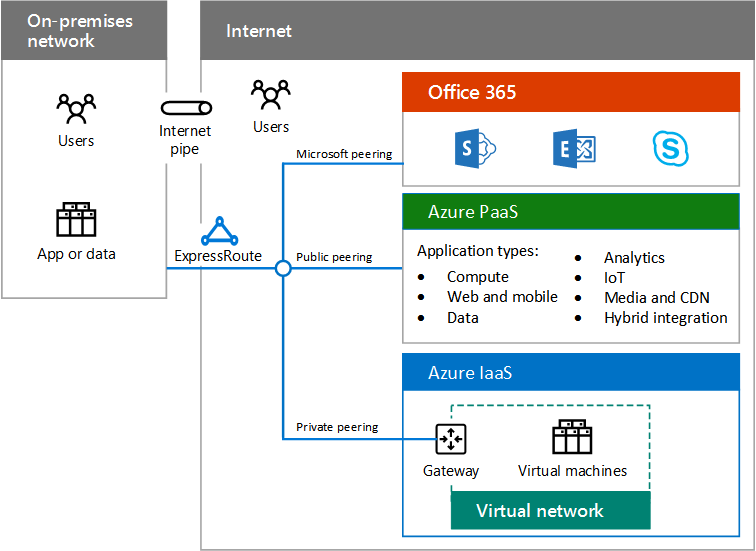

# 하이브리드 클라우드 개요 (영문)Hybrid cloud overview

 **요약:** 정 및 Microsoft 하이브리드 클라우드의 요소를 이해 합니다.**Summary:** Understand the definition and elements of Microsoft hybrid cloud.
  
하이브리드 클라우드 클라우드 및 온-프레미스 네트워크에서 compute 또는 저장소 리소스를 사용합니다. 하이브리드 클라우드도 비즈니스 및 IT 필요에 맞게 클라우드로 마이그레이션할 또는 기존와 클라우드 플랫폼 및 서비스를 통합에 대 한 경로 온-프레미스 인프라 전반적인 IT 전략의 일부분으로 사용할 수 있습니다.Hybrid cloud uses compute or storage resources on your on-premises network and in the cloud. You can use hybrid cloud as a path to migrate your business and its IT needs to the cloud or integrate cloud platforms and services with your existing on-premises infrastructure as part of your overall IT strategy.
  
## Microsoft 하이브리드 클라우드Microsoft hybrid cloud

Microsoft 하이브리드 클라우드에는 온-프레미스 구성 요소와 같은 Microsoft 클라우드 플랫폼을 결합 하는 비즈니스 시나리오의 집합입니다.Microsoft hybrid cloud is a set of business scenarios that combine a Microsoft cloud platform with an on-premises component, such as: 
  
- Office 365의 SharePoint Online에서 및 온-프레미스 SharePoint 팜에서 콘텐츠에서 검색 결과를 가져왔습니다.Getting search results from content both in an on-premises SharePoint farm and in SharePoint Online in Office 365.
    
- 온-프레미스 데이터 저장소를 쿼리 하는 Azure에서 실행 되는 모바일 앱입니다.A mobile app running in Azure that queries an on-premises data store.
    
- IT 인트라넷 Azure 가상 컴퓨터에서 실행 되는 작업입니다.An intranet IT workload running on Azure virtual machines.
    
**Microsoft 하이브리드 클라우드의 그림 1: 구성 요소****Figure 1: Components of the Microsoft hybrid cloud**

  
그림 1은 인터넷 이나 ExpressRoute 연결에서 Microsoft 하이브리드 클라우드 서비스로 (PaaS) Azure 플랫폼 및 사용할 수 있는 서비스 (IaaS) 서비스로 Azure 인프라 Office 365의 집합에는 온-프레미스 네트워크에서의 구성 요소를 보여줍니다.Figure 1 shows the components of the Microsoft hybrid cloud, from an on-premises network to the set of Office 365, Azure Platform as a Service (PaaS), and Azure Infrastructure as a Service (IaaS) services available across the Internet or an ExpressRoute connection.
  
Microsoft 시장에서 가장 전체 클라우드 솔루션을 갖기 때문에-소프트웨어를 포함 하 여 서비스 (SaaS), PaaS, 및 IaaS-을 수행할 수 있습니다.Because Microsoft has the most complete cloud solution in the marketplace—including Software as a Service (SaaS), PaaS, and IaaS—you can:
  
- 작업 및 응용 프로그램은 클라우드로 마이그레이션할 때 기존 온-프레미스 투자를 활용 합니다.Leverage your existing on-premises investments as you migrate workloads and applications to the cloud.
    
- 통합할 하이브리드 클라우드 시나리오 장기 IT 계획, 예, 규정 또는 정책 하지 못하도록 하 여 클라우드 작업 또는 특정 데이터를 이동 하는 경우.Incorporate hybrid cloud scenarios into your long-term IT plans, for example, when regulations or policies do not permit moving specific data or workloads to the cloud.
    
- 여러 Microsoft 클라우드 서비스 및 플랫폼을 포함 하는 추가 하이브리드 시나리오를 만듭니다.Create additional hybrid scenarios that include multiple Microsoft cloud services and platforms.
    
하이브리드 클라우드로 Microsoft 클라우드 서비스에 대 한 시나리오는 플랫폼에 따라 다릅니다.Scenarios for hybrid cloud with Microsoft cloud services vary with the platform.
  
- SaaSSaaS
    
    Microsoft SaaS 서비스는 Office 365, Microsoft Intune 및 Microsoft Dynamics 365 포함 됩니다. 온-프레미스 서비스 또는 응용 프로그램을 이러한 서비스를 결합 하는 Microsoft SaaS를 사용한 하이브리드 클라우드 시나리오입니다. 예, Office 365에서 실행 되는 Exchange Online와 통합 될 수는 온-프레미스로 배포 하는 비즈니스 2015 용 Skype 합니다.Microsoft SaaS services include Office 365, Microsoft Intune, and Microsoft Dynamics 365. Hybrid cloud scenarios with Microsoft SaaS combine these services with on-premises services or applications. For example, Exchange Online running in Office 365 can be integrated with Skype for Business 2015 that is deployed on-premises.
    
- Azure PaaSAzure PaaS
    
    Microsoft Azure PaaS 서비스를 사용 하면 클라우드 기반 응용 프로그램을 만들 수 있도록 합니다. 온-프레미스 리소스 또는 응용 프로그램을 Azure PaaS app를 결합 하는 Azure PaaS 서비스를 사용한 하이브리드 클라우드 시나리오입니다. 등 Azure PaaS 응용 프로그램을 모바일 응용 프로그램 사용자에 게 표시 하는 데 필요한 정보에 대 한 온-프레미스 데이터 저장소를 쿼리하여 안전 하 게 수 있습니다.Microsoft Azure PaaS services allow you to create cloud-based applications. Hybrid cloud scenarios with Azure PaaS services combine an Azure PaaS app with on-premises resources or applications. For example, an Azure PaaS app could securely query an on-premises data store for information needed to display to mobile app users.
    
- Azure IaaSAzure IaaS
    
    Azure IaaS 서비스를 구성 하 고 서버 기반 IT 작업을 실행 하 여 클라우드에서 아니라 온-프레미스 데이터 센터에서 할 수 있습니다. Azure IaaS 서비스를 사용한 하이브리드 클라우드 시나리오 투명 하 게 온-프레미스 네트워크에 연결 되는 IT 작업량 가상 컴퓨터에서 실행 되는 일반적으로 구성 됩니다. 온-프레미스 사용자가 차이 느끼지 못합니다.Azure IaaS services allow you to build and run server-based IT workloads in the cloud, rather than in your on-premises datacenter. Hybrid cloud scenarios with Azure IaaS services typically consist of an IT workload that runs on virtual machines that is transparently connected to your on-premises network. Your on-premises users will not notice the difference.
    
## 하이브리드 클라우드의 요소Elements of hybrid cloud

클라우드 플랫폼 및 서비스 계획 및 Microsoft와 하이브리드 클라우드 시나리오를 구현 하는 경우에 다음 요소에 대 한 설명 해야 합니다.You must account for the following elements when planning and implementing hybrid cloud scenarios with Microsoft cloud platforms and services.
  
- 네트워킹Networking
    
    네트워킹 하이브리드 클라우드 시나리오에 대 한 최고 부하에서 성능이 수 있을 만큼 충분 한 대역폭 및 Microsoft 클라우드 플랫폼 및 서비스에 대 한 연결을 포함 합니다. 자세한 내용은 [엔터프라이즈 설계자에 대 한 Microsoft 클라우드 네트워킹](microsoft-cloud-networking-for-enterprise-architects.md)을 참조 하십시오.Networking for hybrid cloud scenarios includes the connectivity to Microsoft cloud platforms and services and enough bandwidth to be performant under peak loads. For more information, see [Microsoft Cloud Networking for Enterprise Architects](microsoft-cloud-networking-for-enterprise-architects.md).
    
- IdentityIdentity
    
    SaaS 및 Azure PaaS 하이브리드 시나리오에 대 한 id는 온-프레미스 Windows Server AD와 동기화 또는 Windows Server AD 또는 다른 id 공급자와 페더레이션 수 있는 일반적인 id 공급자를으로 Azure AD를 포함할 수 있습니다. 또한 Azure IaaS를 사용 하도록 온-프레미스 Identity 인프라를 확장할 수 있습니다. 자세한 내용은 [엔터프라이즈 설계자에 대 한 Microsoft 클라우드 Id](microsoft-cloud-identity-for-enterprise-architects.md)를 참조 하십시오.Identity for SaaS and Azure PaaS hybrid scenarios can include Azure AD as a common identity provider, which can be synchronized with your on-premises Windows Server AD, or federated with Windows Server AD or other identity providers. You can also extend your on-premises Identity infrastructure to Azure IaaS. For more information, see [Microsoft Cloud Identity for Enterprise Architects](microsoft-cloud-identity-for-enterprise-architects.md).
    
- 보안Security
    
    하이브리드 클라우드 시나리오에 대 한 보안 보호 및 id, 데이터 보호, 관리 권한 관리, 위협 인식 및 거 버 넌 스 및 보안 정책 구현에 대 한 관리를 포함합니다. 자세한 내용은 [엔터프라이즈 설계자에 대 한 Microsoft 클라우드 보안](https://technet.microsoft.com/library/dn919927.aspx#security)을 참조 하십시오.Security for hybrid cloud scenarios includes protection and management for your identities, data protection, administrative privilege management, threat awareness, and the implementation of governance and security policies. For more information, see [Microsoft Cloud Security for Enterprise Architects](https://technet.microsoft.com/library/dn919927.aspx#security).
    
- 관리Management
    
    하이브리드 클라우드 시나리오에 대 한 관리 설정, 데이터, 계정, 정책 및 사용 권한 유지 관리 하 고 시나리오 및 성능에 대의 요소는 계속 해 서 상태를 모니터링 하는 기능을 포함 합니다. Azure IaaS에 가상 컴퓨터를 관리 하기 위한 Systems Management Server와 같은 동일한 도구 집합을 사용할 수도 있습니다.Management for hybrid cloud scenarios includes the ability to maintain settings, data, accounts, policies, and permissions and to monitor the ongoing health of the elements of the scenario and its performance. You can also use the same tool set, such as Systems Management Server, for managing virtual machines in Azure IaaS.
    
## See AlsoSee Also

[엔터프라이즈 설계자 용 Microsoft 하이브리드 클라우드Microsoft Hybrid Cloud for Enterprise Architects](microsoft-hybrid-cloud-for-enterprise-architects.md)
  
[Microsoft 클라우드 IT 아키텍처 리소스Microsoft Cloud IT architecture resources](microsoft-cloud-it-architecture-resources.md)

[Microsoft의 엔터프라이즈 클라우드 로드맵: IT 의사 결정권자를 위한 리소스Microsoft's Enterprise Cloud Roadmap: Resources for IT Decision Makers](https://sway.com/FJ2xsyWtkJc2taRD)
 

