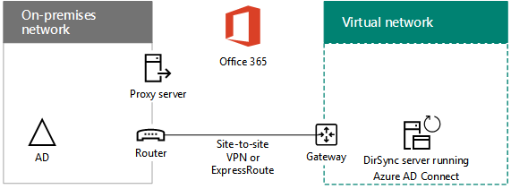

# Azure IaaS용 하이브리드 클라우드 시나리오Hybrid cloud scenarios for Azure IaaS

 **요약:** Microsoft의 IaaS (Infrastructure as a Service) 기반 클라우드 제품에 대 한 하이브리드 아키텍처 및 시나리오를 Azure에서 이해 합니다.**Summary:** Understand the hybrid architecture and scenarios for Microsoft's Infrastructure as a Service (IaaS)-based cloud offerings in Azure.
  
vnet (크로스-프레미스 Azure virtual network)에서 실행 되는 IT 작업을 호스트 하 여 온-프레미스 컴퓨팅 및 id 인프라를 클라우드로 확장 합니다.Extend your on-premises computing and identity infrastructure into the cloud by hosting IT workloads running in cross-premises Azure virtual networks (VNets). 
  
## Azure IaaS 하이브리드 시나리오 아키텍처Azure IaaS hybrid scenario architecture

그림 1에서는 Azure의 Microsoft IaaS 기반 하이브리드 시나리오 아키텍처를 보여 줍니다.Figure 1 shows the architecture of Microsoft IaaS-based hybrid scenarios in Azure.
  
**그림 1: Azure의 Microsoft IaaS 기반 하이브리드 시나리오****Figure 1: Microsoft IaaS-based hybrid scenarios in Azure**

  
아키텍처의 각 계층에 대해 다음을 수행 합니다.For each layer of the architecture:
  
- 앱 및 시나리오Apps and scenarios
    
    IT 작업은 일반적으로 Azure vm (가상 컴퓨터)으로 구성 되는 다중 계층의 고가용성 응용 프로그램입니다.An IT workload is typically a multi-tier, highly-available application composed of Azure virtual machines (VMs).
    
- IDIdentity
    
    Windows Server AD 도메인 컨트롤러와 같은 id 서버를 Azure vnet에서 로컬 인증을 실행 하는 서버 집합에 추가 합니다.Add identity servers, such as Windows Server AD domain controllers, to the set of servers running in Azure VNets for local authentication.
    
- 네트워크Network
    
    인터넷을 통해 사이트 간 VPN 연결을 사용 하거나 Azure IaaS에 대 한 개인 피어 링을 가진 express 간 연결을 사용할 수 있습니다.Use either a site-to-site VPN connection over the Internet or an ExpressRoute connection with private peering to Azure IaaS.
    
- 온-프레미스On-premises
    
    Azure에서 실행 되는 id 서버와 동기화 되는 id 서버가 들어 있습니다.Contains identity servers that are synchronized with the identity servers running in Azure. 또한 Azure에서 실행 되는 vm이 저장소 및 시스템 관리 인프라와 같은 액세스할 수 있는 리소스를 포함할 수 있습니다.Can also contain resources that VMs running in Azure can access, such as storage and systems management infrastructure.
    
## Office 365에 대 한 디렉터리 동기화 서버Directory synchronization server for Office 365

그림 2에 나와 있는 것 처럼 Azure VNet에서 디렉터리 동기화 서버를 실행 하는 것은 컴퓨팅 및 id 인프라를 클라우드로 확장 하는 예제입니다.Running your directory synchronization server from an Azure VNet, as shown in Figure 2, is an example of extending your computing and identity infrastructure to the cloud.
  
**그림 2: Azure IaaS의 Office 365에 대 한 디렉터리 동기화 서버****Figure 2: Directory synchronization server for Office 365 in Azure IaaS**

  
그림 2에서는 온-프레미스 네트워크가 프록시 서버와 해당 가장자리에 라우터를 사용 하 여 Windows Server AD 인프라를 호스트 합니다.In Figure 2, an on-premises network hosts a Windows Server AD infrastructure, with a proxy server and a router at its edge. 라우터는 사이트 간 VPN 또는 express 간 연결을 사용 하 여 azure VNet의에 지에서 azure 게이트웨이에 연결 합니다.The router connects to an Azure gateway at the edge of an Azure VNet with a site-to-site VPN or ExpressRoute connection. VNet 내부에서 디렉터리 동기화 서버는 Azure AD Connect를 실행 합니다.Inside the VNet, a directory synchronization server runs Azure AD Connect.
  
office 365에 대 한 디렉터리 동기화 서버는 Windows server AD의 계정 목록과 Office 365 구독의 Azure AD 테 넌 트를 동기화 합니다.A directory synchronization server for Office 365 synchronizes the list of accounts in Windows Server AD with the Azure AD tenant of an Office 365 subscription.
  
디렉터리 동기화 서버는 Azure AD Connect를 실행 하는 Windows 기반 서버입니다.A directory synchronization server is a Windows-based server that runs Azure AD Connect. 구축 속도를 빠르게 하거나 조직의 온-프레미스 서버 수를 줄이려면 Azure IaaS의 VNet (가상 네트워크)에서 디렉터리 동기화 서버를 배포 합니다.For faster provisioning or to reduce the number of on-premises servers in your organization, deploy your directory synchronization server in a virtual network (VNet) in Azure IaaS.
  
디렉터리 동기화 서버는 Windows server AD에서 변경 내용을 폴링한 후 Office 365 구독과 동기화 합니다.The directory synchronization server polls Windows Server AD for changes and then synchronizes them with the Office 365 subscription.
  
자세한 내용은 [Deploy Office 365 Directory Synchronization in Microsoft Azure](deploy-office-365-directory-synchronization-dirsync-in-microsoft-azure.md)를 참조 하세요.For more information, see [Deploy Office 365 Directory Synchronization in Microsoft Azure](deploy-office-365-directory-synchronization-dirsync-in-microsoft-azure.md).
  
## LOB (기간 업무) 응용 프로그램Line of business (LOB) application

그림 3에서는 Azure IaaS에서 실행 되는 서버 기반 LOB 응용 프로그램의 구성을 보여 줍니다.Figure 3 shows the configuration of a server-based LOB application running in Azure IaaS.
  
**그림 3: Azure IaaS의 LOB 응용 프로그램****Figure 3: LOB application in Azure IaaS**

  
그림 3에서는 온-프레미스 네트워크가 id 인프라 및 사용자를 호스트 합니다.In Figure 3, an on-premises network hosts an identity infrastructure and users. 사이트 간 VPN 또는 express 연결을 사용 하 여 Azure IaaS 게이트웨이에 연결 됩니다.It is connected to an Azure IaaS gateway with a site-to-site VPN or ExpressRoute connection. Azure IaaS는 LOB 응용 프로그램의 서버를 포함 하는 가상 네트워크를 호스팅합니다.Azure IaaS hosts a virtual network containing the servers of the LOB application.
  
azure 데이터 센터에 있는 azure VNet의 서브넷 (위치 라고도 함)에 상주 하는, 온-vm에서 실행 되는 LOB 응용 프로그램을 만들 수 있습니다.You can create LOB applications running on Azure VMs, which reside on subnets of an Azure VNet in an Azure datacenter (also known as a location).
  
기본적으로 온-프레미스 인프라를 Azure로 확장 하기 때문에 vnet에 고유한 개인 주소 공간을 할당 하 고 온-프레미스 라우팅 테이블을 업데이트 하 여 각 VNet에 대 한 연결 가능성을 확인 해야 합니다.Because you are essentially extending your on-premises infrastructure to Azure, you must assign unique private address space to your VNets and update your on-premises routing tables to ensure reachability to each VNet.
  
일단 연결 되 면 이러한 vm을 온-프레미스 서버와 마찬가지로 원격 데스크톱 연결 또는 시스템 관리 소프트웨어를 사용 하 여 관리할 수 있습니다.Once connected, these VMs can be managed with remote desktop connections or with your systems management software, just like your on-premises servers.
  
아니라 공개적으로에서 제공 하는 포트를 구성 하 여 모바일 또는 원격 사용자가 인터넷에서 이러한 vm에 액세스할 수도 있습니다.By configuring publically-exposed ports, these VMs can also be accessed from the Internet by mobile or remote users.
  
개념 증명 구성에 대 한 자세한 내용은 [Azure에서 시뮬레이트된 크로스-프레미스 가상 네트워크](simulated-cross-premises-virtual-network-in-azure.md)를 참조 하세요.For a proof-of-concept configuration, see [Simulated cross-premises virtual network in Azure](simulated-cross-premises-virtual-network-in-azure.md).
  
Azure vm에 호스트 되는 LOB 응용 프로그램의 특성은 다음과 같습니다.Attributes of LOB applications hosted on Azure VMs are the following:
  
- 여러 계층Multiple tiers
    
    일반적인 LOB 응용 프로그램은 계층화 된 방식을 사용 합니다.Typical LOB applications use a tiered approach. 서버 집합은 직원 또는 고객 액세스를 위한 id, 데이터베이스 처리, 응용 프로그램 및 논리 처리 및 프런트 엔드 웹 서버를 제공 합니다.Sets of servers provide identity, database processing, application and logic processing, and front-end web servers for employee or customer access. 
    
- 고가용성High availability
    
    일반적인 LOB 응용 프로그램은 각 계층에서 여러 서버를 사용 하 여 고가용성을 제공 합니다.Typical LOB applications provide high availability by using multiple servers in each tier. azure IaaS는 azure 가용성 집합의 서버에 대 한 99.9% 가동 SLA를 제공 합니다.Azure IaaS provides a 99.9% uptime SLA for servers in Azure availability sets. 
    
- 부하 분산Load distribution
    
    계층의 여러 서버 간에 네트워크 트래픽의 부하를 분산 하기 위해 인터넷 연결 또는 내부 Azure 부하 분산 장치를 사용할 수 있습니다.To distribute the load of network traffic among multiple servers in a tier, you can use an Internet-facing or internal Azure load balancer. 또는 Azure marketplace에서 제공 되는 전용 부하 분산 장치를 사용할 수 있습니다.Or, you can use a dedicated load balancer appliance available from the Azure marketplace.
    
- 보안Security
    
    인터넷에서 들어오는 원하지 않는 트래픽에 대해 서버를 보호 하려면 Azure 네트워크 보안 그룹을 사용할 수 있습니다.To protect servers from unsolicited incoming traffic from the Internet, you can use Azure network security groups. 서브넷 또는 개별 가상 컴퓨터의 네트워크 인터페이스에 대해 허용 되거나 거부 된 트래픽을 정의할 수 있습니다.You can define allowed or denied traffic for a subnet or the network interface of an individual virtual machine.
    
## Azure의 SharePoint Server 2016 팜SharePoint Server 2016 farm in Azure

Azure의 고가용성 LOB 응용 프로그램의 예로는 그림 4와 같이 SharePoint Server 2016 팜이 있습니다.An example of a multi-tier, highly-available LOB application in Azure is a SharePoint Server 2016 farm, as shown in Figure 4.
  
**그림 4: Azure IaaS의 고가용성 SharePoint Server 2016 팜****Figure 4: A high-availability SharePoint Server 2016 farm in Azure IaaS**

  
그림 4에서는 온-프레미스 네트워크가 id 인프라 및 사용자를 호스트 합니다.In Figure 4, an on-premises network hosts an identity infrastructure and users. 사이트 간 VPN 또는 express 연결을 사용 하 여 Azure IaaS 게이트웨이에 연결 됩니다.It is connected to an Azure IaaS gateway with a site-to-site VPN or ExpressRoute connection. Azure VNet에는 프런트 엔드 서버, 응용 프로그램 서버, SQL Server 클러스터 및 도메인 컨트롤러에 대 한 별도의 계층을 포함 하는 SharePoint Server 2016 팜의 서버가 포함 되어 있습니다.The Azure VNet contains the servers of the SharePoint Server 2016 farm, which includes separate tiers for the front-end servers, the application servers, the SQL Server cluster, and the domain controllers.
  
이 구성에는 Azure의 LOB 응용 프로그램에 대 한 다음과 같은 특성이 있습니다.This configuration has the following attributes of LOB applications in Azure: 
  
- 계층과Tiers
    
    팜 내에서 서로 다른 역할을 실행 하는 서버는 계층을 만들고 각 계층에는 자체 서브넷이 있습니다.Servers running different roles within the farm create the tiers and each tier has its own subnet.
    
- 고가용성High-availability
    
    각 계층에서 두 개 이상의 서버를 사용 하 고 계층의 모든 서버를 동일한 가용성 집합에 배치 합니다.Achieved by using more than one server in each tier and placing all the servers of a tier in the same availability set.
    
- 부하 분산Load distribution
    
    내부 Azure 부하 분산 장치는 들어오는 클라이언트 웹 트래픽을 프런트 엔드 서버 (WEB1 및 WEB2)에 분산 시키고 SQL Server 클러스터의 수신기 IP 주소 (SQL1, SQL2 및: mn1)에 배포 합니다.Internal Azure load balancers distribute the incoming client web traffic to the front-end servers (WEB1 and WEB2) and to the listener IP address of the SQL Server cluster (SQL1, SQL2, and MN1).
    
- 보안Security
    
    각 서브넷의 네트워크 보안 그룹을 사용 하 여 허용 되는 인바운드 및 아웃 바운드 트래픽을 구성할 수 있습니다.Network security groups for each subnet let you to configure allowed inbound and outbound traffic.
    
성공적인 채택을 위해 다음 경로를 팔 로우 합니다.Follow this path for successful adoption:
  
1. 평가 및 실험Evaluate and experiment
    
    Azure에서 sharepoint server 2016을 실행 하는 경우의 이점을 이해 하려면 [Microsoft Azure의 sharepoint server 2016](https://docs.microsoft.com/SharePoint/administration/sharepoint-server-2016-in-microsoft-azure) 를 참조 하세요.See [SharePoint Server 2016 in Microsoft Azure](https://docs.microsoft.com/SharePoint/administration/sharepoint-server-2016-in-microsoft-azure) to understand the benefits of running SharePoint Server 2016 in Azure.
    
    시뮬레이션 된 개발/테스트 환경을 구축 하려면 [Azure 개발/테스트 환경의 인트라넷 SharePoint Server 2016](https://docs.microsoft.com/SharePoint/administration/intranet-sharepoint-server-2016-in-azure-dev-test-environment) 를 참조 하세요.See [Intranet SharePoint Server 2016 in Azure dev/test environment](https://docs.microsoft.com/SharePoint/administration/intranet-sharepoint-server-2016-in-azure-dev-test-environment) to build a simulated dev/test environment
    
2. 디자인Design
    
    팜 및 해당 설정에 대해 호스트할 azure IaaS 네트워킹, 계산 및 저장소 요소 집합을 결정 하는 프로세스를 단계별로 확인 하려면 [azure에서 SharePoint Server 2016 팜 디자인](https://docs.microsoft.com/SharePoint/administration/designing-a-sharepoint-server-2016-farm-in-azure) 을 참조 하세요.See [Designing a SharePoint Server 2016 farm in Azure](https://docs.microsoft.com/SharePoint/administration/designing-a-sharepoint-server-2016-farm-in-azure) to step through a process to determine the set of Azure IaaS networking, compute, and storage elements to host your farm and their settings.
    
3. 배포Deploy
    
    5 단계의 고가용성 팜의 종단 간 구성을 단계별로 보려면 [Azure에서 SQL server AlwaysOn 가용성 그룹을 사용 하 여 SharePoint server 2016 배포](https://docs.microsoft.com/SharePoint/administration/deploying-sharepoint-server-2016-with-sql-server-alwayson-availability-groups-in) 를 참조 하세요.See [Deploying SharePoint Server 2016 with SQL Server AlwaysOn Availability Groups in Azure](https://docs.microsoft.com/SharePoint/administration/deploying-sharepoint-server-2016-with-sql-server-alwayson-availability-groups-in) to step through the end-to-end configuration of the high-availability farm in five phases.
    
## Azure의 Office 365에 대 한 페더레이션 idFederated identity for Office 365 in Azure

Azure의 고가용성 LOB 응용 프로그램에 대 한 또 다른 예로는 Office 365의 페더레이션 id가 있습니다.Another example of a multi-tier, highly-available LOB application in Azure is federated identity for Office 365.
  
**그림 5: Azure IaaS의 Office 365에 대 한 고가용성 페더레이션 id 인프라****Figure 5: A high-availability federated identity infrastructure for Office 365 in Azure IaaS**

  
그림 5에서는 온-프레미스 네트워크가 id 인프라 및 사용자를 호스트 합니다.In Figure 5, an on-premises network hosts an identity infrastructure and users. 사이트 간 VPN 또는 express 연결을 사용 하 여 Azure IaaS 게이트웨이에 연결 됩니다.It is connected to an Azure IaaS gateway with a site-to-site VPN or ExpressRoute connection. Azure VNet에는 웹 프록시 서버, ad FS (active directory Federation Services) 서버 및 ad DS (active directory 도메인 서비스) 도메인 컨트롤러가 포함 되어 있습니다.The Azure VNet contains web proxy servers, Active Directory Federation Services (AD FS) servers, and Active Directory Domain Services (AD DS) domain controllers.
  
이 구성에는 Azure의 LOB 응용 프로그램에 대 한 다음과 같은 특성이 있습니다.This configuration has the following attributes of LOB applications in Azure:
  
- **계층:** 웹 프록시 서버, AD FS 서버 및 Windows Server AD 도메인 컨트롤러에 대 한 계층이 있습니다.**Tiers:** There are tiers for web proxy servers, AD FS servers, and Windows Server AD domain controllers.
    
- **부하 분산:** 외부 azure 부하 분산 장치는 들어오는 클라이언트 인증 요청을 웹 프록시에 배포 하 고 내부 Azure 부하 분산 장치는 AD FS 서버에 인증 요청을 배포 합니다.**Load distribution:** An external Azure load balancer distributes the incoming client authentication requests to the web proxies and an internal Azure load balancer distributes authentication requests to the AD FS servers.
    
성공적인 채택을 위해 다음 경로를 팔 로우 합니다.Follow this path for successful adoption:
  
1. 평가 및 실험Evaluate and experiment
    
    office 365의 페더레이션 인증을 위해 시뮬레이트된 개발/테스트 환경을 구축 하려면 [office 365 개발/테스트 환경용 페더레이션 id](federated-identity-for-your-office-365-dev-test-environment.md) 를 참조 하세요.See [Federated identity for your Office 365 dev/test environment](federated-identity-for-your-office-365-dev-test-environment.md) to build a simulated dev/test environment for federated authentication with Office 365.
    
2. 배포Deploy
    
    5 단계에서 [Azure의 Office 365에 대 한 고가용성 페더레이션 인증 배포](deploy-high-availability-federated-authentication-for-office-365-in-azure.md) 를 참조 하 여 고가용성 AD FS 인프라의 종단 간 구성을 단계별로 진행 합니다.See [Deploy high availability federated authentication for Office 365 in Azure](deploy-high-availability-federated-authentication-for-office-365-in-azure.md) to step through the end-to-end configuration of the high availability AD FS infrastructure in five phases.
    
    
## 참고 항목See Also

[Microsoft Hybrid Cloud for Enterprise ArchitectsMicrosoft Hybrid Cloud for Enterprise Architects](microsoft-hybrid-cloud-for-enterprise-architects.md)
  
[Microsoft 클라우드 IT 아키텍처 리소스Microsoft Cloud IT architecture resources](microsoft-cloud-it-architecture-resources.md)

