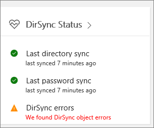

# Office 365에서 디렉터리 동기화 오류 보기

[Microsoft 365 관리 센터](https://admin.microsoft.com)에서 디렉터리 동기화 오류를 볼 수 있습니다. 사용자 개체 오류만 표시 됩니다. PowerShell을 사용 하 여 오류를 확인 하려면 [DirSyncProvisioningErrors를 사용 하 여 개체 확인](https://docs.microsoft.com/azure/active-directory/hybrid/how-to-connect-syncservice-duplicate-attribute-resiliency)을 참조 하십시오.

확인 후에는 [디렉터리 동기화 문제 해결](fix-problems-with-directory-synchronization.md) 을 참조 하 여 식별 된 모든 문제를 해결 합니다.
  
## 관리 센터에서 디렉터리 동기화 오류 보기

관리 센터에서 오류를 확인 하려면 다음을 수행 합니다.
  
1. 회사 또는 학교 계정으로 Office 365에 로그인합니다. 
    
2. [관리 센터에 대 한](https://support.office.com/article/758befc4-0888-4009-9f14-0d147402fd23)로 이동 합니다.
    
3. **홈** 페이지에 **DirSync 상태** 타일이 표시 됩니다. 
    
    
  
4. 타일에서 **DirSync 상태** 를 선택 하 여 **디렉터리 동기화 상태** 페이지로 이동 합니다. 
    
    페이지 맨 아래에 DirSync 오류가 있는지 여부를 확인할 수 있습니다.
    
    
  
    디렉터리 동기화 오류에 대 한 자세한 보기로 이동 하려면 **DirSync 개체 오류를 찾음** 을 선택 합니다. 
    
    > [!NOTE]
    > 또한 dirsync **상태** 타일에서 **dirsync 개체 오류가 발견** 되는 것을 선택한 경우 **dirsync 오류** 페이지로 이동할 수 있습니다. 
  

  
5. **DirSync 오류** 페이지에서 오류에 대 한 정보 및 문제 해결 방법에 대 한 팁이 포함 된 세부 정보 창을 표시 하려면 나열 된 오류 중 하나를 선택 합니다. 
