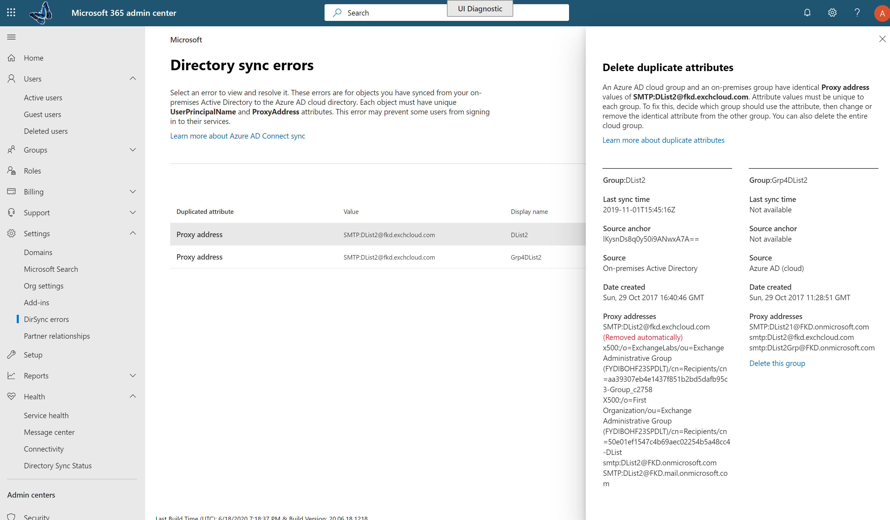

# Office 365에서 디렉터리 동기화 오류를 표시 합니다.

Office 365 관리 센터에서 디렉터리 동기화 오류를 볼 수 있습니다. 사용자 개체 오류만 표시 됩니다. PowerShell을 사용 하 여 오류를 표시 하려면 [DirSyncProvisioningErrors 사용 하 여 식별 개체](https://docs.microsoft.com/azure/active-directory/hybrid/how-to-connect-syncservice-duplicate-attribute-resiliency)를 참조 하십시오.

보기, 후 식별 된 문제를 해결 하려면 [Office 365에 대 한 디렉터리 동기화를 통해 문제를 해결](fix-problems-with-directory-synchronization.md) 을 참조 하십시오.
  
## 관리 센터에서 사용 되는 디렉터리 동기화 오류 보기

관리 센터에서 모든 오류를 보려면:
  
1. 회사 또는 학교 계정으로 Office 365에 로그인합니다. 
    
2. [Office 365에 대 한 관리 센터](https://support.office.com/article/758befc4-0888-4009-9f14-0d147402fd23)로 이동 합니다.
    
3. **홈** 페이지에서 **디렉터리 동기화 상태** 타일을 표시 됩니다. 
    
    
  
4. 타일을에서 **디렉터리 동기화 상태** 페이지로 이동 하려면 **디렉터리 동기화 상태** 선택 합니다. 
    
    페이지 아래쪽에서 디렉터리 동기화 오류가 있는 경우를 볼 수 있습니다.
    
    
  
    디렉터리 동기화 오류가 자세한 보기로 이동 하려면 **DirSync 개체 오류를 발견 하는 것** 을 선택 합니다. 
    
    > [!NOTE]
    > **디렉터리 동기화 상태** 타일 **DirSync 개체 오류를 발견 하는 것** 을 선택 하는 경우 **디렉터리 동기화 오류** 페이지로 이동할 수 있습니다. 
  

  
5. **디렉터리 동기화 오류** 페이지에서 세부 정보 창에 오류 및 수정 하는 방법에 대 한 팁에 대 한 정보를 표시 하려면 나열 된 오류 중 하나를 선택 합니다. 
