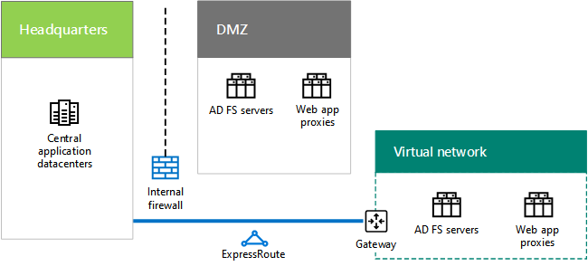

# Contoso Corporation 프로그램 idIdentity for the Contoso Corporation

 **요약:** Contoso IDaaS를 활용 하 고 지리적으로 분산 된를 제공 하는 방법 및 해당 사용자에 대 한 중복 인증을 이해 합니다.**Summary:** Understand how Contoso takes advantage of IDaaS and provides geographically distributed and redundant authentication for its users.
  
Microsoft은 서비스 (IDaaS)으로 해당 클라우드 서비스에서 Id를 제공합니다. 클라우드 (포함) 인프라를 채택 하는를 Contoso의 IDaaS 솔루션의 온-프레미스 id 공급자를 활용 하 고 해당 기존 신뢰할 수 있는, 타사 id 공급자와 연결 된 인증을 포함 해야 합니다.Microsoft provides an Identity as a Service (IDaaS) across its cloud offerings. To adopt a cloud-inclusive infrastructure, Contoso's IDaaS solution must leverage their on-premises identity provider and include federated authentication with their existing trusted, third-party identity providers.
  
## Contoso의 Windows Server AD 포리스트Contoso's Windows Server AD forest

Contoso의 세계 각 지역에 대 한 7 도메인과 contoso.com에 대 한 단일 Windows Server Active Directory (AD) 포리스트를 사용합니다. 본사, 지역 허브 사무실 및 위성 사무실 로컬 인증 및 권한 부여에 대 한 도메인 컨트롤러를 포함 합니다.Contoso uses a single Windows Server Active Directory (AD) forest for contoso.com with seven domains, one for each region of the world. The headquarters, regional hub offices, and satellite offices contain domain controllers for local authentication and authorization.
  
**그림 1: Contoso의 포리스트 및 도메인 전세계****Figure 1: Contoso's forest and domains worldwide**

  
그림 1은 지역 허브를 포함 하는 전세계의 다른 부분에 대 한 지역 도메인으로 구성 된 Contoso 포리스트를 보여줍니다.Figure 1 shows the Contoso forest with regional domains for the different parts of the world that contain regional hubs.
  
Contoso는 contoso.com 포리스트의 해당 클라우드 기반 앱 및 작업에 대 한 권한 부여 및 인증에 대 한 계정 및 그룹을 사용 하려고 합니다.Contoso wants to use the accounts and groups in the contoso.com forest for authentication and authorization for its cloud-based apps and workloads.
  
## Contoso의 연결 된 인증 인프라Contoso's federated authentication infrastructure

Contoso 수 있습니다.Contoso allows:
  
- 자신의 공용 웹사이트에 로그인 하려면 Microsoft, Facebook, 또는 Google 메일 계정을 사용 하 여 고객 합니다.Customers to use their Microsoft, Facebook, or Google Mail accounts to sign in to their public web site.
    
- 공급 업체와 파트너 익스트라넷 파트너에 게 로그인 LinkedIn, 가지 Salesforce, 또는 Google 메일 계정을 사용 하 여 합니다.Vendors and partners to use their LinkedIn, Salesforce, or Google Mail accounts to sign in to the partner extranet.
    
**고객 및 파트너에 대 한 연결 된 인증에 대 한 그림 2: Contoso의 지원****Figure 2: Contoso's support for federated authentication for customers and partners**

  
그림 2에는 공용 웹사이트, 엑스트라넷, 파트너 및 AD FS 서버 집합이 포함 된 Contoso DMZ 보여줍니다. DMZ 고객 및 파트너 및 인터넷 서비스를 포함 하는 인터넷에 연결 됩니다.Figure 2 shows the Contoso DMZ containing a public web site, a partner extranet, and a set of AD FS servers. The DMZ is connected to the Internet that contains customers and partners and Internet services.
  
Active Directory Federation Services (AD FS) 서버는 DMZ에 공용 웹사이트에 대 한 액세스에 대 한 자격 증명 고객 및 파트너 자격 증명 익스트라넷 파트너에 대 한 액세스를 인증합니다.Active Directory Federation Services (AD FS) servers in the DMZ authenticate customer credentials for access to the public web site and partner credentials for access to the partner extranet.
  
Contoso 전환 해당 공용 웹사이트를 Azure 웹 응용 프로그램 및 Dynamics 365 익스트라넷 파트너, 고객 및 파트너에 대 한 이러한 타사 id 공급자를 사용 하 여 계속 하려면 원하는 합니다. Contoso Azure AD 테 넌 트 및 이러한 타사 id 공급자 간의 연결을 구성 하 여이 작업을 수행 됩니다.When Contoso transitions its public web site to an Azure Web App and partner extranet to Dynamics 365, they want to continue to use these third-party identity providers for their customers and partners. This will be accomplished by configuring federation between Contoso Azure AD tenants and these third-party identity providers.
  
## Contoso의 Windows Server AD 포리스트에 대 한 디렉터리 동기화Directory synchronization for Contoso's Windows Server AD forest

Contoso의 파리 데이터 센터에서 서버 클러스터에서 Azure AD 연결 도구를 배포 했습니다. Windows Server AD 포리스트 contoso.com에 변경 내용을 Azure AD 테 넌 트 Contoso의 Office 365, EMS, Dynamics 365 및 Azure 구독 하 여 공유와 동기화 하는 azure AD 연결 합니다. 구독, 라이선스, 사용자 계정 및 테 넌 트에 대 한 자세한 내용은 [구독, 라이선스 및 Contoso Corporation에 대 한 사용자 계정을](subscriptions-licenses-and-user-accounts-for-the-contoso-corporation.md)참조 하십시오.Contoso has deployed the Azure AD Connect tool on a cluster of servers in its Paris datacenter. Azure AD Connect synchronizes changes to the contoso.com Windows Server AD forest with the Azure AD tenant shared by Contoso's Office 365, EMS, Dynamics 365, and Azure subscriptions. For more information about subscriptions, licenses, user accounts, and tenants, see [Subscriptions, licenses, and user accounts for the Contoso Corporation](subscriptions-licenses-and-user-accounts-for-the-contoso-corporation.md).
  
**그림 3: Contoso의 디렉터리 동기화 인프라****Figure 3: Contoso's directory synchronization infrastructure**

  
그림 3은 Azure AD 테 넌 트와 Contoso Windows Server AD 포리스트를 동기화 하는 Azure AD 연결을 실행 하는 서버 클러스터를 보여줍니다.Figure 3 shows a cluster of servers running Azure AD Connect synchronizing the Contoso Windows Server AD forest with the Azure AD tenant.
  
Contoso가 Contoso의 작업자에 대 한 single sign-on을 제공 하는 연결 된 인증을 구성 합니다. Windows Server AD 포리스트 contoso.com에 이미 로그인 한 사용자가 Microsoft SaaS 또는 PaaS 클라우드 리소스에 액세스 하는 경우 이러한를 묻는 메시지가 나타나지 암호에 대 한 합니다.Contoso has configured federated authentication, which provides single sign-on for Contoso's workers. When a user that has already signed in to the contoso.com Windows Server AD forest accesses a Microsoft SaaS or PaaS cloud resource, they will not be prompted for a password.
  
## Contoso 인증 트래픽 지역별 배포Geographical distribution of Contoso authentication traffic

해당 모바일 및 원격 리소스를 더 잘 지원 하기 위해 Contoso 집합 지역 사무소에 인증 서버를 배포 했습니다. 이 인프라는 부하를 분산 하 고 일반적인 Azure AD 테 넌 트를 사용 하는 Microsoft 클라우드 서비스에 대 한 액세스에 대 한 사용자 자격 증명을 인증 하는 경우 중복성 및 높은 성능을 제공 합니다.To better support its mobile and remote workforce, Contoso has deployed sets of authentication servers in its regional offices. This infrastructure distributes the load and provides redundancy and higher performance when authenticating user credentials for access to Microsoft cloud offerings that use the common Azure AD tenant.
  
부하를 분산 하 여 인증 요청을 Contoso가 메서드는 인증 서버의 지역별로 가장 가까운 집합 클라이언트 인증을 참조 하는 라우팅 성능을 사용 하는 프로필 사용 하 여 Azure 트래픽 관리자를 구성 합니다.To distribute the load of authentication requests, Contoso has configured Azure Traffic Manager with a profile that uses the performance routing method, which refers authenticating clients to the regionally closest set of authentication servers. 
  
**그림 4: 지리적 지사에 대 한 인증 트래픽****Figure 4: Geographical distribution of authentication traffic for regional offices**

  
그림 4 지사에서 클라이언트 컴퓨터, Azure 트래픽 관리자 및 인증 서버의 레이어를 표시합니다. 각 지사를 사용 하 여 웹 프록시 및 AD FS 서버와 Windows Server AD 도메인 컨트롤러 사용자 자격 증명을 인증 합니다.Figure 4 shows the layers of client computers, Azure Traffic Manager, and authentication servers in regional offices. Each regional office uses web proxies and AD FS servers to authenticate user credentials with Windows Server AD domain controllers.
  
인증 프로세스 예:Authentication process example:
  
1. 클라이언트 컴퓨터에서 통신을 시작 웹 페이지를 Office 365 테 넌 시에서 유럽의 (예: sharepoint.contoso.com).The client computer initiates communication with a web page in the Office 365 tenancy in Europe (such as sharepoint.contoso.com).
    
2. Office 365 다시 보낼 증명 인증 요청을 보냅니다. 요청 URL에 인증 요청을 포함 합니다.Office 365 sends back a request to send proof of authentication. The request contains the URL to contact for authentication.
    
3. 클라이언트 컴퓨터를 IP 주소로 DNS 이름 URL에를 확인 하려고 시도 합니다.The client computer attempts to resolve the DNS name in the URL to an IP address.
    
4. Azure 트래픽 관리자 DNS 쿼리를 받아 클라이언트 컴퓨터에 가장 가까운 지역 사무소에 있는 웹 응용 프로그램 프록시 서버의 IP 주소를 사용 하 여 클라이언트 컴퓨터에 응답 합니다.Azure Traffic Manager receives the DNS query and responds to the client computer with the IP address of a web application proxy server in the regional office that is closest to the client computer.
    
5.  클라이언트 컴퓨터에서 AD FS 서버에 요청을 전달 하는 웹 응용 프로그램 프록시 서버에 인증 요청을 보냅니다.The client computer sends an authentication request to a web application proxy server, which forwards the request to an AD FS server.
    
6. AD FS 서버는 클라이언트 컴퓨터에서 사용자 자격 증명을 요청합니다.The AD FS server requests the user credentials from the client computer.
    
7. 클라이언트 컴퓨터에서 사용자에 게 확인 하지 않고 사용자 자격 증명을 보냅니다.The client computer sends the user credentials without prompting the user.
    
8. AD FS 서버는 지사에서 Windows Server AD 도메인 컨트롤러에 자격 증명의 유효성을 검사 하 고 클라이언트 컴퓨터에는 보안 토큰을 반환 합니다.The AD FS server validates the credentials with a Windows Server AD domain controller in the regional office and returns a security token to the client computer.
    
9. 클라이언트 컴퓨터에서 Office 365에 보안 토큰을 보냅니다.The client computer sends the security token to Office 365.
    
10. 유효성 검사를 수행한 후 Office 365 보안 토큰을 캐시 하 고 클라이언트 컴퓨터에 1 단계에서 요청 된 웹 페이지를 보냅니다.After successful validation, Office 365 caches the security token and sends the web page requested in step 1 to the client computer.
    
## Azure IaaS에 본사 인증 인프라에 대 한 중복Redundancy for the headquarters authentication infrastructure in Azure IaaS

15, 000 작업자를 포함 하는 파리 본사의 원격 및 모바일 작업자에 대 한 중복을 제공 하려면 Contoso 두번째 집합이 Azure IaaS AD FS 서버 및 응용 프로그램 프록시를 배포 했습니다.To provide redundancy for the remote and mobile workers of the Paris headquarters that contains 15,000 workers, Contoso has deployed a second set of application proxies and AD FS servers in Azure IaaS.
  
**Azure IaaS에서 그림 5: 중복 인증 인프라****Figure 5: Redundant authentication infrastructure in Azure IaaS**

  
그림 5에서는 웹 프록시 및 AD FS 서버 DMZ와 추가 집합의 각 크로스-프레미스 Azure 가상 네트워크입니다.Figure 5 shows web proxies and AD FS servers in the DMZ and an additional set of each in a cross-premises Azure virtual network.
  
DMZ 본사에서 기본 인증 서버를 사용할 수, IT 직원이 Azure IaaS에 배포 된 중복 집합을 통해 전환 합니다. 파리 office 컴퓨터에서 후속 인증 요청 가용성 문제를 해결할 때까지 Azure IaaS의 집합을 사용 합니다.When the primary authentication servers in the headquarters DMZ become unavailable, IT staff switch over to the redundant set deployed in Azure IaaS. Subsequent authentication requests from Paris office computers use the set in Azure IaaS until the availability problem is corrected.
  
전환 및 다시 전환, Contoso 업데이트는 웹 응용 프로그램 프록시에 대 한 다양 한 IP 주소를 사용 하 여 파리 영역에 대 한 Azure 트래픽 관리자 프로필:To switch over and switch back, Contoso updates the Azure Traffic Manager profile for the Paris region to use a different set of IP addresses for the web application proxies:
  
- DMZ 인증 서버를 사용할 수 있는 경우 DMZ에 있는 서버의 IP 주소를 사용 합니다.When the DMZ authentication servers are available, use the IP addresses of the servers in the DMZ.
    
- DMZ 인증 서버를 사용할 수 없는 경우 Azure IaaS에서 서버 IP 주소를 사용 합니다.When the DMZ authentication servers are not available, use the IP addresses of the servers in Azure IaaS.
    
## 참고 항목See Also

[Microsoft 클라우드의 ContosoContoso in the Microsoft Cloud](contoso-in-the-microsoft-cloud.md)
  
[Microsoft 클라우드 IT 아키텍처 리소스Microsoft Cloud IT architecture resources](microsoft-cloud-it-architecture-resources.md)

[Microsoft Cloud ID for Enterprise ArchitectsMicrosoft Cloud Identity for Enterprise Architects](http://aka.ms/cloudarchidentity)
  
[Office 365용 ID 및 장치 보호Identity and Device Protection for Office 365](http://aka.ms/o365protect_device)
  
[Microsoft의 엔터프라이즈 클라우드 로드맵: IT 의사 결정권자를 위한 리소스Microsoft's Enterprise Cloud Roadmap: Resources for IT Decision Makers](https://sway.com/FJ2xsyWtkJc2taRD)

