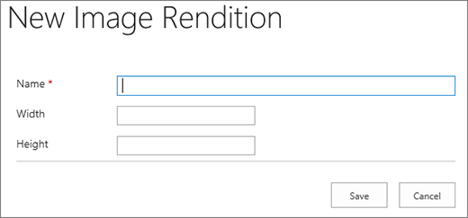

# SharePoint Online에 대한 이미지 최적화Image optimization for SharePoint Online

웹 페이지의 로드 속도는 이미지, HTML, JavaScript 및 CSS를 포함 하 여 페이지를 렌더링 하는 데 필요한 모든 구성 요소의 조합 된 크기에 따라 달라 집니다.The loading speed of a webpage depends on the combined size of all the components required to render the page including images, HTML, JavaScript, and CSS. 이미지는 사이트를 보다 편리 하 게 만들 수 있도록 하는 유용한 방법 이지만 크기는 성능에 영향을 줄 수 있습니다.Images are a great way to make your site more appealing, but their size can affect performance. 압축 및 크기 조정을 통해 이미지를 최적화 하 고 스프라이트를 사용 하면 매우 큰 이미지의 효과를 오프셋할 수 있습니다.By optimizing your images with compression and resizing, and using sprites, you can offset the effects of very large images. SharePoint 이미지 변환을 사용 하 여 단일 큰 이미지를 업로드 하 고 이미지의 섹션을 표시 하 여 다시 로드 하는 대신 재사용할 수 있도록 허용 합니다.Using SharePoint image renditions, you can upload a single large image, and display sections of the image allowing it to be reused rather than reloaded.
  
## 스프라이트를 사용 하 여 SharePoint Online의 이미지 로드 속도 향상Using sprites to speed up image loading in SharePoint Online

|||
|:-----|:-----|
| 이미지 스프라이트에는 여러 개의 작은 이미지가 포함 됩니다.An image sprite contains many smaller images. CSS 사용 절대 위치 지정을 사용 하 여 페이지의 특정 부분에 표시할 합성 이미지 부분을 선택 합니다.Using CSS you select a part of the composite image to display on a particular part of the page with absolute positioning. 기본적으로 여러 이미지를 로드 하는 대신 단일 이미지를 페이지 주위에 이동 하 고, 필요한 스프라이트 이미지 부분이 최종 사용자에 게 표시 되는 작은 창을 통해 해당 이미지의 일부분을 볼 수 있도록 합니다.Basically, you move a single image around the page instead of loading multiple images, and make a small part of that image visible through a small window where the required part of the sprite image is shown to the end user. SharePoint Online에서는 스프라이트를 사용 하 여 sprite spcommon .png에 다양 한 아이콘을 표시 합니다.SharePoint Online uses sprites to display its various icons in the sprite spcommon.png.     여기서 설명 하는 내용은 다음과 같습니다.What's covered here:     이미지 압축Image compression     이미지 최적화Image optimization     SharePoint 이미지 변환SharePoint image renditions    ||
   
이렇게 하면 몇 개의 이미지를 하나만 다운로드 한 다음 캐시 하 여 해당 이미지를 다시 사용 하기 때문에 성능을 향상 시킬 수 있습니다.This can increase performance because you download only one image instead of several and then cache and reuse that image. 이미지가 여러 이미지 대신 단일 이미지를 포함 하 여 캐시 된 상태로 유지 되지 않더라도이 메서드는 서버에 대 한 총 HTTP 요청 수를 줄여 페이지 로드 시간을 줄입니다.Even if the image does not remain cached, by having a single image instead of multiple images, this method reduces the total number of HTTP requests to the server which will reduce page loading times. 이는 실제로 이미지 묶음 형태입니다.This is really a form of image bundling. 위에서 설명한 SharePoint 예에서와 같이 이미지가 자주 변경 되지 않는 경우 (예: 아이콘)에는이 방법이 매우 유용 합니다.This is a very useful technique if the images are not changing very often, for example, icons, as shown in the SharePoint example provided above. Microsoft Visual Studio에서 [웹 Essentials](http://vswebessentials.com/), 오픈 소스, 커뮤니티 기반 프로젝트를 사용 하 여이를 쉽게 활용 하는 방법을 사용할 수 있습니다.You can how to use [Web Essentials](http://vswebessentials.com/), a third-party, open-source, community-based project to achieve this easily in Microsoft Visual Studio. 자세한 내용은 [SharePoint Online의 축소 및 번들](https://go.microsoft.com/fwlink/?LinkId=708698)를 참조 하세요.For more information, see [Minification and bundling in SharePoint Online](https://go.microsoft.com/fwlink/?LinkId=708698).
  
## SharePoint에서 이미지 압축 및 최적화를 사용 하 여 페이지 로드 속도 향상Using image compression and optimization to speed up page loading in SharePoint

이미지 압축 및 최적화는 사이트에서 사용 하는 이미지의 파일 크기를 줄이는 데 도움이 됩니다.Image compression and optimization is about reducing the file size of the images you use on your site. 이미지 크기를 줄이는 가장 좋은 방법은 이미지를 사이트에 표시 되는 최대 크기로 조정 하는 것입니다.Often, the best technique to reduce the size of an image is to resize the image to the maximum dimensions that it will be viewed on the site. 표시 되는 것 보다 큰 이미지를 갖는 것은 적절 하지 않습니다.There is no sense in having an image larger than it will ever be viewed. 이미지 편집기를 사용 하 여 이미지가 올바른 차원 인지 확인 하면 페이지 크기를 빠르고 쉽게 줄일 수 있습니다.Making sure images are of the correct dimensions using an image editor is a quick and easy way to reduce the size of your page.
  
이미지가 올바른 크기 이면 다음 단계는 이러한 이미지의 압축을 최적화 하는 것입니다.Once images are the right size, the next step is to optimize the compression of these images. 사진 갤러리 및 타사 도구를 비롯 한 다양 한 도구를 사용 하 여 압축 및 최적화에 사용할 수 있습니다.There are various tools available to use for compression and optimization, including Photo Gallery and third-party tools. 압축의 핵심은 최종 사용자가 discernible 품질을 유지 하면서 파일 크기를 최대한 줄이기 위한 것입니다.The key to compression is to reduce the file size as much as possible without losing any discernible quality for end users. 고화질 디스플레이에서 압축 파일을 테스트 하 여 여전히 제대로 표시 되는지 확인 합니다.Make sure you test your compressed files on a high-definition display to ensure they will still look good.
  
## SharePoint 이미지 변환을 사용 하 여 페이지 다운로드 속도 향상Speed up page downloads by using SharePoint image renditions

이미지 변환 기능은 미리 정의 된 이미지 차원에 따라 다양 한 버전의 이미지를 사용할 수 있도록 하는 SharePoint Online의 기능입니다.Image renditions are a feature in SharePoint Online that allows you to serve up different versions of images based on pre-defined image dimensions. 이는 사용자가 생성 한 이미지 내용이 있거나 너비 및 높이와 같은 이미지 크기가 사이트의 CSS에 의해 고정 되는 경우에 특히 중요 합니다.This is especially important when there is user-generated image content or the image dimensions such as width and height are fixed by the CSS on the site. CSS에서 이미지를 고정 하더라도 전체 해상도 이미지는 여전히 로드 됩니다.Even if an image is fixed by CSS, the full resolution image is still loaded. 이 경우 이미지 변환을 사용 하 여 파일 크기를 줄일 수 있습니다.In this case the file size can be reduced by using image renditions.
  
> [!NOTE]
> 게시를 사용 하도록 설정 된 경우에만 SharePoint에서 변환을 사용할 수 있습니다.Renditions are only available for SharePoint when publishing is enabled. 설정 \> 에서 게시를 사용 하도록 설정할 수 \> 있습니다. 사이트 \> 설정 사이트 기능 관리 SharePoint Server 게시You can enable publishing under Settings \> Site Settings \> Manage site features \> SharePoint Server Publishing. 그렇지 않으면 옵션이 나타나지 않습니다.The option will not appear otherwise. 
  
이미지 변환 크기 조정은 정의한 가장 작은 크기 (폭/높이)를 수행한 다음 이미지 크기를 조정 하 여 잠긴 가로 세로 비율에 따라 다른 치수의 크기를 자동으로 조정 하도록 하는 방식으로 작동 합니다.The image rendition resizing works by taking the smallest dimension you define, either width or height, and then resizing the image so that the other dimension is automatically resized based on the locked aspect ratio. 기본적으로 나머지 크기 만큼 가운데에서 이미지를 자릅니다.By default, it will crop the image from the center by the remaining dimensions. 예를 들어, 100 px 와이드 및 50px high의 변환을 정의 하 고 원래 이미지의 크기는 1000px이 하 인 경우 800px 차원이 이제 50px이 고 1000px 차원 (현재가 중 px)가 이미지 가운데에서 잘리는 방향으로 조정 됩니다.For example, if you define a rendition of 100px wide and 50px high and your original image is 1000px wide and 800px high, it will be resized so that the 800px dimension is now 50px and the 1000px dimension (now 62.5px) is cropped from the center of the image.
  
단계는 비교적 간단 하지만 이미지 변환을 사용 하 여 이미지를 추가 하기 전에 SharePoint 사이트에서 변환을 수행 해야 합니다.The steps are relatively simple but for images to use the renditions, the renditions need to be on the SharePoint site before you add the images. 또한 SharePoint Server 게시 인프라 (사이트 모음 수준) 및 SharePoint Server 게시 (사이트 수준) 기능이 설정 되어 있어야 합니다.In addition, you also need to have the SharePoint Server Publishing Infrastructure (Site Collection Level) and SharePoint Server Publishing (Site Level) features turned on.
  
 **이미지 변환을 추가 하 여 페이지 로드 속도 향상****Add an image rendition to speed up page loading**
  
1. 이 절차를 수행 하는 사용자 계정에 최소한 사이트 모음의 최상위 사이트에 대 한 디자인 권한이 있고 해당 사이트가 웹 페이지에 게시 되는지 확인 합니다.Verify that the user account that is performing this procedure has, at minimum, Design permissions to the top-level site of the site collection, and that the site is being published to a webpage.
    
2. 웹 브라우저에서 게시 사이트 모음의 최상위 사이트로 이동 합니다.In a web browser, go to the top-level site of the publishing site collection.
    
3. **설정** 아이콘을 선택 합니다.Choose the **Settings** icon. 
    
4. **사이트 설정** 페이지의 **디자인** 섹션에 기본 제공 이미지 변환이 표시 됩니다.On the **Site Settings** page, in the **Look and Feel** section, you will see the built-in image renditions. 
    
    기본 변환을 사용 하거나 **이미지 변환을** 선택 하 여 새 항목을 만들 수 있습니다.You can use the out of the box renditions or choose **Image Renditions** to create a new one. 
    
    
  
5. **이미지 변환** 페이지에서 **새 항목 추가**를 선택 합니다.On the **Image Renditions** page, choose **Add new item**.
    
    
  
6. **새 이미지 변환** 페이지의 **이름** 상자에 변환의 이름을 입력 합니다.On the **New Image Rendition** page, in the **Name** box, enter a name for the rendition. 
    
7. **너비** 및 **높이** 텍스트 상자에 변환의 너비와 높이를 픽셀 단위로 입력 한 다음 **저장**을 선택 합니다.In the **Width** and **Height** text boxes, enter the width and height, in pixels, of the rendition, and then choose **Save**.
    
    
  
## SharePoint에서 이미지 변환을 사용 하 여 사용자 지정 자르기Custom cropping with image renditions in SharePoint

기본적으로 이미지의 가운데부터 이미지 변환이 생성 됩니다.By default, an image rendition is generated from the center of the image. 이미지에서 사용 하려는 부분을 잘라서 개별 이미지의 이미지 변환을 조정할 수 있습니다.You can adjust the image rendition for individual images by cropping the portion of the image that you want to use. 변환 당 개별 단위로 이미지를 잘라낼 수 있습니다.You can crop the images on an individual basis, per rendition. 이미지를 자르면 SharePoint의 blob 캐시를 사용 하 여 페이지 로드 속도를 향상 시켜 각 변환에 대 한 이미지 버전을 만듭니다.Cropping the images speeds up page loading by using SharePoint's blob cache to create a version of the image for each rendition. 이러한 방식으로 이미지의 크기는 한 번만 조정 되므로 최종 사용자에 게 여러 번 사용할 준비가 되었기 때문입니다.This way the server load is reduced because the image is only resized once and is then ready to serve to end users multiple times. 이미지 변환을 자르는 방법에 대 한 자세한 내용은 [자르기 a image 렌디션](https://go.microsoft.com/fwlink/p/?LinkId=525626)를 참조 하십시오.For more information on how to crop an image rendition, see [Crop an image rendition](https://go.microsoft.com/fwlink/p/?LinkId=525626).
  

