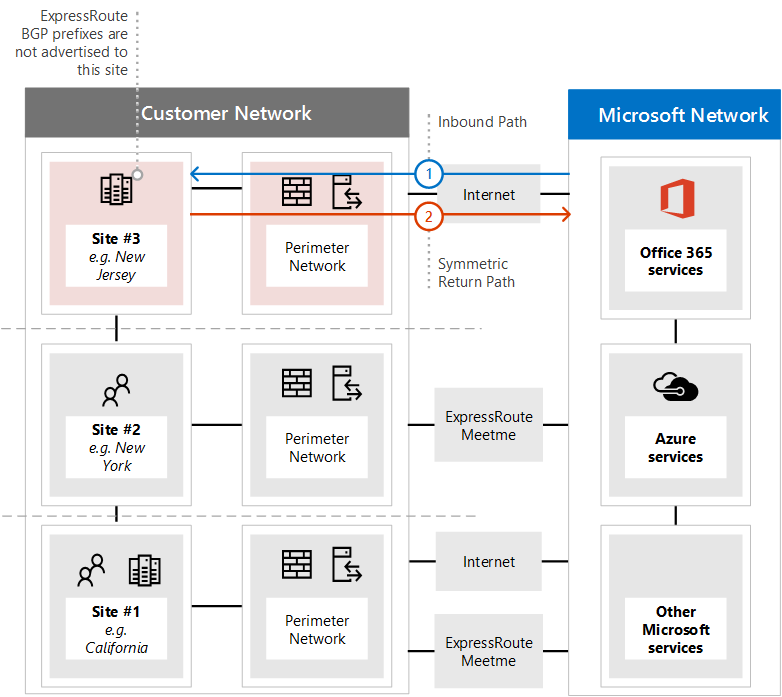

# <a name="implementing-expressroute-for-office-365"></a>Office 365용 ExpressRoute 구현

Office 365 용 Express를 통해 다양 한 인터넷 연결 Office 365 서비스에 대 한 대체 라우팅 경로를 제공 합니다. Office 365의 새 Express 아키텍처는 다음에 해당 IP 접두사를 재배포 하기 위한 프로 비전 된 Express 회로에 인터넷을 통해 이미 액세스할 수 있는 Office 365 서비스의 공개 IP 접두사를 기반으로 합니다. 네트워크. Express를 사용 하면 많은 Office 365 서비스에 대해 인터넷 및가을 통해 여러 다른 라우팅 경로를 효과적으로 사용 하도록 설정할 수 있습니다. 네트워크에서의 라우팅 상태는 내부 네트워크 토폴로지가 디자인 되는 방식이 크게 변경 된 것일 수 있습니다.
  
 **상태:** 전체 가이드 v2
  
핵심 네트워크 및 인터넷에 삽입 된 경로를 사용 하 여 전용 회로를 둘 다 사용 하는 경우의 네트워크 복잡성을 고려해 야 하는 Office 365 구현에 대 한를 신중 하 게 계획 해야 합니다. 사용자와 팀이이 가이드의 자세한 계획 및 테스트를 수행 하지 않는 경우에는 거 지 회로가 사용 하도록 설정 되어 있을 때 일시적으로 또는 Office 365 서비스에 대 한 총 연결이 끊어질 위험이 있습니다.
  
성공적인 구현을 위해서는 인프라 요구 사항을 분석 하 고 자세한 네트워크 평가 및 디자인을 통해 롤아웃 및 제어 되는 방식으로 롤아웃을 면밀 하 게 계획 하 고 자세한 유효성 검사 및 테스트 계획을 수립 해야 합니다. 대규모 분산 환경의 경우 구현 범위를 몇 달 동안 표시 하는 것은 일반적으로 발생 하지 않습니다. 이 가이드는 사전에 계획 하는 데 도움을 주기 위한 것입니다.
  
대규모 배포의 경우 계획 하는 데 6 개월이 소요 될 수 있으며, 네트워킹, 방화벽 및 프록시 서버 관리자, Office 365 관리자, 보안, 최종 사용자 지원, 프로젝트를 포함 하 여 조직에 있는 많은 영역의 팀 구성원이 포함 되는 경우가 많습니다. 관리 및 경영 후원 계획 프로세스에 대 한 투자가 진행 되 면 배포 실패가 발생 하 여 가동 중지 시간 또는 복잡 하 고 비용이 많이 드는 문제 해결이 발생할 가능성을 줄일 수 있습니다.
  
이 구현 가이드가 시작 되기 전에는 다음 사전 요구 사항이 완료 될 것으로 예상 됩니다.
  
1. 네트워크 평가를 완료 하 여가 수를 권장 하 고 승인 했는지를 확인 했습니다.

2. 사용자가 Express에서 네트워크 서비스 공급자를 선택 했습니다. [Express 경로 및 피어 링 위치](https://azure.microsoft.com/documentation/articles/expressroute-locations/)에 대 한 세부 정보를 확인 합니다.

3. 이미 사용자의 [express 경로 설명서](https://azure.microsoft.com/documentation/services/expressroute/) 를 읽고 이해 했으며 내부 네트워크가 대상의 필수 구성 요소 종단 끝까지 충족할 수 있습니다.

4. 팀에서 다음 [https://aka.ms/expressrouteoffice365](https://aka.ms/expressrouteoffice365)을 비롯 하 여, [https://aka.ms/ert](https://aka.ms/ert)에서 모든 공개 지침 및 문서를 읽고 채널 9의 [Azure express for Office 365 교육](https://channel9.msdn.com/series/aer) 시리즈를 확인 하 여 중요 한 기술 세부 정보를 파악할 수 있습니다.

      - SaaS 서비스의 인터넷 종속성

      - 비대칭 경로를 방지 하 고 복잡 한 라우팅을 처리 하는 방법

      - 경계 보안, 가용성 및 응용 프로그램 수준 제어를 통합 하는 방법

## <a name="begin-by-gathering-requirements"></a>요구 사항을 수집 하 여 시작
<a name="requirements"> </a>

먼저 조직 내에서 채택할 기능 및 서비스를 결정 합니다. 사용할 수 있는 다른 Office 365 서비스의 기능과 네트워크에서 해당 기능을 사용 하 여 사용자를 호스팅할 위치를 결정 해야 합니다. 시나리오 카탈로그를 사용 하는 경우에는 이러한 각 시나리오에 필요한 네트워크 특성을 추가 해야 합니다. 예를 들어, 인바운드 및 아웃 바운드 네트워크 트래픽 흐름과 Office 365 끝점을 대신 사용할 수 있습니다.
  
조직의 요구 사항을 수집 하려면 다음을 수행 합니다.
  
- Catalog 조직에서 사용 중인 Office 365 서비스에 대 한 인바운드 및 아웃 바운드 네트워크 트래픽입니다. Office 365 Url 및 IP 주소 범위 페이지를 참조 하 여 다른 사무실 365 시나리오에 필요한 흐름에 대해 설명 합니다.

- 내부 WAN 백본 및 토폴로지, 위성 사이트 연결, 마지막 마일, 사용자 연결, 네트워크 경계 송신 지점 및 프록시 서비스에 대 한 세부 정보를 보여 주는 기존 네트워크 토폴로지의 설명서를 수집 합니다.

  - Office 365 및 기타 Microsoft 서비스에서 연결할 네트워크 다이어그램의 인바운드 서비스 끝점을 확인 하 여 인터넷 및 제안 된 Express 연결 경로를 모두 표시 합니다.

  - 현재 인터넷에 송신 되는 위치와 다른 위치에서의 지역 사용자 위치 및 WAN 연결을 확인 하 고,이 위치로 제안 되는 위치는가 중이 고,로가 며이를 사용 하 여 다른 위치로의 위치를

  - 프록시, 방화벽 등의 모든에 지 장치를 식별 하 고 인터넷 및 Express를 통해 이동 하는 흐름에 대 한 관계를 카탈로그 합니다.

  - 최종 사용자가 인터넷 및가 중 흐름에 대해 직접 라우팅 또는 간접 응용 프로그램 프록시를 통해 Office 365 서비스에 액세스할 지 여부를 문서화 합니다.

- 네트워크 다이어그램에 테 넌 트의 위치 및 모임 사용자 위치를 추가 합니다.

- 주요 사용자 위치에서 Office 365로 예상 되 고 관찰 되는 네트워크 성능 및 대기 시간 특성을 예측 합니다. Office 365은 글로벌 및 분산 서비스 집합으로, 사용자가 테 넌 트의 위치와 다를 수 있는 위치에 연결 된다는 점에 유의 하세요. 이러한 이유 때문에 사용자와 인터넷 연결을 통한 Microsoft 전역 네트워크의 가장 가까운 가장자리 사이의 대기 시간을 측정 하 고 최적화 하는 것이 좋습니다. 네트워크 평가의 결과를 사용 하 여이 작업을 지원할 수 있습니다.

- 새 Express 경로 연결을 사용 하 여 충족 해야 하는 회사 네트워크 보안 및 고가용성 요구 사항을 나열 합니다. 예를 들어 인터넷 송신 또는 Express 회로 오류가 발생 하는 경우 사용자가 계속 해 서 Office 365에 액세스 하는 방법을 알아봅니다.

- 인터넷 경로를 사용할 인바운드 및 아웃 바운드 Office 365 네트워크 흐름을 문서화 하 고이를 사용 하 여이를 연결 합니다. 사용자의 지리적 위치 및 온-프레미스 네트워크 토폴로지의 세부 사항에 대 한 자세한 내용은 계획을 사용자 위치 마다 다르게 해야 할 수 있습니다.

### <a name="catalog-your-outbound-and-inbound-network-traffic"></a>아웃 바운드 및 인바운드 네트워크 트래픽 카탈로그
<a name="trafficCatalog"> </a>

라우팅 및 기타 네트워크 복잡성을 최소화 하려면 규정 요구 사항 또는 네트워크 평가의 결과로 인해 전용 연결을 수행 하는 데 필요한 네트워크 트래픽 흐름에 대해서만 Office 365 용을 사용 하는 것이 좋습니다. 또한, 대 중 라우팅 및 접근 방식의 범위와 아웃 바운드 및 인바운드 네트워크 트래픽 흐름을 구현 프로젝트의 서로 다른 단계로 진행 하는 것이 좋습니다. 사용자가 시작한 아웃 바운드 네트워크 트래픽 흐름 뿐 아니라 인터넷을 통한 인바운드 네트워크 트래픽 흐름을 유지 하는 방법에 대 365 한 자세한 정보를 얻을 수 있습니다. 라우팅 가능성
  
네트워크 트래픽 카탈로그에는 온-프레미스 네트워크와 Microsoft 간의 모든 인바운드 및 아웃 바운드 네트워크 연결에 대 한 목록이 포함 되어 있어야 합니다.
  
- 아웃 바운드 네트워크 트래픽 흐름은 내부 클라이언트나 서버와 같이 온-프레미스 환경에서 Microsoft 서비스 목적지를 사용 하 여 연결이 시작 되는 모든 시나리오입니다. 이러한 연결은 office 365에 대 한 경로에서 프록시 서버, 방화벽 또는 기타 네트워킹 장치를 통해 연결이 진행 되는 경우 처럼 Office 365 또는 간접으로 직접 연결 될 수 있습니다.

- 인바운드 네트워크 트래픽 흐름은 Microsoft 클라우드에서 온-프레미스 호스트로의 연결이 시작 되는 모든 시나리오입니다. 이러한 연결은 일반적으로 외부에서 시작 된 흐름에 대해 고객 보안 정책에 필요한 방화벽 및 기타 보안 인프라를 통과 해야 합니다.

Office [365 용로 라우팅](https://support.office.com/article/Routing-with-ExpressRoute-for-Office-365-e1da26c6-2d39-4379-af6f-4da213218408) 문서의 **경로 대칭** 결정 섹션을 읽고, 인바운드 트래픽을 보낼 서비스를 확인 하 고, office 365에서 **Office 365에 대 한 express** 로 표시 된 열을 찾습니다. [ 끝점](https://support.office.com/article/Office-365-URLs-and-IP-address-ranges-8548a211-3fe7-47cb-abb1-355ea5aa88a2) 참조 문서를 통해 나머지 연결 정보를 확인할 수 있습니다.
  
아웃 바운드 연결을 필요로 하는 각 서비스에 대해 네트워크 라우팅, 프록시 구성, 패킷 검사 및 대역폭 요구를 비롯 한 서비스에 대해 계획 된 연결을 기술 하는 것이 좋습니다.
  
인바운드 연결을 필요로 하는 각 서비스에 대해 몇 가지 추가 정보가 필요 합니다. Microsoft 클라우드의 서버는 온-프레미스 네트워크에 대 한 연결을 설정 합니다. 연결이 올바르게 구성 되었는지 확인 하려면 다음을 비롯 한이 연결의 모든 측면에 대해 설명 합니다. 이러한 인바운드 연결을 허용 하는 서비스에 대 한 공용 DNS 항목, 연결 형식 IPv4 IP 주소, ISP 장비에서 사용 하는 인바운드 NAT 또는 원본 NAT는 이러한 연결용으로 처리 됩니다.
  
인바운드 연결은 비대칭 라우팅이 도입 되지 않도록 인터넷을 통해 연결 하는지, 아니면 Express를 통해 연결할지 여부에 관계 없이 검토 해야 합니다. 경우에 따라 Office 365 서비스에서 인바운드 연결을 시작 하는 온-프레미스 끝점은 다른 Microsoft 및 타사 서비스 에서도 액세스 해야 합니다. Office 365 용으로 이러한 서비스에 대 한 라우팅 경로를 사용 하도록 설정 하는 것이 다른 시나리오를 중단 하지 않는 것이 좋습니다. 대부분의 경우 고객은 사용자가 원본 기반 NAT와 같은 내부 네트워크에 대 한 특정 변경 사항을 구현 해야 하 여,가을 사용 하도록 설정한 후 Microsoft에서 들어오는 인바운드 흐름을 유지할 수 있습니다.
  
다음은 필요한 세부 정보의 수준에 대 한 예제입니다. 이 경우 Exchange 하이브리드는 Express를 통해 온-프레미스 시스템으로 라우팅됩니다.

|**Connection 속성**|**값**|
|:-----|:-----|
|**네트워크 트래픽 방향** <br/> |인바운드  <br/> |
|**서비스** <br/> |Exchange 하이브리드  <br/> |
|**공용 Office 365 끝점 (원본)** <br/> |Exchange Online (IP 주소)  <br/> |
|**공용 온-프레미스 끝점 (대상)** <br/> |5.5.5.5  <br/> |
|**공용 (인터넷) DNS 항목** <br/> |Autodiscover.contoso.com  <br/> |
|**이 온-프레미스 끝점이 다른 (비 Office 365) Microsoft 서비스에서 사용 될 예정 입니까?** <br/> |아니요  <br/> |
|**이 온-프레미스 끝점이 인터넷의 사용자/시스템에 사용 됨** <br/> |예  <br/> |
|**공용 끝점을 통해 게시 된 내부 시스템** <br/> |Exchange Server 클라이언트 액세스 역할 (온-프레미스) 192.168.101, 192.168.102, 192.168.103  <br/> |
|**공용 끝점의 IP 알림** <br/> |**인터넷으로**: 5.5.0.0/16  <br/> **대상**: 5.5.5.0/24  <br/> |
|**보안/주변 컨트롤** <br/> |**인터넷 경로**: DeviceID_002  <br/> **Express 경로**: DeviceID_003  <br/> |
|**고가용성** <br/> |2 개 지역 중복에서 활성/활성 상태  <br/> 가을 회로-시카고 및 달라스  <br/> |
|**경로 대칭 제어** <br/> |**방법**: 원본 NAT  <br/> **인터넷 경로**: 192.168.5.5에 대 한 원본 NAT 인바운드 연결  <br/> |가 중 **경로**: 192.168.1.0 (시카고) 및 192.168.2.0 (달라스)에 대 한 원본 NAT 연결  <br/> |

다음은 아웃 바운드 전용 서비스의 예입니다.

|**Connection 속성**|**값**|
|:-----|:-----|
|**네트워크 트래픽 방향** <br/> |아웃 바운드  <br/> |
|**서비스** <br/> |SharePoint Online  <br/> |
|**온-프레미스 끝점 (원본)** <br/> |사용자 워크스테이션  <br/> |
|**공용 Office 365 끝점 (대상)** <br/> |SharePoint Online (IP 주소)  <br/> |
|**공용 (인터넷) DNS 항목** <br/> |\*sharepoint.com (및 추가 Fqdn)  <br/> |
|**CDN 조회** <br/> |cdn.sharepointonline.com (및 추가 Fqdn)-CDN 공급자가 유지 관리 하는 IP 주소)  <br/> |
|**IP 알림 및 NAT 사용** <br/> |**인터넷 경로/원본 NAT**: 1.1.1.0/24  <br/> 가 중 **경로/원본 NAT**: 1.1.2.0/24 (시카고) 및 1.1.3.0/24 (달라스)  <br/> |
|**Connectivity 메서드** <br/> |**인터넷**: 레이어 7 프록시 (.pac 파일)를 통해  <br/> **Express**경로: 직접 라우팅 (프록시 없음)  <br/> |
|**보안/주변 컨트롤** <br/> |**인터넷 경로**: DeviceID_002  <br/> **Express 경로**: DeviceID_003  <br/> |
|**고가용성** <br/> |**인터넷 경로**: 중복 인터넷 송신  <br/> 가 중 **경로**: 2 개 지역 중복 비트 대의 활성/활성 ' 핫 potato ' 라우팅-시카고 및 달라스  <br/> |
|**경로 대칭 제어** <br/> |**방법**: 모든 연결에 대 한 원본 NAT  <br/> |

### <a name="your-network-topology-design-with-regional-connectivity"></a>지역별 연결을 사용한 네트워크 토폴로지 디자인
<a name="topology"> </a>

서비스와 관련 네트워크 트래픽 흐름을 이해 한 후에는 이러한 새 연결 요구 사항을 통합 하는 네트워크 다이어그램을 만들고 Office 365에 대 한 Express를 사용 하기 위해 수행 해야 하는 변경 사항에 대해 설명 합니다. 다이어그램에 다음이 포함 되어야 합니다.
  
1. Office 365 및 기타 서비스에 액세스할 수 있는 모든 사용자 위치입니다.

2. 모든 인터넷 및 Express 송신 지점

3. 라우터, 방화벽, 응용 프로그램 프록시 서버 및 침입 감지/예방를 포함 하 여 네트워크의 연결을 관리 하는 모든 아웃 바운드 및 인바운드 장치입니다.

4. ADFS 웹 응용 프로그램 프록시 서버에서의 연결을 허용 하는 내부 ADFS 서버와 같은 모든 인바운드 트래픽에 대 한 내부 대상입니다.

5. 보급 될 모든 IP 서브넷의 카탈로그입니다.

6. 사용자가 Office 365에서 액세스할 수 있는 각 위치를 식별 하 고, (으)로 사용할 모임 me 위치를 나열 합니다.

7. 내부 네트워크 토폴로지의 위치 및 지역 (Express에서 배운 Microsoft IP 접두사는 허용, 필터링 및 전파 됨)

8. 네트워크 토폴로지는 각 네트워크 세그먼트의 지리적 위치와이를 통해 Express 및/또는 인터넷을 통해 Microsoft 네트워크에 연결 하는 방법을 보여 줍니다.

아래 다이어그램에서는 사용자가 office 365에 대 한 인바운드 및 아웃 바운드 라우팅 알림과 함께 사무실 365을 사용 하는 각 위치를 보여 줍니다.
  

  
아웃 바운드 트래픽의 경우 사용자는 다음 세 가지 방법 중 하나를 사용 하 여 Office 365에 액세스 합니다.
  
1. 캘리포니아에 있는 사용자에 대해 북미의 모임에 지 위치를 사용 합니다.

2. 홍콩에서 사용자를 위한 홍콩 내 위치를 사용 하는 경우

3. 사용자 수가 적고, 모든 Express 회로가 프로 비전 되지 않은 방글라데시에서 인터넷을 통해 제공 됩니다.


  
마찬가지로 Office 365 로부터의 인바운드 네트워크 트래픽은 다음 세 가지 방법 중 하나로 반환 됩니다.
  
1. 캘리포니아에 있는 사용자에 대해 북미의 모임에 지 위치를 사용 합니다.

2. 홍콩에서 사용자를 위한 홍콩 내 위치를 사용 하는 경우

3. 사용자 수가 적고, 모든 Express 회로가 프로 비전 되지 않은 방글라데시에서 인터넷을 통해 제공 됩니다.


  
### <a name="determine-the-appropriate-meet-me-location"></a>적절 한 모임 시작 위치 결정

사용자가 네트워크를 Microsoft 네트워크에 연결 하는 실제 위치인, 모임-내 위치를 선택 하는 것은 사람들이 Office 365에 액세스 하는 위치의 영향을 받습니다. SaaS 제공은 Office 365가 Azure에서와 동일한 방식으로 IaaS 또는 PaaS 지역 모델에서 작동 하지 않습니다. 대신, Office 365은 사용자의 테 넌 트가 호스트 되는 동일한 위치 또는 지역에 있지 않을 수도 있는 여러 데이터 센터 및 지역의 끝점에 연결 해야 할 수 있는 분산 된 공동 작업 서비스 집합입니다.
  
즉, Office 365에 대 한 비트 번호에 대해 자동 연결을 선택할 때 필요한 가장 중요 한 고려 사항은 조직의 사용자가 연결할 원본 위치입니다. 최적의 Office 365 연결에 대 한 일반적인 권장 사항은 라우팅을 구현 하 여 Office 365 서비스에 대 한 사용자 요청이 가장 짧은 네트워크 경로를 통해 Microsoft 네트워크에 전달 되도록 하 고,이를 ' 핫 potato ' 라우팅 이라고 하는 경우도 있습니다. 예를 들어 대부분의 Office 365 사용자가 하나 또는 두 위치에 있는 경우 해당 사용자의 위치에 가장 가까운 곳에 있는 모임에이 위치를 선택 하면 최적의 디자인을 만들 수 있습니다. 회사의 여러 지역에 큰 사용자 인구를 사용 하는 경우에는 여러 개의 Express 회로와 모임에 지를 사용 하는 것을 고려해 볼 수 있습니다. 일부 사용자 위치에서는 Microsoft 네트워크 및 Office 365의 가장 짧은/가장 좋은 경로를 제외 하 고는 내부 WAN 및 Express에서 모임에 대 한 정보를 검색할 수 있습니다 (인터넷을 통해).
  
사용자와 상대적으로 근접 한 지역 내에서 선택할 수 있는 여러 개의 모임 me 위치를 사용 하는 경우가 많습니다. 다음 표를 입력 하 여 결정을 안내 합니다.

|**캘리포니아, 뉴욕의 계획 된 정보 및 모임 시작 위치**||
|:-----|:-----|
|위치  <br/> |사용자 수  <br/> |인터넷 송신을 통한 Microsoft 네트워크에 대 한 예상 대기 시간  <br/> |Microsoft 네트워크 (Express를 통한) 예상 대기 시간  <br/> |
|Los Angeles  <br/> |10,000  <br/> |~ 15ms  <br/> |~ 10ms (실리콘 유역를 통해)  <br/> |
|워싱턴 DC  <br/> |15000  <br/> |~ 20ms  <br/> |~ 10ms (뉴욕을 통해)  <br/> |
|지사  <br/> |5,000  <br/> |~ 15ms  <br/> |~ 40ms (뉴욕을 통해)  <br/> |

Office 365 지역을 표시 하는 글로벌 네트워크 아키텍처, Express 수준 네트워크 서비스 공급자 모임에 지 및 위치 별로 사용자 수량을 개발한 경우에는 최적화를 수행할 수 있는지 여부를 식별 하는 데 사용할 수 있습니다. 또한 모임 내 위치를 가져오기 위해 트래픽이 원거리 위치로 라우트되는 전역 헤어핀 네트워크 연결도 표시할 수 있습니다. 글로벌 네트워크에서 헤어핀를 검색 하는 경우 계속 하기 전에 재구성 해야 합니다. 다른 모임 내 위치를 찾거나 선택적 인터넷 아웃 키 송신 지점을 사용 하 여 헤어핀을 방지 합니다.
  
첫 번째 다이어그램은 북미에서 두 개의 실제 위치를 포함 하는 고객의 예를 보여 줍니다. Office 위치, Office 365 테 넌 트 위치 및 다양 한 방법에 대 한 정보를 볼 수 있습니다. 이 예에서는 고객에 게 다음과 같은 두 가지 원칙을 기반으로 하는 모임 me 위치를 선택 했습니다.
  
1. 조직 내 사용자에 게 가장 근접 합니다.

2. Office 365가 호스트 되는 Microsoft 데이터 센터와 가장 비슷하게 진행 됩니다.


  
이 개념을 약간 확장 하면 두 번째 다이어그램은 유사한 정보 및 의사 결정에 직면 한 여러 국립 고객의 예를 보여 줍니다. 이 고객에 게는 지역에서 차지 하는 공간을 증가 시키는 데 중점을 맞춘 10 명으로 구성 된 소규모 회사를 포함 하 고 있습니다. 체나이에는 모임에 대 한 위치가 있고 체나이에서는 Office 365이 호스트 되는 Microsoft 데이터 센터가 있으며,이를 통해 모임에 대 한 위치가 적합 합니다. 그러나 10 명의 사용자에 게는 추가 회로의 비용이 burdensome 됩니다. 네트워크에서 네트워크 트래픽을 전송 하는 것과 관련 된 대기 시간이 또 다른 거 대가 회로를 얻도록 하는 것 보다 더 효과적 인지 확인 해야 합니다.
  
또는, 방글라데시의 10 명이 소개 다이어그램에 설명 된 대로 내부 네트워크에 라우팅 하는 것 보다 인터넷을 통해 전송 되는 네트워크 트래픽에서 더 나은 성능을 경험할 수 있습니다. 낮은.
  

  
## <a name="create-your-expressroute-for-office-365-implementation-plan"></a>Office 365 구현 계획에 대 한 사용자를 위한 Express 만들기
<a name="implementation"> </a>

구현 계획에는 다음과 같은 네트워크의 모든 다른 인프라를 구성 하는 방법 및 정보를 구성 하는 방법에 대 한 기술적인 세부 정보가 모두 포함 되어야 합니다.
  
- Express 경로와 인터넷 간에 분할 되는 서비스를 계획 합니다.

- 대역폭, 보안, 고가용성 및 장애 조치 (failover) 계획

- 다양 한 위치에 적절 한 라우팅 경로 최적화를 포함 하 여 인바운드 및 아웃 바운드 라우팅 디자인

- 네트워크에 대 한 가능한 한도로 경로를 알리는 방법과 클라이언트에서 인터넷 또는 Express 경로를 선택 하기 위한 메커니즘을 결정 합니다. 예: 직접 라우팅 또는 응용 프로그램 프록시

- [보낸 사람 정책 프레임 워크](https://technet.microsoft.com/library/dn789058%28v=exchg.150%29.aspx) 항목을 포함 하 여 DNS 레코드 변경 계획

- 아웃 바운드 및 인바운드 원본 NAT를 포함 한 NAT 전략을 계획 합니다.

### <a name="plan-your-routing-with-both-internet-and-expressroute-network-paths"></a>인터넷 및가 중 네트워크 경로를 모두 사용 하 여 라우팅 계획
<a name="paths"> </a>

- 초기 배포의 경우에는 인바운드 전자 메일 또는 하이브리드 연결과 같은 모든 인바운드 서비스가 인터넷을 사용 하는 것이 좋습니다.

- [PAC/WPAD 파일](https://aka.ms/manageo365endpoints), 기본 경로, 프록시 서버 및 BGP 경로 광고 구성과 같은 최종 사용자 클라이언트 LAN 라우팅 계획

- 프록시 서버, 방화벽 및 클라우드 프록시를 포함 하는 경계 라우팅 계획

### <a name="plan-your-bandwidth-security-high-availability-and-failover"></a>대역폭, 보안, 고가용성 및 장애 조치 (failover) 계획
<a name="availability"> </a>

각 주요 Office 365 작업에 필요한 대역폭 계획을 만듭니다. Exchange Online, SharePoint Online 및 비즈니스용 Skype 온라인 대역폭 요구 사항을 별도로 예측 합니다. Exchange Online 및 비즈니스용 Skype에 대해 제공한 예상 계산기를 사용 하 여 시작할 수 있습니다. 그러나 조직의 대역폭 요구 사항을 완전히 이해 하려면 사용자 프로필 및 위치에 대 한 대표적인 샘플과 함께 파일럿 테스트를 수행 해야 합니다.
  
각 인터넷에서 보안을 처리 하 고 요금제로의 송신 위치를 계획에 추가 하 고, Office 365에 대 한 모든 정보 연결이 공용 피어 링을 사용 하며, 외부에 연결 하는 회사 보안 정책에 따라 보안을 유지 해야 합니다. lan.
  
계획에 어떤 사용자에 게 영향을 줄 수 있는지와 해당 사용자가 가장 간단한 방법으로 전체 용량으로 작업을 수행할 수 있는 방법에 대 한 세부 정보를 추가 합니다.
  
#### <a name="plan-bandwidth-requirements-including-skype-for-business-requirements-on-jitter-latency-congestion-and-headroom"></a>지터, 대기 시간, 혼잡 및 여유에 대 한 비즈니스용 Skype 요구 사항을 포함 하 여 대역폭 요구 사항 계획
  
비즈니스용 Skype Online에는 [비즈니스용 Skype online의 미디어 품질 및 네트워크 연결 성능](https://support.office.com/article/Media-Quality-and-Network-Connectivity-Performance-in-Skype-for-Business-Online-5fe3e01b-34cf-44e0-b897-b0b2a83f0917)문서에 설명 되어 있는 구체적인 추가 네트워크 요구 사항도 있습니다.
  
[Office 365 용 express를 사용한 네트워크 계획](https://support.office.com/article/Network-planning-with-ExpressRoute-for-Office-365-103208f1-e788-4601-aa45-504f896511cd)에서 **Azure express 경로를 위한 섹션 대역폭 계획** 을 읽어 보십시오.
  
파일럿 사용자와 대역폭 평가를 수행할 때, 가이드를 사용할 수 있습니다. [Office 365 성능 조정-초기 계획 및 성능 기록을 사용](https://support.office.com/article/Office-365-performance-tuning-using-baselines-and-performance-history-1492cb94-bd62-43e6-b8d0-2a61ed88ebae)합니다.
  
#### <a name="plan-for-high-availability-requirements"></a>고가용성 요구 사항 계획
  
필요에 따라 고가용성을 위한 요금제를 만들고이를 업데이트 된 네트워크 토폴로지 다이어그램에 포함 시킵니다. [Office 365 용 express를 사용한 네트워크 계획](https://support.office.com/article/Network-planning-with-ExpressRoute-for-Office-365-103208f1-e788-4601-aa45-504f896511cd)에서 **Azure express를 사용 하 여 고가용성 및 장애 조치 (failover)** 섹션을 읽어 보세요.
  
#### <a name="plan-for-network-security-requirements"></a>네트워크 보안 요구 사항 계획
  
네트워크 보안 요구 사항을 충족 하는 계획을 만들고이를 업데이트 된 네트워크 토폴로지 다이어그램에 통합 합니다. [Office 365의 express를 사용 하는 네트워크 계획](https://support.office.com/article/Network-planning-with-ExpressRoute-for-Office-365-103208f1-e788-4601-aa45-504f896511cd)에서 **office 365 시나리오의 Azure express에 보안 제어 적용 섹션을** 읽어 보십시오.
  
### <a name="design-outbound-service-connectivity"></a>아웃 바운드 서비스 연결 디자인
<a name="outbound"> </a>

Office 365에 대 한 Express에는 익숙하지 않을 수 있는 *아웃 바운드* 네트워크 요구 사항이 있습니다. 특히, Office 365에 대 한 사용자 및 네트워크를 나타내는 IP 주소와 Microsoft에 대 한 아웃 바운드 네트워크 연결의 원본 끝점 역할은 아래에 설명 된 특정 요구 사항을 따라야 합니다.
  
1. 끝점은 회사에 등록 되어 있는 공용 IP 주소 이거나, 사용자에 게 연결 되는가을 수 있도록 하는 통신을 제공 합니다.

2. 끝점은 Microsoft에 보급 하 고, Express에서 유효성을 검사/수락 해야 합니다.

3. 끝점은 동일한 이상의 기본 설정 라우팅 메트릭으로 인터넷에 보급 해서는 안 됩니다.

4. 이 끝점은 Express를 통해 구성 되지 않은 Microsoft 서비스에 연결 하는 데 사용 하지 않아야 합니다.

네트워크 디자인이 이러한 요구 사항을 충족 하지 않는 경우에는 사용자가 경로 검정 holing 또는 비대칭 라우팅으로 인해 Office 365 및 기타 Microsoft 서비스에 대 한 연결 오류를 경험 하 게 됩니다. 이는 Microsoft 서비스에 대 한 요청이 Express를 통해 라우팅되는 경우, 응답이 인터넷을 통해 다시 전달 되거나 방화벽 같은 스테이트 풀 네트워크 장치에 의해 응답이 손실 될 때 발생 합니다.
  
위의 요구 사항을 충족 하는 데 사용할 수 있는 가장 일반적인 방법은 네트워크의 일부로 구현 되거나,로이 운송 업체에서 제공 하는 원본 NAT를 사용 하는 것입니다. 원본 NAT를 사용 하면 인터넷 네트워크의 세부 정보 및 개인 IP 주소를 사용자를 대상으로 추상화할 수 있습니다. 적절 한 IP 경로 알림과 함께 경로 대칭을 쉽게 확인할 수 있는 메커니즘을 제공 합니다. 간 피어 링 위치와 관련 된 스테이트 풀 네트워크 장치를 사용 하는 경우에는 각 Express 피어 링에 대해 별도의 NAT 풀을 구현 하 여 경로 대칭을 확인 해야 합니다.
  
자세한 내용은 Express 경로 [NAT 요구 사항](https://azure.microsoft.com/documentation/articles/expressroute-nat/)를 참조 하세요.
  
네트워크 토폴로지 다이어그램에 대 한 아웃 바운드 연결에 대 한 변경 내용을 추가 합니다.
  
### <a name="design-inbound-service-connectivity"></a>인바운드 서비스 연결 디자인
<a name="inbound"> </a>

대부분의 엔터프라이즈 Office 365 배포에서는 Office 365에서 온-프레미스 서비스 (예: Exchange, SharePoint 및 비즈니스용 Skype 하이브리드 시나리오, 사서함 마이그레이션 및 ADFS를 사용한 인증)와 같은 인바운드 연결 형태를 가정 합니다. 구축. 사용자가 아웃 바운드 연결을 위해 온-프레미스 네트워크와 Microsoft 간의 추가 라우팅 경로를 사용 하도록 설정 하면 이러한 인바운드 연결이 해당 흐름을 계속 유지 하려는 경우에도 비대칭 라우팅을 통해 실수로 영향을 받을 수 있습니다. 인터넷을 사용 합니다. 아래에서 설명 하는 몇 가지 예방책은 Office 365에서 온-프레미스 시스템으로의 인터넷 기반 인바운드 흐름에 영향을 주지 않도록 하는 것이 좋습니다.
  
인바운드 네트워크 트래픽 흐름에 대 한 비대칭 라우팅의 위험을 최소화 하기 위해 모든 인바운드 연결에서 원본 NAT를 사용 하 여 네트워크 세그먼트에 경로를 설정 하는 것이 가능해 집니다. 원본 NAT 없이 라우팅 표시가 있는 네트워크 세그먼트에 들어오는 연결이 허용 되는 경우 Office 365에서 보낸 요청이 인터넷에서 입력 되지만, Office 365로 돌아가는 응답은이 방법을 선호 합니다. 네트워크 경로를 Microsoft 네트워크로 다시 연결 하 여 비대칭 라우팅을 발생 시킵니다.
  
다음 구현 패턴 중 하나를 고려 하 여이 요구 사항을 충족할 수 있습니다.
  
1. 원본 NAT를 수행한 후 요청이 인터넷에서 온-프레미스 시스템으로의 경로에 있는 방화벽이 나 부하 분산 장치와 같은 네트워킹 장비를 사용 하 여 내부 네트워크로 라우팅됩니다.

2. 프런트 엔드 서버 또는 역방향 프록시 시스템과 같은 인바운드 서비스가 인터넷 연결을 처리 하는 네트워크 세그먼트에는가을 경로가 전파 되지 않도록 합니다.

네트워크에서 이러한 시나리오를 명시적으로 고려 하 고 인터넷을 통해 들어오는 모든 인바운드 네트워크 트래픽 흐름을 유지 하는 것은 비대칭 라우팅의 배포 및 운영 위험을 최소화 하는 데 도움이 됩니다.
  
일부 인바운드 흐름을 Express 경로 연결을 통해 보내도록 선택할 수 있는 경우가 있습니다. 이러한 시나리오에서는 다음과 같은 추가 고려 사항을 고려해 야 합니다.
  
1. Office 365은 공용 Ip를 사용 하는 온-프레미스 끝점만 대상으로 할 수 있습니다. 즉, 온-프레미스 인바운드 끝점이가 위를 통해 Office 365에만 노출 되는 경우에도 여전히 공용 IP가 연결 되어 있어야 합니다.

2. Office 365 서비스가 온-프레미스 끝점을 확인 하기 위해 수행 하는 모든 DNS 이름 확인은 공용 DNS를 사용 하 여 발생 합니다. 즉, 인바운드 서비스 끝점의 FQDN을 인터넷의 IP 매핑에 등록 해야 합니다.

3. Express를 통한 인바운드 네트워크 연결을 받으려면 이러한 끝점에 대 한 공용 IP 서브넷은 Express를 통해 Microsoft에 보급 되어야 합니다.

4. 이러한 인바운드 네트워크 트래픽 흐름을 신중 하 게 평가 하 여 회사 보안 및 네트워크 정책에 따라 적절 한 보안 및 네트워크 제어가 적용 되는지 확인 합니다.

5. 온-프레미스 인바운드 끝점이 Microsoft에 게를 사용 하 여 보급을 알린 후에는 사용자가 Office 365를 포함 하 여 모든 Microsoft 서비스에 대 한 해당 끝점에 대 한 기본 설정 라우팅 경로가 됩니다. 즉, 이러한 끝점 서브넷은 Microsoft 네트워크에 있는 Office 365 서비스와의 통신에만 사용 해야 하며 다른 서비스는 사용할 수 없습니다. 그렇지 않은 경우에는 다른 Microsoft 서비스 로부터의 인바운드 연결을 통해 Express를 통한 인바운드 연결이 필요 하지만 반환 경로가 인터넷을 사용 하는 비대칭 라우팅이 디자인 됩니다.

6. 가 중 회선이 나 모임 요청이 다운 된 경우 별도 네트워크 경로를 통해 요청을 수락 하는 데 온-프레미스 인바운드 끝점이 여전히 사용 가능한 지 확인 해야 합니다. 이는 여러 Express 회로를 통해 해당 끝점의 서브넷을 알리는 것을 의미할 수 있습니다.

7. 이 경우에는 사용자가 네트워크에 연결 하는 모든 인바운드 네트워크 트래픽 흐름에 대해 원본 NAT를 적용 하는 것이 좋습니다.

8. ADFS 프록시 또는 Exchange 자동 검색 같은 일부 온-프레미스 서비스는 Office 365 서비스와 인터넷의 사용자 모두에 게 서 인바운드 요청을 받을 수 있습니다. 이러한 요청의 경우 Office 365에서는 인터넷을 통해 사용자 요청과 동일한 FQDN을 대상으로 지정 합니다. 인터넷에서 해당 온-프레미스 끝점에 대 한 인바운드 사용자 연결을 허용 하 되, Office 365 연결이 Express를 사용 하도록 강제 설정 하는 경우에는 상당한 라우팅 복잡도를 나타냅니다. 운영 상의 고려 사항으로 인해 이러한 복잡 한 시나리오를 Express에서 구현 하는 대다수의 고객에 게는 권장 되지 않습니다. 이러한 추가 오버 헤드에는 비대칭 라우팅의 위험이 관리 되므로 여러 차원에서 라우팅 알림과 정책을 신중 하 게 관리 해야 합니다.

### <a name="update-your-network-topology-plan-to-show-how-you-would-avoid-asymmetric-routes"></a>네트워크 토폴로지 계획을 업데이트 하 여 비대칭 경로를 방지 하는 방법을 표시 합니다.
<a name="asymmetric"> </a>

비대칭 라우팅을 방지 하 여 조직의 사용자가 인터넷에 있는 기타 중요 서비스와 Office 365을 원활 하 게 사용할 수 있도록 하려는 경우 두 가지 일반적인 구성에서 비대칭 라우팅을 유발할 수 있습니다. 이제 사용 하려는 네트워크 구성을 검토 하 고 이러한 비대칭 라우팅 시나리오 중 하나가 존재할 수 있는지 확인 하는 것이 좋습니다.
  
먼저 다음 네트워크 다이어그램과 연결 된 몇 가지 상황을 살펴보겠습니다. 이 다이어그램에서는 ADFS 또는 온-프레미스 하이브리드 서버와 같은 인바운드 요청을 수신 하는 모든 서버가 새 Jersey 데이터 센터에 있으며 인터넷에 보급 됩니다.
  
1. 경계 네트워크는 안전 하지만 들어오는 요청에는 원본 NAT를 사용할 수 없습니다.

2. 새 Jersey 데이터 센터의 서버는 인터넷 및 Express 경로를 모두 볼 수 있습니다.


  
또한 이러한 문제를 해결 하는 방법에 대 한 제안이 있습니다.
  
#### <a name="problem-1-cloud-to-on-premises-connection-over-the-internet"></a>문제 1: 인터넷을 통해 온-프레미스 연결에 대 한 클라우드
  
다음 다이어그램에서는 네트워크 구성에서 인터넷을 통해 Microsoft 클라우드의 인바운드 요청에 대해 NAT를 제공 하지 않을 때 수행 되는 비대칭 네트워크 경로를 보여 줍니다.
  
1. Office 365의 인바운드 요청은 공용 DNS에서 온-프레미스 끝점의 IP 주소를 검색 하 고 해당 요청을 주변 네트워크로 보냅니다.

2. 이 잘못 된 구성에서는 트래픽이 전송 되는 경계 네트워크에서 원본 NAT를 구성 하거나 사용할 수 없으므로 반환 대상으로 실제 원본 IP 주소를 사용 합니다.

  - 네트워크의 서버는 사용 가능한 모든 Express 간 네트워크 연결을 통해 반환 트래픽을 Office 365에 라우팅합니다.

  - 그 결과 Office 365에 대 한 비대칭 경로가 연결 되지 않아 연결이 끊어졌을 수 있습니다.


  
##### <a name="solution-1a-source-nat"></a>솔루션 1a: 원본 NAT
  
인바운드 요청에 원본 NAT를 추가 하기만 하면이 잘못 구성 된 네트워크가 확인 됩니다. 다음은 이 다이어그램에 대한 설명입니다.
  
1. 들어오는 요청은 새 Jersey 데이터 센터의 경계 네트워크를 통해 계속 입력 됩니다. 이 시간 원본 NAT를 사용할 수 있습니다.

2. 서버의 응답이 원래 IP 주소가 아닌 원본 NAT와 연결 된 IP로 다시 경로 설정 되어 같은 네트워크 경로를 따라 반환 되는 응답을 생성 합니다.


  
##### <a name="solution-1b-route-scoping"></a>해결 방법 1b: 경로 범위 지정
  
또는 해당 컴퓨터에 대 한 대체 네트워크 경로를 제거 하 여,가 수에 대 한 BGP 접두사 보급을 허용 하지 않도록 선택할 수 있습니다. 다음은 이 다이어그램에 대한 설명입니다.
  
1. 들어오는 요청은 새 Jersey 데이터 센터의 경계 네트워크를 통해 계속 입력 됩니다. 이번에는 새 Jersey 데이터 센터에서 Microsoft 로부터 알린 접두사를가 위 회로를 통해 사용할 수 없습니다.

2. 서버의 응답은 사용 가능한 유일한 경로를 통해 원래 IP 주소와 연결 된 IP로 다시 경로 설정 되므로 같은 네트워크 경로를 따라 반환 되는 응답을 초래 합니다.


  
#### <a name="problem-2-cloud-to-on-premises-connection-over-expressroute"></a>문제 2: Express를 통한 클라우드-온-프레미스 연결
  
다음 다이어그램에서는 네트워크 구성에서 도메인 \ 사용자를 통한 Microsoft 클라우드의 인바운드 요청에 대해 NAT를 제공 하지 않을 때 수행 되는 비대칭 네트워크 경로를 보여 줍니다.
  
1. Office 365의 인바운드 요청은 DNS에서 IP 주소를 검색 하 고 경계 네트워크에 요청을 전송 합니다.

2. 이 잘못 된 구성에서는 트래픽이 전송 되는 경계 네트워크에서 원본 NAT를 구성 하거나 사용할 수 없으므로 반환 대상으로 실제 원본 IP 주소를 사용 합니다.

  - 네트워크의 컴퓨터는 사용 가능한 모든 Express 간 네트워크 연결을 통해 반환 트래픽을 Office 365에 라우팅합니다.

  - 그러면 Office 365에 대 한 비대칭 연결이 만들어집니다.


  
##### <a name="solution-2-source-nat"></a>해결 방법 2: 원본 NAT
  
인바운드 요청에 원본 NAT를 추가 하기만 하면이 잘못 구성 된 네트워크가 확인 됩니다. 다음은 이 다이어그램에 대한 설명입니다.
  
1. 들어오는 요청은 뉴욕 데이터 센터의 경계 네트워크를 통해 계속 입력 됩니다. 이 시간 원본 NAT를 사용할 수 있습니다.

2. 서버의 응답이 원래 IP 주소가 아닌 원본 NAT와 연결 된 IP로 다시 경로 설정 되어 같은 네트워크 경로를 따라 반환 되는 응답을 생성 합니다.


  
### <a name="paper-verify-that-the-network-design-has-path-symmetry"></a>Paper 네트워크 디자인에 경로 대칭이 있는지 확인

이때 구현 계획에서 Office 365을 사용할 서로 다른 시나리오에 대 한 경로 대칭을 제공 하는 용지를 확인 해야 합니다. 사용자가 서비스의 다양 한 기능을 사용할 때 수행 될 것으로 예상 되는 특정 네트워크 경로를 식별 합니다. 온-프레미스 네트워크 및 WAN 라우팅에서 경계 장치로의 연결 경로 Express를 설정 하거나 인터넷으로 연결 하 여 온라인 끝점에 연결할 수 있습니다.
  
이전에 조직이 채택 해야 하는 서비스로 식별 된 모든 Office 365 네트워크 서비스에 대해이 작업을 수행 해야 합니다.
  
이 문서는 두 번째 사용자가 있는 경로를 통과 하는 과정을 안내 합니다. 각 네트워크 홉이 다음 경로를 가져올 것으로 예상 되는 위치에 대해 설명 하 고 라우팅 경로에 대해 잘 알고 있는지 확인 합니다. 이 정보는 항상 인터넷 기본 경로 보다 낮은 경로 비용을 제공 하는 Microsoft 서버 IP 주소에 대 한 범위가 더 높은 경로를 제공 합니다.
  
### <a name="design-client-connectivity-configuration"></a>클라이언트 연결 구성 디자인
<a name="asymmetric"> </a>


  
인터넷 바운드 트래픽에 대해 프록시 서버를 사용 하는 경우에는 PAC 또는 클라이언트 구성 파일을 조정 하 여 네트워크의 클라이언트 컴퓨터가 transiting 없이 Office 365에 원하는가 중 된 트래픽을 보내도록 올바르게 구성 되어 있는지 확인 해야 합니다. 프록시 서버 및 일부 Office 365 트래픽을 비롯 한 나머지 트래픽은 관련 프록시로 전송 됩니다. 예제 PAC 파일에 대 한 [Office 365 끝점 관리](https://aka.ms/manageo365endpoints) 에 대 한 가이드를 읽으십시오.
  
> [!NOTE]
> 종점은 매주 자주 변경 됩니다. 조직이 채택 했던 서비스와 기능을 기반으로 변경 하 여 최신 상태를 유지 하는 데 필요한 변경 작업을 줄일 수 있습니다. 변경 내용을 공지 하 고 모든 이전의 변경 내용에 대 한 레코드를 유지 하는 RSS 피드의 **개시 날짜** 에 대 한 주의를 기울여야 하며, 알려진 IP 주소를 보급 하지 못할 수 있습니다.
  
## <a name="build-your-deployment-and-testing-procedures"></a>배포 및 테스트 절차 작성
<a name="testing"> </a>

구현 계획에는 테스트 및 롤백 계획이 모두 포함 되어야 합니다. 구현이 예상 대로 작동 하지 않는 경우 문제를 검색 하기 전에 최소 사용자 수에 영향을 주도록 계획을 설계 해야 합니다. 계획에서 고려해 야 하는 몇 가지 높은 수준의 원칙은 다음과 같습니다.
  
1. 네트워크 세그먼트 및 사용자 서비스 온 보 딩을 준비 하 여 중단을 최소화 합니다.

2. Traceroute 및 TCP connect (별도의 인터넷 연결 호스트)를 사용 하 여 경로를 테스트 하기 위한 계획을 수립 합니다.

3. 특히 인바운드 및 아웃 바운드 서비스 테스트는 Office 365 테 넌 트와 함께 격리 된 테스트 네트워크에서 수행 해야 합니다.

      - 또는 고객이 아직 Office 365을 사용 하지 않는 경우 또는 파일럿 환경에 있는 경우 프로덕션 네트워크에서 테스트를 수행할 수 있습니다.

      - 또는 테스트 및 모니터링을 위해 별도로 설정 된 생산 중단 시간 중에 테스트를 수행할 수 있습니다.

      - 또는 각 계층 3 라우터 노드의 각 서비스에 대 한 경로를 확인 하 여 테스트를 수행할 수 있습니다. 이는 실제 테스트가 부족 하 여 위험이 발생 하기 때문에 다른 테스트를 수행할 수 없는 경우에만 사용 해야 합니다.

### <a name="build-your-deployment-procedures"></a>배포 절차 작성

배포 절차는 대규모 사용자 그룹에 배포 하기 전에 테스트를 허용 하기 위해 단계에서 소규모 사용자 그룹에 롤아웃 해야 합니다. 다음은 Express 경로 배포를 준비 하는 몇 가지 방법입니다.
  
1. Microsoft 피어 링을 사용 하 여 Express를 설정 하 고, 미리 구성 된 테스트 목적 으로만 경로 광고가 단일 호스트로 전달 되도록 합니다.

2. 우선 Express 네트워크에 대 한 경로를 첫 번째 네트워크 세그먼트에 보급 하 고 네트워크 세그먼트 또는 지역별 경로 알림을 확장 합니다.

3. 처음으로 Office 365을 배포 하는 경우에는 사용자 수를 적게 사용 하는 경우에는,로이 네트워크 배포를 파일럿으로 활용 합니다.

4. 프록시 서버를 사용 하는 경우에는 적은 수의 사용자를 추가 하기 전에 테스트 및 피드백을 사용 하 여 한 명에 게 제공 하는 테스트 PAC 파일을 구성할 수도 있습니다.

구현 계획에는 네트워크 구성을 배포 하는 데 사용 해야 하는 명령이 나 수행 해야 하는 각 배포 절차가 나열 되어 있어야 합니다. 네트워크 중단 시간이 되 면 예정 된 배포 계획부터 진행 되 고, 피어 검토 후에는 작성 된 모든 변경 내용이 적용 됩니다. Express에서 기술 구성에 대 한 지침을 참조 하세요.
  
- 전자 메일을 계속 보낼 모든 온-프레미스 서버의 IP 주소를 변경한 경우 SPF TXT 레코드를 업데이트 합니다.

- 새 NAT 구성을 수용할 수 있도록 IP 주소를 변경한 경우 온-프레미스 서버에 대 한 DNS 항목을 업데이트 합니다.

- 라우팅 또는 프록시 구성을 유지 관리 하기 위해 Office 365 끝점 알림의 RSS 피드를 구독 했는지 확인 합니다.

사용자의 전체 배포를 완료 한 후에는 테스트 계획의 절차를 실행 해야 합니다. 각 프로시저에 대 한 결과를 기록해 야 합니다. 테스트 계획 결과에 구현이 완료 되지 않았음을 나타내는 경우에는 원래 프로덕션 환경으로 롤백하는 절차를 포함 해야 합니다.
  
### <a name="build-your-test-procedures"></a>테스트 절차 작성

테스트 절차에는 각각의 아웃 바운드 및 인바운드 네트워크 365 서비스에 대 한 테스트 (사용자가 사용할 수 있는 것과 그렇지 않은 경우) 모두에 대 한 테스트가 포함 되어야 합니다. 이 절차는 회사 LAN에서 온-프레미스가 아닌 사용자를 포함 하 여 각 고유 네트워크 위치의 테스트를 포함 해야 합니다.
  
테스트 작업의 몇 가지 예는 다음과 같습니다.
  
1. 온-프레미스 라우터에서 네트워크 운영자 라우터로 Ping을 수행 합니다.

2. 온-프레미스 라우터에서 500 + Office 365 및 CRM 온라인 IP 주소 알림을 수신 하는지 확인 합니다.

3. 인바운드 및 아웃 바운드 NAT가 Express 경로와 내부 네트워크 간에 작동 하는지 확인 합니다.

4. NAT에 대 한 경로가 라우터에서 보급 되 고 있는지 확인 합니다.

5. Express에서 알린 접두사를 수락 했는지 확인 합니다.

      - 다음 cmdlet을 사용 하 여 피어 링 광고를 확인 합니다.

      ```PowerShell
      Get-AzureRmExpressRouteCircuitRouteTable -DevicePath Primary -ExpressRouteCircuitName TestER -ResourceGroupName RG -PeeringType MicrosoftPeering
      ```

6. 이전 예에서와 같이 더 큰 범위의 하위 집합이 아니면 공용 NAT IP 범위가 다른 모든 Express 또는 공공 인터넷 네트워크 회로를 통해 Microsoft에 보급 되지 않은 것으로 확인 합니다.

7. 가 중 회로는 두 BGP 세션이 모두 실행 중인지 확인 합니다.

8. NAT 내부에 단일 호스트를 설정 하 고 ping, tracert 및 tcpping을 사용 하 여 새 회로에서 호스트 outlook.office365.com 연결을 테스트 합니다. 또는 outlook.office365.com와 연결 된 IP 주소에 연결할 수 있는지 확인 하기 위해 미러링된 포트에 대 한 Wireshark 또는 Microsoft Network Monitor 3.4 등의 도구를 사용할 수 있습니다.

9. Exchange Online에 대 한 응용 프로그램 수준 기능을 테스트 합니다.

  - Test Outlook은 Exchange Online에 연결 하 여 전자 메일을 보내고 받을 수 있습니다.

  - 테스트 Outlook에서 온라인 모드를 사용할 수 있습니다.

  - Smartphone 연결 및 보내기/받기 기능을 테스트 합니다.

10. SharePoint Online에 대 한 응용 프로그램 수준 기능 테스트

  - 비즈니스용 OneDrive 동기화 클라이언트를 테스트 합니다.

  - SharePoint Online 웹 액세스를 테스트 합니다.

11. 비즈니스용 Skype 통화 시나리오에 대 한 응용 프로그램 수준 기능을 테스트 합니다.

  - 전화 회의 통화에 인증 된 사용자로 연결 [최종 사용자가 시작 함].

  - 전화 회의에 사용자 초대 [초대를 MCU에서 전송].

  - 비즈니스용 Skype 웹 응용 프로그램을 사용 하 여 회의에 익명 사용자로 참가 합니다.

  - 유선 PC 연결, IP 전화 및 모바일 장치에서 전화를 연결 합니다.

  - PSTN 유효성 검사에 대 한 연결 된 사용자 o 호출: 통화가 완료 되어 통화 품질이 허용 되 면 연결 시간이 허용 됩니다.

  - 테 넌 트 및 페더레이션 사용자의 두 구성원 모두에 대해 대화 상대의 현재 상태가 업데이트 되었는지 확인 합니다.

### <a name="common-problems"></a>일반적인 문제

비대칭 라우팅은 가장 일반적인 구현 문제입니다. 다음은 검색할 일반적인 원본입니다.
  
- 원본 NAT 없이 개방형 또는 플랫 네트워크 라우팅 토폴로지 사용

- SNAT를 사용 하 여 인터넷 및 Express 연결을 통해 인바운드 서비스로 경로를 설정할 수 없습니다.

- 광범위 하 게 배포 하기 전에 테스트 네트워크의 Express에서 인바운드 서비스를 테스트 하지 않습니다.

## <a name="deploying-expressroute-connectivity-through-your-network"></a>네트워크를 통한가 중 연결 배포
<a name="testing"> </a>

네트워크의 한 세그먼트에 대 한 배포를 한 번에 하나씩 구축 하 여 네트워크의 서로 다른 부분에 대 한 연결을 각 새로운 네트워크 세그먼트에 대해 롤백하는 요금제로 점진적으로 롤아웃 합니다. 배포를 Office 365 배포에 맞춘 경우 Office 365 파일럿 사용자에 게 먼저 배포 하 고 여기에서 확장 합니다.
  
먼저 테스트를 수행한 후 프로덕션 환경에 대해 다음을 수행 합니다.
  
- 배포 단계를 실행 하 여 Express를 사용 하도록 설정 합니다.

- 네트워크 경로가 예상 대로 표시 되는지 테스트 합니다.

- 각 인바운드 및 아웃 바운드 서비스에 대 한 테스트를 수행 합니다.

- 문제를 발견 하는 경우 Rollback을 실행 합니다.

### <a name="set-up-a-test-connection-to-expressroute-with-a-test-network-segment"></a>테스트 네트워크 세그먼트를 사용 하 여 Express 경로에 대 한 테스트 연결 설정

이제 용지에 대 한 계획을 완료 한 후에는 작은 배율로 테스트해 보겠습니다. 이 테스트에서는 온-프레미스 네트워크의 테스트 서브넷으로의 Microsoft 피어 링과의 단일 Express 연결을 설정 합니다. 테스트 서브넷에서와의 연결을 사용 하 여 [평가판 Office 365 테 넌 트](https://go.microsoft.com/fwlink/p/?LinkID=403802) 를 구성 하 고 테스트 하는 동안 프로덕션 환경에서 사용할 모든 아웃 바운드 및 인바운드 서비스를 포함할 수 있습니다. 테스트 네트워크 세그먼트에 대 한 DNS를 설정 하 고 모든 인바운드 및 아웃 바운드 서비스를 설정 합니다. 테스트 계획을 실행 하 고 각 서비스에 대 한 라우팅 및 경로 전파를 잘 알고 있는지 확인 합니다.
  
### <a name="execute-the-deployment-and-test-plans"></a>배포 및 테스트 계획 실행

위에서 설명한 항목을 완료 한 후에는 완료 한 영역을 확인 하 고 배포 및 테스트 계획을 실행 하기 전에 팀에서이를 검토 했는지 확인 합니다.
  
- 네트워크 변경과 관련 된 아웃 바운드 및 인바운드 서비스의 목록입니다.

- 인터넷 egress 및 비트 대 여 회의 me 위치를 모두 보여주는 글로벌 네트워크 아키텍처 다이어그램

- 배포 된 각 서비스에 사용 되는 다양 한 네트워크 경로를 보여주는 네트워크 라우팅 다이어그램입니다.

- 필요한 경우 변경 내용을 구현 하 고 롤백하는 단계가 포함 된 배포 계획

- 각 Office 365 및 네트워크 서비스를 테스트 하기 위한 테스트 계획입니다.

- 완료 된 백서 인바운드 및 아웃 바운드 서비스에 대 한 프로덕션 경로의 유효성 검사입니다.

- 가용성 테스트를 비롯 한 테스트 네트워크 세그먼트에서 완료 된 테스트입니다.

전체 배포 계획 및 테스트 계획을 통해 실행 하는 데 충분히 긴 중단 창을 선택 하면 필요한 경우 롤백 시간을 확인 하 고 문제를 해결할 수 있습니다.
  
> [!CAUTION]
> 인터넷 및 Express를 통한 라우팅의 복잡 한 특성으로 인해 복잡 한 라우팅 문제 해결을 처리 하기 위해이 창에 추가 버퍼 시간을 추가 하는 것이 좋습니다.
  
### <a name="configure-qos-for-skype-for-business-online"></a>비즈니스용 Skype Online에 대 한 QoS 구성

QoS는 비즈니스용 Skype Online에 대 한 음성 및 모임 혜택을 얻기 위해 필요 합니다. 가 중 네트워크 연결이 다른 Office 365 서비스 액세스를 차단 하지 않는 것을 확인 한 후에 QoS를 구성할 수 있습니다. QoS 용 구성은 [비즈니스용 Skype Online의 ' express 및 qos](https://support.office.com/article/ExpressRoute-and-QoS-in-Skype-for-Business-Online-20c654da-30ee-4e4f-a764-8b7d8844431d) 문서 '에 설명 되어 있습니다.
  
## <a name="troubleshooting-your-implementation"></a>구현 문제 해결
<a name="troubleshooting"> </a>

이 구현 가이드의 단계에 대 한 첫 번째 찾기 작업은 구현 계획에서 누락 된 것입니다. 오류가 발생 한 경우에는 더 작은 네트워크 테스트를 다시 실행 하 여 오류를 복제 하 고 디버깅 합니다.
  
테스트 중에 실패 한 인바운드 또는 아웃 바운드 서비스를 확인 합니다. 오류가 발생 한 각 서비스에 대해 특별히 IP 주소 및 서브넷을 가져옵니다. 종이에 대 한 네트워크 토폴로지 다이어그램을 살펴보고 라우팅을 확인 합니다. 해당 하는 경우 (예:가 중 라우팅에 대해) 중단 하는 동안 해당 라우팅이 가능한 경우이를 테스트 합니다.
  
각 고객 끝점에 대 한 네트워크 추적을 사용 하 여 PSPing를 실행 하 고 원본 및 대상 IP 주소를 평가 하 여 예상 대로 작동 하는지 확인 합니다. 포트 25에서 노출 하는 모든 메일 호스트에 대해 텔넷을 실행 하 고 예상 되는 경우 SNAT에서 원래 원본 IP 주소를 숨기지 않는지 확인 합니다.
  
Express 기반 연결을 사용 하 여 Office 365을 배포 하는 동안, Express에 대 한 네트워크 구성이 최적으로 설계 되었으며 네트워크에 클라이언트 컴퓨터와 같은 다른 구성 요소도 최적화 되어 있는지를 확인 해야 합니다. 이 계획 가이드를 사용 하 여 누락 된 단계를 해결 하는 것 외에도 [Office 365에 대 한 성능 문제 해결 계획](https://support.office.com/article/Performance-troubleshooting-plan-for-Office-365-e241e5d9-b1d8-4f1d-a5c8-4106b7325f8c) 을 작성 했습니다.
  
다음의 간단한 링크를 사용할 수 있습니다. [https://aka.ms/implementexpressroute365](https://aka.ms/implementexpressroute365)
  
## <a name="related-topics"></a>관련 주제

[Office 365에 대한 네트워크 연결](network-connectivity.md)
  
[Office 365용 Azure ExpressRoute](azure-expressroute.md)
  
[Office 365 연결에 대한 ExpressRoute 관리](managing-expressroute-for-connectivity.md)
  
[Office 365용 ExpressRoute를 사용한 라우팅](routing-with-expressroute.md)
  
[Office 365용 ExpressRoute를 사용한 네트워크 계획](network-planning-with-expressroute.md)
  
[Office 365의 Express에서 BGP 커뮤니티 사용 (미리 보기)](bgp-communities-in-expressroute.md)
  
[비즈니스용 Skype Online의 미디어 품질 및 네트워크 연결 성능](https://support.office.com/article/5fe3e01b-34cf-44e0-b897-b0b2a83f0917)
  
[비즈니스용 Skype Online의 네트워크 최적화](https://support.office.com/article/b363bdca-b00d-4150-96c3-ec7eab5a8a43)
  
[비즈니스용 Skype Online의 Express 경로 및 QoS](https://support.office.com/article/20c654da-30ee-4e4f-a764-8b7d8844431d)
  
[Express를 사용 하는 호출 흐름](https://support.office.com/article/413acb29-ad83-4393-9402-51d88e7561ab)
  
[초기 계획 및 성능 기록을 사용하여 Office 365 성능 조정](performance-tuning-using-baselines-and-history.md)
  
[Office 365 성능 문제 해결 계획](performance-troubleshooting-plan.md)
  
[Office 365 URL 및 IP 주소 범위](https://support.office.com/article/8548a211-3fe7-47cb-abb1-355ea5aa88a2)
  
[Office 365 네트워크 및 성능 조정](network-planning-and-performance.md)
