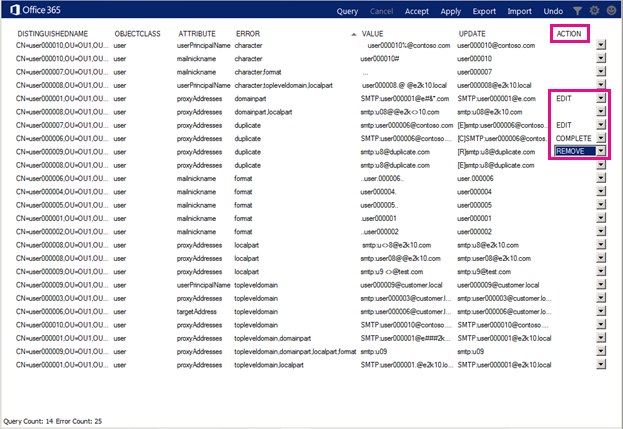

# Office 365 IdFix 도구 설치 및 실행Install and run the Office 365 IdFix tool

Office 365로 동기화 하기 전에 IdFix 예: 중복 항목 및 디렉터리 서식에 문제가 발생 하는 오류를 식별 합니다.IdFix identifies errors such as duplicates and formatting problems in your directory before you synchronize to Office 365. 
  
이 작업을 성공적으로 완료 하려면 사용자, 그룹 및 Active Directory에서 연락처 개체를 사용 하는 방법을 알고 있어야 합니다.To finish this task successfully, you should be comfortable working with user, group, and contact objects in Active Directory.
  
이 작업을 완료할 수 없으면, 메시지를 몇 다른 작업을 수행할 수 있습니다. 이러한 방법을 쉽게, 될 수 있지만 시간이 오래 걸릴 또는 다른 단점이 수도 있습니다. 와 같습니다.If you can't complete this task, there are a couple of other things you can do. These methods might be easier, but they might also take longer or have other drawbacks. They are:
  
- **IdFix를 실행 하지 않고 디렉터리 동기화를 실행 합니다.** IdFix 도구를 실행 하지 않고 디렉터리를 동기화 할 수 있지만 좋습니다. 동기화 하기 전에 오류를 수정 시간이 적게 걸립니다 하 고 자주 클라우드로 원활 하 게 전환을 제공 합니다.**Run directory synchronization without running IdFix.** You can synchronize your directory without running the IdFix tool, but we don't recommend it. Fixing errors before you synchronize takes less time and often provides a smoother transition to the cloud. 
- **컨설턴트를 고용합니다.** 전문가를 영입하면 사용자가 빠르게 시스템을 작동하고 디렉터리를 동기화하는 데 도움이 될 수 있습니다.**Hire a consultant.** Getting expert help can get your users up and running quickly and your directory synchronized. 
    
## IdFix를 실행하는 데 필요한 사항What you need to run IdFix

IdFix를 준비 하는 방식으로 작업을 쉽게 수행 및 실행 중인 사용자의 도메인에 가입 된 컴퓨터에 설치 하는 것입니다. 원하는 하지만 필요 없는 경우 도메인 컨트롤러에서 해당를 실행할 수 있습니다.The easiest way to get IdFix up and running is to install it on a computer that is joined to your domain. You can run it on the domain controller if you want, but it's not necessary.
  
### IdFix 하드웨어 요구 사항IdFix hardware requirements

IdFix를 설치 하는 컴퓨터에서 이러한 최소 하드웨어 요구 사항을 충족 해야 합니다.The computer where you install IdFix needs to meet these minimum hardware requirements:
  
- 4GB RAM4 GB RAM
- 2GB의 하드 디스크 공간2 GB of hard disk space
    
### IdFix 소프트웨어 요구 사항IdFix software requirements

IdFix를 설치 하는 컴퓨터에서 Office 365로 사용자 동기화 하려는 동일한 Active Directory 도메인에 가입 해야 합니다. 또한 컴퓨터.NET Framework 4.0을 설치 해야 합니다.The computer where you install IdFix needs to be joined to the same Active Directory domain from which you want to synchronize users to Office 365. The computer also needs to have .NET Framework 4.0 installed. 
  
Windows Server 2008 또는 Windows Server 2012를 실행 하는.NET Framework 설치 이미 됩니다. [다운로드 다운로드 센터에서.NET 4.0](https://go.microsoft.com/fwlink/p/?LinkId=400475) 수 없는 경우 또는 Windows Update를 통해 합니다.If you are running Windows Server 2008 or Windows Server 2012, then .NET Framework is probably already installed. If not, you can [download .NET 4.0 from the download center](https://go.microsoft.com/fwlink/p/?LinkId=400475) or via Windows Update. 
  
### IdFix 권한 요구 사항IdFix permissions requirements

IdFix를 실행하는 데 사용하는 사용자 계정은 디렉터리에 대해 읽기/쓰기 액세스 권한이 있어야 합니다.The user account that you use to run IdFix needs to have read/write access to the directory.
  
이러한 요구를 충족 하는 사용자 계정 하 고 확인 하는 방법을 모를 경우 확실 하지 않은, 설치 하 게 및 IdFix를 실행 하 게 여전히 수 있습니다. 사용자 계정에 적절 한 사용 권한이 없으면 스크립트를 실행 하려고 하면 IdFix 오류가 표시 하면 됩니다.If you aren't sure if your user account meets these requirements, and you're not sure how to check, you can still install and run IdFix. If your user account doesn't have the right permissions, IdFix will simply display an error when you try to run it.
  
## IdFix 설치Install IdFix

IdFix를 설치 하려면 다운로드 하 고 **IdFix.exe**압축을 풉니다.To install IdFix, download and unzip **IdFix.exe**: 
  
1. IdFix 도구를 설치하려는 컴퓨터에 로그온합니다.Log on to the computer where you want to install the IdFix tool.
    
2. [IdFix DirSync 오류 수정 도구](https://go.microsoft.com/fwlink/?linkid=867219)에 대 한 Microsoft 다운로드 사이트로 이동 합니다.Go to the Microsoft download site for the [IdFix DirSync Error Remediation Tool](https://go.microsoft.com/fwlink/?linkid=867219).
    
3. **다운로드**를 선택합니다.Choose **Download**.
    
4. 대화 상자가 나타나면 **실행**을 선택 합니다.When prompted, choose **Run**.
    
5. **WinZip Self-extractor** 대화 상자의 **폴더로 Unzip** 텍스트 상자에 입력 하거나 IdFix 도구를 설치 하려는 위치를 찾습니다. 기본적으로 IdFix로 설치 `C:\Deployment Tools\`합니다.On the **WinZip Self-Extractor** dialog box, in the **Unzip to folder** text box, type or browse to the location where you want to install the IdFix tool. By default, IdFix is installed into `C:\Deployment Tools\`. 
    
6. **압축을 풉니다**를 선택 합니다.Choose **Unzip**.
    
## IdFix 도구 실행Run the IdFix tool

IdFix를 설치한 후 이 도구를 실행하여 디렉터리의 문제를 검색합니다.After you install IdFix, run the tool to search for problems in your directory:
  
1. 해당 디렉터리에 대해 읽기/쓰기 액세스 권한이 있는 계정을 사용하여 IdFix를 설치한 컴퓨터에 로그온합니다.Using an account that has read/write access to the directory, log on to the computer where you installed IdFix.
    
2. 파일 탐색기에서 IdFix를 설치한 위치로 이동 합니다. 설치 하는 동안 기본 폴더를 선택한 경우 이동 하 여 `C:\Deployment Tools\IdFix`합니다.In File Explorer, go to the location where you installed IdFix. If you chose the default folder during installation, go to `C:\Deployment Tools\IdFix`.
    
3. **IdFix.exe**를 두 번 클릭합니다.Double-click **IdFix.exe**. 
    
    
  
4. 기본적으로 IdFix 디렉터리에 있는 항목을 테스트로 설정 하는 다중 테 넌 트 규칙을 사용 합니다. 대부분의 Office 365 고객에 대 한 설정 오른쪽 규칙입니다. 그러나 Office 365 전용 또는 ITAR (팔 규정에 국제 트래픽) 고객 인 경우 대신 설정 하는 전용된 규칙을 사용 하 여 IdFix를 구성할 수 있습니다. 확실치 않은 경우 어떤 유형의 하는 고객을 안전 하 게이 단계를 건너뛸 수 있습니다. 전용으로 설정 하는 규칙을 설정 하는 메뉴 모음에서 기어 아이콘을 클릭 하 고 **전용**을 선택 합니다.By default, IdFix uses the Multi-Tenant rule set to test the entries in your directory. This is the right rule set for most Office 365 customers. However, if you are an Office 365 Dedicated or ITAR (International Traffic in Arms Regulations) customer, you can configure IdFix to use the Dedicated rule set instead. If you aren't sure what type of customer you are, you can safely skip this step. To set the rule set to Dedicated, click the gear icon in the menu bar and then choose **Dedicated**.
    
5. **쿼리**를 선택 합니다.Choose **Query**.
    
    
  
6. 기본적으로 IdFix는 전체 디렉터리에서 오류를 검색합니다.By default, IdFix searches the entire directory for errors.
    
    디렉터리의 크기에 따라 쿼리를 실행 하는 시간이 걸릴 수 있습니다. 도구의 주 창의 맨 아래에 진행 상황을 볼 수 있습니다. **취소**를 클릭 하는 경우 처음부터 다시 시작 해야 합니다.Depending on the size of your directory, running the query can take a while. You can watch the progress at the bottom of the tool's main window. If you click **Cancel**, you'll need to restart from the beginning.
    
    
  
7. IdFix는 쿼리를 완료 한 후에 계속 진행 수 있으며 오류가 없으면 하는 경우 디렉터리를 동기화 할 수 있습니다. 디렉터리에 오류가 있으면는 문제를 해결할 때 동기화 하기 전에 것이 좋습니다. 오류의 종류에 대 한 보다 구체적인 정보 및 쿼리하고 각 해결 하는 가장 좋은 방법은 하는 방법에 대 한 권장 사항을 하려는 경우이 항목의 끝에 링크를 참조 하십시오.After IdFix completes the query, you can go ahead and synchronize your directory if there are no errors. If there are errors in your directory, it is recommended that you fix them before you synchronize. If you want more specific information about types of errors and recommendations about the best way to fix each of them, see the links at the end of this topic. 
    
    동기화하기 전에 오류를 반드시 수정해야 하는 것은 아니지만 적어도 IdFix에서 반환한 오류를 모두 검토하는 것이 좋습니다.While it is not mandatory to fix the errors before you synchronize, we strongly recommend that you at least review all the errors returned by IdFix.
    
    각 오류 도구의 주 창에서 별도 행에 표시 됩니다.Each error is displayed in a separate row in the tool's main window . 
    
8. **UPDATE** 열에 표시되는 제안 변경 내용에 동의하는 경우 **ACTION** 열에서 IdFix를 통해 구현할 변경 내용을 선택하고 **적용**을 클릭합니다. **적용**을 클릭하면 디렉터리가 변경됩니다.If you agree with the suggested change in the **UPDATE** column, in the **ACTION** column select what you want IdFix to do to implement the change and then click **Apply**. When you click **Apply**, the tool makes the changes in the directory.
    
    각 업데이트 한 후 **적용** 을 클릭 필요가 없습니다. 대신, **적용** 을 클릭 하 고 IdFix 동시에 모든 변경 됩니다 전에 여러 오류를 해결할 수 있습니다. 오류 형식을 나열 하는 열의 위쪽에 **오류** 클릭 하 여 오류 유형별 오류를 정렬할 수 있습니다.You don't have to click **Apply** after each update. Instead, you can fix several errors before you click **Apply** and IdFix will change them all at the same time. You can sort the errors by error type by clicking **ERROR** at the top of the column that lists the error types. 
    
    한 가지 전략은 동일한 유형의 모든 오류를 수정 하려면 예: 모든 중복을 먼저, 수정 및 적용 합니다. 다음으로 문자 형식 오류를 수정 하 고 등. 변경 내용을 적용 하는 각 시간 IdFix 도구 실수 하는 경우에 변경 내용을 취소할를 사용할 수 있는 별도 로그 파일을 만듭니다. [트랜잭션 로그](idfix-transaction-log.md) 에서 IdFix를 설치한 폴더에 저장 됩니다.  기본적으로 _C:\Deployment Tools\IdFix_ 을 선택 합니다.One strategy is to fix all the errors of the same type; for example, fix all the duplicates first, and apply them. Next, fix the character format errors, and so on. Each time you apply the changes, the IdFix tool creates a separate log file that you can use to undo your changes in case you make a mistake. The [transaction log](idfix-transaction-log.md) is stored in the folder that you installed IdFix in.  _C:\Deployment Tools\IdFix_ by default. 
    
    
  
9. 모든 변경 내용을의 내용을 픽스 새 오류를 도입 하지 않았으므로 확인을 다시 IdFix를 실행 하는 디렉터리에 적용 됩니다. 이러한 단계에 필요한 횟수 만큼 반복할 수 있습니다. 통과 하도록 하는 프로세스는 몇 번 동기화 하기 전에 것이 좋습니다.After all of your changes are made to the directory, run IdFix again to ensure that the fixes you made didn't introduce new errors. You can repeat these steps as many times as you need to. It's a good idea to go through the process a few times before you synchronize.
    
## 검색을 구체화하거나 오류를 보다 깊이 분석하려는 경우 IdFix로 어떤 작업을 할 수 있습니까?I want to refine my search or dig deeper into the errors, what else can I do with IdFix?

좀 더 자세한 정보는 다음 항목에서 찾아볼 수 있습니다.More in-depth information is available from these topics:
  
- [IdFix 도구를 사용 하 여 Office 365와 동기화를 위한 디렉터리 특성 준비](prepare-directory-attributes-for-synch-with-idfix.md) 합니다. 점프 도구를 실행 하는 방법에 대 한 자세한 내용은이 항목에는 도구를 설치한 후 발생 하 게 하는 일반적인 오류 픽스, 예제 및 많은 오류가 있는 경우 취해야 할 조치에 대 한 모범 사례를 제시 합니다.[Prepare directory attributes for synchronization with Office 365 by using the IdFix tool](prepare-directory-attributes-for-synch-with-idfix.md) . After you have installed the tool, jump to this topic for more detailed instructions about running the tool, common errors you will encounter, suggested fixes, examples, and best practices for what to do when you have a large number of errors. 
- [참조: IdFix 제외 및 지원 개체/특성Reference: IdFix excluded and supported objects and attributes](idfix-excluded-and-supported-objects-and-attributes.md)  
- [참조: Office 365 IdFix 트랜잭션 로그Reference: Office 365 IdFix transaction log](idfix-transaction-log.md)
    
## 동영상 교육Video training

자세한 내용은 LinkedIn 학습에 의해 제공자 단원 [설치 및 사용 하 여 IDFix 도구를](https://support.office.com/article/install-and-use-the-idfix-tool-4d81d73c-f172-4fd5-8542-f601c0c96aa9?ui=en-US&rs=en-US&ad=US)참조 합니다.For more information, see the lesson [Install and use the IDFix tool](https://support.office.com/article/install-and-use-the-idfix-tool-4d81d73c-f172-4fd5-8542-f601c0c96aa9?ui=en-US&rs=en-US&ad=US), brought to you by LinkedIn Learning.
  

