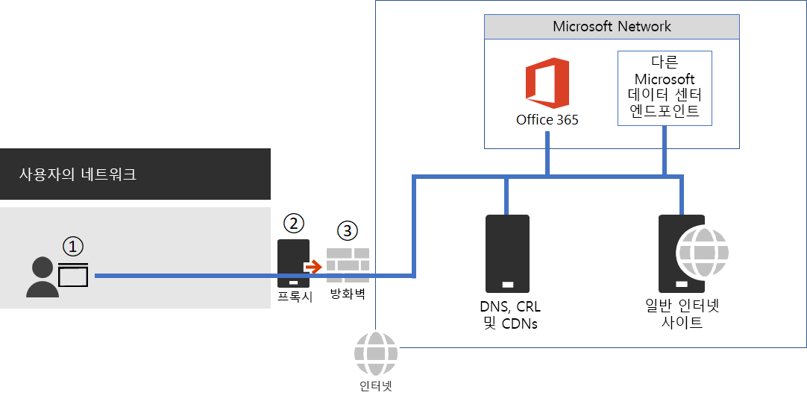

# <a name="managing-office-365-endpoints"></a>Office 365 끝점 관리

여러 사무실 위치 및 연결 WAN이 있는 대부분의 엔터프라이즈 조직은 Office 365 네트워크 연결에 대 한 구성을 필요로 합니다. 방화벽을 통해 직접 모든 신뢰할 수 있는 Office 365 네트워크 요청을 보내 모든 추가 패킷 수준 검사 또는 처리를 건너뜀으로써 네트워크를 최적화할 수 있습니다. 이렇게 하면 대기 시간 및 경계 용량 요구 사항이 줄어듭니다. 사용자에게 최적의 성능을 제공할 수 있는 첫 번째 단계는 Office 365 네트워크 트래픽을 식별하는 것입니다. Office 365 네트워크 연결에 대한 자세한 내용은 [Office 365 네트워크 연결 원칙](office-365-network-connectivity-principles.md)을 참조하세요.

[Office 365 IP 주소 및 URL 웹 서비스](office-365-ip-web-service.md)를 사용하여 Office 365 네트워크 끝점에 액세스하고 이 끝점을 변경하는 것이 좋습니다.

중요 Office 365 네트워크 트래픽을 관리하는 방법과 관계없이 Office 365를 사용하려면 인터넷에 연결되어 있어야 합니다. 연결이 필요한 다른 네트워크 끝점은 [Office 365 IP 주소 및 URL 웹 서비스에 포함되지 않은 추가 끝점](additional-office365-ip-addresses-and-urls.md)에 나열되어 있습니다.

Office 365 네트워크 끝점을 사용하는 방법은 엔터프라이즈 조직 네트워크 아키텍처에 따라 다릅니다. 이 문서에서는 엔터프라이즈 네트워크 아키텍처를 Office 365 IP 주소 및 URL과 통합할 수있는 몇 가지 방법에 대해 설명합니다. 신뢰할 수있는 네트워크 요청을 선택하는 가장 쉬운 방법은 각 사무실 위치에서 자동화된 Office 365 구성을 지원하는 SDWAN 장치를 사용하는 것입니다.

## <a name="sdwan-for-local-branch-egress-of-vital-office-365-network-traffic"></a>중요 Office 365 네트워크 트래픽의 로컬 지점용 송신을 위한 SDWAN

각 지사 위치에서 끝점의 Office 365 최적화 범주 또는 최적화 및 허용 범주의 트래픽을 Microsoft 네트워크에 직접 라우팅하도록 구성된 SDWAN 장치를 제공할 수 있습니다. 온-프레미스 데이터 센터 트래픽, 일반 인터넷 웹 사이트 트래픽 및 Office 365 기본 범주 끝점 트래픽을 포함한 기타 네트워크 트래픽은 보다 상당한 네트워크 경계가 있는 다른 위치로 전송됩니다.

Microsoft는 SDWAN 공급자로 작업하여 자동화된 구성을 설정합니다. 자세한 내용은 [Office 365 네트워킹 파트너 프로그램](office-365-networking-partner-program.md)을 참조하세요.

<a name="pacfiles"> </a>
## <a name="use-a-pac-file-for-direct-routing-of-vital-office-365-traffic"></a>중요 Office 365 트래픽 직접 라우팅에 PAC 파일 사용

PAC 또는 WPAD 파일을 사용하여, Office 365와 연결되어 있지만 IP 주소가 없는 네트워크 요청을 관리합니다. 일반적으로 프록시 또는 경계 장치를 통해 전송되는 네트워크 요청은 추가 지연 시간을 증가시킵니다. SSL 차단 및 검사는 가장 큰 대기 시간을 만들지만 프록시 인증 및 평판 조회와 같은 다른 서비스는 성능이 저하를 초래하고 사용자 환경이 좋지 않을 수 있습니다. 또한 이러한 경계 네트워크 장치에는 모든 네트워크 요청을 처리하기 위한 충분한 용량이 필요합니다. 직접 Office 365 네트워크 요청에 대한 프록시 또는 검사 장치는 우회하는 것이 좋습니다.
  
[PowerShell 갤러리 Get-PacFile](https://www.powershellgallery.com/packages/Get-PacFile)은 Office 365 IP 주소 및 URL 웹 서비스에서 최신 네트워크 끝점을 읽고 샘플 PAC 파일을 만드는 PowerShell 스크립트입니다. 기존 PAC 파일 관리에 통합되도록 스크립트를 수정할 수 있습니다.



**그림 1 - 간단한 엔터프라이즈 네트워크 경계**

PAC 파일은 그림 1의 점 1에서 웹 브라우저에 배포됩니다. 중요 Office 365 네트워크 트래픽을 직접 송신하는 데 PAC 파일을 사용할 때는 이 URL에 부속된 IP 주소에 대한 연결을 네트워크 경계 방화벽에도 허용해야 합니다. 이 작업은 PAC 파일에 지정된 것과 동일한 Office 365 끝점 범주의 IP 주소를 페치하고 해당 주소를 기준으로 방화벽 ACL을 만드는 방식으로 수행됩니다. 방화벽은 그림 1의 점 3입니다.

별도로 최적화 카테고리 끝점에 대한 직접 라우팅만을 선택한 경우 추가 처리를 건너뛰려면 프록시 서버에 보내는 필수 범주 끝점을 프록시 서버에 나열해야 합니다. 예를 들어, SSL 차단 및 검사 및 프록시 인증은 최적화 및 허용 범주 끝점과 호환되지 않습니다. 프록시 서버는 그림 1의 점 2입니다.

일반적인 구성은 프록시 서버에 접속하는 Office 365 네트워크 트래픽의 대상 IP 주소에 대해 프록시 서버의 모든 아웃 바운드 트래픽을 처리하지 않고 허용하는 것입니다. SSL 차단 및 검사 문제에 대한 자세한 내용은 [Office 365 트래픽에서 타사 네트워크 장치 또는 솔루션 사용](https://support.microsoft.com/help/2690045/using-third-party-network-devices-or-solutions-with-office-365)을 참조하세요.

Get-PacFile 스크립트가 생성할 수 있는 두 가지 유형의 PAC 파일이 있습니다.

|**유형**|**설명**|
|:-----|:-----|
|**1** <br/> |최적화 끝점 트래픽을 직접 보내고 기타 모든 항목을 프록시 서버에 보냅니다. <br/> |
|**2** <br/> |최적화 및 허용 끝점 트레픽을 직접 보내고 기타 모든 항목을 프록시 서버에 보냅니다. 이 유형은 Office 365 트래픽에 대해 지원되는 모든 ExpressRoute를 ExpressRoute 네트워크 세그먼트로 보내고 다른 모든 것은 프록시 서버로 보냅니다. <br/> |

다음은 PowerShell 스크립트를 호출하는 간단한 예입니다.

```powershell
Get-PacFile -ClientRequestId b10c5ed1-bad1-445f-b386-b919946339a7
```

스크립트에 전달할 수 있는 매개 변수는 다음과 같습니다.

|**매개 변수**|**설명**|
|:-----|:-----|
|**ClientRequestId** <br/> |이는 필수 요소이며 호출하는 클라이언트 시스템을 나타내는 웹 서비스에 전달되는 GUID입니다. <br/> |
|**Instance** <br/> |Office 365 서비스 인스턴스는 기본적으로 전 셰계를 대상으로 합니다. 웹 서비스로도 전달됩니다. <br/> |
|**TenantName** <br/> |Office 365 테넌트 이름 웹 서비스에 전달되어 일부 Office 365 URL에서 바꿀 수 있는 매개 변수로 사용됩니다. <br/> |
|**Type** <br/> |생성할 프록시 PAC 파일의 형식입니다. <br/> |

다음은 추가 매개 변수를 사용하여 PowerShell 스크립트를 호출하는 또 다른 예입니다.

```powershell
Get-PacFile -Type 2 -Instance Worldwide -TenantName Contoso -ClientRequestId b10c5ed1-bad1-445f-b386-b919946339a7
```

## <a name="proxy-server-bypass-processing-of-office-365-network-traffic"></a>Office 365 네트워크 트래픽의 프록시 서버 우회 처리

PAC 파일이 직접 아웃 바운드 트래픽에 사용되지 않는 경우에도 프록시 서버를 구성하여 네트워크 경계에서 처리를 우회합니다. 일부 프록시 서버 공급 업체에서는 [Office 365 네트워킹 파트너 프로그램](office-365-networking-partner-program.md)에 설명된 대로 이 자동 구성을 사용하도록 설정했습니다.

이 작업을 수동으로 수행하는 경우 Office 365 IP 주소 및 URL 웹 서비스에서 최적화 및 허용 끝점 범주 데이터를 가져와 프록시 서버가 이 프로세스를 우회하도록 구성해야 합니다. 최적화 및 허용 범주 끝점에 SSL 차단 및 검사 및 프록시 인증을 사용하지 않는 것이 중요합니다.
  
<a name="bkmk_changes"> </a>
## <a name="change-management-for-office-365-ip-addresses-and-urls"></a>Office 365 IP 주소 및 URL의 변경 관리

네트워크 경계에 대한 적절한 구성을 선택하는 것 외에도 Office 365 끝점에 대한 변경 관리 프로세스를 채택하는 것이 중요합니다. 이러한 끝점은 정기적으로 변경되며 변경 내용을 관리하지 않는 경우 새 IP 주소 또는 URL을 추가한 후에 사용자가 차단되거나 성능이 저하될 수 있습니다.

Office 365 IP 주소 및 URL의 변경 사항은 보통 매월 말일에 게시됩니다. 경우에 따라 운영, 지원 또는 보안 요구 사항으로 인해 해당 일정을 벗어나서 변경 사항이 게시될 수 있습니다.

IP 주소 또는 URL이 추가되어 조취를 취해야 하는 변경 사항이 게시되면 변경 사항을 게시한 시점부터 해당 끝점에 Office 365 서비스가 있을 때까지 30일 알림을 받게 됩니다. 이 알림 기간을 목표로 하지만 운영, 지원 또는 보안 요구 사항으로 인해 불가능할 수도 있습니다. 삭제된 IP 주소 또는 URL 또는 중요하지 않은 변경 등과 같이 연결을 유지하기 위해 직접적인 조치가 필요하지 않은 변경 사항은 사전 알림을 포함하지 않습니다. 제공되는 알림과 상관없이 각 변경 내용에 대한 예상 서비스 활성 날짜를 나열합니다.

### <a name="change-notification-using-the-web-service"></a>웹 서비스를 사용하여 변경 알림

Office 365 IP 주소 및 URL 웹 서비스를 사용하여 변경 알림을 받을 수 있습니다. 한 시간에 한 번씩 **/version** 웹 메서드를 호출하여 Office 365에 연결하는 데 사용하는 끝점의 버전을 확인하는 것이 좋습니다. 사용중인 버전과 비교할 때 이 버전이 변경되면 **/endpoints** 웹 메소드에서 최신 끝점 데이터를 받고 선택적으로 **/changes** 웹 메소드와의 차이를 가져옵니다. 사용자가 찾은 버전이 변경되지 않은 경우 **/endpoints** 또는 **/changes** 웹 메서드를 호출할 필요가 없습니다.

자세한 내용은 [Office 365 IP 주소 및 URL 웹 서비스](office-365-ip-web-service.md)를 참조하세요.

### <a name="change-notification-using-rss-feeds"></a>RSS 피드를 사용하여 변경 알림

Office 365 IP 주소 및 URL 웹 서비스는 Outlook에서 구독할 수 있는 RSS 피드를 제공합니다. IP 주소 및 URL에 대한 각 Office 365 서비스 인스턴스 별 페이지의 RSS URL 링크가 있습니다. 자세한 내용은 [Office 365 IP 주소 및 URL 웹 서비스](office-365-ip-web-service.md)를 참조하세요.

### <a name="change-notification-and-approval-review-using-microsoft-flow"></a>Microsoft Flow를 사용하여 알림 및 승인 검토 변경

매월 제공되는 네트워크 끝점 변경에 대해 수동 처리가 필요할 수도 있음을 알고 있습니다. Microsoft Flow를 사용하여 전자 메일로 알리고 Office 365 네트워크 끝점에 변경 사항이 있는 경우 승인 프로세스를 선택적으로 실행하는 흐름을 만들 수 있습니다. 검토가 완료되면 흐름에서 방화벽 및 프록시 서버 관리 팀에 자동으로 변경 내용을 전자 메일로 보낼 수 있습니다.

Microsoft Flow 샘플 및 서식 파일에 대한 자세한 내용은 [Microsoft Flow 사용하여 Office 365 IP 주소 및 URL 변경 내용에 대한 전자 메일 받기](https://techcommunity.microsoft.com/t5/Office-365-Networking/Use-Microsoft-Flow-to-receive-an-email-for-changes-to-Office-365/td-p/240651)를 참조하세요.
  
<a name="FAQ"> </a>
## <a name="office-365-network-endpoints-faq"></a>Office 365 네트워크 끝점 FAQ

Office 365 연결에 대해 관리자가 자주 묻는 질문과 대답은 다음과 같습니다.
  
### <a name="how-do-i-submit-a-question"></a>질문을 제출하려면 어떻게 하나요?

맨 아래의 링크를 클릭하여 해당 문서가 도움이 되었는지 표시하고 추가 질문을 제출합니다. Microsoft에서는 의견을 모니터링하며 가장 자주 묻는 질문을 여기에 업데이트합니다.
  
### <a name="how-do-i-determine-the-location-of-my-tenant"></a>내 테넌트의 위치를 확인하려면 어떻게 하나요?

 **테넌트 위치**는 [데이터 센터 맵](https://aka.ms/datamaps)을 사용하여 확인할 수 있습니다.
  
### <a name="am-i-peering-appropriately-with-microsoft"></a>내가 Microsoft와 적절하게 피어링되고 있나요?

 **피어링 위치**는 [Microsoft와의 피어링](https://www.microsoft.com/peering)에 자세히 설명되어 있습니다.
  
전 세계적으로 2,500개가 넘는 ISP 피어링 관계와 70개의 클라이언트에서 로그인을 통해 사용자의 네트워크에서 Microsoft 네트워크로 원활하게 연결할 수 있습니다. ISP의 피어링 관계가 최적인지 확인하는 데 시간을 들일 필요가 없습니다. Microsoft 네트워크에 대한 좋은 피어링 분배와 좋지 않은 피어링 분배의 [몇 가지는 예가 여기에 나와 있습니다](https://blogs.technet.microsoft.com/onthewire/2017/03/22/__guidance/).
  
<a name="bkmk_MissingIP"> </a>
### <a name="i-see-network-requests-to-ip-addresses-not-on-the-published-list-do-i-need-to-provide-access-to-them"></a>게시된 목록에 없는 IP 주소에 대한 네트워크 요청이 표시됩니다. 해당 주소에 대한 액세스를 제공해야 하나요?

Microsoft는 사용자가 직접 라우팅해야 하는 Office 365 서버의 IP 주소만 제공합니다. 이 목록은 네트워크 요청이 표시되는 모든 IP 주소의 전체 목록이 아닙니다. Microsoft 및 타사가 소유한 게시되지 않은 IP 주소에 대한 네트워크 요청이 표시됩니다. 이러한 IP 주소는 동적으로 생성되거나 변경될 때 시기 적절한 통지를 방지하는 방법으로 관리됩니다. 방화벽에서 이러한 네트워크 요청에 대한 FQDN을 기준으로 액세스를 허용할 수 없는 경우 PAC 또는 WPAD 파일을 사용하여 요청을 관리합니다.
  
자세한 정보가 필요한, Office 365와 연결된 IP가 표시되나요?
  
1. [IPv4](https://www.ipaddressguide.com/cidr) 또는 i p v 6의 경우와 같이 CIDR 계산기를 사용 하 여 IP 주소가 보다 큰 게시 범위에 포함 되어 있는지 [확인 합니다.](https://www.ipaddressguide.com/ipv6-cidr) 예를 들어 40.96.0.0/13은 40.103와 일치 하지 않는 40.96에도 IP 주소 40.103.0.1을 포함 합니다.
2. [whois 쿼리](https://dnsquery.org/)를 사용하여 파트너가 IP를 소유하는지 확인합니다. Microsoft가 해당 IP를 소유한 경우 내부 파트너일 수 있습니다. 대부분의 파트너 네트워크 끝점은 _기본_ 범주에 속하는 것으로 나열 되며 IP 주소가 게시 되지 않습니다.
3. IP 주소는 Office 365 또는 종속성에 속하지 않을 수 있습니다. Office 365 네트워크 끝점 게시에는 Microsoft 네트워크 끝점이 모두 포함 되지 않습니다.
4. 인증서 확인 브라우저에서 *HTTPS:// \<IP_ADDRESS\> * 을 사용 하 여 IP 주소에 연결 하 고 인증서에 나열 된 도메인을 확인 하 여 ip 주소와 연결 된 도메인을 파악 합니다. Microsoft 소유의 IP 주소이고 Office 365 IP 주소 목록에 없는 경우 *MSOCDN.NET*과 같은 Microsoft CDN과 연결된 IP 주소이거나 게시된 IP 정보가 없는 다른 Microsoft 도메인일 수 있습니다. 인증서의 도메인이 Microsoft가 IP 주소를 나열하려고 요구하는 도메인인 경우 알려주세요.

<a name="bkmk_cname"> </a>
### <a name="some-office-365-urls-point-to-cname-records-instead-of-a-records-in-the-dns-what-do-i-have-to-do-with-the-cname-records"></a>일부 Office 365 URL은 DNS의 A 레코드 대신 CNAME 레코드를 가리킵니다. CNAME 레코드로 무엇을 해야 하나요?

클라이언트 컴퓨터에는 클라우드 서비스에 연결하기 위한 하나 이상의 IP 주소가 포함된 DNS A 또는 AAAA 레코드가 필요합니다. Office 365에 포함된 일부 URL은 A 또는 AAAA 레코드 대신 CNAME 레코드를 표시합니다. 이러한 CNAME 레코드는 중간 레코드이며 체인에 여러 레코드가 있을 수 있습니다. 결국 IP 주소에 대한 A 또는 AAAA 레코드로 항상 확인됩니다. 예를 들어 궁극적으로 IP 주소 _IP_1_로 확인되는 다음과 같은 일련의 DNS 레코드를 생각해 보세요.

```
serviceA.office.com -> CNAME: serviceA.domainA.com -> CNAME: serviceA.domainB.com -> A: IP_1
```

이러한 CNAME 리디렉션은 DNS의 일반적인 부분이며 클라이언트 컴퓨터에 투명하며 프록시 서버에 투명합니다. 부하 분산, 콘텐츠 배달 네트워크, 고가용성 및 서비스 문제 완화에 사용됩니다. Microsoft는 중간 CNAME 레코드를 게시하지 않으며 언제든지 변경될 수 있으며 프록시 서버에서 허용하는 대로 구성할 필요가 없습니다.

프록시 서버는 위 예제에서 serviceA.office.com인 초기 URL의 유효성을 검사하며 이 URL은 Office 365 게시에 포함되어 있습니다. 프록시 서버는 해당 URL의 DNS 확인을 IP 주소로 요청하고 IP_1을 다시 수신합니다. 중간 CNAME 리디렉션 레코드에 대한 유효성 검사를 수행하지 않습니다.

간접 Office 365 FQDN을 기반으로하는 하드 코딩된 구성 또는 허용 목록 지정은 권장되지 않고 Microsoft에서 지원하지 않으며 고객 연결 문제를 일으키는 것으로 알려져 있습니다. CNAME 리디렉션을 차단하거나 Office 365 DNS 항목을 잘못 해석하는 DNS 솔루션은 DNS 재귀를 사용하도록 설정된 DNS 조건 전달(직접 사용되는 Office 365 FQDN으로 범위 지정)을 통해 해결할 수 있습니다. 많은 타사 네트워크 경계 제품은 [Office 365 IP 주소 및 URL 웹 서비스](https://docs.microsoft.com/office365/enterprise/office-365-ip-web-service)를 사용하여 구성에 허용 목록에 포함된 권장 Office 365 끝점을 기본적으로 통합합니다.

<a name="bkmk_akamai"> </a>
### <a name="why-do-i-see-names-such-as-nsatcnet-or-akadnsnet-in-the-microsoft-domain-names"></a>Microsoft 도메인 이름에 nsatc.net 또는 akadns.net과 같은 이름이 표시되는 이유는 무엇인가요?

Office 365 및 기타 Microsoft 서비스에서는 Office 365 환경을 개선하기 위해 Akamai 및 MarkMonitor와 같은 몇 가지 타사 서비스를 사용합니다. 가능한 최상의 환경을 계속 제공하기 위해 Microsoft는 향후 이러한 서비스를 변경할 수 있습니다. 타사 도메인은 CDN과 같은 콘텐츠를 호스트하거나 지리적 트래픽 관리 서비스와 같은 서비스를 호스트할 수 있습니다. 현재 사용 중인 몇 가지 서비스는 다음과 같습니다.
  
[MarkMonitor](https://www.markmonitor.com/)는 *\*.nsatc.net*을 포함하는 요청이 표시될 때 사용되고 있습니다. 이 서비스는 악의적인 동작으로부터 보호하기 위해 도메인 이름 보호 및 모니터링을 제공합니다.
  
[ExactTarget](https://www.marketingcloud.com/)은 *\*.exacttarget.com*에 대한 요청이 표시될 때 사용되고 있습니다. 이 서비스는 악의적인 동작으로부터 전자 메일 링크 관리 및 모니터링을 제공합니다.
  
[Akamai](https://www.akamai.com/)는 다음 FQDN 중 하나를 포함하는 요청이 표시될 때 사용되고 있습니다. 이 서비스는 지역 DNS 및 콘텐츠 배달 네트워크 서비스를 제공합니다.
  
```
*.akadns.net
*.akam.net
*.akamai.com
*.akamai.net
*.akamaiedge.net
*.akamaihd.net
*.akamaized.net
*.edgekey.net
*.edgesuite.net
```

<a name="bkmk_thirdparty"> </a>
### <a name="i-have-to-have-the-minimum-connectivity-possible-for-office-365"></a>Office 365에 대한 최소 연결을 사용할 수 있어야 합니다.

Office 365는 인터넷을 통해 작동하도록 구축된 서비스 모음이므로 안정성 및 가용성 약속은 사용할 수 있는 많은 표준 인터넷 서비스를 기반으로 합니다. 예를 들어 DNS, CRL 및 CDN과 같은 표준 인터넷 서비스는 최신 인터넷 서비스를 사용하기 위해 연결할 수 있어야 하는 것처럼 Office 365를 사용하기 위해 연결할 수 있어야 합니다.

Office 365 제품군은 주요 서비스 영역으로 나뉩니다. 연결에 대해 선택적으로 사용될 수 있으며, 모두에 종속되는 공통 영역이 있기 때문에 항상 필요합니다.

|**서비스 영역**|**설명**|
|:-----|:-----|
|**Exchange** <br/> |Exchange Online 및 Exchange Online Protection <br/> |
|**SharePoint** <br/> |SharePoint Online 및 비즈니스용 OneDrive <br/> |
|**비즈니스용 Skype Online 및 Microsoft Teams** <br/> |비즈니스용 Skype Online 및 Microsoft Teams <br/> |
|**공통** <br/> |Office 365 Pro Plus, 브라우저의 Office, Azure AD 및 기타 공통 네트워크 끝점 <br/> |

기본 인터넷 서비스 외에 기능을 통합하는 데만 사용되는 타사 서비스도 있습니다. 이러한 서비스는 통합에 필요하지만 Office 365 끝점 문서에서는 선택 사항으로 표시됩니다. 이는 끝점에 액세스할 수 없는 경우에도 서비스의 핵심 기능이 계속 작동함을 의미합니다. 필요한 모든 네트워크 끝점에는 필수 특성이 true로 설정됩니다. 선택 사항인 모든 네트워크 끝점에는 필수 특성이 false로 설정되고, 노트 특성은 연결이 차단되었을 때 기대할 수 있는 누락된 기능에 대한 세부 정보를 표시합니다.
  
Office 365를 사용하려고 할 때 타사 서비스에 액세스할 수 없음을 알게 되면 [이 문서에서 필수 또는 선택 사항으로 표시된 모든 FQDN이 프록시 및 방화벽을 통해 허용되도록](urls-and-ip-address-ranges.md) 하고 싶을 것입니다.
  
<a name="bkmk_consumer"> </a>
### <a name="how-do-i-block-access-to-microsofts-consumer-services"></a>Microsoft 소비자 서비스에 대한 액세스를 차단하려면 어떻게 하나요?

소비자 서비스에 대한 액세스를 제한하는 작업은 사용자의 책임으로 수행해야 합니다. 소비자 서비스를 차단하는 신뢰할 수 있는 유일한 방법은 *login.live.com* FQDN에 대한 액세스를 제한하는 것입니다. 이 FQDN은 MSDN, TechNet과 같은 비소비자 서비스를 비롯한 다양한 서비스에서 사용됩니다. 이 FQDN은 Microsoft 지원의 보안 파일 교환 프로그램에서도 사용됩니다. Microsoft 제품에 대한 문제 해결을 용이하게 하기 위해 파일을 전송하는 데 필요합니다.  이 FQDN에 대한 액세스를 차단하면 이러한 서비스와 연결된 네트워크 연결에 대한 규칙의 예외를 포함해야 할 수 있습니다.
  
Microsoft 소비자 서비스에 대한 액세스만 차단해서는 네트워크상의 누군가가 Office 365 테넌트 또는 기타 서비스를 사용하여 정보를 빼내는 것을 막지 못한다는 점에 유의하세요.

<a name="bkmk_IPOnlyFirewall"> </a>
### <a name="my-firewall-requires-ip-addresses-and-cannot-process-urls-how-do-i-configure-it-for-office-365"></a>내 방화벽에는 IP 주소가 필요 하며 Url을 처리할 수 없습니다. Office 365 용으로이를 구성 하려면 어떻게 해야 하나요?

Office 365에서는 필요한 모든 네트워크 끝점의 IP 주소를 제공 하지 않습니다. 일부는 Url로만 제공 되며 기본값으로 분류 됩니다. 필요한 기본 범주에 있는 Url은 프록시 서버를 통해 허용 해야 합니다. 프록시 서버가 없으면 사용자가 웹 브라우저의 주소 표시줄에 입력 하는 Url에 대 한 웹 요청을 구성한 방법을 확인 합니다. 사용자가 IP 주소를 제공 하지 않습니다. IP 주소를 제공 하지 않는 Office 365 기본 범주 Url은 동일한 방식으로 구성 해야 합니다.

## <a name="related-topics"></a>관련 주제

[Office 365 IP 주소 및 URL 웹 서비스](office-365-ip-web-service.md)

[Microsoft Azure 데이터 센터 IP 범위](https://www.microsoft.com/download/details.aspx?id=41653)
  
[Microsoft 공용 IP 공간](https://www.microsoft.com/download/details.aspx?id=53602)
  
[Microsoft Intune의 네트워크 인프라 요구 사항](https://docs.microsoft.com/intune/get-started/network-infrastructure-requirements-for-microsoft-intune)
  
[ExpressRoute 및 Power BI](https://powerbi.microsoft.com/documentation/powerbi-admin-power-bi-expressroute/)
  
[Office 365 URL 및 IP 주소 범위](urls-and-ip-address-ranges.md)
  
[Office 365 연결에 대한 ExpressRoute 관리](managing-expressroute-for-connectivity.md)
  
[Office 365 네트워크 연결 원칙](office-365-network-connectivity-principles.md)
