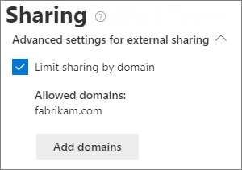

# Microsoft 365에서의 공유 제한Limit sharing in Microsoft 365

내부 공유를 완전히 비활성화하거나 사이트에서 공유 버튼을 제거할 수는 없지만 조직의 요구를 충족시키기 위해 Microsoft 365에서 공유를 제한할 수 있는 다양한 방법이 있습니다.While you can't disable internal sharing entirely or remove the Share button from sites, there are a variety of ways that you can limit sharing in Microsoft 365 to meet the needs of your organization.

파일 공유 방법은 아래 표에 나열되어 있습니다.The methods of sharing files are listed in the table below. 자세한 정보를 확인하려면 **공유 방법** 열에서 해당 링크를 클릭하세요.Click the link in the **Sharing method** column for detailed information.

|공유 방법Sharing method|설명Description|제한 옵션Limiting options|
|:-------------|:----------|:-------------|
|[Office 365 그룹 또는 팀Office 365 group or team](#office-365-group-or-team)|Microsoft Teams 팀 또는 Office 365 그룹에 대한 액세스 권한을 받은 사람들은 연결된 SharePoint 사이트의 파일에 대한 편집 권한을 갖습니다.People granted access to a Microsoft Teams team or Office 365 group have edit access to files in the associated SharePoint site.|그룹 또는 팀이 비공개인 경우 팀에 대한 초대 공유는 승인을 위해 소유자에게 이동됩니다.If the group or team is private, sharing invitations to join the team go to the owner for approval. 관리자는 게스트 액세스를 비활성화하여 조직 외부의 사람들이 액세스하지 못하게 할 수 있습니다.Admins can disable guest access to prevent access by people from outside the organization.|
|[SharePoint 사이트SharePoint site](#sharepoint-site)|사람들은 소유자, 회원 또는 방문자에게 SharePoint 사이트에 대한 액세스 권한을 부여할 수 있으며 사이트의 파일에 대해 해당 수준의 액세스 권한을 갖습니다.People can be granted Owner, Member, or Visitor access to a SharePoint site and will have that level of access to files in the site.|사이트 소유자만 사이트를 공유할 수 있도록 사이트 권한을 제한할 수 있습니다.Site permissions can be restricted so that only site owners can share the site.|
|[특정 사용자와 공유Sharing with specific people](#sharing-with-specific-people)|편집 권한이 있는 사이트 구성원과 사용자는 *특정 사용자* 링크를 사용하여 파일 및 폴더에 직접 권한을 부여하거나 공유할 수 있습니다.Site members and people with edit permissions can give direct permissions to files and folders or share them by using *Specific people* links.|사이트 소유자만 파일 및 폴더를 공유할 수 있도록 사이트 권한을 제한할 수 있습니다.Site permissions can be restricted so that only site owners can share files and folders. 이 경우 사이트 구성원의 직접 액세스 및 *특정 사용자* 링크 공유는 소유자에게 전달되어 승인을 받을 수 있습니다.In this case, direct access and *Specific people* link sharing by site members goes to site owner for approval.|
|[SharePoint 게스트 공유SharePoint guest sharing](#sharepoint-guest-sharing)|SharePoint 사이트 소유자 및 구성원은 조직 외부의 사용자와 파일 및 폴더를 공유할 수 있습니다.SharePoint site owners and members can share files and folders with people outside the organization.|전체 조직 또는 개별 사이트에 대해 게스트 공유 기능을 비활성화할 수 있습니다.Guest sharing can be disabled for the entire organization or for individual sites.|
|[*조직 내부 사용자* 공유 링크*People in your organization* sharing links](#people-in-your-organization-sharing-links)|SharePoint 사이트 소유자 및 구성원은 *조직 내 사용자* 링크를 사용하여 파일을 공유할 수 있으며, 이는 조직 내부의 모든 사람이 사용할 수 있습니다.SharePoint site owners and members can share files using *People in your organization* links, which will work for anyone inside the organization.|사이트 수준에서 *조직의 사용자* 링크를 비활성화할 수 있습니다.*People in your organization* links can be disabled at the site level.|
|[전자 메일Email](#email)|파일에 대한 액세스 권한이 있는 사용자는 전자 메일을 통해 파일을 다른 사용자에게 보낼 수 있습니다.People with access to a file can send it to others via email.|관리자는 민감도 레이블을 사용하여 파일이 권한 없는 사용자와 공유되지 않도록 파일을 암호화할 수 있습니다.Admins can encrypt files by using sensitivity labels to prevent them being shared with unauthorized people.|
|[다운로드 또는 파일 복사Download or file copy](#download-or-file-copy)|파일에 대한 액세스 권한이 있는 사용자는 파일을 다운로드하거나 복사하여 이를 Microsoft 365 범위 밖에 있는 다른 사용자와 공유할 수 있습니다.People with access to a file can download or copy it and share it with others outside the scope of Microsoft 365.|관리자는 민감도 레이블을 사용하여 파일이 권한 없는 사용자와 공유되지 않도록 파일을 암호화할 수 있습니다.Admins can encrypt files by using sensitivity labels to prevent them being shared with unauthorized people.|

이 문서에 설명된 관리 컨트롤을 사용하여 조직의 공유를 제한할 수 있지만 Microsoft 365에서 제공되는 보안 및 규정 준수 기능을 사용하여 안전한 공유 환경을 만드는 것을 고려해 볼 것을 강력히 권장합니다.While you can use the admin controls described in this article to limit sharing in your organization, we highly recommend that you consider using the security and compliance features available in Microsoft 365 to create a secure sharing environment. 자세한 내용은 [ Microsoft 365와 SharePoint의 파일 공동 작업](https://docs.microsoft.com/sharepoint/deploy-file-collaboration) 및 [엄격히 규제되는 데이터용 Teams](https://docs.microsoft.com/microsoft-365/enterprise/secure-teams-highly-regulated-data-scenario)을 참조하십시오.See [File collaboration in SharePoint with Microsoft 365](https://docs.microsoft.com/sharepoint/deploy-file-collaboration) and [Teams for highly regulated data](https://docs.microsoft.com/microsoft-365/enterprise/secure-teams-highly-regulated-data-scenario) for information.

조직에서 공유를 사용하는 방법을 이해하려면 [파일 및 폴더 공유에 대한 보고서를 실행하세요](https://docs.microsoft.com/sharepoint/sharing-reports).To understand how sharing is being used in your organization, [run a report on file and folder sharing](https://docs.microsoft.com/sharepoint/sharing-reports).

## Office 365 그룹 또는 팀Office 365 group or team

Office 365 그룹 또는 Microsoft Teams 팀에서 공유를 제한하려는 경우 그룹 또는 팀을 비공개로 설정하는 것이 중요합니다.If you want to limit sharing in an Office 365 group or Microsoft Teams team, it's important to make the group or team private. 조직 내부 사용자는 언제든 지 공용 그룹이나 팀에 참석할 수 있습니다.People inside your organization can join a public group or team anytime. 그룹이나 팀이 비공개가 아닌 이상, 조직 내에서 팀 또는 해당 파일의 공유를 제한할 수 있는 방법이 없습니다.Unless the group or team is private, there's no way to limit sharing of the team or its files within the organization.

### 게스트 공유Guest sharing

Teams에서 게스트 액세스를 방지하려는 경우 Teams 관리 센터에서 게스트 공유를 해제할 수 있습니다.If you want to prevent guest access in Teams, you can turn off guest sharing in the Teams admin center.

Teams에 대해 게스트 공유를 해제하려면To turn off guest sharing for Teams
1. Teams 관리 센터에서 **조직 전체 설정**을 확장한 다음 **게스트 액세스**를 클릭합니다.In the Teams admin center, expand **Org-wide settings**, and then click **Guest access**.
2. **Teams에서 게스트 액세스 허용**을 해제합니다.Turn off **Allow guest access in Teams**.
3. **저장**을 클릭합니다.Click **Save**.

Office 365 그룹에서 게스트 액세스를 방지하려는 경우 Microsoft 365 관리 센터에서 그룹 게스트 액세스 설정을 해제할 수 있습니다.If you want to prevent guest access in Office 365 groups, you can turn off the groups guest access settings in the Microsoft 365 admin center.

Office 365 그룹에서 게스트 공유를 해제하려면To turn off guest sharing in Office 365 groups
1. Microsoft 365 관리 센터에서 **설정**을 클릭한 다음 **설정**을 클릭합니다.In the Microsoft 365 admin center, click **Settings**, and then click **Settings**.
2. **서비스** 탭에서 **Office 365 그룹**을 클릭합니다.On the **Services** tab, click **Office 365 Groups**.
3. **조직 외부의 그룹 구성원이 그룹 콘텐츠에 액세스할 수 있도록 허용** 및 **그룹 소유자가 조직 외부의 사람을 그룹에 추가하도록 허용** 확인란을 선택 취소합니다.Clear the **Let group members outside your organization access group content** and **Let group owners add people outside your organization to groups** check boxes.
4. **변경 내용 저장**을 클릭 합니다.Click **Save changes**.

    

> [!NOTE]
> 특정 그룹이나 팀에 대한 게스트 공유를 방지하려는 경우 Microsoft PowerShell을 사용하여 이 작업을 수행할 수 있습니다.If you want to prevent guest sharing for a particular group or team, you can do so by using Microsoft PowerShell. 자세한 내용은 [특정 그룹의 게스트 사용자 차단](https://docs.microsoft.com/office365/admin/create-groups/manage-guest-access-in-groups?view=o365-worldwide#block-guest-users-from-a-specific-group)을 참조하십시오.See [Block guest users from a specific group](https://docs.microsoft.com/office365/admin/create-groups/manage-guest-access-in-groups?view=o365-worldwide#block-guest-users-from-a-specific-group) for details.

Azure Active Directory에서 도메인을 허용하거나 차단하여 게스트를 특정 도메인의 사용자로 제한할 수 있습니다.You can limit guest sharing to users from specific domains by allowing or blocking domains in Azure Active Directory. [Azure AD B2B를 SharePoint 및 OneDrive와 통합](https://docs.microsoft.com/sharepoint/sharepoint-azureb2b-integration-preview)을 활성화한 경우 이러한 설정은 SharePoint의 게스트 공유에도 영향을 줍니다.This will also affect guest sharing in SharePoint if you have enabled [SharePoint and OneDrive integration with Azure AD B2B](https://docs.microsoft.com/sharepoint/sharepoint-azureb2b-integration-preview).

지정된 도메인에서만 초대를 공유할 수 있도록 허용하려면To allow sharing invitations only from specified domains
1. Azure Active Directory의 개요 페이지에서 **조직 관계**를 클릭합니다.In Azure Active Directory, on the Overview page, click **Organizational relationships**.
2. **설정**을 클릭합니다.Click **Settings**.
3. **공동 작업 제한 사항**에서 **지정된 도메인에 대한 초대 거부** 또는 **지정된 도메인에 대한 초대만 허용**을 선택한 다음 사용하려는 도메인을 입력하십시오.Under **Collaboration restrictions**, select **Deny invitations to the specified domains** or **Allow invitations only to the specified domains**, and then type the domains that you want to use.
4. **저장**을 클릭합니다.Click **Save**.

    

## SharePoint 사이트SharePoint site

SharePoint 사이트 공유를 사이트 소유자에게만 제한할 수 있습니다.You can limit SharePoint site sharing to site owners only. 이렇게 하면 사이트 구성원이 사이트를 공유할 수 없습니다.This prevents site members from sharing the site. 사이트가 Office 365 그룹에 연결된 경우 그룹 구성원은 다른 사람을 그룹에 초대할 수 있으며 해당 사용자는 사이트에 액세스할 수 있음을 기억하십시오.Keep in mind that if the site is connected to an Office 365 group, group members can invite others to the group and those users will have site access.

소유자에게로만 사이트 공유를 제한하려면To limit site sharing to owners
1. 사이트에서 톱니바퀴 아이콘을 클릭한 다음 **사이트 권한**을 클릭합니다.In the site, click the gear icon, and then click **Site permissions**.
2. **공유 설정**에서 **공유 설정 변경**을 클릭합니다.Under **Sharing settings**, click **Change sharing settings**.
3. **사이트 소유자 및 구성원, 편집 권한이 있는 사용자는 파일 및 폴더를 공유할 수 있지만 사이트는 오직 사이트 소유자만 공유**를 선택합니다.Select **Site owners and members, and people with Edit permissions can share files and folders, but only site owners can share the site**.
4. **저장**을 클릭합니다.Click **Save**.

    

액세스 요청을 해제하여 사이트의 구성원이 아닌 사용자가 액세스를 요청하지 못하도록 할 수 있습니다.You can prevent users who are not members of the site from requesting access by turning off access requests.

액세스 요청을 해제하려면To turn off access requests
1. 사이트에서 톱니바퀴 아이콘을 클릭한 다음 **사이트 권한**을 클릭합니다.In the site, click the gear icon, and then click **Site permissions**.
2. **공유 설정**에서 **공유 설정 변경**을 클릭합니다.Under **Sharing settings**, click **Change sharing settings**.
3. **액세스 요청 허용**을 해제한 다음, **저장**을 클릭합니다.Turn off **Allow access requests**, and then click **Save**.

사이트에 대한 도메인을 허용하거나 차단하여 사이트 공유를 특정 도메인으로 제한할 수 있습니다.You can limit site sharing to specific domains by allowing or blocking domains for the site.

사이트 공유를 도메인별로 제한하려면To limit site sharing by domain
1. SharePoint 관리 센터의 **사이트**에서 **활성 사이트**를 클릭하십시오.In the SharePoint admin center, under **Sites**, click **Active sites**.
2. 동기화할 사이트를 클릭합니다.Click the site that you want to configure.
3. **정책** 탭의 **외부 공유**에서 **편집**을 클릭합니다.On the **Policies** tab, under **External sharing** click **Edit**.
4. **외부 공유에 대한 고급 설정**에서 **도메인별 공유 제한**을 선택합니다.Under **Advanced settings for external sharing**, select the **Limit sharing by domain**.
5. 허용하거나 차단할 도메인을 추가하고 **저장**을 클릭합니다.Add the domains that you want to allow or block, and then click **Save**.
6. **저장**을 클릭합니다.Click **Save**.

    

## 특정 사용자와 공유Sharing with specific people

사이트 또는 해당 콘텐츠의 공유를 제한하려는 경우 사이트 소유자만 파일, 폴더 및 사이트를 공유하도록 사이트를 구성할 수 있습니다.if you want to limit the sharing of a site or its contents, you can configure the site to only allow site owners to share files, folders, and the site. 이러한 내용이 구성되면 사이트 구성원이 *특정 사용자* 링크를 사용하여 파일 또는 폴더를 공유하려는 시도가 승인을 위해 사이트 소유자에게 전달됩니다.When this is configured, site members' attempts to share files or folders by using *Specific people* links will go to the site owner for approval.

사이트, 파일 및 폴더 공유를 소유자에게로만 제한하려면To limit site, file, and folder sharing to owners
1. 사이트에서 톱니바퀴 아이콘을 클릭한 다음 **사이트 권한**을 클릭합니다.In the site, click the gear icon, and then click **Site permissions**.
2. **공유 설정**에서 **공유 설정 변경**을 클릭합니다.Under **Sharing settings**, click **Change sharing settings**.
3. **오직 사이트 소유자만 파일, 폴더 및 사이트를 공유**를 선택합니다.Select **Only site owners can share files, folders, and the site**.
4. **저장**을 클릭합니다.Click **Save**.

    

## SharePoint 게스트 공유SharePoint guest sharing

조직 외부 사람과 SharePoint 또는 OneDrive 파일 및 폴더를 공유하지 못하게 하려면 전체 조직 또는 개별 사이트에 대한 게스트 공유를 해제할 수 있습니다.If you want to prevent sharing SharePoint or OneDrive files and folders with people outside your organization, you can turn off guest sharing for the entire organization or for an individual site.

조직에 대한 SharePoint 게스트 공유를 끄려면To turn off SharePoint guest sharing for your organization
1. SharePoint 관리 센터의 **정책**에서 **공유**를 클릭하십시오.In the SharePoint admin center, under **Policies**, click **Sharing**.
2. **외부 공유**에서 SharePoint 슬라이더를 아래쪽에 있는 **조직의 사용자에게만**으로 드래그합니다.Under **External sharing**, drag the SharePoint slider down to **Only people in your organization**.
3. **저장**을 클릭합니다.Click **Save**.

    

사이트에 대해 게스트 공유를 해제하려면To turn off guest sharing for a site
1. SharePoint 관리 센터의 **사이트**에서 **활성 사이트**를 클릭하십시오.In the SharePoint admin center, under **Sites**, click **Active sites**.
2. 동기화할 사이트를 클릭합니다.Click the site that you want to configure.
3. **정책** 탭의 **외부 공유**에서 **편집**을 클릭합니다.On the **Policies** tab, under **External sharing** click **Edit**.
4. **외부 공유**에서 **조직의 사용자에게만**을 선택한 다음 **저장**을 클릭합니다.Under **External sharing**, choose **Only people in your organization**, and then click **Save**.

    

조직 외부의 사람들과의 공유를 허용하지만 모든 사람이 인증을 받도록 하려면 전체 조직 또는 개별 사이트에 대해 *모든 사용자*(익명 공유) 링크를 비활성화할 수 있습니다.If you would like to allow sharing with people outside your organization but you want to make sure that everyone authenticates, you can disable *Anyone* (anonymous sharing) links for the entire organization or for an individual site.

조직 수준에서 *모든 사용자* 링크를 해제하려면To turn off *Anyone* links at the organization level
1. SharePoint 관리 센터의 **정책**에서 **공유**를 클릭하십시오.In the SharePoint admin center, under **Policies**, click **Sharing**.
2. **외부 공유**에서 SharePoint 슬라이더를 아래쪽에 있는 **신규 및 기존 게스트**로 드래그합니다.Under **External sharing**, drag the SharePoint slider down to **New and existing guests**.
3. **저장**을 클릭합니다.Click **Save**.

    

사이트에 대해 *Anyone* 링크를 해제하려면To turn off *Anyone* links for a site
1. SharePoint 관리 센터의 **사이트**에서 **활성 사이트**를 클릭하십시오.In the SharePoint admin center, under **Sites**, click **Active sites**.
2. 동기화할 사이트를 클릭합니다.Click the site that you want to configure.
3. **정책** 탭의 **외부 공유**에서 **편집**을 클릭합니다.On the **Policies** tab, under **External sharing** click **Edit**.
4. **외부 공유**에서 OneDrive에 대한 **신규 및 기존 게스트**를 선택한 다음, **저장**을 클릭합니다.Under **External sharing**, choose **New and existing guests**, and then click **Save**.

    

## *조직 내부 사용자* 공유 링크*People in your organization* sharing links

기본적으로 사이트 회원은 *조직 내 사용자* 링크를 사용하여 조직의 다른 사람과 파일 및 폴더를 공유할 수 있습니다.By default, members of a site can share files and folders with other people in your organization by using a *People in your organization* link. PowerShell을 사용하여 *조직 내 사용자* 링크를 비활성화할 수 있습니다.You can disable *People in your organization* links by using PowerShell:

`Set-SPOSite -Identity <site> -DisableCompanyWideSharingLinks`

다음의 예를 참조하십시오.For example:

`Set-SPOSite -Identity https://contoso.sharepoint.com -DisableCompanyWideSharingLinks`

## 전자 메일Email

암호화를 사용하여 전자 메일이 의도하지 않게 공유되는 것을 방지할 수 있습니다.You can prevent unwanted sharing of emails by using encryption. 따라서 전자 메일이 전달되거나 허가되지 않은 사용자에게 공유되는 것을 방지할 수 있습니다.This prevents emails being forwarded or otherwise shared with unauthorized users. 민감도 레이블을 사용하여 전자 메일 암호화를 활성화할 수 있습니다.Email encryption can be enabled by using sensitivity labels. 자세한 내용은 [민감도 레이블에서 암호화를 사용하여 콘텐츠 액세스 제한](https://docs.microsoft.com/microsoft-365/compliance/encryption-sensitivity-labels)을 참조하세요.See [Restrict access to content by using encryption in sensitivity labels](https://docs.microsoft.com/microsoft-365/compliance/encryption-sensitivity-labels) for details.

## 다운로드 또는 파일 복사Download or file copy

Microsoft 365의 파일 및 폴더에 대한 액세스 권한이 있는 사용자는 파일을 다운로드하고 외부 미디어에 복사할 수 있습니다.Users who have access to files and folders in Microsoft 365 can download files and copy them to external media. 원치 않는 파일이 공유되는 위험을 줄이기 위해 민감도 레이블을 사용하여 콘텐츠를 암호화할 수 있습니다.To reduce the risk of unwanted file sharing, you can encrypt the content by using sensitivity labels.

## 참고 항목See also

[Microsoft 365 게스트 공유 설정 참조Microsoft 365 guest sharing settings reference](microsoft-365-guest-settings.md)