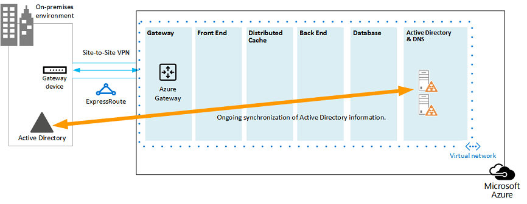

# SharePoint 2013용 Microsoft Azure 아키텍처Microsoft Azure Architectures for SharePoint 2013

Azure는 SharePoint Server 2013 솔루션을 호스트 하는 데 적합 한 환경입니다.Azure is a good environment for hosting a SharePoint Server 2013 solution. 대부분의 경우 Microsoft 365을 권장 하지만 Azure에서 호스트 되는 SharePoint Server 팜이 특정 솔루션에 적합 한 옵션 일 수 있습니다.In most cases, we recommend Microsoft 365, but a SharePoint Server farm hosted in Azure can be a good option for specific solutions. 이 문서에서는 Azure 플랫폼에 적합 한 방식으로 SharePoint 솔루션을 설계 하는 방법을 설명 합니다.This article describes how to architect SharePoint solutions so they are a good fit in the Azure platform. 다음 두 가지 특정 솔루션은 예제로 사용 됩니다.The following two specific solutions are used as examples:
  
- [Microsoft Azure에서 SharePoint Server 2013 재해 복구SharePoint Server 2013 Disaster Recovery in Microsoft Azure](sharepoint-server-2013-disaster-recovery-in-microsoft-azure.md)
    
- [SharePoint Server 2013을 사용하는 Microsoft Azure의 인터넷 사이트Internet Sites in Microsoft Azure using SharePoint Server 2013](internet-sites-in-microsoft-azure-using-sharepoint-server-2013.md)
    
## Azure 인프라 서비스용으로 권장 되는 SharePoint 솔루션Recommended SharePoint solutions for Azure Infrastructure Services

Azure 인프라 서비스는 SharePoint 솔루션을 호스팅하기 위한 뛰어난 옵션입니다.Azure infrastructure services is a compelling option for hosting SharePoint solutions. 다른 솔루션 보다이 플랫폼에 적합 한 몇 가지 솔루션이 있습니다.Some solutions are a better fit for this platform than others. 다음 표에는 권장 해결 방법이 나와 있습니다.The following table shows recommended solutions.
  
|**해결 방법****Solution**|**Azure에이 솔루션을 권장 하는 이유****Why this solution is recommended for Azure**|
|:-----|:-----|
|개발 및 테스트 환경Development and test environments    |이러한 환경을 손쉽게 만들고 관리할 수 있습니다.It's easy to create and manage these environments.    |
|Azure에 대 한 온-프레미스 SharePoint 팜의 재해 복구Disaster recovery of on-premises SharePoint farms to Azure    |**호스팅된 보조 데이터 센터** 다른 지역의 보조 데이터 센터에 투자 하는 대신 Azure를 사용 합니다.**Hosted secondary datacenter** Use Azure instead of investing in a secondary datacenter in a different region.   **저렴 한 재해 복구 환경** 온-프레미스 재해 복구 환경 보다 리소스를 줄이고 유지 관리 하 고 비용을 지불 합니다.**Lower-cost disaster-recovery environments** Maintain and pay for fewer resources than an on-premises disaster recovery environment. 리소스 수는 콜드 대기, 웜 대기 또는 핫 대기 중에서 선택한 재해 복구 환경에 따라 달라 집니다.The number of resources depends on the disaster recovery environment you choose: cold standby, warm standby, or hot standby.   **보다 탄력적 플랫폼** 재해가 발생 하는 경우 복구 SharePoint 팜을 쉽게 확장 하 여 부하 요구 사항을 충족할 수 있습니다.**More elastic platform** In the event of a disaster, easily scale-out your recovery SharePoint farm to meet load requirements. 리소스가 더 이상 필요 하지 않은 경우에 확장 됩니다.Scale in when you no longer need the resources.   [Microsoft Azure의 SharePoint Server 2013 재해 복구를](sharepoint-server-2013-disaster-recovery-in-microsoft-azure.md)참조 하세요.See [SharePoint Server 2013 Disaster Recovery in Microsoft Azure](sharepoint-server-2013-disaster-recovery-in-microsoft-azure.md).    |
|Microsoft 365에서 사용할 수 없는 기능 및 배율을 사용 하는 인터넷 연결 사이트Internet-facing sites that use features and scale not available in Microsoft 365    |**노력 집중** 인프라를 구축 하는 것 보다는 훌륭한 사이트 구축에 집중 합니다.**Focus your efforts** Concentrate on building a great site rather than building infrastructure.   **Azure에서 회복 력을 활용** 합니다. 새 서버를 추가 하 여 요청을 위한 팜의 크기를 조정 하 고 필요한 리소스만 지불 합니다.**Take advantage of elasticity in Azure** Size the farm for the demand by adding new servers, and pay only for resources you need. 동적 컴퓨터 할당이 지원 되지 않습니다 (자동 크기 조정).Dynamic machine allocation is not supported (auto scale).   **Azure Active Directory (AD) 사용** 고객 계정에 대 한 Azure AD를 활용 합니다.**Use Azure Active Directory (AD)** Take advantage of Azure AD for customer accounts.   **Microsoft 365에서 사용할 수 없는 SharePoint 기능 추가** 상세 보고 및 web analytics 추가**Add SharePoint functionality not available in Microsoft 365** Add deep reporting and web analytics.   [SharePoint Server 2013을 사용 하 여 Microsoft Azure의 인터넷 사이트를](internet-sites-in-microsoft-azure-using-sharepoint-server-2013.md)참조 하세요.See [Internet Sites in Microsoft Azure using SharePoint Server 2013](internet-sites-in-microsoft-azure-using-sharepoint-server-2013.md).    |
|Microsoft 365 또는 온-프레미스 환경을 지원 하기 위한 앱 팜App farms to support Microsoft 365 or on-premises environments    |온-프레미스 및 클라우드 환경을 모두 지원 하기 위해 Azure에서 **앱을 구축, 테스트 및 호스트** 합니다.**Build, test, and host apps** in Azure to support both on-premises and cloud environments.   온-프레미스 환경에 대 한 새 하드웨어를 구입 하는 대신 Azure에서 **이 역할을 호스트** 합니다.**Host this role** in Azure instead of buying new hardware for on-premises environments.   |
   
인트라넷 및 공동 작업 솔루션 및 작업에 대 한 자세한 내용은 다음 옵션을 고려 하십시오.For intranet and collaboration solutions and workloads, consider the following options:
  
- Microsoft 365이 비즈니스 요구 사항을 충족 하는지 또는 솔루션의 일부일 수 있는지 확인 합니다.Determine if Microsoft 365 meets your business requirements or can be part of the solution. Microsoft 365에서는 항상 최신 상태를 유지 하는 다양 한 기능 집합을 제공 합니다.Microsoft 365 provides a rich feature set that is always up to date.
    
- Microsoft 365이 모든 비즈니스 요구 사항을 충족 하지 않는 경우 MCS (Microsoft 컨설팅 서비스)에서 온-프레미스 SharePoint 2013의 표준 구현을 고려 합니다.If Microsoft 365 does not meet all your business requirements, consider a standard implementation of SharePoint 2013 on premises from Microsoft Consulting Services (MCS). 표준 아키텍처는 사용자 지정 된 것 보다 더 빠르고 저렴 하며 쉬운 해결책이 될 수 있습니다.A standard architecture can be a quicker, cheaper, and easier solution for you to support than a customized one. 
    
- 표준 구현이 비즈니스 요구 사항을 충족 하지 않는 경우에는 사용자 지정 된 온-프레미스 솔루션을 고려해 야 합니다.If a standard implementation doesn't meet your business requirements, consider a customized on-premises solution.
    
- 비즈니스 요구 사항에 따라 클라우드 플랫폼을 사용 하는 것이 중요 한 경우 Azure 인프라 서비스에서 호스트 되는 표준 또는 사용자 지정 된 SharePoint 2013 구현도 고려해 야 합니다.If using a cloud platform is important for your business requirements, consider a standard or customized implementation of SharePoint 2013 hosted in Azure infrastructure services. SharePoint 솔루션은 기본이 아닌 Microsoft 공용 클라우드 플랫폼 보다 Azure에서 더 쉽게 지원할 수 있습니다.SharePoint solutions are much easier to support in Azure than other non-native Microsoft public cloud platforms.
    
## Azure 환경을 디자인 하기 전에Before you design the Azure environment

이 문서에서는 예제 SharePoint 토폴로지를 사용 하지만 이러한 디자인 개념을 모든 SharePoint 팜 토폴로지와 함께 사용할 수 있습니다.While this article uses example SharePoint topologies, you can use these design concepts with any SharePoint farm topology. Azure 환경을 디자인 하기 전에 다음 토폴로지, 아키텍처, 용량 및 성능 지침을 사용 하 여 SharePoint 팜을 디자인 합니다.Before you design the Azure environment, use the following topology, architecture, capacity, and performance guidance to design the SharePoint farm:
  
- [SharePoint 2013 IT 전문가를 위한 아키텍처 디자인Architecture design for SharePoint 2013 IT pros](https://technet.microsoft.com/sharepoint/fp123594.aspx)
    
- [SharePoint Server 2013에서 성능 및 용량 관리 계획Plan for performance and capacity management in SharePoint Server 2013](https://technet.microsoft.com/library/8dd52916-f77d-4444-b593-1f7d6f330e5f.aspx)
    
## Active Directory 도메인 유형 확인Determine the Active Directory domain type

각 SharePoint Server 팜은 Active Directory를 사용 하 여 팜 설치를 위한 관리 계정을 제공 합니다.Each SharePoint Server farm relies on Active Directory to provide administrative accounts for farm setup. 현재 Azure의 SharePoint 솔루션에는 두 가지 옵션이 있습니다.At this time, there are two options for SharePoint solutions in Azure. 다음 표에 설명 되어 있습니다.These are described in the following table.
  
|**옵션****Option**|**설명****Description**|
|:-----|:-----|
|전용 도메인Dedicated domain    |SharePoint 팜을 지원 하기 위해 Azure에 전용 및 격리 된 Active Directory 도메인을 배포할 수 있습니다.You can deploy a dedicated and isolated Active Directory domain to Azure to support your SharePoint farm. 이 옵션은 공용 인터넷 사이트에 적합 합니다.This is a good choice for public-facing Internet sites.    |
|크로스-프레미스 연결을 통해 온-프레미스 도메인 확장Extend the on-premises domain through a cross-premises connection    |크로스-프레미스 연결을 통해 온-프레미스 도메인을 확장 하면 사용자는 온-프레미스를 호스트 하는 것 처럼 인트라넷을 통해 SharePoint 팜에 액세스 합니다.When you extend the on-premises domain through a cross-premises connection, users access the SharePoint farm via your intranet as if it were hosted on-premises. 온-프레미스 Active Directory 및 DNS 구현을 활용할 수 있습니다.You can take advantage of your on-premises Active Directory and DNS implementation.    온-프레미스 팜에서 장애 조치 (failover) 하기 위해 Azure에서 재해 복구 환경을 구축 하려면 크로스-프레미스 연결이 필요 합니다.A cross-premises connection is required for building a disaster-recovery environment in Azure to fail over to from your on-premises farm.    |
   
이 문서에서는 크로스-프레미스 연결을 통해 온-프레미스 도메인을 확장 하기 위한 디자인 개념에 대해 설명 합니다.This article includes design concepts for extending the on-premises domain through a cross-premises connection. 솔루션에서 전용 도메인을 사용 하는 경우 크로스-프레미스 연결이 필요 하지 않습니다.If your solution uses a dedicated domain, you don't need a cross-premises connection.
  
## 가상 네트워크 디자인Design the virtual network

먼저 Azure에 가상 컴퓨터를 배치할 서브넷이 포함 된 가상 네트워크가 필요 합니다.First you need a virtual network in Azure, which includes subnets on which you will place your virtual machines. 가상 네트워크에는 서브넷에 할당 하는 개인 IP 주소 공간이 필요 합니다.The virtual network needs a private IP address space, portions of which you assign to the subnets.
  
크로스-프레미스 연결 (재해 복구 환경에 필요)을 통해 온-프레미스 네트워크를 Azure로 확장 하는 경우에는 온-프레미스 환경 및 기타 Azure 가상 네트워크를 포함할 수 있는 조직 네트워크의 다른 위치에서 아직 사용 되지 않은 개인 주소 공간을 선택 해야 합니다.If you are extending your on-premises network to Azure through a cross-premises connection (required for a disaster recovery environment), you must choose a private address space that is not already in use elsewhere in your organization network, which can include your on-premises environment and other Azure virtual networks. 
  
**그림 1: Azure의 가상 네트워크를 사용 하는 온-프레미스 환경****Figure 1: On-premises environment with a virtual network in Azure**

  
다음은 이 다이어그램에 대한 설명입니다.In this diagram:
  
- Azure의 가상 네트워크는 온-프레미스 환경에 나란히 표시 됩니다.A virtual network in Azure is illustrated side-by-side to the on-premises environment. 두 환경은 교차-프레미스 연결에 의해 아직 연결 되지 않으며, 사이트 간 VPN 연결 또는 Express 경로일 수 있습니다.The two environments are not yet connected by a cross-premises connection, which can be a site-to-site VPN connection or ExpressRoute.
    
- 이 시점에서 가상 네트워크에는 서브넷과 다른 아키텍처 요소가 포함 되지 않습니다.At this point, the virtual network just includes the subnets and no other architectural elements. 한 서브넷은 Azure gateway를 호스팅하고 다른 서브넷은 SharePoint 팜의 계층을 호스트 하 고, Active Directory 및 DNS를 추가로 사용 합니다.One subnet will host the Azure gateway and other subnets host the tiers of the SharePoint farm, with an additional one for Active Directory and DNS.
    
## 크로스-프레미스 연결 추가Add cross-premises connectivity

다음 배포 단계는 크로스-프레미스 연결 (솔루션에 해당 되는 경우)을 만드는 것입니다.The next deployment step is to create the cross-premises connection (if this applies to your solution). 크로스-프레미스 연결의 경우 Azure 게이트웨이는 별도의 게이트웨이 서브넷에 있으며 주소 공간을 만들고 할당 해야 합니다.For cross-premises connections, a Azure gateway resides in a separate gateway subnet, which you must create and assign an address space. 
  
크로스-프레미스 연결을 계획할 때는 Azure 게이트웨이와 온-프레미스 게이트웨이 장치에 대 한 연결을 정의 하 고 만듭니다.When you plan for a cross-premises connection, you define and create an Azure gateway and connection to an on-premises gateway device.
  
**그림 2: Azure 게이트웨이와 온-프레미스 게이트웨이 장치를 사용 하 여 온-프레미스 환경 및 Azure 간의 사이트 간 연결 제공****Figure 2: Using an Azure gateway and an on-premises gateway device to provide site-to-site connectivity between the on-premises environment and Azure**

  
다음은 이 다이어그램에 대한 설명입니다.In this diagram:
  
- 이전 다이어그램에 추가 하는 경우 온-프레미스 환경은 크로스-프레미스 연결 (사이트 간 VPN 연결 또는 Express 가능)에 의해 Azure virtual network에 연결 됩니다.Adding to the previous diagram, the on-premises environment is connected to the Azure virtual network by a cross-premise connection, which can be a site-to-site VPN connection or ExpressRoute.
    
- Azure 게이트웨이가 게이트웨이 서브넷에 있습니다.An Azure gateway is on a gateway subnet.
    
- 온-프레미스 환경에는 라우터 또는 VPN 서버와 같은 게이트웨이 장치가 포함 됩니다.The on-premises environment includes a gateway device, such as a router or VPN server.
    
크로스-프레미스 가상 네트워크를 계획 하 고 만드는 방법에 대 한 자세한 내용은 온 [-프레미스 네트워크를 Microsoft Azure virtual network에 연결](connect-an-on-premises-network-to-a-microsoft-azure-virtual-network.md)을 참조 하십시오.For additional information to plan for and create a cross-premises virtual network, see [Connect an on-premises network to a Microsoft Azure virtual network](connect-an-on-premises-network-to-a-microsoft-azure-virtual-network.md).
  
## AD DS (Active Directory 도메인 서비스) 및 DNS 추가Add Active Directory Domain Services (AD DS) and DNS

Azure의 재해 복구에서는 Windows Server ad가 온-프레미스와 Azure 가상 컴퓨터 모두에 배포 되는 하이브리드 시나리오에서 Windows Server AD와 DNS를 배포 합니다.For disaster recovery in Azure, you deploy Windows Server AD and DNS in a hybrid scenario where Windows Server AD is deployed both on-premises and on Azure virtual machines.
  
**그림 3: 하이브리드 Active Directory 도메인 구성****Figure 3: Hybrid Active Directory domain configuration**

  
이 다이어그램에서는 두 개의 가상 컴퓨터를 Windows Server AD 및 DNS 서브넷에 추가 하 여 이전 다이어그램을 작성 합니다.This diagram builds on the previous diagrams by adding two virtual machines to a Windows Server AD and DNS subnet. 이러한 가상 컴퓨터는 복제 도메인 컨트롤러 및 DNS 서버입니다.These virtual machines are replica domain controllers and DNS servers. 사용자는 온-프레미스 Windows Server AD 환경의 확장입니다.They are an extension of the on-premises Windows Server AD environment. 
  
다음 표에는 Azure의 이러한 가상 컴퓨터에 대 한 구성 권장 사항이 나와 있습니다.The following table provides configuration recommendations for these virtual machines in Azure. Azure 환경이 온-프레미스 환경과 통신 하지 않는 전용 도메인에도이 기능을 사용 하 여 환경을 디자인 하는 시작 점으로 사용할 수도 있습니다.Use these as a starting point for designing your own environment—even for a dedicated domain where your Azure environment doesn't communicate with your on-premises environment.
  
|**항목****Item**|**구성****Configuration**|
|:-----|:-----|
|Azure의 가상 컴퓨터 크기Virtual machine size in Azure    |표준 계층의 A1 또는 A2 크기A1 or A2 size in the Standard tier    |
|운영 체제Operating system    |Windows Server 2012 R2Windows Server 2012 R2    |
|Active Directory 역할Active Directory role    |글로벌 카탈로그 서버로 지정 된 AD DS 도메인 컨트롤러AD DS domain controller designated as a global catalog server. 이 구성을 사용 하면 크로스-프레미스 연결을 통해 송신 트래픽을 줄일 수 있습니다.This configuration reduces egress traffic across the cross-premises connection.    변경 비율이 높은 다중 도메인 환경 (일반적이 아님)에서 복제 트래픽을 줄이기 위해 온-프레미스에서 도메인 컨트롤러를 Azure의 글로벌 카탈로그 서버와 동기화 하지 않도록 구성 합니다.In a multidomain environment with high rates of change (this is not common), configure domain controllers on premises not to sync with the global catalog servers in Azure, to reduce replication traffic.    |
|DNS 역할DNS role    |도메인 컨트롤러에 DNS 서버 서비스를 설치 하 고 구성 합니다.Install and configure the DNS Server service on the domain controllers.    |
|데이터 디스크Data disks    |Active Directory 데이터베이스, 로그 및 SYSVOL을 추가 Azure 데이터 디스크에 배치 합니다.Place the Active Directory database, logs, and SYSVOL on additional Azure data disks. 이를 운영 체제 디스크 또는 Azure에서 제공 하는 임시 디스크에 배치 하지 마십시오.Do not place these on the operating system disk or the temporary disks provided by Azure.    |
|IP 주소IP addresses    |고정 IP 주소를 사용 하 고 도메인 컨트롤러를 구성한 후에는 가상 네트워크의 가상 컴퓨터에 이러한 주소를 할당 하도록 가상 네트워크를 구성 합니다.Use static IP addresses and configure the virtual network to assign these addresses to the virtual machines in the virtual network after the domain controllers have been configured.    |
   
> [!IMPORTANT]
> Azure에서 Active Directory를 배포 하기 전에 [Azure 가상 컴퓨터에 Windows Server Active directory를 배포 하기 위한 지침](https://go.microsoft.com/fwlink/p/?linkid=392681)을 읽어 보십시오.Before you deploy Active Directory in Azure, read [Guidelines for Deploying Windows Server Active Directory on Azure Virtual Machines](https://go.microsoft.com/fwlink/p/?linkid=392681). 다음은 솔루션에 다른 아키텍처 또는 다른 구성 설정이 필요한 지를 결정 하는 데 도움이 되는 정보입니다.These help you determine if a different architecture or different configuration settings are needed for your solution. 
  
## SharePoint 팜 추가Add the SharePoint farm

SharePoint 팜의 가상 컴퓨터를 해당 서브넷의 계층에 배치 합니다.Place the virtual machines of the SharePoint farm in tiers on the appropriate subnets.
  
**그림 4: SharePoint 가상 컴퓨터 배치****Figure 4: Placement of SharePoint virtual machines**

  
이 다이어그램은 해당 계층에 SharePoint 팜 서버 역할을 추가 하 여 이전 다이어그램을 작성 합니다.This diagram builds on the previous diagrams by adding the SharePoint farm server roles in their respective tiers.
  
- SQL Server를 실행 하는 두 개의 데이터베이스 가상 컴퓨터에서 데이터베이스 계층을 만듭니다.Two database virtual machines running SQL Server create the database tier.
    
- 프런트 엔드 서버, 분산 캐시 서버 및 백 엔드 서버 계층 각각에 대해 SharePoint Server 2013을 실행 하는 두 개의 가상 컴퓨터가 있습니다.Two virtual machines running SharePoint Server 2013 for each of the following tiers: front end servers, distributed cache servers, and back end servers.
    
## 가용성 집합 및 장애 도메인에 대 한 서버 역할 디자인 및 미세 조정Design and fine tune server roles for availability sets and fault domains

장애 도메인은 역할 인스턴스가 실행 되는 하드웨어 그룹입니다.A fault domain is a grouping of hardware in which role instances run. 동일한 장애 도메인 내의 가상 컴퓨터는 Azure 인프라에서 동시에 업데이트할 수 있습니다.Virtual machines within the same fault domain can be updated by the Azure infrastructure at the same time. 동일한 랙을 공유 하기 때문에 동시에 실패할 수도 있습니다.Or, they can fail at the same time because they share the same rack. 동일한 오류 도메인에 두 대의 가상 컴퓨터가 있을 위험을 방지 하기 위해 가상 컴퓨터를 가용성 집합으로 구성 하 여 각 가상 컴퓨터가 서로 다른 오류 도메인에 있도록 할 수 있습니다.To avoid the risk of having two virtual machines on the same fault domain, you can configure your virtual machines as an availability set, which ensures that each virtual machine is in a different fault domain. 세 개의 가상 컴퓨터가 가용성 집합으로 구성 된 경우 Azure는 두 개 이상의 가상 컴퓨터가 동일한 오류 도메인에 있는 것을 보장 합니다.If three virtual machines are configured as an availability set, Azure guarantees that no more than two of the virtual machines are located in the same fault domain.
  
SharePoint 팜에 대 한 Azure 아키텍처를 디자인할 때는 가용성 집합에 포함 되도록 동일한 서버 역할을 구성 합니다.When you design the Azure architecture for a SharePoint farm, configure identical server roles to be part of an availability set. 이렇게 하면 가상 컴퓨터가 여러 장애 도메인에 분산 됩니다.This ensures that your virtual machines are spread across multiple fault domains.
  
**그림 5: Azure 가용성 집합을 사용 하 여 SharePoint 팜 계층에 대 한 고가용성 제공****Figure 5: Use Azure Availability Sets to provide high availability for the SharePoint farm tiers**

  
이 다이어그램은 Azure 인프라 내에서 가용성 집합의 구성을 호출 합니다.This diagram calls out the configuration of availability sets within the Azure infrastructure. 다음의 각 역할은 별도의 가용성 집합을 공유 합니다.Each of the following roles share a separate availability set:
  
- Active Directory 및 DNSActive Directory and DNS
    
- 데이터베이스Database
    
- 백 엔드Back end
    
- 캐시 배포Distribute cache
    
- 프런트 엔드Front end
    
SharePoint 팜을 Azure 플랫폼에서 미세 조정 해야 할 수 있습니다.The SharePoint farm might need to be fine tuned in the Azure platform. 모든 구성 요소의 고가용성을 보장 하려면 서버 역할이 모두 동일 하 게 구성 되어 있는지 확인 합니다.To ensure high availability of all components, ensure that the server roles are all configured identically.
  
다음은 특정 용량 및 성능 목표를 충족 하는 표준 인터넷 사이트 아키텍처를 보여 주는 예입니다.Here is an example that shows a standard Internet Sites architecture that meets specific capacity and performance goals. 이 예제는 다음과 같은 아키텍처 모델, 즉 [SharePoint Server 2013 용 인터넷 사이트 검색 아키텍처](https://go.microsoft.com/fwlink/p/?LinkId=261519)에 제공 됩니다.This example is featured in the following architecture model: [Internet Sites Search Architectures for SharePoint Server 2013](https://go.microsoft.com/fwlink/p/?LinkId=261519).
  
**그림 6:3 계층 팜의 용량 및 성능 목표에 대 한 계획 예제****Figure 6: Planning example for capacity and performance goals in a three-tier farm**

  
다음은 이 다이어그램에 대한 설명입니다.In this diagram:
  
- 3 계층 팜 (웹 서버, 응용 프로그램 서버 및 데이터베이스 서버)이 표시 됩니다.A three-tier farm is represented: web servers, application servers, and database servers.
    
- 세 웹 서버는 여러 구성 요소와 동일한 방식으로 구성 됩니다.The three web servers are configured identically with multiple components.
    
- 두 데이터베이스 서버는 동일 하 게 구성 됩니다.The two database servers are configured identically.
    
- 세 응용 프로그램 서버는 동일 하 게 구성 되지 않습니다.The three application servers are not configured identically. 이러한 서버 역할을 사용 하려면 Azure의 가용성 집합에 대 한 미세 조정이 필요 합니다.These server roles require fine tuning for availability sets in Azure.
    
응용 프로그램 서버 계층을 좀 더 자세히 살펴보겠습니다.Let's look closer at the application server tier.
  
**그림 7: 미세 조정 이전의 응용 프로그램 서버 계층****Figure 7: Application server tier before fine tuning**

  
다음은 이 다이어그램에 대한 설명입니다.In this diagram:
  
- 응용 프로그램 계층에는 세 개의 서버가 포함 됩니다.Three servers are included in the application tier.
    
- 첫 번째 서버에는 네 개의 구성 요소가 포함 되어 있습니다.The first server includes four components.
    
- 두 번째 서버에는 세 개의 구성 요소가 포함 됩니다.The second server includes three components.
    
- 세 번째 서버에는 두 개의 구성 요소가 있습니다.The third server includes two components.
    
팜의 성능 및 용량 목표에 따라 구성 요소의 수를 결정 합니다.You determine the number of components by the performance and capacity targets for the farm. Azure에 대해이 아키텍처를 조정 하기 위해 3 대의 모든 서버에서 네 개의 구성 요소를 복제 합니다.To adapt this architecture for Azure, we'll replicate the four components across all three servers. 이렇게 하면 성능 및 용량에 필요한 구성 요소의 수가 늘어납니다.This increases the number of components beyond what is necessary for performance and capacity. 이러한 단점은 이러한 세 가지 가상 컴퓨터가 가용성 집합에 할당 될 때 Azure 플랫폼에 있는 네 가지 구성 요소의 고가용성을 보장 한다는 것입니다.The tradeoff is that this design ensures high availability of all four components in the Azure platform when these three virtual machines are assigned to an availability set.
  
**그림 8: 미세 조정 후 응용 프로그램 서버 계층****Figure 8: Application server tier after fine tuning**

  
이 다이어그램에서는 동일한 4 개의 구성 요소와 동일 하 게 구성 된 3 개의 응용 프로그램 서버를 모두 보여 줍니다.This diagram shows all three application servers configured identically with the same four components.
  
SharePoint 팜의 계층에 가용성 집합을 추가 하면 구현이 완료 됩니다.When we add availability sets to the tiers of the SharePoint farm, the implementation is complete.
  
**그림 9: Azure 인프라 서비스의 완료 된 SharePoint 팜****Figure 9: The completed SharePoint farm in Azure infrastructure services**

  
이 다이어그램에서는 각 계층의 서버에 대 한 장애 도메인을 제공 하기 위한 가용성 집합과 함께 Azure 인프라 서비스에서 구현 되는 SharePoint 팜을 보여 줍니다.This diagram shows the SharePoint farm implemented in Azure infrastructure services, with availability sets to provide fault domains for the servers in each tier.
  
## 참고 항목See Also

[클라우드 도입 및 하이브리드 솔루션Cloud adoption and hybrid solutions](cloud-adoption-and-hybrid-solutions.yml)
  
[SharePoint Server 2013을 사용하는 Microsoft Azure의 인터넷 사이트Internet Sites in Microsoft Azure using SharePoint Server 2013](internet-sites-in-microsoft-azure-using-sharepoint-server-2013.md)
  
[Microsoft Azure에서 SharePoint Server 2013 재해 복구SharePoint Server 2013 Disaster Recovery in Microsoft Azure](sharepoint-server-2013-disaster-recovery-in-microsoft-azure.md)

