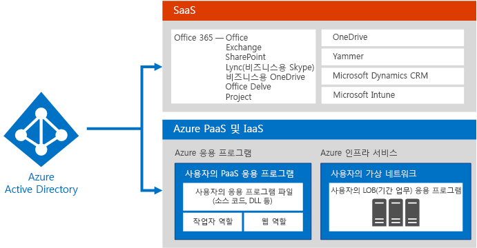
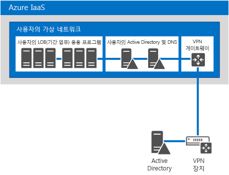
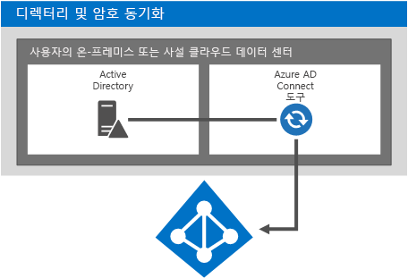
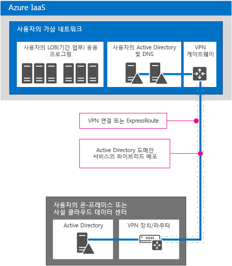
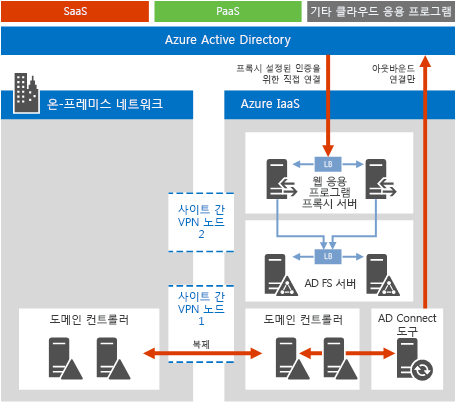

# Microsoft Cloud Identity for Enterprise Architects

 **요약:** Microsoft 클라우드 서비스 및 플랫폼에 맞게 ID 솔루션을 디자인합니다.
  
이 문서에서는 Microsoft 클라우드 서비스 및 플랫폼을 사용하는 조직용으로 ID를 설계하는 과정과 관련하여 IT 설계자가 파악해야 하는 사항을 설명합니다. 이 문서를 5페이지로 이루어진 포스터로 표시한 후 타블로이드 형식으로 인쇄할 수도 있습니다(ledger 11 x 17 또는 A3).
  

  
[PDF](https://go.microsoft.com/fwlink/p/?LinkId=524586) | [Visio]((https://download.microsoft.com/download/2/3/8/238228E6-9017-4F6C-BD3C-5559E6708F82/MSFT_cloud_architecture_identity.vsd)) | [기타 언어](https://www.microsoft.com/download/details.aspx?id=54431)
  
[Microsoft 클라우드 IT 아키텍처 리소스](microsoft-cloud-it-architecture-resources.md) 에서 모든 모델을 보고[Microsoft의 엔터프라이즈 클라우드 로드맵: IT 의사 결정권자를 위한 리소스]((https://aka.ms/cloudarchitecture))를 살펴볼 수도 있습니다.
  
> [!NOTE]
> 이 문서에서는 **Microsoft Cloud ID for Enterprise Architects** 포스터의 2016년 1월 이후 버전을 반영합니다. 이 포스터의 2016년 4월 버전에 대한 변경 내용을 포함하지 않습니다.
  
## Microsoft 클라우드의 ID 디자인

ID를 Microsoft 클라우드와 통합하면 보다 폭넓은 서비스 및 클라우드 플랫폼 옵션에 액세스할 수 있습니다. 두 가지 기본 옵션이 있습니다.
  
- Microsoft Azure AD(Active Directory)와 통합할 수 있습니다. 여기에는 Microsoft 클라우드에 대한 ID 공급자인 Azure AD에 온-프레미스 계정을 동기화하는 과정이 포함됩니다.
    
- Microsoft Azure 인프라 서비스에서 실행되는 가상 컴퓨터로 온-프레미스 AD DS(Active Directory 도메인 서비스) 환경을 확장할 수 있습니다.
    

  
 **그림 1: 클라우드에서 ID를 디자인하기 위한 옵션**
  
그림 1에서는 Azure AD가 Microsoft SaaS(Software as a Service) 서비스 및 Azure PaaS(Platform as a Service) 응용 프로그램에 대한 ID 공급자의 역할을 하는지와 LOB(기간 업무) 응용 프로그램에서 어떤 방식으로 온-프레미스 AD DS를 사용하는지를 보여 줍니다. 
  
### Azure Active Directory

Microsoft Azure AD는 Microsoft 클라우드 호스티드 ID 및 액세스 관리 서비스로, Microsoft 클라우드 서비스 및 플랫폼의 핵심에 있습니다. Azure AD와 통합하면 현재 계정 및 암호 집합을 사용하여 모든 Microsoft SaaS 서비스에 액세스할 수 있습니다. 또한 Azure PaaS 응용 프로그램용 클라우드 기반 ID 기능도 제공됩니다. 
  
> [!NOTE]
> Azure AD는 엔터프라이즈 조직 또는 Azure IaaS(Infrastructure as a Service)에서 실행되는 Windows 기반 가상 시스템의 AD DS 온-프레미스 요구를 대신 충족하지는 못합니다. 
  
Azure AD에는 무료, 기본 및 프리미엄의 세 가지 버전이 있습니다. 
  
||||
|:-----|:-----|:-----|
|**무료**   |**기본**   |**프리미엄**   |
| 	사용자 계정 관리    온-프레미스 디렉터리와 동기화    Azure, Office 365 및 널리 사용되는 수천 가지 기타 SaaS 응용 프로그램(예: Salesforce, Workday, Concur, DocuSign, Google Apps, Box, ServiceNow, Dropbox 등)에서 Single Sign-On   | 무료 버전에 포함된 모든 기능과 다음 기능 포함:    회사 브랜딩    그룹 기반 응용 프로그램 액세스    셀프 서비스 암호 재설정    99.9%의 엔터프라이즈 SLA   | 무료 및 기본 버전의 모든 기능과 다음 기능 포함:    셀프 서비스 그룹 관리    고급 보안 보고서 및 알림    Multi-Factor Authentication    온-프레미스 AD DS에 쓰기 저장하는 방식의 암호 재설정    Azure Connect AD 도구 양방향 동기화    Azure AD 응용 프로그램 프록시    	MIM(Microsoft Forefront Identity Manager)   |
   
버전에 대한 자세한 내용은 [Azure Active Directory 버전](https://go.microsoft.com/fwlink/p/?LinkId=524280)을 참조하세요.
  
### 옵션 1: Azure Active Directory와의 통합

대부분의 조직에서는 표준 개체 및 특성 집합을 Azure AD 테넌트와 동기화합니다. Azure AD Connect 도구는 온-프레미스 AD DS와 Azure AD 테넌트 간에 계정을 동기화합니다.
  

  
 **그림 2: Azure AD와 통합**
  
그림 2에서는 Azure AD Connect 도구가 AD DS의 변경 내용을 가져온 후 Azure AD 테넌트로 보내는 방법을 보여 줍니다. 이 경우 Azure AD 테넌트는 필수적인 온-프레미스 디렉터리 콘텐츠의 클라우드 호스티드 복제본입니다.
  
대부분의 조직에서는 AD DS를 온-프레미스 ID 공급자로 사용합니다. 다른 유형의 ID 공급자 온-프레미스(예: LDAP 사용)를 사용하고 Azure AD와 동기화할 수 있습니다.
  
### 옵션 2: AD DS를 Azure로 확장

Azure 인프라 서비스에서 실행되는 가상 컴퓨터로 AD DS를 확장하면 Azure AD와 동기화할 경우와는 다른 솔루션 및 응용 프로그램 집합이 지원됩니다. 다음은 두 가지 지원 결과입니다.
  
- NTLM 또는 Kerberos 인증을 요구하는 클라우드 기반 솔루션 또는 AD DS 도메인 가입 가상 컴퓨터가 지원됩니다.
    
- 여러 Microsoft 클라우드 서비스 및 플랫폼에 클라우드 서비스 및 응용 프로그램에 대한 추가 통합이 추가됩니다.
    

  
 **그림 3: Azure로 AD DS 확장**
  
그림 3에서는 온-프레미스 VPN 장치와 Azure VPN 게이트웨이를 통해 Azure Virtual Network에 연결된 AD DS 도메인 컨트롤러를 보여 줍니다. Azure Virtual Network에는 기간 업무 응용 프로그램 및 고유한 AD DS 도메인 컨트롤러 집합을 위한 서버가 포함되어 있습니다.
  
### 추가 정보

- [편리한 Office 365와의 디렉터리 동기화](https://go.microsoft.com/fwlink/p/?LinkId=524281)
    
- [Infographic: 클라우드 ID 및 액세스 관리](https://go.microsoft.com/fwlink/p/?LinkId=524282)
    
- [Azure Active Directory](https://go.microsoft.com/fwlink/p/?LinkId=524283)
    
## 온-프레미스 AD DS 계정과 Microsoft Azure AD 통합

Azure AD와 온-프레미스 AD DS 계정을 동기화하면 사용자는 온-프레미스 AD DS 계정을 사용하여 다음에 액세스할 수 있습니다.
  
- 모든 Microsoft SaaS 서비스(Office 365, Microsoft Intune 및 Dynamics CRM Online)
    
- Azure PaaS에서 실행되는 응용 프로그램
    
다음 두 가지 방법으로 이러한 통합을 구성할 수 있습니다.
  
- 디렉터리 및 암호 동기화
    
- 페더레이션 및 Single Sign-On
    
필요에 맞는 가장 간단한 옵션부터 시작합니다. 필요에 따라 이러한 옵션 간을 전환할 수 있습니다.
  
> [!NOTE]
> 엔터프라이즈급 조직에서는 클라우드 전용 계정(온-프레미스 AD DS와 통합되지 않은)을 사용하지 않는 것이 좋습니다. 
  
### 디렉터리 및 암호 동기화

이것은 가장 간단한 옵션이며 Azure AD Connect 도구를 실행하는 서버만 필요합니다. 
  

  
 **그림 4: 디렉터리 및 암호 동기화 구성**
  
그림 4에서는 AD DS 도메인 컨트롤러가 있는 온-프레미스 또는 사설 클라우드 데이터 센터를 보여 줍니다. Azure AD Connect 도구를 실행하는 서버는 계정 이름 목록을 Azure AD와 동기화합니다.
  
이 옵션을 사용하는 경우:
  
- 사용자 계정이 온-프레미스 AD DS(또는 다른 ID 공급자)에서 Azure AD 테넌트로 동기화됩니다. 온-프레미스 디렉터리는 계정에 대한 권한 있는 원본을 유지하며, 사용자는 이 디렉터리에서 모든 계정 변경 내용을 관리합니다.
    
- Azure AD는 Microsoft SaaS 기반 서비스 및 Azure PaaS 응용 프로그램에 대한 모든 인증을 수행합니다.
    
- 여러 AD DS 포리스트에 대한 동기화를 구성할 수도 있습니다.
    
암호 동기화를 사용하는 경우:
  
- 클라우드 서비스에 액세스할 때 온-프레미스 리소스에 대해 사용하는 것과 동일한 암호를 입력하라는 메시지가 표시됩니다.
    
- 사용자 암호는 절대 Azure AD에 일반 텍스트로 전송되지 않습니다. 대신 암호 해시가 사용됩니다. 암호화 방식으로는 암호 해시를 암호 해독하거나 리버스 엔지니어링하고 암호화되지 않은 암호를 획득할 수 없습니다. 
    
MFA(Multi-Factor Authentication)를 사용하는 경우;
  
- Office 365와 함께 제공되는 기본적인 MFA 기능을 활용할 수 있습니다.
    
- Azure PaaS 응용 프로그램 개발자는 Azure Multi-Factor Authentication 서비스를 활용할 수 있습니다.
    
디렉터리 동기화에서는 온-프레미스 MFA 솔루션과의 통합 기능이 제공되지 않습니다.
  
### 페더레이션 및 Single Sign-On

이 옵션을 사용하려면 추가 서버 및 인프라가 필요합니다. 
  

  
 **그림 5: 페더레이션된 인증에 필요한 서버**
  
그림 5에서는 페더레이션된 인증을 위한 구성 요소 집합을 보여 줍니다. Azure AD는 웹 응용 프로그램 프록시에 연결하면 이 프록시는 AD FS(Active Directory Federation Services)에 인증 요청을 전달합니다. 그러면 서버는 평가 및 응답을 위해 AD DS 도메인 컨트롤러에 요청을 전달합니다. Azure AD Connect 도구를 실행하는 서버는 AD DS에서 Azure AD로 계정 이름 목록을 동기화합니다.
  
페더레이션은 다음과 같은 추가 엔터프라이즈 기능을 제공합니다.
  
- Azure AD로 전송된 모든 인증 요청은 AD DS를 통해 온-프레미스 ID 공급자로 전달되고 수행됩니다.
    
- 타사 ID 공급자에서도 사용 가능합니다.
    
- 암호 해시 동기화는 페더레이션된 로그인에 대한 로그인 백업으로 작동합니다(예: 페더레이션 인증이 실패할 경우).
    
다음 경우에 페더레이션을 사용합니다.
  
- Single Sign-On이 필요한 경우. Single Sign-On을 사용하면 클라우드 서비스에 액세스할 때 자격 증명(사용자 이름 또는 암호)을 입력하라는 메시지가 표시되지 않습니다.
    
- AD FS가 이미 배포된 경우
    
- 타사 ID 공급자를 사용하는 경우
    
- Forefront Identity Manager 2010 R2를 사용하는 경우(암호 해시 동기화 지원 안 됨)
    
- 온-프레미스 통합 스마트 카드 또는 기타 MFA 솔루션이 있는 경우
    
- 로그인 감사 및/또는 계정 비활성화 기능이 필요한 경우
    
- 조직에서 네트워크 위치 또는 작업 시간에 따라 클라이언트 로그인을 제한해야 하는 경우
    
- FIPS(Federal Information Processing Standard)를 준수해야 하는 경우
    
페더레이션 인증을 위해서는 인프라 온-프레미스에 더 많은 투자를 해야 합니다.
  
- 온-프레미스 서버는 회사 방화벽을 통해 인터넷에 액세스할 수 있어야 합니다. 경계 네트워크에 배포된 웹 응용 프로그램 프록시 서버를 사용하는 것이 좋습니다.
    
- AD FS 서버, AD FS 프록시 또는 웹 응용 프로그램 프록시 서버/방화벽/부하 분산 장치용 하드웨어와 라이선스가 필요하며 관련 작업을 수행해야 합니다. 
    
- 사용자가 Office 365 및 기타 클라우드 응용 프로그램에 액세스할 수 있도록 하려면 가용성과 성능이 중요합니다.
    
### 추가 정보

- [편리한 Office 365와의 디렉터리 동기화](https://go.microsoft.com/fwlink/p/?LinkId=524281)
    
- [디렉터리 동기화를 통해 사용자를 Office 365에 프로비전하기 위한 준비](https://go.microsoft.com/fwlink/p/?LinkId=524284)
    
- [Office 365에 대한 다단계 인증 사용](https://go.microsoft.com/fwlink/p/?LinkID=392012)
    
- [Azure Multi-factor Authentication](https://go.microsoft.com/fwlink/p/?LinkId=524285)
    
- [TechEd 2014: 디렉터리 통합: Active Directory 및 Azure Active Directory를 사용하여 단일 디렉터리 만들기](https://go.microsoft.com/fwlink/p/?LinkId=524286)
    
## AD DS를 Azure로 확장

Azure에 AD DS를 확장하는 것은 Azure 인프라 서비스의 가상 컴퓨터에서 실행되는 기간 업무 응용 프로그램을 지원하기 위한 첫 번째 단계로, 다음을 제공합니다.
  
- NTLM 또는 Kerberos 인증을 요구하는 클라우드 기반 솔루션 또는 AD DS 도메인 가입 가상 컴퓨터가 지원됩니다.
    
- 클라우드 서비스 및 응용 프로그램에 대한 추가 통합 지원을 언제든지 추가할 수 있습니다.
    

  
 **그림 6: Azure Virtual Network로 AD DS 확장**
  
그림 6에서는 AD DS가 사이트 간 VPN 또는 ExpressRoute 연결을 사용하여 Azure Virtual Network에 연결된 온-프레미스 또는 사설 클라우드 데이터 센터를 보여 줍니다. Azure Virtual Network에는 기간 업무 응용 프로그램 및 고유한 AD DS 도메인 컨트롤러 집합을 위한 서버가 포함되어 있습니다. 이 구성은 온-프레미스 및 Azure 인프라 서비스의 AD DS 하이브리드 배포입니다. 다음이 필요합니다.
  
- Azure Virtual Network
    
- 온-프레미스 VPN(가상 사설망) 장치 또는 라우터와 Azure VPN 게이트웨이 간 연결
    
- 가상 네트워크의 가상 컴퓨터에 대해 온-프레미스 IP 주소 범위 부분 사용
    
- 글로벌 카탈로그 서버로 지정된 가상 네트워크에서 하나 이상의 도메인 컨트롤러 배포(VPN 연결을 통한 송신 트래픽 감소)
    
이 ID 아키텍처는 Azure AD와의 동기화와 비교할 때 다양한 솔루션 및 응용 프로그램을 지원합니다.
  
### 온-프레미스에서 Azure로의 연결 옵션

온-프레미스 네트워크를 Azure Virual Network에 연결하려면 다음을 사용할 수 있습니다.
  
- 사이트 간 VPN 연결: 사이트 1~10개(다른 Azure Virual Network 포함)를 단일 Azure Virual Network에 연결 가능
    
- ExpressRoute: 파트너 네트워크 및 데이터 센터 서비스 공급자를 통해 이루어지는 Azure에 대한 안전한 사설 WAN 연결 ExpressRoute 연결은 향상된 안정성, 높은 대역폭 및 낮은 대기 시간을 제공할 수 있습니다.
    
### 추가 정보

- [가상 네트워크에 대한 크로스-프레미스 연결](https://go.microsoft.com/fwlink/p/?LinkId=524293)
    
- [ExpressRoute 기술 개요](https://go.microsoft.com/fwlink/?LinkID=392081)
    
- [Azure Virtual Machine에서 Windows Server Active Directory를 배포하기 위한 지침](https://go.microsoft.com/fwlink/p/?LinkId=524295)
    
## 응용 프로그램과 클라우드 ID 통합

클라우드에서 실행되는 응용 프로그램을 디자인하고 개발할 때 필요한 자격 증명 집합을 포함하여 인증 프로세스를 위한 일관된 사용자 환경을 구현하는 것에 중점을 두어야 합니다. 예를 들어 Azure AD 또는 확장된 AD DS에 대해 Windows 자격 증명을 사용할 경우 사용자는 빠르게 인증을 받고 작업에 집중할 수 있어야 합니다.
  

  
 **그림 7: 응용 프로그램과 클라우드 ID 통합**
  
그림 7에서는 클라우드 ID에 응용 프로그램을 통합하기 위한 세 가지 옵션을 보여 줍니다.
  
1. Azure AD에 클라우드 호스티드 응용 프로그램을 등록합니다.
    
    MSDN 문서 [Azure Active Directory에 응용 프로그램 통합](https://go.microsoft.com/fwlink/p/?LinkId=524303)을 참조하세요. 이렇게 하면 Azure AD를 사용하여 PaaS 응용 프로그램에서 인증을 받을 수 있으며 사용자나 관리자는 Office 365와 같은 클라우드 서비스에서 사용자 대신 콘텐츠에 액세스할 수 있는 권한을 응용 프로그램에 부여할 수도 있습니다. 자세한 내용과 코드 샘플은 MSDN 문서 [Azure Active Directory의 인증 시나리오](https://go.microsoft.com/fwlink/p/?LinkId=524304)에서 찾을 수 있습니다. 
    
2. Windows Server 2012 R2의 AD DS, AD FS 또는 Azure AD로 보호되는 응용 프로그램에 액세스하기 위해 프로그래밍 방식의 인증이 필요한 응용 프로그램은 다음을 사용할 수 있습니다.
    
  - [Azure AD Graph API](https://go.microsoft.com/fwlink/p/?LinkId=524305)
    
  - [ADAL(Active Directory 인증 라이브러리)](https://go.microsoft.com/fwlink/p/?LinkID=524297)
    
    Azure AD Graph API는 OAuth 및 OpenID Connect를 지원합니다. PaaS 응용 프로그램에서도 작동합니다.
    
3. Azure Virtual Network의 가상 시스템에서 실행되는 온-프레미스 응용 프로그램이나 LOB(기간 업무) 응용 프로그램이 Windows 인증(NTLM 또는 Kerberos)을 직접 사용하도록 구성합니다. 이 방식이 사용자에게는 최상의 환경이며, 서버 응용 프로그램 개발자의 구성 작업도 최소로 유지됩니다.
    
### 응용 프로그램 통합 예제

조직에서는 다른 응용 프로그램이 최신 판매 데이터를 얻을 수 있는 REST 끝점을 노출하는 ASP.NET 응용 프로그램을 빌드합니다. REST 끝점에 대한 액세스는 Azure AD를 통해 보호됩니다. ASP.NET 응용 프로그램이 요청된 데이터를 전송하려면 응용 프로그램에서 먼저 Azure AD에서 인증할 수 있는 자격 증명을 제공해야 합니다. 그러면 조직의 다른 개발자는 REST 끝점의 판매 데이터를 사용하는 자체 응용 프로그램을 작성할 수 있습니다.
  
Azure AD를 인증하고 데이터를 검색하기 위해 ADAL에서는 사용자 인증 프로세스를 관리하고 응용 프로그램으로 액세스 토큰을 전달하여 판매 데이터에 액세스하는 데 사용하도록 할 수 있습니다. ADAL을 사용하면 토큰, OAuth 흐름 및 기타 요소를 가져와 구문 분석하는 복잡성이 초래됩니다. ADAL은 빠르게 변화하는 또 다른 기술 솔루션이므로 개발자는 NuGet에서 최신 버전을 찾아야 합니다.
  
## Azure에 디렉터리 구성 요소 배포

암호 동기화 또는 페더레이션 인증용 서버와 같은 디렉터리 구성 요소를 온-프레미스 데이터 센터가 아닌 Azure Virtual Network에 배포할 수 있습니다. Azure에 AD DS를 확장하려는 경우에 특히 이러한 방식의 이점을 고려해야 합니다.
  
Azure Virtual Network에 배치할 수 있는 디렉터리 구성 요소는 다음과 같습니다.
  
- Azure AD Connect 도구
    
- 페더레이션 인증 구성 요소
    
- 독립 실행형 AD DS 환경
    
### AD Connect 도구

Azure AD Connect 도구는 Azure Virtual Network의 클라우드에 호스트될 수 있습니다. Azure에 이러한 작업을 배포할 때의 다음과 같은 이점을 고려하세요.
  
- 보다 신속한 프로비저닝 가능/운영 비용 감소
    
- 가용성 개선
    

  
 **그림 8: Azure에서 실행 중인 AD Connect 도구**
  
그림 8에서는 Azure Virtual Network의 가상 시스템에서 실행되는 AD Connect 도구를 보여 줍니다. 이 도구는 온-프레미스 AD DS 도메인 컨트롤러에서 계정 변경 내용을 쿼리하고 해당 변경 내용을 Office 365로 전송합니다. 이 솔루션이 작동하는 항목:
  
- Office 365 서비스
    
- 인터넷을 통해 사용할 수 있는 Azure PaaS 응용 프로그램
    
- 사이트 간 VPN 또는 ExpressRoute 연결을 통해 온-프레미스 환경에서 사용할 수 있는 LOB(기간 업무) 응용 프로그램.
    
자세한 내용은 [Azure Active Directory에 온-프레미스 ID 통합](https://go.microsoft.com/fwlink/p/?LinkId=524307).
  
### 페더레이션 인증 인프라

온-프레미스에서 AD FS를 아직 배포하지 않았다면 이 작업을 Azure에 배포하는 경우의 이점을 고려하세요.
  
- 온-프레미스에 종속되지 않고 클라우드 서비스에 자율적으로 인증할 수 있습니다.
    
- 온-프레미스에서 호스트되는 서버와 도구 수를 줄일 수 있습니다.
    
- 두 노드 장애 조치(failover) 클러스터에서 사이트 간 VPN 게이트웨이를 사용하여 Azure에 연결할 수 있습니다(새로운 기능).
    
- ACL을 사용하여 웹 응용 프로그램 프록시 서버가 도메인 컨트롤러 또는 기타 서버와 직접 통신하지 않고 AD FS와만 통신할 수 있도록 설정합니다.
    

  
 **그림 9: Azure에 페더레이션된 인증 인프라 배포**
  
그림 9에서는 Azure Virtual Network에 있는 도메인 컨트롤러 집합을 사용하여 AD DS 정보를 복제하는 온-프레미스 도메인 컨트롤러 집합을 보여 줍니다. Azure Virtual Network의 서버에서 실행되는 Azure AD Connect 도구는 로컬 도메인 컨트롤러에서 변경 내용을 쿼리한 다음 해당 변경 내용을 Azure AD로 보냅니다. Microsoft SaaS 서비스, Azure PaaS 응용 프로그램 및 기타 클라우드 응용 프로그램에서 Azure AD로 들어오는 인증 요청은 외부 부하 분산 장치로 전달되며, 이 장치는 해당 요청을 웹 응용 프로그램 프록시 서버 집합으로 전달합니다. 웹 응용 프로그램 프록시 서버는 내부 부하 분산 장치로 요청을 전달하고, 이 장치는 해당 요청을 AD FS 서버 집합으로 전달합니다. 그러면 ADFS 서버는 해당 요청을 도메인 컨트롤러에 전달하여 전송 자격 증명이 유효한지 검사합니다.
  
 이 솔루션이 작동하는 항목:
  
- Kerberos가 필요한 응용 프로그램
    
- 모든 Microsoft SaaS 서비스
    
- Azure의 인터넷 연결 응용 프로그램
    
- 조직의 AD DS에서 계정 집합의 인증을 요구하는 Azure IaaS 또는 PaaS의 응용 프로그램
    
자세한 내용은 [Azure Active Directory에 온-프레미스 ID 통합](https://go.microsoft.com/fwlink/p/?LinkId=524307).
  
### Azure Virtual Network의 독립 실행형 AD DS 환경

온-프레미스 환경에 클라우드 응용 프로그램을 항상 통합해야 하는 것은 아닙니다. 예를 들어 Azure Virtual Network의 독립 실행형 AD DS 도메인은 인터넷 사이트와 같은 공용 응용 프로그램을 지원합니다.
  

  
 **그림 10: 서버 기반 응용 프로그램을 위한 독립 실행형 AD DS 환경**
  
그림 10에서는 AD DS 서버 집합을 호스트하고, 응용 프로그램을 호스트하는 서버 집합을 AD DS 및 DNS 서비스에 제공하는 Azure Virtual Network를 보여 줍니다. 이 솔루션이 작동하는 항목:
  
- 인터넷 연결 웹 사이트 및 응용 프로그램
    
- NTLM 또는 Kerberos 인증을 수행해야 하는 응용 프로그램
    
- AD DS를 필요로 하는 Windows 기반 서버의 응용 프로그램
    
자세한 내용은 [Azure Active Directory에 온-프레미스 ID 통합](https://go.microsoft.com/fwlink/p/?LinkId=524307).
  
## 참고 항목

[Microsoft 클라우드 IT 아키텍처 리소스](microsoft-cloud-it-architecture-resources.md)

[Microsoft의 엔터프라이즈 클라우드 로드맵: IT 의사 결정권자를 위한 리소스]((https://sway.com/FJ2xsyWtkJc2taRD))

