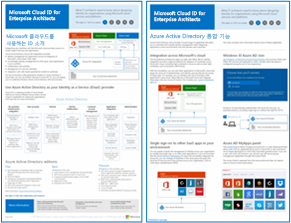
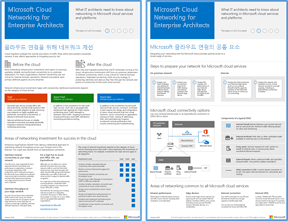
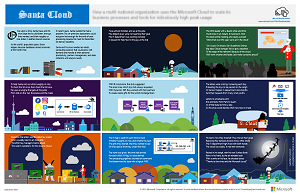
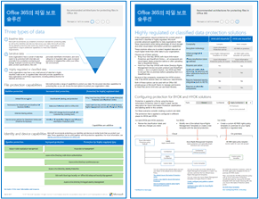

# Microsoft 클라우드 IT 아키텍처 리소스

 **요약:** Microsoft 클라우드 서비스 및 플랫폼에 대해 자세히 알아봅니다. 엔터프라이즈 클라우드 로드맵을 검토하고, 클라우드 아키텍처 시리즈를 살펴봅니다.
  
이러한 아키텍처 도구 및 포스터는 Office 365, Microsoft Azure, Microsoft Intune, Microsoft Dynamics 365, 사설 클라우드 데이터 센터, 하이브리드 온-프레미스 및 클라우드 솔루션을 포함하여 Microsoft 클라우드 서비스 및 플랫폼에 대한 정보를 제공합니다. IT 의사 결정권자와 설계자는 이러한 리소스를 사용하여 작업에 이상적인 솔루션을 결정하고 ID 및 보안과 같은 핵심 인프라 구성 요소에 대한 의사 결정을 내릴 수 있습니다. 
  
- **[Microsoft의 엔터프라이즈 클라우드 로드맵](microsoft-cloud-it-architecture-resources.md#roadmap)** (Sway)
    
- **[Microsoft Cloud for Enterprise Architects 시리즈](microsoft-cloud-it-architecture-resources.md#cloudarch)** 
    - [Microsoft 클라우드 서비스 및 플랫폼 옵션](microsoft-cloud-it-architecture-resources.md#platformoptions)
    - [Microsoft Cloud ID for Enterprise Architects](microsoft-cloud-it-architecture-resources.md#identity)
    - [Microsoft Cloud Security for Enterprise Architects](microsoft-cloud-it-architecture-resources.md#security)
    - [Microsoft Cloud Networking for Enterprise Architects](microsoft-cloud-it-architecture-resources.md#networking)
    - [Microsoft Mobility and Security for Enterprise Architects](microsoft-cloud-it-architecture-resources.md#mobility)
    - [Microsoft Cloud Storage for Enterprise Architects](microsoft-cloud-it-architecture-resources.md#storage)
    - [Microsoft Hybrid Cloud for Enterprise Architects](microsoft-cloud-it-architecture-resources.md#hybrid)
    - [Microsoft 클라우드의 Contoso](microsoft-cloud-it-architecture-resources.md#contoso)
    
- **[Office 365 Enterprise 솔루션 시리즈](microsoft-cloud-it-architecture-resources.md#BKMK_o365solutions)**:
    - [Office 365의 정보 보호 기능](microsoft-cloud-it-architecture-resources.md#BKMK_infoprotect)
    - [Office 365용 ID 및 장치 보호](microsoft-cloud-it-architecture-resources.md#BKMK_O365IDP)
    - [Office 365의 파일 보호 솔루션](microsoft-cloud-it-architecture-resources.md#BKMK_O365fileprotect)
    - [Office 365 클라이언트의 변경 관리](microsoft-cloud-it-architecture-resources.md#changemgmt)
    - [Microsoft와 함께 안전한 최신 데스크톱 배포](microsoft-cloud-it-architecture-resources.md#msd)
    
> [!TIP]
> 이 페이지에 있는 대부분의 포스터는 중국어, 영어, 프랑스어, 독일어, 이탈리아어, 일본어, 한국어, 포르투갈어, 러시아어 및 스페인어 등의 다중 언어로 제공됩니다. 이러한 언어 중 하나로 제공되는 포스터를 다운로드하려면 해당 포스터의 **추가 언어** 링크를 클릭합니다.
  
여러분의 의견을 알려주세요! [cloudadopt@microsoft.com](mailto:cloudadopt@microsoft.com)에 전자 메일을 보내주세요. 
  

## Microsoft의 엔터프라이즈 클라우드 로드맵

업계에서 가장 완벽한 클라우드 솔루션을 설명하는 포스터, 아이콘 집합, 커뮤니티 공간 및 기타 리소스를 참조하세요.
  
|**항목**|**설명**|
|:-----|:-----|
|[          ]((https://aka.ms/cloudarchitecture))   [Microsoft의 엔터프라이즈 클라우드 로드맵]((https://aka.ms/cloudarchitecture))((https://aka.ms/cloudarchitecture))   |이 Sway 환경에서는 업계에서 가장 완벽한 클라우드 솔루션을 설명하는 리소스를 살펴볼 수 있습니다.    |
   

## Microsoft Cloud for Enterprise Architects 시리즈

이러한 클라우드 아키텍처 포스터는 Office 365, Microsoft Azure, Microsoft Intune, Microsoft Dynamics CRM Online, 사설 클라우드 데이터 센터, 하이브리드 온-프레미스 및 클라우드 솔루션을 포함하여 Microsoft 클라우드 서비스 및 플랫폼에 대한정보를 제공합니다. IT 의사 결정권자와 설계자는 이러한 리소스를 사용하여 작업에 이상적인 솔루션을 결정하고 ID 및 보안과 같은 핵심 인프라 구성 요소에 대한 의사 결정을 내릴 수 있습니다.
  

### Microsoft 클라우드 서비스 및 플랫폼 옵션

Microsoft 클라우드 서비스 및 플랫폼 제품 간의 주요 차이점을 알아봅니다. 솔루션에 가장 적합한 플랫폼을 찾아보세요.
  
|**항목**|**설명**|
|:-----|:-----|
|[          ](https://www.microsoft.com/download/details.aspx?id=54432)   [PDF](https://go.microsoft.com/fwlink/p/?LinkId=524731)  \| [Visio](https://go.microsoft.com/fwlink/p/?LinkId=524732)  \| [기타 언어](https://www.microsoft.com/download/details.aspx?id=54432)   | 이 모델에서는 다음을 설명합니다. <ul><li>  Office 365를 포함하는 SaaS(Software as a Service) 제품 </li><li>  Microsoft Azure의 PaaS(Platform as a Service) 기능 </li><li>  Microsoft Azure의 IaaS(Infrastructure as a Service) 기능 </li><li>  Windows Server 및 System Center를 사용하는 사설 클라우드 데이터 센터 기능 </li><li>  Microsoft의 IT 부서에서 이러한 클라우드 서비스로 마이그레이션하고 하이브리드 클라우드를 구축하는 방법을 살펴보세요. </li></ul> |
   

### Microsoft Cloud ID for Enterprise Architects

Microsoft 클라우드 서비스 및 플랫폼을 사용하는 조직용으로 ID를 설계하는 과정과 관련하여 IT 설계자가 파악해야 하는 사항
  
|**항목**|**설명**|
|:-----|:-----|
|[          ](https://www.microsoft.com/download/details.aspx?id=54431)   [PDF](https://go.microsoft.com/fwlink/p/?LinkId=524586)  \| [Visio]((https://download.microsoft.com/download/2/3/8/238228E6-9017-4F6C-BD3C-5559E6708F82/MSFT_cloud_architecture_identity.vsd))           \| [문서]((https://technet.microsoft.com/library/mt613459.aspx))   [기타 언어](https://www.microsoft.com/download/details.aspx?id=54431)   | 이 모델에는 다음이 포함됩니다. <ul><li>Microsoft 클라우드를 사용하는 ID 소개 </li> <li>Azure AD IDaaS 기능 </li><li>온-프레미스 Active Directory 도메인 서비스 계정을 Microsoft Azure Active Directory와 통합 </li> <li>Azure에 디렉터리 구성 요소 추가 </li><li>Azure IaaS의 작업을 위한 도메인 서비스 옵션 </li></ul>  |
   

### Microsoft Cloud Security for Enterprise Architects

Microsoft 클라우드 서비스 및 플랫폼의 보안과 관련하여 IT 설계자가 파악해야 하는 사항
  
|**항목**|**설명**|
|:-----|:-----|
|[          ](https://www.microsoft.com/download/details.aspx?id=48121)   [PDF](https://go.microsoft.com/fwlink/p/?linkid=842070)  \| [Visio](https://go.microsoft.com/fwlink/p/?LinkId=842071)  \| [기타 언어](https://www.microsoft.com/download/details.aspx?id=48121)   | 이 모델에는 다음이 포함됩니다. <ul><li>보안 서비스 및 플랫폼 제공에서 Microsoft의 역할</li><li>보안 위험을 완화하기 위한 고객의 책임</li><li>최상위 보안 인증 </li><li>Microsoft 컨설팅 서비스에서 제공하는 보안 제품 </ul></li>이 아키텍처 포스터를 기준으로 하는 Microsoft Virtual Academy 과정인 [클라우드 사용 세계의 보안](https://mva.microsoft.com/training-courses/security-in-a-cloudenabled-world-12725?l=CfLHobAcB_3904300474)을 이수하세요.  |
   

### Microsoft Cloud Networking for Enterprise Architects

Microsoft 클라우드 서비스 및 플랫폼의 네트워킹과 관련하여 IT 설계자가 파악해야 하는 사항
  
|**항목**|**설명**|
|:-----|:-----|
|[          ](https://www.microsoft.com/download/details.aspx?id=54425)   [PDF](https://go.microsoft.com/fwlink/p/?linkid=842073)  \| [Visio](https://go.microsoft.com/fwlink/p/?linkid=842074)           \| [문서]((https://technet.microsoft.com/library/mt733214.aspx))  [기타 언어](https://www.microsoft.com/download/details.aspx?id=54425)   | 이 모델에는 다음과 같은 페이지가 포함되어 있습니다. <ul><li> **클라우드 연결을 위해 네트워크 개선** 클라우드 마이그레이션으로 인해 회사 네트워크 내부 및 외부의 트래픽 흐름 양과 특성이 달라지고 있습니다. 또한 보안 위험을 완화시키는 방법도 영향을 받고 있습니다.</li><li> **Microsoft 클라우드 연결의 일반 요소** 네트워킹을 Microsoft 클라우드와 통합하면 보다 폭넓은 서비스에 최적 상태로 액세스할 수 있습니다. </li><li> **Microsoft 클라우드 연결의 ExpressRoute** ExpressRoute는 Microsoft 클라우드에 대해 개인, 전용, 고처리량의 네트워크 연결을 제공합니다. </li><li> **Microsoft SaaS에 대한 네트워킹 설계(Office 365, Microsoft Intune 및 Dynamics CRM Online)** Microsoft SaaS 서비스에 대한 네트워크를 최적화하려면 인터넷 에지, 클라이언트 장치 및 일반적인 IT 운영을 신중하게 분석해야 합니다. </li><li> **Azure PaaS에 대한 네트워킹 설계** Azure PaaS 앱용 네트워킹을 최적화하려면 적절한 인터넷 대역폭이 필요하고 여러 사이트 또는 앱 간에 네트워크 트래픽을 분산해야 합니다. </li><li> **Azure IaaS에 대한 네트워킹 설계** 서브넷, 주소 공간, 라우팅, DNS, 부하 분산을 비롯한 서버 기반 IT 워크로드를 호스트하기 위한 최적의 Azure Virtual Network(VNet)와 온-프레미스 네트워크, 기타 VNet 및 인터넷에 대한 연결을 만들기 위한 디자인 프로세스를 안내합니다. </li></ul>   이 아키텍처 포스터를 기준으로 하는 새로운 Microsoft Virtual Academy 과정인 [Microsoft 클라우드 제품을 위한 네트워크 최적화]((https://aka.ms/optimizecloudnetworkingmva))를 이수하세요.   |
   

### Microsoft Mobility and Security for Enterprise Architects

Microsoft 클라우드 서비스 및 플랫폼의 모바일 기능과 관련하여 IT 설계자가 파악해야 하는 사항
  
|**항목**|**설명**|
|:-----|:-----|
|[          ](https://www.microsoft.com/download/details.aspx?id=55023)   [PDF](https://go.microsoft.com/fwlink/p/?linkid=842076)  \| [Visio](https://go.microsoft.com/fwlink/p/?linkid=842077)  \| [기타 언어](https://www.microsoft.com/download/details.aspx?id=55023)   | 이 모델에는 다음이 포함됩니다. <ul><li>비즈니스용 상위 모바일 앱 </li><li>모바일 앱을 개발하기 위한 플랫폼, 서비스 및 리소스 </li><li>모바일 장치에서 클라우드 기반 응용 프로그램 및 데이터에 대한 액세스 관리 </li><li>Office 365 MDM, Azure Active Directory Premium 및 Intune의 기능 및 플랫폼 지원 비교 </li></ul>  |
   

### Microsoft Cloud Storage for Enterprise Architects

Microsoft 클라우드 서비스 및 플랫폼의 저장소 옵션과 관련하여 IT 설계자가 파악해야 하는 사항
  
|**항목**|**설명**|
|:-----|:-----|
|[          ](https://www.microsoft.com/download/details.aspx?id=49552)   [PDF](https://go.microsoft.com/fwlink/p/?linkid=842079)  \| [Visio](https://go.microsoft.com/fwlink/p/?linkid=842080)           \| [문서](hhttps://technet.microsoft.com/library/mt842597.aspx)  [기타 언어](https://www.microsoft.com/download/details.aspx?id=49552)   | 이 모델에는 다음이 포함됩니다. <ul><li>클라우드 저장소 및 주요 시나리오를 사용하는 이유 </li><li>기존 서비스와 함께 포함된 클라우드 저장소 옵션 </li><li>저장소 솔루션의 시작 위치로 사용할 수 있는 저장소 옵션 </li><li>저장소 문서 블록을 사용하여 자체 저장소 솔루션 또는 앱용 저장소 만들기</li></ul> |
   

### Microsoft Hybrid Cloud for Enterprise Architects

Microsoft 서비스 및 플랫폼용 하이브리드 클라우드와 관련하여 IT 설계자가 파악해야 하는 사항
  
|**항목**|**설명**|
|:-----|:-----|
|[          ](https://www.microsoft.com/download/details.aspx?id=54424)   [PDF](https://go.microsoft.com/fwlink/p/?linkid=842082)  \| [Visio](https://go.microsoft.com/fwlink/p/?linkid=842083)           \| [문서]((https://technet.microsoft.com/library/mt750500.aspx))  [기타 언어](https://www.microsoft.com/download/details.aspx?id=54424)   | 이 모델에는 다음과 같은 페이지가 포함되어 있습니다. <ul><li> **하이브리드 클라우드 개요** Microsoft의 클라우드 서비스(SaaS, Azure PaaS 및 IaaS Azure) 및 공통 요소 </li><li> **Microsoft 하이브리드 클라우드 시나리오의 아키텍처** 온-프레미스 인프라, 네트워킹 및 ID의 일반 계층을 보여 주는 Microsoft의 클라우드 서비스용 하이브리드 클라우드의 아키텍처 다이어그램 </li><li> **Microsoft SaaS에 대한 하이브리드 클라우드 시나리오(Office 365)** 비즈니스용 Skype, SharePoint Server 및 Exchange Server에 대한 SaaS 하이브리드 시나리오 아키텍처와 설명 </li><li> **Azure PaaS에 대한 하이브리드 클라우드 시나리오** Azure PaaS 하이브리드 시나리오 아키텍처, Azure PaaS 하이브리드 응용 프로그램에 대한 설명과 예제, SQL Server 2016 Stretch Database에 대한 설명 </li><li> **Azure IaaS에 대한 하이브리드 클라우드 시나리오** Azure IaaS 하이브리드 시나리오 아키텍처와 Azure IaaS에서 호스트되는 LOB(기간 업무) 응용 프로그램에 대한 설명 </li></ul> |
   

### Microsoft 클라우드의 Contoso

가상의 대표적 글로벌 조직이 Office 365, Azure, Dynamics 365, Intune 등을 비롯한 Microsoft의 클라우드 서비스를 구현한 방법
  
|**항목**|**설명**|
|:-----|:-----|
|[          ](https://www.microsoft.com/download/details.aspx?id=54427)   [PDF](https://go.microsoft.com/fwlink/p/?linkid=842085)  \| [Visio](https://go.microsoft.com/fwlink/p/?linkid=842086)           \| [문서]((https://technet.microsoft.com/library/mt775341.aspx))  [기타 언어](https://www.microsoft.com/download/details.aspx?id=54427)   |이 모델에는 다음이 포함됩니다. <ul><li>Contoso Corporation 개요 </li><li>Contoso의 IT 인프라 및 요구 사항 </li><li>Contoso용 클라우드 네트워킹</li><li>Contoso용 클라우드 ID</li><li>구독, 라이선스 및 사용자 계정</li><li>Contoso용 클라우드 보안</li><li>Contoso용 Enterprise 클라우드 시나리오 </li></ul>  |
   

### 산타 클라우드

산타와 그의 요정들이 Microsoft의 클라우드 서비스를 사용하여 매년 선물을 배달하는 방법이 나와 있습니다.
  
|**항목**|**설명**|
|:-----|:-----|
|[          ](https://www.microsoft.com/download/details.aspx?id=55039)   [PDF](https://go.microsoft.com/fwlink/p/?linkid=842088)   |말썽꾸러기와 착한 아이를 결정하고 12월 24일에 배달한 선물을 확인하기 위해 산타클로스와 요정 IT 부서는 Office 365, Azure, Dynamics 365 및 Intune을 사용합니다.   |
   

## Office 365 Enterprise 솔루션 시리즈

Office 365 Enterprise 솔루션 시리즈는 Office 365의 기능을 구현하기 위한 지침을 기술 중심으로 설명합니다.
  

### Office 365의 정보 보호 기능

회사 자산 보호를 위한 엔터프라이즈 조직의 기능
  
|**항목**|**설명**|
|:-----|:-----|
|[          ](https://www.microsoft.com/download/details.aspx?id=54429)   [PDF]((http://download.microsoft.com/download/2/3/D/23D91386-8349-4F7A-9470-FD5AED861F16/MSFT_cloud_architecture_informationprotection.pdf))  \| [Visio]((http://download.microsoft.com/download/2/3/D/23D91386-8349-4F7A-9470-FD5AED861F16/MSFT_cloud_architecture_informationprotection.vsd))  \| [기타 언어](https://www.microsoft.com/download/details.aspx?id=54429)   |Microsoft는 회사 자산을 보호하기 위한 가장 완벽한 기능 집합을 제공합니다. 기능을 구현할 때 이 모델은 조직의 체계적인 방법 실행에 도움이 됩니다.   |
   

### Office 365용 ID 및 장치 보호

Azure AD 응용프로그램 프록시를 사용하여 게시한 온-프레미스 응용 프로그램, Office 365 및 다른 SaaS 서비스에 액세스하는 ID 및 장치를 보호하기 위해 권장되는 기능입니다.
  
|**항목**|**설명**|
|:-----|:-----|
|[          ](https://www.microsoft.com/download/details.aspx?id=55032)   [PDF](https://go.microsoft.com/fwlink/p/?linkid=841656)  \| [Visio](https://go.microsoft.com/fwlink/p/?linkid=841657)  \| [기타 언어](https://www.microsoft.com/download/details.aspx?id=55032)   |데이터, ID 및 장치 전반에 걸쳐 일관된 보호 수준을 사용하는 것이 중요합니다. 이 문서에서 ID와 장치를 보호하는 기능에 대한 자세한 정보를 비교할 수 있습니다.    |
   

### Office 365의 파일 보호 솔루션

세 가지 다른 민감도 수준에 따라 Office 365에서 파일을 보호하기 위해 권장되는 기능입니다.
  
|**항목**|**설명**|
|:-----|:-----|
|[          ](https://www.microsoft.com/download/details.aspx?id=55523)   [PDF](http://download.microsoft.com/download/7/8/9/789645A5-BD10-4541-BC33-F8D1EFF5E911/MSFT_cloud_architecture_O365 file protection.pdf)  \| [Visio]((http://download.microsoft.com/download/7/8/9/789645A5-BD10-4541-BC33-F8D1EFF5E911/MSFT_cloud_architecture_O365%20file%20protection.vsdx))   |데이터, ID 및 장치 전반에 걸쳐 일관된 보호 수준을 사용하는 것이 중요합니다. 이 문서에는 Office 365의 파일을 보호하는 기능에 대한 자세한 정보가 비교되어 있습니다.    |
   

### Office 365 클라이언트의 변경 관리

Office 365 클라이언트 응용 프로그램 및 Windows 10용 릴리스 관리와 관련하여 IT 설계자가 파악해야 하는 사항 
  
|**항목**|**설명**|
|:-----|:-----|
|[          ](https://www.microsoft.com/download/details.aspx?id=49141)   [PDF](https://go.microsoft.com/fwlink/p/?LinkId=626681)  \| [Visio](https://go.microsoft.com/fwlink/p/?LinkId=626680)           \| [문서]((https://technet.microsoft.com/library/mt584223.aspx))  [기타 언어](https://www.microsoft.com/download/details.aspx?id=49141)   | 이 모델에는 다음이 포함됩니다. <ul><li>Windows 10 및 Office 365 클라이언트 응용 프로그램용 서비스 모델 </li><li>  릴리스 옵션 </li><li>  릴리스 흐름 </li><li>  변경 유형 </li><li>  역할 및 책임 </li><li>  업데이트 배포 관리 </li></ul>   문서 양식의 정보 보기: [Office 365 클라이언트의 변경 사항 관리]((http://technet.microsoft.com/library/815fa1aa-0355-40b5-b7bc-cdf7d4610062.aspx))    |
   

### Microsoft와 함께 안전한 최신 데스크톱 배포

IT 개발자는 Windows 10에 Office 365 ProPlus 업데이트를 배포하고 관리하는 방법을 알아야 합니다.
  
|**항목**|**설명**|
|:-----|:-----|
|[          ](https://www.microsoft.com/download/details.aspx?id=55987)   [PDF]((http://download.microsoft.com/download/4/E/9/4E90E227-770A-41D1-99FE-925A64D81A55/MSFT_modern_secure_desktop.pdf))  \| [Visio]((http://download.microsoft.com/download/4/E/9/4E90E227-770A-41D1-99FE-925A64D81A55/MSFT_modern_secure_desktop.vsdx))   | 이 모델에는 다음이 포함됩니다. <ul><li>  Microsoft 클라우드에서 Windows 10 및 Office ProPlus 배포 </li><li>  System Center Configuration Manager를 사용하여 Windows 10 및 Office ProPlus 배포 </li><li>  Microsoft 클라우드에서 Windows 10 및 Office ProPlus 업데이트 관리 </li><li>  System Center Configuration Manager를 사용하여 Windows 10 및 Office ProPlus 업데이트 관리 </li><li>  Windows 10의 기본 및 추가 보호 기능 </li></ul>  |
   
## 참고 항목

[Exchange, SharePoint, 비즈니스용 Skype 및 Lync에 대한 아키텍처 모델](architectural-models-for-sharepoint-exchange-skype-for-business-and-lync.md)
  
[클라우드 도입 TLG(테스트 랩 가이드)](cloud-adoption-test-lab-guides-tlgs.md)
  
[보안 솔루션](security-solutions.md)
  
[하이브리드 솔루션](hybrid-solutions.md)

