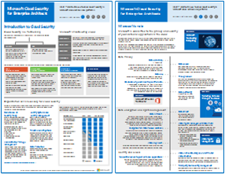
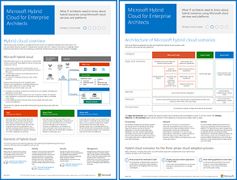
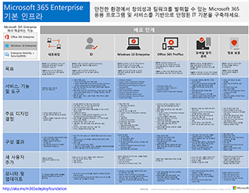
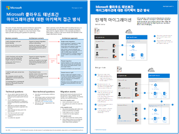
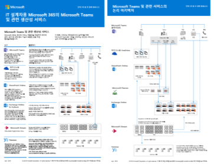
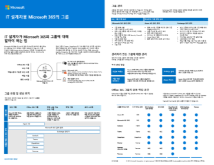
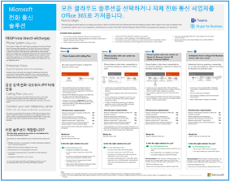

# Microsoft 클라우드 IT 아키텍처 리소스

이러한 아키텍처 도구 및 포스터는 Microsoft 365, Windows 10, Azure Active Directory, Microsoft Intune, Microsoft Dynamics 365, 하이브리드 온-프레미스 및 클라우드 솔루션을 비롯한 Microsoft 클라우드 서비스에 대한 정보를 제공합니다. IT 의사 결정권자와 설계자는 이러한 리소스를 사용하여 작업에 이상적인 솔루션을 결정하고 ID 및 보안과 같은 핵심 인프라 구성 요소에 대한 의사 결정을 내릴 수 있습니다. 
  
<!--**[Microsoft's Enterprise Cloud Roadmap](microsoft-cloud-it-architecture-resources.md#roadmap)** (Sway) -->
    
- **[Microsoft Cloud for Enterprise Architects 시리즈](microsoft-cloud-it-architecture-resources.md#cloudarch)** 
    <!-- [Microsoft Cloud Services and Platform Options](microsoft-cloud-it-architecture-resources.md#platformoptions) -->
    - [Microsoft Cloud Identity for Enterprise Architects](microsoft-cloud-it-architecture-resources.md#identity)
    - [Microsoft Cloud Security for Enterprise Architects](microsoft-cloud-it-architecture-resources.md#security)
    - [Microsoft Cloud Networking for Enterprise Architects](microsoft-cloud-it-architecture-resources.md#networking)
    - [Microsoft Hybrid Cloud for Enterprise Architects](microsoft-cloud-it-architecture-resources.md#hybrid)
    - [일반적인 공격 및 조직을 보호하는 Microsoft 기능](#common-attacks-and-microsoft-capabilities-that-protect-your-organization)
    - [Microsoft 365 Enterprise 기본 인프라](#m365foundationinfra)
    - [Microsoft 클라우드 테넌트간 마이그레이션에 대한 아키텍처 접근 방식](#architecture-approaches-for-microsoft-cloud-tenant-to-tenant-migrations)
    
- **[Microsoft 365 Enterprise 솔루션 시리즈](microsoft-cloud-it-architecture-resources.md#BKMK_o365solutions)**:
    - [IT 설계자용 Microsoft 365의 Microsoft Teams 및 관련 생산성 서비스](#microsoft-teams-and-related-productivity-services-in-microsoft-365-for-it-architects)
    - [IT 설계자용 Microsoft 365의 그룹](#groups-in-microsoft-365-for-it-architects)
    - [다중 영역 조직에 대한 보안 및 정보 보호](#security-and-information-protection-for-multi-region-organizations)
    - [Office 365용 ID 및 디바이스 보호](microsoft-cloud-it-architecture-resources.md#BKMK_O365IDP)
    - [Office 365의 파일 보호 솔루션](microsoft-cloud-it-architecture-resources.md#BKMK_O365fileprotect)
    - [GDPR에 대한 Office 365 정보 보호](#office-365-information-protection-for-gdpr)
    - [정치적 캠페인, 비영리 조직 및 기타 기밀 조직에 대한 Microsoft 보안 지침](#microsoft-security-guidance-for-political-campaigns-nonprofits-and-other-agile-organizations)
    - [Microsoft 전화 통신 솔루션](#microsoft-telephony-solutions) 
    
여러분의 의견을 알려주세요! [cloudadopt@microsoft.com](mailto:cloudadopt@microsoft.com)에 전자 메일을 보내주세요. 

<!--

## Microsoft's Enterprise Cloud Roadmap

See the posters, icon sets, community venues, and other resources that describe the industry's most complete cloud solution.
  
|**Item**|**Description**|
|:-----|:-----|
|[          ](https://aka.ms/cloudarchitecture)   [Microsoft's Enterprise Cloud Roadmap](https://aka.ms/cloudarchitecture) (https://aka.ms/cloudarchitecture)   |Swipe through this Sway experience for the resources that describe the industry's most complete cloud solution.    |
-->
  

## Microsoft Cloud for Enterprise Architects 시리즈

이러한 클라우드 아키텍처 포스터는 Microsoft 365, Azure Active Directory, Microsoft Intune, Microsoft Dynamics CRM Online, 하이브리드 온-프레미스 및 클라우드 솔루션을 비롯한 Microsoft 클라우드 서비스에 대한 정보를 제공합니다. IT 의사 결정권자와 설계자는 이러한 리소스를 사용하여 작업에 이상적인 솔루션을 결정하고 ID 및 보안과 같은 핵심 인프라 구성 요소에 대한 의사 결정을 내릴 수 있습니다.

<!--  

### Microsoft Cloud Services and Platform Options

Learn key differences between Microsoft cloud services and platform offerings. Find the best fit for your solution.
  
|**Item**|**Description**|
|:-----|:-----|
|[          ](https://www.microsoft.com/download/details.aspx?id=54432)   [PDF](https://go.microsoft.com/fwlink/p/?LinkId=524731)  \| [Visio](https://go.microsoft.com/fwlink/p/?LinkId=524732)  \| [More languages](https://www.microsoft.com/download/details.aspx?id=54432)   | This model describes: <ul><li>  Software as a Service (SaaS) offerings, including Microsoft 365 </li><li>  Platform as a Service (PaaS) features in Microsoft Azure </li><li>  Infrastructure as a Service (IaaS) features in Microsoft Azure </li><li>  Private cloud datacenter capabilities using Windows Server and System Center </li><li>  Learn how Microsoft's own IT department is migrating to these cloud services and building its hybrid cloud. </li></ul> |
-->

   

### Microsoft Cloud Identity for Enterprise Architects

Microsoft 클라우드 서비스 및 플랫폼을 사용하는 조직용으로 ID를 설계하는 과정과 관련하여 IT 설계자가 파악해야 하는 사항
  
|**항목**|**설명**|
|:-----|:-----|
|[          ](https://www.microsoft.com/download/details.aspx?id=54431)   [PDF](https://go.microsoft.com/fwlink/p/?LinkId=524586)  \| [Visio](https://download.microsoft.com/download/2/3/8/238228E6-9017-4F6C-BD3C-5559E6708F82/MSFT_cloud_architecture_identity.vsd)           \| [추가 언어](https://www.microsoft.com/download/details.aspx?id=54431)   | 이 모델에는 다음이 포함됩니다. <ul><li>Microsoft 클라우드를 사용하는 ID 소개 </li><li>Azure AD IDaaS 기능 </li><li>온-프레미스 Active Directory 도메인 서비스 계정을 Microsoft Azure Active Directory와 통합 </li><li>Azure에 디렉터리 구성 요소 추가 </li><li>Azure IaaS의 작업을 위한 도메인 서비스 옵션 </li></ul> |
   

### Microsoft Cloud Security for Enterprise Architects

Microsoft 클라우드 서비스 및 플랫폼의 보안과 관련하여 IT 설계자가 파악해야 하는 사항
  
|**항목**|**설명**|
|:-----|:-----|
|[          ](https://www.microsoft.com/download/details.aspx?id=48121)   [PDF](https://go.microsoft.com/fwlink/p/?linkid=842070)  \| [Visio](https://go.microsoft.com/fwlink/p/?LinkId=842071)  \| [추가 언어](https://www.microsoft.com/download/details.aspx?id=48121)   | 이 모델에는 다음이 포함됩니다. <ul><li>보안 서비스 및 플랫폼 제공에서 Microsoft의 역할</li><li>보안 위험을 완화하기 위한 고객의 책임</li><li>최상위 보안 인증 </li><li>Microsoft 컨설팅 서비스에서 제공하는 보안 제품 </ul> |
   

### Microsoft Cloud Networking for Enterprise Architects

Microsoft 클라우드 서비스 및 플랫폼의 네트워킹과 관련하여 IT 설계자가 파악해야 하는 사항
  
|**항목**|**설명**|
|:-----|:-----|
|   [PDF](downloads/MSFT_cloud_architecture_networking.pdf)  \| [Visio](https://github.com/MicrosoftDocs/OfficeDocs-Enterprise/raw/live/Enterprise/downloads/MSFT_cloud_architecture_networking.vsdx)   | 이 모델에는 다음이 포함됩니다. <ul><li> 클라우드 연결을 위해 네트워크 확장 </li><li> Microsoft 클라우드 연결의 공통 요소 </li><li> Microsoft 클라우드 연결을 위한 ExpressRoute </li><li> Microsoft SaaS, Azure PaaS, Azure IaaS를 위한 네트워킹 디자인 </li></ul>    |

### Microsoft Hybrid Cloud for Enterprise Architects

Microsoft 서비스 및 플랫폼용 하이브리드 클라우드와 관련하여 IT 설계자가 파악해야 하는 사항
  
|**항목**|**설명**|
|:-----|:-----|
|   [PDF](downloads/MSFT_cloud_architecture_hybrid.pdf)  \| [Visio](https://github.com/MicrosoftDocs/OfficeDocs-Enterprise/raw/live/Enterprise/downloads/MSFT_cloud_architecture_hybrid.vsdx)  | 이 모델에는 다음이 포함됩니다. <ul><li> Microsoft 클라우드 서비스(SaaS, Azure PaaS, Azure IaaS) 및 공통 요소 </li><li> Microsoft 클라우드 서비스를 위한 하이브리드 클라우드 아키텍처 </li><li> Microsoft SaaS(Microsoft 365), Azure PaaS, Azure IaaS를 위한 하이브리드 클라우드 시나리오 </li></ul> |
   

### 일반적인 공격 및 조직을 보호하는 Microsoft 기능
가장 일반적인 사이버 공격과 Microsoft가 모든 공격 단계에서 조직을 지원하는 방식을 자세히 알아봅니다. 

|**항목**|**설명**|
|:-----|:-----|
|   [PDF](https://download.microsoft.com/download/F/A/C/FACFC1E9-FA35-4DF1-943C-8D4237B4275B/MSFT_Cloud_architecture_security_commonattacks.pdf) \| [Visio](https://download.microsoft.com/download/F/A/C/FACFC1E9-FA35-4DF1-943C-8D4237B4275B/MSFT_Cloud_architecture_security_commonattacks.vsdx)   | 이 포스터에서는 일반적인 공격의 경로를 보여 주고, 각 공격 단계에서 공격자를 중지하는 데 도움이 되는 기능에 대해 설명합니다.  |

### Microsoft 365 Enterprise 기본 인프라

배포를 시작하려면 Microsoft 365 Enterprise의 [기본 인프라](https://docs.microsoft.com/microsoft-365/enterprise/deploy-foundation-infrastructure)에 대한 간략한 보기를 확인하세요.
  
|**항목**|**설명**|
|:-----|:-----|
|   [온라인으로](https://aka.ms/m365efoundinfraposter) \| [PDF 보기](https://github.com/MicrosoftDocs/microsoft-365-docs/raw/public/microsoft-365/media/deploy-foundation-infrastructure/Microsoft365EnterpriseFoundInfra.pdf)   | 이 포스터는 목표, 기능 및 도구, 디자인 결정, 구성 결과, 온 보딩, 지속적인 모니터링 및 업데이트 측면에서 기초 인프라의 각 단계를 요약합니다.  | 

### Microsoft 클라우드 테넌트간 마이그레이션에 대한 아키텍처 접근 방식 
이 시리즈에서는 합병, 인수, 매각 및 기타 시나리오를 통해 새로운 클라우드 테넌트로 마이그레이션 할 수 있는 몇 가지 아키텍처 접근 방식에 대해 설명합니다. 이 항목에는 계획을 위한 시작점 지침을 제공합니다.

|**항목**|**설명**|
|:-----|:-----|
|   [PDF](downloads/Microsoft-365-tenant-to-tenant-migration.pdf) \| [Visio](https://github.com/MicrosoftDocs/OfficeDocs-Enterprise/raw/live/Enterprise/downloads/Microsoft-365-tenant-to-tenant-migration.vsdx)     |이 모델에는 다음이 포함됩니다. <ul><li>아키텍처 접근 방식에 대한 비즈니스 시나리오 매핑</li><li>디자인 고려 사항</li><li>단일 이벤트 마이그레이션 흐름</li><li>단계적 마이그레이션 흐름</li><li>테넌트 이동 또는 분할 흐름</li></ul>|

## Microsoft 365 Enterprise 솔루션 시리즈

Microsoft 365 Enterprise 솔루션 시리즈는 Microsoft 365의 기능을 구현하기 위한 지침을 기술 중심으로 설명합니다.

### IT 설계자용 Microsoft 365의 Microsoft Teams 및 관련 생산성 서비스
Microsoft Teams로 시장을 선도하는 Microsoft 365 생산성 서비스의 논리적 아키텍처입니다.

|**항목**|**설명**|
|:-----|:-----|
|   [PDF](downloads/msft-m365-teams-logical-architecture.pdf) \| [Visio](https://github.com/MicrosoftDocs/OfficeDocs-Enterprise/raw/live/Enterprise/downloads/msft-m365-teams-logical-architecture.vsdx)     |Microsoft는 생산성 서비스 제품군을 제공하여 데이터 관리, 보안 및 규정 준수 기능이 포함된 공동 작업 환경을 제공합니다.    이 일러스트레이션 시리즈는 엔터프라이즈 설계자를 위해 Microsoft Teams로 시장을 선도하는 생산성 서비스의 논리 아키텍처를 보여줍니다.|

### IT 설계자용 Microsoft 365의 그룹
IT 설계자가 Microsoft 365의 그룹에 대해 알아야 하는 점

|**항목**|**설명**|
|:-----|:-----|
|   [PDF](downloads/msft-m365-groups.pdf) \| [Visio](https://github.com/MicrosoftDocs/OfficeDocs-Enterprise/raw/live/Enterprise/downloads/msft-m365-groups.vsdx) |이러한 일러스트레이션은 다양한 그룹의 종류, 그룹을 만들고 관리하는 방법, 몇 가지 관리 권장 사항에 대해 자세한 설명을 제공합니다.|

### 다중 영역 조직에 대한 보안 및 정보 보호
단일 Microsoft 365 테넌트가 있는 다중 영역 조직에 대한 보안 및 정보 보호

|**항목**|**설명**|
|:-----|:-----|
|   [PDF](https://github.com/MicrosoftDocs/microsoft-365-docs/raw/public/microsoft-365/downloads/msft-security-info-protect-multi-region.pdf) \| [Visio](https://github.com/MicrosoftDocs/microsoft-365-docs/raw/public/microsoft-365/downloads/msft-security-info-protect-multi-region.vsdx) |글로벌 조직에 단일 Microsoft 365 테넌트의 사용은 많은 이유로 최선의 선택과 경험이 될 것입니다. 하지만 많은 설계자들이 다양한 영역에 걸쳐 보안 및 정보 보호 목적을 충족하기 위한 방법을 고심하고 있습니다. 이 항목의 집합은 권장 사항을 제공합니다. |

   

### Office 365용 ID 및 장치 보호

Azure AD 애플리케이션 프록시를 사용하여 게시한 온-프레미스 응용 프로그램, Office 365 및 다른 SaaS 서비스에 액세스하는 ID 및 디바이스를 보호하기 위해 권장되는 기능입니다.
  
|**항목**|**설명**|
|:-----|:-----|
|[          ](https://www.microsoft.com/download/details.aspx?id=55032)   [PDF](https://go.microsoft.com/fwlink/p/?linkid=841656)  \| [Visio](https://go.microsoft.com/fwlink/p/?linkid=841657)  \| [추가 언어](https://www.microsoft.com/download/details.aspx?id=55032)   |데이터, ID 및 장치 전반에 걸쳐 일관된 보호 수준을 사용하는 것이 중요합니다. 이 문서에서 ID와 장치를 보호하는 기능에 대한 자세한 정보를 비교할 수 있습니다.    |
   

### Office 365의 파일 보호 솔루션

세 가지 다른 민감도 수준에 따라 Office 365에서 파일을 보호하기 위해 권장되는 기능입니다.
  
|**항목**|**설명**|
|:-----|:-----|
|[          ](https://www.microsoft.com/download/details.aspx?id=55523)   [PDF](https://go.microsoft.com/fwlink/?linkid=2004320)  \| [Visio](https://download.microsoft.com/download/7/8/9/789645A5-BD10-4541-BC33-F8D1EFF5E911/MSFT_cloud_architecture_O365%20file%20protection.vsdx)   |데이터, ID 및 장치 전반에 걸쳐 일관된 보호 수준을 사용하는 것이 중요합니다. 이 문서에는 Office 365의 파일을 보호하는 기능에 대한 자세한 정보가 비교되어 있습니다.    |
   

### GDPR에 대한 Office 365 정보 보호

개인 데이터를 검색, 분류, 보호 및 모니터링하기 위한 규정된 권장 사항. 이 솔루션에서는 GDPR(일반 데이터 보호 규정)을 예제로 사용하지만, 동일한 프로세스를 적용하여 여러 다른 규정을 준수할 수 있습니다.

|**항목**|**설명**|
|:-----|:-----|
|    [PDF](https://download.microsoft.com/download/E/C/D/ECD5A339-EF10-4420-B3A9-99098884D716/MSFT_Cloud_architecture_information%20protection%20for%20GDPR.pdf) \| [Visio](https://download.microsoft.com/download/E/C/D/ECD5A339-EF10-4420-B3A9-99098884D716/MSFT_Cloud_architecture_information%20protection%20for%20GDPR.vsdx)    |기사 형식으로이 콘텐츠를 보려면 [ GDPR에 대한 Office 365 정보 보호](https://docs.microsoft.com/Office365/SecurityCompliance/office-365-information-protection-for-gdpr)를 참조하십시오.      |

### 정치적 캠페인, 비영리 조직 및 기타 기밀 조직에 대한 Microsoft 보안 지침 

이 지침은 보안 클라우드 환경을 구현하는 방법에 대해 설명합니다. 이 솔루션 지침을 어떤 조직에서도 사용할 수 있습니다. 이 지침은 BYOD 액세스 및 게스트 계정을 가진 기밀 조직에 도움이 되는 내용을 포함합니다. 이 지침을 자신의 환경 설계를 위한 시작점으로 사용할 수 있습니다. 

|**항목**|**설명**|
|:-----|:-----|
|**정치적 캠페인을 위한 Microsoft 보안 지침**   [          ](https://download.microsoft.com/download/B/4/D/B4D520C3-4D0C-4B4D-BFB9-09F0651C2775/MSFT_Cloud_architecture_security%20for%20political%20campaigns.pdf)   [PDF](https://download.microsoft.com/download/B/4/D/B4D520C3-4D0C-4B4D-BFB9-09F0651C2775/MSFT_Cloud_architecture_security%20for%20political%20campaigns.pdf)  \| [Visio](https://download.microsoft.com/download/B/4/D/B4D520C3-4D0C-4B4D-BFB9-09F0651C2775/MSFT_Cloud_architecture_security%20for%20political%20campaigns.vsdx)   |이 지침에서는 정치적 캠페인 조직을 보기로 사용합니다. 이 지침을 어떤 환경에 대해서도 시작점으로 사용할 수 있습니다.    |
|**비영리 조직을 위한 Microsoft 보안 지침**   [          ](https://download.microsoft.com/download/9/4/3/94389612-C679-4061-8DF2-D9A15D72B65F/Microsoft_Cloud%20Architecture_Security%20for%20Nonprofits.pdf)   [PDF](https://download.microsoft.com/download/9/4/3/94389612-C679-4061-8DF2-D9A15D72B65F/Microsoft_Cloud%20Architecture_Security%20for%20Nonprofits.pdf)  \| [Visio](https://download.microsoft.com/download/9/4/3/94389612-C679-4061-8DF2-D9A15D72B65F/Microsoft_Cloud%20Architecture_Security%20for%20Nonprofits.vsdx)   |이 지침은 비영리 조직을 위해 약간 수정하였습니다. 예를 들어 Office 365 비영리 조직 계획을 참조합니다. 기술 지침은 정치적 캠페인 솔루션 가이드와 같습니다.    |

이 지침에는 테스트 랩 가이드가 포함됩니다. 자세한 내용은 [정치 캠페인, 비영리 단체 및 기타 민첩한 조직을위한 Microsoft 보안 지침](https://docs.microsoft.com/Office365/SecurityCompliance/microsoft-security-guidance-for-political-campaigns-nonprofits-and-other-agile-o)을 참조하십시오.

### Microsoft 전화 통신 솔루션

Microsoft는 Microsoft 클라우드에서 팀을 처음 경험할 때 몇 가지 옵션을 지원합니다. 이 포스터는 조직의 사용자에게 적합한 Microsoft 전화 솔루션 (클라우드의 전화 시스템 또는 Enterprise Voice 온프레미스)을 결정하고 조직이 공중 전환 전화 네트워크(PSTN)에 연결하는 방법을 결정하는 데 도움이됩니다.

  
[PDF](https://github.com/MicrosoftDocs/OfficeDocs-SkypeForBusiness/blob/live/Teams/downloads/telephony-solutions/microsoft-telephony-solutions-12-18.pdf) | [Visio](https://github.com/MicrosoftDocs/OfficeDocs-SkypeForBusiness/blob/live/Teams/downloads/telephony-solutions/microsoft-telephony-solutions-12-18.vsdx) 

자세한 내용은이 포스터에 대한 문서인 [Microsoft 전화 통신 솔루션](https://docs.microsoft.com/SkypeForBusiness/hybrid/msft-telephony-solutions)을 참조하세요.
  
## 참고 항목

[Exchange, SharePoint, 비즈니스용 Skype 및 Lync에 대한 아키텍처 모델](architectural-models-for-sharepoint-exchange-skype-for-business-and-lync.md)
  
[엔터프라이증용 Microsoft 365 테스트 랩 가이드](https://docs.microsoft.com/microsoft-365/enterprise/m365-enterprise-test-lab-guides)
  
[하이브리드 솔루션](hybrid-solutions.md)

