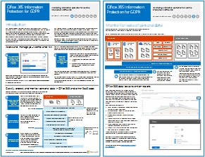

# Microsoft 클라우드 IT 아키텍처 리소스Microsoft cloud IT architecture resources

 **요약:** Microsoft ID, 보안, 네트워킹 및 하이브리드에 대한 핵심 클라우드 아키텍처 개념을 알아봅니다. Microsoft 클라우드를 사용할 때 파일, ID 및 디바이스를 보호하기 위한 규범 권장 사항을 검토합니다. Windows 10 및 Office ProPlus가 포함된 안전한 최신 데스크톱을 배포하는 방법을 알아봅니다.**Summary:** Learn core cloud architecture concepts for Microsoft identity, security, networking, and hybrid. Review prescriptive recommendations for protecting files, identities, and devices when using Microsoft's cloud. Learn how to deploy a modern and secure desktop with Windows 10 and Office ProPlus.
  
이러한 아키텍처 도구 및 포스터는 Office 365, Windows 10, Azure Active Directory, Microsoft Intune, Microsoft Dynamics 365, 하이브리드 온-프레미스 및 클라우드 솔루션을 포함하여 Microsoft 클라우드 서비스 및 플랫폼에 대한 정보를 제공합니다. IT 의사 결정권자와 설계자는 이러한 리소스를 사용하여 작업에 이상적인 솔루션을 결정하고 ID 및 보안과 같은 핵심 인프라 구성 요소에 대한 의사 결정을 내릴 수 있습니다.These architecture tools and posters give you information about Microsoft cloud services, including Office 365, Windows 10, Azure Active Directory, Microsoft Intune, Microsoft Dynamics 365, and hybrid on-premises and cloud solutions. IT decision makers and architects can use these resources to determine the ideal solutions for their workloads and to make decisions about core infrastructure components such as identity and security. 
  
<!--**[Microsoft's Enterprise Cloud Roadmap](microsoft-cloud-it-architecture-resources.md#roadmap)** (Sway) -->
    
- **[Microsoft Cloud for Enterprise Architects 시리즈](microsoft-cloud-it-architecture-resources.md#cloudarch)** 
    **[Microsoft cloud for enterprise architects series](microsoft-cloud-it-architecture-resources.md#cloudarch)** 
  <!-- [Microsoft Cloud Services and Platform Options](microsoft-cloud-it-architecture-resources.md#platformoptions) -->
    - [Microsoft Cloud Identity for Enterprise ArchitectsMicrosoft cloud identity for enterprise architects](microsoft-cloud-it-architecture-resources.md#identity)
    - [Microsoft Cloud Security for Enterprise ArchitectsMicrosoft cloud security for enterprise architects](microsoft-cloud-it-architecture-resources.md#security)
    - [Microsoft Cloud Networking for Enterprise ArchitectsMicrosoft cloud networking for enterprise architects](microsoft-cloud-it-architecture-resources.md#networking)
    - [Microsoft Hybrid Cloud for Enterprise ArchitectsMicrosoft hybrid cloud for enterprise architects](microsoft-cloud-it-architecture-resources.md#hybrid)
    - [일반적인 공격 및 조직을 보호하는 Microsoft 기능Common attacks and Microsoft capabilities that protect your organization](#common-attacks-and-microsoft-capabilities-that-protect-your-organization)
    
- **[Microsoft 365 Enterprise 솔루션 시리즈](microsoft-cloud-it-architecture-resources.md#BKMK_o365solutions)**:**[Microsoft 365 enterprise solution series](microsoft-cloud-it-architecture-resources.md#BKMK_o365solutions)**:
    - [IT 설계자용 Microsoft 365의 Microsoft Teams 및 관련 생산성 서비스Microsoft Teams and related productivity services in Microsoft 365 for IT architects](#microsoft-teams-and-related-productivity-services-in-microsoft-365-for-it-architects)
    - [IT 설계자용 Microsoft 365의 그룹Groups in Microsoft 365 for IT architects](#groups-in-microsoft-365-for-it-architects)
    - [Office 365용 ID 및 디바이스 보호Identity and device protection for Office 365](microsoft-cloud-it-architecture-resources.md#BKMK_O365IDP)
    - [Office 365의 파일 보호 솔루션File protection solutions in Office 365](microsoft-cloud-it-architecture-resources.md#BKMK_O365fileprotect)
    - [GDPR에 대한 Office 365 정보 보호Office 365 Information Protection for GDPR](#office-365-information-protection-for-gdpr)
    - [정치적 캠페인, 비영리 조직 및 기타 기밀 조직에 대한 Microsoft 보안 지침Microsoft Security Guidance for Political Campaigns, Nonprofits, and Other Agile Organizations](#microsoft-security-guidance-for-political-campaigns-nonprofits-and-other-agile-organizations)
    - [Microsoft 전화 통신 솔루션Microsoft Telephony Solutions](#microsoft-telephony-solutions) 
    - [Microsoft와 함께 안전한 최신 데스크톱 배포Deploy a modern and secure desktop with Microsoft](microsoft-cloud-it-architecture-resources.md#msd)
    

  
여러분의 의견을 알려주세요! [cloudadopt@microsoft.com](mailto:cloudadopt@microsoft.com)에 전자 메일을 보내주세요.Let us know what you think! Send us email at [cloudadopt@microsoft.com](mailto:cloudadopt@microsoft.com). 

<!--

## Microsoft's Enterprise Cloud Roadmap

See the posters, icon sets, community venues, and other resources that describe the industry's most complete cloud solution.
  
|**Item**|**Description**|
|:-----|:-----|
|[          ](https://aka.ms/cloudarchitecture)   [Microsoft's Enterprise Cloud Roadmap](https://aka.ms/cloudarchitecture) (https://aka.ms/cloudarchitecture)   |Swipe through this Sway experience for the resources that describe the industry's most complete cloud solution.    |
-->
  

## Microsoft Cloud for Enterprise Architects 시리즈
## Microsoft cloud for enterprise architects series

이러한 클라우드 아키텍처 포스터는 Office 365, Azure Active Directory, Microsoft Intune, Microsoft Dynamics CRM Online, 하이브리드 온-프레미스 및 클라우드 솔루션을 포함하여 Microsoft 클라우드 서비스 및 플랫폼에 대한 정보를 제공합니다. IT 의사 결정권자와 설계자는 이러한 리소스를 사용하여 작업에 이상적인 솔루션을 결정하고 ID 및 보안과 같은 핵심 인프라 구성 요소에 대한 의사 결정을 내릴 수 있습니다.These cloud architecture posters give you information about Microsoft cloud services, including Office 365, Azure Active Directory, Microsoft Intune, Microsoft Dynamics CRM Online, and hybrid on-premises and cloud solutions. IT decision makers and architects can use these resources to determine the ideal solutions for their workloads and to make decisions about core infrastructure components such as identity and security.

<!--  

### Microsoft Cloud Services and Platform Options

Learn key differences between Microsoft cloud services and platform offerings. Find the best fit for your solution.
  
|**Item**|**Description**|
|:-----|:-----|
|[          ](https://www.microsoft.com/download/details.aspx?id=54432)   [PDF](https://go.microsoft.com/fwlink/p/?LinkId=524731)  \| [Visio](https://go.microsoft.com/fwlink/p/?LinkId=524732)  \| [More languages](https://www.microsoft.com/download/details.aspx?id=54432)   | This model describes: <ul><li>  Software as a Service (SaaS) offerings, including Office 365 </li><li>  Platform as a Service (PaaS) features in Microsoft Azure </li><li>  Infrastructure as a Service (IaaS) features in Microsoft Azure </li><li>  Private cloud datacenter capabilities using Windows Server and System Center </li><li>  Learn how Microsoft's own IT department is migrating to these cloud services and building its hybrid cloud. </li></ul> |
-->

   

### Microsoft Cloud Identity for Enterprise Architects
### Microsoft cloud identity for enterprise architects

Microsoft 클라우드 서비스 및 플랫폼을 사용하는 조직용으로 ID를 설계하는 과정과 관련하여 IT 설계자가 파악해야 하는 사항What IT architects need to know about designing identity for organizations using Microsoft cloud services and platforms.
  
|**항목****Item**|**설명****Description**|
|:-----|:-----|
|[          ](https://www.microsoft.com/download/details.aspx?id=54431)[          ](https://www.microsoft.com/download/details.aspx?id=54431)   [PDF](https://go.microsoft.com/fwlink/p/?LinkId=524586)  \| [Visio](https://download.microsoft.com/download/2/3/8/238228E6-9017-4F6C-BD3C-5559E6708F82/MSFT_cloud_architecture_identity.vsd)           \| [추가 언어](https://www.microsoft.com/download/details.aspx?id=54431)[PDF](https://go.microsoft.com/fwlink/p/?LinkId=524586)  \| [Visio](https://download.microsoft.com/download/2/3/8/238228E6-9017-4F6C-BD3C-5559E6708F82/MSFT_cloud_architecture_identity.vsd)           \| [More languages](https://www.microsoft.com/download/details.aspx?id=54431)   | 이 모델에는 다음이 포함됩니다.This model contains: <ul><li>Microsoft 클라우드를 사용하는 ID 소개Introduction to identity with Microsoft’s cloud </li><li>Azure AD IDaaS 기능Azure AD IDaaS capabilities </li><li>온-프레미스 Active Directory 도메인 서비스 계정을 Microsoft Azure Active Directory와 통합Integrating on-premises Active Directory Domain Services accounts with Microsoft Azure Active Directory </li><li>Azure에 디렉터리 구성 요소 추가Putting directory components in Azure </li><li>Azure IaaS의 작업을 위한 도메인 서비스 옵션Domain services options for workloads in Azure IaaS </li></ul> |
   

### Microsoft Cloud Security for Enterprise ArchitectsMicrosoft cloud security for enterprise architects

Microsoft 클라우드 서비스 및 플랫폼의 보안과 관련하여 IT 설계자가 파악해야 하는 사항What IT architects need to know about security in Microsoft cloud services and platforms.
  
|**항목****Item**|**설명****Description**|
|:-----|:-----|
|[          ](https://www.microsoft.com/download/details.aspx?id=48121)[          ](https://www.microsoft.com/download/details.aspx?id=48121)   [PDF](https://go.microsoft.com/fwlink/p/?linkid=842070)  \| [Visio](https://go.microsoft.com/fwlink/p/?LinkId=842071)  \| [추가 언어](https://www.microsoft.com/download/details.aspx?id=48121)[PDF](https://go.microsoft.com/fwlink/p/?linkid=842070)  \| [Visio](https://go.microsoft.com/fwlink/p/?LinkId=842071)  \| [More languages](https://www.microsoft.com/download/details.aspx?id=48121)   | 이 모델에는 다음이 포함됩니다.This model contains: <ul><li>보안 서비스 및 플랫폼 제공에서 Microsoft의 역할Microsoft's role in providing secure services and platforms</li><li>보안 위험을 완화하기 위한 고객의 책임Customer responsibilities to mitigate security risks</li><li>최상위 보안 인증Top security certifications </li><li>Microsoft 컨설팅 서비스에서 제공하는 보안 제품Security offerings provided by Microsoft consulting services </ul> |
   

### Microsoft Cloud Networking for Enterprise ArchitectsMicrosoft cloud networking for enterprise architects

Microsoft 클라우드 서비스 및 플랫폼의 네트워킹과 관련하여 IT 설계자가 파악해야 하는 사항What IT architects need to know about networking for Microsoft cloud services and platforms.
  
|**항목****Item**|**설명****Description**|
|:-----|:-----|
|[          ](https://www.microsoft.com/download/details.aspx?id=54425)[          ](https://www.microsoft.com/download/details.aspx?id=54425)   [PDF](https://go.microsoft.com/fwlink/p/?linkid=842073)  \| [Visio](https://go.microsoft.com/fwlink/p/?linkid=842074)           \| [문서](https://technet.microsoft.com/library/mt733214.aspx)[PDF](https://go.microsoft.com/fwlink/p/?linkid=842073)  \| [Visio](https://go.microsoft.com/fwlink/p/?linkid=842074)           \| [Article](https://technet.microsoft.com/library/mt733214.aspx)  [추가 언어More languages](https://www.microsoft.com/download/details.aspx?id=54425)   | 이 모델에는 다음과 같은 페이지가 포함되어 있습니다.This model contains the following pages: <ul><li> **클라우드 연결을 위해 네트워크 개선** 클라우드 마이그레이션으로 인해 회사 네트워크 내부 및 외부의 트래픽 흐름 양과 특성이 달라지고 있습니다. 또한 보안 위험을 완화시키는 방법도 영향을 받고 있습니다.**Evolving your network for cloud connectivity** Cloud migration changes the volume and nature of traffic flows within and outside a corporate network. It also affects approaches to mitigating security risk. </li><li> **Microsoft 클라우드 연결의 일반 요소** 네트워킹을 Microsoft 클라우드와 통합하면 보다 폭넓은 서비스에 최적 상태로 액세스할 수 있습니다.**Common elements of Microsoft cloud connectivity** Integrating your networking with the Microsoft cloud provides optimal access to a broad range of services. </li><li> **Microsoft 클라우드 연결의 ExpressRoute** ExpressRoute는 Microsoft 클라우드에 대해 개인, 전용, 고처리량의 네트워크 연결을 제공합니다.**ExpressRoute for Microsoft cloud connectivity** ExpressRoute provides a private, dedicated, high-throughput network connection to Microsoft's cloud. </li><li> **Microsoft SaaS에 대한 네트워킹 설계(Office 365, Microsoft Intune 및 Dynamics CRM Online)** Microsoft SaaS 서비스에 대한 네트워크를 최적화하려면 인터넷 에지, 클라이언트 장치 및 일반적인 IT 운영을 신중하게 분석해야 합니다.**Designing networking for Microsoft SaaS (Office 365, Microsoft Intune, and Dynamics CRM Online)** Optimizing your network for Microsoft SaaS services requires careful analysis of your Internet edge, your client devices, and typical IT operations. </li><li> **Azure PaaS에 대한 네트워킹 설계** Azure PaaS 앱용 네트워킹을 최적화하려면 적절한 인터넷 대역폭이 필요하고 여러 사이트 또는 앱 간에 네트워크 트래픽을 분산해야 합니다.**Designing networking for Azure PaaS** Optimizing networking for Azure PaaS apps requires adequate Internet bandwidth and can require the distribution of network traffic across multiple sites or apps. </li><li> **Azure IaaS에 대한 네트워킹 설계** 서브넷, 주소 공간, 라우팅, DNS, 부하 분산을 비롯한 서버 기반 IT 워크로드를 호스트하기 위한 최적의 Azure Virtual Network(VNet)와 온-프레미스 네트워크, 기타 VNet 및 인터넷에 대한 연결을 만들기 위한 디자인 프로세스를 안내합니다.**Designing networking for Azure IaaS** Step through the design process to create an optimal Azure virtual network (VNet) for hosting server-based IT workloads, including subnets, address spaces, routing, DNS, load balancing, and connectivity to your on-premises network, other VNets, and the Internet. </li></ul>    |
   
   

### Microsoft Hybrid Cloud for Enterprise ArchitectsMicrosoft hybrid cloud for enterprise architects

Microsoft 서비스 및 플랫폼용 하이브리드 클라우드와 관련하여 IT 설계자가 파악해야 하는 사항What IT architects need to know about hybrid cloud for Microsoft services and platforms.
  
|**항목****Item**|**설명****Description**|
|:-----|:-----|
|[          ](https://www.microsoft.com/download/details.aspx?id=54424)[          ](https://www.microsoft.com/download/details.aspx?id=54424)   [PDF](https://go.microsoft.com/fwlink/p/?linkid=842082)  \| [Visio](https://go.microsoft.com/fwlink/p/?linkid=842083)           \| [문서](https://technet.microsoft.com/library/mt750500.aspx)[PDF](https://go.microsoft.com/fwlink/p/?linkid=842082)  \| [Visio](https://go.microsoft.com/fwlink/p/?linkid=842083)           \| [Article](https://technet.microsoft.com/library/mt750500.aspx)  [추가 언어More languages](https://www.microsoft.com/download/details.aspx?id=54424)   | 이 모델에는 다음과 같은 페이지가 포함되어 있습니다.This model contains the following pages: <ul><li> **하이브리드 클라우드 개요** Microsoft의 클라우드 서비스(SaaS, Azure PaaS 및 IaaS Azure) 및 공통 요소**Hybrid cloud overview** Microsoft's cloud offerings (SaaS, Azure PaaS, and Azure IaaS) and their common elements. </li><li> **Microsoft 하이브리드 클라우드 시나리오의 아키텍처** 온-프레미스 인프라, 네트워킹 및 ID의 일반 계층을 보여 주는 Microsoft의 클라우드 서비스용 하이브리드 클라우드의 아키텍처 다이어그램**Architecture of Microsoft hybrid cloud scenarios** An architectural diagram of hybrid cloud for Microsoft's cloud offerings, showing the common layers of on-premises infrastructure, networking, and identity. </li><li> **Microsoft SaaS에 대한 하이브리드 클라우드 시나리오(Office 365)** 비즈니스용 Skype, SharePoint Server 및 Exchange Server에 대한 SaaS 하이브리드 시나리오 아키텍처와 설명**Hybrid cloud scenarios for Microsoft SaaS (Office 365)** The SaaS hybrid scenario architecture and descriptions of key hybrid configurations for Skype for Business, SharePoint Server, and Exchange Server. </li><li> **Azure PaaS에 대한 하이브리드 클라우드 시나리오** Azure PaaS 하이브리드 시나리오 아키텍처, Azure PaaS 하이브리드 응용 프로그램에 대한 설명과 예제, SQL Server 2016 Stretch Database에 대한 설명**Hybrid cloud scenarios for Azure PaaS** The Azure PaaS hybrid scenario architecture, the description of an Azure PaaS hybrid application with an example, and the description of SQL Server 2016 Stretch Database. </li><li> **Azure IaaS에 대한 하이브리드 클라우드 시나리오** Azure IaaS 하이브리드 시나리오 아키텍처와 Azure IaaS에서 호스트되는 LOB(기간 업무) 응용 프로그램에 대한 설명**Hybrid cloud scenarios for Azure IaaS** The Azure IaaS hybrid scenario architecture and the description of a line of business (LOB) application hosted in Azure IaaS. </li></ul> |
   

### 일반적인 공격 및 조직을 보호하는 Microsoft 기능Common attacks and Microsoft capabilities that protect your organization
가장 일반적인 사이버 공격과 Microsoft가 모든 공격 단계에서 조직을 지원하는 방식을 자세히 알아봅니다.Learn about the most common cyber attacks and how Microsoft can help your organization at every stage of an attack. 

|**항목****Item**|**설명****Description**|
|:-----|:-----|
|   [PDF](http://download.microsoft.com/download/F/A/C/FACFC1E9-FA35-4DF1-943C-8D4237B4275B/MSFT_Cloud_architecture_security_commonattacks.pdf) \| [Visio](http://download.microsoft.com/download/F/A/C/FACFC1E9-FA35-4DF1-943C-8D4237B4275B/MSFT_Cloud_architecture_security_commonattacks.vsdx)[PDF](http://download.microsoft.com/download/F/A/C/FACFC1E9-FA35-4DF1-943C-8D4237B4275B/MSFT_Cloud_architecture_security_commonattacks.pdf) \| [Visio](http://download.microsoft.com/download/F/A/C/FACFC1E9-FA35-4DF1-943C-8D4237B4275B/MSFT_Cloud_architecture_security_commonattacks.vsdx)   | 이 포스터에서는 일반적인 공격의 경로를 보여 주고, 각 공격 단계에서 공격자를 중지하는 데 도움이 되는 기능에 대해 설명합니다.This poster illustrates the path of common attacks and describes which capabilities help stop attackers at each stage of an attack.  |

<!--
### The Santa cloud

How Santa and his elves use Microsoft's cloud offerings to make their annual deliveries.
  
|**Item**|**Description**|
|:-----|:-----|
|   [View online](https://onedrive.live.com/?authkey=%21ANT1PMgxEdniCyY&cid=8A8EC4F6612625E0&id=8A8EC4F6612625E0%21440&parId=8A8EC4F6612625E0%21218&o=OneUp) \| [PDF](https://go.microsoft.com/fwlink/p/?linkid=842088)   |To determine who is naughty or nice and the presents to deliver on December 24, Santa Claus and his elfish IT department use Office 365, Azure, Dynamics 365, and Intune.   | -->
   

## Microsoft 365 Enterprise 솔루션 시리즈
## Microsoft 365 enterprise solution series

Microsoft 365 Enterprise 솔루션 시리즈는 Microsoft 365의 기능을 구현하기 위한 지침을 기술 중심으로 설명합니다.The Microsoft 365 enterprise solution series provides guidance for implementing Microsoft 365 capabilities, especially where capabilities cross technologies.

### IT 설계자용 Microsoft 365의 Microsoft Teams 및 관련 생산성 서비스Microsoft Teams and related productivity services in Microsoft 365 for IT architects
Microsoft Teams로 시장을 선도하는 Microsoft 365 생산성 서비스의 논리적 아키텍처입니다.The logical architecture of productivity services in Microsoft 365, leading with Microsoft Teams.

|**항목****Item**|**설명****Description**|
|:-----|:-----|
|   [PDF](downloads/msft-m365-teams-logical-architecture.pdf) \| [Visio](https://github.com/MicrosoftDocs/OfficeDocs-Enterprise/raw/live/Enterprise/downloads/msft-m365-teams-logical-architecture.vsdx)[PDF](downloads/msft-m365-teams-logical-architecture.pdf) \| [Visio](https://github.com/MicrosoftDocs/OfficeDocs-Enterprise/raw/live/Enterprise/downloads/msft-m365-teams-logical-architecture.vsdx)     |Microsoft는 생산성 서비스 제품군을 제공하여 데이터 관리, 보안 및 규정 준수 기능이 포함된 공동 작업 환경을 제공합니다.Microsoft provides a suite of productivity services that work together to provide collaboration experiences with data governance, security, and compliance capabilities.    이 일러스트레이션 시리즈는 엔터프라이즈 설계자를 위해 Microsoft Teams로 시장을 선도하는 생산성 서비스의 논리 아키텍처를 보여줍니다.This series of illustrations provides a view into the logical architecture of productivity services for enterprise architects, leading with Microsoft Teams.|

### IT 설계자용 Microsoft 365의 그룹Groups in Microsoft 365 for IT Architects
IT 설계자가 Microsoft 365의 그룹에 대해 알아야 하는 점What IT architects need to know about groups in Microsoft 365

|**항목****Item**|**설명****Description**|
|:-----|:-----|
|   [PDF](downloads/msft-m365-groups.pdf) \| [Visio](https://github.com/MicrosoftDocs/OfficeDocs-Enterprise/raw/live/Enterprise/downloads/msft-m365-groups.vsdx)[PDF](downloads/msft-m365-groups.pdf) \| [Visio](https://github.com/MicrosoftDocs/OfficeDocs-Enterprise/raw/live/Enterprise/downloads/msft-m365-groups.vsdx) |이러한 일러스트레이션은 다양한 그룹의 종류, 그룹을 만들고 관리하는 방법, 몇 가지 관리 권장 사항에 대해 자세한 설명을 제공합니다.These illustrations detail the different types of groups, how these are created and managed, and a few governance recommendations.|

   

### Office 365용 ID 및 장치 보호Identity and device protection for Office 365

Azure AD 애플리케이션 프록시를 사용하여 게시한 온-프레미스 응용 프로그램, Office 365 및 다른 SaaS 서비스에 액세스하는 ID 및 디바이스를 보호하기 위해 권장되는 기능입니다.Recommended capabilities for protecting identities and devices that access Office 365, other SaaS services, and on-premises applications published with Azure AD Application Proxy.
  
|**항목****Item**|**설명****Description**|
|:-----|:-----|
|[          ](https://www.microsoft.com/download/details.aspx?id=55032)[          ](https://www.microsoft.com/download/details.aspx?id=55032)   [PDF](https://go.microsoft.com/fwlink/p/?linkid=841656)  \| [Visio](https://go.microsoft.com/fwlink/p/?linkid=841657)  \| [추가 언어](https://www.microsoft.com/download/details.aspx?id=55032)[PDF](https://go.microsoft.com/fwlink/p/?linkid=841656)  \| [Visio](https://go.microsoft.com/fwlink/p/?linkid=841657)  \| [More languages](https://www.microsoft.com/download/details.aspx?id=55032)   |데이터, ID 및 장치 전반에 걸쳐 일관된 보호 수준을 사용하는 것이 중요합니다. 이 문서에서 ID와 장치를 보호하는 기능에 대한 자세한 정보를 비교할 수 있습니다.It's important to use consistent levels of protection across your data, identities, and devices. This document shows you which capabilities are comparable with more information on capabilities to protect identities and devices.    |
   

### Office 365의 파일 보호 솔루션File protection solutions in Office 365

세 가지 다른 민감도 수준에 따라 Office 365에서 파일을 보호하기 위해 권장되는 기능입니다.Recommended capabilities for protecting files in Office 365 based on three different sensitivity levels.
  
|**항목****Item**|**설명****Description**|
|:-----|:-----|
|[          ](https://www.microsoft.com/download/details.aspx?id=55523)[          ](https://www.microsoft.com/download/details.aspx?id=55523)   [PDF](https://go.microsoft.com/fwlink/?linkid=2004320)  \| [Visio](http://download.microsoft.com/download/7/8/9/789645A5-BD10-4541-BC33-F8D1EFF5E911/MSFT_cloud_architecture_O365%20file%20protection.vsdx)[PDF](https://go.microsoft.com/fwlink/?linkid=2004320)  \| [Visio](http://download.microsoft.com/download/7/8/9/789645A5-BD10-4541-BC33-F8D1EFF5E911/MSFT_cloud_architecture_O365%20file%20protection.vsdx)   |데이터, ID 및 장치 전반에 걸쳐 일관된 보호 수준을 사용하는 것이 중요합니다. 이 문서에는 Office 365의 파일을 보호하는 기능에 대한 자세한 정보가 비교되어 있습니다.It's important to use consistent levels of protection across your data, identities, and devices. This document shows you which capabilities are comparable with more information on capabilities to protect files in Office 365.    |
   

### GDPR에 대한 Office 365 정보 보호Office 365 Information Protection for GDPR

개인 데이터를 검색, 분류, 보호 및 모니터링하기 위한 규정된 권장 사항. 이 솔루션에서는 GDPR(일반 데이터 보호 규정)을 예제로 사용하지만, 동일한 프로세스를 적용하여 여러 다른 규정을 준수할 수 있습니다.Prescriptive recommendations for discovering, classifying, protecting, and monitoring personal data. This solution uses General Data Protection Regulation (GDPR) as an example, but you can apply the same process to achieve compliance with many other regulations.

|**항목****Item**|**설명****Description**|
|:-----|:-----|
|    [PDF](http://download.microsoft.com/download/E/C/D/ECD5A339-EF10-4420-B3A9-99098884D716/MSFT_Cloud_architecture_information%20protection%20for%20GDPR.pdf) \| [Visio](http://download.microsoft.com/download/E/C/D/ECD5A339-EF10-4420-B3A9-99098884D716/MSFT_Cloud_architecture_information%20protection%20for%20GDPR.vsdx)[PDF](http://download.microsoft.com/download/E/C/D/ECD5A339-EF10-4420-B3A9-99098884D716/MSFT_Cloud_architecture_information%20protection%20for%20GDPR.pdf) \| [Visio](http://download.microsoft.com/download/E/C/D/ECD5A339-EF10-4420-B3A9-99098884D716/MSFT_Cloud_architecture_information%20protection%20for%20GDPR.vsdx)    |기사 형식으로이 콘텐츠를 보려면 [ GDPR에 대한 Office 365 정보 보호](https://docs.microsoft.com/ko-KR/Office365/SecurityCompliance/office-365-information-protection-for-gdpr)를 참조하십시오.To see this content in article format, see [Office 365 Information Protection for GDPR](https://docs.microsoft.com/en-us/Office365/SecurityCompliance/office-365-information-protection-for-gdpr).      |

### 정치적 캠페인, 비영리 조직 및 기타 기밀 조직에 대한 Microsoft 보안 지침Microsoft Security Guidance for Political Campaigns, Nonprofits, and Other Agile Organizations 

이 지침은 보안 클라우드 환경을 구현하는 방법에 대해 설명합니다. 이 솔루션 지침을 어떤 조직에서도 사용할 수 있습니다. 이 지침은 BYOD 액세스 및 게스트 계정을 가진 기밀 조직에 도움이 되는 내용을 포함합니다. 이 지침을 자신의 환경 설계를 위한 시작점으로 사용할 수 있습니다. This guidance describes how to implement a secure cloud environment. The solution guidance can be used by any organization. It includes extra help for agile organizations with BYOD access and guest accounts. You can use this guidance as a starting-point for designing your own environment.

|**항목****Item**|**설명****Description**|
|:-----|:-----|
|**정치적 캠페인을 위한 Microsoft 보안 지침****Microsoft Security Guidance for Political Campaigns**   [          ](http://download.microsoft.com/download/B/4/D/B4D520C3-4D0C-4B4D-BFB9-09F0651C2775/MSFT_Cloud_architecture_security%20for%20political%20campaigns.pdf)[          ](http://download.microsoft.com/download/B/4/D/B4D520C3-4D0C-4B4D-BFB9-09F0651C2775/MSFT_Cloud_architecture_security%20for%20political%20campaigns.pdf)   [PDF](http://download.microsoft.com/download/B/4/D/B4D520C3-4D0C-4B4D-BFB9-09F0651C2775/MSFT_Cloud_architecture_security%20for%20political%20campaigns.pdf)  \| [Visio](http://download.microsoft.com/download/B/4/D/B4D520C3-4D0C-4B4D-BFB9-09F0651C2775/MSFT_Cloud_architecture_security%20for%20political%20campaigns.vsdx)[PDF](http://download.microsoft.com/download/B/4/D/B4D520C3-4D0C-4B4D-BFB9-09F0651C2775/MSFT_Cloud_architecture_security%20for%20political%20campaigns.pdf)  \| [Visio](http://download.microsoft.com/download/B/4/D/B4D520C3-4D0C-4B4D-BFB9-09F0651C2775/MSFT_Cloud_architecture_security%20for%20political%20campaigns.vsdx)   |이 지침에서는 정치적 캠페인 조직을 보기로 사용합니다. 이 지침을 어떤 환경에 대해서도 시작점으로 사용할 수 있습니다.This guidance uses a political campaign organization as an example. Use this guidance as a starting point for any environment.    |
|**비영리 조직을 위한 Microsoft 보안 지침****Microsoft Security Guidance for Nonprofits**   [          ](http://download.microsoft.com/download/9/4/3/94389612-C679-4061-8DF2-D9A15D72B65F/Microsoft_Cloud%20Architecture_Security%20for%20Nonprofits.pdf)[          ](http://download.microsoft.com/download/9/4/3/94389612-C679-4061-8DF2-D9A15D72B65F/Microsoft_Cloud%20Architecture_Security%20for%20Nonprofits.pdf)   [PDF](http://download.microsoft.com/download/9/4/3/94389612-C679-4061-8DF2-D9A15D72B65F/Microsoft_Cloud%20Architecture_Security%20for%20Nonprofits.pdf)  \| [Visio](http://download.microsoft.com/download/9/4/3/94389612-C679-4061-8DF2-D9A15D72B65F/Microsoft_Cloud%20Architecture_Security%20for%20Nonprofits.vsdx)[PDF](http://download.microsoft.com/download/9/4/3/94389612-C679-4061-8DF2-D9A15D72B65F/Microsoft_Cloud%20Architecture_Security%20for%20Nonprofits.pdf)  \| [Visio](http://download.microsoft.com/download/9/4/3/94389612-C679-4061-8DF2-D9A15D72B65F/Microsoft_Cloud%20Architecture_Security%20for%20Nonprofits.vsdx)   |이 지침은 비영리 조직을 위해 약간 수정하였습니다. 예를 들어 Office 365 비영리 조직 계획을 참조합니다. 기술 지침은 정치적 캠페인 솔루션 가이드와 같습니다.This guide is slightly revised for nonprofit organizations. For example, it references Office 365 Nonprofit plans. The technical guidance is the same as the political campaign solution guide.    |

이 지침에는 테스트 랩 가이드가 포함됩니다. 자세한 내용은 [정치 캠페인, 비영리 단체 및 기타 민첩한 조직을위한 Microsoft 보안 지침](https://docs.microsoft.com/ko-KR/Office365/SecurityCompliance/microsoft-security-guidance-for-political-campaigns-nonprofits-and-other-agile-o)을 참조하십시오.This guidance includes Test Lab Guides. For more information, see [Microsoft Security Guidance for Political Campaigns, Nonprofits, and Other Agile Organizations](https://docs.microsoft.com/en-us/Office365/SecurityCompliance/microsoft-security-guidance-for-political-campaigns-nonprofits-and-other-agile-o).

### Microsoft 전화 통신 솔루션Microsoft Telephony Solutions

Microsoft는 Microsoft 클라우드에서 팀을 처음 경험할 때 몇 가지 옵션을 지원합니다. 이 포스터는 조직의 사용자에게 적합한 Microsoft 전화 솔루션 (클라우드의 전화 시스템 또는 Enterprise Voice 온프레미스)을 결정하고 조직이 공중 전환 전화 네트워크(PSTN)에 연결하는 방법을 결정하는 데 도움이됩니다.Microsoft supports several options as you begin your journey to Teams in the Microsoft cloud. This poster helps you decide which Microsoft telephony solution (Phone System in the cloud or Enterprise Voice on-premises) is right for users in your organization, and how your organization can connect to the Public Switched Telephone Network (PSTN).

  
[PDF](https://github.com/MicrosoftDocs/OfficeDocs-SkypeForBusiness/blob/live/Teams/downloads/telephony-solutions/microsoft-telephony-solutions-12-18.pdf) | [Visio](https://github.com/MicrosoftDocs/OfficeDocs-SkypeForBusiness/blob/live/Teams/downloads/telephony-solutions/microsoft-telephony-solutions-12-18.vsdx)[PDF](https://github.com/MicrosoftDocs/OfficeDocs-SkypeForBusiness/blob/live/Teams/downloads/telephony-solutions/microsoft-telephony-solutions-12-18.pdf) | [Visio](https://github.com/MicrosoftDocs/OfficeDocs-SkypeForBusiness/blob/live/Teams/downloads/telephony-solutions/microsoft-telephony-solutions-12-18.vsdx) 

자세한 내용은이 포스터에 대한 문서인 [Microsoft 전화 통신 솔루션](https://docs.microsoft.com/ko-KR/SkypeForBusiness/hybrid/msft-telephony-solutions)을 참조하세요.For more information, see the article for this poster: [Microsoft Telephony Solutions](https://docs.microsoft.com/en-us/SkypeForBusiness/hybrid/msft-telephony-solutions).
  

### Microsoft와 함께 안전한 최신 데스크톱 배포Deploy a modern and secure desktop with Microsoft

IT 개발자는 Windows 10에 Office 365 ProPlus 업데이트를 배포하고 관리하는 방법을 알아야 합니다.What IT architects need to know about deploying and managing updates for Office 365 ProPlus on Windows 10.
  
|**항목****Item**|**설명****Description**|
|:-----|:-----|
|[          ](https://www.microsoft.com/download/details.aspx?id=55987)[          ](https://www.microsoft.com/download/details.aspx?id=55987)   [PDF](http://download.microsoft.com/download/4/E/9/4E90E227-770A-41D1-99FE-925A64D81A55/MSFT_modern_secure_desktop.pdf)  \| [Visio](http://download.microsoft.com/download/4/E/9/4E90E227-770A-41D1-99FE-925A64D81A55/MSFT_modern_secure_desktop.vsdx)[PDF](http://download.microsoft.com/download/4/E/9/4E90E227-770A-41D1-99FE-925A64D81A55/MSFT_modern_secure_desktop.pdf)  \| [Visio](http://download.microsoft.com/download/4/E/9/4E90E227-770A-41D1-99FE-925A64D81A55/MSFT_modern_secure_desktop.vsdx)   | 이 모델에는 다음이 포함됩니다.This model contains: <ul><li>  Microsoft 클라우드에서 Windows 10 및 Office ProPlus 배포Deploying Windows 10 and Office ProPlus from the Microsoft cloud </li><li>  System Center Configuration Manager를 사용하여 Windows 10 및 Office ProPlus 배포Deploying Windows 10 and Office ProPlus with System Center Configuration Manager </li><li>  Microsoft 클라우드에서 Windows 10 및 Office ProPlus 업데이트 관리Managing updates for Windows 10 and Office ProPlus from the Microsoft cloud </li><li>  System Center Configuration Manager를 사용하여 Windows 10 및 Office ProPlus 업데이트 관리Managing updates for Windows 10 and Office ProPlus with System Center Configuration Manager </li><li>  Windows 10의 기본 및 추가 보호 기능Out-of-the-box and additional protection capabilities of Windows 10 </li></ul>  |
   
## 참고 항목See Also

[Exchange, SharePoint, 비즈니스용 Skype 및 Lync에 대한 아키텍처 모델Architectural models for SharePoint, Exchange, Skype for Business, and Lync](architectural-models-for-sharepoint-exchange-skype-for-business-and-lync.md)
  
[클라우드 도입 TLG(테스트 랩 가이드)Cloud adoption Test Lab Guides (TLGs)](cloud-adoption-test-lab-guides-tlgs.md)
  
[보안 솔루션Security solutions](security-solutions.md)
  
[하이브리드 솔루션Hybrid solutions](hybrid-solutions.md)

