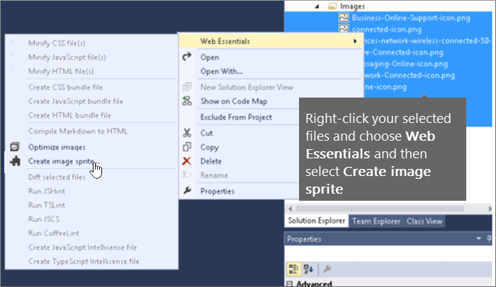

# SharePoint Online의 축소 및 묶음Minification and bundling in SharePoint Online

이 문서에서는 웹 Essentials에서 축소 및 묶음 기법을 사용 하 여 HTTP 요청 수를 줄이고 SharePoint Online에서 페이지를 로드 하는 데 걸리는 시간을 줄이기 위한 방법을 설명 합니다.This article describes how to use minification and bundling techniques with Web Essentials to reduce the number of HTTP requests and to reduce the time it takes to load pages in SharePoint Online.
  
웹 사이트를 사용자 지정 하는 경우 사용자 지정을 지원 하기 위해 서버에 많은 수의 추가 파일을 추가할 수 있습니다.When you customize your website you can end up adding a large number of extra files to the server to support the customization. JavaScript, CSS 및 이미지를 추가 하면 서버에 대 한 HTTP 요청 수가 증가 하 여 웹 페이지를 표시 하는 데 소요 되는 시간이 길어집니다.Adding extra JavaScript, CSS, and images increases the number of HTTP requests to the server which in turn increases the time it takes to display a web page. 유형이 같은 파일이 여러 개 있는 경우 이러한 파일을 묶어 파일을 보다 빠르게 다운로드할 수 있습니다.If you have multiple files of the same type, you can bundle these files to make downloading these files faster.
  
JavaScript 및 CSS 파일의 경우에는 공백 및 기타 필요 하지 않은 문자를 제거 하 여 전체 파일 크기를 줄이는 축소 방식으로 사용할 수도 있습니다.For JavaScript and CSS files, you can also use an approach called minification, where you reduce the total size of files by removing whitespace and other characters that aren't necessary.
  
## Web Essentials를 사용 하 여 JavaScript 및 CSS 파일 축소 및 묶음Minification and bundling JavaScript and CSS files with Web Essentials

Web Essentials와 같은 타사 소프트웨어를 사용 하 여 CSS 및 JavaScript 파일을 묶을 수 있습니다.You can use third-party software such as Web Essentials to bundle CSS and JavaScript files.
  
> [!IMPORTANT]
> Web Essentials는 타사의 오픈 소스, 커뮤니티 기반 프로젝트입니다.Web Essentials is a third-party, open-source, community-based project. 이 소프트웨어는 Visual Studio 2012 및 Visual Studio 2013의 확장 이며 Microsoft에서 지원 되지 않습니다.The software is an extension to Visual Studio 2012 and Visual Studio 2013 and is not supported by Microsoft. Web Essentials를 다운로드 하려면에서 [https://vswebessentials.com/download](https://go.microsoft.com/fwlink/p/?LinkId=525629)웹 사이트를 방문 하세요.To download Web Essentials, visit the website at [https://vswebessentials.com/download](https://go.microsoft.com/fwlink/p/?LinkId=525629). 
  
Web Essentials에서는 다음과 같은 두 가지 형태의 번들을 제공 합니다.Web Essentials offers two forms of bundling:
  
- . 번들: CSS 및 JavaScript 파일용.bundle: for CSS and JavaScript files
    
- 스프라이트: 이미지 (Visual Studio 2013 에서만 사용 가능).sprite: for images (only available in Visual Studio 2013)
    
다음과 같이 사용자 지정 마스터 페이지 내에서 참조 되는 일부 브랜딩 요소와 기존 기능이 있는 경우 Web Essentials를 사용할 수 있습니다.You can use Web Essentials if you have an existing feature with some branding elements that are referenced inside a custom master page, such as:
  

  
 **Web Essentials에서 TE000127218 및 CSS 번들을 만들려면****To create a TE000127218 and CSS bundle in Web Essentials**
  
1. Visual Studio의 솔루션 탐색기에서 번들에 포함할 파일을 선택 합니다.In Visual Studio, in Solution Explorer, select the files that you want to include in the bundle.
    
2. 선택한 파일을 마우스 오른쪽 단추로 클릭 한 다음 상황에 맞는 메뉴에서 **Web Essentials** \> **Create JavaScript 번들 파일** 을 선택 합니다.Right-click the selected files and then select **Web Essentials** \> **Create JavaScript bundle file** from the context menu. 예:For example: 
    
    
  
## 번들 JavaScript 및 CSS 파일 묶음 결과 보기Viewing the results of bundling JavaScript and CSS files

JavaScript 및 CSS 번들을 만들 때 Web Essentials에서는 JavaScript 및 CSS 파일 뿐만 아니라 기타 구성 정보도 식별 하는 조리법 파일 이라는 XML 파일을 만듭니다.When you create a JavaScript and CSS bundle, Web Essentials creates an XML file called a recipe file that identifies the JavaScript and CSS files as well as some other configuration information: 
  

  
또한 번들 레 서 피에서가 나 플래그를 true로 설정 하면 파일 크기가 축소 되 고 함께 번들로 제공 됩니다.In addition, if the minify flag is set to true in the bundling recipe the files are reduced in size as well as bundled together. 즉, 마스터 페이지에서 참조할 수 있는 새로운 버전의 JavaScript 파일이 생성 되었습니다.This means that new, minified versions of the JavaScript files were created that you can reference in your master page.
  

  
웹 사이트에서 페이지를 로드할 때 Internet Explorer 11과 같은 웹 브라우저에서 개발자 도구를 사용 하 여 서버로 전송 된 요청 수와 각 파일을 로드 하는 데 걸린 시간을 확인할 수 있습니다.When you load a page from your web site, you can use the developer tools from your web browser, such as Internet Explorer 11, to see the number of requests sent to the server and how long each file took to load.
  
다음 그림은 축소 전에 JavaScript 및 CSS 파일을 로드 한 결과입니다.The following figure is the result of loading the JavaScript and CSS files before minification.
  

  
CSS 및 JavaScript 파일을 함께 묶음 한 후에는 요청 수가 74 개까지 손실 되 고 각 파일에 개별적으로 다운로드 하기 위한 원본 파일 보다 약간 더 오래 걸렸습니다.After bundling the CSS and JavaScript files together, the number of requests dropped to 74 and each file took only slightly longer than the original files to download individually:
  

  
번들을 만든 후 JavaScript 번들 파일은 815KB에서 365KB로 크게 줄어듭니다.After bundling, the JavaScript bundle file is reduced significantly from 815KB to 365KB:
  

  
## 이미지 스프라이트를 만들어 이미지 묶음Bundling images by creating an image sprite

JavaScript 및 CSS 파일을 묶는 방법과 마찬가지로, 여러 개의 작은 아이콘 및 기타 일반 이미지를 큰 스프라이트 시트에 결합 한 다음 CSS를 사용 하 여 개별 이미지를 표시할 수 있습니다.Similar to how you bundle JavaScript and CSS files, you can combine many small icons and other common images into a larger sprite sheet and then use CSS to reveal the individual images. 사용자의 웹 브라우저에서 개별 이미지를 다운로드 하는 대신 스프라이트 시트를 한 번 다운로드 한 다음 로컬 컴퓨터에 캐시 합니다.Instead of downloading each individual image, the user's web browser downloads the sprite sheet once and then caches it on the local computer. 이를 통해 웹 서버로의 다운로드 및 라운드트립 횟수를 줄여서 페이지 로드 성능을 향상 시킬 수 있습니다.This improves page load performance by cutting down on the number of downloads and round trips to the web server.
  
 **Web Essentials에서 이미지 스프라이트를 만들려면****To create an image sprite in Web Essentials**
  
1. Visual Studio의 솔루션 탐색기에서 번들에 포함할 파일을 선택 합니다.In Visual Studio, in Solution Explorer, select the files that you want to include in the bundle.
    
2. 선택한 파일을 마우스 오른쪽 단추로 클릭 한 다음 상황에 맞는 메뉴에서 **Web Essentials** \> **만들기 이미지 스프라이트** 를 선택 합니다.Right-click the selected files and then select **Web Essentials** \> **Create image sprite** from the context menu. 예:For example: 
    
    
  
3. 스프라이트 파일을 저장할 위치를 선택 합니다.Choose a location to save the sprite file. Sprite 파일은 스프라이트의 설정 및 파일을 설명 하는 XML 파일입니다.The .sprite file is an XML file that describes the settings and files in the sprite. 다음 그림에서는 스프라이트 PNG 파일 및 해당 스프라이트 XML 파일의 예를 보여 줍니다.The following figures show an example of a sprite PNG file and its corresponding .sprite XML file.
    
    
  
    
  

