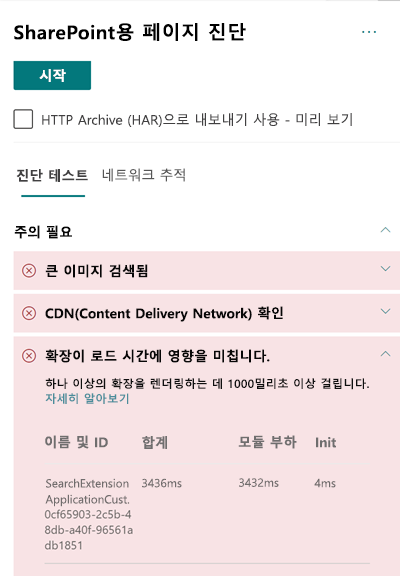

# SharePoint Online 최신 사이트 페이지에서 사용자 지정 확장 성능 최적화Optimize custom extension performance in SharePoint Online modern site pages

이 문서는 사용자 지정 확장이 사용자가 인식하는 대기 시간에 미치는 영향을 확인하는 방법 및 일반적인 문제를 해결하는 방법을 이해하는데 도움을 줄 것입니다.This article will help you understand how to determine how custom extensions affect user perceived latency, and how to remediate common issues.

## SharePoint용 페이지 진단 도구를 사용하여 사용자 지정 확장 분석Use the Page Diagnostics for SharePoint tool to analyze custom extensions

SharePoint용 페이지 진단 도구는 새 Microsoft Edge에 대한 브라우저 확장입니다. (SharePoint Online 최신 포털 및 클래식 게시 사이트 페이지를 분석하는 https://www.microsoft.com/edge) 및 Chrome 브라우저)The Page Diagnostics for SharePoint tool is a browser extension for the new Microsoft Edge (https://www.microsoft.com/edge) and Chrome browsers that analyzes both SharePoint Online modern portal and classic publishing site pages. 이 도구는 정의된 성능 기준의 집합 대비 페이지 수행 방식을 보여주는 분석된 각 페이지에 대한 보고서를 제공합니다.The tool provides a report for each analyzed page showing how the page performs against a defined set of performance criteria. Sharepoint용 페이지 진단 도구에 대해 배우고 설치하려면[Sharepoint Online에 페이지 진단 도구 사용](page-diagnostics-for-spo.md)을 참조하세요.To install and learn about the Page Diagnostics for SharePoint tool, visit [Use the Page Diagnostics tool for SharePoint Online](page-diagnostics-for-spo.md).

>[!NOTE]
>페이지 진단 도구는 SharePoint Online에서만 사용할 수 있으며 SharePoint 시스템 페이지에서는 사용할 수 없습니다.The Page Diagnostics tool only works for SharePoint Online, and cannot be used on a SharePoint system page.

Sharepoint용 페이지 진단 도구를 사용하여 Sharepoint 사이트 페이지를 분석하는 경우 \*\* 확장에서 기준치를 초과하는 사용자 지정 확장이 _진단 테스트_ 창에서 로드 시간\*\* 결과에 미치는 영향에 대한 정보를 확인할 수 있습니다.When you analyze a SharePoint site page with the Page Diagnostics for SharePoint tool, you can see information about custom extensions that exceed the baseline metric in the **Extensions are impacting load time** result in the _Diagnostic tests_ pane.

잠정 결과는 다음과 같습니다:Possible results include:

- **주의 필요** (빨간색): 로드하는데 **1**초 보다 긴 시간이 걸리는 모든 _사용자 지정_ 확장**Attention required** (red): Any _custom_ extension that takes longer than **one** second to load. 테스트 결과에 표시되는 총 로드 시간은 모듈 로드 및 초기화로 나누어집니다.Total load time as displayed in test results is broken down by module load and init.
- **필요한 작업 없음** (녹색): 로드하는데 1초 보다 긴 시간이 걸리는 확장은 없습니다.**No action required** (green): No extension is taking longer than one second to load.

확장이 페이지 로드 시간에 영향을 미치는 경우 결과는 결과의 **주의 필요** 구역에 나타납니다.If an extension is impacting page load time, the result appears in the **Attention required** section of the results. 결과를 클릭하여 느리게 로드되는 확장에 대한 세부 정보를 확인합니다.Click the result to see details about which extension is loading slowly. 차후 SharePoint 용 페이지 진단 도구를 업데이트는 분석 규칙에 대한 업데이트를 포함할 수 있으므로 항상 최신 버전의 도구를 보유하고 있는지 확인하세요.Future updates to the Page Diagnostics for SharePoint tool may include updates to analysis rules, so please ensure you always have the latest version of the tool.

결과로 제공되는 정보는 다음을 포함합니다:Information available in the results includes:

- **이름 및 ID**는 페이지에서 확장을 찾는데 도움이 될 수 있는 식별정보를 표시합니다.**Name and ID** shows identifying information that can help you find the extension on the page
- **전체 결과**는 확장이 초기화하고 로드하는 데 걸리는 총 시간을 표시합니다.**Total** shows the total time for the extension to initialize and load
- **모듈 로드**는 확장을 가지고 와서 로드하는데 걸리는 시간을 표시합니다.**Module Load** shows the time taken to fetch and load the extension
- **초기화**는 확장이 초기화하는 데 걸리는 시간을 표시합니다.**Init** shows the time taken for the extension to initialize

이 정보는 디자이너 및 개발자가 문제를 해결하는데 도움을 주기 위해 제공됩니다.This information is provided to help designers and developers troubleshoot issues. 이 정보는 디자인 및 개발 팀에 제공해야 합니다.This information should be provided to your design and development team.

## 확장 개요Overview of extensions

SharePoint Framework (SPFx) 확장은 SharePoint 사용자 환경을 확장하는 데 사용될 수 있습니다.SharePoint Framework (SPFx) Extensions can be used to extend the SharePoint user experience. SharePoint Framework 확장을 사용하여 알림 영역, 도구 모음 및 목록 데이터 보기를 포함하여 SharePoint 환경의 여러 패싯을 사용자 지정할 수 있습니다.With SharePoint Framework Extensions, you can customize more facets of the SharePoint experience, including notification areas, toolbars, and list data views.

확장은 필요한 작업을 수행하기 위해 CPU 및 네트워크 리소스를 사용하기 때문에 SharePoint 페이지의 성능에 좋지 않은 영향을 미칠 수 있습니다.Extensions can have a bad influence on the performance of a SharePoint page as it also takes CPU and network resources to do required work.

확장에는 다음과 같은 네 가지 유형이 있습니다.There are four types of extensions:

- **응용 프로그램 사용자 지정자**는 페이지에 스크립트를 추가하고 잘 알려진 HTML 요소 자리 표시자에 액세스하여 사용자 지정 렌더링으로 확장합니다.**Application Customizers** adds scripts to the page, and accesses well-known HTML element placeholders and extends them with custom renderings.
- **필드 사용자 지정자**는 목록 내에서 필드에 대한 데이터에 수정된 보기를 제공합니다.**Field Customizers** provides modified views to data for fields within a list.
- **명령 집합**은 새 작업을 추가하기 위해 SharePoint 명령 표면을 확장하고 동작을 구현하는 데 사용할 수 있는 클라이언트 쪽 코드를 제공합니다.**Command Sets** extend the SharePoint command surfaces to add new actions, and provides client-side code that you can use to implement behaviors.
- **검색 쿼리 한정자 (미리 보기만)** 는 검색 쿼리를 실행하기 직전에만 호출됩니다.**Search Query Modifier (preview only)** are invoked just before the search query is executed.

## 확장 성능 문제 해결Remediate extension performance issues

**확장이 페이지 로드 시간 결과에 영향을 미칩니다**에 나열된 확장의 성능 문제를 식별하고 해결하려면 이 섹션의 지침을 따릅니다.Follow the guidance in this section to identify and remediate performance issues with extensions listed in the **Extensions are impacting page load time** results.

>[!NOTE]
>응용 프로그램 사용자 지정자는 페이지 수명 주기 동안 초기 단계에서 실행될 수 있으며 페이지의 다른 확장 성능에 영향을 미칠 수 있습니다.Application customizers may be executed in the early stage during the lifecycle of a page and it may influence the performance of other extensions on the page.

페이지 진단 도구의 감사 결과는 잠재적인 성능 영향을 식별하는 데 도움이 될 수 있도록 확장을 실행하는 두 단계를 표시합니다.The audit results in the Page Diagnostic Tool will display two stages of executing an extension in order to help identify the potential performance impact.

- **모듈 로드**는 확장을 로드하는 데 걸리는 시간으로, 확장 크기에 영향을 받으므로 확장에 필요한 라이브러리를 번들하고 더 밝은 라이브러리를 선택하는 것이 좋습니다.**Module load** is how long it takes to load the extension, which is impacted by the size of an extension so it is a good idea to only bundle the necessary libraries in the extension and to also choose lighter libraries.
- **초기화**는 확장의 초기화 시간이며 확장 개발자는 확장이 불필요한 작업을 수행하고 있거나 초기화 단계에서 너무 많은 명령을 실행하고 있지 않는지 고려해야 합니다.**Init** is the initialization time of the extension and extension developers should consider whether the extension is doing unnecessary work or executing too many commands during the initializing stage.

페이지 작성자는 또한 너무 많은 확장은 페이지 성능에 부정적인 영향을 미치기 때문에 감사 결과를 사용하여 페이지가 너무 많은 확장을 가지고 있지 않는지 확인할 수 있습니다.Page authors can also use the audit result to see whether a page has too many extensions as too many extensions will negatively impact the performance of a page.

- **확장 크기 및 종속성****Extension size and dependencies**
  - 최적의 정적 리소스 다운로드를 위해서는 Office 365 CDN을 사용해야 합니다.Use of the Office 365 CDN is required for optimal static resource download. _Js/css_ 파일에는 공개 CDN 출처의 사용을 선호합니다.Public CDN origins are preferable for _js/css_ files. Office 365 CDN을 사용하는 방법에 대한 자세한 내용은 [SharePoint Online를 활용해 Office 365 Content Delivery Network(CDN) 사용하기](use-office-365-cdn-with-spo.md)를 참조하십시오.For more information about using the Office 365 CDN, see [Use the Office 365 Content Delivery Network (CDN) with SharePoint Online](use-office-365-cdn-with-spo.md).
  - SharePoint 프레임워크 (SPFx)의 일부로 제공되는_반응_ 및 _패브릭 가져오기_와 같은 프레임워크를 재사용합니다.Reuse frameworks like _React_ and _Fabric imports_ that come as part of the SharePoint Framework (SPFx). 자세한 내용은 [SharePoint 프레임워크 개요](https://docs.microsoft.com/sharepoint/dev/spfx/sharepoint-framework-overview)를 참조하세요.For more information, see [Overview of the SharePoint Framework](https://docs.microsoft.com/sharepoint/dev/spfx/sharepoint-framework-overview).
  - 최신 버전의 SharePoint 프레임워크를 사용하고 있는지 확인하고 새 버전이 가용하게 되면 업그레이드합니다.Ensure that you are using the latest version of the SharePoint Framework, and upgrade to new versions as they become available.
- **데이터 페칭/캐싱****Data fetching/caching**
  - 확장에서 표시할 데이터를 가져오기 위해 추가 서버 호출을 사용하는 경우에는 해당 서버 API가 빠르고 클라이언트 쪽 캐싱을 구현하는지 확인합니다. (규모가 큰 집합에는 _localStorage_ 혹은 _IndexDB_의 사용 등)If the extension relies on extra server calls to fetch data for display, ensure those server APIs are fast and/or implement client side caching (such as using _localStorage_ or _IndexDB_ for larger sets).
  - 중요한 데이터를 제공하는데 여러 번의 호출이 필요한 경우 서버에서 일괄 처리를 하거나 요청을 단일 호출로 통합하는 다른 방법을 고려합니다.If multiple calls are required to render critical data, consider batching on the server or other methods of consolidating requests to a single call.
  - 또는 일부 데이터 요소에 더 느린 API가 필요하지만 초기 렌더링이 중요하지 않은 경우에는 이를 중요한 데이터가 제공된 후 실행되는 별도의 호출로 분리합니다.Alternatively, if some elements of data require a slower API, but are not critical to initial rendering, decouple these to a separate call that is executed after critical data is rendered.
  - 여러 파트에서 같은 데이터를 사용하는 경우에는 공통 데이터 레이어를 활용하여 중복되는 호출을 방지합니다.If multiple parts use the same data, utilize a common data layer to avoid duplicate calls.
- **렌더링 시간****Rendering time**
  - 이미지 및 비디오와 같은 모든 미디어 소스는 컨테이너, 장치 및/또는 네트워크의 제한사항에 맞게 크기가 조정되어 불필요한 대규모 자산이 다운로드되지 않도록 합니다.Any media sources like images and videos should be sized to the limits of the container, device and/or network to avoid downloading unnecessary large assets. 콘텐츠 종속성에 대한 자세한 내용은 [SharePoint Online을 활용해 Office 365 Content Delivery Network(CDN) 사용하기](use-office-365-cdn-with-spo.md)를 참조하십시오.For more information about content dependencies, see [Use the Office 365 Content Delivery Network (CDN) with SharePoint Online](use-office-365-cdn-with-spo.md).
  - 리플로우, 복잡한 CSS 규칙이나 복잡한 애니메이션을 발생시키는 API 호출을 하지 않습니다.Avoid API calls that cause re-flow, complex CSS rules or complicated animations. 자세한 내용은 [브라우저 리플로우 최소화](https://developers.google.com/speed/docs/insights/browser-reflow)를 참조하세요.For more information, see [Minimizing browser reflow](https://developers.google.com/speed/docs/insights/browser-reflow).
  - 일련의 장기 실행 작업을 사용하지 않습니다.Avoid use of chained long running tasks. 대신 장기 실행 작업은 개별적 큐로 분리합니다.Instead, break long running tasks apart into separate queues. 자세한 내용은 [JavaScript 실행 최적화](https://developers.google.com/web/fundamentals/performance/rendering/optimize-javascript-execution)를 참조하세요.For more information, see [Optimize JavaScript Execution](https://developers.google.com/web/fundamentals/performance/rendering/optimize-javascript-execution).
  - 프레임의 생략이나 끊김현상을 방지하기 위해 비동기식 렌더링 미디어나 시각적 요소에는 해당 공간을 비축해둡니다. (_jank_로도 알려짐)Reserve corresponding space for asynchronously rendering media or visual elements to avoid skipped frames and stuttering (also known as _jank_).
  - 특정 브라우저가 렌더링에 사용되는 기능을 지원 하지 않는 경우 polyfill을 로드하거나 종속 코드의 실행을 제외합니다.If a certain browser doesn't support a feature used in rendering, either load a polyfill or exclude running dependent code. 기능이 중요하지 않은 경우 메모리 유출을 방지하기 위해 이벤트 핸들러 등의 리소스를 삭제합니다.If the feature is not critical, dispose resources such as event handlers to avoid memory leaks.

성능 문제를 개선하기 위해 페이지를 수정하기 전에 분석 결과에 페이지 로드 시간을 기록해 둡니다.Before you make page revisions to remediate performance issues, make a note of the page load time in the analysis results. 수정 후에 다시 도구를 실행하여 새 결과가 기준선 표준에 포함되는지 확인하고 새 페이지 로드 시간을 확인하여 개선이 되었는지 확인합니다.Run the tool again after your revision to see if the new result is within the baseline standard, and check the new page load time to see if there was an improvement.

>[!NOTE]
>페이지 로드 시간은 네트워크 부하, 하루 중 시간 및 기타 일시적인 조건과 같은 다양한 요인에 따라 다를 수 있습니다.Page load time can vary based on a variety of factors such as network load, time of day, and other transient conditions. 결과의 평균을 내는데 도움이 되도록 수정을 하기 전과 후에 페이지 로드 시간을 몇 번 정도 테스트해야 합니다.You should test page load time a few times before and after making changes to help you average the results.

## 관련 항목Related topics

[SharePoint Online 성능 조정Tune SharePoint Online performance](tune-sharepoint-online-performance.md)

[Office 365 성능 조정Tune Office 365 performance](tune-office-365-performance.md)

[최신 SharePoint 환경의 성능Performance in the modern SharePoint experience](https://docs.microsoft.com/sharepoint/modern-experience-performance)

[콘텐츠 배달 네트워크Content delivery networks](content-delivery-networks.md)

[sharepoint Online을 활용해 Office 365 콘텐츠 배달 네트워크(CDN) 사용하기Use the Office 365 Content Delivery Network (CDN) with SharePoint Online](use-office-365-cdn-with-spo.md)