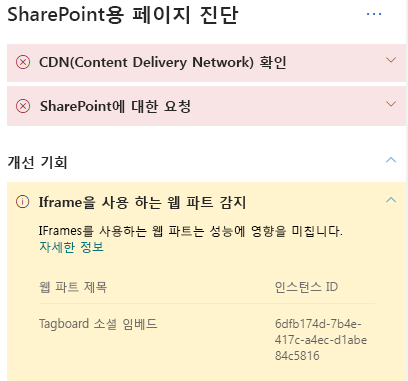

# SharePoint Online 모던 및 클래식 게시 사이트 페이지에서 Iframe 최적화Optimize iFrames in SharePoint Online modern and classic publishing site pages

IFrames는 비디오나 기타 미디어와 같은 풍부한 콘텐츠를 미리 보는데 유용할 수 있습니다.iFrames can be useful for previewing rich content such as videos or other media. 그러나 iFrame은 SharePoint 사이트 페이지 내에서 별도의 페이지를 로드하므로 iFrame에서 로드된 콘텐츠에는 전체 페이지 로드 시간을 유발하고 페이지에서 제어할 수 없는 대형 이미지, 비디오 또는 기타 요소가 포함될 수 있습니다.However, because iFrames load a separate page within the SharePoint site page, content loaded in the iFrame could contain large images, videos or other elements that can contribute to overall page load times and that you cannot control on the page. 이 문서는 페이지의 iFrame이 어떻게 사용자가 인식하는 대기 시간에 미치는 영향을 미치는지와 일반적인 문제를 해결하는 방법을 이해하는데 도움을 줄 것입니다.This article will help you understand how to determine how iFrames in your pages affect user perceived latency, and how to remediate common issues.

>[!NOTE]
>SharePoint Online 최신 사이트의 성능에 대한 자세한 내용은 [최신 SharePoint 환경의 성능](https://docs.microsoft.com/sharepoint/modern-experience-performance)을 참조하세요.For more information about performance in SharePoint Online modern sites, see [Performance in the modern SharePoint experience](https://docs.microsoft.com/sharepoint/modern-experience-performance).

## SharePoint 용 페이지 진단 도구를 사용한 iFrames를 사용하는 웹 파트 분석Use the Page Diagnostics for SharePoint tool to analyze web parts using iFrames

**Sharepoint 페이지 진단 도구**는 Chrome 및 [ Microsoft Edge 버전 77 이상](https://www.microsoftedgeinsider.com/download?form=MI13E8&OCID=MI13E8)의 브라우저 확장으로서 Sharepoint 최신 및 클래식 게시 사이트 페이지를 분석하는데 사용할 수 있습니다. The **Page Diagnostics for SharePoint tool** is a browser extension for Chrome and [Microsoft Edge version 77 or later](https://www.microsoftedgeinsider.com/download?form=MI13E8&OCID=MI13E8) you can use to analyze SharePoint both modern and classic publishing site pages. 이 도구는 정의된 성능 기준의 집합 대비 페이지 수행 방식을 보여주는 분석된 각 페이지에 대한 보고서를 제공합니다.The tool provides a report for each analyzed page showing how the page performs against a defined set of performance criteria. Sharepoint용 페이지 진단 도구에 대해 배우고 설치하려면[Sharepoint Online에 페이지 진단 도구 사용](page-diagnostics-for-spo.md)을 참조하세요.To install and learn about the Page Diagnostics for SharePoint tool, visit [Use the Page Diagnostics tool for SharePoint Online](page-diagnostics-for-spo.md).

Sharepoint용 페이지 진단 도구를 사용하여 Sharepoint 사이트 페이지를 분석 시 _진단 테스트_ 창에서 iFrames를 포함하는 웹 파트에 대한 정보를 확인할 수 있습니다.When you analyze a SharePoint site page with the Page Diagnostics for SharePoint tool, you can see information about web parts containing iFrames in the _Diagnostic tests_ pane. 기준 메트릭은 최신 페이지와 클래식 페이지 모두 동일합니다.The baseline metric is the same for modern and classic pages.

잠정 결과는 다음과 같습니다:Possible results include:

- **주의 필요** (빨간색):이 페이지에는 iFrame을 사용하는 **세 개 이상**의 웹 파트가 포함되어 있습니다.**Attention required** (red): The page contains **three or more** web parts using iFrames
- **개선 기회** (노란색):이 페이지에는 **하나 또는 두 개**의 iFrame을 사용하는 웹 파트가 포함되어 있습니다.**Improvement opportunities** (yellow): The page contains **one or two** web parts using iFrames
- **조치가 필요하지 않음** (녹색): 페이지에 iFrame을 사용하는 웹 파트가 포함되어 있지 않음**No action required** (green): The page contains no web parts using iFrames

**검색된 iFrame을 사용하는 웹 파트** 결과가결과의 **개선 기회** 또는 **주의 필요** 섹션에 표시되는 경우 결과를 클릭하여 iFrame을 포함하는 웹 파트를 확인할 수 있습니다.If the **Web parts using iFrames detected** result appears in either the **Improvement opportunities** or **Attention required)** section of the results, you can click the result to see the web parts that contain iFrames.

## iFrame 성능 문제 해결Remediate iFrame performance issues

페이지 진단 도구를 사용하여 **검색된 iFrames를 사용하는 웹 파트** 결과를 활용하여 iFrames를 포함하는 웹 파트를 판단하고 페이지의 로드 시간을 느리게 할 수 있는 웹 파트를 판단합니다.Use the **Web parts using iFrames detected** result in the Page Diagnostic tool to determine which web parts contain iFrames and may be contributing to slow page load times.

iFrame은 javascript, CSS 및 framework 요소와 같은 모든 관련 콘텐츠를 포함하는 별도의 외부 페이지를 로드하여 두 개 이상의 요소로 사이트 페이지의 오버헤드를 잠재적으로 증가시키기 때문에 근본적으로 느립니다.iFrames are inherently slow because they load a separate external page including all associated content such as javascript, CSS and framework elements, potentially increasing the overhead of the site page by a factor of two or more.

iFrame의 최적화된 사용을 보장하기 위해 아래 지침을 따르세요.Follow the guidance below to ensure optimal use of iFrames.

- 가능 하면 미리 보기가 시작하기에 작거나 상호 작용형이 아닌 경우 iFrame 대신 이미지를 사용합니다.When possible, use images instead of iFrames if the preview is small to begin with or non-interactive.
- iFrame을 사용 해야 하는 경우에는 수치를 최소화 하고 뷰포트에서 이동시킵니다.If iFrames must be used, minimize the number and/or move them out of the viewport.
- Word, Excel 및 PowerPoint와 같은 포함된 Office 파일은 상호 작용형이지만 로드 속도가 느립니다.Embedded Office files like Word, Excel and PowerPoint are interactive, but are slow to load. 전체 문서로의 링크가 포함된 이미지 섬네일은 종종 성능이 더욱 좋습니다.Image thumbnails with a link to the full document will often perform better.
- 포함된 YouTube 비디오와 Twitter 피드는 iFrame에서 성능이 더욱 뛰어나지만 이러한 유형은 신중 하게 사용해야 합니다.Embedded YouTube videos and Twitter feeds tend to perform better in iFrames, but use these kinds of embeds judiciously.
- 분리된 웹 파트는 합리적인 예외 사항이지만, 뷰포트에서 그들의 수와 배치를 최소화해야 합니다.Isolated web parts are a reasonable exception, but minimize their number and placement in the viewport.
- iFrame이 뷰포트 외부에 있는 경우 iFrame이 보기로 들어올 때까지 iFrame의 렌더링을 지연하기 위해_IntersectionObserver_의 사용을 고려합니다. If an iFrame is located out of the viewport, consider using an _IntersectionObserver_ to delay rendering the iFrame until it comes into view.

성능 문제를 개선하기 위해 페이지를 수정하기 전에 분석 결과에 페이지 로드 시간을 기록해 둡니다.Before you make page revisions to remediate performance issues, make a note of the page load time in the analysis results. 수정 후에 다시 도구를 실행하여 새 결과가 기준선 표준에 포함되는지 확인하고 새 페이지 로드 시간을 확인하여 개선이 되었는지 확인합니다.Run the tool again after your revision to see if the new result is within the baseline standard, and check the new page load time to see if there was an improvement.

>[!NOTE]
>페이지 로드 시간은 네트워크 부하, 하루 중 시간 및 기타 일시적인 조건과 같은 다양한 요인에 따라 다를 수 있습니다.Page load time can vary based on a variety of factors such as network load, time of day, and other transient conditions. 결과의 평균을 내는데 도움이 되도록 수정을 하기 전과 후에 페이지 로드 시간을 몇 번 정도 테스트해야 합니다.You should test page load time a few times before and after making changes to help you average the results.

## 관련 항목Related topics

[SharePoint Online 성능 조정Tune SharePoint Online performance](tune-sharepoint-online-performance.md)

[Office 365 성능 조정Tune Office 365 performance](tune-office-365-performance.md)

[최신 SharePoint 환경의 성능Performance in the modern SharePoint experience](https://docs.microsoft.com/sharepoint/modern-experience-performance)
