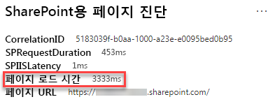

# SharePoint Online 최신 사이트 페이지에서 이미지 최적화Optimize images in SharePoint Online modern site pages

이 문서는 SharePoint Online 최신 사이트 페이지에서 이미지를 최적화하는 방법의 이해를 돕습니다.This article will help you understand how to optimize images in SharePoint Online modern site pages.

클래식 게시 사이트에서 이미지 최적화에 대한 자세한 내용은 [SharePoint Online용 이미지 최적화](image-optimization-for-sharepoint-online.md)를 참조하세요.For information about optimizing images in classic publishing sites, see [Image optimization for SharePoint Online](image-optimization-for-sharepoint-online.md)..

>[!NOTE]
>SharePoint Online 최신 포털의 성능에 대한 자세한 내용은 [최신 SharePoint 환경의 성능](https://docs.microsoft.com/sharepoint/modern-experience-performance)을 참조하세요.For more information about performance in SharePoint Online modern portals, see [Performance in the modern SharePoint experience](https://docs.microsoft.com/sharepoint/modern-experience-performance).

## SharePoint용 페이지 진단 도구를 사용한 이미지 최적화 분석Use the Page Diagnostics for SharePoint tool to analyze image optimization

**Sharepoint용 페이지 진단 도구**는 Chrome 및 [ Microsoft Edge 버전 77 이상](https://www.microsoftedgeinsider.com/download?form=MI13E8&OCID=MI13E8)의 브라우저 확장으로서 Sharepoint 최신 및 클래식 게시 사이트 페이지를 분석하는 데 사용할 수 있습니다. The **Page Diagnostics for SharePoint tool** is a browser extension for Chrome and [Microsoft Edge version 77 or later](https://www.microsoftedgeinsider.com/download?form=MI13E8&OCID=MI13E8) you can use to analyze SharePoint both modern and classic publishing site pages. 이 도구는 정의된 성능 기준의 집합 대비 페이지 수행 방식을 보여주는 분석된 각 페이지에 대한 보고서를 제공합니다.The tool provides a report for each analyzed page showing how the page performs against a defined set of performance criteria. SharePoint용 페이지 진단 도구를 설치하고 알아보려면[Sharepoint Online용 페이지 진단 도구 사용](page-diagnostics-for-spo.md)을 참조하세요.To install and learn about the Page Diagnostics for SharePoint tool, visit [Use the Page Diagnostics tool for SharePoint Online](page-diagnostics-for-spo.md).

SharePoint용 페이지 진단 도구를 사용하여 SharePoint 최신 사이트를 분석할 때 _진단 테스트_ 창에서 대용량 이미지에 대한 정보를 확인할 수 있습니다.When you analyze a SharePoint modern site with the Page Diagnostics for SharePoint tool, you can see information about large images in the _Diagnostic tests_ pane.

가능한 결과는 다음과 같습니다.Possible results include:

- **주의 필요** (빨간색): 페이지에 크기가 300KB 이상인 이미지가 **하나 이상** 포함되어 있음**Attention required** (red): The page contains **one or more** images over 300KB in size
- **조치 필요하지 않음** (녹색): 페이지에 크기가 300KB 이상인 이미지가 포함되어 있지 않음**No action required** (green): The page contains no images over 300KB in size

**대용량 이미지 검색** 결과가 **주의 필요** 구역에 나타나면 결과를 클릭하여 추가 세부 정보를 볼 수 있습니다.If the **Large images detected** result appears in the **Attention required** section of the results, you can click the result to see additional details.

## 대용량 이미지 문제 수정Remediate large image issues

페이지에 크기가 300KB 이상인 이미지를 포함하는 경우 **대용량 이미지 검색 결과**를 선택하여 대용량 이미지를 확인합니다.If a page contains images over 300KB in size, select the **Large images detected** result to see which images are too large. 최신 SharePoint Online 페이지에서 이미지 변환은 브라우저 창의 크기와 클라이언트 모니터의 해상도에 따라 자동으로 제공되고 크기가 조정됩니다.In modern SharePoint Online pages, renditions of images are automatically provided and sized depending on the size of the browser window and the resolution of the client monitor. SharePoint Online에 업로드하기 전에 웹 사용을 위해서는 항상 이미지를 최적화해야 합니다.You should always optimize images for web use prior to upload to SharePoint Online. 대용량 이미지의 크기와 해상도가 자동으로 줄어들며 예기치 않은 렌더링 특성이 생길 수 있습니다.Very large images will be automatically reduced in size and resolution which can result in unexpected rendering characteristics.

성능 문제 개선을 위해 페이지를 수정하기 전에 분석 결과에 페이지 로드 시간을 기록해 둡니다.Before you make page revisions to remediate performance issues, make a note of the page load time in the analysis results. 수정 후에 다시 도구를 실행하여 새 결과가 기준선 표준에 포함되는지 확인하고 새 페이지 로드 시간을 확인하여 개선이 되었는지 확인합니다.Run the tool again after your revision to see if the new result is within the baseline standard, and check the new page load time to see if there was an improvement.

>[!NOTE]
>페이지 로드 시간은 네트워크 부하, 하루 중 시간 및 기타 일시적인 조건과 같은 다양한 요인에 따라 다를 수 있습니다.Page load time can vary based on a variety of factors such as network load, time of day, and other transient conditions. 결과의 평균을 내는데 도움이 되도록 수정을 하기 전과 후에 페이지 로드 시간을 몇 번 정도 테스트해야 합니다.You should test page load time a few times before and after making changes to help you average the results.

## 관련 항목Related topics

[SharePoint Online 성능 조정Tune SharePoint Online performance](tune-sharepoint-online-performance.md)

[Office 365 성능 조정Tune Office 365 performance](tune-office-365-performance.md)

[최신 SharePoint 환경의 성능Performance in the modern SharePoint experience](https://docs.microsoft.com/sharepoint/modern-experience-performance)

[콘텐츠 배달 네트워크Content delivery networks](content-delivery-networks.md)

[sharepoint Online을 활용해 Office 365 콘텐츠 배달 네트워크(CDN) 사용하기Use the Office 365 Content Delivery Network (CDN) with SharePoint Online](use-office-365-cdn-with-spo.md)
