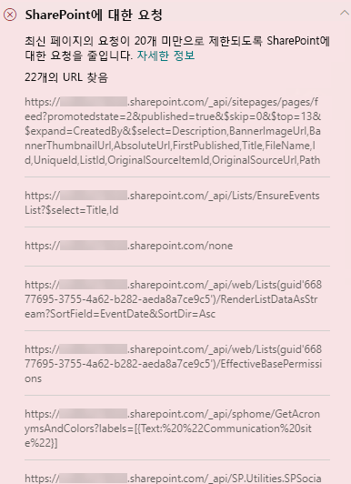
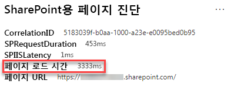

# SharePoint Online 최신 및 클래식 게시 사이트 페이지에서 페이지 호출 최적화

SharePoint Online의 최신 게시 사이트와 클래식 게시 사이트에는 SharePoint 기능과 CDNs에서 데이터를 로드 (또는 호출) 하는 링크가 포함되어 있습니다. 페이지가 더 많은 호출을 할수록 페이지를 로딩 하는데 시간이 길어집니다. 이는 **최종 사용자에게 인식되는 시간** 또는 **EUPL**으로 알려졌습니다.

이 문서는 모던 및 클래식 게시 사이트 페이지의 외부 끝점으로의 호출의 수와 영향을 확인하는 방법과 최종 사용자에게 인식되는 대기 시간에 미치는 영향을 제한하는 방법에 대해 설명합니다.

>[!NOTE]
>SharePoint Online 최신 포털의 성능에 대한 자세한 내용은 [최신 SharePoint 환경의 성능](https://docs.microsoft.com/sharepoint/modern-experience-performance)을 참조하세요.

## SharePoint 용 페이지 진단 도구를 사용한 페이지 호출 분석

**Sharepoint 페이지 진단 도구**는 Chrome 및 [ Microsoft Edge 버전 77 이상](https://www.microsoftedgeinsider.com/download?form=MI13E8&OCID=MI13E8)의 브라우저 확장으로서 Sharepoint 최신 및 클래식 게시 사이트 페이지를 분석하는데 사용할 수 있습니다.  이 도구는 정의된 성능 기준의 집합 대비 페이지 수행 방식을 보여주는 분석된 각 페이지에 대한 보고서를 제공합니다. Sharepoint용 페이지 진단 도구에 대해 배우고 설치하려면[Sharepoint Online에 페이지 진단 도구 사용](page-diagnostics-for-spo.md)을 참조하세요.

Sharepoint용 페이지 진단 도구를 사용하여 Sharepoint 사이트 페이지를 분석 시 **Sharepoint로의 요청** 결과에서 외부 호출에 대한 정보를  _진단 테스트_ 창에서 확인할 수 있습니다. 사이트 페이지가 기준선 호출 수보다 적은 수를 포함하는 경우 선이 녹색으로 표시되고 페이지가 기준선 숫자를 초과하는 경우 빨간색으로 표시 됩니다. 클래식 페이지는 HTTP 1.1 그리고 최신 페이지는 HTTP 2.0을 사용하므로 최신 페이지와 클래식 페이지의 기준선 숫자는 다릅니다:

- 최신 사이트 페이지는 **25**개 이하의 호출을 포함해야 합니다.
- 클래식 게시 페이지는 **6**개 이하의 호출을 포함해야 합니다.

잠정 결과는 다음과 같습니다:

- **주의 필요** (빨간색): 페이지가 기준선 호출 수를 초과합니다.
- **조치가 필요하지 않음** (녹색):이 페이지는 기준선 호출 수보다 적은 수의 호출을 포함합니다.

**SharePoint에 대한 요청**결과가 **주의를 요함** 섹션에 표시되는 경우 해당 결과를 클릭하 여 페이지의 총 호출 수와 URL 목록을 포함한 세부 정보를 확인할 수 있습니다.

## 페이지에서 너무 많은 호출과 관련된 성능 문제 해결

페이지에 너무 많은 호출이 포함되어 있는 경우 **Sharepoint에 대한 요청** 결과에 있는 URL 목록을 사용하여 반복적으로 되는 호출, 일괄 처리 해야 하는 호출 또는 캐시되어야 하는 데이터를 반환 하는 호출이 있는지 여부를 확인할 수 있습니다.

**휴지 (REST) 호출을 일괄 처리** 하면 성능이 저하되는 것을 방지할 수 있습니다. API 호출 일괄 처리에 대한 자세한 내용은 [REST API를 사용하여 일괄 요청 만들기](https://docs.microsoft.com/sharepoint/dev/sp-add-ins/make-batch-requests-with-the-rest-apis)를 참조하세요.

**캐시를 사용**하여 API 호출 결과를 저장하면 이후의 각 페이지 부하에 대한 추가 호출을 하는 대신 클라이언트에서 캐시된 데이터를 사용할 수 있어 웜 요청의 성능이 향상될 수 있습니다. 비즈니스 요구 사항에 따라 이 솔루션에 접근하는 방법에는 여러 가지가 있습니다. 일반적으로 데이터가 모든 사용자에게 동일한 경우, 사용자가 데이터를 SPO에서 직접 요청하지 않고 캐싱 서비스에서 요청하므로 [_Azure Redis_ cache](https://azure.microsoft.com/services/cache/)와 같은 중간 계층 캐싱 서비스를 사용하면 API 트래픽을 크게 줄일 수 있습니다.  필요한 유일한 SPO 호출은 중간 계층의 캐시를 새로 고치는 것입니다. 개별 사용자를 기준으로 데이터가 변하는 경우에는 LocalStorage 혹은 심지어 쿠키와 같은 클라이언트 쪽 캐시를 구현하는 것이 좋을 수 있습니다. 이 경우 같은 사용자가 캐시 기간 동안에 수행한 이후의 요청을 제거하여 호출을 줄일 수 있지만 전용 캐싱 서비스 보다는 효율성이 떨어집니다. PnP는 약간의 추가 개발만을 필요로 하고 LocalStorage를 사용할 수 있게 해줍니다.

성능 문제를 해결하기 위해 페이지 수정을 수행 하기 전에 분석 결과에 페이지 로드 시간을 기록해 둡니다. 수정 후에 다시 도구를 실행하여 새 결과가 기준선 표준에 포함되는지 확인하고 새 페이지 로드 시간을 확인하여 개선이 되었는지 확인합니다.

>[!NOTE]
>페이지 로드 시간은 네트워크 부하, 하루 중 시간 및 기타 일시적인 조건과 같은 다양한 요인에 따라 다를 수 있습니다. 결과의 평균을 내는데 도움이 되도록 수정을 하기 전과 후에 페이지 로드 시간을 몇 번 정도 테스트해야 합니다.

## 관련 항목

[SharePoint Online 성능 조정](tune-sharepoint-online-performance.md)

[Office 365 성능 조정](tune-office-365-performance.md)

[최신 SharePoint 환경의 성능](https://docs.microsoft.com/sharepoint/modern-experience-performance)

[콘텐츠 배달 네트워크](content-delivery-networks.md)

[sharepoint Online을 활용해 Office 365 콘텐츠 배달 네트워크(CDN) 사용하기](use-office-365-cdn-with-spo.md)
