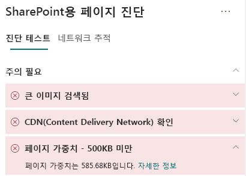

# SharePoint Online 최신 사이트 페이지에서 페이지부하 최적화Optimize page weight in SharePoint Online modern site pages

SharePoint Online 최신 사이트 페이지에는 이미지, 텍스트, 탐색/명령 모음 아래의 콘텐츠 영역에 있는 개체와 페이지의 프레임 워크를 구성하는 기타 HTML 코드를 포함하여 페이지의 페이지 콘텐츠를 제공하는데 필요한 연재된 코드가 포함되어 있습니다.  SharePoint Online modern site pages contain serialized code that is required to render page content of the page, including images, text, objects in the content area underneath navigation/command bars and other HTML code that forms the framework of the page. 페이지 부하는 이 HTML 코드에 대한 측정치며 페이지 로드 시간을 최적화하기 위해 제한되어 야 합니다.Page weight is a measurement of this HTML code, and should be limited to ensure optimal page load times.

이 문서는 최신 사이트 페이지에서 페이지 부하를 줄이는 방법을 이해하는데 도움을 줍니다.This article will help you understand how to reduce page weight in your modern site pages.

>[!NOTE]
>SharePoint Online 최신 포털의 성능에 대한 자세한 내용은 [최신 SharePoint 환경의 성능](https://docs.microsoft.com/ko-KR/sharepoint/modern-experience-performance)을 참조하세요.For more information about performance in SharePoint Online modern portals, see [Performance in the modern SharePoint experience](https://docs.microsoft.com/ko-KR/sharepoint/modern-experience-performance).

## SharePoint 용 페이지 진단 도구를 사용한 페이지 부하 분석Use the Page Diagnostics for SharePoint tool to analyze page weight

**Sharepoint 페이지 진단 도구**는 Chrome 및 [ Microsoft Edge 버전 77 이상](https://www.microsoftedgeinsider.com/en-us/download?form=MI13E8&OCID=MI13E8)의 브라우저 확장으로서 Sharepoint 최신 및 클래식 게시 사이트 페이지를 분석하는데 사용할 수 있습니다. The **Page Diagnostics for SharePoint tool** is a browser extension for Chrome and [Microsoft Edge version 77 or later](https://www.microsoftedgeinsider.com/en-us/download?form=MI13E8&OCID=MI13E8) you can use to analyze SharePoint both modern and classic publishing site pages. 이 도구는 정의된 성능 기준의 집합 대비 페이지 수행 방식을 보여주는 분석된 각 페이지에 대한 보고서를 제공합니다.The tool provides a report for each analyzed page showing how the page performs against a defined set of performance criteria. Sharepoint용 페이지 진단 도구에 대해 배우고 설치하려면[Sharepoint Online에 페이지 진단 도구 사용](page-diagnostics-for-spo.md)을 참조하세요.To install and learn about the Page Diagnostics for SharePoint tool, visit [Use the Page Diagnostics tool for SharePoint Online](page-diagnostics-for-spo.md).

Sharepoint용 페이지 진단 도구를 사용하여 Sharepoint 사이트 페이지를 분석 시 _진단 테스트_ 창의 **500KB 미만의 페이지 부하** 결과에서 페이지에 대한 정보를 확인할 수 있습니다.When you analyze a SharePoint site page with the Page Diagnostics for SharePoint tool, you can see information about page in the **Page weight under 500KB** result of the _Diagnostic tests_ pane. 페이지 부하가 기준선 값 아래에 있으면 결과는 녹색이 되고, 페이지 부하가 기준선 값을 초과하는 경우 빨간색으로 표시됩니다.The result will appear in green if the page weight is under the baseline value, and red if the page weight exceeds the baseline value.

잠정 결과는 다음과 같습니다:Possible results include:

- **주의 필요** (빨간색): 페이지 부하가 500KB를 초과**Attention required** (red): Page weight exceeds 500KB
- **조치가 필요하지 않음** (녹색): 페이지 부하가 500KB 미만**No action required** (green): Page weight is under 500KB

페이지 부하가 500KB 미만\*\* 결과가 주의 필요\*\* 섹션에 표시되는 경우 클릭하여 세부 정보를 확인할 수 있습니다.If the **Page weight under 500KB** result appears in the **Attention required** section, you can click the result for details.

## 페이지 부하 문제 수정Remediate page weight issues

페이지 부하가 500KB를 초과하는 경우 웹 파트 수를 줄이고 페이지 콘텐츠를 적절한 수준으로 제한하여 전반적인 페이지 로드 시간을 개선할 수 있습니다.If page weight exceeds 500KB, you can improve overall page load time by reducing the number of web parts and limiting page content to an appropriate degree.

페이지 부하 줄이기에 대한 일반적인 지침은 다음과 같습니다:General guidance for reducing page weight includes:

- 페이지 콘텐츠를 적정 분량으로 제한하고 관련 콘텐츠는 여러 페이지를 사용합니다.Limit the page content to a reasonable amount and use multiple pages for related content.
- 큰 속성 백이 있는 웹 파트의 사용을 최소화합니다.Minimize the use of web parts that have large property bags.
- 가능하면 비 대화형 롤업 보기를 사용합니다.Use non-interactive rollup views when possible.
- 압축 이미지 형식을 사용하여 이미지 크기를 적절하게 조정하고 이미지가 CDN에서 다운로드 되는지 확인하여 이미지 크기를 최적화합니다.Optimize image sizes by sizing images appropriately, using compressed image formats and ensuring that they are downloaded from a CDN.

다음의 문서에서 페이지 부하를 제한하는 방법에 대한 추가 지침을 확인할 수 있습니다.You can find additional guidance for limiting page weight in the following article:

- [SharePoint에서 페이지 성능 최적화Optimize page performance in SharePoint](https://docs.microsoft.com/ko-KR/sharepoint/dev/general-development/optimize-page-performance-in-sharepoint)

성능 문제를 개선하기 위해 페이지를 수정하기 전에 분석 결과에 페이지 로드 시간을 기록해 둡니다.Before you make page revisions to remediate performance issues, make a note of the page load time in the analysis results. 수정 후에 다시 도구를 실행하여 새 결과가 기준선 표준에 포함되는지 확인하고 새 페이지 로드 시간을 확인하여 개선이 되었는지 확인합니다.Run the tool again after your revision to see if the new result is within the baseline standard, and check the new page load time to see if there was an improvement.

>[!NOTE]
>페이지 로드 시간은 네트워크 부하, 하루 중 시간 및 기타 일시적인 조건과 같은 다양한 요인에 따라 다를 수 있습니다.Page load time can vary based on a variety of factors such as network load, time of day, and other transient conditions. 결과의 평균을 내는데 도움이 되도록 수정을 하기 전과 후에 페이지 로드 시간을 몇 번 정도 테스트해야 합니다.You should test page load time a few times before and after making changes to help you average the results.

## 관련 항목Related topics

[SharePoint Online 성능 조정Tune SharePoint Online performance](tune-sharepoint-online-performance.md)

[Office 365 성능 조정Tune Office 365 performance](tune-office-365-performance.md)

[최신 SharePoint 환경의 성능Performance in the modern SharePoint experience](https://docs.microsoft.com/ko-KR/sharepoint/modern-experience-performance.md)

[콘텐츠 전달 네트워크Content delivery networks](content-delivery-networks.md)

[sharepoint Online을 활용해 Office 365 콘텐츠 배달 네트워크(CDN) 사용하기Use the Office 365 Content Delivery Network (CDN) with SharePoint Online](use-office-365-cdn-with-spo.md)
