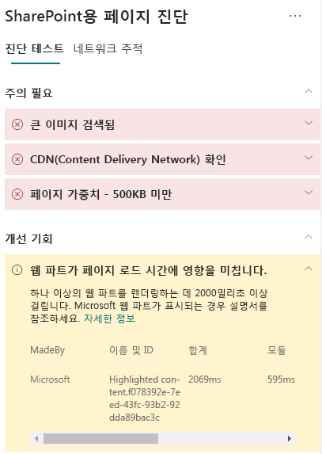

# SharePoint Online 최신 사이트 페이지에서 웹 파트 성능 최적화

>[!TIP]
>Sharepoint 사이트 페이지에서 iFrame을 최적화 하는 방법에 대한 정보는 [Sharepoint Online 최신 및 클래식 게시 사이트 페이지에서 iFrame 최적화](modern-iframe-optimization.md)를 참조하세요.

SharePoint Online 최신 사이트 페이지에는 전체 페이지 로드 시간을 유발할 수 있는 웹 파트가 포함되어 있습니다. 이 문서는 페이지의 웹 파트가 어떻게 사용자가 인식하는 대기 시간에 미치는 영향을 미치는지와 일반적인 문제를 해결하는 방법을 이해하는데 도움을 줄 것입니다.

>[!NOTE]
>SharePoint Online 최신 포털의 성능에 대한 자세한 내용은 [최신 SharePoint 환경의 성능](https://docs.microsoft.com/ko-KR/sharepoint/modern-experience-performance)을 참조하세요.

## SharePoint 용 페이지 진단 도구를 사용한 웹 파트

**Sharepoint 페이지 진단 도구**는 Chrome 및 [ Microsoft Edge 버전 77 이상](https://www.microsoftedgeinsider.com/en-us/download?form=MI13E8&OCID=MI13E8)의 브라우저 확장으로서 Sharepoint 최신 및 클래식 게시 사이트 페이지를 분석하는데 사용할 수 있습니다.  이 도구는 정의된 성능 기준의 집합 대비 페이지 수행 방식을 보여주는 분석된 각 페이지에 대한 보고서를 제공합니다. Sharepoint용 페이지 진단 도구에 대해 배우고 설치하려면[Sharepoint Online에 페이지 진단 도구 사용](page-diagnostics-for-spo.md)을 참조하세요.

Sharepoint용 페이지 진단 도구를 사용하여 Sharepoint 사이트 페이지를 분석 시 _진단 테스트_ 창의 페이지 **로드 시간 에 영향을 미치는 웹 파트** 결과에서 기준치를 초과하는 웹 파트에 대한 정보를 확인할 수 있습니다.

잠정 결과는 다음과 같습니다:

- 주의가 필요 (빨간색): 로드하는데**2초 이상 걸리는 모든 사용자 지정_ 웹 파트 테스트 결과에 표시되는 총 로드 시간은 모듈 로드, 지연 로드, 초기화 및 렌더링으로 나누어집니다.
- **개선 기회** (노란색): 페이지 로드 시간에 영향을 미칠 수 있는 항목은 이 섹션에 표시되며 검토하고 모니터링해야 합니다. 여기에는 "특별” (OOTB) Microsoft 웹 파트가 포함 될 수 있습니다. 이 섹션에 표시된 Microsoft 웹 파트의 결과는 자동으로 Microsoft에 보고되므로 **어떠한 조치도 필요하지 않습니다**. 페이지에서 성능이 매우 느리거나 페이지에 있는 **모든 Microsoft 웹 파트**가 **개선 기회** 섹션의 결과에 표시되는 경우에만 검사에 대한 지원 티켓을 기록해야 합니다. 차후 페이지 진단 도구를 업데이트 하면 Microsoft 웹 파트의 특정 구성에 따라 결과를 더 세분화하 게 됩니다.
- 조치가 필요하지 않음 (녹색): 데이터를 반환하는데 어떠한 웹 파트도 2**초를 초과하지 않습니다.

**페이지 로드 시간 결과에 영향을 미치는 웹 파트**가 **주의가 필요** 또는 **개선 기회** 섹션에 표시되는 경우 결과를 클릭하여 느리게 로드되는 웹 파트에 대한 세부정보를 확인합니다. 차후 SharePoint 용 페이지 진단 도구를 업데이트는 분석 규칙에 대한 업데이트를 포함할 수 있으므로 항상 최신 버전의 도구를 보유하고 있는지 확인하세요.

결과로 제공되는 정보에는 다음이 포함됩니다:

- 구축**은 웹 파트가 사용자 지정인지 Microsoft OOTB인지를 표시합니다.
- **이름 및 ID**는 페이지에서 웹 파트를 찾는데 도움이 될 수 있는 식별정보를 표시합니다.
- **총계**는 웹 파트가 로드되는 총 시간을 표시 합니다.
- **모듈 부하**는 웹 파트 구성요소를 가지고 와서 로드하는데 걸리는 시간을 표시합니다.
- **지연 로드**는 페이지의 메인 섹션에 표시되지 않는 웹 파트의 지연 로딩 시간을 표시합니다.
- **이니트**는 웹 파트 초기화에 소요되는 시간을 표시합니다.
- **렌더**는 웹 파트가 결과를 가져와 제공하는 데 걸리는 시간을 보여줍니다.

이 정보는 디자이너 및 개발자가 문제를 해결하는데 도움을 주기 위해 제공됩니다. 이 정보는 디자인 및 개발 팀에 제공해야 합니다.

## 웹 파트 성능 문제 해결

**웹 파트가 페이지 로드 시간 결과에 영향을 미칩니다**에 나열된 웹 파트의 성능 문제를 식별하고 해결하려면 이 섹션의 지침을 따르세요.

웹 파트 성능이 저하되는 세 가지 범주의 원인이 있습니다. 아래의 정보를 사용하여 시나리오에 적용되는 문제를 판단하고 해결할 수 있습니다.

- 웹 파트 스크립트 크기와 종속성
  - 주요 시나리오를 _보기 전용 모드_로 제공하는 초기 스크립트를 최적화합니다.
  - _가져오기 ()_ 문을 사용하여 낮은 빈도 수의 시나리오와 편집 모드 코드를 (속성 창 등) 이동시켜 분리합니다.
  - _Package.json_ 파일의 종속성을 검토하여 불필요한 코드를 완전히 제거합니다. 모든 테스트/빌드 종속성을 devDependencies으로 이동합니다.
  - 최적의 정적 리소스 다운로드를 위해서는 Office 365 CDN을 사용해야 합니다. _Js/css_ 파일에는 공개 CDN 출처의 사용을 선호합니다. Office 365 CDN을 사용하는 방법에 대한 자세한 내용은 [SharePoint Online를 활용해 Office 365 Content Delivery Network(CDN) 사용하기](use-office-365-cdn-with-spo.md)를 참조하십시오.
  - SharePoint 프레임워크 (SPFx)의 일부로 제공되는_반응 및 패브릭 가져오기_와 같은 프레임워크를 재사용합니다. 자세한 내용은 [SharePoint 프레임워크 개요](https://docs.microsoft.com/ko-KR/sharepoint/dev/spfx/sharepoint-framework-overview)를 참조하세요.
  - 최신 버전의 SharePoint 프레임워크를 사용하고 있는지 확인하고 새 버전이 가용하게 되면 업그레이드합니다.
- 데이터 페칭/캐싱
  - 웹 파트에서 표시할 데이터를 가져오기 위해 추가 서버 호출을 사용하는 경우에는 해당 서버 API가 빠르고 클라이언트 쪽 캐싱을 구현하는지 확인합니다.(규모가 큰 세트에는 _localStorage_ 혹은 _IndexDB_사용 등)
  - 중요한 데이터를 제공하는데 여러 번의 호출이 필요한 경우 서버에서 일괄 처리를 하거나 요청을 단일 호출로 통합하는 다른 방법을 고려합니다.
  - 또는 일부 데이터 요소에 더 느린 API가 필요하지만 초기 렌더링이 중요하지 않은 경우에는 이를 중요한 데이터가 제공된 후 실행되는 별도의 호출로 분리합니다.
  - 여러 파트에서 같은 데이터를 사용하는 경우에는 공통 데이터 레이어를 활용하여 중복되는 호출을 방지합니다.
- 렌더링 시간
  - 이미지 및 비디오와 같은 모든 미디어 소스는 컨테이너, 장치 및/또는 네트워크의 제한사항에 맞게 크기가 조정되어 불필요한 대규모 자산이 다운로드되지 않도록 합니다. 콘텐츠 종속성에 대한 자세한 내용은 [SharePoint Online을 활용해 Office 365 Content Delivery Network(CDN) 사용하기](use-office-365-cdn-with-spo.md)를 참조하십시오.
  - 리플로우, 복잡한 CSS 규칙이나 복잡한 애니메이션을 발생시키는 API 호출을 하지 않습니다. 자세한 내용은 [브라우저 리플로우 최소화](https://developers.google.com/speed/docs/insights/browser-reflow)를 참조하세요.
  - 일련의 장기 실행 작업을 사용하지 않습니다. 대신 장기 실행 작업은 개별적 큐로 분리합니다. 자세한 내용은 [JavaScript 실행 최적화](https://developers.google.com/web/fundamentals/performance/rendering/optimize-javascript-execution)를 참조하세요.
  - 프레임의 생략이나 끊김현상을 방지하기 위해 비동기식 렌더링 미디어나 시각적 요소에는 해당 공간을 비축해둡니다. (_jank_로도 알려짐)
  - 특정 브라우저가 렌더링에 사용되는 기능을 지원 하지 않는 경우 polyfill을 로드하거나 종속 코드의 실행을 제외합니다. 기능이 중요하지 않은 경우 메모리 유출을 방지하기 위해 이벤트 핸들러 등의 리소스를 삭제합니다.

성능 문제를 개선하기 위해 페이지를 수정하기 전에 분석 결과에 페이지 로드 시간을 기록해 둡니다. 수정 후에 다시 도구를 실행하여 새 결과가 기준선 표준에 포함되는지 확인하고 새 페이지 로드 시간을 확인하여 개선이 되었는지 확인합니다.

>[!NOTE]
>페이지 로드 시간은 네트워크 부하, 하루 중 시간 및 기타 일시적인 조건과 같은 다양한 요인에 따라 다를 수 있습니다. 결과의 평균을 내는데 도움이 되도록 수정을 하기 전과 후에 페이지 로드 시간을 몇 번 정도 테스트해야 합니다.

## 관련 항목

[SharePoint Online 성능 조정](tune-sharepoint-online-performance.md)

[Office 365 성능 조정](tune-office-365-performance.md)

[최신 SharePoint 환경의 성능](https://docs.microsoft.com/ko-KR/sharepoint/modern-experience-performance.md)

[콘텐츠 전달 네트워크](content-delivery-networks.md)

[sharepoint Online을 활용해 Office 365 콘텐츠 배달 네트워크(CDN) 사용하기](use-office-365-cdn-with-spo.md)
