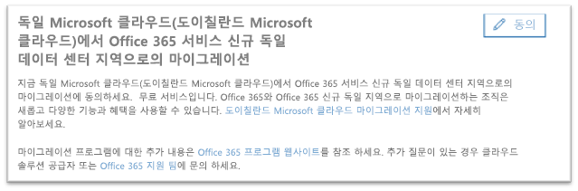
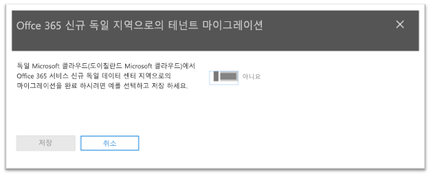
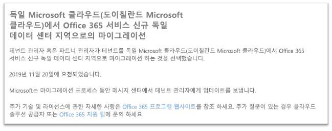

# 독일 Microsoft 클라우드(도이칠란드 Microsoft 클라우드)에서 Office 365 서비스 독일 신규 데이터 센터 지역으로 마이그레이션하도록 옵트인하는 방법How to opt-in for migration from Microsoft Cloud Germany (Microsoft Cloud Deutschland) to Office 365 services in the new German datacenter regions

>[!Note]
>이 문서는 적격 독일/도이칠란드 Microsoft 클라우드 고객에게만 적용됩니다.This article only applies to eligible Microsoft Cloud Germany/Deutschland customers.
>

## 마이그레이션을 요청하는 방법How to request migration

Microsoft 클라우드 독일에서 서비스를 제공한 적격 고객에게는 고객 테넌트 관리자가 마이그레이션을 옵트인 할 수있는 페이지가 Microsoft 365 관리 센터에 표시됩니다.Eligible customers with service provisioned in Microsoft Cloud Germany will see a page in the Microsoft 365 admin center that will allow a customer tenant administrator to opt-in for migration.

Microsoft 365 관리 센터의 페이지에 액세스하려면 왼쪽의 탐색 창에서 **설정**을 확장하고 **조직 프로필**을 클릭합니다.To access the page in the Microsoft 365 admin center, in the navigation pane on the left, expand **Settings** and then click **Organization Profile**.

**조직 프로필**페이지에서, 아래로 스크롤하여 **독일 Microsoft 클라우드(도이칠란드 Microsoft 클라우드)에서 Office 365 서비스 신규 독일 데이터 센터 지역으로의 마이그레이션**섹션으로 갑니다.On the **Organization Profile** page, scroll down to the **Migrate from Microsoft Cloud Germany (Microsoft Cloud Deutschland) to Office 365 services in the new German datacenter regions** section.

조직에서 독일 Microsoft 클라우드(도이칠란드 Microsoft 클라우드)에서 Office 365 서비스 신규 독일 데이터 센터 지역으로 서비스를 마이그레이션하려면 **옵트인**을 클릭합니다.If your organization wishes to migrate your service from Microsoft Cloud Germany (Microsoft Cloud Deutschland) to Office 365 services in the new German datacenter regions, click **Opt-in**.
 

화면 오른쪽에 새 섹션이 표시되면 확인을 수락합니다.A new section will appear on the right side of your screen to accept your confirmation. 토글 단추를 **예**로 선택한 다음 **저장**을 클릭합니다.Select the toggle button to **Yes**, and then click **Save**.
 

관리자가 테넌트를 대신하여 옵트인하면 모든 관리자는 **독일 Microsoft 클라우드(도이칠란드 Microsoft 클라우드)에서 Office 365 서비스 신규 독일 데이터 센터 지역으로의 마이그레이션** 섹션에서 옵트인 날짜를 포함한 확인 사항을 볼 수 있습니다.Once an administrator has opted-in on behalf of your tenant then all administrators will see the confirmation in **Migrate from Microsoft Cloud Germany (Microsoft Cloud Deutschland) to Office 365 services in the new German datacenter regions** section, including the date of opt-in. 또한 관리자는 Microsoft 365 관리 센터의 메시지 센터에서도 확인을 받습니다.Administrators will also receive a confirmation in Message Center of the Microsoft 365 admin center. 
 

## 마이그레이션에 대한 옵트인 후 어떻게 되나요?What happens after opting-in for migration?

Microsoft 주도 방식을 선택한 조직의 경우 2020년에 마이그레이션이 이루어질 것으로 예상됩니다.Migrations are expected to take place in 2020 for organizations that opt-in to the Microsoft-driven approach.  마이그레이션이 되면 핵심 고객 데이터 및 구독정보는 신규 독일 지역으로 이전됩니다. As a result of the migration, core customer data and subscriptions are moved to the new German regions.  Microsoft는 메시지 센터에서 마이그레이션 프로세스 전체에 걸쳐 업데이트를 보냅니다.Microsoft will send updates throughout the migration process in Message Center.

## 추가 정보More information

- [도이칠란드 Microsoft 클라우드 마이그레이션 지원Microsoft Cloud Deutschland Migration Assistance](https://aka.ms/germanymigrateassist)
- [독일 Microsoft 클라우드 고객을 위한 Office 365 마이그레이션 프로그램Office 365 migration program for Microsoft Cloud Deutschland customers](https://aka.ms/office365germanymove)
- [독일 Microsoft 클라우드 고객을 위한 Dynamics 365 마이그레이션 프로그램Dynamics 365 migration program for Microsoft Cloud Deutschland customers](https://aka.ms/d365ceoptin)
- [독일 Microsoft 클라우드 고객을 위한 Power BI 마이그레이션 프로그램Power BI migration program for Microsoft Cloud Deutschland customers](https://aka.ms/pbioptin)
- "도움이 필요하신가요?"를 사용하여 문의하세요.Submit questions using the “Need Help?” [Microsoft 365 관리 센터](https://portal.office.de/) 링크link of the [Microsoft 365 admin center](https://portal.office.de/)
