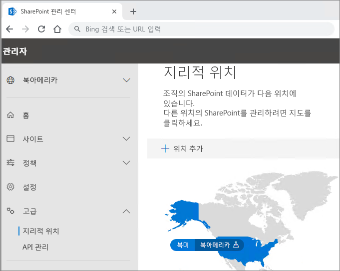

# Office 365 다중 지역 테넌트 구성

Office 365 Multi-Geo에 대한 테넌트를 구성하기 전에 [Office 365 다중 지역 계획](plan-for-multi-geo.md)을 읽었는지 확인합니다. 이 문서에 나온 단계를 수행하려면 위성 위치로 사용할 지리적 위치 목록과 해당 위치를 제공하려는 테스트 사용자가 필요합니다.

## 테넌트에 Office 365 요금제의 Multi-Geo 기능 추가

Office 365 Multi-Geo를 사용하려면 _Office 365 요금제에서 다중 지역 기능_이 필요합니다. 계정 팀과 협력하여 테넌트에 이 요금제를 추가하십시오. 귀하의 계정 팀이 귀하를 적절한 라이센스 전문가와 연결시켜 테넌트를 구성할 것입니다.

_Office 365의 Multi-Geo 기능_ 요금제는 사용자 수준 서비스 요금제입니다. 따라서 위성 위치에 호스트하려는 각 사용자를 위해 라이선스가 필요합니다. 시간에 따라 위성 위치에 사용자를 추가하면서 라이선스를 더 추가할 수 있습니다.

테넌트가 _Office 365의 Multi-Geo 기능_ 요금제로 프로비저닝되면 OneDrive 및 SharePoint 관리 센터에서 **지리적 위치** 탭을 사용할 수 있게 됩니다.

## 테넌트에 위성 위치 추가

데이터를 저장할 지리적 위치마다 위성 위치를 추가해야 합니다. 다음 표에는 사용 가능한 지역 위치가 나와 있습니다.

[!INCLUDE [Office 365 Multi-Geo locations](includes/office-365-multi-geo-locations.md)]

위성 위치를 추가하려면

1. SharePoint 관리 센터를 엽니다.

2. **지리적 위치** 탭으로 이동합니다.

3. **위치 추가**를 클릭합니다.

4. 추가하려는 위치를 선택한 후 **다음**을 클릭합니다.

5. 지리적 위치에서 사용할 도메인을 입력한 후 **추가**를 클릭합니다.

6. **닫기**를 클릭합니다.

테넌트의 크기에 따라 프로비전하는 데 몇 시간에서 72시간까지 걸릴 수 있습니다. 위성 위치의 프로비전이 완료되면 이메일 확인이 수신됩니다. 새 지리적 위치가 OneDrive 관리 센터의 **지리적 위치** 탭의 지도에 파란색으로 표시되면 사용자의 기본 설정 데이터 위치를 해당 지리적 위치로 설정할 수 있습니다. 

> [!IMPORTANT]
> 새 위성 위치가 기본 설정으로 지정됩니다. 이 경우 해당 위성 위치를 로컬 준수 요구에 적절하게 구성할 수 있습니다.

## 사용자의 기본 설정 데이터 위치 지정
 

필요한 위성 위치를 사용하도록 설정한 경우, 해당 기본 설정 데이터 위치를 사용하도록 사용자 계정을 업데이트할 수 있습니다. 해당 사용자가 기본 데이터 위치에 있더라도, 모든 사용자의 중앙 위치를 지정하는 것이 좋습니다.

> [!IMPORTANT]
> 사용자의 기본 데이터 위치가 위성 위치 또는 중앙 위치로 구성되지 않은 위치로 설정된 경우 OneDrive, SharePoint 사이트 및 그룹 사서함을 프로비저닝할 때 시스템이 중앙 위치로 기본 설정됩니다.

> [!TIP]
> Multi-Geo를 보다 광범위한 조직으로 롤아웃하기 전에 테스트 사용자 또는 소규모의 사용자 그룹을 사용하여 유효성 검사를 시작하는 것이 좋습니다.

Azure Active Directory에는 두 가지 유형의 사용자 개체(클라우드 전용 사용자 및 동기화된 사용자)가 있습니다. 사용자 유형에 해당하는 지침을 따르십시오.

### Azure Active Directory Connect를 사용하여 사용자의 기본 설정 데이터 위치 동기화 

회사의 사용자가 온-프레미스 Active Directory 시스템에서 Azure Active Directory로 동기화되면 해당 PreferredDataLocation이 AD에 입력되고 AAD와 동기화됩니다. [Azure Active Directory Connect 동기화: Office 365 리소스의 기본 데이터 위치 구성](/azure/active-directory/hybrid/how-to-connect-sync-feature-preferreddatalocation)의 프로세스에 따라 온-프레미스 Active Directory에서 Azure Active Directory로의 기본 설정 데이터 위치 동기화를 구성합니다.

표준 사용자 만들기 워크플로의 일환으로, 사용자의 기본 설정 데이터 위치를 설정하는 것이 좋습니다.

> [!IMPORTANT]
> OneDrive를 프로비저닝하지 않은 신규 사용자의 경우, 사용자의 PDL이 Azure Active Directory에 동기화 된 후 최소 24시간 동안 기다렸다가 사용자가 비즈니스용 OneDrive에 로그인하기 전에 변경 내용이 전파되도록 기다리십시오. (비즈니스용 OneDrive를 프로비저닝하기 위해 사용자가 로그인하기 전에 기본 데이터 위치를 설정하면 사용자의 새 OneDrive가 올바른 위치에 프로비저닝됩니다.)

### 클라우드 전용 사용자를 위한 기본 설정 데이터 위치 지정 

회사의 사용자가 온-프레미스 Active Directory 시스템에서 Azure Active Directory로 동기화되지 않을 경우, 즉 Office 365 또는 AAD에서 생성될 경우 AAD PowerShell을 사용하여 PDL을 설정해야 합니다.

이 섹션의 절차를 수행하려면 [Windows PowerShell용 Microsoft Azure Active Directory 모듈](https://www.powershellgallery.com/packages/MSOnline/1.1.166.0)이 필요합니다. Azure Active Directory PowerShell이 이미 설치된 경우 최신 버전으로 업데이트해야 합니다.

1.  Windows PowerShell용 Microsoft Azure Active Directory 모듈을 엽니다.

2.  `Connect-MsolService`를 실행하고 테넌트에 대한 전역 관리자 자격 증명을 입력합니다.

3.  [Set-MsolUser](https://docs.microsoft.com/powershell/msonline/v1/set-msoluser) cmdlet을 사용하여 각 사용자에 대한 기본 설정 데이터 위치를 지정합니다. 예를 들면 다음과 같습니다.

    `Set-MsolUser -userprincipalName Robyn.Buckley@Contoso.com -PreferredDatalocation EUR`

    Get-MsolUser cmdlet을 사용하여 기본 데이터 위치가 적절히 업데이트되었는지 확인할 수 있습니다. 예를 들면 다음과 같습니다.

    `(Get-MsolUser -userprincipalName Robyn.Buckley@Contoso.com).PreferredDatalocation`

사용자의 기본 데이터 위치를 표준 사용자 생성 작업 과정의 일부로 포함하는 것이 좋습니다.

> [!IMPORTANT]
> OneDrive가 프로비전닝되지 않은 새 사용자의 경우, 사용자가 OneDrive에 로그인하기 전에 변경 사항이 적용되도록 사용자의 PDL이 설정된 후 최소 24시간을 기다리십시오. (비즈니스용 OneDrive를 프로비저닝하기 위해 사용자가 로그인하기 전에 기본 데이터 위치를 설정하면 사용자의 새 OneDrive가 올바른 위치에 프로비저닝됩니다.)

## OneDrive 프로비전 및 PDL의 영향

사용자가 이미 테넌트에 OneDrive 사이트를 만든 경우 PDL을 설정해도 기존 OneDrive가 자동으로 이동하지 않습니다. 사용자의 OneDrive를 이동하려면 [비즈니스 지역 이동을 위한 OneDrive](move-onedrive-between-geo-locations.md)를 참조하십시오. 지리적 위치 간에 OneDrive를 이동하기에 있는 지침을 따르십시오. (참고로 사용자의 Exchange 사서함은 사용자의 PDL을 설정할 때 자동으로 이동합니다.)

테넌트 내에 OneDrive 사이트가 없으면 해당 사용자의 PDL가 회사의 위성 위치 중 하나와 일치한다고 가정할 경우 해당 PDL 값에 따라 OneDrive가 프로비전됩니다.

## Multi-Geo 검색 구성

Multi-Geo 테넌트에는 검색 쿼리가 테넌트 내의 어디에서든지 결과를 반환할 수 있도록 하는 집계 검색 기능이 제공됩니다.

기본적으로 각 검색 인덱스가 관련 지리적 위치 내에 있더라도, 이러한 진입점에서 검색을 수행하면 집계 결과가 반환됩니다.

- 비즈니스용 OneDrive

- Delve

- SharePoint 홈

- 검색 센터

또한 SharePoint 검색 API를 사용하는 사용자 지정 검색 응용 프로그램에 대해 Multi-Geo 검색 기능을 구성할 수 있습니다.

제한 사항 및 차이점을 비롯한 지침을 보려면 [비즈니스용 OneDrive Multi-Geo 검색 구성](configure-search-for-multi-geo.md)을 검토하세요.

## Office 365 다중 지역 구성의 유효성 검사

Office 365 Multi-Geo를 회사에 널리 도입하기 전에 유효성 검사 계획에 포함시킬 수 있는 몇 가지 기본적인 사용 사례는 다음과 같습니다. 이 테스트와 회사와 관련된 추가 사용 사례를 완료하면 초기 파일럿 그룹의 사용자를 추가할 수 있습니다.

**비즈니스용 OneDrive**

Office 365 앱 시작 관리자에서 OneDrive를 선택하고 사용자의 PDL에 따라 사용자의 적절한 지리적 위치로 자동 연결되는지 확인합니다. 이제 비즈니스용 OneDrive는 해당 위치에서 프로비저닝을 시작해야합니다. 프로비저닝이 완료되면 일부 문서를 업로드하고 다운로드하십시오.

**OneDrive 모바일 앱**

테스트 계정 자격 증명을 사용하여 OneDrive 모바일 앱에 로그인합니다. 비즈니스용 OneDrive 파일을 볼 수 있고, 모바일 장치에서 해당 파일과 상호 작용할 수 있는지 확인합니다.

**OneDrive 동기화 클라이언트**

OneDrive 동기화 클라이언트가 로그인 시 비즈니스용 OneDrive 지리적 위치를 자동으로 감지하는지 확인합니다. 동기화 클라이언트를 다운로드해야 할 경우 OneDrive 라이브러리에서 **동기화**를 클릭할 수 있습니다.

**Office 응용 프로그램**

Word와 같은 Office 응용 프로그램에서 로그인하여 비즈니스용 OneDrive에 액세스할 수 있는지 확인합니다. Office 응용 프로그램을 열고 "OneDrive- <TenantName>"을 선택합니다. Office에서 사용자의 OneDrive 위치가 감지되고 열 수 있는 파일이 표시됩니다.

**공유**

OneDrive 파일을 공유해 보세요. 사용자 선택 기능에는 모든 SharePoint Online 사용자가 해당 지리적 위치에 관계없이 표시됩니다.
